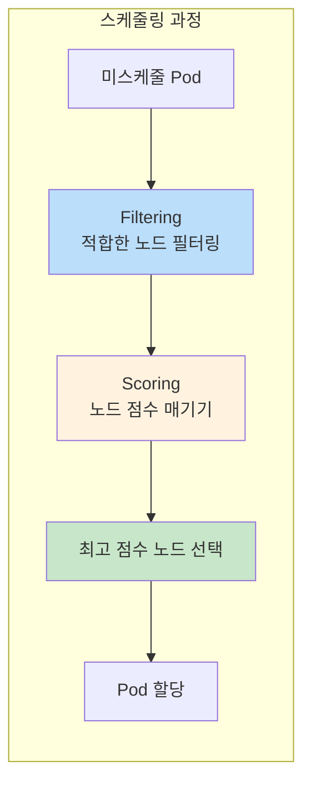
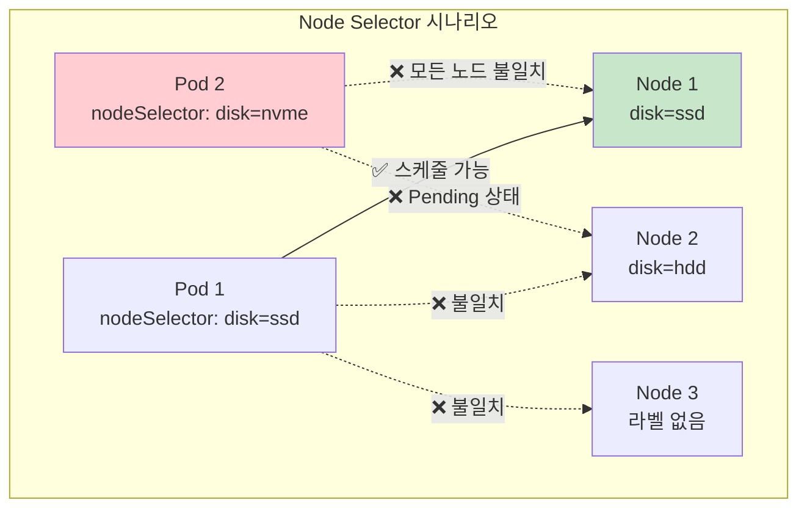
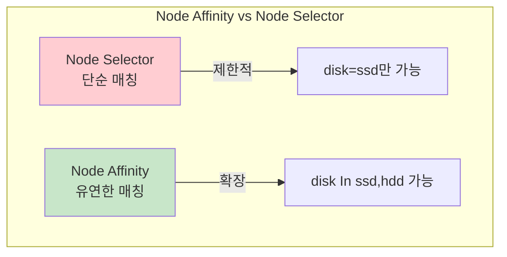
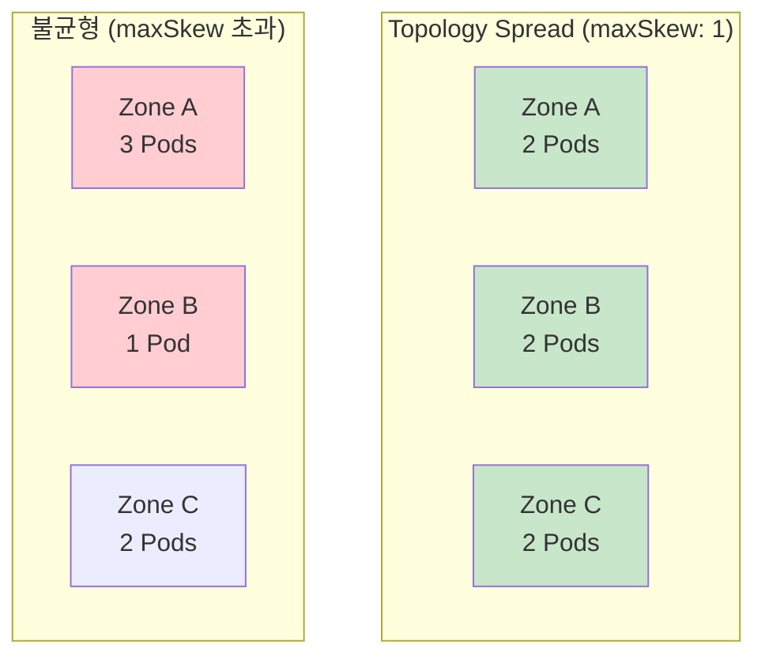

## 📌 핵심 요약
> 이 장에서는 Kubernetes Pod 스케줄링을 다룬다. 핵심은 **스케줄링 알고리즘(필터링 & 스코어링)**, **Node Selector와 Node Affinity로 노드 선택**, **Taints와 Tolerations로 노드 보호**, 그리고 **Topology Spread Constraints로 Pod 분산**을 이해하는 것이다.

## 🎯 학습 목표
이 내용을 읽고 나면:
- [ ] Pod 스케줄링 알고리즘의 동작 원리를 설명할 수 있다
- [ ] Node Selector를 사용하여 특정 노드에 Pod을 배치할 수 있다
- [ ] Node Affinity/Anti-Affinity로 유연한 노드 선택 규칙을 정의할 수 있다
- [ ] Taints와 Tolerations으로 노드를 보호하고 예외를 허용할 수 있다
- [ ] Topology Spread Constraints로 Pod를 균등하게 분산할 수 있다

## 📖 본문 정리

### 1. Pod 스케줄링 알고리즘



| 단계 | 설명 | 고려 사항 |
|------|------|-----------|
| **Filtering** | 실행 가능한 노드 목록 결정 | 하드웨어 용량, 리소스 가용성 |
| **Scoring** | 남은 노드에 점수 부여 | 리소스 요구사항, Affinity 규칙 |
| **Selection** | 최고 점수 노드 선택 | 점수가 같으면 랜덤 선택 |

> 💡 **핵심**: 요구사항을 충족하는 노드가 없으면 Pod는 `Pending` 상태로 유지됨

---

### 2. Pod가 실행 중인 노드 확인

```bash
# 방법 1: -o wide 옵션
$ kubectl get pod nginx -o wide
NAME    READY   STATUS    NODE
nginx   1/1     Running   multi-node-m03

# 방법 2: YAML에서 nodeName 확인
$ kubectl get pod nginx -o yaml | grep nodeName:
  nodeName: multi-node-m03

# 방법 3: describe 명령어
$ kubectl describe pod nginx | grep Node:
Node: multi-node-m03/192.168.49.4
```

---

### 3. Node Selector



#### 노드에 라벨 추가

```bash
# 노드에 라벨 할당
$ kubectl label node multi-node-m03 disk=ssd
node/multi-node-m03 labeled

# 노드 라벨 확인
$ kubectl get nodes --show-labels
NAME             STATUS   ROLES           LABELS
multi-node-m03   Ready    <none>          ...,disk=ssd,...
```

#### Node Selector 정의

```yaml
apiVersion: v1
kind: Pod
metadata:
  name: app
spec:
  nodeSelector:           # 노드 선택기 정의
    disk: ssd             # 라벨 key=value
  containers:
  - name: nginx
    image: nginx:1.27.1
```

| 특성 | 설명 |
|------|------|
| **요구사항 유형** | Hard (필수) |
| **매칭 방식** | 정확한 key=value 일치 |
| **복수 라벨** | 지원 (AND 조건) |
| **유연성** | 낮음 (OR, NOT 불가) |

---

### 4. Node Affinity와 Anti-Affinity

#### Node Affinity 개요



#### Node Affinity 정의

```yaml
apiVersion: v1
kind: Pod
metadata:
  name: app
spec:
  affinity:
    nodeAffinity:
      requiredDuringSchedulingIgnoredDuringExecution:   # Hard 요구사항
        nodeSelectorTerms:
        - matchExpressions:
          - key: disk
            operator: In              # 연산자
            values:
            - ssd
            - hdd                     # ssd 또는 hdd
  containers:
  - name: nginx
    image: nginx:1.27.1
```

#### Node Affinity 타입

| 타입 | 설명 | 요구사항 |
|------|------|----------|
| **requiredDuringSchedulingIgnoredDuringExecution** | 스케줄링 시 반드시 충족 | Hard |
| **preferredDuringSchedulingIgnoredDuringExecution** | 스케줄링 시 선호 (보장 안 됨) | Soft |

> ⚠️ **주의**: `IgnoredDuringExecution`은 이미 실행 중인 Pod에는 규칙 변경이 적용되지 않음을 의미

#### Node Affinity 연산자

| 연산자 | 설명 | 예시 |
|--------|------|------|
| **In** | 값이 집합에 포함 | `values: [ssd, hdd]` |
| **NotIn** | 값이 집합에 미포함 | Anti-Affinity 용도 |
| **Exists** | 키가 존재 | 값 무관 |
| **DoesNotExist** | 키가 미존재 | Anti-Affinity 용도 |
| **Gt** | 값이 더 큼 | 숫자 비교 |
| **Lt** | 값이 더 작음 | 숫자 비교 |

#### Node Anti-Affinity 정의

```yaml
apiVersion: v1
kind: Pod
metadata:
  name: app
spec:
  affinity:
    nodeAffinity:
      requiredDuringSchedulingIgnoredDuringExecution:
        nodeSelectorTerms:
        - matchExpressions:
          - key: disk
            operator: NotIn           # NotIn으로 Anti-Affinity
            values:
            - ssd
            - ebs
  containers:
  - name: nginx
    image: nginx:1.27.1
```

---

### 5. Taints와 Tolerations

```mermaid
flowchart TB
    subgraph "Taints와 Tolerations"
        TAINT[Taint<br/>노드에 추가<br/>"여기 스케줄 금지"]
        TOL[Toleration<br/>Pod에 추가<br/>"이 Taint 허용"]

        NODE[Tainted Node]
        POD1[Pod with Toleration ✅]
        POD2[Pod without Toleration ❌]
    end

    TAINT --> NODE
    TOL --> POD1
    POD1 -->|"스케줄 가능"| NODE
    POD2 -.->|"스케줄 불가"| NODE

    style TAINT fill:#ffcdd2
    style TOL fill:#c8e6c9
    style POD2 fill:#ffcdd2
```

#### 노드에 Taint 추가

```bash
# Taint 추가 (key=value:effect 형식)
$ kubectl taint node multi-node-m02 special=true:NoSchedule
node/multi-node-m02 tainted

# Taint 확인
$ kubectl get node multi-node-m02 -o yaml | grep -C 3 taints:
spec:
  taints:
  - effect: NoSchedule
    key: special
    value: "true"

# Taint 제거
$ kubectl taint node multi-node-m02 special=true:NoSchedule-
```

#### Taint Effect 종류

| Effect | 설명 | 동작 |
|--------|------|------|
| **NoSchedule** | 새 Pod 스케줄링 금지 | Hard 차단 |
| **PreferNoSchedule** | 가급적 스케줄링 회피 | Soft 제안 |
| **NoExecute** | 새 스케줄링 금지 + 기존 Pod 퇴거 | Hard + 퇴거 |

#### Toleration 정의

```yaml
apiVersion: v1
kind: Pod
metadata:
  name: app
spec:
  tolerations:
  - key: "special"         # Taint의 key와 일치
    operator: "Equal"      # Equal 또는 Exists
    value: "true"          # Taint의 value와 일치
    effect: "NoSchedule"   # Taint의 effect와 일치
  containers:
  - name: nginx
    image: nginx:1.27.1
```

> 💡 **Control Plane 보호**: Control Plane 노드는 기본적으로 `node-role.kubernetes.io/control-plane:NoSchedule` Taint가 적용됨

---

### 6. Pod Topology Spread Constraints



#### Topology Spread Constraint 정의

```yaml
apiVersion: apps/v1
kind: Deployment
metadata:
  name: web
spec:
  replicas: 6
  selector:
    matchLabels:
      app: web
  template:
    metadata:
      labels:
        app: web
    spec:
      topologySpreadConstraints:
      - maxSkew: 1                                  # 최대 불균형 허용치
        topologyKey: topology.kubernetes.io/zone   # 분산 기준 (존)
        whenUnsatisfiable: DoNotSchedule           # 충족 불가 시 동작
        labelSelector:                             # 적용 대상 Pod
          matchLabels:
            app: web
      containers:
      - name: nginx
        image: nginx:1.27.1
```

| 속성 | 설명 |
|------|------|
| **maxSkew** | 토폴로지 도메인 간 Pod 수 차이 최대값 |
| **topologyKey** | 분산 기준이 되는 노드 라벨 키 |
| **whenUnsatisfiable** | `DoNotSchedule` (Hard) 또는 `ScheduleAnyway` (Soft) |
| **labelSelector** | 분산 규칙을 적용할 Pod 선택 |

---

### 7. 스케줄링 옵션 비교

| 옵션 | 용도 | 정의 위치 | 요구사항 유형 |
|------|------|-----------|---------------|
| **Node Selector** | 특정 노드에 배치 | Pod | Hard |
| **Node Affinity** | 유연한 노드 선택 | Pod | Hard/Soft |
| **Node Anti-Affinity** | 특정 노드 회피 | Pod | Hard/Soft |
| **Taints** | 노드 보호/격리 | Node | - |
| **Tolerations** | Taint 허용 | Pod | - |
| **Topology Spread** | Pod 균등 분산 | Pod | Hard/Soft |

---

### 8. 핵심 명령어 요약

| 작업 | 명령어 |
|------|--------|
| **노드에 라벨 추가** | `kubectl label node <node> <key>=<value>` |
| **노드 라벨 확인** | `kubectl get nodes --show-labels` |
| **노드에 Taint 추가** | `kubectl taint node <node> <key>=<value>:<effect>` |
| **노드에서 Taint 제거** | `kubectl taint node <node> <key>=<value>:<effect>-` |
| **Pod 실행 노드 확인** | `kubectl get pod <name> -o wide` |
| **노드 Taint 확인** | `kubectl describe node <node> \| grep -A 5 Taints` |

---

## 🔍 심화 학습

### 추가 조사 내용
- **Pod Affinity/Anti-Affinity**: Pod 간 상대적 위치 제어 (같은 노드/다른 노드)
- **DeschedulerDescheduler**: 불균형한 Pod 분포를 재조정하는 도구
- **Priority와 Preemption**: Pod 우선순위 기반 스케줄링

### 출처
- [Kubernetes 공식 문서 - Assigning Pods to Nodes](https://kubernetes.io/docs/concepts/scheduling-eviction/assign-pod-node/)
- [Kubernetes 공식 문서 - Taints and Tolerations](https://kubernetes.io/docs/concepts/scheduling-eviction/taint-and-toleration/)
- [Kubernetes 공식 문서 - Pod Topology Spread Constraints](https://kubernetes.io/docs/concepts/scheduling-eviction/topology-spread-constraints/)

---

## 💡 실무 적용 포인트

### 이런 상황에서 기억하세요
- **하드웨어 요구사항**: GPU, SSD 등 특정 하드웨어가 필요한 워크로드 → Node Selector/Affinity
- **고가용성**: 여러 존/노드에 Pod 분산 필요 → Topology Spread Constraints
- **노드 격리**: Control Plane 보호, 전용 노드 운영 → Taints/Tolerations
- **유연한 배치**: "가급적 이 노드" 같은 선호 표현 → preferredDuringScheduling

### 주의할 점 / 흔한 실수
- ⚠️ Node Selector는 OR 조건 불가 → Node Affinity 사용
- ⚠️ Toleration의 effect를 생략하면 Taint와 매칭 실패
- ⚠️ `IgnoredDuringExecution`은 이미 실행 중인 Pod에 영향 없음
- ⚠️ Topology Spread는 새 Pod에만 적용, 기존 Pod 재배치 안 함
- ⚠️ 너무 엄격한 제약조건 → Pod가 `Pending` 상태로 멈춤

### 면접에서 나올 수 있는 질문
- Q: Node Selector와 Node Affinity의 차이점은?
- Q: Taint와 Toleration은 어떤 상황에서 사용하는가?
- Q: `requiredDuringScheduling`과 `preferredDuringScheduling`의 차이점은?
- Q: Pod가 Pending 상태일 때 스케줄링 문제를 어떻게 디버깅하는가?
- Q: Control Plane 노드에 Pod이 스케줄링되지 않는 이유는?

---

## ✅ 핵심 개념 체크리스트
- [ ] 스케줄링 알고리즘의 Filtering과 Scoring 단계를 이해하는가?
- [ ] Node Selector로 노드를 지정할 수 있는가?
- [ ] Node Affinity의 두 가지 타입(required/preferred)을 구분할 수 있는가?
- [ ] Node Affinity 연산자(In, NotIn, Exists, DoesNotExist)를 사용할 수 있는가?
- [ ] Taint를 노드에 추가하고 제거할 수 있는가?
- [ ] Toleration을 Pod에 정의할 수 있는가?
- [ ] Taint Effect(NoSchedule, PreferNoSchedule, NoExecute)의 차이를 아는가?
- [ ] Topology Spread Constraints의 maxSkew 개념을 이해하는가?

---

## 🔗 참고 자료
- 📄 공식 문서: [Assigning Pods to Nodes](https://kubernetes.io/docs/concepts/scheduling-eviction/assign-pod-node/)
- 📄 공식 문서: [Taints and Tolerations](https://kubernetes.io/docs/concepts/scheduling-eviction/taint-and-toleration/)
- 📄 공식 문서: [Topology Spread Constraints](https://kubernetes.io/docs/concepts/scheduling-eviction/topology-spread-constraints/)
- 📄 API 참조: [PodSpec](https://kubernetes.io/docs/reference/kubernetes-api/workload-resources/pod-v1/#scheduling)
- 📘 GitHub: [bmuschko/cka-study-guide](https://github.com/bmuschko/cka-study-guide)

---
