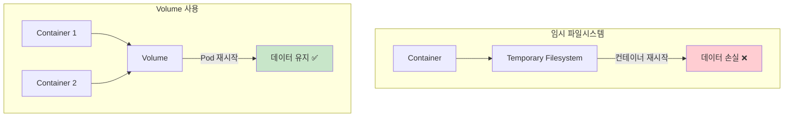
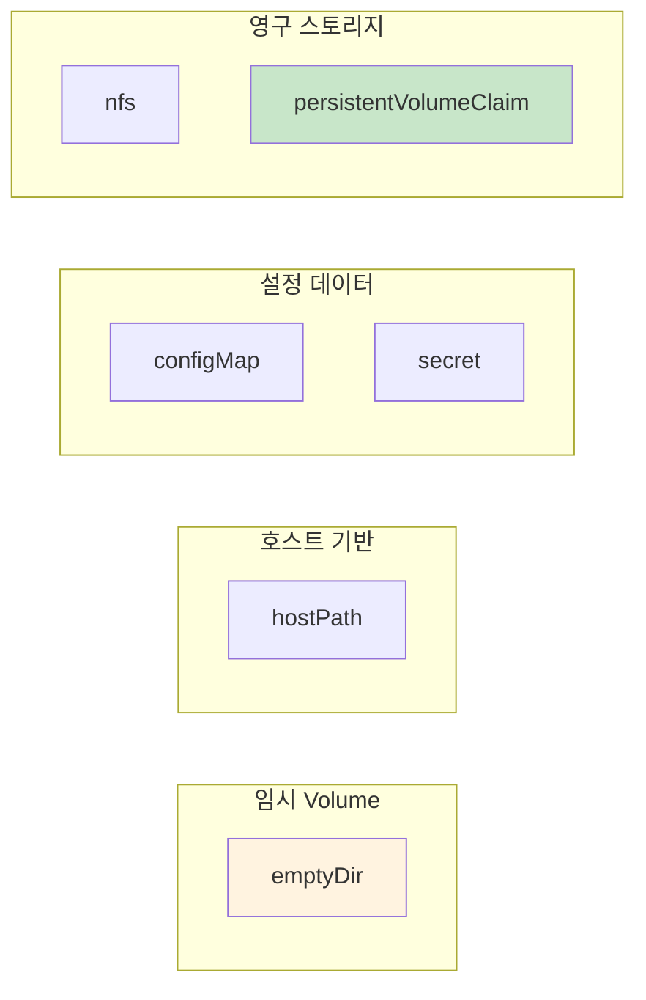
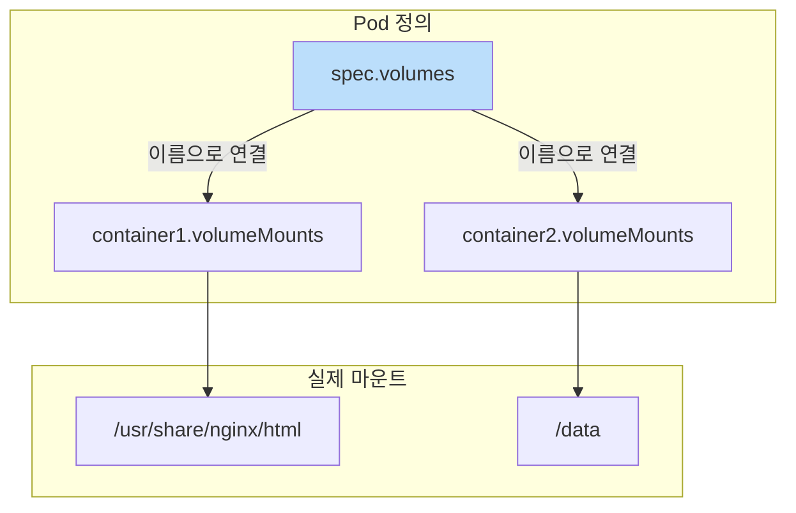

## 📌 핵심 요약
> 이 장에서는 Kubernetes Volume의 기본 개념을 다룬다. 핵심은 **Volume의 목적(데이터 유지, 공유, 스토리지 분리)**, **다양한 Volume 타입(emptyDir, hostPath 등)**, 그리고 **Volume 정의 및 마운트 방법**을 이해하는 것이다.

## 🎯 학습 목표
이 내용을 읽고 나면:
- [ ] 컨테이너의 임시 파일시스템과 Volume의 차이를 설명할 수 있다
- [ ] Volume의 주요 사용 목적을 이해할 수 있다
- [ ] 다양한 Volume 타입과 그 특성을 구분할 수 있다
- [ ] Pod에 Volume을 정의하고 컨테이너에 마운트할 수 있다

## 📖 본문 정리

### 1. 컨테이너 파일시스템 vs Volume



| 구분 | 임시 파일시스템 | Volume |
|------|-----------------|--------|
| **범위** | 단일 컨테이너 | Pod 내 여러 컨테이너 공유 가능 |
| **수명** | 컨테이너 수명과 동일 | Volume 타입에 따라 다름 |
| **재시작 시** | 데이터 손실 | 데이터 유지 가능 |

> 💡 **핵심**: Volume은 Pod 내 컨테이너 간 공유 가능한 디렉토리

---

### 2. Volume의 목적

| 목적 | 설명 | 예시 |
|------|------|------|
| **데이터 유지 (Persistence)** | 컨테이너 재시작 후에도 데이터 보존 | 데이터베이스 파일, 로그 |
| **데이터 공유 (Sharing)** | Pod 내 여러 컨테이너 간 파일 공유 | 사이드카 패턴 |
| **스토리지 분리 (Decoupling)** | 스토리지 세부사항을 애플리케이션에서 추상화 | 백엔드 변경 용이 |

---

### 3. Volume 타입



#### 시험에 관련된 주요 Volume 타입

| 타입 | 설명 | 수명 |
|------|------|------|
| **emptyDir** | Pod 시작 시 생성되는 빈 디렉토리 | Pod 수명과 동일 |
| **hostPath** | 호스트 노드의 파일/디렉토리 마운트 | 노드에 영구 저장 |
| **configMap** | ConfigMap 데이터를 파일로 주입 | ConfigMap 수명 |
| **secret** | Secret 데이터를 파일로 주입 | Secret 수명 |
| **nfs** | NFS 공유 마운트 | 영구 (Pod 재시작 후 유지) |
| **persistentVolumeClaim** | PersistentVolume 요청 | PV 수명 |

---

### 4. Volume 정의 및 마운트



#### 2단계 정의 과정

| 단계 | 속성 | 설명 |
|------|------|------|
| **1. Volume 선언** | `spec.volumes[]` | Volume 이름과 타입 정의 |
| **2. Volume 마운트** | `spec.containers[].volumeMounts[]` | 컨테이너 내 마운트 경로 지정 |

#### Volume 정의 예시 (emptyDir)

```yaml
apiVersion: v1
kind: Pod
metadata:
  name: business-app
spec:
  volumes:                              # 1. Volume 선언
  - name: shared-data                   # Volume 이름
    emptyDir: {}                        # Volume 타입 (빈 디렉토리)
  containers:
  - name: nginx
    image: nginx:1.27.1
    volumeMounts:                       # 2. Volume 마운트
    - name: shared-data                 # 연결할 Volume 이름
      mountPath: /usr/share/nginx/html  # 마운트 경로
  - name: sidecar
    image: busybox:1.37.0
    volumeMounts:
    - name: shared-data
      mountPath: /data                  # 같은 Volume, 다른 경로
```

> 💡 **매칭 규칙**: `volumeMounts[].name`과 `volumes[].name`이 일치해야 함

---

### 5. emptyDir 사용 예시

```bash
# Pod 생성
$ kubectl apply -f pod-with-volume.yaml
pod/business-app created

# Pod 상태 확인 (2개 컨테이너)
$ kubectl get pod business-app
NAME           READY   STATUS    RESTARTS   AGE
business-app   2/2     Running   0          43s

# nginx 컨테이너에서 파일 생성
$ kubectl exec business-app -it -c nginx -- /bin/sh
# cd /usr/share/nginx/html
# touch example.html
# ls
example.html
# exit

# sidecar 컨테이너에서 같은 파일 확인
$ kubectl exec business-app -it -c sidecar -- /bin/sh
# ls /data
example.html    # nginx 컨테이너에서 생성한 파일이 보임!
```

---

### 6. 읽기 전용 Volume 마운트

```yaml
apiVersion: v1
kind: Pod
metadata:
  name: business-app
spec:
  volumes:
  - name: shared-data
    emptyDir: {}
  containers:
  - name: nginx
    image: nginx:1.27.1
    volumeMounts:
    - name: shared-data
      mountPath: /usr/share/nginx/html
      readOnly: true                     # 읽기 전용 설정
```

| 속성 | 값 | 설명 |
|------|-----|------|
| **readOnly** | `true` | 해당 마운트 경로에 쓰기 금지 |
| **recursiveReadOnly** | `true` | 하위 디렉토리까지 재귀적으로 읽기 전용 |

> ⚠️ **주의**: 같은 Volume을 다른 컨테이너에서 읽기-쓰기 모드로 마운트 가능

---

### 7. Volume 타입별 상세

#### emptyDir

```yaml
volumes:
- name: cache-vol
  emptyDir:
    sizeLimit: 500Mi    # 선택: 크기 제한
    medium: Memory      # 선택: 메모리 기반 (tmpfs)
```

| 옵션 | 설명 |
|------|------|
| **sizeLimit** | 볼륨 크기 제한 |
| **medium: Memory** | RAM 기반 tmpfs 사용 (더 빠름, 노드 재시작 시 손실) |

#### hostPath

```yaml
volumes:
- name: host-vol
  hostPath:
    path: /var/log       # 호스트 경로
    type: Directory      # 타입 (Directory, File, etc.)
```

| type 값 | 설명 |
|---------|------|
| **Directory** | 기존 디렉토리 (없으면 오류) |
| **DirectoryOrCreate** | 디렉토리 없으면 생성 |
| **File** | 기존 파일 (없으면 오류) |
| **FileOrCreate** | 파일 없으면 생성 |

> ⚠️ **보안 주의**: hostPath는 호스트 파일시스템에 직접 접근하므로 신중히 사용

---

### 8. 핵심 명령어 요약

| 작업 | 명령어 |
|------|--------|
| **Pod 생성** | `kubectl apply -f pod-with-volume.yaml` |
| **컨테이너 셸 접속** | `kubectl exec <pod> -it -c <container> -- /bin/sh` |
| **Volume 정보 확인** | `kubectl describe pod <pod> \| grep -A 10 Volumes` |
| **마운트 경로 확인** | `kubectl describe pod <pod> \| grep -A 5 Mounts` |

---

### 9. Volume 정의 템플릿

```yaml
apiVersion: v1
kind: Pod
metadata:
  name: <pod-name>
spec:
  volumes:                          # Volume 선언 섹션
  - name: <volume-name>
    <volume-type>: <type-config>    # emptyDir, hostPath, configMap 등
  containers:
  - name: <container-name>
    image: <image>
    volumeMounts:                   # Volume 마운트 섹션
    - name: <volume-name>           # volumes[].name과 일치
      mountPath: <container-path>   # 컨테이너 내 경로
      readOnly: <true|false>        # 선택: 읽기 전용
```

---

## 🔍 심화 학습

### 추가 조사 내용
- **Projected Volumes**: 여러 Volume 소스를 하나의 디렉토리에 투영
- **CSI (Container Storage Interface)**: 외부 스토리지 시스템 통합
- **Volume Snapshots**: Volume 스냅샷 생성 및 복원

### 출처
- [Kubernetes 공식 문서 - Volumes](https://kubernetes.io/docs/concepts/storage/volumes/)
- [Kubernetes 공식 문서 - Volume Types](https://kubernetes.io/docs/concepts/storage/volumes/#volume-types)

---

## 💡 실무 적용 포인트

### 이런 상황에서 기억하세요
- **캐시 구현**: emptyDir로 임시 캐시 저장소 제공
- **사이드카 패턴**: 메인 컨테이너와 사이드카 간 로그 파일 공유
- **설정 주입**: configMap/secret Volume으로 설정 파일 마운트
- **로그 수집**: hostPath로 호스트의 /var/log 디렉토리 접근

### 주의할 점 / 흔한 실수
- ⚠️ emptyDir은 Pod 삭제 시 데이터 손실 → 영구 저장에 부적합
- ⚠️ hostPath는 노드에 종속 → Pod이 다른 노드로 이동하면 데이터 접근 불가
- ⚠️ volumeMounts.name과 volumes.name이 일치해야 함
- ⚠️ readOnly는 해당 컨테이너에만 적용, 다른 컨테이너는 쓰기 가능
- ⚠️ hostPath 사용 시 보안 취약점 주의 (호스트 파일시스템 노출)

### 면접에서 나올 수 있는 질문
- Q: emptyDir과 hostPath의 차이점은?
- Q: Pod 내 여러 컨테이너가 데이터를 공유하는 방법은?
- Q: Volume과 PersistentVolume의 차이점은?
- Q: 컨테이너 재시작 시 데이터가 유지되는 Volume 타입은?
- Q: Volume을 읽기 전용으로 마운트하는 방법은?

---

## ✅ 핵심 개념 체크리스트
- [ ] 컨테이너 임시 파일시스템의 한계를 이해하는가?
- [ ] Volume의 세 가지 목적(유지, 공유, 분리)을 설명할 수 있는가?
- [ ] emptyDir, hostPath, configMap, secret, nfs, PVC 타입을 구분할 수 있는가?
- [ ] `spec.volumes`와 `spec.containers[].volumeMounts`의 관계를 이해하는가?
- [ ] Volume 이름으로 volumes와 volumeMounts를 연결하는 방법을 아는가?
- [ ] readOnly 마운트를 설정할 수 있는가?
- [ ] emptyDir의 수명이 Pod 수명과 동일함을 이해하는가?

---

## 🔗 참고 자료
- 📄 공식 문서: [Volumes](https://kubernetes.io/docs/concepts/storage/volumes/)
- 📄 공식 문서: [Configure a Pod to Use a Volume](https://kubernetes.io/docs/tasks/configure-pod-container/configure-volume-storage/)
- 📄 공식 문서: [Types of Volumes](https://kubernetes.io/docs/concepts/storage/volumes/#volume-types)
- 📘 참고 서적: Kubernetes Best Practices (O'Reilly)
- 📘 GitHub: [bmuschko/cka-study-guide](https://github.com/bmuschko/cka-study-guide)

---
