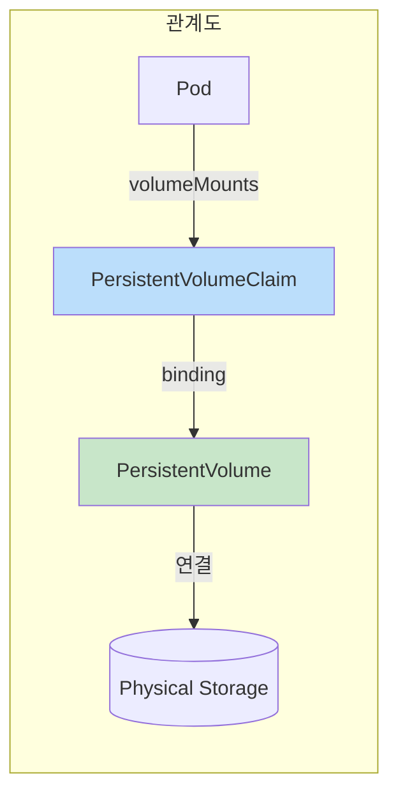
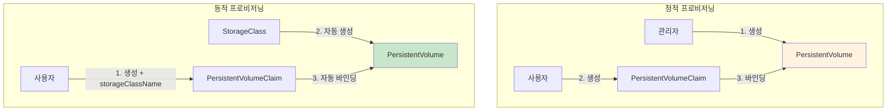
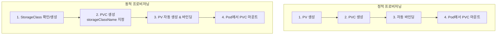

## 📌 핵심 요약
> 이 장에서는 Kubernetes Persistent Volume을 다룬다. 핵심은 **PersistentVolume(PV)과 PersistentVolumeClaim(PVC)의 관계**, **정적/동적 프로비저닝**, **Access Mode와 Reclaim Policy**, 그리고 **Storage Class를 통한 동적 프로비저닝**을 이해하는 것이다.

## 🎯 학습 목표
이 내용을 읽고 나면:
- [ ] PersistentVolume과 PersistentVolumeClaim의 관계를 설명할 수 있다
- [ ] 정적 프로비저닝으로 PV를 생성하고 PVC로 바인딩할 수 있다
- [ ] Access Mode, Reclaim Policy 등 PV 설정 옵션을 이해할 수 있다
- [ ] Storage Class를 사용한 동적 프로비저닝을 구성할 수 있다

## 📖 본문 정리

### 1. Persistent Volume 개요



| 구성요소 | 역할 | 수명 |
|----------|------|------|
| **PersistentVolume (PV)** | 실제 스토리지 리소스 | 클러스터 수명 (Pod와 독립) |
| **PersistentVolumeClaim (PVC)** | PV 요청/바인딩 | 네임스페이스 내 |
| **Pod** | PVC를 마운트하여 사용 | Pod 수명 |

> 💡 **핵심**: PV와 PVC의 바인딩은 **1:1 관계** (한 번 바인딩되면 다른 PVC가 사용 불가)

---

### 2. Persistent Volume 타입

| 타입 | 설명 | 사용 사례 |
|------|------|-----------|
| **hostPath** | 호스트 노드의 파일/디렉토리 마운트 | 개발/테스트 (프로덕션 비권장) |
| **local** | 로컬 스토리지 장치 (디스크, 파티션) | 고성능 필요 시 (Node Affinity 필수) |
| **nfs** | NFS 공유 마운트 | 다중 Pod 파일 공유 (RWX 지원) |
| **csi** | Container Storage Interface 드라이버 | 클라우드 스토리지 통합 |
| **fc** | Fibre Channel 볼륨 | 기업용 FC 스토리지 |
| **iscsi** | iSCSI 볼륨 | IP 네트워크 기반 블록 스토리지 |

---

### 3. 정적 vs 동적 프로비저닝



| 방식 | PV 생성 | 장점 | 단점 |
|------|---------|------|------|
| **정적** | 관리자가 수동 생성 | 세밀한 제어 | 관리 부담 |
| **동적** | StorageClass가 자동 생성 | 자동화, 편리 | 클라우드/CSI 필요 |

---

### 4. PersistentVolume 생성 (정적 프로비저닝)

```yaml
apiVersion: v1
kind: PersistentVolume
metadata:
  name: db-pv
spec:
  capacity:                    # 스토리지 용량
    storage: 1Gi
  accessModes:                 # 접근 모드
    - ReadWriteOnce
  persistentVolumeReclaimPolicy: Retain   # Reclaim 정책
  hostPath:                    # Volume 타입
    path: /data/db
```

```bash
# PV 생성
$ kubectl apply -f db-pv.yaml
persistentvolume/db-pv created

# PV 상태 확인
$ kubectl get pv db-pv
NAME    CAPACITY   ACCESS MODES   RECLAIM POLICY   STATUS      AGE
db-pv   1Gi        RWO            Retain           Available   10s
```

> 💡 **Status: Available** = 바인딩 대기 상태

---

### 5. PersistentVolume 설정 옵션

#### Volume Mode

| 모드 | 설명 |
|------|------|
| **Filesystem** | (기본값) 디렉토리로 마운트 |
| **Block** | Raw 블록 디바이스로 사용 |

```bash
# Volume Mode 확인
$ kubectl get pv -o wide
NAME    CAPACITY   ACCESS MODES   ...   VOLUMEMODE
db-pv   1Gi        RWO            ...   Filesystem
```

#### Access Mode

| 모드 | 약어 | 설명 | 사용 사례 |
|------|------|------|-----------|
| **ReadWriteOnce** | RWO | 단일 노드에서 읽기/쓰기 | DB (MySQL, PostgreSQL) |
| **ReadOnlyMany** | ROX | 다중 노드에서 읽기 전용 | 정적 웹 콘텐츠 |
| **ReadWriteMany** | RWX | 다중 노드에서 읽기/쓰기 | 공유 업로드 디렉토리 |
| **ReadWriteOncePod** | RWOP | 단일 Pod에서만 읽기/쓰기 | 강력한 단일 쓰기 보장 |

```bash
# Access Mode 확인
$ kubectl get pv db-pv -o jsonpath='{.spec.accessModes}'
["ReadWriteOnce"]
```

#### Reclaim Policy

| 정책 | 설명 | PVC 삭제 시 동작 |
|------|------|------------------|
| **Retain** | (기본값) PV 유지, 수동 회수 필요 | 데이터 보존 |
| **Delete** | PV와 스토리지 함께 삭제 | 데이터 삭제 |
| ~~Recycle~~ | ~~기본 삭제 후 재사용~~ | (Deprecated) |

```bash
# Reclaim Policy 확인
$ kubectl get pv db-pv -o jsonpath='{.spec.persistentVolumeReclaimPolicy}'
Retain
```

---

### 6. Node Affinity (Local Volume용)

```yaml
apiVersion: v1
kind: PersistentVolume
metadata:
  name: local-pv
spec:
  capacity:
    storage: 10Gi
  accessModes:
    - ReadWriteOnce
  persistentVolumeReclaimPolicy: Retain
  storageClassName: local-storage
  local:
    path: /mnt/data
  nodeAffinity:                              # Node Affinity 정의
    required:
      nodeSelectorTerms:
      - matchExpressions:
        - key: kubernetes.io/hostname
          operator: In
          values:
          - node01
          - node02
```

> ⚠️ **주의**: `local` 타입 PV는 반드시 Node Affinity 필요

---

### 7. PersistentVolumeClaim 생성

```yaml
apiVersion: v1
kind: PersistentVolumeClaim
metadata:
  name: db-pvc
spec:
  accessModes:
    - ReadWriteOnce
  storageClassName: ""        # 빈 문자열 = 정적 프로비저닝
  resources:
    requests:
      storage: 256Mi          # 요청 용량
```

```bash
# PVC 생성
$ kubectl apply -f db-pvc.yaml
persistentvolumeclaim/db-pvc created

# PVC 상태 확인
$ kubectl get pvc db-pvc
NAME     STATUS   VOLUME   CAPACITY   ACCESS MODES   AGE
db-pvc   Bound    db-pv    1Gi        RWO            111s
```

> 💡 **Status: Bound** = PV와 성공적으로 바인딩됨

#### 특정 PV에 바인딩 (volumeName)

```yaml
apiVersion: v1
kind: PersistentVolumeClaim
metadata:
  name: specific-pvc
spec:
  volumeName: db-pv           # 특정 PV 이름 지정
  accessModes:
    - ReadWriteOnce
  resources:
    requests:
      storage: 1Gi
```

---

### 8. Pod에서 PVC 마운트

```yaml
apiVersion: v1
kind: Pod
metadata:
  name: app-consuming-pvc
spec:
  volumes:
  - name: app-storage
    persistentVolumeClaim:    # PVC 타입 볼륨
      claimName: db-pvc       # PVC 이름
  containers:
  - name: app
    image: alpine:3.22.2
    command: ["/bin/sh"]
    args: ["-c", "while true; do sleep 60; done;"]
    volumeMounts:
    - name: app-storage
      mountPath: "/mnt/data"  # 마운트 경로
```

```bash
# Pod 생성 및 확인
$ kubectl apply -f app-consuming-pvc.yaml
$ kubectl get pods
NAME                READY   STATUS    RESTARTS   AGE
app-consuming-pvc   1/1     Running   0          3s

# PVC 사용 현황 확인
$ kubectl describe pvc db-pvc
...
Used By:       app-consuming-pvc
...

# 마운트된 볼륨에서 파일 생성
$ kubectl exec app-consuming-pvc -it -- /bin/sh
/ # cd /mnt/data
/mnt/data # touch test.db
/mnt/data # ls
test.db
```

---

### 9. Storage Class


#### Storage Class 생성

```yaml
apiVersion: storage.k8s.io/v1
kind: StorageClass
metadata:
  name: fast
provisioner: kubernetes.io/gce-pd   # 프로비저너
parameters:
  type: pd-ssd
  replication-type: regional-pd
```

```bash
# Storage Class 확인
$ kubectl get storageclass
NAME                 PROVISIONER                RECLAIMPOLICY   AGE
standard (default)   k8s.io/minikube-hostpath   Delete          108d
fast                 kubernetes.io/gce-pd       Delete          4s
```

#### Storage Class 사용 (동적 프로비저닝)

```yaml
apiVersion: v1
kind: PersistentVolumeClaim
metadata:
  name: db-pvc
spec:
  accessModes:
    - ReadWriteOnce
  resources:
    requests:
      storage: 512Mi
  storageClassName: standard   # Storage Class 이름
```

```bash
# 동적으로 생성된 PV 확인
$ kubectl get pv,pvc
NAME                                                       CAPACITY   STATUS
persistentvolume/pvc-b820b919-f7f7-4c74-9212-ef259d421734   512Mi      Bound

NAME                          STATUS   VOLUME
persistentvolumeclaim/db-pvc  Bound    pvc-b820b919-f7f7-4c74-9212-ef259d421734
```

---

### 10. 전체 프로세스 요약



---

### 11. 핵심 명령어 요약

| 작업 | 명령어 |
|------|--------|
| **PV 목록** | `kubectl get pv` |
| **PVC 목록** | `kubectl get pvc` |
| **PV 상세 정보** | `kubectl describe pv <name>` |
| **PVC 상세 정보** | `kubectl describe pvc <name>` |
| **StorageClass 목록** | `kubectl get storageclass` (또는 `sc`) |
| **PV Access Mode 확인** | `kubectl get pv <name> -o jsonpath='{.spec.accessModes}'` |
| **PV Reclaim Policy 확인** | `kubectl get pv <name> -o jsonpath='{.spec.persistentVolumeReclaimPolicy}'` |

---

### 12. PV와 PVC 바인딩 조건

| 조건 | 설명 |
|------|------|
| **Access Mode** | PVC 요청과 PV가 호환되어야 함 |
| **Storage 용량** | PV 용량 ≥ PVC 요청 용량 |
| **Storage Class** | 동일하거나 둘 다 미지정 |
| **Volume Mode** | Filesystem/Block 일치 |
| **Status** | PV가 Available 상태여야 함 |

---

## 🔍 심화 학습

### 추가 조사 내용
- **Volume Snapshot**: PV 스냅샷 생성 및 복원
- **Volume Cloning**: 기존 PVC에서 새 PVC 복제
- **CSI Drivers**: 클라우드별 CSI 드라이버 (AWS EBS, GCP PD, Azure Disk)
- **Volume Expansion**: PVC 용량 동적 확장

### 출처
- [Kubernetes 공식 문서 - Persistent Volumes](https://kubernetes.io/docs/concepts/storage/persistent-volumes/)
- [Kubernetes 공식 문서 - Storage Classes](https://kubernetes.io/docs/concepts/storage/storage-classes/)

---

## 💡 실무 적용 포인트

### 이런 상황에서 기억하세요
- **데이터베이스**: RWO Access Mode + 충분한 용량의 PV
- **공유 파일 스토리지**: NFS + RWX Access Mode
- **클라우드 환경**: StorageClass로 동적 프로비저닝
- **로컬 SSD 성능 필요**: local 타입 + Node Affinity

### 주의할 점 / 흔한 실수
- ⚠️ 정적 프로비저닝 시 `storageClassName: ""`로 빈 문자열 지정 필수
- ⚠️ PVC 용량이 PV 용량보다 크면 바인딩 실패
- ⚠️ Access Mode가 호환되지 않으면 바인딩 실패
- ⚠️ `local` 타입 PV는 반드시 Node Affinity 설정 필요
- ⚠️ Reclaim Policy가 Delete면 PVC 삭제 시 데이터 손실
- ⚠️ PV/PVC 바인딩은 1:1 관계 (재사용 시 수동 해제 필요)

### 면접에서 나올 수 있는 질문
- Q: PersistentVolume과 PersistentVolumeClaim의 차이점은?
- Q: 정적 프로비저닝과 동적 프로비저닝의 차이점은?
- Q: Access Mode RWO, ROX, RWX의 차이점은?
- Q: Reclaim Policy Retain과 Delete의 차이점은?
- Q: PVC가 Pending 상태인 원인은 무엇일 수 있는가?

---

## ✅ 핵심 개념 체크리스트
- [ ] PV, PVC, Pod 간의 관계를 설명할 수 있는가?
- [ ] 정적 프로비저닝으로 PV를 생성할 수 있는가?
- [ ] PVC를 생성하고 PV와 바인딩할 수 있는가?
- [ ] Access Mode (RWO, ROX, RWX, RWOP)를 구분할 수 있는가?
- [ ] Reclaim Policy (Retain, Delete)의 동작을 이해하는가?
- [ ] StorageClass를 사용한 동적 프로비저닝을 설정할 수 있는가?
- [ ] Pod에서 PVC를 마운트할 수 있는가?
- [ ] PV/PVC 바인딩 실패 원인을 진단할 수 있는가?

---

## 🔗 참고 자료
- 📄 공식 문서: [Persistent Volumes](https://kubernetes.io/docs/concepts/storage/persistent-volumes/)
- 📄 공식 문서: [Storage Classes](https://kubernetes.io/docs/concepts/storage/storage-classes/)
- 📄 공식 문서: [Configure a Pod to Use a PersistentVolume](https://kubernetes.io/docs/tasks/configure-pod-container/configure-persistent-volume-storage/)
- 📄 API 참조: [PersistentVolumeSpec](https://kubernetes.io/docs/reference/kubernetes-api/config-and-storage-resources/persistent-volume-v1/)
- 📘 GitHub: [bmuschko/cka-study-guide](https://github.com/bmuschko/cka-study-guide)

---
