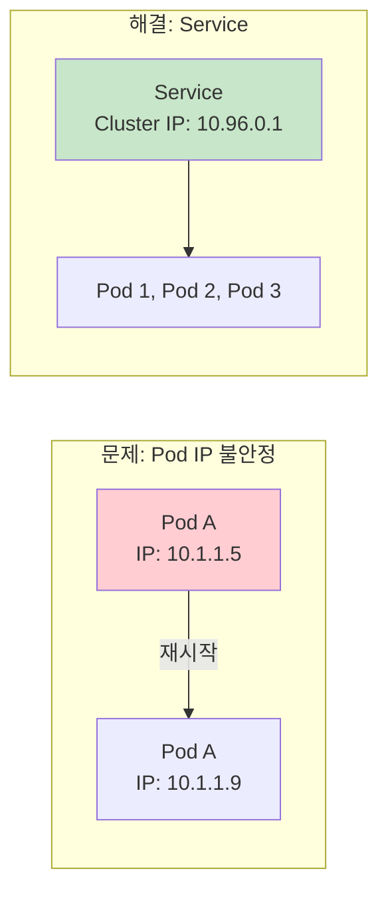
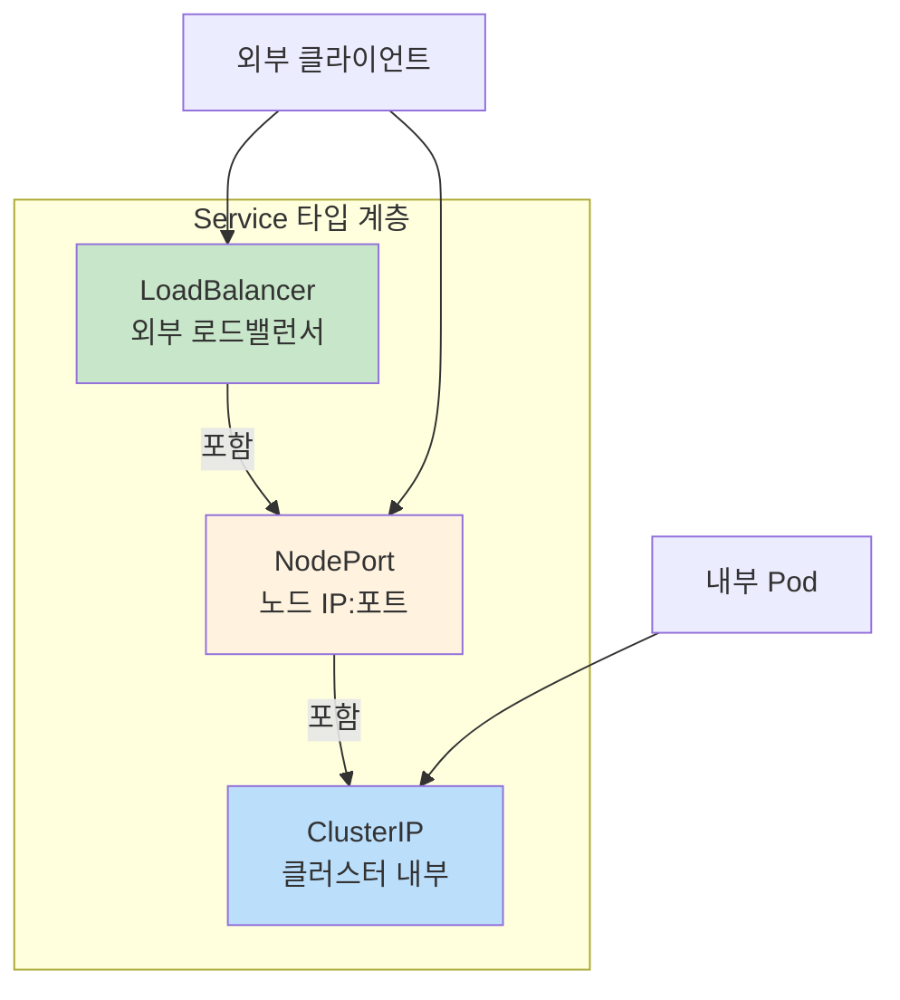
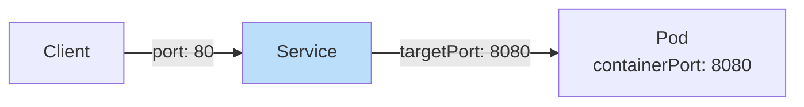
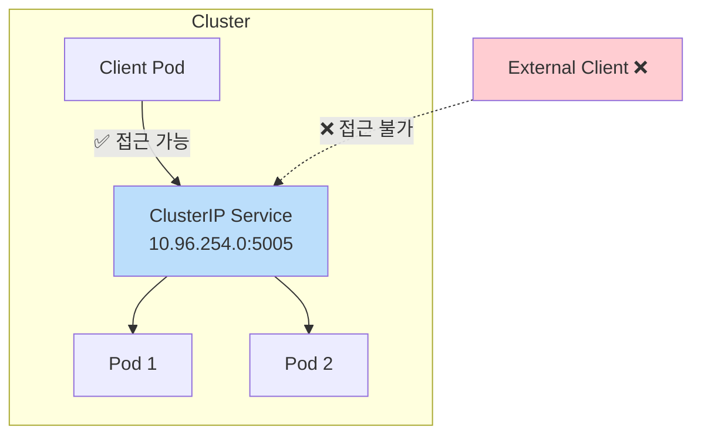
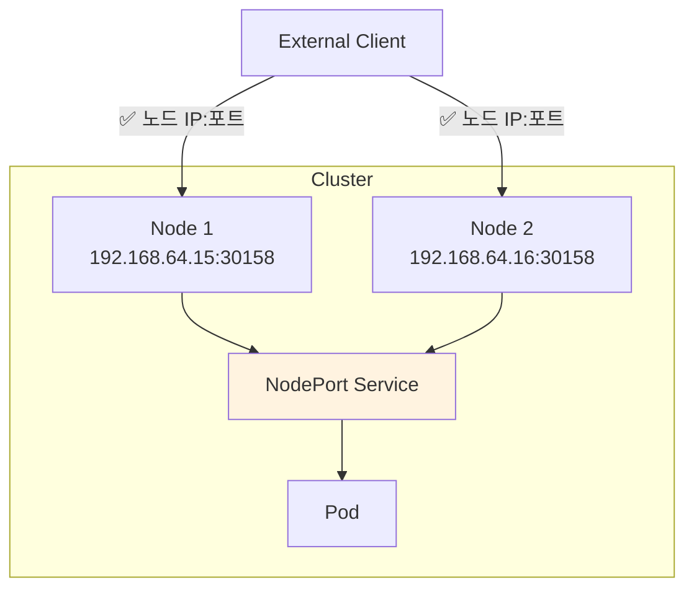
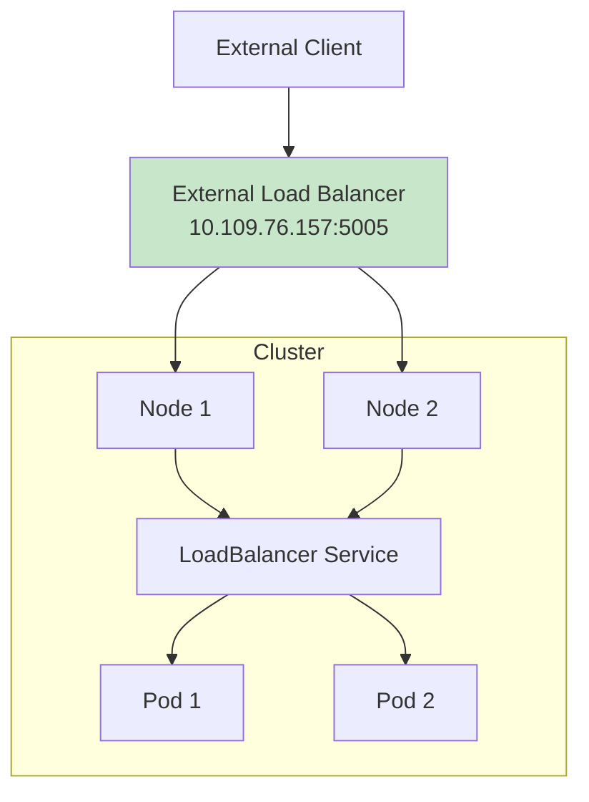
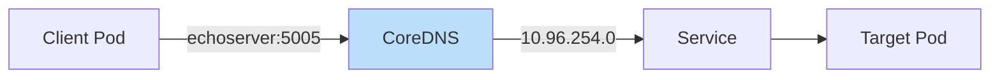

## 📌 핵심 요약
> 이 장에서는 Kubernetes Service를 다룬다. 핵심은 **Pod의 안정적인 네트워크 인터페이스 제공**, **Service 타입(ClusterIP, NodePort, LoadBalancer)별 접근 범위**, **포트 매핑**, 그리고 **CoreDNS를 통한 서비스 디스커버리**를 이해하는 것이다.

## 🎯 학습 목표
이 내용을 읽고 나면:
- [ ] Service가 필요한 이유와 동작 원리를 설명할 수 있다
- [ ] ClusterIP, NodePort, LoadBalancer 타입의 차이를 이해할 수 있다
- [ ] Service를 생성하고 Pod에 연결할 수 있다
- [ ] CoreDNS를 통한 Service 디스커버리를 활용할 수 있다

## 📖 본문 정리

### 1. Service가 필요한 이유



| 문제 | Service 해결책 |
|------|----------------|
| Pod IP가 재시작 시 변경됨 | 고정된 Cluster IP 제공 |
| Pod 간 통신 신뢰성 부족 | 안정적인 네트워크 인터페이스 |
| 부하 분산 필요 | 라운드 로빈 로드 밸런싱 |
| 서비스 디스커버리 | DNS 기반 호스트명 제공 |

> 💡 **핵심**: Service는 Label Selector로 Pod를 선택하고, 고정 IP와 DNS 이름으로 접근 가능하게 함

---

### 2. Service 타입



| 타입 | 접근 범위 | 용도 | 특징 |
|------|-----------|------|------|
| **ClusterIP** | 클러스터 내부만 | 마이크로서비스 간 통신 | 기본값 |
| **NodePort** | 외부 (노드 IP:포트) | 개발/테스트 | 30000-32767 포트 |
| **LoadBalancer** | 외부 (로드밸런서 IP) | 프로덕션 | 클라우드 제공자 필요 |

> ⚠️ **타입 상속**: LoadBalancer → NodePort → ClusterIP 기능 포함

---

### 3. 포트 매핑



| 속성 | 설명 | 예시 |
|------|------|------|
| **port** | Service가 받는 포트 (incoming) | 80 |
| **targetPort** | Pod로 전달되는 포트 (outgoing) | 8080 |
| **nodePort** | 노드에서 열리는 포트 (NodePort 타입) | 30158 |
| **containerPort** | 컨테이너가 노출하는 포트 | 8080 |

> 💡 **매칭 규칙**: `targetPort`와 `containerPort`가 일치해야 트래픽 전달 성공

---

### 4. Service 생성

#### 명령형 - Pod와 Service 함께 생성

```bash
# Pod과 Service 동시 생성 (--expose)
$ kubectl run echoserver --image=k8s.gcr.io/echoserver:1.10 \
  --port=8080 --expose
service/echoserver created
pod/echoserver created
```

#### 명령형 - 별도 생성

```bash
# Pod 생성
$ kubectl run echoserver --image=k8s.gcr.io/echoserver:1.10 \
  --port=8080 -l app=echoserver

# ClusterIP Service 생성
$ kubectl create service clusterip echoserver --tcp=80:8080

# NodePort Service 생성
$ kubectl create service nodeport echoserver --tcp=80:8080

# LoadBalancer Service 생성
$ kubectl create service loadbalancer echoserver --tcp=80:8080
```

#### 명령형 - Deployment용 Service

```bash
# Deployment 생성
$ kubectl create deployment echoserver --image=hashicorp/http-echo:1.0.0 \
  --replicas=5

# Deployment를 Service로 노출
$ kubectl expose deployment echoserver --port=80 --target-port=8080
```

#### 선언형 (YAML)

```yaml
apiVersion: v1
kind: Service
metadata:
  name: echoserver
spec:
  type: ClusterIP              # 타입 (생략 시 ClusterIP)
  selector:
    app: echoserver            # Label Selector
  ports:
  - port: 80                   # Service 포트
    targetPort: 8080           # Pod 포트
    protocol: TCP
```

---

### 5. ClusterIP Service



#### 생성 및 확인

```bash
# 생성
$ kubectl create service clusterip echoserver --tcp=5005:8080

# 확인
$ kubectl get service echoserver
NAME         TYPE        CLUSTER-IP    EXTERNAL-IP   PORT(S)    AGE
echoserver   ClusterIP   10.96.254.0   <none>        5005/TCP   8s
```

#### 접근 방법

```bash
# 클러스터 내부에서 접근 (성공)
$ kubectl run tmp --image=busybox:1.36.1 -it --rm \
  -- wget 10.96.254.0:5005

# 클러스터 외부에서 접근 (실패)
$ wget 10.96.254.0:5005 --timeout=5
# failed: Operation timed out
```

---

### 6. NodePort Service



#### 생성 및 확인

```bash
# 생성
$ kubectl create service nodeport echoserver --tcp=5005:8080

# 확인
$ kubectl get service echoserver
NAME         TYPE       CLUSTER-IP       EXTERNAL-IP   PORT(S)          AGE
echoserver   NodePort   10.101.184.152   <none>        5005:30158/TCP   5s
```

#### 접근 방법

```bash
# 노드 IP 확인
$ kubectl get nodes -o \
  jsonpath='{.items[*].status.addresses[?(@.type=="InternalIP")].address}'
192.168.64.15

# 외부에서 노드 IP:NodePort로 접근
$ wget 192.168.64.15:30158

# 내부에서 ClusterIP:Port로도 접근 가능
$ kubectl run tmp --image=busybox:1.36.1 -it --rm \
  -- wget 10.101.184.152:5005
```

| 포트 | 용도 |
|------|------|
| **5005** | 클러스터 내부 접근용 (ClusterIP) |
| **30158** | 외부 접근용 (NodePort) |

---

### 7. LoadBalancer Service



#### 생성 및 확인

```bash
# 생성
$ kubectl create service loadbalancer echoserver --tcp=5005:8080

# 확인
$ kubectl get service echoserver
NAME         TYPE           CLUSTER-IP      EXTERNAL-IP     PORT(S)          AGE
echoserver   LoadBalancer   10.109.76.157   10.109.76.157   5005:30642/TCP   5s
```

#### 접근 방법

```bash
# 외부에서 External IP로 접근
$ wget 10.109.76.157:5005
```

> ⚠️ **주의**: LoadBalancer는 클라우드 제공자가 외부 로드밸런서를 프로비저닝해야 함

---

### 8. CoreDNS와 Service Discovery



#### DNS 이름 형식

| 형식 | 사용 상황 | 예시 |
|------|-----------|------|
| `<service>` | 같은 네임스페이스 | `echoserver` |
| `<service>.<namespace>` | 다른 네임스페이스 | `echoserver.default` |
| `<service>.<namespace>.svc.cluster.local` | 전체 형식 (FQDN) | `echoserver.default.svc.cluster.local` |

#### DNS 기반 접근

```bash
# 같은 네임스페이스에서 호스트명으로 접근
$ kubectl run tmp --image=busybox:1.36.1 -it --rm \
  -- wget echoserver:5005

# 다른 네임스페이스에서 접근
$ kubectl run tmp -n other --image=busybox:1.36.1 -it --rm \
  -- wget echoserver.default:5005
```

---

### 9. 환경 변수를 통한 Service Discovery

```bash
# Pod 내 환경 변수 확인
$ kubectl exec -it echoserver -- env
ECHOSERVER_SERVICE_HOST=10.96.254.0
ECHOSERVER_SERVICE_PORT=8080
```

| 환경 변수 | 설명 |
|-----------|------|
| `<SERVICE>_SERVICE_HOST` | Service의 Cluster IP |
| `<SERVICE>_SERVICE_PORT` | Service의 포트 |

> ⚠️ **주의**: 환경 변수는 **Service가 먼저 생성된 후** Pod가 시작되어야 주입됨

---

### 10. EndpointSlices

```bash
# EndpointSlices 조회
$ kubectl get endpointslices -l app=echoserver
NAME               ADDRESSTYPE   PORTS   ENDPOINTS                          AGE
echoserver-js2xj   IPv4          8080    10.244.0.10,10.244.0.11 + 2 more   63m

# 상세 정보
$ kubectl describe endpointslice echoserver-js2xj
Endpoints:
  - Addresses:  10.244.0.10
    TargetRef:  Pod/echoserver-85df578d68-q5r57
    ...
```

> 💡 **EndpointSlices**: Service가 라우팅하는 Pod의 IP:Port 목록

---

### 11. Service 트러블슈팅

```bash
# Service 상세 정보 확인
$ kubectl describe service echoserver
Selector:          app=echoserver
Port:              <unset>  80/TCP
TargetPort:        8080/TCP
Endpoints:         172.17.0.4:8080,172.17.0.5:8080,...
```

| 확인 항목 | 문제 상황 | 해결 방법 |
|-----------|-----------|-----------|
| **Selector** | Label 불일치 | Pod Label 확인 |
| **TargetPort** | 컨테이너 포트와 불일치 | containerPort 확인 |
| **Endpoints** | 비어있음 | Label Selection 확인 |

---

### 12. 핵심 명령어 요약

| 작업 | 명령어 |
|------|--------|
| **Service 생성 (ClusterIP)** | `kubectl create service clusterip <name> --tcp=<port>:<targetPort>` |
| **Service 생성 (NodePort)** | `kubectl create service nodeport <name> --tcp=<port>:<targetPort>` |
| **Service 생성 (LoadBalancer)** | `kubectl create service loadbalancer <name> --tcp=<port>:<targetPort>` |
| **Deployment 노출** | `kubectl expose deployment <name> --port=<port> --target-port=<targetPort>` |
| **Pod + Service 동시 생성** | `kubectl run <name> --image= --port=<port> --expose` |
| **Service 목록** | `kubectl get services` (또는 `svc`) |
| **Service 상세** | `kubectl describe service <name>` |
| **EndpointSlices 확인** | `kubectl get endpointslices -l <label>` |

---

### 13. Service 타입 선택 가이드

| 사용 사례 | 권장 타입 | 이유 |
|-----------|-----------|------|
| 마이크로서비스 내부 통신 | ClusterIP | 외부 노출 불필요, 보안 |
| 개발/테스트 외부 접근 | NodePort | 간단한 설정 |
| 프로덕션 외부 노출 | LoadBalancer | 로드밸런싱, 안정성 |
| HTTP(S) 라우팅 필요 | Ingress | 비용 효율적, L7 라우팅 |

---

## 🔍 심화 학습

### 추가 조사 내용
- **ExternalName Service**: 외부 DNS 이름을 클러스터 내부에서 사용
- **Headless Service**: ClusterIP 없이 Pod에 직접 접근
- **Session Affinity**: 같은 클라이언트를 같은 Pod로 라우팅

### 출처
- [Kubernetes 공식 문서 - Services](https://kubernetes.io/docs/concepts/services-networking/service/)
- [Kubernetes 공식 문서 - DNS for Services](https://kubernetes.io/docs/concepts/services-networking/dns-pod-service/)

---

## 💡 실무 적용 포인트

### 이런 상황에서 기억하세요
- **Backend 연결**: Frontend → Backend 통신에 ClusterIP Service 사용
- **외부 노출**: 개발 시 NodePort, 프로덕션 시 LoadBalancer 또는 Ingress
- **마이크로서비스**: DNS 이름으로 Service 호출 (IP 하드코딩 금지)

### 주의할 점 / 흔한 실수
- ⚠️ Label Selector가 Pod Label과 일치하지 않으면 트래픽 라우팅 실패
- ⚠️ targetPort와 containerPort가 일치해야 함
- ⚠️ NodePort 범위는 30000-32767 (다른 포트 지정 시 오류)
- ⚠️ 환경 변수 방식은 Service가 먼저 생성되어야 함
- ⚠️ LoadBalancer는 클라우드 환경에서만 외부 IP 할당

### 면접에서 나올 수 있는 질문
- Q: ClusterIP, NodePort, LoadBalancer의 차이점은?
- Q: Service가 Pod를 선택하는 방법은?
- Q: Pod에서 다른 네임스페이스의 Service에 접근하는 방법은?
- Q: Service의 Endpoints가 비어있는 원인은?
- Q: CoreDNS의 역할은 무엇인가?

---

## ✅ 핵심 개념 체크리스트
- [ ] Service가 필요한 이유를 설명할 수 있는가?
- [ ] ClusterIP, NodePort, LoadBalancer 타입을 구분할 수 있는가?
- [ ] port, targetPort, nodePort의 차이를 이해하는가?
- [ ] `kubectl create service` 또는 `kubectl expose`로 Service를 생성할 수 있는가?
- [ ] DNS 이름으로 Service에 접근할 수 있는가?
- [ ] 다른 네임스페이스의 Service에 접근하는 DNS 형식을 아는가?
- [ ] EndpointSlices를 확인하여 트러블슈팅할 수 있는가?

---

## 🔗 참고 자료
- 📄 공식 문서: [Services](https://kubernetes.io/docs/concepts/services-networking/service/)
- 📄 공식 문서: [DNS for Services and Pods](https://kubernetes.io/docs/concepts/services-networking/dns-pod-service/)
- 📄 공식 문서: [Connecting Applications with Services](https://kubernetes.io/docs/tutorials/services/connect-applications-service/)
- 📄 공식 문서: [EndpointSlices](https://kubernetes.io/docs/concepts/services-networking/endpoint-slices/)
- 📘 GitHub: [bmuschko/cka-study-guide](https://github.com/bmuschko/cka-study-guide)

---
