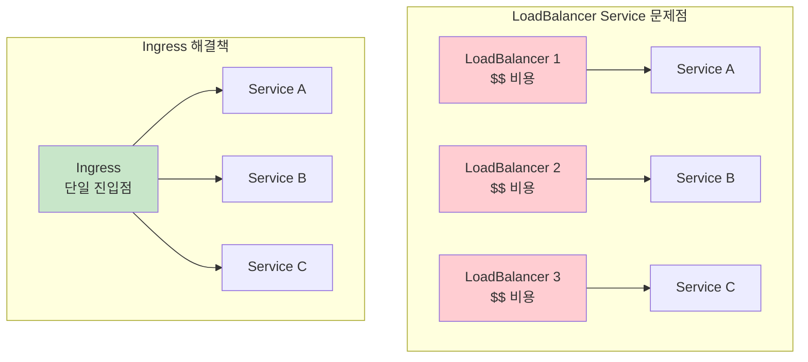
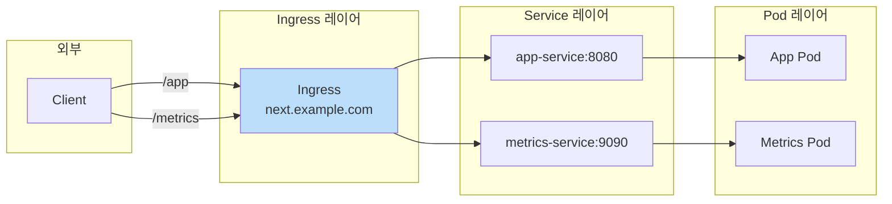
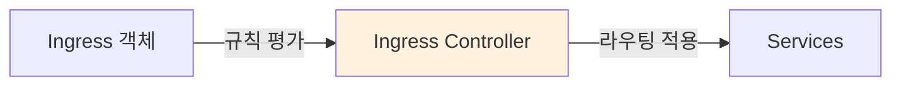
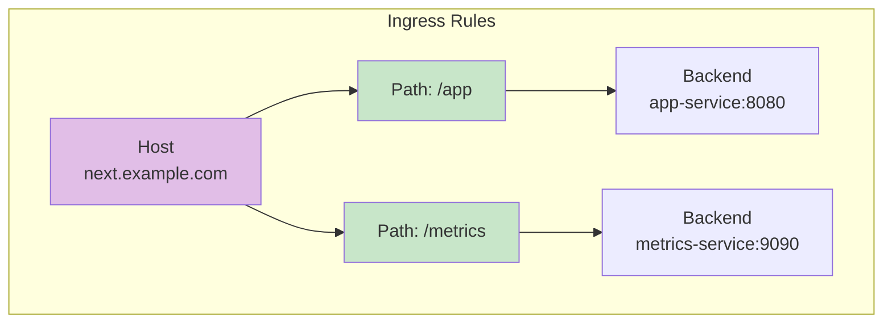
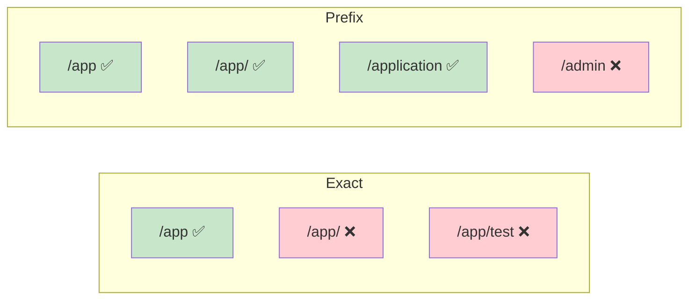

## 📌 핵심 요약
> 이 장에서는 Kubernetes Ingress를 다룬다. 핵심은 **Ingress의 목적(단일 진입점으로 HTTP(S) 라우팅)**, **Ingress Controller의 역할**, **라우팅 규칙 정의(host, path, backend)**, 그리고 **Path Type(Exact vs Prefix)**을 이해하는 것이다.

## 🎯 학습 목표
이 내용을 읽고 나면:
- [ ] Service와 Ingress의 차이점을 설명할 수 있다
- [ ] Ingress Controller의 필요성과 역할을 이해할 수 있다
- [ ] Ingress 규칙(host, path, backend)을 정의할 수 있다
- [ ] Exact와 Prefix Path Type의 차이를 구분할 수 있다
- [ ] Ingress를 생성하고 접근할 수 있다

## 📖 본문 정리

### 1. Ingress가 필요한 이유



| 방식 | 문제점 | 해결책 |
|------|--------|--------|
| **LoadBalancer Service** | 각 Service마다 외부 로드밸런서 생성 → 비용 증가 | Ingress로 단일 진입점 제공 |
| **관리 복잡성** | 마이크로서비스마다 별도 Service 객체 필요 | Ingress 규칙으로 통합 관리 |

> 💡 **핵심**: Ingress는 URL 경로 기반으로 여러 Service에 HTTP(S) 트래픽을 라우팅하는 단일 진입점

---

### 2. Ingress vs Service



| 구분 | Service | Ingress |
|------|---------|---------|
| **역할** | 트래픽을 Pod 집합으로 라우팅 | 클러스터 외부 HTTP(S) 트래픽을 Service로 라우팅 |
| **라우팅 기준** | 라벨 셀렉터 | Host + URL Path |
| **프로토콜** | TCP/UDP | HTTP/HTTPS |
| **외부 접근** | NodePort, LoadBalancer 타입 필요 | 단일 외부 IP로 여러 Service 접근 |

---

### 3. Ingress Controller

#### Ingress Controller 필수



> ⚠️ **중요**: Ingress Controller가 없으면 Ingress 규칙이 동작하지 않음!

#### Controller 확인

```bash
# Ingress Controller Pod 확인
$ kubectl get pods -n ingress-nginx
NAME                                        READY   STATUS      RESTARTS   AGE
ingress-nginx-controller-7c6974c4d8-2gg8c   1/1     Running     0          60s
```

#### Ingress Class 확인

```bash
# 설치된 Ingress Class 목록
$ kubectl get ingressclasses
NAME    CONTROLLER             PARAMETERS   AGE
nginx   k8s.io/ingress-nginx   <none>       14m
```

| 개념 | 설명 |
|------|------|
| **Ingress Controller** | Ingress 규칙을 평가하고 적용하는 컴포넌트 (예: NGINX, HAProxy) |
| **Ingress Class** | 여러 Controller 중 특정 Controller를 선택하는 방법 |
| **Default Class** | `ingressclass.kubernetes.io/is-default-class: "true"` 어노테이션 |

> 💡 **시험 팁**: 시험 환경에서는 Ingress Controller가 사전 설치되어 있다고 가정

---

### 4. Ingress 규칙



#### 규칙 구성 요소

| 구성 요소 | 예시 | 설명 |
|-----------|------|------|
| **Host** (선택) | `next.example.com` | 없으면 모든 인바운드 HTTP(S) 트래픽 처리 |
| **Path** (필수) | `/app`, `/metrics` | URL 컨텍스트 경로 |
| **Backend** (필수) | `app-service:8080` | Service 이름과 포트 |

---

### 5. Ingress 생성

#### 명령형 (Imperative)

```bash
# 두 개의 규칙을 가진 Ingress 생성
$ kubectl create ingress next-app \
  --rule="next.example.com/app=app-service:8080" \
  --rule="next.example.com/metrics=metrics-service:9090"
ingress.networking.k8s.io/next-app created
```

#### 선언형 (Declarative)

```yaml
apiVersion: networking.k8s.io/v1
kind: Ingress
metadata:
  name: next-app
  annotations:
    nginx.ingress.kubernetes.io/rewrite-target: /$1   # NGINX 전용 어노테이션
spec:
  rules:
  - host: next.example.com                            # 호스트명
    http:
      paths:
      - path: /app                                    # URL 경로
        pathType: Exact                               # 경로 타입
        backend:
          service:
            name: app-service                         # Service 이름
            port:
              number: 8080                            # Service 포트
      - path: /metrics
        pathType: Exact
        backend:
          service:
            name: metrics-service
            port:
              number: 9090
```

---

### 6. Path Type



| Path Type | 규칙 | 매칭 예시 | 비매칭 예시 |
|-----------|------|-----------|-------------|
| **Exact** | `/app` | `/app` | `/app/`, `/app/test` |
| **Prefix** | `/app` | `/app`, `/app/`, `/application` | `/admin` |

> 💡 **핵심 차이**: Prefix는 trailing slash(`/`)를 허용, Exact는 정확히 일치해야 함

---

### 7. Ingress 조회 및 상세 정보

#### Ingress 목록

```bash
$ kubectl get ingress
NAME       CLASS   HOSTS              ADDRESS        PORTS   AGE
next-app   nginx   next.example.com   192.168.66.4   80      5m38s
```

| 컬럼 | 설명 |
|------|------|
| **CLASS** | 사용된 Ingress Class |
| **HOSTS** | 정의된 호스트명 |
| **ADDRESS** | 외부 로드밸런서 IP |
| **PORTS** | 80 (HTTP), 443 (HTTPS) |

#### Ingress 상세 정보

```bash
$ kubectl describe ingress next-app
Name:             next-app
Labels:           <none>
Namespace:        default
Address:          192.168.66.4
Ingress Class:    nginx
Default backend:  <default>
Rules:
  Host              Path  Backends
  ----              ----  --------
  next.example.com
                    /app       app-service:8080 (10.244.0.6:8080)
                    /metrics   metrics-service:9090 (10.244.0.7:8080)
```

---

### 8. Ingress 트러블슈팅

#### 오류 상태 예시

```bash
$ kubectl describe ingress next-app
Rules:
  Host              Path  Backends
  ----              ----  --------
  next.example.com
                    /app       app-service:8080 (<error: endpoints \
                    "app-service" not found>)
```

> ⚠️ **오류 원인**: Backend Service가 존재하지 않거나 Endpoints가 없음

#### 해결 방법

```bash
# 1. Pod 생성
$ kubectl run app --image=k8s.gcr.io/echoserver:1.10 --port=8080 \
  -l app=app-service

# 2. Service 생성
$ kubectl create service clusterip app-service --tcp=8080:8080
```

#### 트러블슈팅 체크리스트

| 확인 항목 | 명령어 |
|-----------|--------|
| Ingress Controller 상태 | `kubectl get pods -n ingress-nginx` |
| Ingress 규칙 확인 | `kubectl describe ingress <name>` |
| Backend Service 존재 확인 | `kubectl get svc` |
| Endpoints 확인 | `kubectl get endpoints` |

---

### 9. Ingress 접근

#### 로컬 테스트 설정

```bash
# 1. Ingress IP 주소 확인
$ kubectl get ingress next-app \
  --output=jsonpath="{.status.loadBalancer.ingress[0]['ip']}"
192.168.66.4

# 2. /etc/hosts에 추가
$ sudo vim /etc/hosts
192.168.66.4   next.example.com
```

#### HTTP 요청 테스트

```bash
# Exact path - 성공 (200 OK)
$ wget next.example.com/app --timeout=5 --tries=1
HTTP request sent, awaiting response... 200 OK

# Trailing slash - 실패 (404 Not Found) - Exact 타입이므로
$ wget next.example.com/app/ --timeout=5 --tries=1
HTTP request sent, awaiting response... 404 Not Found
```

---

### 10. Ingress 정의 템플릿

```yaml
apiVersion: networking.k8s.io/v1
kind: Ingress
metadata:
  name: <ingress-name>
  annotations:
    <controller-specific-annotations>
spec:
  ingressClassName: <class-name>       # 선택: Ingress Class 지정
  rules:
  - host: <hostname>                   # 선택: 호스트명
    http:
      paths:
      - path: <url-path>               # URL 경로
        pathType: <Exact|Prefix>       # 경로 타입
        backend:
          service:
            name: <service-name>       # Service 이름
            port:
              number: <port>           # Service 포트
```

---

### 11. 핵심 명령어 요약

| 작업 | 명령어 |
|------|--------|
| **Ingress 생성** | `kubectl create ingress <name> --rule="<host>/<path>=<svc>:<port>"` |
| **Ingress 목록** | `kubectl get ingress` |
| **Ingress 상세** | `kubectl describe ingress <name>` |
| **Ingress Class 목록** | `kubectl get ingressclasses` |
| **Ingress Controller 확인** | `kubectl get pods -n ingress-nginx` |
| **Ingress IP 확인** | `kubectl get ingress <name> -o jsonpath="{.status.loadBalancer.ingress[0]['ip']}"` |

---

## 🔍 심화 학습

### 추가 조사 내용
- **TLS Termination**: HTTPS 트래픽을 위한 TLS Secret 설정 (CKS 시험 범위)
- **Default Backend**: 규칙에 매칭되지 않는 요청을 처리하는 기본 백엔드
- **Canary Deployment**: NGINX 어노테이션을 활용한 트래픽 분배
- **ExternalDNS**: DNS 레코드 자동 관리 프로젝트

### 출처
- [Kubernetes 공식 문서 - Ingress](https://kubernetes.io/docs/concepts/services-networking/ingress/)
- [NGINX Ingress Controller](https://kubernetes.github.io/ingress-nginx/)
- [Ingress Controllers 목록](https://kubernetes.io/docs/concepts/services-networking/ingress-controllers/)

---

## 💡 실무 적용 포인트

### 이런 상황에서 기억하세요
- **마이크로서비스 노출**: 여러 Service를 단일 도메인으로 통합 노출
- **비용 절감**: LoadBalancer 개수 감소로 클라우드 비용 절약
- **URL 기반 라우팅**: `/api`, `/web`, `/admin` 등 경로별 분기
- **호스트 기반 라우팅**: `api.example.com`, `web.example.com` 분기

### 주의할 점 / 흔한 실수
- ⚠️ Ingress Controller 없이 Ingress 생성 → 규칙이 적용되지 않음
- ⚠️ Backend Service가 존재하지 않음 → `endpoints not found` 오류
- ⚠️ Exact pathType에 trailing slash 요청 → 404 응답
- ⚠️ Ingress Class 미지정 + 기본 Class 없음 → 라우팅 실패
- ⚠️ Service가 ClusterIP 타입이 아닌 경우 주의 필요

### 면접에서 나올 수 있는 질문
- Q: Service와 Ingress의 차이점은?
- Q: Ingress Controller의 역할은?
- Q: Exact와 Prefix Path Type의 차이점은?
- Q: Ingress가 없으면 여러 Service를 외부에 노출하는 방법은?
- Q: Ingress에서 Backend Service를 찾지 못할 때 트러블슈팅 방법은?

---

## ✅ 핵심 개념 체크리스트
- [ ] LoadBalancer Service의 한계와 Ingress의 필요성을 이해하는가?
- [ ] Service와 Ingress의 역할 차이를 설명할 수 있는가?
- [ ] Ingress Controller의 필요성을 이해하는가?
- [ ] Ingress 규칙(host, path, backend)을 정의할 수 있는가?
- [ ] Exact와 Prefix Path Type을 구분할 수 있는가?
- [ ] 명령형/선언형으로 Ingress를 생성할 수 있는가?
- [ ] Ingress 트러블슈팅을 위해 describe 명령을 활용할 수 있는가?
- [ ] 로컬에서 /etc/hosts를 통해 Ingress를 테스트할 수 있는가?

---

## 🔗 참고 자료
- 📄 공식 문서: [Ingress](https://kubernetes.io/docs/concepts/services-networking/ingress/)
- 📄 공식 문서: [Ingress Controllers](https://kubernetes.io/docs/concepts/services-networking/ingress-controllers/)
- 📄 NGINX 문서: [NGINX Ingress Annotations](https://kubernetes.github.io/ingress-nginx/user-guide/nginx-configuration/annotations/)
- 📄 튜토리얼: [Set up Ingress on Minikube](https://kubernetes.io/docs/tasks/access-application-cluster/ingress-minikube/)
- 📘 GitHub: [bmuschko/cka-study-guide](https://github.com/bmuschko/cka-study-guide)

---
