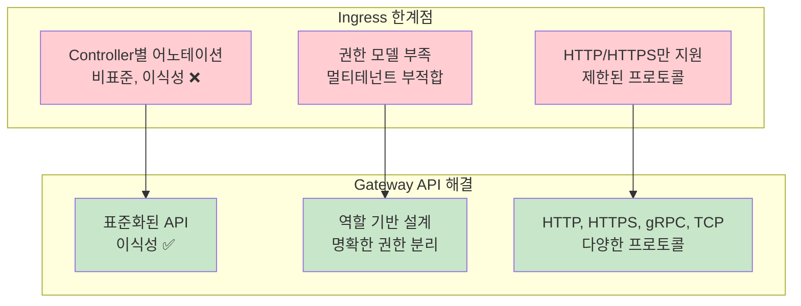
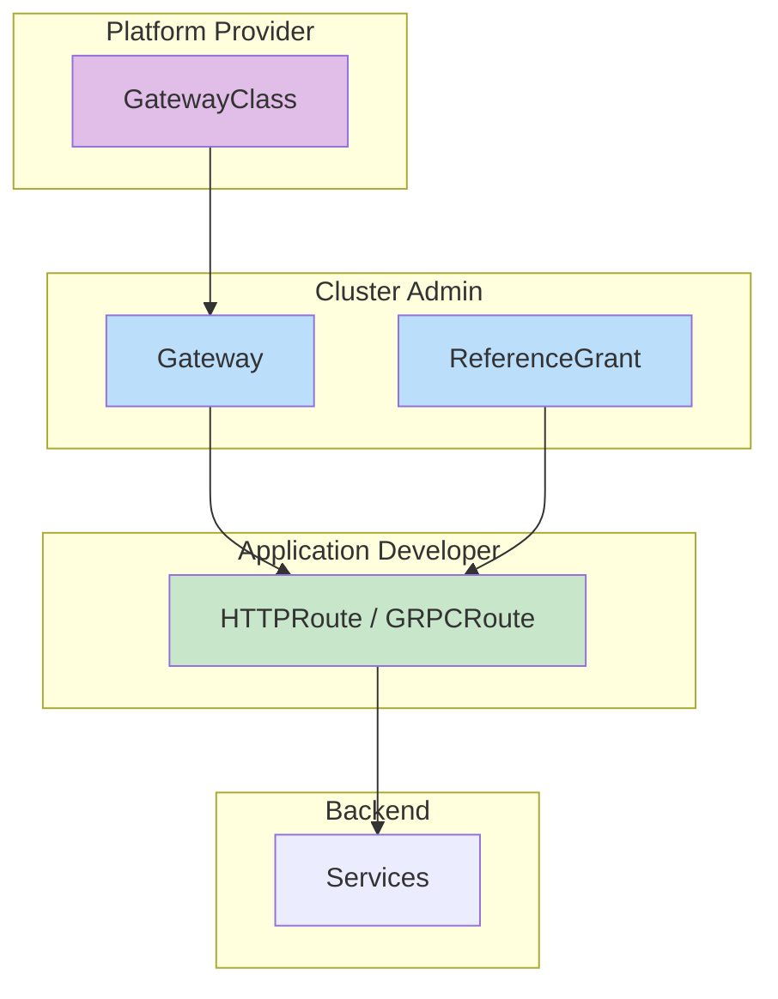
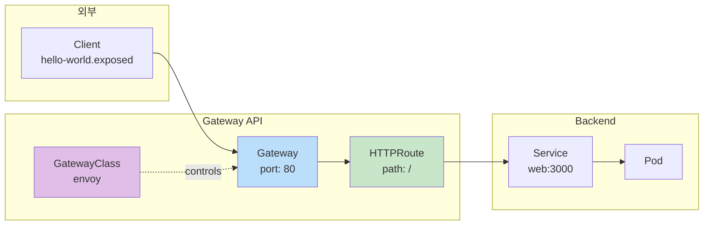

## 📌 핵심 요약
> 이 장에서는 Kubernetes Gateway API를 다룬다. 핵심은 **Ingress의 한계와 Gateway API의 필요성**, **Gateway API 리소스(GatewayClass, Gateway, HTTPRoute, ReferenceGrant)**, **역할 기반 설계**, 그리고 **HTTPRoute를 통한 트래픽 라우팅**을 이해하는 것이다.

## 🎯 학습 목표
이 내용을 읽고 나면:
- [ ] Ingress의 한계와 Gateway API가 필요한 이유를 설명할 수 있다
- [ ] Gateway API의 주요 리소스와 역할을 이해할 수 있다
- [ ] GatewayClass, Gateway, HTTPRoute를 생성할 수 있다
- [ ] Gateway API를 통해 HTTP 트래픽을 라우팅할 수 있다

## 📖 본문 정리

### 1. Ingress의 한계



| 문제점 | Ingress | Gateway API |
|--------|---------|-------------|
| **확장성** | Controller별 비표준 어노테이션 | 표준화된 확장 가능 API |
| **권한 모델** | 멀티테넌트 환경에 부적합 | 역할 기반 권한 분리 |
| **프로토콜** | HTTP/HTTPS만 | HTTP, HTTPS, gRPC, TCP 등 |
| **트래픽 관리** | 제한된 기능 | 트래픽 분할, 가중치 라우팅 등 |

> 💡 **핵심**: Gateway API는 Ingress의 공식 후속 프리미티브로, Ingress 기능의 상위 집합

---

### 2. Gateway API 리소스



#### 리소스 역할

| 리소스 | 관리 주체 | 역할 |
|--------|-----------|------|
| **GatewayClass** | Platform Provider | Gateway Controller 유형 정의 |
| **Gateway** | Cluster Admin | 트래픽 처리 인프라 인스턴스 정의 |
| **ReferenceGrant** | Cluster Admin | 네임스페이스 간 참조 허용 |
| **HTTPRoute/GRPCRoute** | App Developer | 트래픽 라우팅 규칙 정의 |

---

### 3. Gateway API 설치

#### CRD 설치

```bash
# Gateway API CRD 설치 (v1.3.0)
$ kubectl apply -f https://github.com/kubernetes-sigs/gateway-api/releases/\
download/v1.3.0/standard-install.yaml
customresourcedefinition.apiextensions.k8s.io/gatewayclasses.gateway.networking.k8s.io created
customresourcedefinition.apiextensions.k8s.io/gateways.gateway.networking.k8s.io created
customresourcedefinition.apiextensions.k8s.io/httproutes.gateway.networking.k8s.io created
...
```

#### CRD 확인

```bash
$ kubectl get crds | grep gateway.networking.k8s.io
gatewayclasses.gateway.networking.k8s.io    2025-08-07T18:14:16Z
gateways.gateway.networking.k8s.io          2025-08-07T18:14:16Z
httproutes.gateway.networking.k8s.io        2025-08-07T18:14:16Z
grpcroutes.gateway.networking.k8s.io        2025-08-07T18:14:16Z
referencegrants.gateway.networking.k8s.io   2025-08-07T18:14:17Z
```

> ⚠️ **중요**: Gateway API 리소스는 기본 Kubernetes에 포함되지 않으므로 CRD 설치 필수

---

### 4. Gateway Controller 배포

```bash
# Envoy Gateway 설치 (Helm)
$ helm install eg oci://docker.io/envoyproxy/gateway-helm --version v1.4.2 \
  -n envoy-gateway-system --create-namespace

# Controller 준비 대기
$ kubectl wait --timeout=5m -n envoy-gateway-system deployment/envoy-gateway \
  --for=condition=Available
deployment.apps/envoy-gateway condition met
```

---

### 5. GatewayClass 생성

```yaml
apiVersion: gateway.networking.k8s.io/v1
kind: GatewayClass
metadata:
  name: envoy
spec:
  controllerName: gateway.envoyproxy.io/gatewayclass-controller   # Controller 참조
```

```bash
# GatewayClass 생성
$ kubectl apply -f gateway-class.yaml
gatewayclass.gateway.networking.k8s.io/envoy created

# GatewayClass 목록 확인
$ kubectl get gatewayclasses
NAME    CONTROLLER                                      ACCEPTED   AGE
envoy   gateway.envoyproxy.io/gatewayclass-controller   True       31s
```

> 💡 **시험 팁**: 시험 환경에는 GatewayClass가 사전 설치되어 있을 수 있음 → 먼저 확인!

---

### 6. Gateway 생성

```yaml
apiVersion: gateway.networking.k8s.io/v1
kind: Gateway
metadata:
  name: hello-world-gateway
spec:
  gatewayClassName: envoy          # GatewayClass 참조
  listeners:
    - name: http
      protocol: HTTP               # 프로토콜
      port: 80                     # 포트
```

```bash
# Gateway 생성
$ kubectl apply -f gateway.yaml
gateway.gateway.networking.k8s.io/hello-world-gateway created

# Gateway 목록 확인
$ kubectl get gateways
NAME                  CLASS   ADDRESS   PROGRAMMED   AGE
hello-world-gateway   envoy             False        16s
```

---

### 7. HTTPRoute 생성

```yaml
apiVersion: gateway.networking.k8s.io/v1
kind: HTTPRoute
metadata:
  name: hello-world-httproute
spec:
  parentRefs:
    - name: hello-world-gateway       # Gateway 참조
  hostnames:
    - "hello-world.exposed"           # 호스트명
  rules:
    - matches:
        - path:
            type: PathPrefix          # 경로 타입
            value: /                  # 경로
      backendRefs:
        - group: ""
          kind: Service               # 백엔드 타입
          name: web                   # Service 이름
          port: 3000                  # Service 포트
          weight: 1                   # 트래픽 가중치
```

```bash
# HTTPRoute 생성
$ kubectl apply -f httproute.yaml
httproute.gateway.networking.k8s.io/hello-world-httproute created

# HTTPRoute 목록 확인
$ kubectl get httproutes
NAME                    HOSTNAMES                 AGE
hello-world-httproute   ["hello-world.exposed"]   64s
```

---

### 8. Gateway API 흐름



---

### 9. Gateway 접근

#### Port Forward 방식 (로컬 테스트)

```bash
# Envoy Service 이름 확인
$ export ENVOY_SERVICE=$(kubectl get svc -n envoy-gateway-system \
  --selector=gateway.envoyproxy.io/owning-gateway-namespace=default,\
  gateway.envoyproxy.io/owning-gateway-name=hello-world-gateway \
  -o jsonpath='{.items[0].metadata.name}')

# Port Forward 설정
$ kubectl -n envoy-gateway-system port-forward service/${ENVOY_SERVICE} 8889:80 &
Forwarding from 127.0.0.1:8889 -> 10080

# /etc/hosts에 추가 후 테스트
$ curl hello-world.exposed:8889
Hello World
```

---

### 10. Ingress vs Gateway API 비교

| 항목 | Ingress | Gateway API |
|------|---------|-------------|
| **리소스 구조** | 단일 리소스 | 다중 리소스 (GatewayClass, Gateway, HTTPRoute) |
| **확장성** | 어노테이션 기반 | 표준 API 기반 |
| **역할 분리** | 없음 | 명확한 역할 기반 설계 |
| **프로토콜** | HTTP/HTTPS | HTTP, HTTPS, gRPC, TCP |
| **트래픽 분할** | 제한적 | weight 기반 지원 |
| **상태** | 안정 (레거시) | 안정 (2023년 말 GA) |

---

### 11. 핵심 명령어 요약

| 작업 | 명령어 |
|------|--------|
| **CRD 설치** | `kubectl apply -f https://github.com/.../standard-install.yaml` |
| **GatewayClass 목록** | `kubectl get gatewayclasses` |
| **Gateway 목록** | `kubectl get gateways` |
| **HTTPRoute 목록** | `kubectl get httproutes` |
| **CRD 확인** | `kubectl get crds \| grep gateway` |

---

### 12. 리소스 정의 템플릿

#### GatewayClass

```yaml
apiVersion: gateway.networking.k8s.io/v1
kind: GatewayClass
metadata:
  name: <class-name>
spec:
  controllerName: <controller-name>
```

#### Gateway

```yaml
apiVersion: gateway.networking.k8s.io/v1
kind: Gateway
metadata:
  name: <gateway-name>
spec:
  gatewayClassName: <class-name>
  listeners:
    - name: <listener-name>
      protocol: <HTTP|HTTPS|TCP>
      port: <port>
```

#### HTTPRoute

```yaml
apiVersion: gateway.networking.k8s.io/v1
kind: HTTPRoute
metadata:
  name: <route-name>
spec:
  parentRefs:
    - name: <gateway-name>
  hostnames:
    - "<hostname>"
  rules:
    - matches:
        - path:
            type: <PathPrefix|Exact>
            value: <path>
      backendRefs:
        - kind: Service
          name: <service-name>
          port: <port>
          weight: <weight>
```

---

## 🔍 심화 학습

### 추가 조사 내용
- **GRPCRoute**: gRPC 트래픽 라우팅
- **ReferenceGrant**: 네임스페이스 간 참조 허용 정책
- **Traffic Splitting**: weight를 활용한 카나리 배포
- **ingress2gateway**: Ingress → Gateway API 마이그레이션 도구

### 출처
- [Gateway API 공식 문서](https://gateway-api.sigs.k8s.io/)
- [Gateway API GitHub](https://github.com/kubernetes-sigs/gateway-api)
- [Envoy Gateway 문서](https://gateway.envoyproxy.io/)

---

## 💡 실무 적용 포인트

### 이런 상황에서 기억하세요
- **멀티테넌트 환경**: 역할 기반 권한 분리가 필요할 때
- **고급 트래픽 관리**: 트래픽 분할, 가중치 라우팅이 필요할 때
- **표준화 필요**: Controller별 어노테이션 종속성을 피하고 싶을 때
- **카나리 배포**: weight 기반 점진적 트래픽 이동

### 주의할 점 / 흔한 실수
- ⚠️ Gateway API CRD가 설치되지 않음 → 리소스 생성 실패
- ⚠️ Gateway Controller가 배포되지 않음 → Gateway가 동작하지 않음
- ⚠️ GatewayClass가 없음 → Gateway 생성 전 반드시 확인
- ⚠️ HTTPRoute의 parentRefs가 잘못됨 → 라우팅 실패
- ⚠️ 네임스페이스 간 참조 시 ReferenceGrant 필요

### 면접에서 나올 수 있는 질문
- Q: Ingress와 Gateway API의 차이점은?
- Q: Gateway API의 주요 리소스와 각각의 역할은?
- Q: GatewayClass, Gateway, HTTPRoute의 관계는?
- Q: Gateway API를 사용하기 전에 필요한 설치 단계는?
- Q: 역할 기반 설계란 무엇이고 왜 중요한가?

---

## ✅ 핵심 개념 체크리스트
- [ ] Ingress의 한계를 설명할 수 있는가?
- [ ] Gateway API가 Ingress의 후속 프리미티브임을 이해하는가?
- [ ] GatewayClass, Gateway, HTTPRoute, ReferenceGrant의 역할을 구분할 수 있는가?
- [ ] 각 리소스를 관리하는 페르소나(역할)를 이해하는가?
- [ ] Gateway API CRD를 설치할 수 있는가?
- [ ] GatewayClass를 생성하고 조회할 수 있는가?
- [ ] Gateway를 생성하고 조회할 수 있는가?
- [ ] HTTPRoute를 생성하여 트래픽을 라우팅할 수 있는가?

---

## 🔗 참고 자료
- 📄 공식 문서: [Gateway API](https://gateway-api.sigs.k8s.io/)
- 📄 GitHub: [kubernetes-sigs/gateway-api](https://github.com/kubernetes-sigs/gateway-api)
- 📄 Controller: [Envoy Gateway](https://gateway.envoyproxy.io/)
- 📄 Controller: [NGINX Gateway Fabric](https://docs.nginx.com/nginx-gateway-fabric/)
- 📄 마이그레이션: [ingress2gateway](https://github.com/kubernetes-sigs/ingress2gateway)
- 📘 GitHub: [bmuschko/cka-study-guide](https://github.com/bmuschko/cka-study-guide)

---
