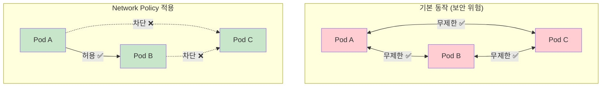
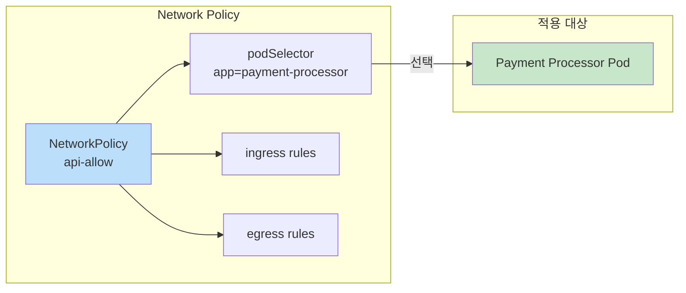
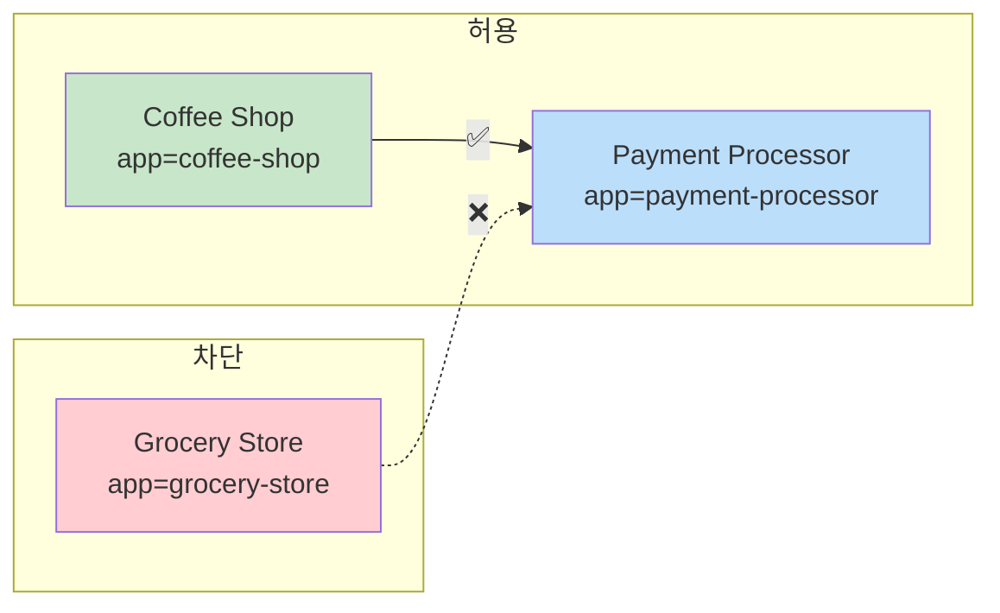
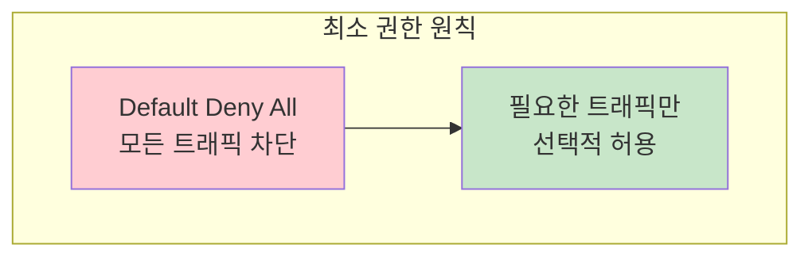

## 📌 핵심 요약
> 이 장에서는 Kubernetes Network Policy를 다룬다. 핵심은 **기본 Pod 간 통신의 보안 위험**, **Network Policy의 목적(방화벽 규칙)**, **ingress/egress 규칙 정의**, 그리고 **최소 권한 원칙(default deny)**을 이해하는 것이다.

## 🎯 학습 목표
이 내용을 읽고 나면:
- [ ] 기본 Pod 간 통신의 보안 위험을 설명할 수 있다
- [ ] Network Policy의 목적과 역할을 이해할 수 있다
- [ ] ingress/egress 규칙을 정의할 수 있다
- [ ] Default deny 정책으로 최소 권한 원칙을 적용할 수 있다
- [ ] 포트 수준의 접근 제어를 설정할 수 있다

## 📖 본문 정리

### 1. 기본 Pod 간 통신의 문제점



| 상황 | 기본 동작 | 보안 위험 |
|------|-----------|-----------|
| **Pod 간 통신** | 모든 Pod가 모든 Pod와 통신 가능 | 침해된 Pod가 다른 Pod 공격 가능 |
| **네임스페이스 간** | 다른 네임스페이스의 Pod와도 통신 가능 | 민감한 서비스 접근 가능 |
| **포트** | 모든 포트 접근 가능 | 공격 벡터 확대 |

> ⚠️ **보안 위험**: 기본적으로 Kubernetes는 모든 Pod 간 무제한 통신을 허용 → 방화벽 규칙 필요

---

### 2. Network Policy 개념



> 💡 **핵심**: Network Policy는 Pod를 위한 방화벽 규칙

| 용어 | 설명 |
|------|------|
| **Ingress** | 들어오는 트래픽 (인바운드) |
| **Egress** | 나가는 트래픽 (아웃바운드) |
| **podSelector** | 정책이 적용될 Pod 선택 |
| **from/to** | 트래픽 소스/목적지 정의 |

---

### 3. Network Policy Controller

#### Controller 필수

> ⚠️ **중요**: Network Policy Controller가 없으면 NetworkPolicy 리소스가 생성되어도 **적용되지 않음**!

| CNI | Network Policy 지원 |
|-----|---------------------|
| **Cilium** | ✅ 지원 |
| **Calico** | ✅ 지원 |
| **Weave Net** | ✅ 지원 |
| **Flannel** | ❌ 미지원 (기본 연결만 제공) |

#### Cilium 설치 확인

```bash
$ kubectl get pods -n kube-system
NAME                               READY   STATUS    RESTARTS   AGE
cilium-k5td6                       1/1     Running   0          110s
cilium-operator-f5dcdcc8d-njfbk    1/1     Running   0          110s
```

---

### 4. Network Policy 속성

#### spec 레벨 속성

| 속성 | 설명 |
|------|------|
| **podSelector** | 정책이 적용될 Pod 선택 (라벨 기반) |
| **policyTypes** | 트래픽 유형 정의 (Ingress, Egress 또는 둘 다) |
| **ingress** | 들어오는 트래픽 규칙 (from, ports) |
| **egress** | 나가는 트래픽 규칙 (to, ports) |

#### from/to 셀렉터 속성

| 속성 | 설명 |
|------|------|
| **podSelector** | 같은 네임스페이스 내 Pod를 라벨로 선택 |
| **namespaceSelector** | 네임스페이스를 라벨로 선택 (모든 Pod 허용) |
| **podSelector + namespaceSelector** | 특정 네임스페이스 내 특정 Pod 선택 |
| **ipBlock** | CIDR 범위로 IP 주소 지정 |

---

### 5. Network Policy 생성 예시

#### 시나리오



#### Pod 생성

```bash
# 3개의 Pod 생성
$ kubectl run grocery-store --image=nginx:1.25.3-alpine \
  -l app=grocery-store,role=backend --port 80
$ kubectl run payment-processor --image=nginx:1.25.3-alpine \
  -l app=payment-processor,role=api --port 80
$ kubectl run coffee-shop --image=nginx:1.25.3-alpine \
  -l app=coffee-shop,role=backend --port 80
```

#### Network Policy 정의

```yaml
apiVersion: networking.k8s.io/v1
kind: NetworkPolicy
metadata:
  name: api-allow
spec:
  podSelector:                     # 정책 적용 대상
    matchLabels:
      app: payment-processor
      role: api
  ingress:                         # 들어오는 트래픽 규칙
  - from:
    - podSelector:                 # 허용할 소스 Pod
        matchLabels:
          app: coffee-shop
```

#### 적용 및 테스트

```bash
# Network Policy 생성
$ kubectl apply -f networkpolicy-api-allow.yaml
networkpolicy.networking.k8s.io/api-allow created

# Payment Processor IP 확인
$ kubectl get pod payment-processor --template '{{.status.podIP}}'
10.244.0.136

# Grocery Store → Payment Processor (차단됨)
$ kubectl exec grocery-store -it -- wget --spider --timeout=1 10.244.0.136
wget: download timed out
command terminated with exit code 1

# Coffee Shop → Payment Processor (허용됨)
$ kubectl exec coffee-shop -it -- wget --spider --timeout=1 10.244.0.136
remote file exists
```

---

### 6. Default Deny 정책 (최소 권한 원칙)



#### Default Deny 정의

```yaml
apiVersion: networking.k8s.io/v1
kind: NetworkPolicy
metadata:
  name: default-deny-all
  namespace: internal-tools
spec:
  podSelector: {}                  # {} = 네임스페이스의 모든 Pod
  policyTypes:
  - Ingress                        # 모든 인바운드 차단
  - Egress                         # 모든 아웃바운드 차단
```

> 💡 **핵심**: `podSelector: {}` = 네임스페이스 내 모든 Pod에 적용

#### 테스트

```bash
# Default Deny 적용
$ kubectl apply -f networkpolicy-deny-all.yaml

# 모든 통신 차단됨
$ kubectl exec metrics-consumer -it -n internal-tools \
  -- wget --spider --timeout=1 10.244.0.182
wget: download timed out
```

---

### 7. 포트 수준 접근 제어

```yaml
apiVersion: networking.k8s.io/v1
kind: NetworkPolicy
metadata:
  name: port-allow
  namespace: internal-tools
spec:
  podSelector:
    matchLabels:
      app: api
  ingress:
  - from:
    - podSelector:
        matchLabels:
          app: consumer
    ports:                         # 포트 제한
    - protocol: TCP
      port: 80                     # 80번 포트만 허용
```

| 속성 | 설명 |
|------|------|
| **protocol** | TCP 또는 UDP |
| **port** | 허용할 포트 번호 |
| **endPort** | 포트 범위 끝 (선택) |

---

### 8. Network Policy 조회

#### 목록 조회

```bash
$ kubectl get networkpolicy
NAME        POD-SELECTOR                     AGE
api-allow   app=payment-processor,role=api   83m

# 축약형
$ kubectl get netpol
```

#### 상세 정보

```bash
$ kubectl describe networkpolicy api-allow
Name:         api-allow
Namespace:    default
Spec:
  PodSelector:     app=payment-processor,role=api
  Allowing ingress traffic:
    To Port: <any> (traffic allowed to all ports)
    From:
      PodSelector: app=coffee-shop
  Not affecting egress traffic
  Policy Types: Ingress
```

---

### 9. Network Policy 패턴

#### 패턴 1: 특정 Pod에서만 Ingress 허용

```yaml
spec:
  podSelector:
    matchLabels:
      app: backend
  ingress:
  - from:
    - podSelector:
        matchLabels:
          app: frontend
```

#### 패턴 2: 특정 네임스페이스에서 Ingress 허용

```yaml
spec:
  podSelector:
    matchLabels:
      app: api
  ingress:
  - from:
    - namespaceSelector:
        matchLabels:
          env: production
```

#### 패턴 3: 특정 포트로 Egress 허용 (DNS 포함)

```yaml
spec:
  podSelector:
    matchLabels:
      app: backend
  egress:
  - to:
    - podSelector:
        matchLabels:
          app: database
    ports:
    - port: 5432
  - ports:                         # DNS 허용
    - port: 53
      protocol: UDP
    - port: 53
      protocol: TCP
```

---

### 10. 핵심 명령어 요약

| 작업 | 명령어 |
|------|--------|
| **Network Policy 생성** | `kubectl apply -f networkpolicy.yaml` |
| **Network Policy 목록** | `kubectl get networkpolicy` 또는 `kubectl get netpol` |
| **Network Policy 상세** | `kubectl describe networkpolicy <name>` |
| **Network Policy 삭제** | `kubectl delete networkpolicy <name>` |
| **Pod IP 확인** | `kubectl get pod <name> --template '{{.status.podIP}}'` |
| **연결 테스트** | `kubectl exec <pod> -- wget --spider --timeout=1 <ip>` |

---

### 11. Network Policy 정의 템플릿

```yaml
apiVersion: networking.k8s.io/v1
kind: NetworkPolicy
metadata:
  name: <policy-name>
  namespace: <namespace>
spec:
  podSelector:                     # 정책 적용 대상 Pod
    matchLabels:
      <key>: <value>
  policyTypes:                     # 트래픽 유형
  - Ingress
  - Egress
  ingress:                         # 인바운드 규칙
  - from:
    - podSelector:                 # Pod 선택
        matchLabels:
          <key>: <value>
    - namespaceSelector:           # 네임스페이스 선택
        matchLabels:
          <key>: <value>
    ports:                         # 포트 제한
    - protocol: <TCP|UDP>
      port: <port>
  egress:                          # 아웃바운드 규칙
  - to:
    - podSelector:
        matchLabels:
          <key>: <value>
    ports:
    - protocol: <TCP|UDP>
      port: <port>
```

---

## 🔍 심화 학습

### 추가 조사 내용
- **ipBlock**: CIDR 기반 IP 주소 범위 제어
- **namespaceSelector + podSelector 조합**: 특정 네임스페이스 내 특정 Pod 선택
- **Network Policy Recipes**: 일반적인 시나리오별 정책 예제
- **NetworkPolicy 시각화 도구**: networkpolicy.io

### 출처
- [Kubernetes 공식 문서 - Network Policies](https://kubernetes.io/docs/concepts/services-networking/network-policies/)
- [Kubernetes Network Policy Recipes](https://github.com/ahmetb/kubernetes-network-policy-recipes)
- [networkpolicy.io - 시각적 편집기](https://networkpolicy.io/)

---

## 💡 실무 적용 포인트

### 이런 상황에서 기억하세요
- **마이크로서비스 보안**: 서비스 간 통신을 명시적으로 제한
- **멀티테넌트 환경**: 네임스페이스 간 격리
- **데이터베이스 보호**: DB Pod에 백엔드만 접근 허용
- **규정 준수**: 최소 권한 원칙 적용

### 주의할 점 / 흔한 실수
- ⚠️ Network Policy Controller 미설치 → 정책이 적용되지 않음
- ⚠️ `podSelector: {}` → 네임스페이스의 **모든** Pod에 적용
- ⚠️ DNS(포트 53) 허용 누락 → 서비스 이름 해석 실패
- ⚠️ Network Policy는 Service가 아닌 **Pod**에 적용됨
- ⚠️ 정책은 **추가적(additive)** → 여러 정책이 OR로 결합됨

### 면접에서 나올 수 있는 질문
- Q: 기본 Kubernetes에서 Pod 간 통신은 어떻게 되는가?
- Q: Network Policy가 동작하려면 무엇이 필요한가?
- Q: Default Deny 정책은 무엇이고 왜 중요한가?
- Q: ingress와 egress의 차이점은?
- Q: podSelector: {}의 의미는?

---

## ✅ 핵심 개념 체크리스트
- [ ] 기본 Pod 간 통신의 보안 위험을 이해하는가?
- [ ] Network Policy Controller의 필요성을 이해하는가?
- [ ] podSelector로 정책 적용 대상을 지정할 수 있는가?
- [ ] ingress/egress 규칙을 정의할 수 있는가?
- [ ] Default Deny 정책으로 최소 권한 원칙을 적용할 수 있는가?
- [ ] 포트 수준의 접근 제어를 설정할 수 있는가?
- [ ] Network Policy를 조회하고 상세 정보를 확인할 수 있는가?
- [ ] DNS(포트 53) 허용의 중요성을 이해하는가?

---

## 🔗 참고 자료
- 📄 공식 문서: [Network Policies](https://kubernetes.io/docs/concepts/services-networking/network-policies/)
- 📄 공식 문서: [Declare Network Policy](https://kubernetes.io/docs/tasks/administer-cluster/declare-network-policy/)
- 📄 GitHub: [Network Policy Recipes](https://github.com/ahmetb/kubernetes-network-policy-recipes)
- 📄 도구: [networkpolicy.io - Visual Editor](https://networkpolicy.io/)
- 📄 CNI: [Cilium](https://cilium.io/), [Calico](https://www.tigera.io/project-calico/)
- 📘 GitHub: [bmuschko/cka-study-guide](https://github.com/bmuschko/cka-study-guide)

---
