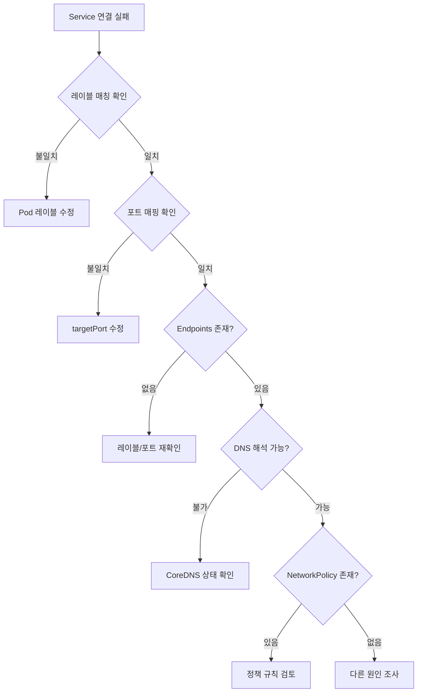
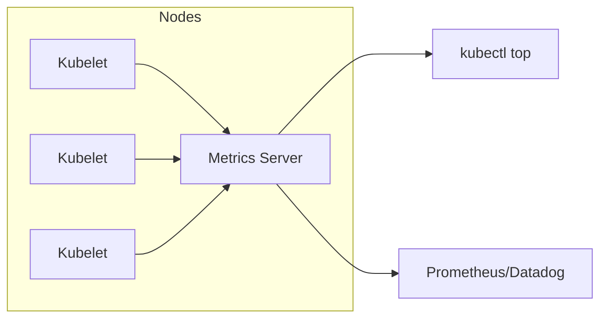

# Chapter 21. 애플리케이션 트러블슈팅 (Troubleshooting Applications)

---

## 📌 핵심 요약

> 이 장에서는 Kubernetes 클러스터에서 실행 중인 애플리케이션의 문제를 진단하고 해결하는 전략을 다룬다. 핵심은 **고수준 정보(Pod 상태)에서 시작하여 점진적으로 세부 사항(로그, 컨테이너 셸)으로 파고드는 체계적인 접근법**이다. Pod, 컨테이너, 서비스/네트워킹, 메트릭 모니터링 순으로 트러블슈팅 기법을 익힌다.

---

## 🎯 학습 목표

이 내용을 읽고 나면:
- [ ] Pod의 상태(Status)와 이벤트를 분석하여 문제 원인을 파악할 수 있다
- [ ] `kubectl logs`, `kubectl exec`, `kubectl debug` 명령어로 컨테이너를 디버깅할 수 있다
- [ ] Service와 Pod 간의 네트워킹 문제(레이블, 포트, DNS, NetworkPolicy)를 진단할 수 있다
- [ ] metrics server와 `kubectl top` 명령어로 리소스 사용량을 모니터링할 수 있다

---

## 📖 본문 정리

### 1. Pod 트러블슈팅

Pod는 Kubernetes의 가장 기본적인 실행 단위이며, 대부분의 트러블슈팅은 Pod 상태 확인에서 시작한다.

#### 1.1 고수준 정보 확인 (kubectl get pods)

```bash
# Pod 상태 확인
kubectl get pods

# 네임스페이스의 주요 오브젝트 전체 확인
kubectl get all
```

**확인해야 할 핵심 컬럼:**

| 컬럼 | 정상 상태 | 확인 포인트 |
|------|----------|------------|
| **READY** | `1/1` (정의된 컨테이너 수와 일치) | Ready 컨테이너 수가 부족하면 문제 |
| **STATUS** | `Running` | 에러 상태면 즉시 조치 필요 |
| **RESTARTS** | `0` | 0보다 크면 liveness probe 확인 |

> 💬 **주의**: `Running` 상태여도 애플리케이션이 정상 작동하지 않을 수 있다. 상태만으로 판단하지 말고 실제 동작을 검증해야 한다.

#### 1.2 일반적인 Pod 에러 상태

| Status | 원인 | 해결 방법 |
|--------|------|----------|
| **ImagePullBackOff** / **ErrImagePull** | 레지스트리에서 이미지 풀 실패 | 이미지 이름 확인, 레지스트리 존재 여부, 네트워크 접근성, 인증 정보 확인 |
| **CrashLoopBackOff** | 컨테이너 내 애플리케이션/명령어 크래시 | 실행 명령어 확인, 이미지 정상 실행 테스트 (Docker로 직접 실행) |
| **CreateContainerConfigError** | ConfigMap/Secret 참조 실패 | 설정 객체 이름 및 네임스페이스 존재 여부 확인 |
| **ContainerCreating** (지속) | 볼륨 마운트 실패 등 | `kubectl describe pod`로 이벤트 확인 |

```bash
# 에러 상태 예시
$ kubectl get pods
NAME              READY   STATUS         RESTARTS   AGE
misbehaving-pod   0/1     ErrImagePull   0          2s
```

#### 1.3 이벤트 검사 (kubectl describe / kubectl get events)

Pod 상태만으로 원인을 알 수 없을 때, 이벤트를 통해 상세 정보를 확인한다.

```bash
# 특정 Pod의 상세 정보 및 이벤트 확인
kubectl describe pod <pod-name>

# 네임스페이스 전체 이벤트 확인
kubectl get events
```

**이벤트 출력 예시 (Secret 마운트 실패):**
```
Events:
Type     Reason       Message
----     ------       -------
Warning  FailedMount  MountVolume.SetUp failed for volume "mysecret":
                      secret "mysecret" not found
```

> 💬 **비유**: `kubectl get pods`는 환자의 체온 측정, `kubectl describe pod`는 정밀 검사(CT/MRI)와 같다. 표면적인 증상만으로 진단이 어려우면 정밀 검사가 필요하다.

#### 1.4 포트 포워딩 (kubectl port-forward)

프로덕션 환경에서 특정 Pod만 개별적으로 테스트/디버깅할 때 사용한다.

```bash
# 로컬 포트 2500 → Pod 컨테이너 포트 80으로 포워딩
kubectl port-forward <pod-name> 2500:80

# 백그라운드 실행
kubectl port-forward <pod-name> 2500:80 &

# 접속 테스트
curl -Is localhost:2500 | head -n 1
# HTTP/1.1 200 OK
```

> ⚠️ **주의**: `port-forward`는 장기 운영용이 아닌 **테스트/트러블슈팅 전용**이다. Service를 통한 노출이 정식 방법.

---

### 2. 컨테이너 트러블슈팅

Pod 수준에서 문제를 찾지 못했다면, 컨테이너 내부로 들어가 디버깅한다.

#### 2.1 로그 검사 (kubectl logs)

```bash
# 기본 로그 확인
kubectl logs <pod-name>

# 특정 컨테이너 로그 (멀티 컨테이너 Pod)
kubectl logs <pod-name> -c <container-name>

# 실시간 로그 스트리밍
kubectl logs <pod-name> -f

# 재시작 이전 컨테이너 로그
kubectl logs <pod-name> --previous
```

**로그 확인 예시 (CrashLoopBackOff 원인 파악):**
```bash
$ kubectl logs incorrect-cmd-pod
/bin/sh: unknown: not found
```

#### 2.2 인터랙티브 셸 (kubectl exec)

로그만으로 부족할 때, 컨테이너 내부에서 직접 디버깅한다.

```bash
# 컨테이너에 셸 접속
kubectl exec <pod-name> -it -- /bin/sh

# 특정 컨테이너 지정
kubectl exec <pod-name> -c <container-name> -it -- /bin/sh
```

**디버깅 예시 (디렉토리 미존재 문제):**
```bash
$ kubectl exec failing-pod -it -- /bin/sh
# mkdir -p ~/tmp        # 누락된 디렉토리 생성
# ls -l ~/tmp
total 4
-rw-r--r-- 1 root root 112 May 9 23:52 curr-date.txt
```

#### 2.3 Distroless 컨테이너 디버깅 (kubectl debug)

보안상 셸이나 유틸리티가 없는 최소화된 이미지(Distroless)는 `exec`가 불가능하다.

```bash
# exec 시도 시 에러
$ kubectl exec minimal-pod -it -- /bin/sh
OCI runtime exec failed: ... "/bin/sh": stat /bin/sh: no such file or directory
```

**해결책: Ephemeral Container 사용**

```bash
# 임시 디버깅 컨테이너 주입
kubectl debug -it <pod-name> --image=busybox:1.37.0

# 세션 재연결
kubectl alpha attach <pod-name> -c debugger-xxxxx -i -t
```

> 💬 **비유**: Distroless 컨테이너는 "잠긴 금고"와 같다. `kubectl debug`는 전문 기술자가 임시로 도구를 가져와 금고 옆에서 작업하는 것과 같다.

---

### 3. 서비스 및 네트워킹 트러블슈팅

Service와 네트워킹 문제는 여러 레이어(Pod 네트워킹, DNS, NetworkPolicy, Ingress)가 관련되어 가장 진단이 어렵다.



#### 3.1 레이블 선택자 확인

```bash
# Service의 selector 확인
kubectl describe service myservice
# Selector: app=myapp

# Pod의 레이블 확인
kubectl get pods --show-labels
# LABELS: app=hello  ← 불일치!
```

#### 3.2 포트 매핑 확인

```bash
# Service의 targetPort
kubectl get service myapp -o yaml | grep targetPort:
#     targetPort: 80

# Pod의 containerPort
kubectl get pods myapp-xxx -o yaml | grep containerPort:
#     - containerPort: 80  ← 일치해야 함
```

#### 3.3 Endpoints 검사

```bash
# 정상: Pod IP와 포트가 표시됨
kubectl get endpoints myservice
# ENDPOINTS: 172.17.0.5:80,172.17.0.6:80

# 비정상: 빈 결과 → 레이블/포트 설정 오류
```

#### 3.4 Service 타입별 접근 범위

| Service Type | 접근 범위 | 테스트 방법 |
|--------------|----------|------------|
| **ClusterIP** | 클러스터 내부만 | 클러스터 내 임시 Pod에서 테스트 |
| **NodePort** | 노드 IP:포트로 외부 접근 | 노드 IP + NodePort로 접근 |
| **LoadBalancer** | 외부 로드밸런서 | External IP로 접근 |

```bash
# ClusterIP 테스트 (클러스터 내부에서)
kubectl run tmp --image=busybox:1.37.0 -it --rm -- wget 10.99.155.165:80
```

#### 3.5 DNS 문제 진단

```bash
# DNS 이름으로 접근 (같은 네임스페이스)
kubectl run tmp --image=busybox:1.37.0 -it --rm -- wget myservice:80

# FQDN 사용 (다른 네임스페이스)
kubectl run tmp --image=busybox:1.37.0 -it --rm -- \
  wget myservice.default.svc.cluster.local:80

# CoreDNS Pod 상태 확인
kubectl get pods -n kube-system -l k8s-app=kube-dns

# CoreDNS 로그 확인
kubectl logs -n kube-system -l k8s-app=kube-dns --tail=50
```

#### 3.6 NetworkPolicy 확인

NetworkPolicy가 적용되면 **명시적으로 허용된 트래픽만** 통과한다 (Default Deny).

```bash
# 네임스페이스의 NetworkPolicy 확인
kubectl get networkpolicies -n production

# 정책 상세 확인 (어떤 Pod가 영향받는지)
kubectl describe networkpolicy api-policy -n production

# 연결 테스트
kubectl exec -it frontend-pod -n production -- curl http://backend-service:8080
# 타임아웃 발생 시 NetworkPolicy 의심
```

---

### 4. 리소스 메트릭 모니터링

#### 4.1 Metrics Server 개요



**특징:**
- 클러스터 전체의 리소스 사용량 데이터 수집
- **메모리에만 저장** (히스토리 데이터 없음)
- 장기 모니터링은 Prometheus, Datadog 등 별도 도구 필요

#### 4.2 Metrics Server 설치 및 사용

```bash
# Minikube에서 활성화
minikube addons enable metrics-server

# 노드 리소스 사용량
kubectl top nodes
# NAME       CPU(cores)   CPU%   MEMORY(bytes)   MEMORY%
# minikube   283m         14%    1262Mi          32%

# Pod 리소스 사용량
kubectl top pod frontend
# NAME       CPU(cores)   MEMORY(bytes)
# frontend   0m           2Mi

# 특정 네임스페이스
kubectl top pods -n stress-test
```

> ⚠️ **주의**: Metrics Server 설치 후 데이터 수집까지 몇 분이 소요된다. "Metrics API not available" 에러 시 잠시 후 재시도.

---

## 🔍 심화 학습

### 추가 조사 내용

#### Ephemeral Containers 심화
- Kubernetes 1.25+에서 정식 기능(GA)
- Pod spec에 포함되지 않으며, 런타임에만 존재
- 디버깅 후 자동 정리됨

#### 고급 로그 분석 도구
- **stern**: 멀티 Pod 로그 동시 스트리밍
- **kubetail**: Pod 그룹 로그 테일링
- **Loki + Grafana**: 로그 집계 및 시각화

#### 네트워크 디버깅 고급 기법
```bash
# Pod 네트워크 네임스페이스 직접 접근 (노드에서)
nsenter -t <container-pid> -n ip addr

# tcpdump로 패킷 캡처
kubectl debug node/<node-name> -it --image=nicolaka/netshoot
```

### 출처
- [Kubernetes 공식 - Debug Pods](https://kubernetes.io/docs/tasks/debug/debug-application/debug-pods/)
- [Kubernetes 공식 - Ephemeral Containers](https://kubernetes.io/docs/concepts/workloads/pods/ephemeral-containers/)
- [Metrics Server GitHub](https://github.com/kubernetes-sigs/metrics-server)

---

## 💡 실무 적용 포인트

### 이런 상황에서 사용하세요

| 상황 | 사용 명령어 |
|------|------------|
| Pod가 Running인데 응답 없음 | `kubectl logs`, `kubectl exec` |
| Pod가 시작도 못 함 | `kubectl describe pod`, `kubectl get events` |
| 특정 Pod만 테스트하고 싶음 | `kubectl port-forward` |
| Distroless 이미지 디버깅 | `kubectl debug` |
| Service 연결 안 됨 | `kubectl get endpoints`, DNS 테스트 |
| 리소스 부족 의심 | `kubectl top pods/nodes` |

### 주의할 점 / 흔한 실수

- ⚠️ **STATUS가 Running이라고 안심하지 말 것** - 애플리케이션 레벨 오류는 STATUS에 반영 안 됨
- ⚠️ **다른 네임스페이스 Service 접근 시 FQDN 사용** - 단순 서비스명은 같은 네임스페이스만 해석
- ⚠️ **NetworkPolicy 존재 시 Default Deny** - 정책이 하나라도 있으면 명시적 허용 필요
- ⚠️ **Metrics Server는 실시간 데이터만** - 히스토리 분석은 별도 모니터링 도구 필요
- ⚠️ **`--previous` 옵션 활용** - 재시작된 컨테이너의 이전 로그가 원인 파악에 중요

### 면접에서 나올 수 있는 질문

- **Q: Pod가 CrashLoopBackOff 상태일 때 어떻게 디버깅하나요?**
  - A: `kubectl logs --previous`로 이전 컨테이너 로그 확인, `kubectl describe pod`로 이벤트 확인, 필요 시 command/args 검증

- **Q: Service에 연결이 안 될 때 체크리스트는?**
  - A: 1) 레이블 selector 매칭 확인 2) targetPort ↔ containerPort 일치 확인 3) Endpoints 존재 확인 4) DNS 해석 테스트 5) NetworkPolicy 확인

- **Q: Distroless 컨테이너는 어떻게 디버깅하나요?**
  - A: `kubectl debug` 명령으로 ephemeral container를 주입하여 디버깅 도구가 있는 이미지(busybox 등)로 접근

- **Q: metrics server와 Prometheus의 차이점은?**
  - A: Metrics server는 실시간 데이터만 메모리에 저장(휘발성), Prometheus는 시계열 데이터를 영구 저장하며 쿼리/알림 기능 제공

---

## ✅ 핵심 개념 체크리스트

- [ ] `kubectl get pods`의 READY, STATUS, RESTARTS 컬럼 의미를 설명할 수 있는가?
- [ ] ImagePullBackOff, CrashLoopBackOff, CreateContainerConfigError의 원인과 해결법을 아는가?
- [ ] `kubectl logs -f`, `kubectl logs --previous`의 차이를 아는가?
- [ ] `kubectl exec`와 `kubectl debug`의 사용 시점을 구분할 수 있는가?
- [ ] Service 연결 실패 시 체계적인 진단 순서를 따를 수 있는가?
- [ ] CoreDNS 문제 진단 방법을 아는가?
- [ ] NetworkPolicy의 Default Deny 모델을 이해하는가?
- [ ] `kubectl top` 명령어로 리소스 사용량을 확인할 수 있는가?

---

## 🔗 참고 자료

- 📄 공식 문서: [Debug Running Pods](https://kubernetes.io/docs/tasks/debug/debug-application/debug-running-pod/)
- 📄 공식 문서: [Debug Services](https://kubernetes.io/docs/tasks/debug/debug-application/debug-service/)
- 📄 공식 문서: [Resource Metrics Pipeline](https://kubernetes.io/docs/tasks/debug/debug-cluster/resource-metrics-pipeline/)
- 🎬 추천 영상: [Kubernetes Troubleshooting - TechWorld with Nana](https://www.youtube.com/watch?v=0e5DqtLERwY)
- 📚 연관 서적: *Kubernetes Up & Running* - Chapter on Debugging

---

## 📝 CKA 시험 포인트

### 시험 필수 명령어

```bash
# Pod 트러블슈팅 기본
kubectl get pods
kubectl describe pod <name>
kubectl logs <pod> [-c container] [-f] [--previous]
kubectl exec <pod> -it -- /bin/sh

# 포트 포워딩
kubectl port-forward <pod> <local-port>:<container-port>

# Ephemeral Container
kubectl debug -it <pod> --image=busybox

# Service/Network 진단
kubectl get endpoints <service>
kubectl get networkpolicies

# 메트릭
kubectl top nodes
kubectl top pods
```

### 시험 팁
1. **체계적 접근**: 고수준(get) → 중간(describe/events) → 저수준(logs/exec) 순서
2. **시간 관리**: 로그 확인으로 빠르게 원인 파악, 막히면 describe로 이벤트 확인
3. **FQDN 사용 습관화**: `<service>.<namespace>.svc.cluster.local`
