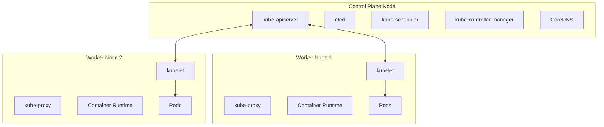
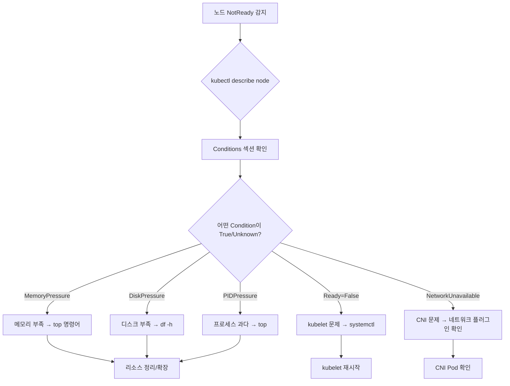

# Chapter 22. 클러스터 트러블슈팅 (Troubleshooting Clusters)

---

## 📌 핵심 요약

> 이 장에서는 Kubernetes 클러스터의 **인프라 수준 장애**를 진단하고 해결하는 방법을 다룬다. 핵심은 **노드 상태 확인 → 컴포넌트 상태 확인 → 리소스/프로세스/인증서 점검** 순서로 체계적으로 접근하는 것이다. Control Plane과 Worker Node의 문제는 수백 개의 워크로드에 동시에 영향을 미칠 수 있어, 애플리케이션 문제보다 훨씬 치명적이다.

---

## 🎯 학습 목표

이 내용을 읽고 나면:
- [ ] 클러스터 노드의 상태를 확인하고 NotReady 원인을 진단할 수 있다
- [ ] Control Plane 컴포넌트(kube-apiserver, etcd, scheduler 등)의 상태를 점검할 수 있다
- [ ] kubelet 프로세스 문제를 systemctl/journalctl로 진단하고 복구할 수 있다
- [ ] 인증서 만료 여부를 확인하고 갱신할 수 있다

---

## 📖 본문 정리

### 1. 클러스터 아키텍처 개요

트러블슈팅 전에 Kubernetes 클러스터의 구성 요소를 이해해야 한다.



#### Control Plane 컴포넌트

| 컴포넌트 | 역할 | 장애 시 영향 |
|----------|------|-------------|
| **kube-apiserver** | 클러스터 API 노출, kubectl 요청 처리 | 모든 클러스터 작업 불가 |
| **etcd** | 클러스터 데이터 저장소 (Key-Value) | 클러스터 상태 손실 |
| **kube-scheduler** | Pod를 노드에 배치 | 새 Pod 스케줄링 불가 |
| **kube-controller-manager** | 컨트롤러 실행 (Job, ReplicaSet 등) | 자동 복구/스케일링 불가 |
| **CoreDNS** | 클러스터 내부 DNS 서비스 | 서비스 이름 해석 불가 |
| **cloud-controller-manager** | 클라우드 API 연동 (선택) | 클라우드 리소스 연동 불가 |

#### 모든 노드 공통 컴포넌트

| 컴포넌트 | 역할 | 장애 시 영향 |
|----------|------|-------------|
| **kubelet** | Pod와 컨테이너 관리 | 노드의 Pod 실행 불가 |
| **kube-proxy** | Service 네트워크 규칙 관리 | 네트워크 통신 장애 |
| **Container Runtime** | 컨테이너 실행 (containerd, CRI-O) | 컨테이너 생성 불가 |

---

### 2. 클러스터 노드 상태 검사

#### 2.1 노드 목록 확인

```bash
kubectl get nodes
```

```
NAME                 STATUS   ROLES           AGE     VERSION
control-plane-node   Ready    control-plane   2m45s   v1.33.2
worker-node-1        Ready    <none>          2m36s   v1.33.2
worker-node-2        NotReady <none>          2m29s   v1.33.2
```

**확인 포인트:**

| 컬럼 | 정상 | 문제 징후 |
|------|------|----------|
| **STATUS** | `Ready` | `NotReady`, `Unknown` |
| **ROLES** | 명확한 역할 | 역할 누락 (control-plane 없음 등) |
| **VERSION** | 모든 노드 동일 | 버전 불일치 (호환성 문제) |

#### 2.2 클러스터 정보 확인

```bash
# 클러스터 기본 정보
kubectl cluster-info

# 상세 로그 덤프 (문제 진단용)
kubectl cluster-info dump
```

---

### 3. 클러스터 컴포넌트 상태 검사

#### 3.1 Control Plane 컴포넌트 확인

```bash
# kube-system 네임스페이스의 Pod 확인
kubectl get pods -n kube-system
```

```
NAME                      READY   STATUS    RESTARTS      AGE
etcd                      1/1     Running   1 (11d ago)   29d
kube-apiserver            1/1     Running   1 (11d ago)   29d
kube-controller-manager   1/1     Running   1 (11d ago)   29d
kube-scheduler            1/1     Running   1 (11d ago)   29d
coredns-xxx               1/1     Running   0             29d
kube-proxy-xxx            1/1     Running   0             29d
```

> ⚠️ **주의**: kubelet과 Container Runtime은 Pod가 아닌 **시스템 서비스**로 실행되므로 이 목록에 나타나지 않는다.

#### 3.2 컴포넌트 로그 확인

```bash
# Control Plane 컴포넌트 로그
kubectl logs kube-apiserver-control-plane -n kube-system
kubectl logs kube-scheduler-control-plane -n kube-system
kubectl logs kube-controller-manager-control-plane -n kube-system
kubectl logs etcd-control-plane -n kube-system
```

> 💬 **Managed Kubernetes (EKS, GKE, AKS)**: Control Plane Pod가 보이지 않을 수 있다. 클라우드 제공자가 관리하는 인프라에서 실행되기 때문. CKA 시험은 Self-managed 클러스터 환경.

---

### 4. 노드 문제 트러블슈팅

#### 4.1 NotReady 노드 진단 플로우



#### 4.2 NotReady 일반적인 원인

| 원인 | 증상 | 해결 방법 |
|------|------|----------|
| **리소스 부족** | MemoryPressure, DiskPressure, PIDPressure | 리소스 정리 또는 노드 스케일업 |
| **kubelet 중단** | Ready=False, "kubelet stopped posting node status" | systemctl restart kubelet |
| **kube-proxy 장애** | NetworkUnavailable 또는 Pod 통신 불가 | kube-proxy Pod 확인 및 재시작 |
| **인증서 만료** | kubelet이 API server와 통신 불가 | 인증서 갱신 |
| **네트워크 플러그인(CNI)** | NetworkUnavailable=True | CNI Pod 상태 확인 |

#### 4.3 노드 상세 정보 확인

```bash
kubectl describe node worker-node-1
```

**Conditions 섹션 해석:**

```
Conditions:
  Type                 Status  Reason                       Message
  ----                 ------  ------                       -------
  NetworkUnavailable   False   CalicoIsUp                   Calico is running
  MemoryPressure       False   KubeletHasSufficientMemory   kubelet has sufficient memory
  DiskPressure         False   KubeletHasNoDiskPressure     kubelet has no disk pressure
  PIDPressure          False   KubeletHasSufficientPID      kubelet has sufficient PID
  Ready                True    KubeletReady                 kubelet is posting ready status
```

| Status | 의미 |
|--------|------|
| **False** (Pressure 타입) | 정상 (압박 없음) |
| **True** (Pressure 타입) | 문제 (리소스 압박) |
| **True** (Ready 타입) | 정상 |
| **False/Unknown** (Ready 타입) | 문제 |

---

### 5. 시스템 레벨 진단

노드에 SSH 접속 후 시스템 명령어로 진단한다.

#### 5.1 리소스 확인

```bash
# 메모리, CPU, 프로세스 확인
top

# 디스크 공간 확인
df -h
```

**top 출력 예시:**
```
KiB Mem :  1008552 total,   134660 free,   264604 used,   609288 buff/cache
```

**df 출력 예시:**
```
Filesystem      Size  Used Avail Use% Mounted on
/dev/sda1        39G  2.7G   37G   7% /
```

#### 5.2 kubelet 프로세스 점검

```bash
# kubelet 상태 확인
systemctl status kubelet

# kubelet 로그 확인
journalctl -u kubelet.service
journalctl -u kubelet.service | tail -50  # 최근 50줄

# kubelet 재시작
systemctl restart kubelet
```

**정상 상태:**
```
● kubelet.service - kubelet: The Kubernetes Node Agent
   Active: active (running) since Thu 2022-01-20 18:11:41 UTC
```

**문제 상태:**
```
   Active: inactive (dead) / failed
```

#### 5.3 인증서 유효성 확인

```bash
# 특정 인증서 상세 확인
openssl x509 -in /var/lib/kubelet/pki/kubelet.crt -text

# 클러스터 전체 인증서 만료 확인 (권장)
kubeadm certs check-expiration
```

**kubeadm certs 출력 예시:**
```
CERTIFICATE                EXPIRES                  RESIDUAL TIME
admin.conf                 Aug 31, 2026 14:28 UTC   364d
apiserver                  Aug 31, 2026 14:28 UTC   364d
apiserver-etcd-client      Aug 31, 2026 14:28 UTC   364d
...
```

**인증서 갱신:**
```bash
# 모든 인증서 갱신
kubeadm certs renew all

# 갱신 후 컴포넌트 재시작 필요
# kube-apiserver, kube-controller-manager, kube-scheduler, etcd
```

#### 5.4 kube-proxy 점검

```bash
# kube-proxy Pod 목록 (각 노드당 1개)
kubectl get pods -n kube-system -l k8s-app=kube-proxy -o wide

# 특정 kube-proxy Pod 상세 정보
kubectl describe pod kube-proxy-xxxxx -n kube-system

# kube-proxy DaemonSet 확인
kubectl describe daemonset kube-proxy -n kube-system

# kube-proxy 로그
kubectl logs kube-proxy-xxxxx -n kube-system
```

---

### 6. Static Pod와 Control Plane 복구

Control Plane 컴포넌트는 **Static Pod**로 실행되며, 매니페스트 파일 위치가 고정되어 있다.

#### 6.1 Static Pod 매니페스트 위치

```bash
# Static Pod 매니페스트 디렉토리
/etc/kubernetes/manifests/

# 포함된 파일
ls /etc/kubernetes/manifests/
# etcd.yaml
# kube-apiserver.yaml
# kube-controller-manager.yaml
# kube-scheduler.yaml
```

#### 6.2 Control Plane 컴포넌트 복구

```bash
# 매니페스트 파일 수정 → kubelet이 자동으로 Pod 재시작
vi /etc/kubernetes/manifests/kube-scheduler.yaml

# 또는 파일을 잠시 이동했다가 복원
mv /etc/kubernetes/manifests/kube-scheduler.yaml /tmp/
mv /tmp/kube-scheduler.yaml /etc/kubernetes/manifests/
```

> 💬 **비유**: Static Pod 매니페스트는 "자동 복구 설정 파일"과 같다. kubelet이 이 디렉토리를 감시하고 있어서, 파일이 변경되면 자동으로 Pod를 재생성한다.

---

### 7. Pod 스케줄링 문제 해결

노드 문제로 인해 Pod가 `Pending` 상태에 머무를 수 있다.

#### 7.1 스케줄링 실패 원인 확인

```bash
# Pending Pod 확인
kubectl get pods | grep Pending

# Pod 이벤트 확인
kubectl describe pod <pod-name>
# Events 섹션에서 FailedScheduling 메시지 확인
```

#### 7.2 일반적인 스케줄링 문제

| 원인 | 확인 방법 | 해결 |
|------|----------|------|
| **노드 Taint** | `kubectl describe node \| grep Taint` | Taint 제거 또는 Pod에 Toleration 추가 |
| **리소스 부족** | `kubectl describe node \| grep -A5 "Allocated resources"` | 리소스 요청 조정 또는 노드 추가 |
| **노드 Cordon** | `kubectl get nodes \| grep SchedulingDisabled` | `kubectl uncordon <node>` |
| **NodeSelector 불일치** | Pod spec의 nodeSelector 확인 | 레이블 수정 |

#### 7.3 노드 관리 명령어

```bash
# 노드 스케줄링 비활성화 (Cordon)
kubectl cordon <node-name>

# 노드 스케줄링 활성화 (Uncordon)
kubectl uncordon <node-name>

# 노드 비우기 (Drain) - 유지보수 전
kubectl drain <node-name> --ignore-daemonsets --delete-emptydir-data

# Taint 제거 (마이너스 기호 주의!)
kubectl taint nodes <node-name> <taint-key>-
```

---

## 🔍 심화 학습

### 추가 조사 내용

#### etcd 클러스터 상태 확인
```bash
# etcd 멤버 목록
ETCDCTL_API=3 etcdctl member list \
  --endpoints=https://127.0.0.1:2379 \
  --cacert=/etc/kubernetes/pki/etcd/ca.crt \
  --cert=/etc/kubernetes/pki/etcd/healthcheck-client.crt \
  --key=/etc/kubernetes/pki/etcd/healthcheck-client.key

# etcd 클러스터 건강 상태
ETCDCTL_API=3 etcdctl endpoint health --endpoints=https://127.0.0.1:2379 ...
```

#### High Availability 클러스터
- Control Plane 노드가 여러 개인 경우, 하나의 장애가 전체 클러스터에 영향을 주지 않음
- etcd는 홀수 개(3, 5, 7)로 구성하여 쿼럼 유지
- kube-apiserver 앞에 Load Balancer 배치

### 출처
- [Kubernetes 공식 - Troubleshoot Clusters](https://kubernetes.io/docs/tasks/debug/debug-cluster/)
- [Kubernetes 공식 - PKI Certificates](https://kubernetes.io/docs/setup/best-practices/certificates/)
- [kubeadm certs 문서](https://kubernetes.io/docs/reference/setup-tools/kubeadm/kubeadm-certs/)

---

## 💡 실무 적용 포인트

### 이런 상황에서 사용하세요

| 상황 | 확인 명령어 |
|------|------------|
| 노드가 클러스터에서 사라짐 | `kubectl get nodes` |
| Pod가 계속 Pending 상태 | `kubectl describe pod`, `kubectl describe node` |
| kubectl 명령이 응답 없음 | kube-apiserver 상태 확인 |
| 새 Pod가 스케줄링 안 됨 | kube-scheduler 로그 확인 |
| Service 연결 불가 | kube-proxy Pod 상태 확인 |

### 주의할 점 / 흔한 실수

- ⚠️ **kubelet은 Pod가 아님** - `kubectl get pods`로 확인 불가, `systemctl`로 확인
- ⚠️ **Static Pod 수정 시 주의** - 매니페스트 문법 오류 시 컴포넌트 실행 불가
- ⚠️ **인증서 갱신 후 재시작 필수** - Control Plane 컴포넌트 재시작 잊지 말 것
- ⚠️ **drain 전에 cordon 먼저** - 워크로드 이동 전 새 Pod 스케줄링 차단
- ⚠️ **Managed K8s에서는 Control Plane 접근 제한** - EKS/GKE/AKS는 다른 접근법 필요

### 면접에서 나올 수 있는 질문

- **Q: 노드가 NotReady 상태일 때 어떻게 진단하나요?**
  - A: `kubectl describe node`로 Conditions 확인 → 리소스 압박이면 top/df로 확인, kubelet 문제면 `systemctl status kubelet`과 `journalctl -u kubelet`으로 진단

- **Q: kube-scheduler가 죽으면 어떤 일이 발생하나요?**
  - A: 기존 Running Pod는 영향 없음. 단, 새로운 Pod가 Pending 상태로 머물며 노드에 배치되지 않음

- **Q: Static Pod란 무엇이고 어디에 정의되나요?**
  - A: kubelet이 직접 관리하는 Pod로, `/etc/kubernetes/manifests/` 디렉토리의 YAML 파일로 정의됨. Control Plane 컴포넌트가 이 방식으로 실행됨

- **Q: 인증서 만료 시 클러스터에 어떤 영향이 있나요?**
  - A: kubelet이 API server와 통신 불가 → 노드 NotReady, kubectl 명령 실패 가능. `kubeadm certs renew all`로 갱신

---

## ✅ 핵심 개념 체크리스트

- [ ] `kubectl get nodes`로 노드 상태를 확인하고 문제를 식별할 수 있는가?
- [ ] Control Plane 컴포넌트(apiserver, scheduler, controller-manager, etcd)의 역할을 설명할 수 있는가?
- [ ] `kubectl describe node`의 Conditions 섹션을 해석할 수 있는가?
- [ ] `systemctl`과 `journalctl`로 kubelet 문제를 진단할 수 있는가?
- [ ] `kubeadm certs check-expiration`으로 인증서 상태를 확인할 수 있는가?
- [ ] Static Pod 매니페스트 위치(`/etc/kubernetes/manifests/`)를 알고 있는가?
- [ ] `kubectl cordon`, `kubectl uncordon`, `kubectl drain`의 차이를 아는가?

---

## 🔗 참고 자료

- 📄 공식 문서: [Troubleshoot Clusters](https://kubernetes.io/docs/tasks/debug/debug-cluster/)
- 📄 공식 문서: [kubeadm certs](https://kubernetes.io/docs/reference/setup-tools/kubeadm/kubeadm-certs/)
- 📄 공식 문서: [Static Pods](https://kubernetes.io/docs/tasks/configure-pod-container/static-pod/)
- 🎬 추천 영상: [CKA Exam - Cluster Troubleshooting](https://www.youtube.com/watch?v=wqsUfvRyYpw)
- 📚 연관 서적: *Kubernetes in Action* - Chapter on Cluster Administration

---

## 📝 CKA 시험 포인트

### 시험 필수 명령어 (암기!)

```bash
# === 노드 진단 ===
kubectl get nodes
kubectl describe node <node-name>
kubectl cluster-info
kubectl cluster-info dump

# === Control Plane 컴포넌트 ===
kubectl get pods -n kube-system
kubectl logs <component>-<node> -n kube-system
# 매니페스트 위치: /etc/kubernetes/manifests/

# === 노드 SSH 후 진단 ===
systemctl status kubelet
systemctl restart kubelet
journalctl -u kubelet.service | tail -50

# 리소스 확인
top
df -h

# === 인증서 ===
kubeadm certs check-expiration
kubeadm certs renew all

# === 노드 관리 ===
kubectl cordon <node>       # 스케줄링 비활성화
kubectl uncordon <node>     # 스케줄링 활성화
kubectl drain <node> --ignore-daemonsets --delete-emptydir-data

# Taint 제거 (마이너스 기호!)
kubectl taint nodes <node> <key>-

# === kube-proxy ===
kubectl get pods -n kube-system -l k8s-app=kube-proxy
kubectl logs <kube-proxy-pod> -n kube-system
```

### 시험 빈출 시나리오

1. **노드 NotReady** → describe node → Conditions 확인 → kubelet 재시작
2. **Pod Pending** → describe pod → FailedScheduling 원인 확인 → Taint/Cordon/리소스 문제 해결
3. **Control Plane 장애** → kube-system Pod 확인 → 매니페스트 파일 점검
4. **인증서 만료** → kubeadm certs check-expiration → renew all

### 시험 팁

1. **빠른 진단 순서 암기**: `get nodes` → `describe node` → SSH → `systemctl status kubelet`
2. **Static Pod 위치 암기**: `/etc/kubernetes/manifests/`
3. **Taint 제거 문법**: 키 뒤에 **마이너스(-)**를 붙임
4. **drain vs cordon**: drain은 기존 Pod도 축출, cordon은 새 Pod만 차단
