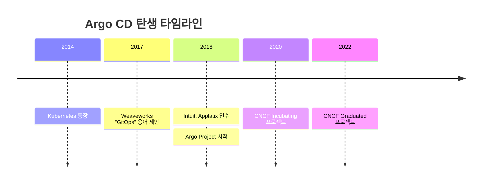
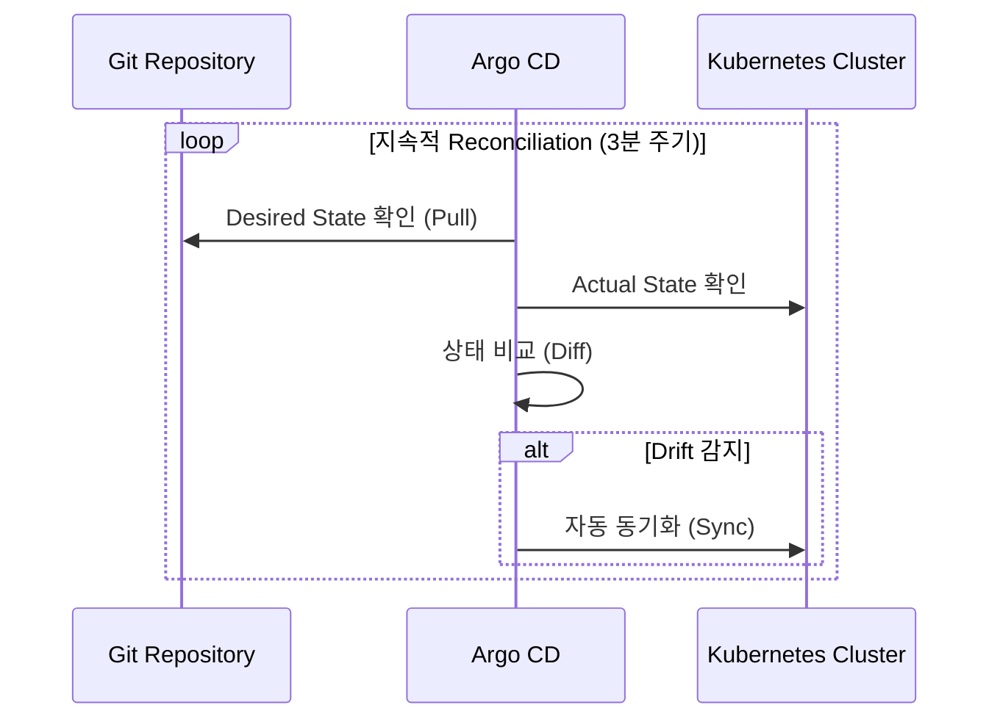
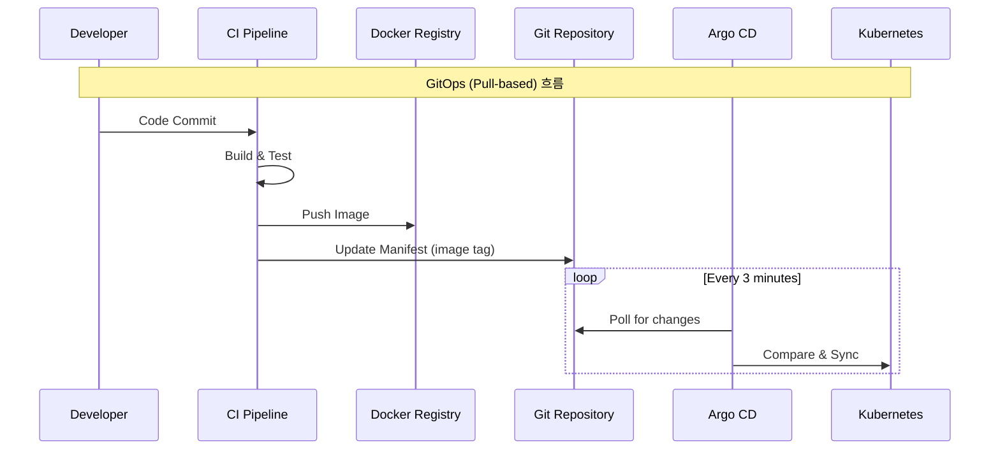
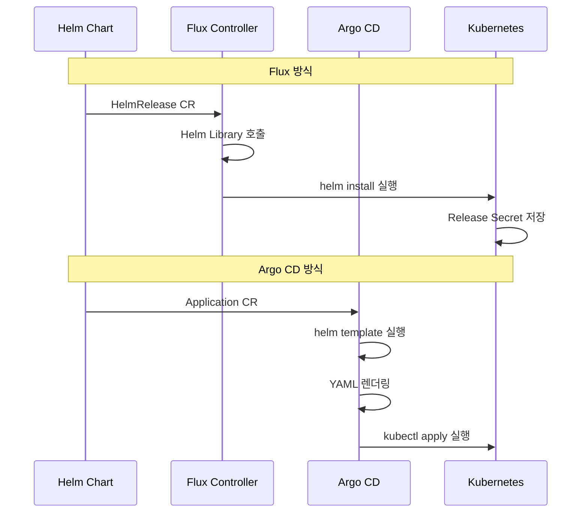
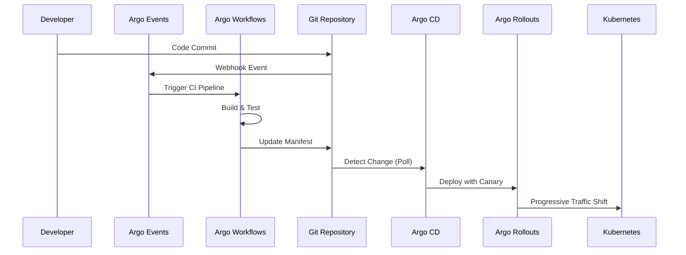

# 01. Introduction to Argo CD

---

## 📌 핵심 요약

> 이 장에서는 Kubernetes 생태계에서 Argo CD가 탄생한 배경과 GitOps의 개념을 소개합니다. Argo CD는 선언적(Declarative) 방식으로 애플리케이션 배포를 관리하고, Configuration Drift(설정 편차)를 방지하며, Git을 Single Source of Truth로 사용하여 Kubernetes 클러스터를 동기화합니다.

---

## 🎯 학습 목표

이 내용을 읽고 나면:
- [ ] Argo CD가 해결하는 문제와 탄생 배경을 설명할 수 있다
- [ ] GitOps의 4가지 원칙(OpenGitOps Principles)을 이해할 수 있다
- [ ] Argo CD와 Flux의 차이점을 비교할 수 있다
- [ ] Argo 생태계(Workflows, CD, Rollouts, Events)의 역할을 구분할 수 있다

---

## 📖 본문 정리

### 1. Argo CD란?

#### 1.1 탄생 배경

Kubernetes 도입 초기에는 많은 개발팀이 명령형(Imperative) 방식으로 클러스터를 관리했습니다. 예를 들어 개발자가 터미널에서 직접 `kubectl apply -f deployment.yaml`을 실행하는 방식이었죠. 이 방식은 마치 SSH로 서버에 접속해서 수동으로 설정 파일을 수정하던 시절과 크게 다르지 않았습니다.

이러한 수동 관리 방식은 심각한 문제를 야기했습니다. 첫째, 누가 언제 무엇을 배포했는지 추적이 불가능했습니다. 둘째, 클러스터 수가 급증하면서 관리 복잡성이 기하급수적으로 증가했습니다(Cluster Sprawl). 셋째, 누군가 클러스터에 직접 변경을 가하면 Git 저장소의 YAML 파일과 실제 클러스터 상태가 달라지는 Configuration Drift 현상이 발생했습니다. 넷째, 배포 이력이 제대로 버전 관리되지 않아 문제 발생 시 원인 파악과 롤백이 어려웠습니다.

#### 1.2 Intuit의 Argo CD 개발

Intuit은 Kubernetes 얼리어답터였고, 수천 명의 개발자가 Kubernetes를 쉽게 사용할 수 있도록 돕기 위해 Argo CD를 개발했습니다. Intuit의 핵심 철학은 세 가지였습니다.

첫째, GitOps를 우선으로 삼아 Git을 Single Source of Truth로 사용했습니다. 클러스터의 모든 변경사항은 반드시 Git을 거쳐야 한다는 원칙이죠. 둘째, 개발자 경험(Developer Experience)을 최우선으로 두어 Kubernetes의 복잡성을 추상화했습니다. 개발자가 YAML 세부사항을 몰라도 배포할 수 있게 만들었습니다. 셋째, 선언적 배포 방식을 채택하여 "어떻게(How)" 배포할지가 아니라 "무엇을(What)" 배포할지만 정의하면 Argo CD가 나머지를 처리하도록 했습니다.

---

### 2. Why Argo CD?

#### 2.1 Argo CD가 해결하는 문제

기존 방식에서는 Deployment, Service, ConfigMap 등 여러 개의 YAML 파일을 개별적으로 관리했습니다. 개발자는 각 파일을 수동으로 `kubectl apply`로 적용해야 했고, 이 파일들이 하나의 논리적 애플리케이션을 구성한다는 개념이 없었습니다.

Argo CD는 이러한 개별 Kubernetes 오브젝트들을 하나의 "Application"이라는 통합 단위로 묶습니다. 이 Application은 Git 저장소를 바라보며, Argo CD가 자동으로 Git의 변경사항을 감지하고 클러스터에 동기화합니다. 예를 들어 쇼핑몰 결제 서비스가 Deployment 3개, Service 3개, ConfigMap 5개로 구성되어 있다면, 이 11개의 오브젝트를 "payment-service"라는 하나의 Application으로 관리할 수 있습니다.

Argo CD는 네 가지 핵심 문제를 해결합니다. 첫째, Unifying Application Definitions를 통해 흩어진 Kubernetes 오브젝트를 하나의 논리적 단위로 통합합니다. 둘째, Configuration Drift를 방지하기 위해 실시간으로 Git과 클러스터 상태를 비교하고 차이가 발생하면 자동으로 복원합니다. 셋째, Rollback과 Disaster Recovery가 간단해집니다. Git에서 이전 커밋으로 되돌리기만 하면 Argo CD가 자동으로 클러스터를 복원하기 때문이죠. 넷째, 감사(Audit) 추적이 완벽해집니다. 모든 변경사항이 Git 커밋 이력으로 남기 때문에 누가 언제 무엇을 변경했는지 명확하게 추적할 수 있습니다.

#### 2.2 Configuration Drift 해결

Configuration Drift는 "의도한 상태(Git에 저장된 YAML)"와 "실제 상태(클러스터에 실행 중인 리소스)"가 불일치하는 상황을 말합니다. 예를 들어 개발자가 긴급 장애 대응 중에 `kubectl edit deployment`로 직접 레플리카 수를 수정했다면, 이 변경사항은 Git에 반영되지 않아 Drift가 발생합니다.

Argo CD는 이 문제를 Reconciliation Loop로 해결합니다. Argo CD는 주기적으로(기본 3분마다) Git 저장소에서 Desired State를 읽어오고, Kubernetes 클러스터에서 Actual State를 확인한 뒤, 두 상태를 비교(Diff)합니다. 만약 차이가 감지되면 자동으로 클러스터를 Git 상태에 맞춰 동기화(Sync)합니다. 이는 마치 온도 조절 장치가 설정 온도와 실제 온도를 지속적으로 비교하며 조정하는 것과 유사합니다.

Event-driven CI/CD는 "이벤트가 발생해야만 반응"하는 수동적 방식이지만, GitOps는 "지속적으로 상태를 감시하고 스스로 복원"하는 능동적 방식입니다. 이것이 GitOps가 Configuration Drift를 근본적으로 해결할 수 있는 이유입니다.

#### 2.3 Rollback & Disaster Recovery

전통적인 배포 시스템에서 롤백은 복잡했습니다. 이전 버전의 Docker 이미지 태그를 찾고, 배포 스크립트를 실행하고, 각 환경별로 설정을 확인해야 했죠. 하지만 GitOps에서는 롤백이 단순합니다.

장애가 발생하면 개발자는 Git에서 `git revert` 명령으로 이전 커밋으로 되돌립니다. Argo CD는 Git의 변경을 감지하고 자동으로 클러스터 상태를 복원합니다. 별도의 복구 스크립트나 kubectl 명령이 필요 없습니다. 예를 들어 결제 서비스 배포 후 장애가 발생했다면, Git에서 한 번의 revert만으로 1분 이내에 이전 안정 버전으로 복구할 수 있습니다.

---

### 3. GitOps Movement

#### 3.1 GitOps의 기원

2017년 Weaveworks의 CEO Alexis Richardson이 플랫폼 장애 복구 경험을 공유하며 "GitOps"라는 용어를 처음 사용했습니다. 당시 Weaveworks는 잘못된 설정 변경으로 전체 플랫폼이 다운되는 심각한 장애를 겪었지만, 짧은 시간 내에 복구할 수 있었습니다. 그 비결은 모든 인프라 상태를 Git으로 관리하고 자동화된 복구 메커니즘을 갖추고 있었기 때문이었죠.

이 사례는 Kubernetes 커뮤니티에 큰 영향을 미쳤고, GitOps는 클라우드 네이티브 환경의 표준 배포 방식으로 자리잡았습니다.

#### 3.2 OpenGitOps 4원칙 (v1.0, 2021)

GitOps 생태계가 성숙하면서 2021년 OpenGitOps Working Group이 GitOps의 공식 원칙을 정의했습니다. 이 4가지 원칙은 GitOps 도구가 갖춰야 할 핵심 요구사항입니다.

**첫째, Declarative(선언적)입니다.** 시스템의 원하는 상태를 선언적으로 표현해야 합니다. 명령형 방식은 "레플리카를 3개에서 5개로 증가시켜라"처럼 변경 과정을 명령하지만, 선언적 방식은 "레플리카는 5개여야 한다"는 최종 상태(End State)만 명시합니다. 이렇게 해야 하는 이유는 중간 과정에 오류가 발생하거나 여러 번 적용되어도 결과가 항상 일관되기 때문입니다. 예를 들어 쇼핑몰 서비스가 레플리카 5개로 선언되어 있으면, 현재 3개든 10개든 상관없이 최종적으로 5개가 됩니다.

**둘째, Versioned and Immutable(버전화되고 불변)입니다.** 원하는 상태는 버전 관리 시스템(Git)에 저장되고, 한 번 커밋된 내용은 변경되지 않습니다(Immutable). 이것이 중요한 이유는 언제든지 이전 상태로 롤백할 수 있고, 변경 이력을 완벽하게 추적할 수 있기 때문입니다. 예를 들어 6개월 전 특정 날짜의 프로덕션 상태를 정확히 재현할 수 있습니다.

**셋째, Pulled Automatically(자동으로 Pull)입니다.** 소프트웨어 에이전트가 자동으로 Git 저장소에서 변경사항을 가져옵니다(Polling). Webhook으로 Push하는 방식이 아닙니다. 왜 Pull 방식이어야 할까요? Push 방식은 외부에서 클러스터로 접근 권한을 줘야 하므로 보안 위험이 있고, 네트워크 방화벽 설정이 복잡해집니다. 반면 Pull 방식은 클러스터 내부의 에이전트가 외부로 나가서 Git을 읽어오기만 하면 되므로 훨씬 안전합니다.

**넷째, Continuously Reconciled(지속적으로 조정)입니다.** 소프트웨어 에이전트는 실제 상태와 원하는 상태를 지속적으로 비교하고 차이를 수정합니다(Reconciliation Loop). 이것이 핵심인 이유는 Configuration Drift를 자동으로 복구할 수 있기 때문입니다. 예를 들어 누군가 실수로 클러스터에서 레플리카를 수동으로 줄였다면, 다음 Reconciliation 사이클(보통 3분 이내)에 자동으로 Git에 정의된 레플리카 수로 복원됩니다.

#### 3.3 GitOps vs Traditional CI/CD

전통적인 CI/CD 파이프라인과 GitOps는 근본적으로 다른 철학을 갖고 있습니다. 두 방식을 구체적인 시나리오로 비교해보겠습니다.

**Traditional CI/CD (Push-based) 시나리오:** 개발자가 코드를 커밋하면 Jenkins가 빌드를 실행하고, Docker 이미지를 레지스트리에 푸시합니다. 이후 Jenkins가 Webhook을 받아 직접 `kubectl apply`를 실행하여 Kubernetes에 배포합니다. 만약 누군가 클러스터에서 수동으로 레플리카를 변경했다면, 다음 배포 파이프라인이 실행되기 전까지는 이 Drift가 방치됩니다. 파이프라인 실행 권한을 가진 주체(Jenkins)가 클러스터에 접근 가능해야 하므로 보안 설정이 복잡합니다.

**GitOps (Pull-based) 시나리오:** 개발자가 코드를 커밋하면 CI 파이프라인이 빌드하고 이미지를 푸시합니다. 그 다음 CI는 Git 저장소의 매니페스트 파일(예: deployment.yaml)을 업데이트합니다. 여기까지가 CI의 역할입니다. 이제 클러스터 내부의 Argo CD가 주기적으로(3분마다) Git을 폴링하여 변경을 감지하고, 자동으로 클러스터를 동기화합니다. 만약 Drift가 발생하면 다음 Reconciliation 사이클에서 즉시 복원됩니다.

두 방식의 핵심 차이는 다음과 같습니다. 트리거 방식에서 Traditional CI/CD는 Webhook(Push)을 사용하지만, GitOps는 Polling(Pull)을 사용합니다. 배포 주체는 Traditional CI/CD에서는 CI 파이프라인이지만, GitOps에서는 클러스터 내부의 GitOps 에이전트입니다. Drift 대응은 Traditional CI/CD가 다음 배포까지 방치하는 반면, GitOps는 지속적인 Reconciliation으로 즉시 복구합니다. 감사(Audit)는 Traditional CI/CD가 CI 로그에 의존하지만, GitOps는 Git 커밋 이력으로 완벽하게 추적됩니다.

---

### 4. Flux vs Argo CD 비교

GitOps 도구로는 Flux와 Argo CD가 가장 널리 사용됩니다. 두 도구 모두 CNCF Graduated 프로젝트이지만, 철학과 구현 방식에서 큰 차이가 있습니다.

#### 4.1 철학적 차이

Flux와 Argo CD는 설계 철학부터 다릅니다. Flux는 Toolkit 기반의 모듈화된 접근 방식을 취합니다. Flux는 source-controller, kustomize-controller, helm-controller 등 여러 개의 독립적인 컨트롤러로 구성되어 있어, 필요한 기능만 선택적으로 설치할 수 있습니다. 이는 마치 레고 블록처럼 원하는 기능을 조립하는 방식입니다. 반면 Argo CD는 완성형 제품(Batteries Included) 철학을 따릅니다. 설치하면 즉시 사용 가능한 통합 솔루션을 제공하죠.

UI 측면에서도 차이가 있습니다. Flux는 기본적으로 UI가 없으며, UI가 필요하면 Weave GitOps라는 별도 상용 제품을 구매해야 합니다. Argo CD는 강력한 Web UI를 기본 제공하여 개발자가 브라우저에서 애플리케이션 상태를 시각적으로 확인하고 배포를 관리할 수 있습니다. 이는 개발자 경험(DX)에서 Argo CD의 큰 장점입니다.

RBAC 시스템도 다릅니다. Flux는 Kubernetes 네이티브 RBAC을 그대로 사용합니다. 즉, Kubernetes의 Role과 RoleBinding으로 권한을 관리하죠. Argo CD는 자체 RBAC 시스템을 구축했습니다. 프로젝트, 애플리케이션 단위로 세밀한 권한 제어가 가능하며, 특히 멀티 테넌트 환경에서 유용합니다. 예를 들어 "팀 A는 dev 네임스페이스만, 팀 B는 prod 네임스페이스만" 같은 권한 분리가 쉽습니다.

Multi-tenancy 지원도 차이가 있습니다. Flux는 기본적으로 Multi-tenancy를 지원하지 않아 직접 구성해야 합니다. Argo CD는 Projects라는 개념으로 Multi-tenancy를 기본 지원합니다.

#### 4.2 Helm 처리 방식 비교

Helm Chart를 처리하는 방식에서 두 도구는 완전히 다른 접근을 취합니다. 이 차이는 실무에서 중요한 의미를 갖습니다.

Flux는 Helm Golang 라이브러리를 직접 사용합니다. 즉, `helm install` 명령과 동일하게 동작하며, Helm 릴리스가 Kubernetes 클러스터에 Secret으로 저장됩니다. 따라서 `helm ls` 명령으로 릴리스 목록을 확인할 수 있고, Helm의 모든 기능(Hooks, 롤백 등)을 완벽하게 지원합니다.

반면 Argo CD는 `helm template` 명령으로 Chart를 순수 YAML로 렌더링한 뒤, `kubectl apply`로 적용합니다. Helm 릴리스 개념이 없으므로 `helm ls`에서 보이지 않습니다. 왜 Argo CD는 이런 방식을 선택했을까요?

이유는 "모든 것을 Kubernetes 리소스로 통일"하기 위함입니다. Argo CD는 Helm Chart든 Kustomize든 Plain YAML이든 모두 동일한 방식(kubectl apply)으로 처리합니다. 이렇게 하면 `kubectl diff`로 변경사항을 미리 확인할 수 있고, Argo CD UI에서 모든 리소스를 일관되게 시각화할 수 있습니다.

Argo CD 방식의 Trade-off는 명확합니다. 장점은 `kubectl diff`로 배포 전 변경사항을 정확히 확인할 수 있고, 순수 YAML이므로 Kubernetes와 직접 상호작용한다는 것입니다. 단점은 `helm ls`로 릴리스를 조회할 수 없고, Helm Hooks 중 일부(pre-install, post-install 등)가 제한적으로 동작할 수 있다는 것입니다.

실무에서는 어떻게 선택할까요? Helm 생태계를 완벽히 활용하고 싶다면 Flux가 적합하고, 통합된 UI와 멀티 테넌트 환경이 중요하다면 Argo CD가 적합합니다.

---

### 5. Argo 생태계

Argo는 단일 도구가 아니라 4개의 독립적인 프로젝트로 구성된 생태계입니다. 각 프로젝트는 서로 다른 문제를 해결하지만, 함께 사용하면 강력한 시너지를 발휘합니다.

**Argo Workflows**는 클라우드 네이티브 워크플로우 엔진입니다. Kubernetes 위에서 복잡한 DAG(Directed Acyclic Graph) 기반 워크플로우를 실행합니다. AI/ML 파이프라인이나 데이터 처리 배치 작업에 주로 사용되며, CI 파이프라인 도구로도 인기가 높습니다. 예를 들어 Jenkins 대신 Argo Workflows로 빌드-테스트-배포 파이프라인을 구성하는 팀들이 많습니다. GitHub 스타 수 기준으로 Argo 프로젝트 중 가장 인기가 높습니다.

**Argo CD**는 GitOps 기반 애플리케이션 배포 도구입니다. Git 저장소를 Single Source of Truth로 사용하여 Kubernetes 클러스터를 선언적으로 관리합니다. DevOps 팀과 Platform 팀이 주로 사용하며, 멀티 클러스터 환경에서 수백 개의 마이크로서비스를 관리할 때 특히 유용합니다.

**Argo Rollouts**는 Progressive Delivery를 위한 도구입니다. Kubernetes의 기본 Deployment는 단순한 롤링 업데이트만 지원하지만, Argo Rollouts는 Canary 배포, Blue-Green 배포, A/B 테스트 등 고급 배포 전략을 제공합니다. 예를 들어 "신규 버전을 10%의 사용자에게만 먼저 배포하고, 에러율을 확인한 뒤 점진적으로 100%까지 확대"하는 시나리오를 자동화할 수 있습니다. SRE 팀과 DevOps 팀이 프로덕션 배포 안정성을 높이기 위해 사용합니다.

**Argo Events**는 이벤트 기반 트리거 시스템입니다. Webhook, 메시지 큐, S3 버킷 등 다양한 이벤트 소스를 감지하여 Argo Workflows나 Kubernetes Job을 자동으로 실행합니다. 예를 들어 "S3에 새 파일이 업로드되면 데이터 처리 워크플로우를 실행"하거나 "Slack 메시지를 받으면 배포 파이프라인을 트리거"하는 시나리오에 사용됩니다.

이 4개 프로젝트는 독립적으로 사용할 수도 있지만, 함께 사용하면 강력한 자동화를 구축할 수 있습니다. 예를 들어 실무에서는 다음과 같이 조합합니다.

개발자가 코드를 커밋하면 Argo Events가 Git Webhook을 감지합니다. Argo Events는 Argo Workflows를 트리거하여 빌드-테스트-이미지 빌드 파이프라인을 실행합니다. Workflows는 성공 시 Git 매니페스트를 업데이트하고, Argo CD가 이를 감지하여 Kubernetes에 배포합니다. 배포는 Argo Rollouts를 통해 Canary 전략으로 진행되며, 메트릭이 정상이면 자동으로 전체 트래픽을 새 버전으로 전환합니다.

---

## 🔍 심화 학습

### CNCF 졸업 프로젝트

Argo CD는 2022년 CNCF Graduated 프로젝트로 승격되었습니다. CNCF 프로젝트는 Sandbox → Incubating → Graduated 단계로 성숙도를 평가받는데, Graduated는 프로덕션 환경에서 광범위하게 사용되고 안정적이며 강력한 커뮤니티 지원을 받는다는 의미입니다. 이는 Argo CD를 프로덕션에 도입해도 안전하다는 객관적 지표입니다.

### Argo CD와 함께 사용하는 도구

실무에서 Argo CD는 단독으로 사용되기보다는 여러 도구와 조합됩니다.

**Helm**은 템플릿 기반 Kubernetes 매니페스트 관리 도구입니다. 동일한 애플리케이션을 dev, staging, prod 환경에 배포할 때 values.yaml만 바꿔서 재사용할 수 있습니다. Argo CD는 Helm Chart를 Application Source로 지원합니다.

**Kustomize**는 오버레이 기반 YAML 커스터마이징 도구입니다. base 디렉토리에 공통 매니페스트를 두고, overlays/dev, overlays/prod에서 환경별 차이만 패치합니다. Helm보다 단순하고 Kubernetes 네이티브 방식을 선호하는 팀들이 사용합니다.

**Sealed Secrets**는 암호화된 시크릿을 Git에 안전하게 저장하는 도구입니다. GitOps의 가장 큰 문제는 "시크릿을 어떻게 Git에 저장할 것인가"인데, Sealed Secrets는 공개키로 암호화한 SealedSecret을 Git에 커밋하고, 클러스터의 컨트롤러가 비밀키로 복호화하여 Secret을 생성합니다.

**External Secrets**는 외부 시크릿 매니저(AWS Secrets Manager, HashiCorp Vault 등)와 연동하는 도구입니다. 시크릿을 Git에 저장하지 않고 외부 시스템에서 동적으로 가져옵니다. 대규모 엔터프라이즈 환경에서 중앙 집중식 시크릿 관리를 위해 사용됩니다.

### 출처
- [OpenGitOps Principles v1.0](https://opengitops.dev/)
- [Argo Project 공식 사이트](https://argoproj.github.io/)
- [CNCF Argo CD](https://www.cncf.io/projects/argo/)

---

## 💡 실무 적용 포인트

### 이런 상황에서 Argo CD를 사용하세요

**다중 클러스터 관리 시나리오:** 개발팀 5명이 dev, staging, prod 3개 클러스터에 20개의 마이크로서비스를 운영한다고 가정해봅시다. 각 클러스터마다 수동으로 배포하면 실수가 발생하기 쉽고 관리가 어렵습니다. Argo CD는 하나의 중앙 집중식 대시보드에서 모든 클러스터의 애플리케이션 상태를 확인하고 배포를 관리할 수 있습니다.

**Configuration Drift 방지 시나리오:** 새벽 2시에 장애가 발생하여 DevOps 엔지니어가 긴급하게 `kubectl edit`으로 레플리카 수를 수정했습니다. 장애는 해결되었지만 이 변경사항은 Git에 반영되지 않았습니다. 다음 날 아침, 다른 개발자가 배포를 진행하면 레플리카 수가 원래대로 되돌아가 혼란이 발생합니다. Argo CD의 자동 Reconciliation은 이런 Drift를 즉시 감지하고 Git 상태로 복원하여 일관성을 유지합니다.

**빠른 롤백 필요 시나리오:** 결제 서비스 신규 버전 배포 후 에러율이 급증했습니다. 전통적인 방식에서는 Jenkins 파이프라인을 찾고, 이전 이미지 태그를 확인하고, 배포 스크립트를 실행해야 합니다. Argo CD를 사용하면 Git에서 `git revert` 한 번으로 1분 이내에 이전 버전으로 롤백됩니다.

**배포 감사(Audit) 시나리오:** 보안 감사 중 "지난 3개월간 프로덕션에 누가 무엇을 배포했는지" 보고서를 요구받았습니다. 전통적인 CI/CD에서는 CI 로그를 일일이 검색해야 하지만, GitOps에서는 Git 커밋 이력만 확인하면 모든 배포 이력, 변경 내용, 배포자가 명확하게 추적됩니다.

**개발자 셀프서비스 시나리오:** 마이크로서비스 아키텍처에서 개발팀이 자율적으로 배포하길 원합니다. 하지만 kubectl 권한을 직접 주면 보안 위험이 있고, Kubernetes를 모르는 주니어 개발자는 어려워합니다. Argo CD UI를 통해 개발자는 간단한 클릭만으로 배포 상태를 확인하고 동기화할 수 있으며, RBAC으로 프로젝트별 권한을 제어할 수 있습니다.

### 주의할 점 / 흔한 실수

첫째, Git을 Single Source of Truth로 엄격히 유지해야 합니다. 긴급 상황이라도 클러스터에 직접 `kubectl apply`를 실행하는 순간 GitOps가 무너집니다. 모든 변경은 반드시 Git을 거쳐야 합니다. 만약 정말 긴급하게 수동 변경이 필요했다면, 즉시 Git에 동일한 변경을 커밋하여 Drift를 해소해야 합니다.

둘째, 시크릿 관리를 주의해야 합니다. 절대로 평문 시크릿을 Git에 커밋하면 안 됩니다. Sealed Secrets, External Secrets, SOPS 등의 도구를 반드시 사용하세요. "Private 저장소니까 괜찮겠지"라는 생각은 위험합니다. Git 이력에 한 번 커밋된 시크릿은 삭제해도 이력에 남기 때문입니다.

셋째, Helm Hooks 제한을 이해해야 합니다. Argo CD는 `helm template`을 사용하므로 일부 Helm Hooks가 예상과 다르게 동작할 수 있습니다. 특히 pre-install, post-upgrade 같은 라이프사이클 훅을 사용하는 Chart를 배포할 때는 사전에 테스트가 필요합니다.

넷째, Sync Policy를 신중하게 선택해야 합니다. 자동 동기화(Auto Sync)는 편리하지만, Git에 잘못된 설정이 커밋되면 즉시 프로덕션에 반영됩니다. 프로덕션 환경에서는 수동 동기화를 유지하고, 승인 프로세스를 거치는 것을 권장합니다.

다섯째, 멀티 테넌트 환경에서는 RBAC을 제대로 설정해야 합니다. Argo CD의 Projects와 AppProjects를 활용하여 팀별로 네임스페이스, 클러스터, Git 저장소 접근 권한을 명확히 분리하세요. 권한 설정 실수로 다른 팀의 애플리케이션을 삭제하는 사고를 방지할 수 있습니다.

### 면접에서 나올 수 있는 질문

**Q: GitOps와 Traditional CI/CD의 차이점은 무엇인가요?**

A: 가장 큰 차이는 배포 방식과 Drift 대응입니다. Traditional CI/CD는 Push 기반으로, CI 파이프라인이 직접 Kubernetes에 배포합니다. 하지만 누군가 클러스터를 수동으로 변경하면 다음 배포 전까지 이 Drift가 방치됩니다. GitOps는 Pull 기반으로, 클러스터 내부의 에이전트가 주기적으로 Git을 폴링하고, 실제 상태와 비교하여 자동으로 동기화합니다. 따라서 Configuration Drift를 지속적으로 복구할 수 있습니다.

**Q: OpenGitOps 4원칙을 설명해주세요.**

A: 첫째, Declarative는 원하는 상태를 선언적으로 표현하는 것입니다. 과정이 아닌 최종 상태만 정의하죠. 둘째, Versioned and Immutable은 모든 상태를 Git에 버전 관리하고 불변성을 보장하는 것입니다. 이를 통해 롤백과 감사가 가능합니다. 셋째, Pulled Automatically는 에이전트가 자동으로 Git에서 변경사항을 Pull한다는 것입니다. Push가 아니라 Pull 방식이기 때문에 보안이 강화됩니다. 넷째, Continuously Reconciled는 지속적으로 실제 상태와 원하는 상태를 비교하고 복원하는 것입니다. 이것이 Configuration Drift를 방지하는 핵심입니다.

**Q: Configuration Drift란 무엇이고, Argo CD는 어떻게 해결하나요?**

A: Configuration Drift는 Git에 정의된 의도한 상태와 클러스터의 실제 상태가 불일치하는 현상입니다. 예를 들어 긴급 장애 대응 중 `kubectl edit`으로 레플리카를 수정했는데 Git에는 반영하지 않은 경우입니다. Argo CD는 Reconciliation Loop로 이를 해결합니다. 3분마다 Git의 Desired State와 Kubernetes의 Actual State를 비교하고, 차이가 있으면 자동으로 Git 상태로 동기화합니다.

**Q: Argo CD와 Flux의 Helm 처리 방식 차이는 무엇인가요?**

A: Flux는 Helm Golang 라이브러리를 사용하여 `helm install`을 직접 실행합니다. 따라서 Helm 릴리스가 클러스터에 저장되고 `helm ls`로 조회할 수 있습니다. 반면 Argo CD는 `helm template`으로 Chart를 순수 YAML로 렌더링한 뒤 `kubectl apply`로 적용합니다. Helm 릴리스 개념이 없으므로 `helm ls`에 보이지 않지만, `kubectl diff`로 변경사항을 미리 확인할 수 있고 모든 리소스를 통일된 방식으로 관리할 수 있다는 장점이 있습니다.

**Q: Push-based vs Pull-based 배포의 장단점은 무엇인가요?**

A: Push-based는 CI 파이프라인이 직접 클러스터에 배포하는 방식입니다. 장점은 즉각적인 배포가 가능하고 구현이 간단하다는 것입니다. 단점은 외부에서 클러스터로 접근 권한이 필요하여 보안 위험이 있고, Configuration Drift를 자동으로 복구할 수 없습니다. Pull-based는 클러스터 내부의 에이전트가 Git을 폴링하는 방식입니다. 장점은 보안이 강화되고(클러스터가 외부로 나가기만 함), Drift를 지속적으로 복구할 수 있으며, Git이 Single Source of Truth가 된다는 것입니다. 단점은 폴링 주기만큼 배포가 지연될 수 있다는 것입니다(보통 3분 이내).

---

## ✅ 핵심 개념 체크리스트

- [ ] Argo CD가 해결하는 문제(Cluster Sprawl, Configuration Drift, 롤백, 감사)를 구체적인 시나리오로 설명할 수 있는가?
- [ ] GitOps의 4가지 원칙(Declarative, Versioned & Immutable, Pulled Automatically, Continuously Reconciled)을 각각 "왜 필요한지"와 함께 설명할 수 있는가?
- [ ] Push-based CI/CD와 Pull-based GitOps의 차이를 트리거 방식, 배포 주체, Drift 대응, 감사 관점에서 비교할 수 있는가?
- [ ] Argo CD와 Flux의 철학적 차이(모듈화 vs 완성형, UI, RBAC, Helm 처리)를 설명할 수 있는가?
- [ ] Argo 생태계(Workflows, CD, Rollouts, Events)가 실무에서 어떻게 조합되어 사용되는지 시나리오로 설명할 수 있는가?

---

## 🔗 참고 자료

- 📄 공식 문서: [Argo CD Documentation](https://argo-cd.readthedocs.io/)
- 📄 OpenGitOps: [opengitops.dev](https://opengitops.dev/)
- 📄 Argo Project: [argoproj.github.io](https://argoproj.github.io/)
- 📄 CNCF: [Argo CD Graduated Project](https://www.cncf.io/projects/argo/)
- 📚 비교: [Flux vs Argo CD](https://www.cncf.io/blog/2021/08/19/flux-vs-argo-cd/)

---
