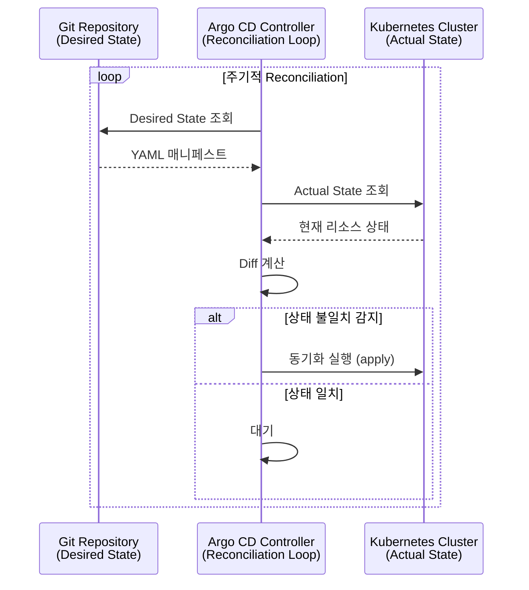
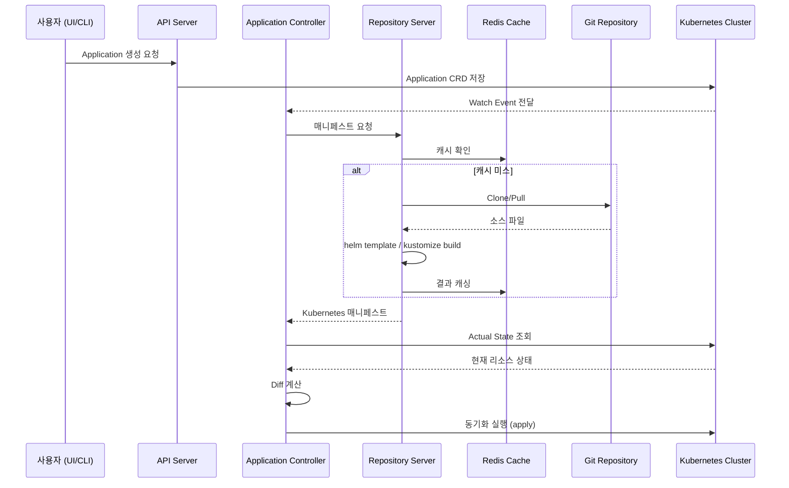
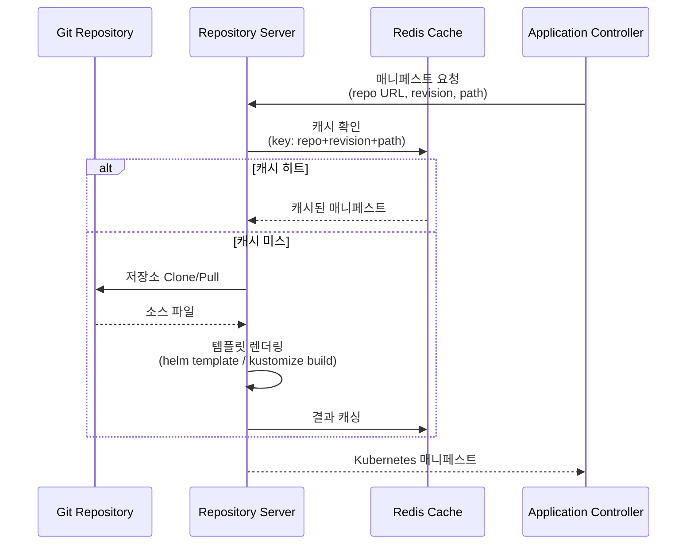
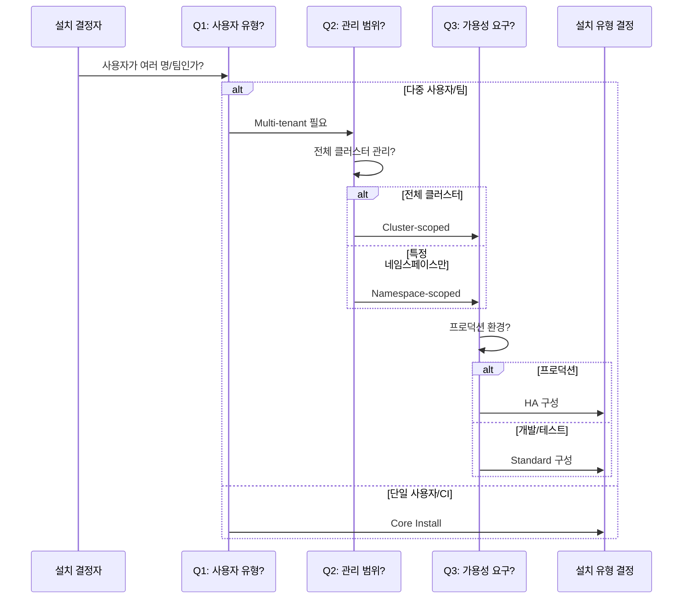
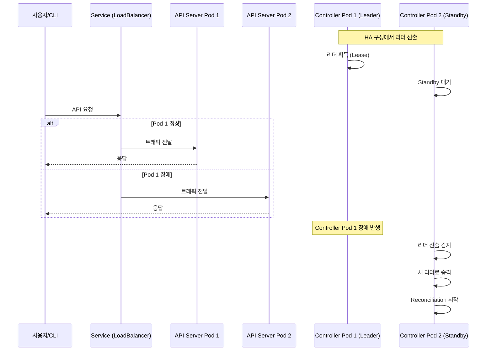

# 02. Installing Argo CD

---

## 📌 핵심 요약

> 이 장에서는 Argo CD가 Kubernetes Controller 패턴을 활용하여 선언적 상태 관리를 구현하는 원리를 설명합니다. Argo CD는 마이크로서비스 아키텍처로 구성되어 있으며, 각 컴포넌트는 Git 저장소에서 매니페스트를 생성하고 클러스터 상태를 동기화하는 역할을 분담합니다. 설치 유형은 팀 규모와 운영 환경에 따라 Multi-tenant, Core, Namespace-scoped, HA 구성 중에서 선택할 수 있습니다.

---

## 🎯 학습 목표

이 내용을 읽고 나면:
- [ ] Argo CD의 아키텍처와 각 컴포넌트의 역할을 설명할 수 있다
- [ ] Kubernetes Controller 패턴과 CRD의 관계를 이해할 수 있다
- [ ] 설치 유형(Multi-tenant, Core, Namespace-scoped, HA)의 차이를 비교할 수 있다
- [ ] YAML 매니페스트와 Helm을 사용하여 Argo CD를 설치할 수 있다

---

## 📖 본문 정리

### 1. Argo CD 아키텍처

#### 1.1 Kubernetes Controller 패턴

Argo CD는 Kubernetes의 Controller 패턴을 활용하여 Git 저장소의 선언적 상태와 클러스터의 실제 상태를 지속적으로 비교하고 동기화합니다. 이 패턴을 사용하는 이유는 사람이 수동으로 배포 상태를 확인하고 수정하는 것이 아니라, 자동화된 루프가 항상 원하는 상태를 유지하도록 보장하기 때문입니다.

Controller는 Reconciliation Loop를 실행하면서 Desired State(Git에 정의된 상태)와 Actual State(클러스터의 현재 상태)를 주기적으로 비교합니다. 만약 두 상태가 다르면 Controller는 클러스터 상태를 Git에 맞추도록 동기화 작업을 수행합니다. 이 방식은 ReplicaSet Controller가 Pod 수를 유지하는 것과 동일한 원리입니다.



> 💬 **비유**: ReplicaSet Controller가 Pod 수를 유지하는 것처럼, Argo CD Controller는 클러스터 상태를 Git과 동기화합니다.

#### 1.2 Custom Resource Definitions (CRDs)

Argo CD는 Kubernetes를 확장하기 위해 3가지 CRD를 제공합니다. 이 CRD들은 Argo CD가 관리할 대상과 방식을 선언적으로 정의할 수 있게 해줍니다.

**Application CRD**는 단일 애플리케이션의 배포 대상, 소스 저장소, 동기화 정책을 정의합니다. 이 리소스는 "어떤 Git 저장소의 어떤 경로에 있는 매니페스트를 어떤 클러스터의 어떤 네임스페이스에 배포할 것인가"를 명시합니다. Application CRD를 사용하는 이유는 배포 설정을 코드로 관리하여 Git을 통해 버전 관리하고 재현 가능하게 만들기 때문입니다.

**AppProject CRD**는 여러 Application을 프로젝트 단위로 그룹화하고 RBAC 권한과 허용 리소스를 제한합니다. 예를 들어, "frontend" 프로젝트는 특정 팀만 접근할 수 있고, Deployment와 Service만 배포할 수 있도록 제한할 수 있습니다. 이 CRD를 사용하는 이유는 멀티테넌트 환경에서 팀 간 격리와 보안 정책을 강제하기 위해서입니다.

**ApplicationSet CRD**는 템플릿 기반으로 다중 Application을 자동 생성합니다. 예를 들어, dev/staging/prod 환경에 동일한 애플리케이션을 배포할 때 각 환경마다 Application을 수동으로 만드는 대신, ApplicationSet 하나로 패턴을 정의하면 자동으로 3개의 Application이 생성됩니다. 이 CRD를 사용하는 이유는 대규모 멀티 클러스터 환경에서 반복적인 설정을 줄이고 일관성을 유지하기 위해서입니다.

---

### 2. Argo CD 컴포넌트

#### 2.1 전체 아키텍처와 컴포넌트 간 상호작용

Argo CD는 7개의 핵심 컴포넌트로 구성된 마이크로서비스 아키텍처를 사용합니다. 각 컴포넌트는 독립적으로 스케일링 가능하며, 특정 역할에 집중하여 시스템의 복잡성을 분산시킵니다.

전체 동작 흐름을 보면, 사용자가 UI나 CLI를 통해 배포를 요청하면 API Server가 요청을 받아 Application 리소스를 생성합니다. Application Controller는 이 리소스를 감지하고 Repository Server에게 매니페스트 생성을 요청합니다. Repository Server는 Git에서 소스를 Clone하고 Helm이나 Kustomize로 렌더링한 후 결과를 캐시에 저장합니다. Application Controller는 받은 매니페스트를 클러스터 상태와 비교하고, 차이가 있으면 kubectl apply와 유사한 방식으로 동기화를 수행합니다.



#### 2.2 컴포넌트 상세 설명

**Application Controller**는 Argo CD의 핵심 엔진으로, Kubernetes Operator 패턴을 구현합니다. 이 컴포넌트는 Application 리소스를 감시하며 Reconciliation Loop를 실행합니다. Application Controller가 필요한 이유는 사람이 수동으로 배포 상태를 확인하지 않아도 자동으로 Git과 클러스터 상태를 일치시키기 때문입니다. 이 컴포넌트는 StatefulSet으로 배포되며, HA 구성에서는 Active-Standby 방식으로 동작하여 리더 선출을 통해 하나의 인스턴스만 실제로 작업을 수행합니다.

**ApplicationSet Controller**는 ApplicationSet CRD를 처리하여 여러 개의 Application을 자동 생성합니다. 이 컴포넌트가 필요한 이유는 수십 개의 마이크로서비스를 여러 환경에 배포할 때 각 Application을 수동으로 만드는 것이 비현실적이기 때문입니다. Generator 패턴을 사용하여 Git 디렉토리 구조, Cluster List, 또는 외부 API 응답을 기반으로 Application을 동적으로 생성합니다.

**Repository Server**는 Git 저장소에서 소스를 가져와 Kubernetes 매니페스트로 변환하는 역할을 합니다. 이 컴포넌트가 필요한 이유는 Helm Chart, Kustomize, Jsonnet 등 다양한 템플릿 도구를 지원하면서도 Application Controller는 최종 매니페스트만 받아 처리하면 되도록 관심사를 분리하기 때문입니다. Repository Server는 로컬 캐시를 유지하여 동일한 커밋에 대해 반복적으로 Git Clone을 수행하지 않습니다.

**API Server**는 gRPC와 REST API를 제공하며, 웹 UI를 호스팅합니다. 이 컴포넌트가 필요한 이유는 사용자와 외부 시스템이 Argo CD와 상호작용할 수 있는 단일 진입점을 제공하기 때문입니다. API Server는 인증과 권한 검증을 담당하며, Kubernetes API와 직접 통신하여 Application 리소스를 조회하고 수정합니다.

**Redis**는 인메모리 캐시로, Repository Server가 생성한 매니페스트와 Git 커밋 메타데이터를 저장합니다. Redis가 필요한 이유는 매번 Git Clone과 템플릿 렌더링을 수행하면 성능이 크게 저하되기 때문입니다. Redis는 휘발성 저장소이므로 재시작 시 데이터가 손실되지만, 모든 원본 데이터는 Git에 있으므로 재구축할 수 있습니다.

**Dex**는 OIDC를 지원하지 않는 Identity Provider(예: LDAP, SAML)와의 브릿지 역할을 합니다. Dex가 필요한 이유는 Argo CD가 다양한 인증 시스템과 통합할 수 있도록 SSO를 표준화하기 때문입니다. Dex는 선택적 컴포넌트이며, OIDC를 직접 지원하는 IdP를 사용하면 비활성화할 수 있습니다.

**Notifications Controller**는 Application 상태 변화를 외부 시스템으로 전달합니다. 이 컴포넌트가 필요한 이유는 배포 성공, 실패, 동기화 완료 등의 이벤트를 팀 협업 도구(Slack, Email, Webhook)로 알려 운영자가 즉시 대응할 수 있도록 하기 때문입니다.

#### 2.3 Repository Server 동작 흐름

Repository Server는 Application Controller로부터 매니페스트 요청을 받으면 먼저 Redis 캐시를 확인합니다. 캐시 키는 Git 저장소 URL, 리비전(커밋 해시), 경로를 조합하여 생성됩니다. 캐시에 매니페스트가 있으면 즉시 반환하고, 없으면 Git에서 소스를 Clone합니다.

소스를 받은 후에는 템플릿 도구를 실행합니다. Helm Chart라면 `helm template` 명령으로 렌더링하고, Kustomize라면 `kustomize build`를 실행합니다. 렌더링 결과는 순수한 Kubernetes YAML 매니페스트이며, 이를 Redis에 캐싱한 후 Application Controller에게 전달합니다.



---

### 3. Argo CD 핵심 패턴

**Declarative 패턴**은 Argo CD의 모든 설정을 선언적으로 정의할 수 있게 합니다. 이 패턴을 사용하는 이유는 Argo CD 자체도 GitOps로 관리할 수 있어, "Argo CD가 Argo CD를 배포하는" 부트스트랩 구조를 만들 수 있기 때문입니다. Application 리소스를 Git에 커밋하면 Argo CD가 자동으로 감지하고 배포합니다.

**Stateless 패턴**은 상태를 Kubernetes etcd와 Git에만 저장하고, Argo CD 컴포넌트는 언제든 재구축 가능하도록 설계합니다. 이 패턴을 사용하는 이유는 Pod가 재시작되거나 노드가 장애가 나도 데이터 손실 없이 복구할 수 있기 때문입니다. Redis 캐시는 성능을 위한 것이므로 손실되어도 재생성할 수 있습니다.

**Extensible 패턴**은 다양한 템플릿 도구와 플러그인을 지원합니다. 이 패턴을 사용하는 이유는 팀마다 선호하는 도구가 다르고, 커스텀 배포 로직이 필요할 수 있기 때문입니다. Helm, Kustomize, Jsonnet은 기본 지원하며, Config Management Plugin(CMP)으로 사용자 정의 도구도 추가할 수 있습니다.

---

### 4. 설치 유형

#### 4.1 설치 유형 선택 기준

Argo CD 설치 유형을 선택할 때는 세 가지 질문에 답해야 합니다.

첫 번째는 "사용자가 몇 명인가?"입니다. 혼자 사용하거나 CI/CD 파이프라인에서만 사용한다면 UI와 인증이 필요 없으므로 Core 설치가 적합합니다. 반면 여러 팀이 공유한다면 Multi-tenant 설치가 필요합니다. Core 설치는 Controller와 Repository Server만 포함하여 리소스를 최소화하지만, UI가 없으므로 모든 작업을 CLI로 수행해야 합니다.

두 번째는 "클러스터 전체를 관리할 것인가, 특정 네임스페이스만 관리할 것인가?"입니다. Cluster-scoped 설치는 ClusterRole을 사용하여 모든 네임스페이스의 리소스를 관리할 수 있지만, Namespace-scoped 설치는 특정 네임스페이스 내부의 리소스만 접근할 수 있습니다. Namespace-scoped를 사용하는 이유는 멀티테넌트 환경에서 팀별로 독립적인 Argo CD 인스턴스를 운영하여 권한을 격리하기 때문입니다.

세 번째는 "프로덕션 환경인가?"입니다. 개발이나 테스트 환경에서는 단일 레플리카로 충분하지만, 프로덕션에서는 HA 구성으로 가용성을 보장해야 합니다. HA 설치는 Repository Server와 API Server를 다중 레플리카로 배포하고, Application Controller는 Active-Standby 구조로 리더 선출을 수행합니다.



#### 4.2 실무 시나리오: 팀 규모와 클러스터 환경

**시나리오 1: 팀 규모 10명, 클러스터 3개 운영 (dev/staging/prod)**

이 상황에서는 Multi-tenant + Cluster-scoped + HA 구성을 권장합니다. 그 이유는 다음과 같습니다.

Multi-tenant를 선택하는 이유는 10명의 팀원이 UI를 통해 배포 상태를 조회하고, AppProject로 팀별 권한을 관리해야 하기 때문입니다. Core 설치는 UI가 없어 팀 협업에 부적합합니다.

Cluster-scoped를 선택하는 이유는 플랫폼 팀이 클러스터 전체의 네임스페이스를 관리해야 하기 때문입니다. Namespace-scoped는 특정 네임스페이스만 접근할 수 있어 전체 클러스터를 관리할 수 없습니다.

HA 구성을 선택하는 이유는 프로덕션 환경에서 Argo CD 장애 시 배포가 중단되면 비즈니스 영향이 크기 때문입니다. HA는 Repository Server와 API Server를 2개 이상의 레플리카로 배포하여 단일 실패 지점을 제거합니다.

**시나리오 2: 개인 학습 목적, 로컬 kind 클러스터**

이 상황에서는 Core 설치를 권장합니다. 그 이유는 UI와 인증이 필요 없고, 리소스를 최소화하여 노트북에서 빠르게 실행할 수 있기 때문입니다. CLI만으로 Application을 생성하고 동기화 상태를 확인할 수 있습니다.

**시나리오 3: 대기업, 팀별 독립 운영, 공유 클러스터 1개**

이 상황에서는 Namespace-scoped + Standard 구성을 각 팀마다 배포합니다. 그 이유는 각 팀이 자신의 네임스페이스 내에서만 Argo CD를 사용하고, 다른 팀의 리소스에 접근하지 못하도록 격리하기 때문입니다. 각 팀은 `team-a-argocd`, `team-b-argocd` 네임스페이스에 독립적인 Argo CD 인스턴스를 운영합니다.

#### 4.3 HA vs Non-HA 비교

HA 구성과 Standard 구성의 차이를 이해하려면 각 컴포넌트의 레플리카 수와 장애 대응 방식을 비교해야 합니다.

Standard 구성에서는 모든 컴포넌트가 단일 레플리카로 실행됩니다. Application Controller Pod가 재시작되면 새 Pod가 뜰 때까지 동기화가 중단됩니다. Repository Server Pod가 재시작되면 매니페스트 생성이 불가능해지며, API Server Pod가 재시작되면 UI와 CLI 접근이 불가능합니다.

HA 구성에서는 Repository Server와 API Server를 2개 이상의 레플리카로 배포하여 하나의 Pod가 재시작되어도 나머지 Pod가 트래픽을 처리합니다. Application Controller는 Active-Standby 방식으로 동작하여 리더 선출을 통해 하나의 인스턴스만 실제 동기화를 수행하고, 리더가 장애 나면 Standby가 자동으로 리더가 됩니다. 리더 선출을 사용하는 이유는 여러 Controller가 동시에 동일한 리소스를 수정하면 충돌이 발생하기 때문입니다.



HA 설치가 필요한 이유는 프로덕션 환경에서 배포 중단이 비즈니스에 영향을 주기 때문입니다. 예를 들어, 긴급 핫픽스를 배포해야 하는데 Argo CD가 재시작 중이면 수동으로 kubectl을 사용해야 하며, 이는 GitOps 원칙을 위반하고 Drift를 발생시킵니다.

---

### 5. 설치 방법

#### 5.1 YAML 매니페스트 설치

YAML 매니페스트 설치는 Argo CD가 공식 제공하는 올인원 YAML 파일을 kubectl apply로 배포하는 방식입니다. 이 방식을 사용하는 이유는 외부 도구 없이 순수 Kubernetes 명령어만으로 설치할 수 있어 가장 간단하기 때문입니다.

```bash
# kind 클러스터 생성
kind create cluster

# argocd 네임스페이스 생성
kubectl create namespace argocd

# Argo CD 설치 (Multi-tenant, Non-HA)
kubectl apply -n argocd \
  -f https://raw.githubusercontent.com/argoproj/argo-cd/stable/manifests/install.yaml
```

**설치 확인:**

설치 후에는 모든 Pod가 Running 상태인지 확인해야 합니다. 7개의 Pod가 생성되며, 각 Pod는 하나의 컴포넌트를 실행합니다.

```bash
# Pod 상태 확인
kubectl get pods -n argocd

# 출력 예시:
# argocd-application-controller-0                     1/1     Running
# argocd-applicationset-controller-74575b6959-8dc7l   1/1     Running
# argocd-dex-server-64897989f8-qg8pm                  1/1     Running
# argocd-notifications-controller-566bc99494-7vj82   1/1     Running
# argocd-redis-79c755c747-867nk                       1/1     Running
# argocd-repo-server-bc9c646dc-6sd86                  1/1     Running
# argocd-server-757fddb4d7-xgdxh                      1/1     Running
```

**UI 접속:**

Argo CD는 기본적으로 ClusterIP 서비스로 배포되므로, 로컬에서 접속하려면 포트 포워딩이 필요합니다.

```bash
# 포트 포워딩
kubectl port-forward svc/argocd-server -n argocd 8080:443

# 브라우저에서 https://localhost:8080 접속
```

**Admin 비밀번호 조회:**

초기 설치 시 Argo CD는 무작위 admin 비밀번호를 생성하여 Secret에 저장합니다. 이 비밀번호는 첫 로그인 후 변경하고 Secret을 삭제하는 것이 보안상 권장됩니다.

```bash
kubectl -n argocd get secret argocd-initial-admin-secret \
  -o jsonpath="{.data.password}" | base64 -d; echo
```

#### 5.2 Helm 설치

Helm 설치는 Argo CD Helm Chart를 사용하여 동적으로 설정을 오버라이드하는 방식입니다. 이 방식을 사용하는 이유는 레플리카 수, 리소스 제한, Ingress 설정 등을 YAML 파일 수정 없이 values.yaml로 관리할 수 있기 때문입니다.

```bash
# Helm 저장소 추가
helm repo add argo https://argoproj.github.io/argo-helm

# Argo CD 설치
helm upgrade -i argo-cd argo/argo-cd -n argocd --create-namespace
```

**Helm 값 확인:**

Helm Chart는 수백 개의 설정 옵션을 제공하므로, 설치 전에 사용 가능한 값을 확인하고 필요한 항목만 오버라이드해야 합니다.

```bash
# 사용 가능한 모든 설정 값 조회
helm show values argo/argo-cd
```

**Helm values.yaml 예시:**

```yaml
# HA 구성 활성화
redis-ha:
  enabled: true

controller:
  replicas: 1  # Controller는 리더 선출 사용

server:
  replicas: 2  # API Server HA

repoServer:
  replicas: 2  # Repository Server HA

# Ingress 설정
server:
  ingress:
    enabled: true
    hosts:
      - argocd.example.com
```

#### 5.3 설치 방법 비교

YAML 매니페스트 방식은 간단하고 공식 지원되지만, 커스터마이징이 어렵습니다. 설정을 변경하려면 전체 YAML 파일을 다운로드하여 수정하고 버전 관리해야 합니다.

Helm 방식은 동적 템플릿과 values.yaml로 설정을 오버라이드할 수 있지만, Helm CLI에 대한 의존성이 생깁니다. Helm을 이미 사용 중인 팀이라면 다른 애플리케이션과 동일한 방식으로 Argo CD를 관리할 수 있습니다.

Operator 방식은 자동 업그레이드와 백업/복원 기능을 제공하지만, Operator 자체의 복잡성이 증가합니다. 대규모 클러스터에서 Argo CD 라이프사이클을 자동화해야 한다면 Operator를 고려할 수 있습니다.

#### 5.4 리소스 정리

테스트 후 Argo CD를 제거할 때는 설치 시 사용한 YAML 파일을 동일하게 kubectl delete로 제거하거나, 클러스터 전체를 삭제할 수 있습니다.

```bash
# YAML 매니페스트 제거
kubectl delete -n argocd \
  -f https://raw.githubusercontent.com/argoproj/argo-cd/stable/manifests/install.yaml
kubectl delete namespace argocd

# 또는 kind 클러스터 삭제
kind delete cluster
```

---

### 6. High Availability (HA) 설치

#### 6.1 HA가 필요한 이유

HA 설치가 필요한 이유는 프로덕션 환경에서 Argo CD가 단일 실패 지점이 되는 것을 방지하기 때문입니다. Standard 구성에서는 API Server Pod가 재시작되면 UI와 CLI 접근이 불가능하고, Repository Server Pod가 재시작되면 새로운 배포를 시작할 수 없습니다. Application Controller는 StatefulSet으로 실행되므로 재시작 시간이 더 길며, 이 시간 동안 Drift가 발생해도 자동 복구되지 않습니다.

HA 구성에서는 Repository Server와 API Server를 다중 레플리카로 배포하여 롤링 업데이트 중에도 서비스가 중단되지 않습니다. Application Controller는 Active-Standby 구조로 리더가 장애 나면 Standby가 즉시 승격되어 Reconciliation을 계속합니다.

HA 설치의 단점은 리소스 사용량이 증가한다는 것입니다. Standard 구성 대비 최소 2배의 CPU와 메모리가 필요하므로, 개발 환경에서는 리소스 낭비가 됩니다. 따라서 HA는 프로덕션 환경에만 적용하는 것이 권장됩니다.

#### 6.2 HA 설치

HA 설치는 별도의 매니페스트 파일을 사용하며, 내부적으로 레플리카 수와 리소스 제한이 튜닝되어 있습니다.

```bash
# HA 매니페스트 사용
kubectl apply -n argocd \
  -f https://raw.githubusercontent.com/argoproj/argo-cd/stable/manifests/ha/install.yaml
```

HA 매니페스트는 다음과 같은 설정을 포함합니다:
- Repository Server 레플리카: 2
- API Server 레플리카: 2
- Redis HA 모드 활성화 (Redis Sentinel 패턴)
- Application Controller: 리더 선출 활성화

---

## 🔍 심화 학습

### Argo CD Operator

Argo CD Operator는 Kubernetes Operator 패턴을 사용하여 Argo CD 라이프사이클을 자동화합니다. Operator를 사용하는 이유는 수동으로 버전 업그레이드, 백업, 복원을 수행하는 것이 오류가 발생하기 쉽고 시간이 오래 걸리기 때문입니다.

자동 업그레이드 기능은 새 버전이 출시되면 Operator가 롤링 업데이트를 수행하여 다운타임 없이 업그레이드합니다. 백업/복원 기능은 특정 시점의 Application, AppProject, Secret을 스냅샷으로 저장하고, 장애 발생 시 복원할 수 있습니다. 메트릭 통합 기능은 Prometheus ServiceMonitor를 자동으로 생성하여 Grafana 대시보드로 모니터링할 수 있게 합니다. 오토스케일링 기능은 HPA를 설정하여 Repository Server와 API Server의 부하에 따라 레플리카를 자동 조정합니다.

### 매니페스트 종류

Argo CD는 다양한 설치 시나리오를 위해 5가지 매니페스트를 제공합니다.

`install.yaml`은 표준 설치로 Cluster-scoped 권한을 사용하며, 단일 레플리카로 실행됩니다. `namespace-install.yaml`은 Namespace-scoped 권한을 사용하여 특정 네임스페이스만 관리합니다. `ha/install.yaml`은 HA 구성의 Cluster-scoped 버전입니다. `ha/namespace-install.yaml`은 HA와 Namespace-scoped를 결합한 버전입니다. `core-install.yaml`은 최소 구성으로 Controller와 Repository Server만 포함합니다.

### 출처
- [Argo CD Installation Guide](https://argo-cd.readthedocs.io/en/stable/operator-manual/installation/)
- [Argo CD Helm Chart](https://github.com/argoproj/argo-helm)
- [Argo CD Operator](https://argocd-operator.readthedocs.io/)

---

## 💡 실무 적용 포인트

### 설치 유형 선택 가이드

개인 학습이나 테스트 환경에서는 Core Install로 리소스를 최소화하고 CLI만으로 빠르게 실험할 수 있습니다. 팀 공용 개발 환경에서는 Multi-tenant Standard 구성으로 UI와 SSO를 제공하여 팀원들이 협업할 수 있게 합니다. 프로덕션 환경에서는 Multi-tenant HA 구성으로 가용성을 보장하고, 롤링 업데이트 중에도 배포를 중단하지 않습니다. 팀별 독립 운영이 필요하면 Namespace-scoped 설치로 각 팀마다 독립적인 Argo CD 인스턴스를 배포합니다. 멀티 클러스터를 관리한다면 Cluster-scoped HA 구성으로 중앙 집중식 배포 플랫폼을 구축합니다.

### 주의할 점 / 흔한 실수

초기 비밀번호인 `argocd-initial-admin-secret`은 첫 로그인 후 삭제하는 것이 권장됩니다. 이 Secret이 남아 있으면 클러스터에 접근한 누구나 admin 비밀번호를 조회할 수 있습니다. Self-signed 인증서는 개발 환경에서는 괜찮지만, 프로덕션에서는 유효한 TLS 인증서를 사용해야 브라우저 경고를 방지할 수 있습니다.

HA 설정에서 단순히 레플리카 수만 늘리면 성능이 저하될 수 있습니다. 예를 들어, Repository Server 레플리카를 10개로 늘려도 Redis 캐시가 병목이 되면 오히려 캐시 경합으로 성능이 나빠집니다. HA 설정 시에는 리소스 제한과 캐시 전략도 함께 튜닝해야 합니다.

Redis는 휘발성 캐시이므로 재시작 시 데이터가 손실됩니다. 하지만 이는 문제가 되지 않는데, 모든 원본 데이터는 Git에 있고 Redis는 성능 최적화를 위한 것이기 때문입니다. Redis가 비워지면 Repository Server가 Git에서 다시 Clone하여 캐시를 재구축합니다.

Namespace-scoped 설치는 ClusterRole과 ClusterRoleBinding을 사용하지 않으므로, Namespace나 ClusterRole 같은 클러스터 스코프 리소스를 관리할 수 없습니다. 만약 네임스페이스를 동적으로 생성하는 애플리케이션을 배포한다면 Cluster-scoped 설치가 필요합니다.

### 면접에서 나올 수 있는 질문

**Q: Argo CD의 주요 컴포넌트와 각각의 역할은?**

Application Controller는 Reconciliation Loop를 실행하여 Git과 클러스터 상태를 동기화합니다. Repository Server는 Git에서 소스를 가져와 Helm이나 Kustomize로 렌더링하여 Kubernetes 매니페스트를 생성합니다. API Server는 UI와 CLI를 위한 gRPC/REST API를 제공합니다. Redis는 매니페스트 캐시를 저장하여 반복적인 Git Clone과 렌더링을 방지합니다. ApplicationSet Controller는 템플릿 기반으로 다중 Application을 자동 생성합니다. Dex는 OIDC를 지원하지 않는 IdP와의 SSO 브릿지 역할을 합니다. Notifications Controller는 배포 이벤트를 Slack이나 Email로 전달합니다.

**Q: Application Controller와 Repository Server의 차이점은?**

Application Controller는 "언제, 무엇을, 어떻게 배포할지"를 결정하는 오케스트레이터이고, Repository Server는 "Git 소스를 Kubernetes 매니페스트로 변환"하는 렌더링 엔진입니다. Controller는 Application 리소스를 감시하며 Reconciliation Loop를 실행하고, Repository Server는 Controller의 요청을 받아 매니페스트를 생성하여 반환합니다. 이렇게 관심사를 분리하는 이유는 Controller는 배포 로직에만 집중하고, Repository Server는 다양한 템플릿 도구 지원에만 집중할 수 있기 때문입니다.

**Q: Multi-tenant와 Core 설치의 차이점은?**

Multi-tenant는 API Server, UI, SSO, Notifications를 포함하여 여러 사용자가 협업할 수 있게 하고, Core는 Controller와 Repository Server만 포함하여 최소 리소스로 실행합니다. Multi-tenant를 사용하는 이유는 팀원들이 브라우저에서 배포 상태를 확인하고 SSO로 로그인하여 권한을 관리하기 때문입니다. Core를 사용하는 이유는 CI/CD 파이프라인에서만 사용하거나 개인 학습 목적일 때 UI가 필요 없고 리소스를 절약하기 때문입니다.

**Q: HA 설치가 필요한 상황은?**

프로덕션 환경에서 Argo CD 장애 시 배포가 중단되면 비즈니스 영향이 클 때 HA가 필요합니다. 예를 들어, 긴급 핫픽스를 배포해야 하는데 Argo CD가 재시작 중이면 GitOps 원칙을 위반하고 수동으로 kubectl을 사용해야 합니다. HA 구성에서는 Repository Server와 API Server를 다중 레플리카로 배포하여 롤링 업데이트 중에도 서비스가 중단되지 않고, Application Controller는 리더 선출로 장애 시 자동 Failover됩니다.

**Q: Argo CD가 사용하는 CRD 3가지는?**

Application CRD는 단일 애플리케이션의 소스 저장소, 배포 대상, 동기화 정책을 정의합니다. AppProject CRD는 여러 Application을 그룹화하고 RBAC 권한과 허용 리소스를 제한합니다. ApplicationSet CRD는 템플릿 기반으로 다중 Application을 자동 생성하여 멀티 클러스터 환경에서 반복 설정을 줄입니다.

---

## ✅ 핵심 개념 체크리스트

- [ ] Kubernetes Controller 패턴에서 Reconciliation Loop가 Desired State와 Actual State를 어떻게 비교하고 동기화하는지 설명할 수 있는가?
- [ ] Application CRD는 배포 대상을 정의하고, AppProject CRD는 권한을 제한하고, ApplicationSet CRD는 다중 Application을 생성하는 역할을 구분할 수 있는가?
- [ ] Repository Server가 Git Clone → 템플릿 렌더링 → Redis 캐싱 → Controller 전달 흐름을 sequenceDiagram으로 그릴 수 있는가?
- [ ] 팀 규모 10명, 클러스터 3개 운영 시 Multi-tenant + Cluster-scoped + HA 구성을 선택하는 이유를 설명할 수 있는가?
- [ ] HA 구성에서 Application Controller는 리더 선출을 사용하고, Repository Server와 API Server는 다중 레플리카를 사용하는 이유를 설명할 수 있는가?

---

## 🔗 참고 자료

- 📄 공식 문서: [Argo CD Installation](https://argo-cd.readthedocs.io/en/stable/operator-manual/installation/)
- 📄 Helm Chart: [argo-helm/argo-cd](https://github.com/argoproj/argo-helm/tree/main/charts/argo-cd)
- 📄 Operator: [Argo CD Operator](https://argocd-operator.readthedocs.io/)
- 📄 HA Guide: [High Availability](https://argo-cd.readthedocs.io/en/stable/operator-manual/high_availability/)
- 🛠️ 로컬 테스트: [kind](https://kind.sigs.k8s.io/)

---
