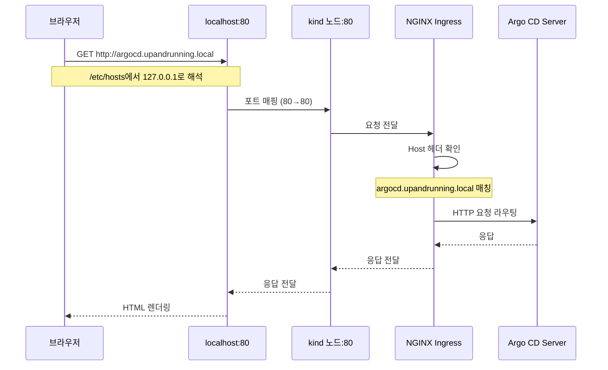
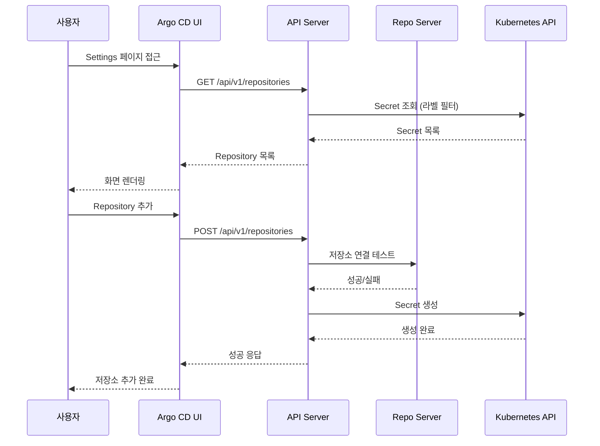
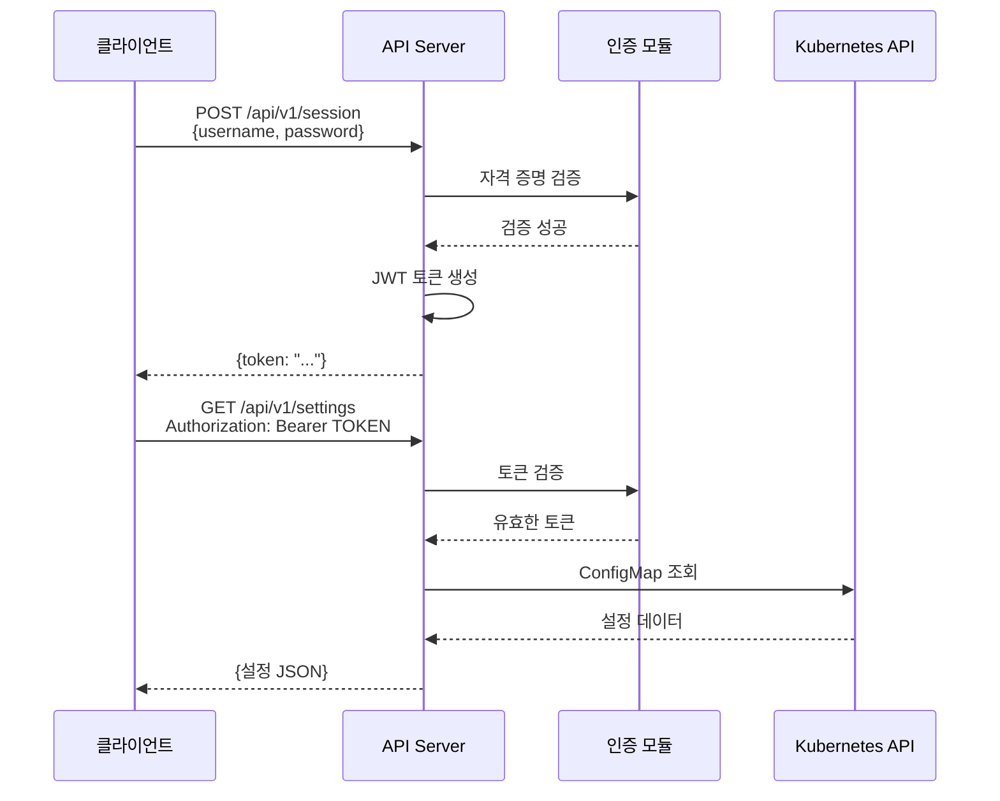
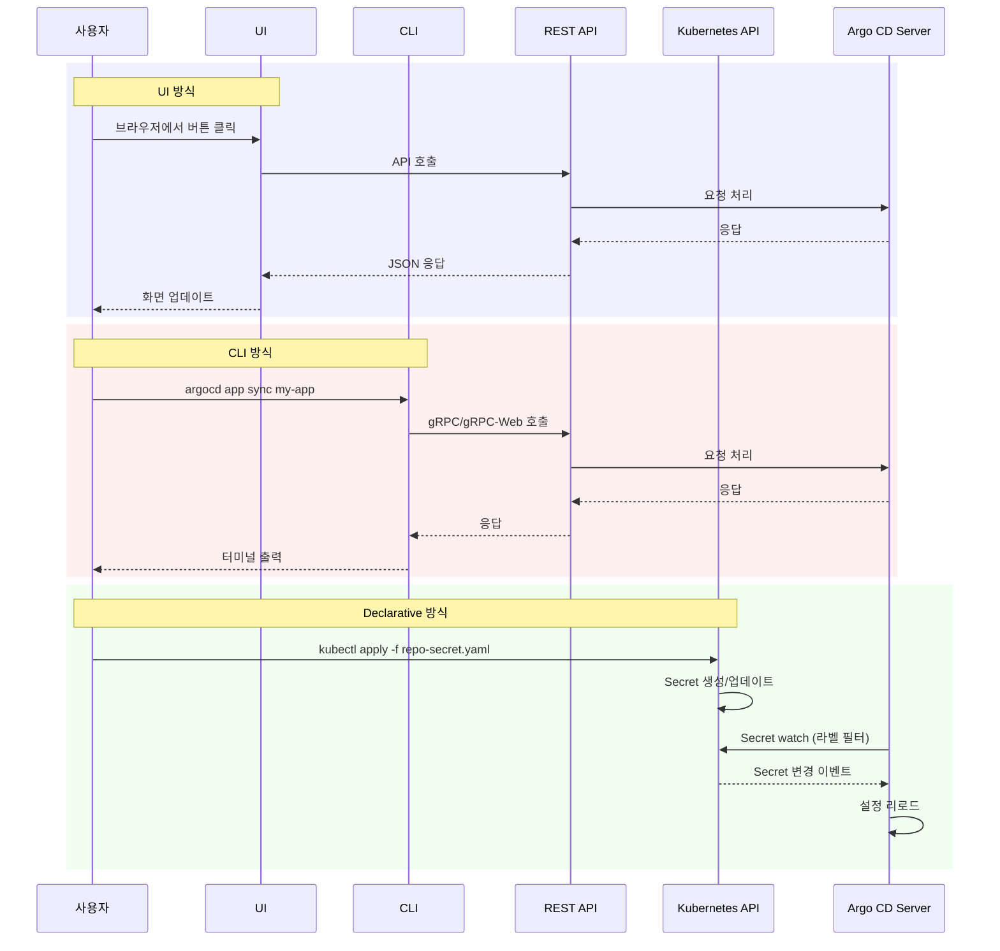

# 03. Interacting with Argo CD

---

## 📌 핵심 요약

> Argo CD는 다양한 방식으로 상호작용할 수 있는 유연한 인터페이스를 제공합니다. **UI**(웹 인터페이스)는 직관적인 시각화를 제공하고, **CLI**(명령줄 도구)는 자동화와 스크립팅을 가능하게 하며, **REST API**는 외부 시스템과의 프로그래밍 방식 통합을 지원합니다. 또한 **선언적 ConfigMap/Secret** 방식을 통해 Argo CD 자체를 GitOps로 관리할 수 있습니다. 이 장에서는 kind 클러스터에 NGINX Ingress Controller를 설정하여 Argo CD에 접근하는 실습을 진행합니다.

---

## 🎯 학습 목표

이 내용을 읽고 나면:
- [ ] kind 클러스터에 NGINX Ingress Controller를 설정하여 Argo CD에 접근할 수 있다
- [ ] Argo CD UI의 Settings 페이지 옵션들을 이해하고 각각의 역할을 설명할 수 있다
- [ ] Argo CD CLI를 설치하고 로그인/비밀번호 변경을 수행할 수 있다
- [ ] REST API와 Swagger UI를 활용하여 Argo CD를 관리할 수 있다
- [ ] ConfigMap과 Secret을 통한 선언적 설정 방법을 이해하고 적용할 수 있다
- [ ] UI/CLI/API/선언적 방식의 차이점과 각 방식의 적절한 사용 시나리오를 구분할 수 있다

---

## 📖 본문 정리

### 1. Ingress를 통한 UI 접근

Argo CD에 접근하는 가장 일반적인 방법은 웹 브라우저를 통한 UI 접근입니다. 로컬 개발 환경(kind 클러스터)에서 Argo CD에 접근하려면 NGINX Ingress Controller를 설정하여 HTTP 요청을 Argo CD Server로 라우팅해야 합니다. 이 과정은 실제 프로덕션 환경에서 외부 사용자가 Argo CD에 접근하는 방식과 유사합니다.

#### 1.1 kind 클러스터 설정 (Ingress 지원)

kind 클러스터는 기본적으로 외부 네트워크와 격리되어 있습니다. 따라서 호스트 머신의 80/443 포트를 kind 노드의 포트와 매핑해야 Ingress Controller가 제대로 동작할 수 있습니다. 이를 위해 클러스터 생성 시 `extraPortMappings` 설정을 통해 포트 포워딩을 구성합니다.

```yaml
# kind-config.yaml
kind: Cluster
apiVersion: kind.x-k8s.io/v1alpha4
nodes:
- role: control-plane
  kubeadmConfigPatches:
  - |
    kind: InitConfiguration
    nodeRegistration:
      kubeletExtraArgs:
        node-labels: "ingress-ready=true"
  extraPortMappings:
  - containerPort: 80
    hostPort: 80        # 로컬 80 포트 → kind 노드 80 포트
    protocol: TCP
  - containerPort: 443
    hostPort: 443       # 로컬 443 포트 → kind 노드 443 포트
    protocol: TCP
```

```bash
# 클러스터 생성
cat <<EOF | kind create cluster --config=-
# ... (위 YAML 내용)
EOF
```

**왜 이런 설정이 필요한가?** kind 클러스터는 Docker 컨테이너 안에서 동작하므로, 외부에서 접근하려면 호스트의 포트를 컨테이너의 포트로 매핑해야 합니다. `ingress-ready=true` 라벨은 NGINX Ingress Controller가 이 노드를 Ingress 트래픽을 처리할 수 있는 노드로 인식하도록 합니다.

#### 1.2 NGINX Ingress Controller 설치

NGINX Ingress Controller는 Kubernetes Ingress 리소스를 읽어서 외부 HTTP/HTTPS 트래픽을 클러스터 내부의 Service로 라우팅하는 역할을 합니다. kind 환경에서는 `LoadBalancer` 타입의 Service를 사용할 수 없기 때문에 `NodePort` 타입을 사용하고, `hostPort`를 활성화하여 호스트의 포트를 직접 바인딩합니다.

```bash
# Helm 저장소 추가
helm repo add ingress-nginx https://kubernetes.github.io/ingress-nginx
helm repo update
```

**values-ingress-nginx.yaml:**
```yaml
controller:
  service:
    type: NodePort        # kind에서는 NodePort 사용
  hostPort:
    enabled: true         # 호스트 포트 바인딩 활성화
  updateStrategy:
    type: Recreate
```

```bash
# NGINX Ingress Controller 설치
helm -n ingress-nginx install ingress-nginx ingress-nginx/ingress-nginx \
  --create-namespace -f values-ingress-nginx.yaml

# 준비 상태 확인
kubectl wait --namespace ingress-nginx \
  --for=condition=ready pod \
  --selector=app.kubernetes.io/component=controller \
  --timeout=90s
```

**왜 Recreate 전략을 사용하는가?** kind 환경에서는 `hostPort`를 사용하므로 동일한 포트를 사용하는 두 개의 Pod가 동시에 실행될 수 없습니다. 따라서 `Recreate` 전략을 사용하여 기존 Pod를 먼저 종료한 후 새 Pod를 시작합니다.

#### 1.3 Argo CD Ingress 설정

Ingress 리소스는 HTTP Host 헤더를 기반으로 트래픽을 라우팅합니다. 로컬 환경에서는 `/etc/hosts` 파일을 수정하여 도메인 이름을 127.0.0.1로 매핑합니다.

**/etc/hosts 수정:**
```
127.0.0.1 argocd.upandrunning.local
```

**values-argocd-ingress.yaml:**
```yaml
server:
  ingress:
    enabled: true
    hostname: argocd.upandrunning.local
    ingressClassName: nginx
  extraArgs:
  - --insecure      # TLS 종료를 Ingress에서 처리
```

```bash
# Argo CD 설치 (Ingress 포함)
helm upgrade -i argo-cd argo/argo-cd --namespace argocd --create-namespace \
  -f values-argocd-ingress.yaml
```

**왜 --insecure 옵션을 사용하는가?** 기본적으로 Argo CD Server는 TLS 암호화를 기대하지만, Ingress Controller가 TLS 종료(termination)를 처리하는 경우 Argo CD Server와 Ingress 간의 통신은 평문 HTTP를 사용합니다. `--insecure` 옵션은 Argo CD Server가 HTTPS 대신 HTTP를 수락하도록 합니다.

#### 1.4 접근 흐름

브라우저에서 `http://argocd.upandrunning.local`로 접근하면 다음과 같은 흐름으로 요청이 처리됩니다.



**실무 시나리오**: 프로덕션 환경에서는 `/etc/hosts` 대신 실제 DNS 레코드를 사용하고, TLS 인증서를 Ingress에 설정하여 HTTPS 통신을 보장합니다. 또한 OAuth2 Proxy나 기업 SSO를 Ingress 앞단에 배치하여 인증 레이어를 추가할 수 있습니다.

---

### 2. Argo CD UI Settings

Argo CD UI의 Settings 페이지는 Argo CD의 주요 구성 요소를 관리하는 중앙 허브입니다. 각 설정 항목은 Argo CD가 GitOps를 수행하는 데 필요한 리소스를 정의합니다.

#### 2.1 Settings 페이지 옵션

**Repositories**는 Argo CD가 Kubernetes 매니페스트를 가져올 Git 저장소나 Helm 차트 저장소를 연결하는 설정입니다. 이곳에서 저장소 URL, 인증 방식(SSH 키, HTTPS 토큰 등)을 설정하며, 이 설정이 없으면 Argo CD는 매니페스트를 가져올 수 없습니다.

**Certificates**는 프라이빗 Git 서버나 Helm 저장소가 자체 서명 인증서(self-signed certificate)를 사용할 때 필요합니다. Argo CD는 기본적으로 신뢰할 수 있는 CA만 허용하므로, 자체 서명 인증서를 사용하는 경우 이곳에 인증서를 등록해야 TLS 검증 오류를 피할 수 있습니다.

**GnuPG Keys**는 Git 커밋 서명을 검증하기 위한 GPG 공개 키를 관리합니다. 보안이 중요한 환경에서는 Git 커밋이 신뢰할 수 있는 개발자에 의해 서명되었는지 검증하여 악의적인 코드 주입을 방지할 수 있습니다.

**Clusters**는 Argo CD가 애플리케이션을 배포할 대상 Kubernetes 클러스터를 관리합니다. Argo CD는 자신이 실행 중인 클러스터(in-cluster)뿐만 아니라 원격 클러스터에도 배포할 수 있으며, 이를 위해 원격 클러스터의 kubeconfig 정보를 이곳에 등록합니다.

**Projects**는 Application을 논리적으로 그룹화하고 RBAC(Role-Based Access Control)를 적용하는 단위입니다. 예를 들어, "dev" 프로젝트는 개발 환경의 애플리케이션만 포함하고, 특정 팀에게만 접근 권한을 부여할 수 있습니다.

**Accounts**는 Argo CD의 로컬 사용자 계정을 관리합니다. 기본 `admin` 계정 외에 추가 계정을 생성하고, 각 계정에 대한 RBAC 정책을 설정할 수 있습니다.

**Appearance**는 UI의 외관을 커스터마이징하는 설정입니다. 회사 로고, 배너 메시지, 테마 색상 등을 변경하여 조직에 맞게 UI를 브랜딩할 수 있습니다.



**실무 시나리오**: 100개 이상의 마이크로서비스를 관리하는 조직에서는 Projects를 팀별, 환경별로 분리하여 관리합니다. 예를 들어, "payment-dev", "payment-prod" 프로젝트를 만들고, 개발자는 dev 프로젝트만 접근 가능하도록 RBAC를 설정합니다. 이를 통해 실수로 프로덕션 환경에 배포하는 것을 방지할 수 있습니다.

---

### 3. Argo CD CLI

CLI(Command-Line Interface)는 반복 작업을 자동화하고 CI/CD 파이프라인과 통합할 때 필수적인 도구입니다. UI는 직관적이지만 수백 개의 Application을 관리할 때는 비효율적이며, CLI를 사용하면 스크립트를 통해 대규모 작업을 수행할 수 있습니다.

#### 3.1 CLI 설치 및 로그인

CLI는 Argo CD API Server와 통신하기 위해 gRPC 프로토콜을 사용합니다. Ingress Controller를 경유할 때는 HTTP/1.1 호환성을 위해 gRPC-Web 프로토콜을 사용해야 합니다.

```bash
# 로그인 (gRPC-Web 프로토콜 사용)
argocd login --insecure --grpc-web argocd.upandrunning.local

# 프롬프트에서 username/password 입력
```

**왜 --grpc-web 옵션이 필요한가?** 네이티브 gRPC는 HTTP/2 프레임을 사용하지만, 많은 HTTP 프록시와 Ingress Controller는 gRPC의 HTTP/2 트레일러를 올바르게 처리하지 못합니다. gRPC-Web은 HTTP/1.1 기반의 폴백(fallback) 프로토콜로, Ingress를 통과할 때 호환성 문제를 해결합니다.

#### 3.2 비밀번호 변경

초기 설치 시 `argocd-initial-admin-secret` Secret에 저장된 임시 비밀번호를 사용하지만, 보안을 위해 반드시 비밀번호를 변경해야 합니다.

```bash
# 비밀번호 변경
argocd account update-password

# 로그아웃
argocd logout <context>

# 컨텍스트 확인
argocd context

# 새 비밀번호로 재로그인
argocd login --insecure --grpc-web argocd.upandrunning.local
```

**실무 시나리오**: CI/CD 파이프라인에서 Argo CD Application을 자동으로 동기화하려면, 파이프라인 스크립트에서 `argocd app sync my-app` 명령을 실행합니다. 이때 서비스 계정 토큰을 사용하여 로그인하고, 토큰은 Kubernetes Secret으로 관리하여 보안을 유지합니다.

#### 3.3 CLI 설정 파일 위치

CLI는 로그인 정보를 로컬 파일 시스템에 저장합니다. 설정 파일 위치는 환경 변수에 따라 결정되며, 우선순위는 다음과 같습니다.

1. `ARGOCD_CONFIG_DIR` 환경 변수가 설정된 경우 해당 경로 사용
2. `XDG_CONFIG_HOME` 환경 변수가 설정된 경우 `$XDG_CONFIG_HOME/argocd/config` 사용
3. 기본값: `$HOME/.config/argocd/config`

**왜 이런 우선순위가 있는가?** 여러 환경(개발, 스테이징, 프로덕션)의 Argo CD 인스턴스를 동시에 관리할 때, `ARGOCD_CONFIG_DIR`을 사용하여 각 환경의 설정을 분리할 수 있습니다. 예를 들어, `ARGOCD_CONFIG_DIR=~/.argocd-prod argocd login prod.argocd.com` 명령으로 프로덕션 환경 설정을 별도로 저장할 수 있습니다.

---

### 4. REST API

REST API는 Argo CD의 모든 기능을 프로그래밍 방식으로 접근할 수 있는 인터페이스입니다. UI와 CLI는 내부적으로 모두 이 REST API를 호출하므로, API를 직접 사용하면 외부 시스템과의 통합이나 커스텀 자동화를 구현할 수 있습니다.

#### 4.1 OpenAPI (Swagger) 문서

Argo CD는 OpenAPI(Swagger) 스펙을 제공하여 모든 API 엔드포인트를 문서화합니다. Swagger UI를 사용하면 브라우저에서 직접 API를 테스트할 수 있습니다.

**Swagger UI 접속:**
```
https://argocd.upandrunning.local/swagger-ui
```

**왜 OpenAPI 스펙이 중요한가?** OpenAPI 스펙은 기계가 읽을 수 있는 형식으로 API를 정의하므로, 자동으로 클라이언트 라이브러리를 생성하거나 API 테스트를 자동화할 수 있습니다. 예를 들어, `openapi-generator`를 사용하여 Python, Java, Go 등의 클라이언트 SDK를 생성할 수 있습니다.

#### 4.2 API 인증 및 호출

REST API를 사용하려면 먼저 세션 토큰을 획득해야 합니다. 토큰은 로그인 API를 통해 발급받으며, 이후 모든 API 호출 시 `Authorization` 헤더에 포함시킵니다.



**세션 토큰 획득:**
```bash
curl -H "Content-Type: application/json" \
  -XPOST -k https://argocd.upandrunning.local/api/v1/session \
  -d '{"username":"admin","password":"YOUR_PASSWORD"}' | jq -r

# 응답: {"token":"<SESSION_TOKEN>"}
```

**API 호출 (Settings 조회):**
```bash
curl -k -H "Authorization: Bearer <TOKEN>" \
  https://argocd.upandrunning.local/api/v1/settings | jq -r
```

**응답 예시:**
```json
{
  "appLabelKey": "argocd.argoproj.io/instance",
  "passwordPattern": "^.{8,32}$",
  "controllerNamespace": "argocd",
  "kustomizeOptions": {
    "BuildOptions": "",
    "BinaryPath": ""
  }
}
```

**실무 시나리오**: 모니터링 시스템(Prometheus, Grafana)과 통합할 때, Argo CD API를 주기적으로 호출하여 Application의 동기화 상태를 수집하고 메트릭으로 저장합니다. 예를 들어, `/api/v1/applications`를 호출하여 "OutOfSync" 상태의 Application 수를 카운트하고, 임계값을 초과하면 알림을 발송할 수 있습니다.

#### 4.3 주요 API 엔드포인트

Argo CD API는 RESTful 원칙을 따르므로, 리소스(Application, Cluster, Repository 등)마다 CRUD 작업을 위한 표준 HTTP 메서드를 제공합니다.

**세션 관리**: `/api/v1/session` POST 메서드는 로그인하여 JWT 기반 세션 토큰을 발급받습니다. 이 토큰은 일정 시간 후 만료되므로, 장기 실행 작업에서는 토큰 갱신 로직이 필요합니다.

**서버 설정**: `/api/v1/settings` GET 메서드는 Argo CD의 전역 설정을 조회합니다. 여기에는 Application 라벨 키, 비밀번호 정책, Kustomize 옵션 등이 포함됩니다.

**Application 관리**: `/api/v1/applications` GET 메서드는 모든 Application 목록을 반환하고, POST 메서드는 새 Application을 생성합니다. 각 Application은 `/api/v1/applications/{name}` 경로로 개별 관리됩니다.

**클러스터 관리**: `/api/v1/clusters` GET 메서드는 등록된 Kubernetes 클러스터 목록을 반환하고, POST 메서드는 새 클러스터를 추가합니다.

**저장소 관리**: `/api/v1/repositories` GET 메서드는 연결된 Git/Helm 저장소 목록을 반환하고, POST 메서드는 새 저장소를 추가합니다.

---

### 5. 선언적 설정 (ConfigMap & Secret)

Argo CD는 GitOps 도구이므로, Argo CD 자체의 설정도 GitOps 방식으로 관리할 수 있습니다. 이를 "Argo CD를 Argo CD로 관리한다"라고 표현하며, 설정을 코드화(Infrastructure as Code)하여 버전 관리와 변경 이력 추적을 가능하게 합니다.

#### 5.1 ConfigMap 기반 설정

Argo CD는 여러 ConfigMap을 통해 설정을 관리하며, 각 ConfigMap은 특정 영역의 설정을 담당합니다.

**argocd-cm**은 Argo CD의 메인 설정을 담고 있습니다. 여기에는 Argo CD UI URL, 관리자 계정 활성화 여부, 사용자 정의 툴 설정 등이 포함됩니다.

**argocd-cmd-params**는 Argo CD 컴포넌트(API Server, Repo Server, Application Controller)의 환경 변수를 설정합니다. 예를 들어, 동기화 타임아웃, 저장소 폴링 간격 등을 조정할 수 있습니다.

**argocd-rbac-cm**은 Role-Based Access Control 정책을 정의합니다. 여기서 각 사용자나 그룹이 어떤 리소스(Application, Repository, Cluster)에 대해 어떤 작업(get, create, update, delete)을 수행할 수 있는지 명시합니다.

**argocd-ssh-known-hosts-cm**은 SSH를 통해 Git 저장소에 접근할 때 사용하는 known_hosts 파일을 저장합니다. 이는 중간자 공격(MITM)을 방지하기 위해 Git 서버의 SSH 호스트 키를 검증하는 데 사용됩니다.

```yaml
# argocd-cm ConfigMap 예시
apiVersion: v1
kind: ConfigMap
metadata:
  name: argocd-cm
  namespace: argocd
data:
  url: https://argocd.upandrunning.local
  admin.enabled: "true"
```

**왜 ConfigMap을 사용하는가?** ConfigMap은 Kubernetes 네이티브 리소스이므로, Git에 저장하고 `kubectl apply`로 적용할 수 있습니다. 이를 통해 설정 변경을 코드 리뷰 프로세스에 포함시키고, 잘못된 설정을 이전 버전으로 롤백할 수 있습니다.

#### 5.2 Secret 기반 설정 (라벨 활용)

Argo CD는 Secret에 저장된 민감한 정보(Git 토큰, 클러스터 kubeconfig 등)를 특정 라벨을 통해 식별합니다. 이 라벨 기반 검색 방식은 Argo CD가 ConfigMap과 달리 Secret을 동적으로 로드할 수 있게 합니다.

**argocd.argoproj.io/secret-type: cluster** 라벨은 원격 Kubernetes 클러스터의 연결 정보를 담고 있는 Secret을 표시합니다. 이 Secret에는 클러스터의 API 서버 URL, 인증 토큰, TLS 인증서 등이 base64로 인코딩되어 저장됩니다.

**argocd.argoproj.io/secret-type: repository** 라벨은 Git 또는 Helm 저장소의 연결 정보를 담고 있는 Secret을 표시합니다. 여기에는 저장소 URL, 사용자 이름, 비밀번호 또는 SSH 키가 포함됩니다.

**argocd.argoproj.io/secret-type: repo-creds** 라벨은 여러 저장소에 공통으로 사용되는 자격 증명을 저장합니다. 예를 들어, GitHub 조직의 모든 저장소에 대해 동일한 Personal Access Token을 사용할 때, 각 저장소마다 Secret을 만들지 않고 하나의 repo-creds Secret을 공유할 수 있습니다.

```yaml
# Repository Secret 예시
apiVersion: v1
kind: Secret
metadata:
  name: my-repo
  namespace: argocd
  labels:
    argocd.argoproj.io/secret-type: repository
stringData:
  url: https://github.com/myorg/myrepo.git
  username: git
  password: <PAT_TOKEN>
```

**왜 라벨을 사용하는가?** Argo CD는 `argocd` 네임스페이스의 모든 Secret을 검색하여 특정 라벨을 가진 Secret만 로드합니다. 이 방식은 사용자가 Secret을 수동으로 생성하거나 External Secrets Operator 같은 도구를 사용하여 외부 시크릿 저장소(AWS Secrets Manager, HashiCorp Vault)에서 동적으로 Secret을 주입할 수 있게 합니다.

#### 5.3 관리 방법 비교

Argo CD를 관리하는 네 가지 방법은 각각 다른 사용 사례에 적합합니다. 이 방법들을 이해하면 상황에 맞는 최적의 도구를 선택할 수 있습니다.



**UI 방식**은 직관적이고 시각화된 인터페이스를 제공하므로 초기 학습과 모니터링에 적합합니다. Application의 리소스 트리를 시각적으로 확인하고, 동기화 상태를 실시간으로 모니터링할 때 유용합니다. 하지만 반복 작업이나 대규모 관리에는 비효율적입니다.

**CLI 방식**은 스크립트와 CI/CD 파이프라인에 통합하기 쉽습니다. 예를 들어, CI 파이프라인에서 이미지를 빌드한 후 `argocd app set my-app --parameter image.tag=v1.2.3` 명령으로 Application의 파라미터를 업데이트하고 `argocd app sync my-app`으로 즉시 배포할 수 있습니다.

**REST API 방식**은 외부 시스템과의 프로그래밍 방식 통합에 적합합니다. 예를 들어, 커스텀 운영 대시보드에서 Argo CD API를 호출하여 Application 상태를 표시하거나, Webhook을 통해 외부 이벤트에 반응하여 동기화를 트리거할 수 있습니다.

**선언적 방식**은 Argo CD 자체의 설정을 GitOps로 관리할 때 사용합니다. ConfigMap과 Secret을 Git 저장소에 저장하고, Argo CD Application을 생성하여 이 설정들을 자동으로 적용합니다. 이는 "Argo CD를 부트스트랩하는 Argo CD"라는 재귀적 패턴으로, 완전한 GitOps 환경을 구축할 수 있습니다.

**왜 선언적 방식이 중요한가?** 100개 이상의 Application을 관리할 때, UI나 CLI로 하나씩 설정하는 것은 비현실적입니다. 선언적 방식을 사용하면 Git에서 설정을 관리하고, Pull Request를 통해 변경을 리뷰하며, 잘못된 설정을 즉시 롤백할 수 있습니다. 또한 재해 복구 시나리오에서 Git 저장소만 있으면 전체 Argo CD 환경을 재구성할 수 있습니다.

**실무 시나리오 - 100개 앱 관리**: 마이크로서비스 아키텍처에서 100개의 Application을 관리한다고 가정해봅시다.
- **일상 모니터링**: UI를 사용하여 전체 Application의 동기화 상태를 한눈에 확인합니다.
- **긴급 수동 동기화**: CLI를 사용하여 `argocd app sync --grpc-web critical-app`으로 특정 앱을 즉시 동기화합니다.
- **대량 작업**: 선언적 방식으로 100개의 Application 매니페스트를 Git에 저장하고, App of Apps 패턴을 사용하여 한 번에 배포합니다.
- **외부 통합**: REST API를 사용하여 PagerDuty와 통합하고, OutOfSync 상태가 10분 이상 지속되면 자동으로 알림을 발송합니다.

---

## 🔍 심화 학습

### nip.io 활용

DNS 설정 없이 IP 기반 호스트명을 사용할 수 있는 서비스입니다. nip.io는 와일드카드 DNS로, 호스트명의 IP 부분을 추출하여 해당 IP로 자동 해석합니다.

```
# 127.0.0.1에 대한 DNS 자동 해석
argocd.127.0.0.1.nip.io → 127.0.0.1
```

**왜 nip.io를 사용하는가?** 로컬 개발 환경이나 데모 환경에서 `/etc/hosts` 파일을 수정하지 않고도 도메인 이름을 사용할 수 있습니다. 특히 여러 개발자가 동일한 가이드를 따라 설정할 때, `/etc/hosts` 수정 단계를 생략하여 설정을 단순화할 수 있습니다.

### gRPC vs gRPC-Web

Argo CD CLI와 API Server 간의 통신 프로토콜을 선택할 때 이해해야 하는 차이점입니다.

**gRPC**는 네이티브 프로토콜로, HTTP/2를 기반으로 바이너리 직렬화(Protocol Buffers)를 사용하여 고성능 통신을 제공합니다. API Server에 직접 연결할 때 사용하며, 포트 포워딩 환경(`kubectl port-forward`)에서 사용하기 적합합니다.

**gRPC-Web**은 HTTP/1.1 호환 프로토콜로, 일반 HTTP 프록시와 Ingress Controller를 통과할 수 있도록 설계되었습니다. gRPC의 HTTP/2 프레임을 HTTP/1.1 요청으로 변환하여 전송합니다.

**왜 이런 차이가 발생하는가?** HTTP 프록시는 일반적으로 HTTP/1.1 요청의 헤더와 바디를 수정할 수 있지만, HTTP/2의 바이너리 프레임과 gRPC의 트레일러(trailer)를 이해하지 못합니다. 따라서 Ingress를 경유할 때는 gRPC-Web으로 폴백하여 호환성을 보장합니다.

**실무 적용**: 프로덕션 환경에서는 NGINX Ingress에 gRPC 지원을 명시적으로 설정하거나(`nginx.ingress.kubernetes.io/backend-protocol: "GRPC"`), gRPC-Web을 표준으로 사용하여 네트워크 인프라의 제약을 피할 수 있습니다.

### 출처
- [Argo CD CLI Installation](https://argo-cd.readthedocs.io/en/stable/cli_installation/)
- [Argo CD Declarative Setup](https://argo-cd.readthedocs.io/en/stable/operator-manual/declarative-setup/)
- [OpenAPI Specification](https://www.openapis.org/)

---

## 💡 실무 적용 포인트

### 관리 방법 선택 가이드

각 상황에서 가장 효율적인 Argo CD 관리 방법을 선택하는 것이 중요합니다.

**일상적인 모니터링**에서는 UI를 사용합니다. 여러 Application의 동기화 상태를 한 화면에서 확인하고, 이상 징후를 시각적으로 빠르게 파악할 수 있기 때문입니다.

**초기 설정과 비밀번호 변경**에서는 CLI를 사용합니다. 초기 설정은 한 번만 수행하므로 스크립트화할 필요가 없고, CLI 명령어가 UI보다 빠르게 작업을 완료할 수 있습니다.

**CI/CD 파이프라인 연동**에서는 REST API를 사용합니다. 예를 들어, Jenkins나 GitLab CI에서 배포 파이프라인을 실행할 때, curl을 사용하여 Argo CD API를 호출하고 동기화를 트리거할 수 있습니다. 이때 세션 토큰 관리와 에러 핸들링을 스크립트에 포함시켜야 합니다.

**Argo CD 자체를 GitOps로 관리**할 때는 선언적 방식(ConfigMap/Secret)을 사용합니다. Argo CD의 설정을 Git 저장소에 저장하고, App of Apps 패턴을 사용하여 Argo CD가 자신의 설정을 자동으로 적용하도록 구성합니다.

**원격 클러스터 추가**에서는 CLI의 `argocd cluster add` 명령을 사용합니다. 이 명령은 kubeconfig에서 클러스터 정보를 읽어서 자동으로 ServiceAccount와 RBAC을 생성하고, Argo CD가 해당 클러스터에 배포할 수 있도록 설정합니다.

**실무 예시 - CI/CD 파이프라인 통합**: GitLab CI에서 Docker 이미지를 빌드하고 Argo CD에 배포하는 시나리오를 생각해봅시다.
1. CI 파이프라인이 새 이미지를 빌드하고 태그를 `v1.2.3`으로 지정합니다.
2. 파이프라인 스크립트가 Git 저장소의 `values.yaml` 파일에서 `image.tag` 값을 `v1.2.3`으로 업데이트하고 커밋합니다.
3. Argo CD는 Git 저장소를 폴링하여 변경을 감지하고 자동으로 동기화합니다.
4. 또는 파이프라인이 `curl -X POST https://argocd.example.com/api/v1/applications/my-app/sync` API를 호출하여 즉시 동기화를 트리거할 수도 있습니다.

### 주의할 점 / 흔한 실수

**초기 비밀번호 변경을 잊는 경우**: `argocd-initial-admin-secret` Secret에 저장된 초기 비밀번호는 누구나 예측 가능한 패턴으로 생성되므로, 설치 후 즉시 `argocd account update-password`로 변경해야 합니다. 비밀번호를 변경하지 않으면 보안 위험이 발생합니다.

**프로덕션에서 --insecure 플래그를 사용하는 경우**: 로컬 개발 환경에서는 자체 서명 인증서를 사용하므로 `--insecure` 플래그가 필요하지만, 프로덕션 환경에서는 반드시 유효한 TLS 인증서(Let's Encrypt, 기업 CA 등)를 사용하고 이 플래그를 제거해야 합니다. 그렇지 않으면 중간자 공격에 노출될 수 있습니다.

**gRPC-Web 옵션 누락**: Ingress Controller를 경유할 때 `--grpc-web` 옵션 없이 로그인하면 "connection refused" 또는 "protocol error" 메시지가 발생합니다. 이는 Ingress가 네이티브 gRPC 프레임을 이해하지 못하기 때문입니다.

**Secret 라벨 누락 또는 오타**: Repository Secret을 생성할 때 `argocd.argoproj.io/secret-type: repository` 라벨을 빠뜨리면, Argo CD는 이 Secret을 저장소로 인식하지 못합니다. 라벨의 키와 값을 정확히 입력해야 합니다.

**API 토큰 만료 처리 부족**: REST API 세션 토큰은 일정 시간 후 만료되므로, 장기 실행 스크립트에서는 토큰 만료를 감지하고 재로그인하는 로직이 필요합니다. 만료된 토큰으로 API를 호출하면 401 Unauthorized 응답을 받습니다.

**ConfigMap 변경 후 재시작 누락**: `argocd-cm` 같은 ConfigMap을 수정한 후, 변경 사항이 즉시 반영되지 않는 경우가 있습니다. Argo CD 컴포넌트(API Server, Repo Server 등)를 재시작(`kubectl rollout restart`)하여 변경 사항을 로드해야 합니다.

### 면접에서 나올 수 있는 질문

**Q: Argo CD와 상호작용하는 4가지 방법은 무엇이며, 각각 언제 사용하는 것이 적합한가요?**
A: UI, CLI, REST API, 선언적 ConfigMap/Secret 방식이 있습니다. UI는 모니터링과 시각화에 적합하고, CLI는 자동화와 스크립트에 적합하며, REST API는 외부 시스템 통합에 사용되고, 선언적 방식은 Argo CD 자체를 GitOps로 관리할 때 사용합니다.

**Q: CLI 로그인 시 `--grpc-web` 옵션이 필요한 이유는 무엇인가요?**
A: Argo CD는 기본적으로 gRPC 프로토콜을 사용하는데, Ingress Controller를 경유할 때는 HTTP/1.1 호환성 문제가 발생할 수 있습니다. gRPC-Web은 gRPC를 HTTP/1.1 위에서 동작하도록 변환한 프로토콜로, Ingress나 HTTP 프록시를 통과할 수 있습니다.

**Q: Argo CD 설정을 GitOps로 관리하려면 어떻게 해야 하나요?**
A: ConfigMap(`argocd-cm`, `argocd-rbac-cm` 등)과 Secret(Repository, Cluster 정보)을 Git 저장소에 저장하고, 이를 Argo CD Application으로 배포합니다. 이를 "App of Apps" 패턴이라고 하며, Argo CD가 자신의 설정을 자동으로 동기화하도록 구성할 수 있습니다.

**Q: `argocd-cm` ConfigMap의 역할은 무엇인가요?**
A: Argo CD의 메인 설정을 담고 있는 ConfigMap으로, Argo CD UI URL, 관리자 계정 활성화 여부, 사용자 정의 툴 설정, 리소스 제외 규칙 등을 정의합니다. 이 ConfigMap을 수정하여 Argo CD의 전역 동작을 제어할 수 있습니다.

**Q: Repository Secret에 필요한 라벨은 무엇이며, 왜 필요한가요?**
A: `argocd.argoproj.io/secret-type: repository` 라벨이 필요합니다. Argo CD는 이 라벨을 기준으로 Secret을 검색하여 저장소 정보를 로드하므로, 라벨이 없으면 Secret이 존재해도 인식되지 않습니다. 이 라벨 기반 검색 방식은 사용자가 수동으로 Secret을 생성하거나 외부 도구로 동적으로 주입할 수 있게 합니다.

**Q: 100개의 마이크로서비스를 관리할 때 UI, CLI, 선언적 관리 중 무엇을 선택하고 그 이유는?**
A: 선언적 관리를 선택합니다. 100개의 Application을 UI나 CLI로 하나씩 생성하고 관리하는 것은 비효율적이고 오류가 발생하기 쉽습니다. Git 저장소에 100개의 Application 매니페스트를 저장하고, App of Apps 패턴으로 한 번에 배포하면 변경 이력 추적, 코드 리뷰, 롤백이 가능하며, 재해 복구 시 Git 저장소만으로 전체 환경을 재구성할 수 있습니다.

---

## ✅ 핵심 개념 체크리스트

- [ ] kind 클러스터에서 Ingress를 통해 Argo CD에 접근하는 방법을 이해하고, 브라우저 요청이 Argo CD Server까지 도달하는 전체 흐름을 설명할 수 있는가?
- [ ] UI Settings 페이지의 각 옵션(Repositories, Clusters, Projects 등)의 역할과 실무에서의 사용 시나리오를 설명할 수 있는가?
- [ ] CLI로 로그인하고 비밀번호를 변경할 수 있으며, gRPC vs gRPC-Web의 차이점과 Ingress 환경에서 gRPC-Web이 필요한 이유를 설명할 수 있는가?
- [ ] REST API를 통해 세션 토큰을 얻고 API를 호출할 수 있으며, CI/CD 파이프라인과 통합하는 실무 시나리오를 구체적으로 설명할 수 있는가?
- [ ] ConfigMap과 Secret을 통한 선언적 설정 방법을 이해하고, Argo CD를 GitOps로 관리하는 이유와 장점을 설명할 수 있는가?
- [ ] UI/CLI/API/선언적 방식의 차이점을 이해하고, 각 방식이 적합한 상황을 구체적인 예시와 함께 설명할 수 있는가?

---

## 🔗 참고 자료

- 📄 공식 문서: [Argo CD User Guide](https://argo-cd.readthedocs.io/en/stable/user-guide/)
- 📄 CLI 설치: [CLI Installation](https://argo-cd.readthedocs.io/en/stable/cli_installation/)
- 📄 Declarative Setup: [Declarative Setup](https://argo-cd.readthedocs.io/en/stable/operator-manual/declarative-setup/)
- 📄 API Docs: [Swagger UI](https://argo-cd.readthedocs.io/en/stable/developer-guide/api-docs/)
- 🛠️ NGINX Ingress: [ingress-nginx](https://kubernetes.github.io/ingress-nginx/)

---
