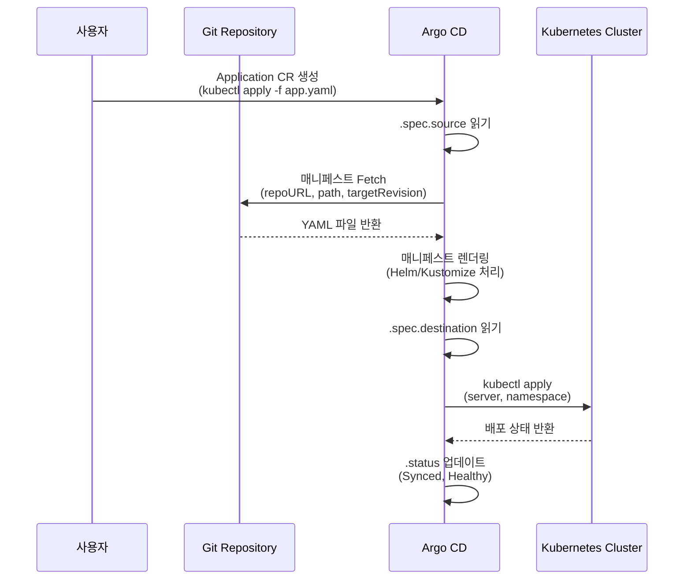
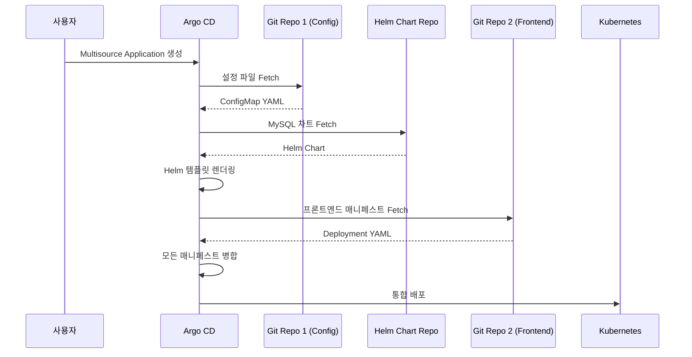
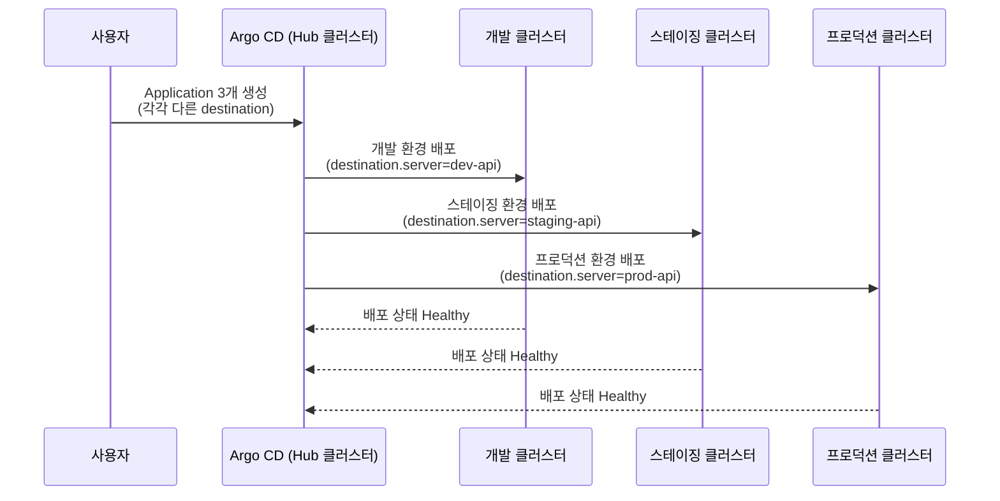
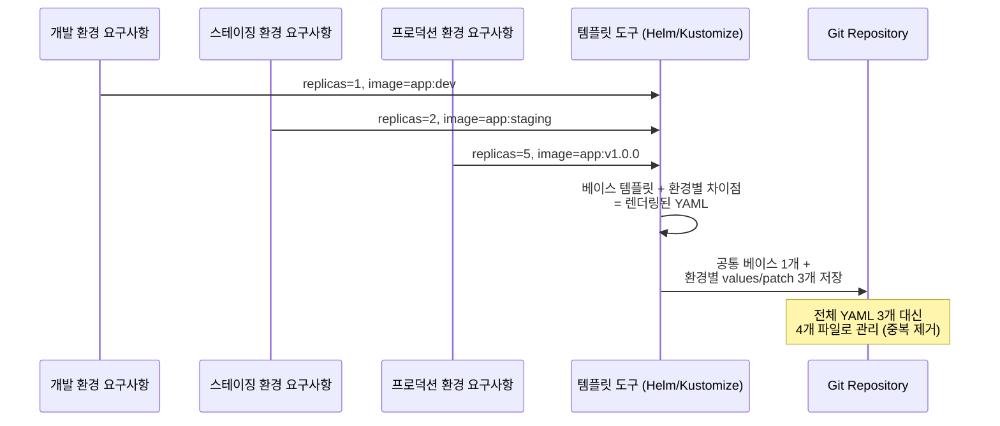
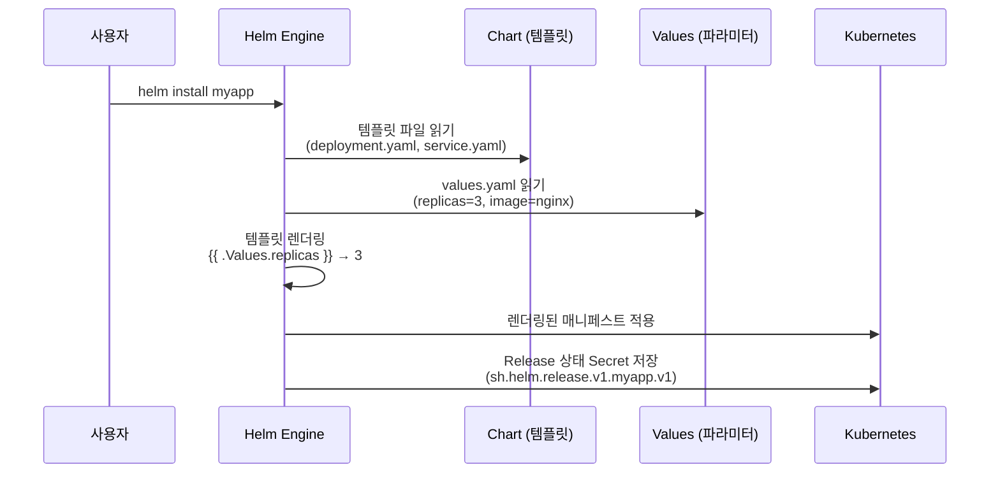
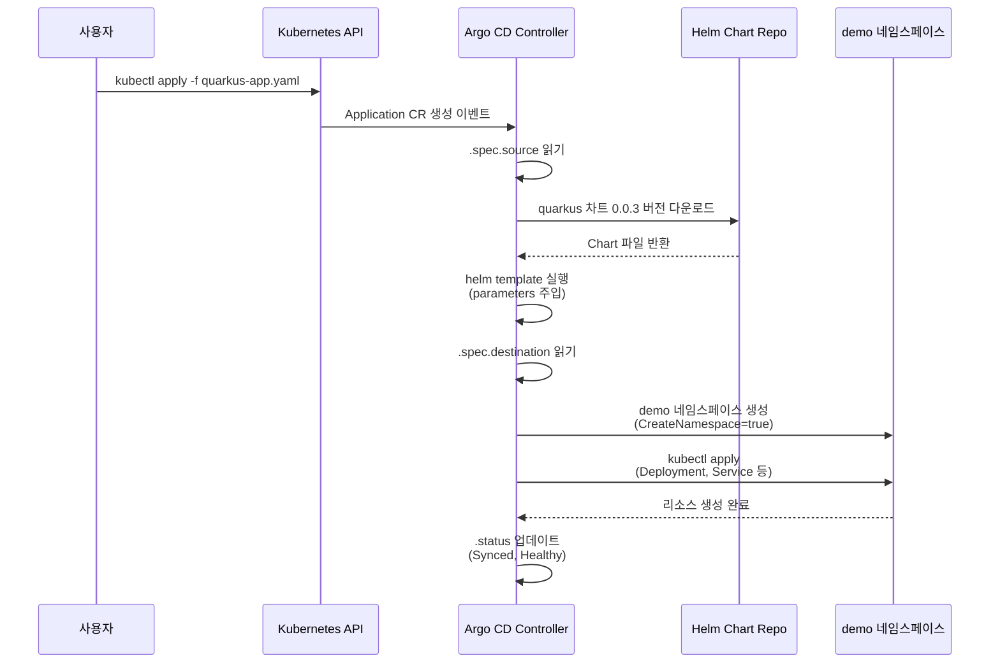
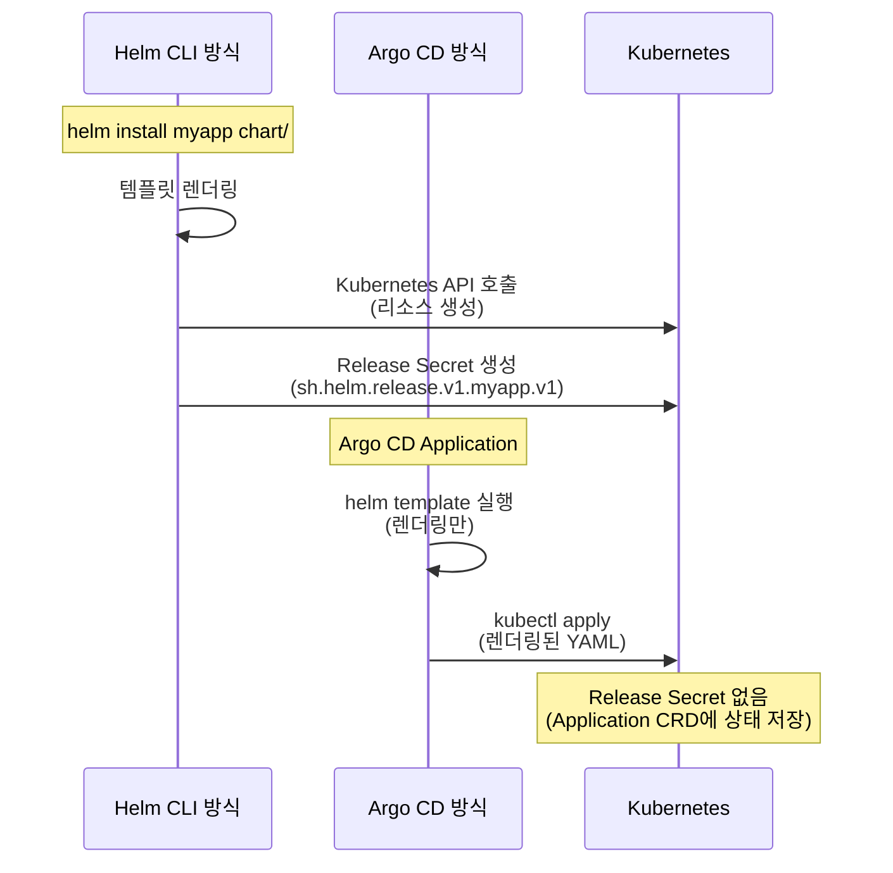
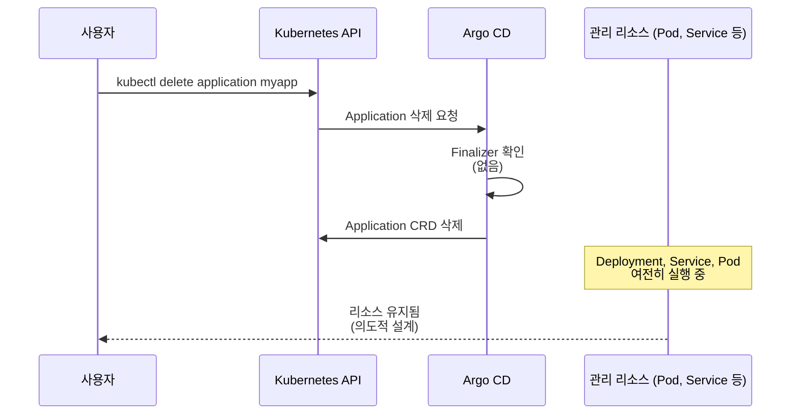
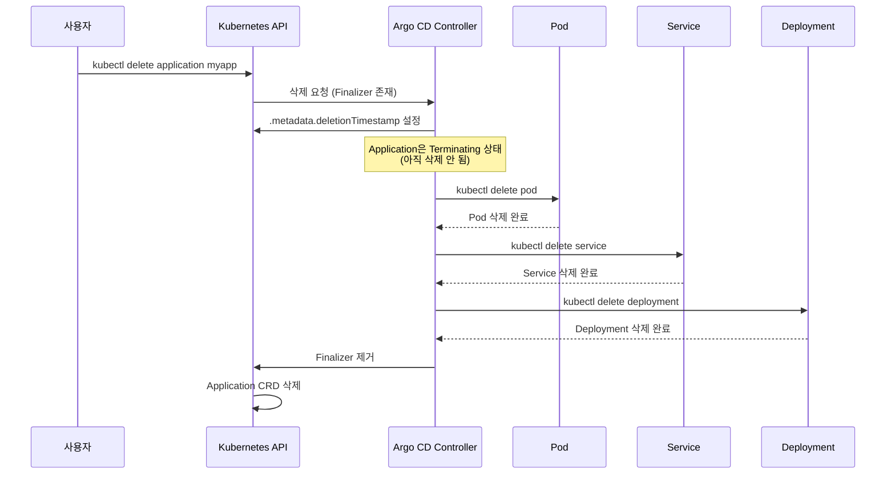
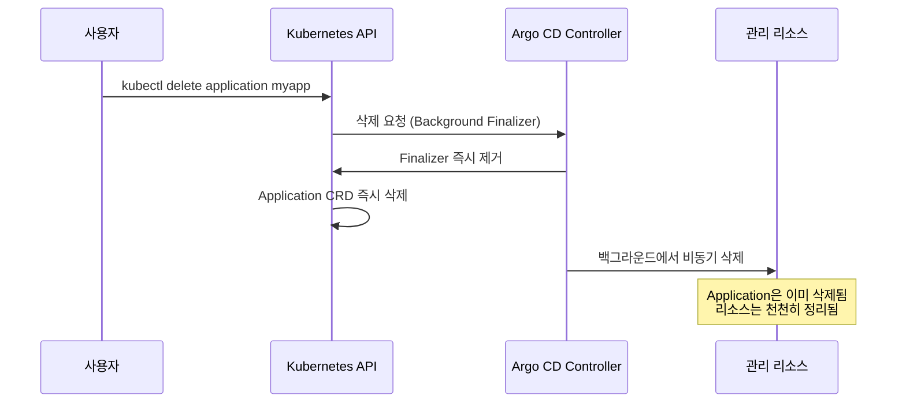

# 04. Managing Applications

---

## 📌 핵심 요약

> 이 장에서는 Argo CD의 핵심 단위인 **Application CRD**를 다룹니다. Application은 관련된 Kubernetes 리소스들의 논리적 집합으로, **Source**(Git/Helm)에서 매니페스트를 가져와 **Destination**(클러스터)에 배포합니다. **Helm**과 **Kustomize** 같은 템플릿 도구를 활용하여 환경별 YAML 중복을 최소화하고, **Finalizer**를 통해 Application 삭제 시 리소스 정리 방식을 제어할 수 있습니다.

---

## 🎯 학습 목표

이 내용을 읽고 나면:
- [ ] Argo CD Application CRD의 구조(.spec.source, .spec.destination)를 이해할 수 있다
- [ ] Git과 Helm을 Source로 사용하는 방법과 Multisource 기능을 설명할 수 있다
- [ ] Helm과 Kustomize의 차이점과 Argo CD에서의 동작 방식을 비교할 수 있다
- [ ] Application 생성/삭제와 Finalizer의 역할을 이해할 수 있다

---

## 📖 본문 정리

### 1. Application 개요

#### 1.1 Application이란?

Argo CD Application은 **Kubernetes 리소스의 논리적 집합**을 정의하는 CRD(Custom Resource Definition)입니다. 하나의 Application은 하나의 마이크로서비스, 하나의 데이터베이스, 또는 관련된 여러 리소스를 묶어서 관리하는 단위가 됩니다. 왜냐하면 Kubernetes에서는 Deployment, Service, ConfigMap 등이 개별적으로 존재하지만, 실제로는 하나의 애플리케이션을 구성하는 논리적 단위이기 때문입니다.

Application CRD는 두 가지 핵심 정보를 가지고 있습니다.
- **Source**: 어디서 매니페스트를 가져올 것인가 (Git 저장소, Helm 차트 저장소)
- **Destination**: 어디에 배포할 것인가 (대상 클러스터, 네임스페이스)

Argo CD는 이 Application CRD를 읽어서 Source에서 매니페스트를 가져오고, 렌더링한 뒤, Destination 클러스터에 배포합니다. 이 과정은 GitOps의 핵심인 "Git이 단일 진실 공급원(Single Source of Truth)"이라는 원칙을 구현합니다.



#### 1.2 Application YAML 구조

Application을 정의할 때는 다음과 같은 구조로 작성합니다.

```yaml
apiVersion: argoproj.io/v1alpha1
kind: Application
metadata:
  name: guestbook
  namespace: argocd          # Argo CD가 설치된 네임스페이스
spec:
  project: default           # AppProject 지정
  source:                    # 소스 정의
    repoURL: https://github.com/argoproj-labs/argocd-example-apps/
    targetRevision: main     # 브랜치/태그/버전
    path: guestbook/         # 매니페스트 경로
  destination:               # 대상 정의
    server: https://kubernetes.default.svc  # 대상 클러스터
    namespace: example       # 배포할 네임스페이스
```

여기서 중요한 점은 `metadata.namespace`와 `spec.destination.namespace`가 다르다는 것입니다. `metadata.namespace`는 Application CRD 자체가 저장되는 위치(보통 `argocd` 네임스페이스)이고, `spec.destination.namespace`는 실제 애플리케이션 리소스가 배포될 네임스페이스입니다. 이를 혼동하면 리소스가 의도하지 않은 곳에 배포되는 문제가 발생합니다.

#### 1.3 핵심 속성 설명

`.spec.source.repoURL`은 Git 저장소 또는 Helm 차트 저장소의 URL을 지정합니다. Git 저장소는 `https://` 또는 `git@` 형식이고, Helm 차트 저장소는 `https://` 또는 OCI 형식(`oci://`)을 사용합니다.

`.spec.source.targetRevision`은 버전 관리에서 어느 시점의 코드를 가져올지 결정합니다. Git의 경우 브랜치 이름(`main`, `develop`), 태그(`v1.0.0`), 커밋 SHA를 사용할 수 있고, Helm의 경우 차트 버전(`0.0.3`)을 사용합니다. 브랜치를 사용하면 자동으로 최신 커밋을 추적하지만, 태그나 SHA를 사용하면 특정 버전으로 고정됩니다.

`.spec.source.path`는 저장소 내에서 매니페스트가 위치한 디렉토리를 지정합니다. 왜냐하면 하나의 Git 저장소에 여러 애플리케이션의 매니페스트가 있을 수 있기 때문입니다. 예를 들어 `apps/frontend/`, `apps/backend/` 같은 구조로 모노레포를 관리할 수 있습니다.

`.spec.destination.server`는 Kubernetes API 서버의 엔드포인트입니다. `https://kubernetes.default.svc`는 Argo CD가 실행 중인 클러스터를 의미하며, 외부 클러스터는 실제 API 서버 URL을 사용합니다.

`.spec.destination.namespace`는 리소스가 배포될 네임스페이스입니다. 생략하면 `default` 네임스페이스에 배포되지만, 실무에서는 환경별로 네임스페이스를 분리하는 것이 일반적입니다(`dev`, `staging`, `production`).

---

### 2. Application Sources

#### 2.1 단일 소스 vs 다중 소스

초기 Argo CD는 하나의 Application이 하나의 소스만 가질 수 있었습니다. 하지만 실무에서는 여러 소스를 조합해야 하는 경우가 많습니다. 예를 들어, Helm 차트로 패키지된 데이터베이스와 Git 저장소의 커스텀 설정 파일을 함께 배포해야 하는 경우입니다.

Argo CD v2.6부터는 `sources` 필드를 사용하여 여러 소스를 하나의 Application에서 관리할 수 있습니다. 이는 복잡한 애플리케이션 구성을 단순화하고, Application 개수를 줄여 관리 부담을 낮춥니다.



#### 2.2 Multisource Application 예시 (v2.6+)

다음은 Multisource Application의 실무 예시입니다. Pricelist 애플리케이션이 설정 파일(Git), MySQL 데이터베이스(Helm 차트), 프론트엔드(Git)로 구성되어 있다고 가정합니다.

```yaml
spec:
  sources:
    # Git 저장소 1: 설정 파일
    - repoURL: https://github.com/org/config-repo
      path: apps/pricelist-config
      targetRevision: main

    # Helm 차트: MySQL 데이터베이스
    - chart: mysql
      repoURL: https://charts.bitnami.com/bitnami
      targetRevision: 9.2.0
      helm:
        releaseName: pricelist-db
        parameters:
          - name: auth.database
            value: "pricelist"

    # Git 저장소 2: 프론트엔드
    - repoURL: https://github.com/org/frontend-repo
      path: apps/pricelist-frontend
      targetRevision: main
```

여기서 중요한 점은 `sources` 필드를 사용하면 `source` 필드는 완전히 무시된다는 것입니다. 둘을 혼용하면 혼란이 생기므로, Multisource가 필요하면 `sources`만 사용해야 합니다.

#### 2.3 소스 유형별 사용 사례

**Git 소스**는 팀이 직접 작성한 YAML 매니페스트를 관리할 때 사용합니다. 왜냐하면 Git이 변경 이력 추적, 코드 리뷰, 롤백을 제공하기 때문입니다. Kustomize나 Helm 차트를 Git에 포함할 수도 있습니다.

**Helm Repository**는 공개 Helm 차트(예: Bitnami의 MySQL, Prometheus)를 사용할 때 사용합니다. 왜냐하면 표준화된 패키지를 재사용하면 설정 시간을 줄이고, 커뮤니티의 검증된 베스트 프랙티스를 활용할 수 있기 때문입니다.

**OCI Registry**는 컨테이너 이미지 레지스트리에 Helm 차트를 저장하는 방식입니다. GitHub Container Registry, AWS ECR, Harbor 등이 OCI 규격을 지원하며, 이미지와 차트를 한 곳에서 관리할 수 있다는 장점이 있습니다.

---

### 3. Destinations (대상 클러스터)

#### 3.1 Hub and Spoke 모델이 필요한 이유

Argo CD는 하나의 Argo CD 인스턴스(Hub)가 여러 Kubernetes 클러스터(Spoke)를 관리하는 Hub and Spoke 모델을 지원합니다. 왜냐하면 실무에서는 개발, 스테이징, 프로덕션 클러스터를 분리하여 운영하기 때문입니다. 하나의 Argo CD로 모든 환경을 관리하면 운영 복잡도가 낮아지고, 통합된 대시보드에서 전체 배포 상태를 확인할 수 있습니다.



#### 3.2 Destination 설정 방법

Destination을 설정하는 방법은 두 가지입니다.

첫 번째는 `server` 필드를 사용하여 Kubernetes API 서버 URL을 직접 지정하는 방법입니다. `https://kubernetes.default.svc`는 Argo CD가 실행 중인 클러스터를 의미하며, 특수 키워드 `in-cluster`와 동일합니다.

두 번째는 `name` 필드를 사용하여 클러스터 Secret의 이름을 참조하는 방법입니다. 외부 클러스터를 등록하면 Argo CD가 자동으로 Secret을 생성하며, 이 이름을 사용하면 URL을 직접 관리하지 않아도 됩니다.

```yaml
spec:
  destination:
    # 방법 1: server URL 사용
    server: https://kubernetes.default.svc  # Argo CD가 실행 중인 클러스터
    namespace: bgd

    # 방법 2: name 사용 (클러스터 Secret 참조)
    # name: production-cluster
    # namespace: bgd
```

실무에서는 `name`을 사용하는 것이 권장됩니다. 왜냐하면 클러스터 API 서버 URL이 변경되더라도 Secret만 업데이트하면 되고, Application 매니페스트는 수정할 필요가 없기 때문입니다.

#### 3.3 클러스터 Secret 확인

Argo CD가 관리하는 클러스터 목록은 다음 명령으로 확인할 수 있습니다.

```bash
# Argo CD가 관리하는 클러스터 목록 조회
kubectl get secrets -n argocd -l argocd.argoproj.io/secret-type=cluster

# 출력 예시:
# NAME                              TYPE     DATA   AGE
# cluster-192.168.1.254-1289728133  Opaque   3      31s
```

각 Secret에는 클러스터 API 서버 URL, 인증서, 서비스 어카운트 토큰이 포함되어 있습니다. Argo CD는 이 정보를 사용하여 대상 클러스터에 연결하고 리소스를 배포합니다.

---

### 4. 템플릿 도구

#### 4.1 GitOps에서 YAML 중복 문제가 발생하는 이유

GitOps는 모든 환경의 매니페스트를 Git에 저장합니다. 하지만 개발, 스테이징, 프로덕션 환경은 대부분의 설정이 동일하고, 일부만 다릅니다(예: 이미지 태그, 리소스 제한, 레플리카 수). 만약 각 환경마다 전체 YAML을 복사하면 유지보수가 어려워집니다. 왜냐하면 공통 설정을 변경할 때 모든 환경의 YAML을 수정해야 하고, 실수로 누락하면 환경 간 불일치가 발생하기 때문입니다.

이 문제를 해결하기 위해 템플릿 도구를 사용합니다. Helm은 파라미터화된 템플릿으로 차이점만 values 파일로 관리하고, Kustomize는 베이스 YAML에 패치를 적용하여 환경별 차이를 처리합니다.



#### 4.2 Helm을 사용하는 이유와 동작 방식

Helm은 Kubernetes의 패키지 매니저입니다. 왜냐하면 재사용 가능한 차트(패키지)를 배포하고, 파라미터를 주입하여 환경별로 커스터마이징할 수 있기 때문입니다.

Helm의 핵심은 **템플릿 엔진**입니다. Chart는 Go 템플릿 문법으로 작성된 YAML 파일들이고, values.yaml이 파라미터를 제공합니다. Helm Engine은 이 둘을 결합하여 실제 Kubernetes 매니페스트를 생성합니다.



Helm의 장점은 재사용성입니다. Bitnami의 MySQL 차트처럼 검증된 차트를 사용하면, 복잡한 StatefulSet, PVC, Service 설정을 직접 작성하지 않아도 됩니다. values 파일만 수정하면 환경별 배포가 가능합니다.

실무 예시: Helm 차트로 Redis를 배포하면서 values.yaml을 환경별로 다르게 관리합니다.

```yaml
# values-dev.yaml
replicaCount: 1
resources:
  limits:
    memory: 256Mi

# values-prod.yaml
replicaCount: 3
resources:
  limits:
    memory: 2Gi
persistence:
  enabled: true
  size: 10Gi
```

Argo CD에서는 다음과 같이 Helm 파라미터를 지정합니다.

```yaml
spec:
  source:
    chart: redis
    repoURL: https://charts.bitnami.com/bitnami
    targetRevision: 17.0.0
    helm:
      valueFiles:
        - values-prod.yaml  # 프로덕션용 values 파일
```

#### 4.3 Kustomize를 사용하는 이유와 동작 방식

Kustomize는 템플릿 없이 **패치 기반**으로 YAML을 수정합니다. 왜냐하면 기존 YAML을 수정하지 않고, 베이스 YAML 위에 오버레이를 적용하여 환경별 차이를 만들 수 있기 때문입니다.

Kustomize의 핵심 개념은 **베이스 + 오버레이**입니다. 베이스는 모든 환경에 공통인 YAML이고, 오버레이는 환경별 차이점(패치)입니다.

```
├── base/
│   ├── kustomization.yaml
│   ├── deployment.yaml      # replicas: 1
│   └── service.yaml
└── overlays/
    ├── dev/
    │   └── kustomization.yaml
    ├── staging/
    │   └── kustomization.yaml  # replicas: 2로 패치
    └── prod/
        └── kustomization.yaml  # replicas: 5로 패치
```

실무 예시: 프로덕션 환경에서는 레플리카를 5로, 리소스 제한을 높이고, Ingress를 추가합니다.

```yaml
# overlays/prod/kustomization.yaml
apiVersion: kustomize.config.k8s.io/v1beta1
kind: Kustomization

resources:
- ../../base

replicas:
- name: myapp
  count: 5

patches:
- patch: |-
    - op: replace
      path: /spec/template/spec/containers/0/resources/limits/memory
      value: 2Gi
  target:
    kind: Deployment
    name: myapp

- path: ingress.yaml  # 프로덕션용 Ingress 추가
```

Argo CD에서는 다음과 같이 Kustomize 경로를 지정합니다.

```yaml
spec:
  source:
    repoURL: https://github.com/org/repo
    path: overlays/prod  # 프로덕션 오버레이
    targetRevision: main
```

#### 4.4 Helm vs Kustomize 선택 기준

**Helm을 선택해야 하는 경우**는 다음과 같습니다.
- ISV(Independent Software Vendor) 소프트웨어를 배포할 때: Bitnami, Prometheus, Grafana 같은 공개 차트를 사용하면 설치 시간을 크게 단축할 수 있습니다.
- 복잡한 조건부 로직이 필요할 때: Helm 템플릿은 `if/else`, `range` 등 Go 템플릿 문법을 지원하여 동적 매니페스트 생성이 가능합니다.
- 재사용 가능한 패키지로 배포할 때: 차트 저장소에 업로드하여 여러 팀이 공유할 수 있습니다.

**Kustomize를 선택해야 하는 경우**는 다음과 같습니다.
- 자체 애플리케이션을 환경별로 배포할 때: 베이스 YAML을 작성하고, 환경별 패치만 관리하면 됩니다.
- 기존 YAML을 수정하지 않고 커스터마이징할 때: 서드파티 YAML을 포크하지 않고 패치로 수정할 수 있습니다.
- 학습 곡선을 낮추고 싶을 때: Kustomize는 YAML 기반이고 템플릿 문법이 없어서 Kubernetes에 익숙하면 쉽게 사용할 수 있습니다.

철학적 차이점은 명확합니다. Helm은 "템플릿으로 파라미터화하고, 파라미터를 주입한다"는 접근이고, Kustomize는 "베이스를 유지하고, 패치로 수정한다"는 접근입니다. Helm은 원본 YAML을 템플릿화해야 하지만, Kustomize는 원본 YAML을 그대로 베이스로 사용할 수 있습니다.

#### 4.5 기타 지원 도구

Argo CD는 Helm과 Kustomize 외에도 다음 도구를 지원합니다.

**Jsonnet**은 JSON 템플릿 언어로, 복잡한 로직을 함수와 변수로 추상화할 수 있습니다. 주로 대규모 모노레포에서 사용합니다.

**Config Management Plugin**은 커스텀 도구를 연동할 수 있는 인터페이스입니다. 예를 들어 사내 템플릿 도구나 Ansible을 사용하여 매니페스트를 생성할 수 있습니다.

**Cue**는 플러그인을 통해 지원되며, 타입 검증과 스키마 정의에 강점이 있습니다.

---

### 5. 첫 번째 Application 배포

#### 5.1 Helm 차트 배포 예시

실제로 Helm 차트를 Argo CD로 배포하는 과정을 살펴보겠습니다. Quarkus 애플리케이션을 배포하는 예시입니다.

```yaml
# quarkus-app.yaml
apiVersion: argoproj.io/v1alpha1
kind: Application
metadata:
  name: quarkus-app
  namespace: argocd
spec:
  project: default
  destination:
    namespace: demo
    name: in-cluster           # Argo CD가 실행 중인 클러스터
  source:
    chart: quarkus             # Helm 차트 이름
    repoURL: https://redhat-developer.github.io/redhat-helm-charts
    targetRevision: 0.0.3      # 차트 버전
    helm:
      parameters:              # Helm values 설정
        - name: build.enabled
          value: "false"
        - name: deploy.route.enabled
          value: "false"
        - name: image.name
          value: quay.io/ablock/gitops-helm-quarkus
  syncPolicy:
    automated:
      prune: true              # 삭제된 리소스 정리
      selfHeal: true           # Drift 자동 복구
    syncOptions:
    - CreateNamespace=true     # 네임스페이스 자동 생성
```

여기서 `syncPolicy`는 자동 동기화 정책입니다.
- `prune: true`는 Git에서 삭제된 리소스를 클러스터에서도 자동으로 삭제합니다. 왜냐하면 Git이 단일 진실 공급원이므로, Git에 없는 리소스는 클러스터에도 없어야 하기 때문입니다.
- `selfHeal: true`는 클러스터에서 수동으로 수정된 리소스를 Git 상태로 되돌립니다. 왜냐하면 수동 변경은 Git에 기록되지 않아서 드리프트(Drift)가 발생하기 때문입니다.
- `CreateNamespace=true`는 대상 네임스페이스가 없으면 자동으로 생성합니다.

#### 5.2 배포 및 확인 과정

```bash
# Application 생성
kubectl apply -f quarkus-app.yaml

# 배포된 리소스 확인
kubectl get deploy,service,pods -n demo

# 출력 예시:
# NAME                          READY   UP-TO-DATE   AVAILABLE   AGE
# deployment.apps/quarkus-app   1/1     1            1           9m24s
#
# NAME                  TYPE        CLUSTER-IP      PORT(S)    AGE
# service/quarkus-app   ClusterIP   10.106.53.207   8080/TCP   9m24s
```

Argo CD는 다음 과정을 자동으로 수행합니다.



#### 5.3 Argo CD와 Helm CLI의 차이점

Argo CD가 Helm 차트를 처리하는 방식은 `helm install`과 다릅니다. 왜냐하면 Argo CD는 GitOps 원칙을 따르기 때문에, Helm Release를 생성하지 않고 템플릿을 렌더링한 뒤 kubectl로 적용하기 때문입니다.



**중요한 차이점**은 다음과 같습니다.

**Helm CLI**는 Release를 생성합니다. Release는 배포 이력을 Secret으로 저장하며, `helm ls` 명령으로 조회할 수 있습니다. `helm upgrade`, `helm rollback` 같은 명령으로 버전 관리가 가능합니다.

**Argo CD**는 Release를 생성하지 않습니다. 왜냐하면 `helm template` 명령으로 YAML을 렌더링만 하고, `kubectl apply`로 적용하기 때문입니다. 배포 상태는 Application CRD의 `.status`에 저장되며, `helm ls`에는 나타나지 않습니다.

```bash
# Argo CD로 배포한 차트는 helm ls에 안 보임
$ helm ls -n demo
NAME    NAMESPACE    REVISION    UPDATED    STATUS    CHART    APP VERSION
# (빈 결과)
```

이는 실수가 아니라 의도된 동작입니다. Argo CD는 GitOps 방식으로 동작하므로, Git이 상태를 관리하고 Helm은 단순히 템플릿 엔진으로만 사용됩니다. 만약 Release 기반 관리가 필요하면 `helm install`을 직접 사용하거나, Argo CD의 Helm Release 기능을 사용해야 합니다.

---

### 6. Application 삭제

#### 6.1 기본 삭제 동작과 리소스 보존 이유

Application을 삭제할 때 기본 동작은 **Application CRD만 삭제하고, 관리 리소스는 클러스터에 남겨둡니다**. 왜냐하면 데이터 손실을 방지하기 위해서입니다.

```bash
# Application 삭제
kubectl delete application quarkus-app -n argocd
```

이 명령을 실행하면 Application CRD는 삭제되지만, Deployment, Service, Pod 등은 그대로 실행됩니다. 왜 이런 동작이 기본값일까요?

**첫 번째 이유는 데이터 보호입니다.** 만약 PersistentVolumeClaim을 가진 데이터베이스 Application을 삭제했을 때, 자동으로 PVC까지 삭제되면 데이터가 영구적으로 손실됩니다. 이는 치명적인 사고로 이어질 수 있습니다.

**두 번째 이유는 의존 서비스 보호입니다.** 예를 들어 공유 Redis Application을 삭제했을 때, 이를 사용하는 다른 애플리케이션이 갑자기 장애를 겪을 수 있습니다.

**세 번째 이유는 실수 방지입니다.** Application을 잘못 삭제했을 때, 리소스가 남아 있으면 Application만 다시 생성하여 복구할 수 있습니다.



#### 6.2 Finalizer를 통한 리소스 정리

만약 Application 삭제 시 리소스도 함께 정리하려면 **Finalizer**를 설정해야 합니다. Finalizer는 Kubernetes의 Garbage Collection 메커니즘으로, 리소스 삭제 전에 특정 작업을 수행하도록 합니다.

```yaml
apiVersion: argoproj.io/v1alpha1
kind: Application
metadata:
  name: quarkus-app
  namespace: argocd
  finalizers:
    # Foreground 삭제: 의존 리소스 먼저 삭제 후 Application 삭제
    - resources-finalizer.argocd.argoproj.io

    # Background 삭제: Application 즉시 삭제, 리소스는 비동기 삭제
    # - resources-finalizer.argocd.argoproj.io/background
```

**Foreground Finalizer**는 다음 순서로 동작합니다.



**Background Finalizer**는 다음 순서로 동작합니다.



**왜 Finalizer가 필요한가?** Finalizer가 없으면 Application CRD가 즉시 삭제되어 Argo CD가 관리 리소스 목록을 잃어버립니다. Finalizer가 있으면 Application이 "Terminating" 상태로 남아 있고, Argo CD가 리소스를 확인하여 정리할 수 있습니다.

#### 6.3 Cascade Deletion 정책 선택 기준

**Foreground Finalizer**는 다음 경우에 사용합니다.
- 리소스 삭제가 완료될 때까지 기다려야 하는 경우
- PVC 같은 중요한 리소스를 확실히 정리해야 하는 경우
- 삭제 순서가 중요한 경우 (예: Job 완료 후 삭제)

**Background Finalizer**는 다음 경우에 사용합니다.
- 리소스가 많아서 삭제에 시간이 오래 걸리는 경우
- Application을 빠르게 삭제하고 싶은 경우
- 리소스 삭제 실패가 Application 삭제를 막지 않아야 하는 경우

**Finalizer 없음**은 다음 경우에 사용합니다.
- 리소스를 수동으로 관리해야 하는 경우
- 다른 도구가 리소스를 관리하는 경우
- 테스트 환경에서 리소스를 남겨두고 싶은 경우

---

## 🔍 심화 학습

### Finalizer 동작 원리

Kubernetes Finalizer는 Garbage Collection과 관련된 기능입니다. 리소스 삭제 시 다음 과정을 거칩니다.

1. **삭제 요청 시** `.metadata.deletionTimestamp`가 설정됩니다. 리소스는 "Terminating" 상태가 되지만 아직 삭제되지 않습니다.
2. **컨트롤러가 Finalizer 확인**: Argo CD Controller는 Application에 Finalizer가 있는지 확인하고, 의존 리소스 목록을 가져옵니다.
3. **의존 리소스 정리**: 각 리소스를 순차적으로 삭제합니다. 실패하면 재시도합니다.
4. **Finalizer 제거**: 모든 리소스가 정리되면 Finalizer를 `.metadata.finalizers` 배열에서 제거합니다.
5. **실제 삭제**: 모든 Finalizer가 제거되면 Kubernetes API가 실제로 리소스를 삭제합니다.

왜 이런 메커니즘이 필요한가? 만약 Finalizer 없이 바로 삭제하면, 컨트롤러가 정리 작업을 수행할 기회가 없습니다. Finalizer는 "삭제 전 후처리"를 보장하는 훅(Hook) 역할을 합니다.

### Kustomize + Helm 조합

Argo CD에서는 Kustomize가 Helm 차트를 처리할 수 있습니다. 이는 Helm 차트를 베이스로 사용하고, Kustomize 패치로 추가 커스터마이징을 하는 하이브리드 방식입니다.

```yaml
# kustomization.yaml
apiVersion: kustomize.config.k8s.io/v1beta1
kind: Kustomization

helmCharts:
- name: cert-manager
  repo: https://charts.jetstack.io
  version: 1.5.3
  releaseName: cert-manager
  namespace: cert-manager
  valuesFile: values.yaml
```

왜 이런 조합이 필요한가? Helm 차트는 재사용 가능한 패키지이지만, values 파일만으로는 모든 커스터마이징을 할 수 없습니다. 예를 들어 특정 어노테이션을 추가하거나, 특정 리소스를 제거하는 작업은 Kustomize 패치가 더 적합합니다.

### Directory of Directories 패턴

하나의 Git 저장소에 여러 Application의 매니페스트를 관리할 때 "Directory of Directories" 패턴을 사용합니다. 왜냐하면 하나의 Application이 여러 하위 Application을 생성하는 구조로, 모든 애플리케이션을 선언적으로 관리할 수 있기 때문입니다.

```
apps/
├── app-of-apps.yaml      # 루트 Application
├── frontend/
│   └── application.yaml
├── backend/
│   └── application.yaml
└── database/
    └── application.yaml
```

`app-of-apps.yaml`은 `apps/` 디렉토리를 source로 설정하여, 하위 디렉토리의 모든 Application을 자동으로 생성합니다. 이를 "App of Apps" 패턴이라고 합니다.

왜 이 패턴이 유용한가? 새로운 애플리케이션을 추가할 때 디렉토리에 Application YAML을 추가하기만 하면 Argo CD가 자동으로 감지하여 배포합니다. 이는 대규모 마이크로서비스 환경에서 운영 부담을 크게 줄입니다.

### 출처
- [Argo CD Application Specification](https://argo-cd.readthedocs.io/en/stable/user-guide/application-specification/)
- [Helm Documentation](https://helm.sh/docs/)
- [Kustomize Documentation](https://kustomize.io/)

---

## 💡 실무 적용 포인트

### 도구 선택 가이드

**ISV 소프트웨어 배포 시 Helm을 사용합니다.** 예를 들어 Prometheus, Grafana, MySQL 같은 소프트웨어는 Helm 차트로 제공되므로, 차트 저장소에서 바로 설치할 수 있습니다. 직접 YAML을 작성하는 것보다 훨씬 빠르고 안전합니다.

**자체 애플리케이션 환경별 배포 시 Kustomize를 사용합니다.** 베이스 YAML을 작성하고, dev/staging/prod 오버레이로 환경별 차이를 관리하면 됩니다. 템플릿 문법 학습 없이 YAML 지식만으로 관리할 수 있습니다.

**복잡한 조건부 로직 필요 시 Helm을 사용합니다.** Helm 템플릿은 `if/else`, `range`, `with` 같은 제어 구조를 제공하여 동적 매니페스트 생성이 가능합니다. 예를 들어 개발 환경에서는 Ingress를 생성하지 않고, 프로덕션에서만 생성하는 로직을 구현할 수 있습니다.

**기존 YAML 수정 없이 커스터마이징할 때 Kustomize를 사용합니다.** 서드파티 YAML을 포크하지 않고, Kustomize 패치로 수정하면 원본 업데이트를 쉽게 따라갈 수 있습니다.

**여러 소스 조합 필요 시 Multisource Application을 사용합니다.** 예를 들어 Helm 차트 데이터베이스 + Git 저장소 설정 파일 + Git 저장소 프론트엔드를 하나의 Application으로 관리할 수 있습니다.

### 주의할 점 / 흔한 실수

**helm ls에 안 보이는 문제**: Argo CD로 배포한 Helm 차트는 `helm ls`에 나타나지 않습니다. 왜냐하면 Argo CD는 `helm template | kubectl apply` 방식으로 동작하여 Helm Release를 생성하지 않기 때문입니다. 배포 상태는 `kubectl get application -n argocd`로 확인해야 합니다.

**네임스페이스 혼동**: Application의 `metadata.namespace`는 Argo CD 네임스페이스(보통 `argocd`)이고, `spec.destination.namespace`는 배포 대상 네임스페이스입니다. 둘을 혼동하면 리소스가 엉뚱한 곳에 배포됩니다.

**Finalizer 미설정**: 기본적으로 Application 삭제 시 관리 리소스가 남습니다. 프로덕션에서는 의도적이지만, 개발 환경에서는 리소스가 쌓여서 문제가 될 수 있습니다. 필요시 Finalizer를 추가해야 합니다.

**sources vs source 혼용**: `sources` 필드를 사용하면 `source` 필드는 무시됩니다. 둘을 동시에 정의하면 혼란이 생기므로, Multisource가 필요하면 `sources`만 사용해야 합니다.

**Drift Detection vs Self-Heal 혼동**: Drift 감지는 기본적으로 활성화되어 있어서 클러스터와 Git의 차이를 UI에 표시합니다. 하지만 Self-Heal은 명시적으로 활성화해야 하며, 이를 설정해야 자동으로 드리프트를 복구합니다.

### 면접에서 나올 수 있는 질문

**Q: Argo CD Application의 .spec.source와 .spec.destination 역할은?**

A: `.spec.source`는 매니페스트를 가져올 위치를 정의합니다. Git 저장소, Helm 차트 저장소, OCI Registry를 지원하며, `repoURL`, `targetRevision`, `path`로 구성됩니다. `.spec.destination`은 리소스를 배포할 대상을 정의합니다. Kubernetes API 서버 URL과 네임스페이스를 지정하며, Hub and Spoke 모델에서 여러 클러스터에 배포할 수 있습니다.

**Q: Argo CD가 Helm 차트를 배포할 때 helm ls에 안 보이는 이유는?**

A: Argo CD는 `helm install` 대신 `helm template | kubectl apply` 방식으로 동작합니다. `helm template`은 차트를 렌더링만 하고 Release를 생성하지 않습니다. 따라서 Helm의 Release 관리 기능을 사용하지 않고, Argo CD의 Application CRD가 배포 상태를 관리합니다. 이는 GitOps 원칙에 따라 Git을 단일 진실 공급원으로 사용하기 위한 설계입니다.

**Q: Helm과 Kustomize의 철학적 차이점은?**

A: Helm은 "템플릿 + 파라미터" 철학입니다. YAML을 Go 템플릿 문법으로 작성하고, values 파일로 파라미터를 주입하여 렌더링합니다. 재사용 가능한 패키지를 만들 때 적합합니다. Kustomize는 "베이스 + 패치" 철학입니다. 원본 YAML을 수정하지 않고, 베이스 위에 오버레이 패치를 적용하여 환경별 차이를 만듭니다. 기존 YAML을 그대로 사용할 수 있어서 학습 곡선이 낮습니다.

**Q: Application 삭제 시 관리 리소스도 함께 삭제하려면?**

A: `.metadata.finalizers`에 `resources-finalizer.argocd.argoproj.io`를 추가해야 합니다. Foreground Finalizer는 의존 리소스를 먼저 삭제한 후 Application을 삭제하고, Background Finalizer는 Application을 즉시 삭제한 후 리소스를 비동기로 삭제합니다. Finalizer가 없으면 Application만 삭제되고 리소스는 남습니다.

**Q: Multisource Application은 언제 사용하나요?**

A: 하나의 논리적 애플리케이션이 여러 소스로 구성될 때 사용합니다. 예를 들어 Helm 차트로 패키지된 데이터베이스, Git 저장소의 설정 파일, 다른 Git 저장소의 프론트엔드를 하나의 Application으로 관리할 수 있습니다. Argo CD v2.6부터 지원하며, `sources` 필드를 사용합니다. 이를 통해 Application 개수를 줄이고, 관련 리소스를 논리적으로 묶어서 관리할 수 있습니다.

---

## ✅ 핵심 개념 체크리스트

- [ ] Application CRD의 source/destination 구조를 이해했는가?
- [ ] Git과 Helm 소스 유형의 차이를 설명할 수 있는가?
- [ ] Multisource Application (v2.6+)의 사용 사례를 알고 있는가?
- [ ] Helm과 Kustomize의 차이점을 비교할 수 있는가?
- [ ] Argo CD가 Helm을 `helm template | kubectl apply` 방식으로 처리함을 이해했는가?
- [ ] Finalizer를 통한 리소스 정리 방식을 설명할 수 있는가?

---

## 🔗 참고 자료

- 📄 공식 문서: [Application Specification](https://argo-cd.readthedocs.io/en/stable/user-guide/application-specification/)
- 📄 Multisource: [Multiple Sources](https://argo-cd.readthedocs.io/en/stable/user-guide/multiple_sources/)
- 📄 Helm: [Helm Documentation](https://helm.sh/docs/)
- 📄 Kustomize: [Kustomize.io](https://kustomize.io/)
- 📄 Finalizers: [Kubernetes Finalizers](https://kubernetes.io/docs/concepts/overview/working-with-objects/finalizers/)

---
