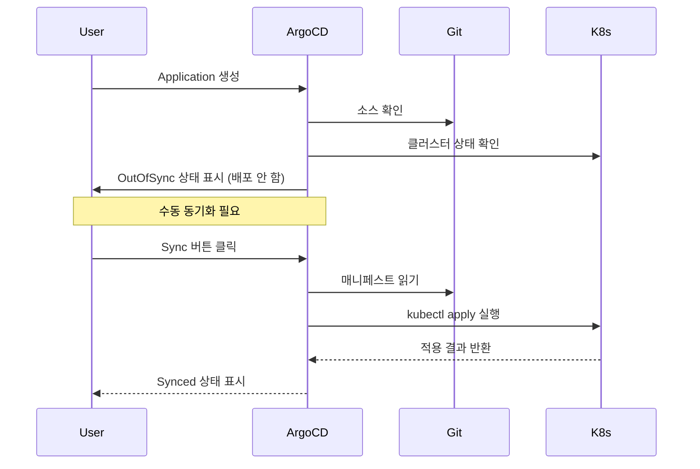
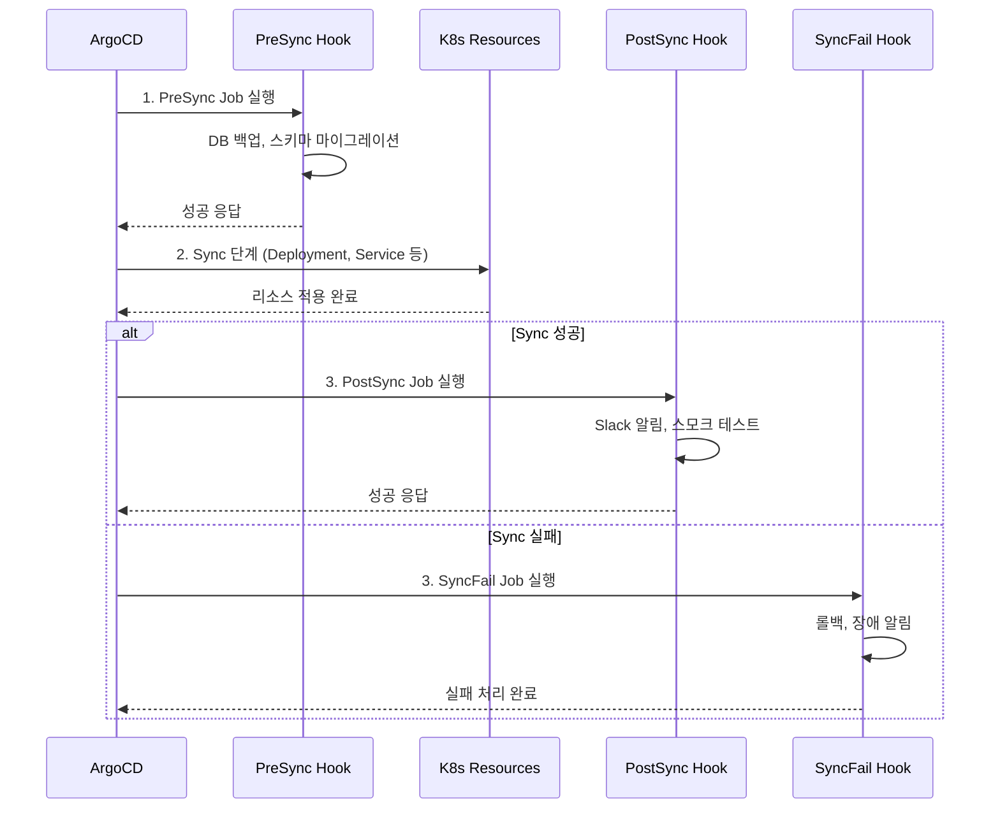
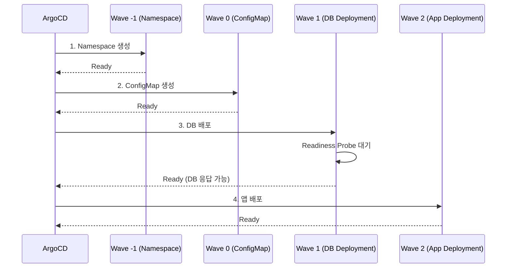
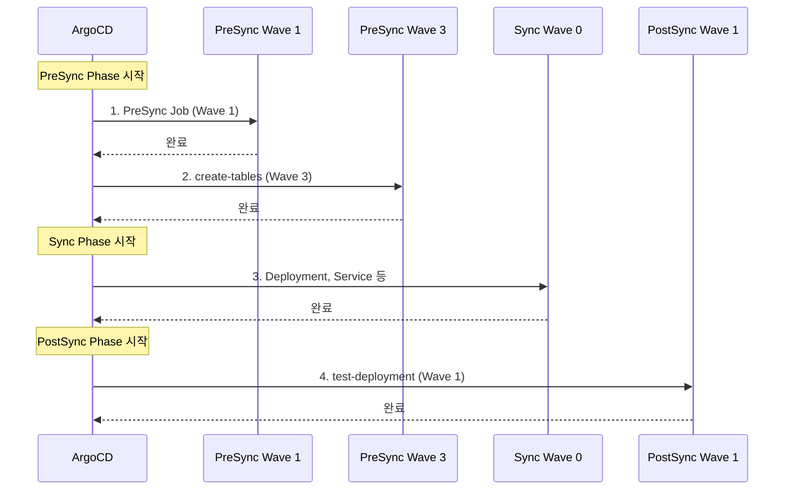
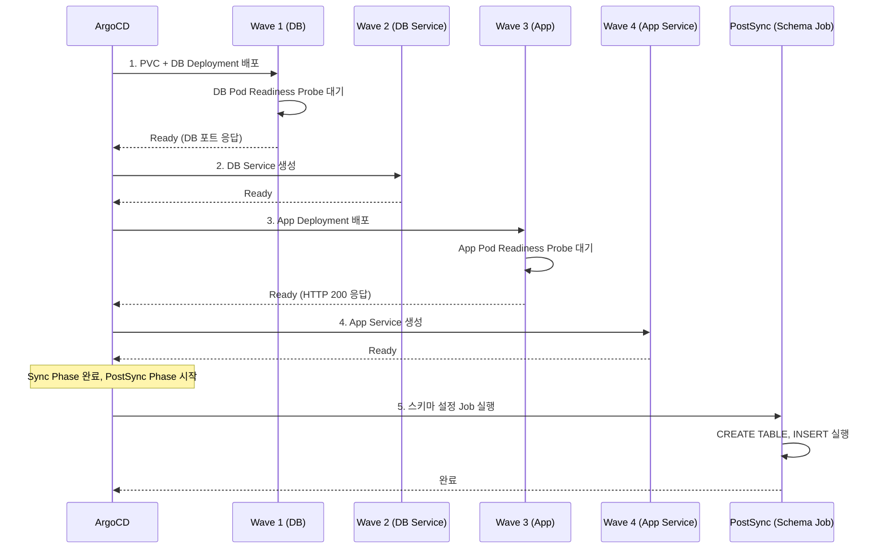

# 05. Synchronizing Applications

---

## 📌 핵심 요약

ArgoCD의 동기화(Sync)는 Git 저장소의 선언된 상태를 Kubernetes 클러스터에 실제로 적용하는 과정입니다. Application을 생성하면 기본적으로 수동 동기화 모드로 시작하며, Sync Policy를 통해 자동화할 수 있습니다. Sync Options로 동기화 방식을 세밀하게 제어하고, Sync Hooks(PreSync, PostSync 등)와 Sync Waves를 활용하여 리소스 적용 순서를 커스터마이징할 수 있습니다. 데이터베이스 마이그레이션 후 애플리케이션 배포와 같은 복잡한 배포 시나리오에서 이러한 기능들이 필수적입니다.

---

## 🎯 학습 목표

이 내용을 읽고 나면:
- [ ] ArgoCD의 기본 동기화 정책이 수동인 이유와 자동 동기화 설정 방법을 설명할 수 있다
- [ ] Application-level과 Resource-level Sync Options의 차이와 사용 시나리오를 이해할 수 있다
- [ ] Sync Hooks의 실행 순서와 각 Hook 단계에서 수행해야 할 작업을 구분할 수 있다
- [ ] Sync Waves를 활용하여 DB 마이그레이션 → 앱 배포 순서를 제어할 수 있다
- [ ] ignoreDifferences를 통해 외부 컨트롤러가 관리하는 필드를 동기화에서 제외할 수 있다

---

## 📖 본문 정리

### 1. 동기화 기본 개념

#### 1.1 기본 동작과 수동 동기화가 기본값인 이유

ArgoCD는 Application을 생성해도 자동으로 리소스를 배포하지 않습니다. 수동 동기화가 기본값인 이유는 변경 사항을 미리 검토하고 배포 시점을 제어하기 위함입니다. Git에 푸시된 변경사항이 즉시 프로덕션에 반영되면 검증되지 않은 코드가 배포될 수 있고, 조직의 승인 프로세스를 우회하는 문제가 발생할 수 있습니다.

동기화 흐름은 다음과 같이 진행됩니다.



#### 1.2 자동 동기화 활성화 방법

자동 동기화를 활성화하면 Git 저장소의 변경사항이 감지될 때마다 ArgoCD가 자동으로 클러스터에 반영합니다. 이는 GitOps의 핵심 원칙인 "Git을 단일 신뢰 소스(Single Source of Truth)로 사용"을 실현하는 방법입니다.

**방법 1: CLI**
```bash
argocd app set <APPNAME> --sync-policy automated
```

**방법 2: UI**
- "Enable Auto-Sync" 버튼 클릭

**방법 3: YAML 정의**
```yaml
spec:
  syncPolicy:
    automated:
      prune: true      # Git에서 삭제된 리소스를 클러스터에서도 삭제
      selfHeal: true   # 클러스터에서 수동 변경된 내용을 Git 상태로 되돌림
```

**prune이 위험한 이유**: Git에서 파일을 실수로 삭제하면 프로덕션 리소스가 즉시 삭제됩니다. 롤백하기 전까지 서비스 중단이 발생할 수 있으므로, 프로덕션 환경에서는 신중하게 활성화해야 합니다.

**selfHeal이 필요한 이유**: 운영자가 긴급 상황에서 `kubectl scale` 등으로 수동 변경한 내용이 있으면, ArgoCD가 Git 상태로 되돌립니다. 이를 통해 Configuration Drift(설정 불일치)를 방지하고 Git을 항상 신뢰할 수 있는 상태로 유지합니다.

---

### 2. Sync Options

#### 2.1 Application-Level Options

Application 전체에 적용되는 동기화 옵션을 정의합니다.

```yaml
apiVersion: argoproj.io/v1alpha1
kind: Application
metadata:
  name: sample-app
  namespace: argocd
spec:
  syncPolicy:
    syncOptions:
      - Validate=true              # API 유효성 검사 (kubectl apply --validate)
      - ApplyOutOfSyncOnly=true    # OutOfSync 리소스만 적용
      - CreateNamespace=true       # 네임스페이스 자동 생성
      - PrunePropagationPolicy=foreground  # 삭제 정책
      - PruneLast=true             # 동기화 마지막에 Prune
      - Replace=false              # Delete+Recreate 방식 (위험!)
      - ServerSideApply=true       # 서버 사이드 적용
      - FailOnSharedResource=true  # 공유 리소스 시 실패
      - RespectIgnoreDifferences=true  # ignoreDifferences 적용
```

#### 2.2 주요 Sync Options 설명

| 옵션 | 기본값 | 왜 필요한가? | 실무 예시 |
|------|--------|-------------|-----------|
| `Validate` | true | 잘못된 매니페스트를 클러스터에 보내기 전에 차단 | CRD가 아직 설치되지 않은 상태에서 CR을 배포하려고 하면 검증 단계에서 실패 |
| `ApplyOutOfSyncOnly` | false | 대규모 앱(100개+ 리소스)에서 불필요한 API 호출 방지 | 1000개의 리소스 중 5개만 변경되었다면 5개만 kubectl apply 실행 |
| `CreateNamespace` | false | 네임스페이스를 별도로 관리하지 않아도 됨 | 개발 환경에서 `dev-app-1`, `dev-app-2` 등 여러 네임스페이스를 자동 생성 |
| `PrunePropagationPolicy` | foreground | Deployment 삭제 시 Pod도 함께 삭제되도록 보장 | foreground는 의존 리소스가 모두 삭제될 때까지 대기, background는 즉시 반환 |
| `PruneLast` | false | 새 버전을 먼저 배포하고 구 버전을 삭제 (다운타임 최소화) | Blue-Green 배포에서 Green이 Ready 상태가 된 후 Blue 삭제 |
| `Replace` | false | Immutable 필드 변경 시 Delete+Recreate 필요 | Service의 ClusterIP를 변경하려면 Replace 필요하지만, 연결이 끊어지므로 주의 |
| `ServerSideApply` | false | 여러 컨트롤러가 같은 리소스를 수정할 때 충돌 방지 | ArgoCD와 HPA가 동시에 replicas를 관리하는 경우 Field Manager로 구분 |

#### 2.3 Resource-Level Options

개별 리소스에 어노테이션으로 Sync Option을 적용합니다. Application-level 설정보다 우선순위가 높습니다.

```yaml
metadata:
  annotations:
    # 단일 옵션
    argocd.argoproj.io/sync-options: Validate=false

    # 복수 옵션 (콤마 구분)
    argocd.argoproj.io/sync-options: Validate=false,ServerSideApply=true
```

**Resource-Level 전용 옵션**:

| 옵션 | 왜 필요한가? | 실무 예시 |
|------|-------------|-----------|
| `Prune=false` | 특정 리소스는 수동으로만 삭제되도록 보호 | PVC에 `Prune=false` 설정하여 데이터 유실 방지 |
| `SkipDryRunOnMissingResource=true` | CRD와 CR을 동시에 배포할 때 Dry-run 단계 스킹 | Operator CRD가 아직 설치되지 않은 상태에서 CR을 배포하는 경우 |

**실무 시나리오**: "PVC는 Git에서 삭제해도 클러스터에서는 유지하고 싶어요."
```yaml
apiVersion: v1
kind: PersistentVolumeClaim
metadata:
  name: database-storage
  annotations:
    argocd.argoproj.io/sync-options: Prune=false
```

---

### 3. Sync Hooks

#### 3.1 Hook의 역할과 실행 순서

Sync Hooks는 동기화 프로세스의 특정 시점에 Job이나 Pod를 실행하여 사전/사후 작업을 수행합니다. DB 마이그레이션, 스키마 설정, 알림 전송 등의 작업을 배포 파이프라인에 통합할 수 있습니다.



#### 3.2 Hook 종류

| Hook | 실행 시점 | 왜 이 시점인가? | 실무 사례 |
|------|----------|----------------|-----------|
| **PreSync** | Sync 전 | 새 버전 배포 전에 환경을 준비해야 함 | DB 스키마 마이그레이션 (ALTER TABLE), 기존 데이터 백업 |
| **Sync** | 기본 배포 단계 | 복잡한 배포 작업을 Hook으로 분리 | Helm Chart 대신 커스텀 스크립트로 배포 |
| **PostSync** | Sync 완료 후 | 배포가 완료된 후에야 검증/알림 가능 | 스모크 테스트 실행, Slack/PagerDuty 알림 전송 |
| **SyncFail** | Sync 실패 시 | 실패 시 정리 작업 필요 | 롤백 스크립트 실행, 장애 알림 전송 |
| **PostDelete** | 모든 리소스 삭제 후 | Application 삭제 후 클러스터 정리 | PVC 수동 삭제, 외부 리소스(S3 버킷) 정리 |

> **중요**: PreSync → Sync → PostSync는 순차적으로 실행되며, 이전 단계가 성공해야 다음 단계로 진행합니다. SyncFail만 예외적으로 Sync 실패 시 실행됩니다.

#### 3.3 Hook 정의

```yaml
apiVersion: batch/v1
kind: Job
metadata:
  name: schema-migration
  annotations:
    argocd.argoproj.io/hook: PreSync           # Hook 단계 지정
    argocd.argoproj.io/hook-delete-policy: HookSucceeded  # 삭제 정책
spec:
  template:
    spec:
      containers:
      - name: migration
        image: my-migration:latest
        command: ["./migrate.sh"]
      restartPolicy: Never
```

#### 3.4 Hook 삭제 정책

| 정책 | 언제 삭제되는가? | 왜 필요한가? | 실무 예시 |
|------|-----------------|-------------|-----------|
| `HookSucceeded` | Hook 성공 시 삭제 | 성공한 Job은 유지할 필요 없음 (로그는 별도 수집) | 마이그레이션 Job이 성공하면 삭제하여 클러스터 정리 |
| `HookFailed` | Hook 실패 시 삭제 | 실패한 Job은 디버깅을 위해 남기고 싶음 | 실패한 Job을 남겨두고 `kubectl logs`로 원인 분석 |
| `BeforeHookCreation` | 새 Hook 생성 전 기존 Hook 삭제 (기본값) | 같은 이름의 Job이 이미 존재하면 생성 실패 | 매번 같은 이름의 Job을 실행하려면 이전 Job 삭제 필요 |

```yaml
metadata:
  annotations:
    argocd.argoproj.io/hook: PostSync
    argocd.argoproj.io/hook-delete-policy: HookSucceeded
```

**실무 시나리오**: "DB 마이그레이션이 실패하면 Job을 남겨두고, 성공하면 삭제하고 싶어요."
```yaml
argocd.argoproj.io/hook-delete-policy: HookFailed
```

---

### 4. Sync Waves

#### 4.1 개념과 필요성

Sync Waves는 리소스 적용 순서를 제어하는 메커니즘입니다. Kubernetes는 기본적으로 리소스를 병렬로 적용하지만, DB가 준비된 후에 앱을 배포하거나, ConfigMap이 생성된 후에 Pod를 시작해야 하는 경우 순서 제어가 필요합니다.

왜 Sync Waves가 필요한가? 예를 들어 DB 마이그레이션 후 앱 배포 순서를 제어할 때, Sync Waves 없이 모든 리소스를 동시에 적용하면 앱 Pod가 DB보다 먼저 시작되어 연결 실패로 CrashLoopBackOff에 빠질 수 있습니다.



#### 4.2 Sync Wave 설정

```yaml
metadata:
  annotations:
    argocd.argoproj.io/sync-wave: "5"  # 정수값 (문자열로)
```

**규칙**:
- 기본값: `"0"`
- 음수 가능 (`"-1"`, `"-2"`)
- 낮은 숫자 먼저 적용
- 각 Wave의 **모든 리소스**가 Ready 상태가 되어야 다음 Wave 진행

**왜 Ready 상태까지 대기하는가?** Deployment가 `kubectl apply`로 생성되어도 Pod가 실제로 준비되기까지 시간이 걸립니다. 다음 Wave의 앱이 DB에 연결하려면 DB Pod가 완전히 준비된 상태여야 하므로, Readiness Probe가 성공할 때까지 대기합니다.

#### 4.3 Sync Wave + Hook 조합

Sync Wave는 **Hook 단계 내에서** 적용됩니다. PreSync Hook의 Wave 3이 PostSync Hook의 Wave 1보다 먼저 실행됩니다.

```yaml
# PreSync Hook - Wave 3
apiVersion: batch/v1
kind: Job
metadata:
  name: create-tables
  annotations:
    argocd.argoproj.io/sync-wave: "3"
    argocd.argoproj.io/hook: PreSync
---
# PostSync Hook - Wave 1
apiVersion: batch/v1
kind: Job
metadata:
  name: test-deployment
  annotations:
    argocd.argoproj.io/sync-wave: "1"
    argocd.argoproj.io/hook: PostSync
```

실행 순서는 다음과 같습니다.



**실무 시나리오**: "DB 마이그레이션(PreSync Wave 1) → DB 시드 데이터(PreSync Wave 2) → 앱 배포(Sync Wave 0) → 통합 테스트(PostSync Wave 1) 순서로 실행하고 싶어요."

---

### 5. 차이점 관리 (Ignore Differences)

#### 5.1 Compare Options

다른 컨트롤러(HPA, Operator 등)가 생성하는 리소스를 동기화 상태에서 제외합니다.

```yaml
metadata:
  annotations:
    argocd.argoproj.io/compare-options: IgnoreExtraneous
```

왜 필요한가? Kubernetes Operator가 Custom Resource를 관리하면서 `.status` 필드를 계속 업데이트하는데, ArgoCD가 이를 "OutOfSync"로 판단하면 불필요한 동기화가 반복됩니다.

> **참고**: Health 상태에는 영향을 주지만 Sync 상태에서는 무시됩니다.

#### 5.2 Application-Level Diffing

```yaml
apiVersion: argoproj.io/v1alpha1
kind: Application
metadata:
  name: myapp
spec:
  ignoreDifferences:
    # JSON Pointer 방식
    - group: apps
      kind: Deployment
      jsonPointers:
        - /spec/replicas

    # jq 표현식 방식
    - group: apps
      kind: Deployment
      jqPathExpressions:
        - .spec.template.spec.initContainers[] | select(.name == "injected-init-container")

    # 특정 manager 무시
    - group: "*"
      kind: "*"
      managedFieldsManagers:
        - kube-controller-manager
```

**실무 시나리오**: "HPA가 replicas를 자동 조정하는데, ArgoCD가 계속 Git의 replicas=3으로 되돌리려고 해요."
```yaml
ignoreDifferences:
  - group: apps
    kind: Deployment
    jsonPointers:
      - /spec/replicas
```

**왜 `/spec/replicas`를 무시해야 하는가?** HPA가 부하에 따라 replicas를 5로 늘렸는데, ArgoCD가 Git의 replicas=3과 비교하여 "OutOfSync"로 판단하고 다시 3으로 줄이면 Auto Scaling이 작동하지 않습니다.

#### 5.3 System-Level Diffing

`argocd-cm` ConfigMap에서 전역 설정합니다. 모든 Application에 공통으로 적용됩니다.

```yaml
data:
  resource.customizations.ignoreDifferences.apps_Deployment: |
    jsonPointers:
      - /spec/replicas
```

---

### 6. 사용 사례: 데이터베이스 스키마 설정

#### 6.1 시나리오

DB 마이그레이션 후 앱 배포 순서를 Sync Wave로 제어하는 실무 예시입니다. PVC → DB Deployment → DB Service → App Deployment → App Service → Schema Setup Job 순서로 배포합니다.



왜 이 순서인가?
- **Wave 1 (DB)**: 앱이 연결할 DB가 먼저 준비되어야 함
- **Wave 2 (DB Service)**: Service가 없으면 앱이 DB를 찾을 수 없음
- **Wave 3 (App)**: DB Service가 준비된 후 앱 시작
- **Wave 4 (App Service)**: 앱이 Ready 상태가 된 후 Service 노출
- **PostSync (Schema Job)**: 모든 리소스가 배포된 후 스키마 설정

#### 6.2 Application YAML

```yaml
apiVersion: argoproj.io/v1alpha1
kind: Application
metadata:
  name: pricelist-app
  namespace: argocd
  finalizers:
    - resources-finalizer.argocd.argoproj.io
spec:
  project: default
  source:
    path: ch05/manifests/
    repoURL: https://github.com/example/repo
    targetRevision: main
  destination:
    namespace: pricelist
    name: in-cluster
  syncPolicy:
    automated:
      prune: true
      selfHeal: true
    syncOptions:
      - CreateNamespace=true
    retry:
      limit: 5
      backoff:
        duration: 5s
        factor: 2
        maxDuration: 3m
```

#### 6.3 리소스별 Sync Wave 설정

| 리소스 | Sync Wave | 단계 | 왜 이 Wave인가? |
|--------|-----------|------|----------------|
| `pricelist-db-pvc.yaml` (PVC) | 1 | Sync | DB가 데이터를 저장할 볼륨 먼저 생성 |
| `pricelist-db.yaml` (DB Deployment) | 1 | Sync | PVC와 동시에 생성해도 무방 (PVC는 즉시 사용 가능) |
| `pricelist-db-svc.yaml` (DB Service) | 2 | Sync | DB Pod가 Ready 상태가 된 후 Service 생성 |
| `pricelist-deploy.yaml` (App Deployment) | 3 | Sync | DB Service가 준비된 후 앱 시작 |
| `pricelist-svc.yaml` (App Service) | 4 | Sync | 앱이 Ready 상태가 된 후 외부 노출 |
| `pricelist-job.yaml` (Schema Job) | 0 | **PostSync** | 모든 리소스가 배포된 후 스키마 설정 |

#### 6.4 Schema Setup Job

```yaml
apiVersion: batch/v1
kind: Job
metadata:
  name: pricelist-postdeploy
  annotations:
    argocd.argoproj.io/sync-wave: "0"
    argocd.argoproj.io/hook: PostSync
    argocd.argoproj.io/hook-delete-policy: BeforeHookCreation
spec:
  template:
    spec:
      containers:
      - name: schema-setup
        image: mysql:8.0
        command: ["./setup-schema.sh"]
      restartPolicy: Never
```

왜 PostSync인가? Sync 단계에서 스키마를 설정하면 DB Pod가 아직 준비되지 않았을 수 있습니다. PostSync는 모든 리소스가 배포되고 Ready 상태가 된 후 실행되므로, DB 연결이 보장됩니다.

#### 6.5 Probes의 중요성

Sync Wave가 정상 작동하려면 **Readiness/Liveness Probe**가 필수입니다. Probe가 없으면 Pod가 실제로 준비되지 않았는데도 "Ready"로 판단되어 다음 Wave가 실행되고, 결과적으로 앱이 DB에 연결 실패합니다.

```yaml
# Database Deployment
spec:
  template:
    spec:
      containers:
      - name: mysql
        image: mysql:8.0
        livenessProbe:
          tcpSocket:
            port: 3306
          initialDelaySeconds: 12
          periodSeconds: 10
        readinessProbe:
          tcpSocket:
            port: 3306
          initialDelaySeconds: 12
          periodSeconds: 10
```

```yaml
# Web App Deployment
spec:
  template:
    spec:
      containers:
      - name: app
        image: quay.io/example/app:latest
        readinessProbe:
          httpGet:
            path: /
            port: 8080
          initialDelaySeconds: 5
          periodSeconds: 2
        livenessProbe:
          tcpSocket:
            port: 8080
          initialDelaySeconds: 5
          periodSeconds: 2
```

**왜 DB는 TCP Probe를 사용하는가?** MySQL은 초기화 중에 HTTP 엔드포인트를 제공하지 않으므로, 포트 3306이 응답하는지만 확인합니다. 앱은 HTTP 엔드포인트(`/`)를 제공하므로 HTTP Probe를 사용합니다.

---

## 🔍 심화 학습

### Retry 설정

동기화 실패 시 자동 재시도 설정입니다. 네트워크 일시 장애나 리소스 생성 타이밍 이슈를 자동으로 복구합니다.

```yaml
syncPolicy:
  retry:
    limit: 5           # 최대 재시도 횟수
    backoff:
      duration: 5s     # 초기 대기 시간
      factor: 2        # 배수 (5s → 10s → 20s)
      maxDuration: 3m  # 최대 대기 시간
```

왜 exponential backoff를 사용하는가? 첫 시도가 실패한 직후 재시도하면 같은 이유로 실패할 가능성이 높습니다. 대기 시간을 점진적으로 늘리면 일시적인 장애가 복구될 시간을 제공합니다.

### Prune Propagation Policy

| 정책 | 삭제 방식 | 왜 이 정책을 선택하는가? | 실무 예시 |
|------|----------|------------------------|-----------|
| `foreground` | 의존 리소스 먼저 삭제 (기본값) | Pod가 완전히 종료된 후 Deployment 삭제 | StatefulSet 삭제 시 모든 Pod가 순서대로 종료되도록 보장 |
| `background` | 비동기 삭제 | 빠른 삭제 필요, 의존 리소스는 나중에 GC | 개발 환경에서 빠른 정리 |
| `orphan` | 소유 리소스 분리 (삭제 안 함) | Deployment는 삭제하지만 Pod는 남기고 싶음 | Blue-Green 배포에서 Green Deployment 삭제 후 Pod는 유지 |

### generateName vs name

Hook이 매번 실행되게 하려면:
- `BeforeHookCreation` 삭제 정책 사용, 또는
- `.metadata.generateName` 사용 (Kustomize 제한 있음)

왜 `generateName`이 필요한가? Job은 이름이 고정되면 같은 이름의 Job이 이미 존재하여 생성 실패합니다. `generateName: migration-`을 사용하면 `migration-abc123` 같은 고유한 이름이 생성됩니다.

### 출처
- [Argo CD Sync Options](https://argo-cd.readthedocs.io/en/stable/user-guide/sync-options/)
- [Resource Hooks](https://argo-cd.readthedocs.io/en/stable/user-guide/resource_hooks/)
- [Sync Waves](https://argo-cd.readthedocs.io/en/stable/user-guide/sync-waves/)

---

## 💡 실무 적용 포인트

### Sync Wave 설계 가이드

| 순서 | 리소스 유형 | 권장 Wave | 왜 이 순서인가? |
|------|------------|-----------|----------------|
| 1 | Namespace, CRD | -2 ~ -1 | 다른 모든 리소스가 의존하는 기반 |
| 2 | ConfigMap, Secret | 0 | Pod가 환경 변수로 참조하므로 먼저 생성 |
| 3 | PVC, Storage | 1 | DB가 데이터를 저장할 볼륨 |
| 4 | Database Deployment | 1 | 앱보다 먼저 시작되어야 함 |
| 5 | Database Service | 2 | DB Pod가 Ready 상태가 된 후 Service 생성 |
| 6 | Application Deployment | 3 | DB Service DNS가 해석 가능한 상태에서 시작 |
| 7 | Application Service | 4 | 앱이 Ready 상태가 된 후 외부 노출 |
| 8 | Ingress | 5 | Service가 준비된 후 Ingress 라우팅 |

### 주의할 점 / 흔한 실수

- ⚠️ **기본 동기화 비활성화**: Application 생성만으로 리소스 배포 안 됨. 이유는 변경 사항을 미리 검토하고 배포 시점을 제어하기 위함입니다.
- ⚠️ **Probe 미설정**: Sync Wave가 다음 단계로 진행하려면 Ready 상태 필요. Probe가 없으면 Pod가 실제로 준비되지 않았는데도 다음 Wave로 진행됩니다.
- ⚠️ **Hook 멱등성**: Hook은 재시도 정책에 의해 여러 번 실행될 수 있으므로 멱등하게 작성. 예를 들어 `CREATE TABLE IF NOT EXISTS`를 사용합니다.
- ⚠️ **Replace=true 위험**: Delete+Recreate 방식으로 데이터 손실 가능. Service를 삭제하면 ClusterIP가 변경되어 연결이 끊어집니다.
- ⚠️ **Sync Wave 범위**: Wave는 Hook 단계 내에서만 적용됨. PreSync Wave 3이 PostSync Wave 1보다 먼저 실행됩니다.
- ⚠️ **ignoreDifferences vs RespectIgnoreDifferences**: 후자를 함께 설정해야 Sync 시에도 적용. `RespectIgnoreDifferences=true` 없이 `ignoreDifferences`만 설정하면 Diff 비교에서만 무시되고 Sync 시에는 적용됩니다.

### 면접에서 나올 수 있는 질문

- Q: ArgoCD의 기본 동기화 정책이 수동인 이유는 무엇인가요?
  - A: Git 변경사항을 미리 검토하고 배포 시점을 제어하기 위함입니다. 자동 동기화는 검증되지 않은 코드가 즉시 프로덕션에 반영될 위험이 있고, 조직의 승인 프로세스를 우회하는 문제가 발생할 수 있습니다.

- Q: PreSync, Sync, PostSync Hook의 차이점과 사용 사례는?
  - A: PreSync는 배포 전 환경 준비(DB 마이그레이션, 백업), Sync는 기본 배포 단계, PostSync는 배포 후 검증(스모크 테스트, 알림)에 사용됩니다. 각 단계는 이전 단계가 성공해야 진행되며, SyncFail은 실패 시 정리 작업을 수행합니다.

- Q: Sync Wave가 필요한 상황과 설정 방법은?
  - A: DB 마이그레이션 후 앱 배포처럼 리소스 적용 순서를 제어할 때 필요합니다. `argocd.argoproj.io/sync-wave` 어노테이션에 정수값을 설정하며, 낮은 숫자가 먼저 적용됩니다. 각 Wave의 모든 리소스가 Ready 상태가 되어야 다음 Wave로 진행하므로 Readiness Probe가 필수입니다.

- Q: Hook 삭제 정책 3가지(HookSucceeded, HookFailed, BeforeHookCreation)의 차이는?
  - A: HookSucceeded는 성공 시 삭제하여 클러스터를 정리하고, HookFailed는 실패 시 삭제하여 성공한 Job은 디버깅을 위해 남기며, BeforeHookCreation은 새 Hook 생성 전 기존 Hook을 삭제하여 이름 충돌을 방지합니다.

- Q: ignoreDifferences 설정의 용도와 적용 수준(Application/System)은?
  - A: HPA가 replicas를 자동 조정하거나 Operator가 status를 업데이트하는 필드를 ArgoCD가 "OutOfSync"로 판단하지 않도록 무시합니다. Application-level은 특정 앱에만, System-level(`argocd-cm`)은 모든 앱에 공통으로 적용됩니다. `RespectIgnoreDifferences=true`를 함께 설정해야 Sync 시에도 적용됩니다.

---

## ✅ 핵심 개념 체크리스트

- [ ] ArgoCD 기본 동기화 정책이 수동인 이유(변경 검토, 배포 시점 제어, 승인 프로세스)를 설명할 수 있는가?
- [ ] prune이 위험한 이유(실수로 삭제 시 서비스 중단)와 selfHeal이 필요한 이유(Configuration Drift 방지)를 알고 있는가?
- [ ] Application-level과 Resource-level Sync Options의 차이(전체 vs 개별, 우선순위)를 이해했는가?
- [ ] Sync Hooks(PreSync, Sync, PostSync, SyncFail, PostDelete)의 실행 순서와 각 단계의 목적을 설명할 수 있는가?
- [ ] Hook 삭제 정책과 `generateName` 사용 시 주의점(이름 충돌 방지)을 알고 있는가?
- [ ] Sync Waves가 Hook 단계 내에서 작동함을 이해했는가? (PreSync Wave 3 > PostSync Wave 1)
- [ ] Sync Wave가 다음 단계로 진행하려면 모든 리소스가 Ready 상태여야 하므로 Readiness Probe가 필수임을 알고 있는가?
- [ ] ignoreDifferences와 RespectIgnoreDifferences의 차이(Diff 비교 vs Sync 적용)를 알고 있는가?
- [ ] DB 마이그레이션 후 앱 배포 순서를 Sync Wave로 제어하는 실무 시나리오를 구현할 수 있는가?

---

## 🔗 참고 자료

- 📄 공식 문서: [Sync Options](https://argo-cd.readthedocs.io/en/stable/user-guide/sync-options/)
- 📄 Resource Hooks: [Resource Hooks](https://argo-cd.readthedocs.io/en/stable/user-guide/resource_hooks/)
- 📄 Sync Waves: [Sync Waves and Phases](https://argo-cd.readthedocs.io/en/stable/user-guide/sync-waves/)
- 📄 Diffing: [Diffing Customization](https://argo-cd.readthedocs.io/en/stable/user-guide/diffing/)
- 📄 Kubernetes Probes: [Configure Liveness, Readiness and Startup Probes](https://kubernetes.io/docs/tasks/configure-pod-container/configure-liveness-readiness-startup-probes/)

---
