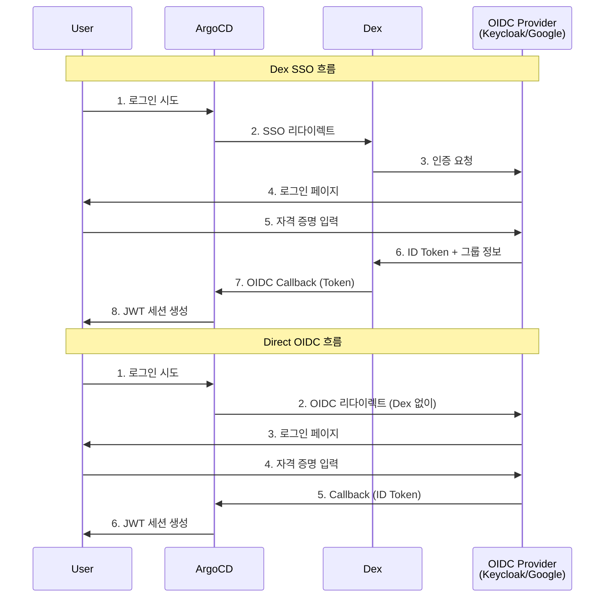
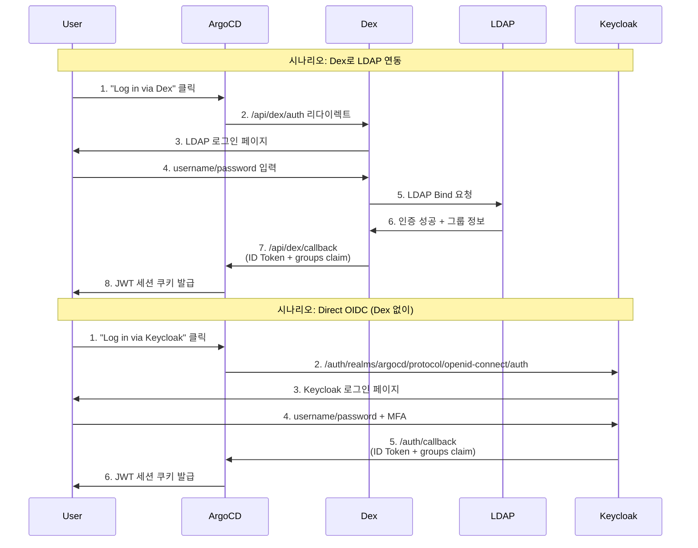

# 06. Authentication and Authorization

---

## 📌 핵심 요약

ArgoCD는 세 가지 인증 방식을 제공하는데, 첫째는 초기 설치 시 자동 생성되는 Admin 계정이고, 둘째는 ConfigMap에 직접 정의하는 Local Users이며, 셋째는 Keycloak이나 LDAP 같은 외부 Identity Provider와 연동하는 SSO입니다. SSO는 Dex를 중간 브릿지로 사용하거나 OIDC Provider와 직접 연동할 수 있습니다. 인가는 RBAC 정책을 통해 사용자와 그룹에 세밀한 권한을 부여하며, CSV 형식으로 정책을 정의하고 Casbin 엔진이 이를 평가합니다.

---

## 🎯 학습 목표

이 내용을 읽고 나면:
- [ ] Admin 사용자와 Local Users의 관리 방법을 이해할 수 있다
- [ ] Auth Token 생성, 관리, 폐기 방법을 설명할 수 있다
- [ ] Dex SSO와 Direct OIDC 통합의 차이점을 비교할 수 있다
- [ ] RBAC 정책 정의와 커스텀 역할 생성 방법을 알 수 있다

---

## 📖 본문 정리

### 1. 사용자 관리 개요

#### 1.1 인증 아키텍처

ArgoCD는 세 가지 인증 방식을 제공합니다. Admin 계정은 설치 시 자동으로 생성되며 초기 관리 작업에 사용됩니다. Local Users는 `argocd-cm` ConfigMap에 직접 정의하는 방식으로, 소규모 팀이나 개발 환경에서 사용합니다. SSO는 외부 Identity Provider와 연동하는 방식으로, 기업 환경에서 중앙 집중식 사용자 관리를 위해 사용합니다.

SSO 연동은 두 가지 방식이 있습니다. Dex SSO는 Dex라는 중간 컴포넌트를 사용해 다양한 IdP(GitHub, LDAP, SAML 등)를 지원하는 방식이고, Direct OIDC는 Keycloak이나 Google처럼 OIDC를 지원하는 Provider와 직접 연동하는 방식입니다. Dex를 사용하는 이유는 ArgoCD가 직접 지원하지 않는 프로토콜(LDAP, SAML)을 OIDC로 변환해주기 때문입니다. 반면 Direct OIDC는 추가 컴포넌트 없이 간단하게 설정할 수 있지만 OIDC를 지원하는 Provider만 사용할 수 있습니다.



**왜 SSO를 사용하는가?** Local Users는 사용자마다 별도로 비밀번호를 관리해야 하고, 퇴사자 계정을 수동으로 비활성화해야 하며, 비밀번호 정책을 강제할 수 없습니다. SSO를 사용하면 중앙의 Identity Provider에서 사용자 생명주기를 관리하고, 한 번의 로그인으로 여러 시스템에 접근할 수 있으며, MFA(Multi-Factor Authentication) 같은 보안 정책을 일괄 적용할 수 있습니다.

---

### 2. Admin 사용자

Admin 계정은 ArgoCD 설치 시 자동으로 생성되며, 초기 비밀번호는 `argocd-initial-admin-secret`이라는 Secret에 저장됩니다. 이 비밀번호는 base64로 인코딩되어 있으므로 디코딩해서 사용해야 합니다.

#### 2.1 초기 비밀번호 조회

```bash
# argocd-initial-admin-secret에서 비밀번호 추출
kubectl -n argocd get secret argocd-initial-admin-secret \
  -o jsonpath="{.data.password}" | base64 -d
```

#### 2.2 비밀번호 변경

보안을 위해 초기 비밀번호는 반드시 변경해야 합니다. 비밀번호를 변경한 후에는 초기 비밀번호 Secret을 삭제하는 것이 권장됩니다. 이 Secret이 남아 있으면 누구나 Admin 비밀번호를 알아낼 수 있기 때문입니다.

```bash
# 비밀번호 변경
argocd account update-password \
  --account=admin \
  --current-password $(kubectl -n argocd get secret argocd-initial-admin-secret \
    -o jsonpath="{.data.password}" | base64 -d) \
  --new-password=<new_password>

# 초기 비밀번호 Secret 삭제 (권장)
kubectl delete secret argocd-initial-admin-secret -n argocd
```

#### 2.3 Admin 비활성화

SSO를 설정하고 다른 관리자 계정을 만든 후에는 Admin 계정을 비활성화하는 것이 권장됩니다. 왜냐하면 Admin 계정은 이름이 고정되어 있어 브루트 포스 공격의 대상이 되기 쉽고, SSO를 통한 중앙 집중식 계정 관리 정책에서 벗어나기 때문입니다.

```yaml
# argocd-cm ConfigMap
apiVersion: v1
kind: ConfigMap
metadata:
  name: argocd-cm
  namespace: argocd
data:
  admin.enabled: "false"  # Admin 계정 비활성화
```

```bash
# kubectl로 비활성화
kubectl patch -n argocd cm argocd-cm --type='merge' \
  -p='{"data": {"admin.enabled": "false"}}'
```

---

### 3. Local Users

Local Users는 `argocd-cm` ConfigMap에 `accounts.<username>` 형식으로 정의하며, 각 사용자에게 capability를 지정합니다. capability는 사용자가 할 수 있는 작업의 종류를 나타내는데, `login`은 웹 UI와 CLI로 로그인할 수 있는 권한이고, `apiKey`는 자동화나 CI/CD를 위한 API 토큰을 생성할 수 있는 권한입니다.

#### 3.1 사용자 정의

```yaml
# argocd-cm ConfigMap
apiVersion: v1
kind: ConfigMap
metadata:
  name: argocd-cm
  namespace: argocd
data:
  accounts.alice: apiKey, login  # 사용자 정의 + 권한
```

```bash
# kubectl로 사용자 추가
kubectl patch -n argocd cm argocd-cm --type='merge' \
  -p='{"data": {"accounts.alice": "apiKey, login"}}'
```

#### 3.2 Capabilities (권한)

`login` capability는 웹 UI에 접속하거나 `argocd login` 명령으로 대화형 로그인을 할 때 필요합니다. `apiKey` capability는 CI/CD 파이프라인에서 ArgoCD API를 호출할 때 사용할 토큰을 생성하기 위해 필요합니다. 예를 들어 Jenkins에서 ArgoCD Application을 자동으로 동기화하려면 `apiKey` capability가 있는 사용자로 토큰을 생성해야 합니다.

| Capability | 사용 시나리오 | 실무 예시 |
|------------|--------------|----------|
| `login` | 개발자가 웹 UI에서 Application 상태를 확인하고 수동으로 동기화할 때 | "개발팀 멤버 5명에게 login 권한을 주고 각자 development 프로젝트만 볼 수 있도록 RBAC 설정" |
| `apiKey` | CI/CD 파이프라인에서 Application을 자동으로 동기화할 때 | "GitLab CI에서 image tag 변경 후 ArgoCD로 배포하려면 apiKey로 토큰 생성하고 `argocd app sync` 실행" |

#### 3.3 사용자 관리 명령어

```bash
# 사용자 목록 조회
argocd account list

# 비밀번호 변경
argocd account update-password --account=alice --new-password=<new_password>

# 사용자 정보 조회
argocd account get --account alice
```

#### 3.4 선언적 비밀번호 설정

GitOps 방식으로 사용자를 관리하려면 비밀번호를 bcrypt 해시로 변환해서 `argocd-secret`에 저장합니다. 평문 비밀번호를 Secret에 넣으면 안 되는 이유는 Secret이 base64 인코딩만 되어 있어 쉽게 디코딩할 수 있기 때문입니다. bcrypt는 솔트를 사용한 단방향 해시이므로 원본 비밀번호를 알아낼 수 없습니다.

```bash
# bcrypt 해시 생성
argocd account bcrypt --password <new_password>

# argocd-secret에 비밀번호 설정
kubectl -n argocd patch secret argocd-secret \
  -p '{"stringData": {
    "accounts.alice.password": "<BCRYPT_PASSWORD>",
    "accounts.alice.passwordMtime": "'$(date -u +"%Y-%m-%dT%H:%M:%SZ")'"
  }}'
```

#### 3.5 사용자 비활성화/활성화

퇴사자나 휴직자의 계정을 비활성화할 때는 `accounts.<username>.enabled: "false"`를 설정합니다. 사용자를 삭제하는 대신 비활성화하는 이유는 감사 로그를 보존하고, 나중에 다시 활성화할 수 있기 때문입니다.

```yaml
# argocd-cm ConfigMap
data:
  accounts.alice: apiKey, login
  accounts.alice.enabled: "false"  # 비활성화
```

```bash
# 비활성화
kubectl patch -n argocd cm argocd-cm --type='merge' \
  -p='{"data": {"accounts.alice.enabled": "false"}}'

# 활성화 (속성 제거)
kubectl patch -n argocd cm argocd-cm --type=json \
  -p='[{"op": "remove", "path": "/data/accounts.alice.enabled"}]'
```

---

### 4. Auth Tokens

Auth Token은 CI/CD 파이프라인이나 자동화 스크립트에서 ArgoCD API를 호출할 때 사용합니다. 비밀번호 대신 토큰을 사용하는 이유는 토큰은 만료 기간을 설정할 수 있고, 개별적으로 폐기할 수 있으며, 권한 범위를 제한할 수 있기 때문입니다. 예를 들어 Jenkins 파이프라인에서 사용하는 토큰이 유출되었다면 해당 토큰만 폐기하고 비밀번호는 그대로 유지할 수 있습니다.

#### 4.1 토큰 생성 및 사용

자동화용 사용자는 `login` capability 없이 `apiKey`만 부여하는 것이 권장됩니다. 왜냐하면 자동화 스크립트는 웹 UI에 로그인할 필요가 없고, capability를 최소화하면 보안 위험을 줄일 수 있기 때문입니다.

```bash
# 자동화용 사용자 생성 (apiKey만)
kubectl patch -n argocd cm argocd-cm --type='merge' \
  -p='{"data": {"accounts.automation": "apiKey"}}'

# 토큰 생성 (무기한)
argocd account generate-token --account automation

# 만료 기간 지정 토큰 생성
argocd account generate-token --account automation --expires-in 90d

# 토큰으로 CLI 사용
argocd account get-user-info --auth-token=<token>

# 또는 환경 변수 설정
export ARGOCD_AUTH_TOKEN=<token>
```

**실무 시나리오**: "GitLab CI에서 이미지 빌드 후 ArgoCD로 배포하려면 automation 계정으로 90일 만료 토큰을 생성하고, GitLab CI 환경 변수에 `ARGOCD_AUTH_TOKEN`으로 등록한 후 `argocd app set <app-name> --parameter image.tag=<new-tag>`와 `argocd app sync <app-name>`을 실행합니다. 토큰이 만료되기 전에 새 토큰을 생성하고 환경 변수를 업데이트해야 합니다."

#### 4.2 토큰 관리

```bash
# 사용자 및 토큰 정보 조회
argocd account get --account automation
# 출력:
# Tokens:
# ID                                    ISSUED AT                  EXPIRING AT
# 89ec94b0-aff8-47c6-b59a-229c4b564688  2024-01-20T14:15:16-06:00  2024-04-19T15:15:16-05:00
# 70cf36ea-b365-4f04-9fc0-56229cd41620  2024-01-20T12:39:16-06:00  never

# 토큰 폐기
argocd account delete-token --account <account> <token_id>
```

토큰을 폐기하는 시나리오는 세 가지입니다. 첫째, 토큰이 유출되었을 때 즉시 폐기해서 피해를 차단합니다. 둘째, 직원이 퇴사하거나 프로젝트에서 이탈할 때 해당 직원이 생성한 토큰을 모두 폐기합니다. 셋째, 정기적인 보안 감사에서 만료 기간이 없는 토큰이나 90일 이상 사용하지 않은 토큰을 폐기합니다.

---

### 5. SSO (Single Sign-On)

SSO는 사용자가 한 번 로그인하면 여러 시스템에 접근할 수 있게 해주는 인증 방식입니다. ArgoCD에서 SSO를 사용하는 이유는 첫째, 사용자 계정을 중앙에서 관리하므로 퇴사자 계정을 즉시 비활성화할 수 있고, 둘째, 비밀번호 정책과 MFA를 일괄 적용할 수 있으며, 셋째, 감사 로그를 중앙에서 수집할 수 있기 때문입니다.

#### 5.1 SSO 옵션 비교

ArgoCD는 두 가지 SSO 연동 방식을 제공합니다. Dex SSO는 Dex라는 중간 컴포넌트가 다양한 프로토콜(LDAP, SAML, OAuth2)을 OIDC로 변환해주는 방식이고, Direct OIDC는 ArgoCD가 OIDC Provider와 직접 통신하는 방식입니다.

**왜 Dex를 사용하는가?** 기업 환경에서는 Active Directory(LDAP)나 SAML을 사용하는 경우가 많은데, ArgoCD는 OIDC만 지원합니다. Dex는 LDAP, SAML, GitHub, GitLab 같은 다양한 프로토콜을 OIDC로 변환해주는 "번역기" 역할을 합니다. 예를 들어 회사에서 Active Directory를 사용한다면 Dex의 LDAP Connector를 설정해서 AD 계정으로 ArgoCD에 로그인할 수 있습니다.

**왜 Direct OIDC를 사용하는가?** Keycloak이나 Okta처럼 OIDC를 이미 지원하는 Provider를 사용한다면 Dex라는 중간 레이어 없이 직접 연동하는 것이 더 간단합니다. Dex Pod를 관리할 필요가 없고, 로그인 흐름도 한 단계 줄어들어 응답 속도가 빨라집니다.



**Dex vs Direct OIDC 선택 기준**은 다음과 같습니다. LDAP이나 SAML을 사용하는 기업 환경이라면 Dex를 선택합니다. Keycloak, Okta, Google Workspace처럼 OIDC를 지원하는 Provider만 사용한다면 Direct OIDC를 선택합니다. 여러 IdP를 동시에 사용해야 한다면(예: 직원은 LDAP, 외부 협력사는 GitHub) Dex의 Multiple Connectors 기능을 사용합니다.

#### 5.2 Dex SSO 설정 (Keycloak 예시)

Dex 설정에서 중요한 점은 `url` 속성을 반드시 설정해야 한다는 것입니다. 이 URL은 Dex가 ArgoCD로 콜백할 때 사용하는데, 설정하지 않으면 콜백 URL이 잘못되어 로그인이 실패합니다.

```yaml
# argocd-cm ConfigMap
apiVersion: v1
kind: ConfigMap
metadata:
  name: argocd-cm
  namespace: argocd
data:
  url: https://argocd.upandrunning.local  # 필수!

  dex.config: |
    connectors:
      - type: oidc
        id: keycloak
        name: Keycloak Dex
        config:
          issuer: https://keycloak.upandrunning.local/realms/argocd
          clientID: argocd
          clientSecret: $keycloak-secret:clientSecret  # Secret 참조
          insecureSkipVerify: true
          insecureEnableGroups: true
```

**실무 시나리오**: "회사에서 Active Directory를 사용한다면 Dex의 LDAP Connector를 설정합니다. `connectors` 아래에 `type: ldap`를 추가하고, `host`에 AD 서버 주소, `bindDN`과 `bindPW`에 LDAP 조회용 계정, `userSearch.baseDN`에 사용자 검색 경로를 설정합니다. 그러면 직원들이 AD 계정으로 ArgoCD에 로그인할 수 있습니다."

#### 5.3 Direct OIDC 설정

Direct OIDC를 사용하면 Dex Pod 없이 ArgoCD가 OIDC Provider와 직접 통신합니다. `logoutURL`을 설정하면 ArgoCD에서 로그아웃할 때 Provider의 세션도 함께 종료됩니다. 이 설정이 없으면 ArgoCD 세션만 종료되고 Provider 세션은 남아 있어, 다시 로그인할 때 비밀번호 입력 없이 자동으로 로그인됩니다.

```yaml
# argocd-cm ConfigMap
data:
  url: https://argocd.upandrunning.local

  oidc.config: |
    name: Keycloak
    issuer: https://keycloak.upandrunning.local/realms/argocd
    clientID: argocd
    clientSecret: $keycloak-secret:clientSecret
    logoutURL: "https://keycloak.upandrunning.local/realms/argocd/protocol/openid-connect/logout?client_id=argocd&id_token_hint={{token}}&post_logout_redirect_uri={{logoutRedirectURL}}"

  oidc.tls.insecure.skip.verify: "true"  # 자체 서명 인증서용
```

#### 5.4 Secret 참조 문법

ArgoCD는 민감한 정보(client secret)를 ConfigMap에 직접 넣지 않고 Secret에서 참조하는 방식을 사용합니다. `$secret-name:key` 형식은 특정 Secret의 특정 키를 참조하고, `$key` 형식은 `argocd-secret`의 키를 참조합니다. 전자는 SSO 설정을 여러 개 사용할 때 각각의 Secret을 분리할 수 있어 권장됩니다.

```yaml
# 전용 Secret에서 참조
clientSecret: $keycloak-secret:clientSecret
# = keycloak-secret Secret의 clientSecret 키

# argocd-secret에서 참조
clientSecret: $clientSecret
# = argocd-secret Secret의 clientSecret 키
```

```bash
# 전용 Secret 생성
kubectl create secret generic -n argocd keycloak-secret \
  --from-literal=clientSecret=<client_secret>

# 필수 레이블 추가
kubectl label secret -n argocd keycloak-secret app.kubernetes.io/part-of=argocd
```

**왜 레이블이 필요한가?** ArgoCD는 `app.kubernetes.io/part-of=argocd` 레이블이 있는 Secret만 읽습니다. 이 레이블이 없으면 ArgoCD가 Secret을 찾지 못해 "clientSecret not found" 오류가 발생합니다. 이 메커니즘은 ArgoCD가 네임스페이스의 모든 Secret을 읽는 것을 방지하고, 권한 범위를 최소화하기 위한 것입니다.

#### 5.5 SSO CLI 인증

CLI에서 SSO로 로그인하면 브라우저가 열리고 로그인 페이지로 이동합니다. 로그인을 완료하면 CLI가 토큰을 받아서 저장하고, 이후 명령에서 이 토큰을 자동으로 사용합니다.

```bash
# SSO로 CLI 로그인
argocd login --sso --insecure --grpc-web argocd.upandrunning.local

# 사용자 정보 확인
argocd account get-user-info
# Logged In: true
# Username: john@upandrunning.local
# Issuer: https://keycloak.upandrunning.local/realms/argocd
# Groups: ArgoCDAdmins
```

**실무 시나리오**: "개발자가 로컬 환경에서 ArgoCD CLI를 사용하려면 `argocd login --sso`로 SSO 인증을 받습니다. 브라우저가 열리면 회사 계정으로 로그인하고, CLI가 토큰을 받으면 `argocd app list`나 `argocd app sync` 같은 명령을 실행할 수 있습니다. 토큰은 기본 12시간 후 만료되므로 매일 아침 다시 로그인해야 합니다."

---

### 6. RBAC (Role-Based Access Control)

RBAC는 사용자와 그룹에 세밀한 권한을 부여하는 시스템입니다. ArgoCD는 Casbin 엔진을 사용해 CSV 형식의 정책을 평가하며, 정책은 "누가(subject) 어떤 리소스(resource)에 어떤 작업(action)을 할 수 있는가"를 정의합니다.

#### 6.1 RBAC 정책 평가 흐름

사용자가 어떤 작업을 시도하면 ArgoCD는 다음 순서로 정책을 평가합니다. 첫째, 사용자가 어떤 역할과 그룹에 속하는지 확인합니다. 둘째, 해당 역할과 그룹에 부여된 정책을 모두 수집합니다. 셋째, 요청한 작업이 정책과 매칭되는지 Casbin 엔진이 평가합니다. 넷째, 허용 정책이 하나라도 있으면 allow, 모두 없으면 deny입니다.

```mermaid
sequenceDiagram
    participant User
    participant ArgoCD API
    participant RBAC Engine<br>(Casbin)
    participant Policy CSV
    participant JWT

    Note over User,JWT: 시나리오: 개발자가 Application 동기화 시도
    User->>ArgoCD API: 1. POST /api/v1/applications/myapp/sync<br>(JWT 토큰 포함)
    ArgoCD API->>JWT: 2. JWT 검증 및 파싱
    JWT->>ArgoCD API: 3. username=alice@company.com<br>groups=[Developers, Backend-Team]
    ArgoCD API->>RBAC Engine<br>(Casbin): 4. Can alice@company.com<br>sync application myapp?
    RBAC Engine<br>(Casbin)->>Policy CSV: 5. 정책 조회
    Policy CSV->>RBAC Engine<br>(Casbin): 6. g, Developers, role:developers<br>p, role:developers, applications, sync, */*, allow
    RBAC Engine<br>(Casbin)->>RBAC Engine<br>(Casbin): 7. 패턴 매칭<br>- 사용자 그룹: Developers<br>- 역할: role:developers<br>- 리소스: applications<br>- 액션: sync<br>- 오브젝트: myapp (매칭: */*)
    RBAC Engine<br>(Casbin)->>ArgoCD API: 8. Decision: ALLOW
    ArgoCD API->>User: 9. 200 OK (동기화 시작)

    Note over User,JWT: 시나리오: 외부 협력사가 프로덕션 수정 시도
    User->>ArgoCD API: 1. PATCH /api/v1/applications/prod-app
    ArgoCD API->>JWT: 2. JWT 검증
    JWT->>ArgoCD API: 3. username=vendor@external.com<br>groups=[Vendors]
    ArgoCD API->>RBAC Engine<br>(Casbin): 4. Can vendor@external.com<br>update application prod-app?
    RBAC Engine<br>(Casbin)->>Policy CSV: 5. 정책 조회
    Policy CSV->>RBAC Engine<br>(Casbin): 6. g, Vendors, role:readonly<br>p, role:readonly, applications, get, */*, allow<br>(update 정책 없음)
    RBAC Engine<br>(Casbin)->>ArgoCD API: 7. Decision: DENY<br>(no matching allow policy)
    ArgoCD API->>User: 8. 403 Forbidden
```

**왜 Casbin을 사용하는가?** Casbin은 복잡한 권한 정책을 표현할 수 있는 범용 RBAC 엔진입니다. Kubernetes RBAC보다 유연해서 와일드카드 패턴(`default/*`, `prod-*`)을 사용할 수 있고, 역할 상속(role hierarchy)을 지원하며, 정책을 동적으로 변경할 수 있습니다. 예를 들어 "production 프로젝트의 모든 Application은 수정 불가, staging 프로젝트는 Developers 그룹만 수정 가능" 같은 정책을 간단하게 표현할 수 있습니다.

#### 6.2 정책 문법

RBAC 정책은 두 가지 형식이 있습니다. `p`는 권한 정책으로 "누가 무엇을 할 수 있는가"를 정의하고, `g`는 그룹 할당 정책으로 "누가 어떤 역할에 속하는가"를 정의합니다.

**일반 리소스**:
```
p, <role/user/group>, <resource>, <action>, <object>, <effect>
```

**Application 관련 리소스**:
```
p, <role/user/group>, <resource>, <action>, <appproject>/<object>, <effect>
```

Application 관련 리소스는 AppProject를 앞에 붙이는 이유는 프로젝트별로 권한을 분리하기 위함입니다. 예를 들어 `production/myapp`은 production 프로젝트의 myapp Application을 의미하고, `staging/*`은 staging 프로젝트의 모든 Application을 의미합니다.

**역할 할당**:
```
g, <user/group/role>, <role>
```

#### 6.3 리소스 및 액션

| 리소스 | 실무 사용 시나리오 |
|--------|-------------------|
| `clusters` | "Platform 팀만 새 클러스터를 등록할 수 있고, 개발자는 조회만 가능" |
| `projects` | "각 팀의 Tech Lead만 자기 팀의 AppProject를 생성하고 수정 가능" |
| `applications` | "개발자는 dev/staging Application을 수정할 수 있지만 production은 읽기만 가능" |
| `applicationsets` | "Platform 팀만 ApplicationSet을 생성하고, 다른 팀은 조회만 가능" |
| `repositories` | "보안팀이 승인한 Git 저장소만 등록 가능, 개발자는 조회만 가능" |
| `certificates` | "Platform 팀만 TLS 인증서를 관리하고, 다른 팀은 접근 불가" |
| `accounts` | "관리자만 사용자를 생성하고 비밀번호를 재설정 가능" |
| `gpgkeys` | "보안팀만 GPG 키를 등록하고 관리 가능" |
| `logs` | "감사팀은 모든 로그를 볼 수 있지만 수정 불가" |
| `exec` | "운영팀만 프로덕션 Pod에 exec로 접속 가능, 개발자는 불가" |

| 액션 | 설명 | 실무 예시 |
|------|------|----------|
| `get` | 조회 | "외부 협력사에게 staging Application 상태만 볼 수 있는 권한" |
| `create` | 생성 | "개발자는 dev 프로젝트에만 Application 생성 가능" |
| `update` | 수정 | "개발자는 staging Application의 image tag만 변경 가능" |
| `delete` | 삭제 | "Tech Lead만 Application 삭제 가능, 일반 개발자는 불가" |
| `sync` | 동기화 | "개발자는 staging을 즉시 동기화할 수 있지만 production은 승인 필요" |
| `override` | 오버라이드 | "관리자만 프로덕션 Application의 동기화 정책을 일시적으로 변경 가능" |
| `*` | 모든 액션 | "Platform Admin은 모든 리소스에 모든 작업 가능" |

#### 6.4 정책 예시

```csv
# policy.csv

# ArgoCDAdmins 그룹에 관리자 역할 부여
g, ArgoCDAdmins, role:admin

# 커스텀 개발자 역할 정의
p, role:developers, applications, *, */*, allow
p, role:developers, applicationsets, *, */*, allow
p, role:developers, clusters, get, *, allow
p, role:developers, repositories, get, *, allow
p, role:developers, certificates, get, *, allow

# Developers 그룹에 개발자 역할 부여
g, Developers, role:developers
```

**실무 시나리오**: "GitHub 조직의 backend-team에게 production namespace의 Application만 읽기 권한을 주려면 다음과 같이 설정합니다. Keycloak에서 GitHub 연동을 설정하고 groups claim에 backend-team을 포함시킵니다. ArgoCD RBAC에서 `g, backend-team, role:backend-readonly`로 그룹을 역할에 할당하고, `p, role:backend-readonly, applications, get, production/*, allow`로 production 프로젝트의 모든 Application 조회 권한을 부여합니다. 이렇게 하면 backend-team 멤버는 production Application의 상태를 볼 수 있지만 동기화나 수정은 할 수 없습니다."

**왜 와일드카드를 사용하는가?** `production/*` 같은 와일드카드를 사용하면 Application을 추가할 때마다 RBAC 정책을 수정하지 않아도 됩니다. 예를 들어 production 프로젝트에 10개의 Application이 있고 앞으로 20개를 더 추가할 예정이라면, `production/*`로 한 번만 정의하면 새 Application도 자동으로 정책이 적용됩니다.

#### 6.5 정책 적용

```bash
# 정책 파일 검증
argocd admin settings rbac validate --policy-file=policy.csv

# ConfigMap에 정책 적용
kubectl create configmap -n argocd argocd-rbac-cm \
  --from-file=policy.csv=policy.csv \
  --dry-run=client -o yaml | \
  kubectl patch configmap -n argocd argocd-rbac-cm \
  --type merge --patch-file /dev/stdin
```

정책을 적용하기 전에 반드시 `argocd admin settings rbac validate`로 검증해야 합니다. 왜냐하면 정책 문법이 잘못되면 모든 사용자가 권한을 잃거나 의도하지 않은 권한이 부여될 수 있기 때문입니다. 예를 들어 `allow` 대신 `deny`를 실수로 쓰면 관리자도 접근할 수 없게 됩니다.

#### 6.6 기본 역할 설정

`policy.default`는 인증된 모든 사용자에게 자동으로 부여되는 역할입니다. 기본값은 빈 문자열(권한 없음)이므로, SSO로 로그인한 사용자가 아무것도 볼 수 없다면 `policy.default: role:readonly`를 설정해서 기본적으로 읽기 권한을 부여할 수 있습니다.

```bash
# 기본 역할 설정 (인증된 모든 사용자에게 적용)
kubectl patch -n argocd cm argocd-rbac-cm --type='merge' \
  -p='{"data": {"policy.default": "role:readonly"}}'
```

**실무 시나리오**: "회사의 모든 직원이 ArgoCD에 로그인해서 Application 상태를 볼 수 있게 하려면 `policy.default: role:readonly`를 설정합니다. 그러면 SSO로 로그인한 모든 사용자가 기본적으로 읽기 권한을 가지고, 특정 그룹(예: Developers, Platform-Team)에는 추가로 쓰기 권한을 부여할 수 있습니다."

---

### 7. Anonymous Access

익명 접근을 활성화하면 로그인하지 않은 사용자도 ArgoCD UI에 접속할 수 있습니다. 익명 사용자는 `policy.default`에 정의된 역할의 권한을 가지므로, 보통 `role:readonly`를 설정해서 읽기만 가능하게 합니다.

```yaml
# argocd-cm ConfigMap
data:
  users.anonymous.enabled: "true"  # 익명 접근 허용
```

**주의**: 익명 접근은 내부 네트워크에서만 사용하거나, 공개 대시보드 용도로만 사용해야 합니다. 인터넷에 노출된 ArgoCD에서 익명 접근을 활성화하면 누구나 클러스터 정보와 Application 구조를 볼 수 있으므로 보안 위험이 있습니다.

**실무 시나리오**: "회사 사무실의 TV 모니터에 ArgoCD 대시보드를 띄워서 전체 Application 상태를 실시간으로 보여주고 싶다면 익명 접근을 활성화하고 `policy.default: role:readonly`를 설정합니다. 그러면 브라우저를 키오스크 모드로 실행해서 로그인 없이 대시보드를 표시할 수 있습니다. 단, ArgoCD 접근을 사무실 네트워크로 제한해야 합니다."

---

## 🔍 심화 학습

### Keycloak 콜백 URL 설정

SSO를 설정할 때 Identity Provider에 올바른 콜백 URL을 등록해야 합니다. 콜백 URL은 인증이 완료된 후 사용자를 리다이렉트할 주소인데, Dex와 Direct OIDC는 경로가 다릅니다. CLI에서 SSO 로그인할 때는 로컬호스트로 콜백을 받으므로 `http://localhost:8085/auth/callback`도 함께 등록해야 합니다.

| SSO 유형 | 콜백 URL | 사용 시나리오 |
|----------|----------|-------------|
| Dex | `https://argocd.domain/api/dex/callback` | "Keycloak Client 설정에서 Valid Redirect URIs에 이 URL을 추가" |
| Direct OIDC | `https://argocd.domain/auth/callback` | "Dex 없이 Keycloak과 직접 연동할 때 이 URL 사용" |
| CLI (localhost) | `http://localhost:8085/auth/callback` | "개발자가 로컬에서 `argocd login --sso`로 인증할 때 필요" |

### Keycloak Groups Claim 설정

ArgoCD RBAC는 JWT의 `groups` claim을 읽어서 사용자가 어떤 그룹에 속하는지 확인합니다. Keycloak은 기본적으로 groups claim을 포함하지 않으므로 수동으로 설정해야 합니다. 설정 방법은 다음과 같습니다.

첫째, Keycloak에서 Client Scope "groups"를 생성합니다. 둘째, Mapper Type "Group Membership"을 추가하고 Token Claim Name을 "groups"로 설정합니다. 셋째, argocd 클라이언트의 Client Scopes에서 "groups" scope를 추가합니다. 넷째, 사용자를 Keycloak Group에 할당합니다. 이렇게 하면 사용자가 로그인할 때 JWT에 `"groups": ["Developers", "Backend-Team"]` 같은 정보가 포함되고, ArgoCD는 이 정보로 RBAC 정책을 평가합니다.

**왜 groups claim이 중요한가?** 사용자마다 개별적으로 권한을 부여하면 사용자가 100명일 때 100개의 정책을 관리해야 합니다. 그룹을 사용하면 "Developers 그룹에 개발자 역할 부여"라는 정책 하나로 모든 개발자를 관리할 수 있고, 신입 개발자는 Keycloak에서 Developers 그룹에 추가하기만 하면 자동으로 권한을 받습니다.

### 출처
- [Argo CD User Management](https://argo-cd.readthedocs.io/en/stable/operator-manual/user-management/)
- [Argo CD RBAC](https://argo-cd.readthedocs.io/en/stable/operator-manual/rbac/)
- [Dex Connectors](https://dexidp.io/docs/connectors/)
- [Casbin](https://casbin.org/)

---

## 💡 실무 적용 포인트

### 인증 방식 선택 가이드

프로젝트 규모와 보안 요구사항에 따라 인증 방식을 선택해야 합니다. 소규모 개인 프로젝트라면 Local Users로 충분하고, CI/CD 자동화는 Auth Token을 사용하며, 기업 환경에서는 SSO를 사용해 중앙에서 계정을 관리합니다.

**Local Users를 사용하는 경우**: "2-3명으로 구성된 스타트업 팀에서 ArgoCD를 처음 도입할 때는 Local Users로 시작합니다. `accounts.alice: login`, `accounts.bob: login`처럼 각 개발자 계정을 만들고, CI/CD용으로 `accounts.automation: apiKey`를 추가합니다. 팀이 10명 이상으로 커지면 SSO로 전환합니다."

**Auth Tokens를 사용하는 경우**: "GitLab CI 파이프라인에서 이미지를 빌드하고 ArgoCD로 자동 배포하려면 `accounts.gitlab-ci: apiKey`로 사용자를 만들고 90일 만료 토큰을 생성합니다. GitLab CI 환경 변수에 `ARGOCD_AUTH_TOKEN`으로 등록하고, `.gitlab-ci.yml`에서 `argocd app set`과 `argocd app sync`를 실행합니다. 토큰이 유출되면 즉시 폐기하고 새 토큰을 발급합니다."

**Dex SSO를 사용하는 경우**: "회사에서 Active Directory(LDAP)를 사용한다면 Dex의 LDAP Connector를 설정합니다. 직원들이 AD 계정으로 ArgoCD에 로그인할 수 있고, 퇴사자는 AD에서 비활성화하면 ArgoCD 접근도 자동으로 차단됩니다. AD의 그룹 정보를 groups claim으로 매핑하면 RBAC 정책도 자동으로 적용됩니다."

**Direct OIDC를 사용하는 경우**: "회사에서 Keycloak을 사용하고 있다면 Direct OIDC로 간단하게 연동합니다. Keycloak에서 argocd 클라이언트를 생성하고, ArgoCD에서 `oidc.config`를 설정하면 끝입니다. Dex Pod를 관리할 필요가 없어 운영 부담이 줄어듭니다."

### RBAC 설계 가이드

실무에서는 역할을 계층적으로 설계해서 권한을 체계적으로 관리합니다. Platform Admin은 모든 권한을 가지고, Developer는 자기 팀의 프로젝트만 관리하며, Viewer는 읽기만 가능하고, Auditor는 로그만 볼 수 있습니다.

**Platform Admin 역할**: "Platform 팀은 ArgoCD 자체를 관리하므로 `role:admin`을 부여합니다. 클러스터 등록, 저장소 추가, 사용자 관리, RBAC 정책 변경 등 모든 작업이 가능합니다. 정책은 `g, Platform-Team, role:admin` 한 줄로 끝납니다."

**Developer 역할**: "개발 팀에게는 Application과 ApplicationSet에 대한 CRUD 권한을 주지만, 클러스터와 저장소는 조회만 가능하게 합니다. 정책은 다음과 같습니다. `p, role:developers, applications, *, */*, allow`, `p, role:developers, applicationsets, *, */*, allow`, `p, role:developers, clusters, get, *, allow`, `p, role:developers, repositories, get, *, allow`. 그리고 `g, Developers, role:developers`로 Developers 그룹을 역할에 할당합니다."

**Viewer 역할**: "경영진이나 프로젝트 매니저는 Application 상태만 확인하면 되므로 `role:readonly`를 부여합니다. 정책은 `g, Managers, role:readonly`로 간단합니다."

**Auditor 역할**: "보안팀이나 감사팀은 로그만 볼 수 있어야 하므로 커스텀 역할을 만듭니다. 정책은 `p, role:auditor, logs, get, *, allow`, `p, role:auditor, applications, get, *, allow`입니다. 로그를 보려면 Application 정보도 필요하므로 applications get 권한도 함께 부여합니다."

**프로젝트별 권한 분리**: "backend 팀과 frontend 팀이 각자의 프로젝트만 관리하게 하려면 AppProject를 분리하고 정책을 다르게 설정합니다. `p, role:backend-dev, applications, *, backend/*, allow`와 `p, role:frontend-dev, applications, *, frontend/*, allow`로 정의하고, `g, Backend-Team, role:backend-dev`, `g, Frontend-Team, role:frontend-dev`로 그룹을 할당합니다. 이렇게 하면 backend 팀은 frontend 프로젝트를 볼 수 없고 그 반대도 마찬가지입니다."

### 주의할 점 / 흔한 실수

**초기 비밀번호 변경 누락**: ArgoCD를 설치한 후 `argocd-initial-admin-secret`을 그대로 두면 누구나 admin 비밀번호를 알 수 있습니다. 반드시 `argocd account update-password`로 비밀번호를 변경하고 Secret을 삭제해야 합니다. 실제로 많은 기업이 초기 비밀번호를 바꾸지 않아 침해 사고가 발생했습니다.

**Admin 계정을 계속 사용**: Admin 계정은 브루트 포스 공격의 대상이 되기 쉽습니다. SSO를 설정하고 `admin.enabled: false`로 Admin 계정을 비활성화하는 것이 권장됩니다. 긴급 상황을 대비해 별도의 Local User를 만들어두면 됩니다.

**토큰 만료 기간 미설정**: `argocd account generate-token`으로 토큰을 생성할 때 `--expires-in` 없이 만들면 영구 토큰이 됩니다. 영구 토큰이 유출되면 폐기하기 전까지 계속 악용될 수 있으므로, 프로덕션에서는 반드시 90일 이하로 만료 기간을 설정해야 합니다.

**SSO URL 누락**: SSO를 설정할 때 `url: https://argocd.domain`을 빼먹으면 콜백 URL이 잘못되어 "invalid redirect URI" 오류가 발생합니다. 이 필드는 필수이므로 반드시 설정해야 합니다.

**Dex와 Direct OIDC 동시 활성화**: `dex.config`와 `oidc.config`를 동시에 설정하면 충돌이 발생합니다. 둘 중 하나만 사용해야 하며, LDAP이나 SAML을 사용한다면 Dex, OIDC만 사용한다면 Direct OIDC를 선택합니다.

**Secret 레이블 누락**: SSO에서 사용하는 Secret에 `app.kubernetes.io/part-of=argocd` 레이블이 없으면 ArgoCD가 Secret을 읽지 못합니다. "clientSecret not found" 오류가 나오면 레이블을 확인해야 합니다.

**RBAC 정책 검증 생략**: 정책 파일을 직접 편집한 후 `argocd admin settings rbac validate` 없이 바로 적용하면 문법 오류로 모든 사용자가 권한을 잃을 수 있습니다. 반드시 검증 후 적용해야 합니다.

**와일드카드 오남용**: `*/*` 같은 와일드카드는 편리하지만 의도하지 않은 권한을 부여할 수 있습니다. 예를 들어 개발자에게 `applications, delete, */*`를 주면 프로덕션 Application도 삭제할 수 있으므로, `applications, delete, dev/*`처럼 프로젝트를 명시해야 합니다.

### 면접에서 나올 수 있는 질문

**Q: Argo CD에서 사용자를 정의하는 3가지 방법은?**

A: 첫째는 Admin 계정으로, 설치 시 자동 생성되며 초기 관리 작업에 사용합니다. 둘째는 Local Users로, `argocd-cm` ConfigMap에 `accounts.<username>` 형식으로 정의하고 `login`이나 `apiKey` capability를 부여합니다. 셋째는 SSO로, Dex나 Direct OIDC를 통해 Keycloak, LDAP, Google 같은 외부 Identity Provider와 연동합니다. 기업 환경에서는 SSO를 사용해 중앙에서 계정을 관리하고, 소규모 팀이나 CI/CD는 Local Users와 Auth Token을 사용합니다.

**Q: Local Users의 `login`과 `apiKey` capability 차이는?**

A: `login`은 웹 UI에 접속하거나 `argocd login` 명령으로 대화형 로그인을 할 수 있는 권한입니다. `apiKey`는 자동화나 CI/CD 파이프라인에서 사용할 API 토큰을 생성할 수 있는 권한입니다. 실무에서는 개발자 계정에는 `login`을 부여하고, CI/CD용 계정에는 `apiKey`만 부여해서 권한을 최소화합니다. 예를 들어 GitLab CI에서 배포하려면 `accounts.automation: apiKey`로 사용자를 만들고 토큰을 생성해서 환경 변수로 등록합니다.

**Q: Dex SSO와 Direct OIDC의 차이점과 선택 기준은?**

A: Dex SSO는 Dex라는 중간 컴포넌트가 다양한 프로토콜(LDAP, SAML, OAuth2)을 OIDC로 변환해주는 방식이고, Direct OIDC는 ArgoCD가 OIDC Provider와 직접 통신하는 방식입니다. Dex를 사용하면 LDAP이나 SAML 같이 ArgoCD가 직접 지원하지 않는 프로토콜도 연동할 수 있지만, 추가 컴포넌트를 관리해야 합니다. Direct OIDC는 설정이 간단하고 Dex Pod가 필요 없지만, OIDC를 지원하는 Provider만 사용할 수 있습니다. 선택 기준은 LDAP이나 SAML을 사용한다면 Dex, Keycloak이나 Okta처럼 OIDC를 지원한다면 Direct OIDC를 선택합니다.

**Q: Argo CD RBAC 정책 문법과 Application 관련 권한 특징은?**

A: RBAC 정책은 `p, subject, resource, action, object, effect` 형식으로 정의하고, 역할 할당은 `g, user/group, role` 형식으로 정의합니다. Application 관련 권한은 일반 리소스와 달리 `appproject/object` 형식으로 프로젝트를 명시합니다. 예를 들어 `p, role:developers, applications, sync, production/*, allow`는 developers 역할이 production 프로젝트의 모든 Application을 동기화할 수 있다는 의미입니다. 와일드카드를 사용하면 Application을 추가할 때마다 정책을 수정하지 않아도 되고, Casbin 엔진이 패턴 매칭으로 권한을 평가합니다.

**Q: Auth Token 만료 설정 방법과 폐기 방법은?**

A: 토큰 생성 시 `--expires-in` 옵션으로 만료 기간을 설정합니다. 예를 들어 `argocd account generate-token --account automation --expires-in 90d`는 90일 후 만료되는 토큰을 생성합니다. 토큰을 폐기하려면 먼저 `argocd account get --account automation`으로 토큰 ID를 확인하고, `argocd account delete-token --account automation <token_id>`로 폐기합니다. 실무에서는 보안 정책에 따라 90일 이하로 만료 기간을 설정하고, 정기적으로 사용하지 않는 토큰을 폐기합니다. 토큰이 유출되었을 때는 즉시 폐기하고 새 토큰을 발급해야 합니다.

---

## ✅ 핵심 개념 체크리스트

- [ ] Admin 사용자 비밀번호를 변경하고 초기 Secret을 삭제하는 이유를 이해했는가?
- [ ] Local Users에서 `login`과 `apiKey` capability의 차이와 실무 사용 사례를 알고 있는가?
- [ ] Auth Token 생성 시 만료 기간을 설정하는 이유와 폐기 시나리오를 이해했는가?
- [ ] Dex SSO와 Direct OIDC의 차이점을 설명하고 선택 기준을 제시할 수 있는가?
- [ ] Dex를 사용하는 이유(LDAP/SAML → OIDC 변환)를 이해했는가?
- [ ] Secret 참조 문법 (`$secret:key` vs `$key`)과 레이블 요구사항을 알고 있는가?
- [ ] RBAC 정책 문법에서 일반 리소스와 Application 리소스의 차이를 이해했는가?
- [ ] RBAC 정책 평가 흐름(JWT → 그룹 추출 → 정책 매칭 → Casbin 평가)을 설명할 수 있는가?
- [ ] 와일드카드 패턴(`production/*`)을 사용하는 이유와 주의사항을 이해했는가?
- [ ] 커스텀 역할 생성과 그룹 할당으로 프로젝트별 권한을 분리하는 방법을 알고 있는가?

---

## 🔗 참고 자료

- 📄 공식 문서: [User Management](https://argo-cd.readthedocs.io/en/stable/operator-manual/user-management/)
- 📄 RBAC: [RBAC Configuration](https://argo-cd.readthedocs.io/en/stable/operator-manual/rbac/)
- 📄 SSO: [SSO Configuration](https://argo-cd.readthedocs.io/en/stable/operator-manual/user-management/#sso)
- 📄 Dex: [Dex Documentation](https://dexidp.io/docs/)
- 📄 Keycloak: [Keycloak Documentation](https://www.keycloak.org/documentation)
- 📄 Casbin: [Casbin](https://casbin.org/)

---
