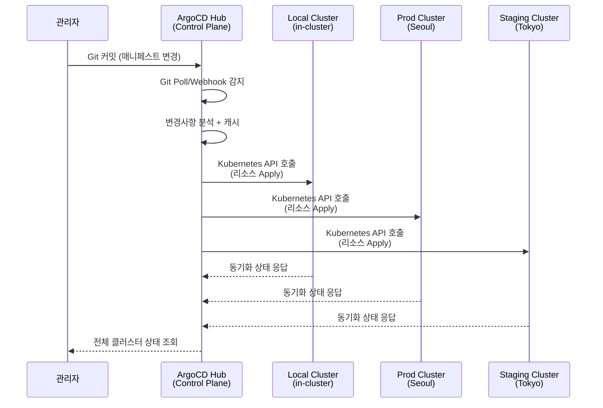
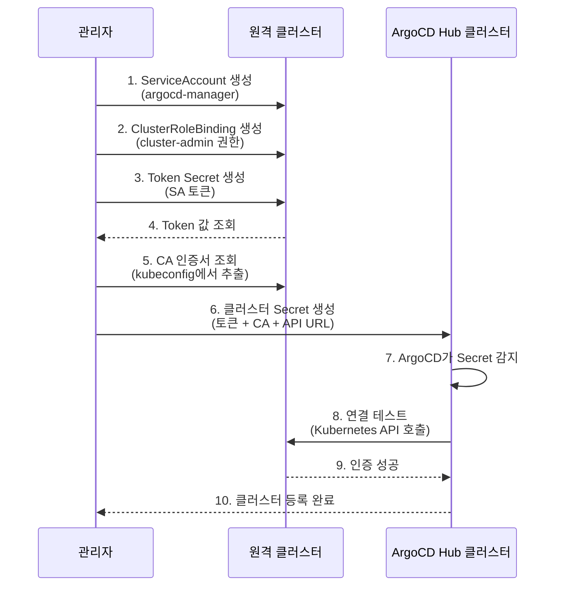
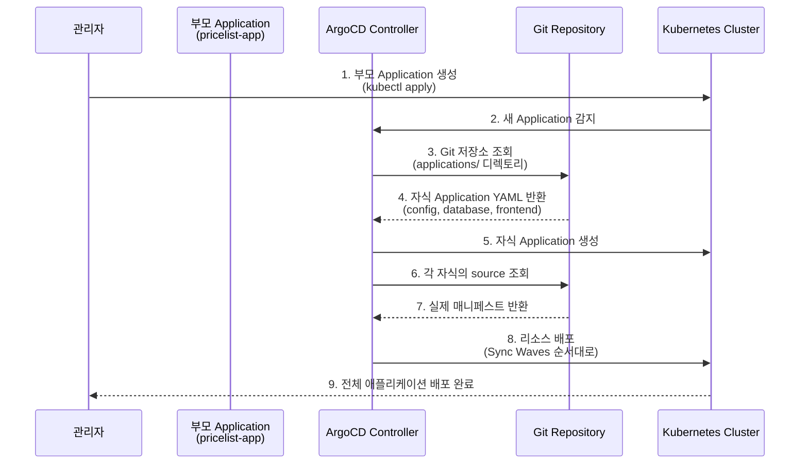
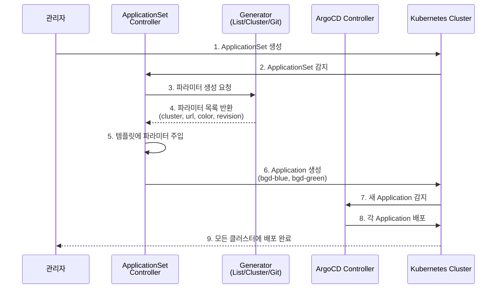

# 07. Cluster Management

---

## 📌 핵심 요약

> ArgoCD는 Hub-and-Spoke 아키텍처로 단일 컨트롤 플레인에서 여러 Kubernetes 클러스터를 중앙 관리합니다. 클러스터 자격증명은 Kubernetes Secret으로 저장되며, CLI 또는 선언적 방식으로 추가할 수 있습니다. 멀티 클러스터 배포는 App-of-Apps, Helm, ApplicationSet 패턴을 통해 구현하며, 각 패턴은 배포 순서 제어, 동적 탐지, 대규모 관리 등 서로 다른 목적에 최적화되어 있습니다.

---

## 🎯 학습 목표

이 내용을 읽고 나면:
- [ ] Hub-and-Spoke 아키텍처에서 중앙 집중식 관리가 필요한 이유를 설명할 수 있다
- [ ] 로컬 클러스터와 원격 클러스터의 정의 방식을 이해할 수 있다
- [ ] CLI와 선언적 방식의 장단점을 비교하여 상황에 맞게 선택할 수 있다
- [ ] App-of-Apps, Helm, ApplicationSet 패턴의 차이점과 사용 시나리오를 설명할 수 있다
- [ ] ApplicationSet의 다양한 Generator를 활용하여 자동화 전략을 수립할 수 있다

---

## 📖 본문 정리

### 1. 클러스터 아키텍처

#### 1.1 Hub-and-Spoke 설계

ArgoCD는 Hub-and-Spoke 아키텍처를 사용하여 여러 클러스터를 중앙에서 관리합니다. 이 아키텍처는 단일 ArgoCD 인스턴스(Hub)가 여러 대상 클러스터(Spoke)를 관리하는 구조입니다.

**왜 Hub-and-Spoke 방식인가?**
- 각 클러스터마다 ArgoCD를 설치하면 관리 오버헤드가 증가합니다 (n개 클러스터 = n개 ArgoCD 인스턴스)
- 중앙 집중식 관리는 정책과 설정을 일관되게 적용할 수 있습니다
- 단일 UI/CLI로 모든 클러스터의 배포 상태를 모니터링할 수 있습니다
- 재해 복구 시 하나의 ArgoCD만 복원하면 모든 클러스터의 애플리케이션을 재배포할 수 있습니다



**실무 시나리오:**

3개 리전(서울/도쿄/싱가포르) 클러스터를 하나의 ArgoCD로 관리할 때, 단일 Git 커밋으로 모든 리전에 동일한 애플리케이션 버전을 배포할 수 있습니다. Hub에서 각 클러스터의 Kubernetes API 엔드포인트로 연결하여 리소스를 Apply하는 Push Model 방식으로 동작합니다.

| 구성 요소 | 설명 |
|----------|------|
| **Hub** | ArgoCD가 설치된 클러스터 (Control Plane) |
| **Spoke** | ArgoCD가 관리하는 대상 클러스터들 |
| **Push Model** | Hub에서 Git 저장소를 감시하고, 변경 발생 시 각 Spoke 클러스터로 리소스를 푸시하는 방식 |

> ⚠️ **네트워크 고려사항**: Hub 클러스터에서 모든 Spoke 클러스터의 Kubernetes API 엔드포인트(기본 6443 포트)로 HTTPS 접근이 가능해야 합니다. 방화벽 규칙, VPN, 또는 Private Network 설정이 필요할 수 있습니다.

---

### 2. 로컬 vs 원격 클러스터

ArgoCD는 로컬 클러스터(ArgoCD가 설치된 클러스터)와 원격 클러스터를 동일한 방식으로 취급합니다. 둘 다 단순히 "배포 대상(destination)"일 뿐이며, 내부적으로는 모두 Kubernetes API를 통해 통신합니다.

**왜 로컬과 원격을 구분하는가?**
- 로컬 클러스터는 ArgoCD가 자신이 실행 중인 클러스터에 배포하는 경우로, 별도의 네트워크 통신 없이 in-cluster 인증을 사용할 수 있습니다
- 원격 클러스터는 명시적으로 자격증명을 제공해야 하며, 네트워크 접근성이 보장되어야 합니다

#### 2.1 로컬 클러스터 (in-cluster)

```yaml
# 로컬 클러스터 참조 방법
spec:
  destination:
    server: https://kubernetes.default.svc  # Kubernetes 내부 DNS
    ## 또는
    # name: in-cluster  # 이름 기반 참조
    namespace: bgd
```

로컬 클러스터는 `https://kubernetes.default.svc`라는 Kubernetes 내부 서비스 DNS를 사용합니다. 이는 클러스터 내부에서 API 서버에 접근하는 표준 방식입니다.

#### 2.2 원격 클러스터

```yaml
# 원격 클러스터 참조 방법
spec:
  destination:
    server: https://cluster1.mydomain.tld:8443  # 외부 API 서버 URL
    ## 또는
    # name: cluster1  # Secret에 정의된 이름
    namespace: bgd
```

원격 클러스터는 외부 네트워크를 통해 접근 가능한 Kubernetes API 서버 URL을 지정합니다.

> **Note**: `namespace`는 대상 네임스페이스를 지정하며, 매니페스트에 `.metadata.namespace`가 설정되지 않은 리소스에만 이 값이 주입됩니다. Namespace 스코프 리소스에 적용되며, ClusterRole 같은 클러스터 레벨 리소스에는 영향을 주지 않습니다.

---

### 3. 클러스터 정의 방법

클러스터 자격 증명은 ArgoCD가 설치된 네임스페이스의 Kubernetes Secret에 저장됩니다. 이 Secret을 통해 ArgoCD는 대상 클러스터의 Kubernetes API에 인증하고 리소스를 관리합니다.

**왜 Secret으로 관리하는가?**
- Kubernetes Secret은 RBAC과 통합되어 접근 제어를 할 수 있습니다
- ArgoCD의 다른 컴포넌트(Application Controller)가 표준 Kubernetes API로 클러스터 정보를 읽을 수 있습니다
- GitOps 원칙에 따라 선언적으로 클러스터를 정의할 수 있습니다

#### 3.1 클러스터 Secret 필드

| 필드 | 필수 | 설명 |
|------|------|------|
| `name` | ✅ | 클러스터 이름 (destination.name에서 참조) |
| `server` | ✅ | Kubernetes API 서버 URL (destination.server에서 참조) |
| `config` | ✅ | JSON 형식의 연결 설정 (인증 토큰, TLS 설정) |
| `namespaces` | ❌ | 이 클러스터에 배포 가능한 네임스페이스 목록 (쉼표 구분, 미지정 시 모든 네임스페이스) |
| `clusterResources` | ❌ | 클러스터 레벨 리소스(ClusterRole, CRD 등) 배포 허용 여부 ("true"/"false") |
| `project` | ❌ | 이 클러스터를 사용할 수 있는 ArgoCD 프로젝트 (미지정 시 모든 프로젝트) |

#### 3.2 클러스터 Secret 예시

```yaml
apiVersion: v1
kind: Secret
metadata:
  name: prod-cluster
  namespace: argocd
  labels:
    argocd.argoproj.io/secret-type: cluster  # ArgoCD가 인식하는 필수 라벨
type: Opaque
stringData:
  name: prod-cluster  # Application에서 destination.name으로 참조
  server: https://prod.k8s.example.com:6443  # API 서버 URL
  config: |
    {
      "bearerToken": "<ServiceAccount 토큰 - 평문>",
      "tlsClientConfig": {
        "insecure": false,
        "caData": "<base64 인코딩된 CA 인증서>"
      }
    }
```

> ⚠️ **인코딩 주의사항**:
> - `bearerToken`: 평문 그대로 입력 (base64 인코딩 하지 않음)
> - `caData`: base64 인코딩 필수 (kubectl에서 추출한 값 그대로 사용)
> - 동일한 클러스터(`server` 값)에 대해 여러 Secret을 생성하면 안 됩니다 (중복 등록 방지)

---

### 4. In-Cluster 설정 커스터마이징

기본적으로 in-cluster는 별도의 Secret 없이 ArgoCD가 자동으로 인식합니다. 하지만 특정 프로젝트만 in-cluster에 배포하도록 제한하거나 네임스페이스를 제한하려면 명시적으로 Secret을 생성해야 합니다.

```bash
# 기본 상태 확인
$ kubectl get secrets -n argocd -l argocd.argoproj.io/secret-type=cluster
No resources found in argocd namespace.
```

**왜 in-cluster를 커스터마이징하는가?**
- 프로덕션 클러스터에서 ArgoCD를 실행할 때, 특정 팀/프로젝트만 같은 클러스터에 배포하도록 제한할 수 있습니다
- 보안 정책상 특정 네임스페이스에만 배포를 허용해야 하는 경우가 있습니다

#### 4.1 기본값

| 항목 | 기본값 |
|------|--------|
| API 엔드포인트 | `https://kubernetes.default.svc` |
| CA 인증서 | Kubernetes 기본 CA (`/var/run/secrets/kubernetes.io/serviceaccount/ca.crt`) |
| 인증 토큰 | `argocd-application-controller` ServiceAccount 토큰 |

#### 4.2 In-Cluster 커스터마이징 예시

특정 프로젝트만 in-cluster에 배포할 수 있도록 제한:

```yaml
# in-cluster-secret.yaml
apiVersion: v1
kind: Secret
metadata:
  name: in-cluster
  namespace: argocd
  labels:
    argocd.argoproj.io/secret-type: cluster
type: Opaque
stringData:
  name: in-cluster
  server: https://kubernetes.default.svc
  project: sysadmin  # sysadmin 프로젝트만 접근 가능
  config: |
    {
      "tlsClientConfig": {
        "insecure": false
      }
    }
```

```bash
# 적용
$ kubectl apply -f in-cluster-secret.yaml

# 확인
$ argocd cluster get in-cluster -o json | jq -r .project
sysadmin
```

이제 `sysadmin` 프로젝트에 속한 Application만 in-cluster를 destination으로 사용할 수 있습니다.

---

### 5. 원격 클러스터 추가

원격 클러스터를 추가하는 방법은 CLI 방식과 선언적 방식 두 가지가 있습니다.

**왜 두 가지 방식을 제공하는가?**
- CLI 방식은 빠른 테스트와 PoC에 적합하며, ArgoCD가 자동으로 ServiceAccount와 권한을 생성합니다
- 선언적 방식은 GitOps 원칙을 따르며, 모든 설정을 Git으로 관리할 수 있어 재현 가능하고 감사(audit) 추적이 가능합니다

#### 5.1 테스트용 원격 클러스터 생성 (kind)

```bash
# 호스트 IP 설정 (외부에서 접근 가능한 IP)
$ export REMOTE_CLUSTER_IP=192.168.4.134

# 별도의 kubeconfig 파일 사용 (기존 컨텍스트와 분리)
$ export KUBECONFIG=~/remote-cluster.config

# kind 클러스터 생성 (API 서버를 특정 IP에 바인딩)
$ kind create cluster --name remote --config - <<EOF
kind: Cluster
apiVersion: kind.x-k8s.io/v1alpha4
networking:
  apiServerAddress: "${REMOTE_CLUSTER_IP}"
EOF

# 기존 컨텍스트로 복귀
$ unset KUBECONFIG
```

#### 5.2 CLI로 클러스터 추가

```bash
# ArgoCD 로그인
$ argocd login --insecure --grpc-web --username admin \
  --password $(kubectl -n argocd get secret argocd-initial-admin-secret \
  -o jsonpath="{.data.password}" | base64 -d) argocd.upandrunning.local

# 현재 등록된 클러스터 목록
$ argocd cluster list
SERVER                          NAME        VERSION  STATUS      MESSAGE  PROJECT
https://kubernetes.default.svc  in-cluster  1.29     Successful

# 원격 클러스터 추가
$ argocd cluster add kind-remote --yes \
  --kubeconfig ~/remote-cluster.config --name remote
```

**CLI 옵션 설명:**

| 옵션 | 설명 |
|------|------|
| `kind-remote` | kubeconfig 내 Kubernetes context 이름 |
| `--yes` | 확인 프롬프트 없이 진행 |
| `--name` | ArgoCD에서 사용할 클러스터 이름 (destination.name으로 참조) |

> **Note**: ArgoCD CLI는 대상 클러스터의 `kube-system` 네임스페이스에 `argocd-manager` ServiceAccount와 ClusterRoleBinding(cluster-admin 권한)을 자동 생성합니다. 이는 ArgoCD가 모든 리소스를 관리할 수 있도록 하기 위함입니다.

```bash
# 클러스터 삭제
$ argocd cluster rm --yes remote
```

#### 5.3 선언적 방식으로 클러스터 추가

선언적 방식은 모든 설정을 YAML로 정의하여 Git으로 관리할 수 있습니다. 이 방식은 GitOps 원칙을 완전히 준수하며, 여러 클러스터를 일관되게 관리할 수 있습니다.



**Step 1: ServiceAccount 생성**

```bash
$ kubectl create --kubeconfig ~/remote-cluster.config \
  sa -n kube-system argocd-manager
```

ArgoCD가 사용할 ServiceAccount를 생성합니다. 이 계정으로 클러스터를 관리합니다.

**Step 2: ClusterRoleBinding 생성**

```bash
$ kubectl create --kubeconfig ~/remote-cluster.config \
  clusterrolebinding argocd-manager-role-binding \
  --clusterrole=cluster-admin --serviceaccount=kube-system:argocd-manager
```

ServiceAccount에 cluster-admin 권한을 부여합니다. 프로덕션에서는 최소 권한 원칙에 따라 필요한 권한만 부여하는 커스텀 ClusterRole을 생성하는 것이 좋습니다.

**Step 3: Token 생성 및 획득**

```bash
# Token Secret 생성 (Kubernetes 1.24+ 필수)
$ kubectl apply --kubeconfig ~/remote-cluster.config -f - <<EOF
apiVersion: v1
kind: Secret
metadata:
  name: argocd-manager-token
  namespace: kube-system
  annotations:
    kubernetes.io/service-account.name: argocd-manager
type: kubernetes.io/service-account-token
EOF

# Token 추출
$ TOKEN=$(kubectl get secret --kubeconfig ~/remote-cluster.config \
  -n kube-system argocd-manager-token \
  -o jsonpath='{.data.token}' | base64 -d)
```

Kubernetes 1.24 이상에서는 ServiceAccount 토큰이 자동 생성되지 않으므로 명시적으로 Secret을 생성해야 합니다.

**Step 4: 클러스터 Secret 생성**

```bash
$ cat <<EOF | kubectl apply -n argocd -f -
apiVersion: v1
kind: Secret
metadata:
  name: remote
  labels:
    argocd.argoproj.io/secret-type: cluster
type: Opaque
stringData:
  name: remote
  server: $(kubectl config view --kubeconfig ~/remote-cluster.config \
    -o jsonpath='{.clusters[?(@.name == "kind-remote")].cluster.server}')
  config: |
    {
      "bearerToken": "${TOKEN}",
      "tlsClientConfig": {
        "insecure": false,
        "caData": "$(kubectl config view --raw --kubeconfig ~/remote-cluster.config \
          -o jsonpath='{.clusters[?(@.name == "kind-remote")].cluster.certificate-authority-data}')"
      }
    }
EOF
```

**실무 시나리오:**

프로덕션 환경에서는 Secret을 Git에 평문으로 저장하면 안 되므로, External Secrets Operator(ESO)와 AWS Secrets Manager 또는 HashiCorp Vault를 연동하여 토큰을 안전하게 관리합니다.

---

### 6. 멀티 클러스터 배포 전략

ArgoCD Application은 단일 클러스터만 destination으로 지정할 수 있습니다. 여러 클러스터에 동일한 애플리케이션을 배포하려면 다음 세 가지 패턴 중 하나를 사용해야 합니다.

**왜 Application은 단일 클러스터만 지원하는가?**
- Application은 특정 클러스터의 특정 네임스페이스를 대상으로 하는 배포 단위입니다
- 멀티 클러스터 배포는 여러 Application을 조합하거나 자동 생성하는 방식으로 구현합니다
- 이 설계는 각 클러스터별로 독립적인 동기화 상태와 헬스 체크를 가능하게 합니다

#### 6.1 App-of-Apps 패턴

App-of-Apps는 ArgoCD Application 리소스 자체를 배포하는 Application입니다. 부모 Application이 여러 자식 Application을 생성하는 계층 구조입니다.

**왜 App-of-Apps를 사용하는가?**
- Sync Waves와 Sync Phases를 활용하여 배포 순서를 세밀하게 제어할 수 있습니다 (예: Database → Backend → Frontend 순서)
- 전체 시스템을 단일 Application으로 부트스트랩하거나 재해 복구할 수 있습니다
- 논리적으로 연관된 애플리케이션을 그룹화하여 관리할 수 있습니다



```yaml
# pricelist-app-of-apps.yaml (부모 Application)
apiVersion: argoproj.io/v1alpha1
kind: Application
metadata:
  name: pricelist-app
  namespace: argocd
spec:
  project: default
  source:
    repoURL: https://github.com/example/pricelist-apps
    path: applications  # 여러 Application YAML이 있는 디렉토리
    targetRevision: HEAD
  destination:
    server: https://kubernetes.default.svc
    namespace: argocd  # Application 리소스는 argocd 네임스페이스에 생성
```

```bash
# 적용
$ kubectl apply -n argocd -f ch07/pricelist-app-of-apps.yaml

# 생성된 Application 확인
$ kubectl get applications -n argocd
NAME                 SYNC STATUS   HEALTH STATUS
pricelist-app        Synced        Healthy
pricelist-config     Synced        Healthy
pricelist-database   Synced        Healthy
pricelist-frontend   Synced        Healthy
```

**장점:**
- Sync Waves로 배포 순서 제어 가능 (예: database가 wave 0, backend가 wave 1, frontend가 wave 2)
- 전체 시스템을 하나의 부모 Application으로 재배포/롤백 가능
- 논리적으로 연관된 애플리케이션을 그룹화하여 관리 용이

**실무 시나리오:**

마이크로서비스 아키텍처에서 Config → Database → Backend → Frontend 순서로 배포해야 할 때, 각 단계를 Sync Wave로 정의하여 의존성 순서를 보장할 수 있습니다.

#### 6.2 Helm을 사용한 Application 템플릿

Helm 차트로 Application 리소스를 템플릿화하여 destination을 파라미터로 주입할 수 있습니다.

**왜 Helm 템플릿을 사용하는가?**
- 레거시 프로젝트에서 이미 Helm을 사용 중인 경우 기존 도구를 재활용할 수 있습니다
- Values 파일로 환경별 설정을 오버라이드할 수 있습니다

```yaml
# Helm 템플릿으로 destination 파라미터화
apiVersion: argoproj.io/v1alpha1
kind: Application
metadata:
  name: guestbook
  namespace: argocd
  finalizers:
  - resources-finalizer.argocd.argoproj.io
spec:
  destination:
    namespace: argocd
    server: {{ .Values.spec.destination.server }}  # Values 파일에서 주입
  project: default
  source:
    path: guestbook
    repoURL: https://github.com/argoproj/argocd-example-apps
    targetRevision: HEAD
```

**Values 파일:**

```yaml
# values-prod.yaml
spec:
  destination:
    server: https://prod.k8s.example.com:6443

# values-staging.yaml
spec:
  destination:
    server: https://staging.k8s.example.com:6443
```

> 💡 **권장사항**: 신규 프로젝트는 ApplicationSet 사용을 권장합니다. Helm 방식은 레거시 호환성이 필요한 경우에만 사용하세요. ApplicationSet은 더 강력한 자동화 기능을 제공합니다.

#### 6.3 ApplicationSet

ApplicationSet은 Generator를 통해 파라미터를 동적으로 생성하고, 이를 기반으로 여러 ArgoCD Application을 자동 생성하는 CRD입니다.

**왜 ApplicationSet을 사용하는가?**
- 수동으로 Application을 여러 개 생성할 필요가 없습니다 (예: 10개 클러스터 → 10개 Application 자동 생성)
- Git 저장소 구조나 클러스터 목록이 변경되면 자동으로 Application이 추가/삭제됩니다
- Cluster Generator는 ArgoCD에 등록된 클러스터를 자동 탐지하여 Application을 생성합니다



**Generator 유형:**

| Generator | 설명 | 사용 사례 |
|-----------|------|----------|
| **List** | 고정된 key/value 쌍 목록 | 명시적 클러스터 목록 (dev, staging, prod) |
| **Cluster** | ArgoCD에 등록된 클러스터 기반 | 클러스터 추가 시 자동 Application 생성 |
| **Git** | Git 저장소 구조/설정 파일 기반 | 디렉토리당 환경 분리 (environments/dev, environments/prod) |
| **Matrix** | 두 Generator 조합 | 환경(dev/prod) × 리전(ap-northeast-2/ap-northeast-1) 조합 |
| **Merge** | 여러 Generator 병합 | 기본값 Generator + 환경별 오버라이드 Generator |
| **SCM Provider** | GitHub/GitLab 조직의 저장소 탐색 | 대규모 조직에서 수백 개 저장소 자동 관리 |
| **Pull Request** | PR 자동 탐지 | PR마다 임시 프리뷰 환경 생성 |
| **Cluster Decision Resource** | 커스텀 리소스 기반 결정 로직 | 복잡한 배포 정책 (예: 특정 라벨을 가진 클러스터에만 배포) |
| **Plugin** | 커스텀 Generator | 외부 API 연동 등 특수 요구사항 |

**List Generator 예시:**

```yaml
# appset-bgd.yaml
apiVersion: argoproj.io/v1alpha1
kind: ApplicationSet
metadata:
  name: bgd
  namespace: argocd
spec:
  generators:
  - list:
      elements:
      - cluster: in-cluster
        url: https://kubernetes.default.svc
        color: blue
        revision: blue
      - cluster: remote
        url: https://192.168.1.254:38187
        color: green
        revision: green
  template:
    metadata:
      name: 'bgd-{{color}}'  # 파라미터 주입: bgd-blue, bgd-green
    spec:
      project: default
      source:
        repoURL: https://github.com/example/bgd
        targetRevision: '{{revision}}'
        path: overlays/{{color}}
      destination:
        server: '{{url}}'
        namespace: bgd
```

```bash
# 적용
$ kubectl apply -n argocd -f ch07/appset-bgd.yaml

# 생성된 리소스 확인
$ kubectl get applicationsets -n argocd
NAME   AGE
bgd    29s

$ kubectl get applications -n argocd
NAME        SYNC STATUS   HEALTH STATUS
bgd-blue    Synced        Healthy
bgd-green   Synced        Healthy
```

ApplicationSet 하나로 두 개의 Application이 자동 생성되었습니다. 클러스터가 추가되면 elements에 항목만 추가하면 자동으로 새 Application이 생성됩니다.

**실무 시나리오:**

3개 리전(서울/도쿄/싱가포르) 클러스터에 동일한 애플리케이션을 배포할 때, Cluster Generator를 사용하면 ArgoCD에 새 클러스터를 추가하는 순간 자동으로 해당 클러스터에 Application이 생성됩니다. 수동으로 Application 3개를 만들 필요가 없습니다.

---

### 7. 패턴 비교

세 가지 패턴은 각각 다른 목적에 최적화되어 있습니다.

| 항목 | App-of-Apps | Helm | ApplicationSet |
|------|-------------|------|----------------|
| **Sync Waves/Phases** | ✅ 완전 지원 | ✅ 지원 | ⚠️ Alpha (Progressive Syncs) |
| **동적 클러스터 탐지** | ❌ | ❌ | ✅ (Cluster Generator) |
| **Git 구조 기반 배포** | ❌ | ❌ | ✅ (Git Generator) |
| **부트스트랩/복구** | ✅ 적합 | ⚠️ 가능 | ⚠️ 가능 |
| **권장 사용 시나리오** | 배포 순서 제어 필요 | 레거시 호환 | 대규모 자동화 |

**왜 이런 차이가 있는가?**
- **App-of-Apps**는 Sync Waves를 완전히 지원하므로 복잡한 배포 순서 제어가 필요한 경우 최선입니다
- **ApplicationSet**은 동적 생성에 특화되어 있지만 Sync Waves는 아직 Alpha 단계입니다
- **Helm**은 기존 도구를 활용하는 과도기적 방식입니다

---

## 🔍 심화 학습

### External Secrets Operator

GitOps 원칙에 따라 클러스터 Secret을 관리할 때, 평문 토큰을 Git에 저장하는 것은 보안 위험입니다. External Secrets Operator(ESO)를 사용하여 외부 시크릿 관리 시스템과 연동할 수 있습니다.

**왜 ESO를 사용하는가?**
- Git에는 시크릿 참조만 저장하고 실제 토큰은 AWS Secrets Manager 같은 안전한 곳에 보관합니다
- 토큰 로테이션 시 Git 커밋 없이 외부 시스템에서만 변경하면 됩니다
- 접근 권한과 감사 로그를 중앙에서 관리할 수 있습니다

| 백엔드 | 설명 |
|--------|------|
| AWS Secrets Manager | AWS 네이티브 시크릿 관리 서비스 |
| HashiCorp Vault | 범용 시크릿 관리 플랫폼 |
| Azure Key Vault | Azure 네이티브 키 관리 서비스 |
| Google Secret Manager | GCP 네이티브 시크릿 관리 서비스 |

### Progressive Syncs (Alpha)

ApplicationSet에서 Sync Waves/Phases를 지원하기 위한 알파 기능입니다. 여러 Application을 단계적으로 배포할 수 있습니다.

**왜 Progressive Syncs가 필요한가?**
- ApplicationSet으로 생성된 수십 개의 Application을 동시에 배포하면 클러스터에 부하가 걸립니다
- 개발 환경부터 배포하여 검증한 후 프로덕션으로 진행하는 단계적 배포가 필요합니다

```yaml
# Progressive Syncs 예시
spec:
  strategy:
    type: RollingSync
    rollingSync:
      steps:
      - matchExpressions:
        - key: envLabel
          operator: In
          values:
          - dev  # 1단계: dev 환경 먼저 배포
      - matchExpressions:
        - key: envLabel
          operator: In
          values:
          - staging  # 2단계: staging 환경 (최대 50%씩)
        maxUpdate: 50%
      - matchExpressions:
        - key: envLabel
          operator: In
          values:
          - prod  # 3단계: prod 환경 (한 번에 1개씩)
        maxUpdate: 1
```

### 출처
- [Argo CD Cluster Credentials](https://argo-cd.readthedocs.io/en/stable/operator-manual/declarative-setup/#clusters)
- [ApplicationSet Documentation](https://argo-cd.readthedocs.io/en/stable/operator-manual/applicationset/)
- [External Secrets Operator](https://external-secrets.io/)

---

## 💡 실무 적용 포인트

### 클러스터 추가 방법 선택 가이드

| 상황 | 권장 방법 | 이유 |
|------|----------|------|
| 빠른 테스트/PoC | CLI (`argocd cluster add`) | ServiceAccount와 권한을 자동 생성하여 즉시 사용 가능합니다 |
| GitOps 원칙 준수 | 선언적 (Kubernetes Secret + ESO) | 모든 설정을 Git으로 관리하여 재현 가능하고 감사 추적이 가능합니다 |
| Kubernetes API 접근 불가 | CLI (ArgoCD RBAC 사용) | ArgoCD의 권한으로 대신 생성할 수 있습니다 |
| 대규모 클러스터 관리 | ApplicationSet + Cluster Generator | 클러스터 추가 시 자동으로 Application이 생성됩니다 |

### 멀티 클러스터 배포 전략 선택

| 요구사항 | 권장 패턴 | 이유 |
|----------|----------|------|
| 배포 순서 제어 필요 | App-of-Apps + Sync Waves | Database → Backend → Frontend 같은 순서를 보장할 수 있습니다 |
| 클러스터 자동 탐지 | ApplicationSet (Cluster Generator) | ArgoCD에 등록된 모든 클러스터에 자동 배포됩니다 |
| PR 기반 프리뷰 환경 | ApplicationSet (Pull Request Generator) | PR마다 임시 환경을 자동 생성/삭제합니다 |
| 조직 전체 저장소 관리 | ApplicationSet (SCM Provider Generator) | GitHub Organization의 모든 저장소를 자동 탐지합니다 |
| 레거시 Helm 차트 활용 | App-of-Apps + Helm | 기존 Helm 인프라를 재활용할 수 있습니다 |

### 주의할 점 / 흔한 실수

- ⚠️ **클러스터당 하나의 Secret만**: 동일한 `server` URL을 가진 Secret을 여러 개 생성하면 충돌이 발생합니다
- ⚠️ **bearerToken 인코딩**: `bearerToken`은 평문으로 입력하고, `caData`는 base64 인코딩된 값을 사용해야 합니다
- ⚠️ **라벨 필수**: `argocd.argoproj.io/secret-type: cluster` 라벨이 없으면 ArgoCD가 인식하지 못합니다
- ⚠️ **방화벽 고려**: Hub 클러스터에서 모든 Spoke 클러스터의 Kubernetes API 엔드포인트(기본 6443 포트)로 접근할 수 있어야 합니다
- ⚠️ **Secret 저장 주의**: Git에 평문 토큰을 저장하면 안 됩니다. External Secrets Operator 같은 시크릿 관리 솔루션을 사용하세요
- ⚠️ **ApplicationSet Sync Waves**: Progressive Syncs는 현재 Alpha 상태입니다. 프로덕션에서 배포 순서 제어가 중요하다면 App-of-Apps를 사용하세요

### 면접에서 나올 수 있는 질문

**Q: ArgoCD의 Hub-and-Spoke 아키텍처에서 "Push Model"이란 무엇인가요?**

A: Hub-and-Spoke 아키텍처는 단일 ArgoCD 인스턴스(Hub)가 여러 Kubernetes 클러스터(Spoke)를 관리하는 구조입니다. Push Model은 Hub에서 Git 저장소를 모니터링하고, 변경 사항이 발생하면 Hub가 각 Spoke 클러스터의 Kubernetes API를 호출하여 리소스를 직접 배포하는 방식입니다. 이는 각 클러스터에서 Pull하는 방식과 달리 중앙에서 모든 배포를 제어할 수 있다는 장점이 있습니다.

**Q: 클러스터 Secret에서 `bearerToken`과 `caData`의 인코딩 차이는 무엇인가요?**

A: `bearerToken`은 평문으로 입력해야 하고, `caData`는 base64 인코딩된 값을 사용해야 합니다. Kubernetes Secret의 `stringData` 필드는 자동으로 base64 인코딩을 수행하므로 토큰은 평문 그대로 입력하지만, CA 인증서는 이미 kubeconfig에 base64로 인코딩된 상태이므로 그 값을 그대로 사용합니다.

**Q: App-of-Apps 패턴과 ApplicationSet의 차이점은 무엇인가요?**

A: App-of-Apps는 Application 안에 다른 Application을 포함하는 계층 구조로, Sync Waves를 활용하여 배포 순서를 세밀하게 제어할 수 있습니다. 반면 ApplicationSet은 Generator를 통해 여러 Application을 동적으로 생성하는 방식으로, 클러스터 자동 탐지나 Git 저장소 구조 기반 배포 같은 자동화에 강점이 있습니다. App-of-Apps는 부트스트랩과 복잡한 배포 순서 제어에 적합하고, ApplicationSet은 대규모 멀티 클러스터 자동 관리에 적합합니다.

**Q: ApplicationSet의 Generator 종류와 각각의 사용 사례는 무엇인가요?**

A: List Generator는 고정된 클러스터 목록을 명시적으로 정의할 때 사용하고, Cluster Generator는 ArgoCD에 등록된 클러스터를 자동 탐지하여 Application을 생성합니다. Git Generator는 Git 저장소의 디렉토리 구조나 설정 파일을 기반으로 환경을 분리할 때 사용하며, Pull Request Generator는 PR마다 프리뷰 환경을 자동 생성합니다. Matrix Generator는 환경과 리전 같은 두 차원을 조합할 때 사용합니다.

**Q: in-cluster에 특정 프로젝트만 배포하도록 제한하려면 어떻게 해야 하나요?**

A: in-cluster는 기본적으로 모든 프로젝트가 접근할 수 있습니다. 특정 프로젝트로 제한하려면 `argocd.argoproj.io/secret-type: cluster` 라벨을 가진 Secret을 생성하고, `project` 필드에 허용할 프로젝트 이름을 지정해야 합니다. 예를 들어 `project: sysadmin`으로 설정하면 sysadmin 프로젝트에 속한 Application만 in-cluster를 destination으로 사용할 수 있습니다.

---

## ✅ 핵심 개념 체크리스트

- [ ] Hub-and-Spoke 아키텍처가 중앙 집중식 관리를 가능하게 하는 이유를 설명할 수 있는가?
- [ ] 클러스터 Secret의 필수 필드(`name`, `server`, `config`)와 라벨(`argocd.argoproj.io/secret-type: cluster`)을 이해했는가?
- [ ] CLI 방식과 선언적 방식의 장단점을 비교하여 상황에 맞게 선택할 수 있는가?
- [ ] in-cluster 설정을 커스터마이징하여 특정 프로젝트나 네임스페이스로 제한하는 방법을 알고 있는가?
- [ ] App-of-Apps는 배포 순서 제어, ApplicationSet은 자동화에 적합한 이유를 설명할 수 있는가?
- [ ] ApplicationSet의 다양한 Generator(List, Cluster, Git, Pull Request 등)를 상황에 맞게 선택할 수 있는가?
- [ ] 각 패턴의 적합한 사용 시나리오를 구분할 수 있는가?

---

## 🔗 참고 자료

- 📄 공식 문서: [Cluster Management](https://argo-cd.readthedocs.io/en/stable/operator-manual/declarative-setup/#clusters)
- 📄 ApplicationSet: [ApplicationSet Controller](https://argo-cd.readthedocs.io/en/stable/operator-manual/applicationset/)
- 📄 App-of-Apps: [Cluster Bootstrapping](https://argo-cd.readthedocs.io/en/stable/operator-manual/cluster-bootstrapping/)
- 📄 Generators: [ApplicationSet Generators](https://argo-cd.readthedocs.io/en/stable/operator-manual/applicationset/Generators/)
- 📄 Progressive Syncs: [Progressive Syncs (Alpha)](https://argo-cd.readthedocs.io/en/stable/operator-manual/applicationset/Progressive-Syncs/)
- 🔐 External Secrets: [External Secrets Operator](https://external-secrets.io/)

---
