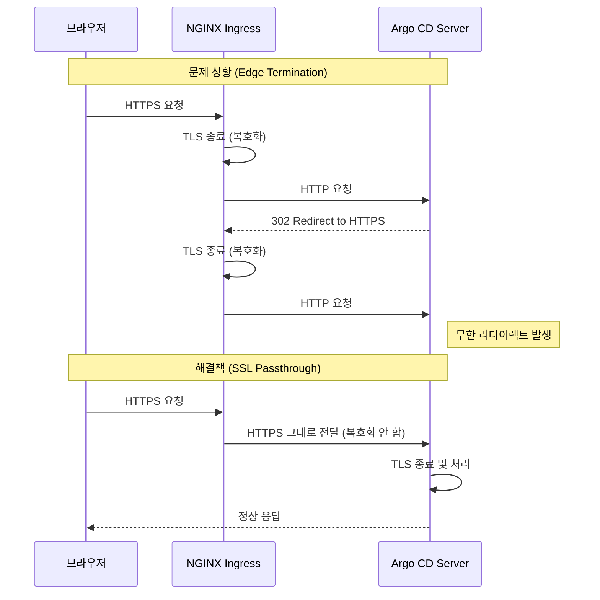
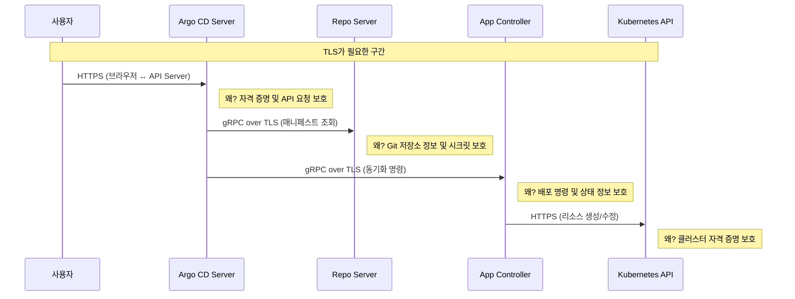
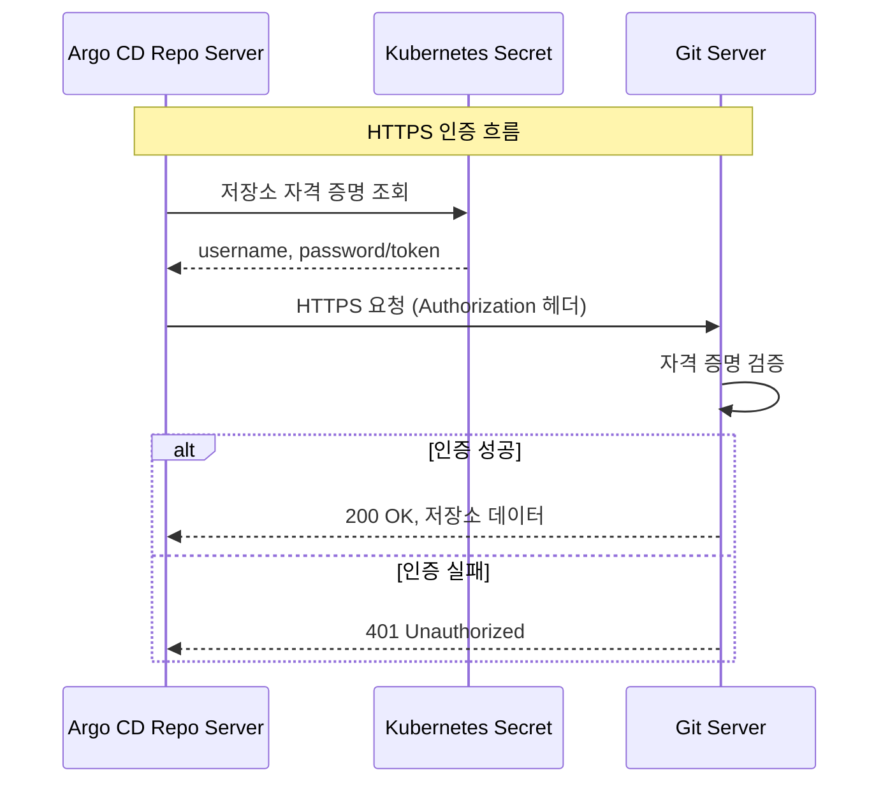
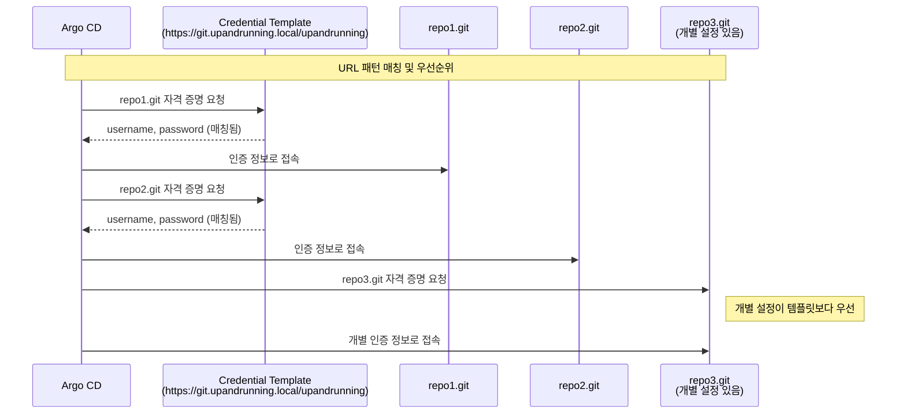
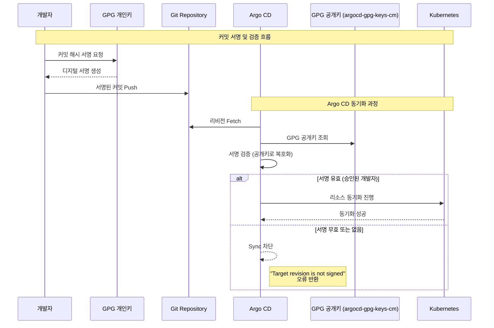
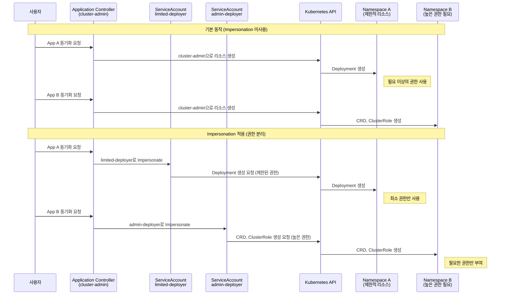

# 09. Security

---

## 📌 핵심 요약

Argo CD의 보안 강화는 여러 계층에서 이루어집니다. TLS 인증서를 통해 모든 통신을 암호화하고, 저장소 접근에는 HTTPS 또는 SSH 인증을 적용하여 무단 접근을 차단합니다. GnuPG 서명 검증은 커밋의 무결성을 보장하며, Application Sync Impersonation은 각 애플리케이션에 필요한 최소 권한만 부여합니다. 이러한 보안 메커니즘들은 엔터프라이즈 환경에서 GitOps 워크플로우를 안전하게 운영하기 위한 필수 요소입니다.

---

## 🎯 학습 목표

이 내용을 읽고 나면:
- [ ] Argo CD 서버의 TLS 인증서를 구성하고 왜 필요한지 설명할 수 있다
- [ ] NGINX Ingress Controller와 SSL Passthrough의 차이점을 이해하고 설정할 수 있다
- [ ] HTTPS 및 SSH 기반의 저장소 인증을 구성하고 각 방식의 장단점을 설명할 수 있다
- [ ] Credential Templates을 활용하여 저장소 인증을 재사용할 수 있다
- [ ] GnuPG 서명 검증의 필요성을 이해하고 커밋 무결성을 강제할 수 있다
- [ ] Application Sync Impersonation을 통해 세분화된 권한을 적용하고 왜 이것이 보안에 중요한지 설명할 수 있다

---

## 📖 본문 정리

### 1. Argo CD 보안 강화

#### 1.1 보안이 필요한 이유

Argo CD는 클러스터 전체를 관리할 수 있는 강력한 권한을 가지고 있습니다. 만약 Argo CD가 침해되면 공격자는 모든 애플리케이션의 배포를 조작하거나, 민감한 데이터를 탈취하거나, 악성 코드를 삽입할 수 있습니다. 따라서 다층 방어(defense in depth) 전략을 통해 각 계층에서 보안을 강화해야 합니다.

#### 1.2 보안 체크리스트

보안 강화는 다음 다섯 가지 영역에서 수행됩니다.

| 영역 | 목적 | 위협 완화 |
|------|------|----------|
| **Admin 계정 관리** | 초기 비밀번호 변경, 불필요한 계정 비활성화 | 기본 자격 증명 공격 방지 |
| **TLS 암호화** | 모든 통신 구간에서 암호화 적용 | 중간자 공격(MITM) 방지 |
| **저장소 보안** | HTTPS/SSH 인증으로 저장소 접근 제어 | 무단 저장소 접근 방지 |
| **서명 검증** | GPG 서명으로 커밋 무결성 확인 | 악성 커밋 삽입 방지 |
| **Impersonation** | 애플리케이션별 최소 권한 부여 | 권한 남용 및 측면 이동 방지 |

#### 1.3 Admin 사용자 보안

Argo CD는 설치 시 `admin` 계정과 랜덤 비밀번호를 생성합니다. 이 비밀번호는 `argocd-initial-admin-secret` Secret에 저장되며, 누구나 접근 가능하므로 즉시 변경해야 합니다.

| 작업 | 설명 | 우선순위 |
|------|------|----------|
| 비밀번호 변경 | `argocd account update-password`로 비밀번호 변경 | 🔴 필수 |
| Secret 삭제 | `kubectl delete secret argocd-initial-admin-secret -n argocd` | 🔴 필수 |
| 계정 비활성화 | SSO 사용 시 `argocd-cm`에서 `admin.enabled: "false"` 설정 | 🟡 권장 |

---

### 2. TLS 인증서 구성

#### 2.1 TLS가 필요한 이유

TLS(Transport Layer Security)는 클라이언트와 서버 간의 모든 통신을 암호화하여 중간자 공격을 방지합니다. Argo CD는 기본적으로 `--insecure` 플래그로 배포되는데, 이는 HTTP로 통신하므로 네트워크 상에서 자격 증명과 민감한 데이터가 평문으로 노출됩니다. 프로덕션 환경에서는 반드시 TLS를 활성화해야 합니다.

#### 2.2 --insecure 플래그 제거

기본 배포 시 Argo CD 서버는 `--insecure` 옵션으로 TLS 없이 통신합니다. 프로덕션에서는 이를 제거해야 합니다.

```yaml
# values-argocd-secure.yaml
server:
  extraArgs: []  # --insecure 제거
  ingress:
    enabled: true
    annotations:
      nginx.ingress.kubernetes.io/ssl-passthrough: "true"
      nginx.ingress.kubernetes.io/force-ssl-redirect: "true"
```

#### 2.3 SSL Passthrough가 필요한 이유

`--insecure` 플래그를 제거하면 "Too many redirects" 오류가 발생할 수 있습니다. 이는 NGINX Ingress가 기본적으로 Edge Termination 방식을 사용하기 때문입니다. Edge Termination에서는 Ingress가 TLS를 종료하고 백엔드로 HTTP 요청을 전달하는데, Argo CD 서버는 HTTPS를 기대하므로 계속 리다이렉트를 반환하여 무한 루프에 빠집니다. SSL Passthrough를 사용하면 TLS 연결이 Argo CD 서버까지 그대로 전달되어 end-to-end 암호화가 가능합니다.



**NGINX Ingress Controller 설정:**

```yaml
# values-ingress-nginx-ssl-passthrough.yaml
controller:
  extraArgs:
    enable-ssl-passthrough: true  # SSL passthrough 활성화
```

```bash
# NGINX 업그레이드
$ helm upgrade -n ingress-nginx ingress-nginx ingress-nginx/ingress-nginx \
  -f values-ingress-nginx-ssl-passthrough.yaml
```

#### 2.4 컴포넌트 간 TLS 통신이 필요한 이유

Argo CD는 여러 컴포넌트로 구성되어 있으며, 각 컴포넌트 간 통신도 암호화되어야 합니다. 예를 들어, API Server와 Application Controller 간 통신이 평문이면 클러스터 내부 공격자가 패킷을 스니핑하여 민감한 정보를 탈취할 수 있습니다.



#### 2.5 커스텀 TLS 인증서 생성

프로덕션 환경에서는 신뢰할 수 있는 CA에서 발급한 인증서를 사용해야 하지만, 내부 환경에서는 자체 서명 인증서를 사용할 수 있습니다.

**Step 1: Root CA 인증서 생성**

Root CA는 다른 인증서를 서명할 수 있는 최상위 인증서입니다.

```bash
openssl req -nodes -x509 -sha256 -newkey rsa:4096 \
  -keyout root.key \
  -out root.crt \
  -days 365 \
  -subj "/O=O'Reilly Media/CN=Argo CD: Up and Running Root CA" \
  -extensions v3_ca \
  -config <( \
  echo '[req]'; \
  echo 'distinguished_name=req'; \
  echo 'extensions=v3_ca'; \
  echo 'req_extensions=v3_ca'; \
  echo '[v3_ca]'; \
  echo 'keyUsage=critical,keyCertSign,digitalSignature,keyEncipherment'; \
  echo 'basicConstraints=CA:TRUE')
```

**Step 2: Argo CD 서버 인증서 생성**

서버 인증서는 Root CA로 서명되며, SubjectAltName(SAN)에 서버의 도메인 이름을 포함해야 합니다.

```bash
openssl req -nodes -x509 -sha256 -newkey rsa:4096 \
  -keyout argocd.key \
  -out argocd.crt \
  -days 365 \
  -subj "/O=O'Reilly Media/CN=argocd.upandrunning.local" \
  -extensions v3_ca \
  -CA root.crt \
  -CAkey root.key \
  -config <( \
  echo '[req]'; \
  echo 'distinguished_name=req'; \
  echo 'extensions=v3_ca'; \
  echo 'req_extensions=v3_ca'; \
  echo '[v3_ca]'; \
  echo 'keyUsage=critical,digitalSignature,keyEncipherment'; \
  echo 'subjectAltName=DNS:argocd.upandrunning.local'; \
  echo 'extendedKeyUsage=serverAuth'; \
  echo 'basicConstraints=CA:FALSE')
```

**Step 3: Secret 생성**

```bash
# 인증서 체인 생성 (서버 인증서 + Root CA)
$ cat argocd.crt root.crt > argocd-fullchain.crt

# argocd-server-tls Secret 생성
$ kubectl create -n argocd secret tls argocd-server-tls \
  --cert=argocd-fullchain.crt \
  --key=argocd.key
```

Argo CD 서버는 `argocd-server-tls` Secret을 자동으로 감지하고 인증서를 로드합니다. 인증서 체인을 사용하는 이유는 클라이언트가 서버 인증서의 유효성을 Root CA까지 추적하여 검증할 수 있도록 하기 위함입니다.

---

### 3. 저장소 접근 보안

#### 3.1 Gitea 배포 (자체 호스팅 Git 서버)

실습을 위해 Kubernetes 클러스터 내에 Gitea를 배포합니다. Gitea는 경량 Git 서버로, 자체 서명 인증서를 사용한 HTTPS와 SSH 접근을 지원합니다.

```bash
# Gitea Helm 저장소 추가
$ helm repo add gitea-charts https://dl.gitea.com/charts/
$ helm repo update

# TLS 인증서 생성 및 Secret 생성
$ kubectl create namespace gitea
$ kubectl create secret tls -n gitea git-server-certificate \
  --cert=git-fullchain.crt --key=git.key

# Gitea 설치
$ helm upgrade -i --create-namespace -n gitea gitea ch09/helm/charts/gitea \
  -f ch09/helm/values/values-gitea.yaml
```

#### 3.2 TLS 저장소 인증서 구성이 필요한 이유

Argo CD가 HTTPS를 통해 Git 저장소에 접속할 때, 저장소가 자체 서명 인증서를 사용하면 신뢰할 수 없는 인증서로 간주되어 연결이 실패합니다. 따라서 Argo CD가 해당 인증서를 신뢰하도록 명시적으로 등록해야 합니다. 이는 운영 체제의 신뢰할 수 있는 CA 저장소에 인증서를 추가하는 것과 같은 원리입니다.

**UI에서 설정:**
1. Settings → Repository certificates and known hosts
2. Add TLS Certificate 클릭
3. Repository Server Name: `git.upandrunning.local`
4. TLS Certificate (PEM Format): 인증서 내용 붙여넣기

**CLI로 설정:**

```bash
# 인증서 목록 조회
$ argocd cert list

# 인증서 추가
$ argocd cert add-tls git.upandrunning.local --from git-fullchain.crt

# 인증서 제거
$ argocd cert rm git.upandrunning.local
```

**선언적 설정 (ConfigMap):**

```yaml
apiVersion: v1
kind: ConfigMap
metadata:
  name: argocd-tls-certs-cm
  namespace: argocd
data:
  git.upandrunning.local: |
    -----BEGIN CERTIFICATE-----
    <인증서 내용>
    -----END CERTIFICATE-----
```

---

### 4. 보호된 저장소 인증

#### 4.1 인증이 필요한 이유

공개 저장소와 달리 비공개 저장소는 자격 증명 없이 접근할 수 없습니다. Argo CD는 HTTPS 또는 SSH를 통해 저장소에 접근하며, 각 방식은 서로 다른 인증 메커니즘을 사용합니다. 인증 정보는 Kubernetes Secret으로 저장되며, Argo CD Repo Server가 이를 사용하여 Git 저장소를 클론합니다.

#### 4.2 HTTPS 인증

HTTPS 인증은 Username/Password 또는 Access Token을 사용합니다. 설정이 간단하고 방화벽 친화적이지만, 자격 증명이 Secret에 평문으로 저장되므로 RBAC로 Secret 접근을 제한해야 합니다.



**UI에서 설정:**
1. Settings → Repositories → Connect Repo
2. Connection method: https
3. Repository URL, Username, Password 입력
4. Connect 클릭

**CLI로 설정:**

```bash
# 저장소 추가
$ argocd repo add https://git.upandrunning.local/upandrunning/repo.git \
  --username=gitea_admin --password=Argocdupandrunning1234@

# 저장소 목록 조회
$ argocd repo list

# 저장소 제거
$ argocd repo rm https://git.upandrunning.local/upandrunning/repo.git
```

**선언적 설정 (Secret):**

```yaml
apiVersion: v1
kind: Secret
metadata:
  labels:
    argocd.argoproj.io/secret-type: repository  # 저장소 Secret 라벨
  name: my-repo
  namespace: argocd
stringData:
  type: git
  url: https://git.upandrunning.local/upandrunning/repo.git
  username: gitea_admin
  password: Argocdupandrunning1234@
type: Opaque
```

#### 4.3 SSH 인증

SSH 인증은 공개키/개인키 쌍을 사용합니다. 개인키는 Argo CD에 저장되고, 공개키는 Git 서버의 Deploy Key로 등록됩니다. SSH는 저장소별로 Deploy Key를 설정할 수 있어 세분화된 권한 제어가 가능하지만, Known Hosts 설정이 추가로 필요합니다.

**Step 1: SSH 키 생성**

```bash
$ ssh-keygen -t ed25519 -f argocd_ssh -C "argocd@upandrunning.local" -q -N ""
# argocd_ssh (개인키), argocd_ssh.pub (공개키) 생성
```

Argo CD는 비밀번호가 없는 SSH 키만 지원합니다. 왜냐하면 자동화된 프로세스에서 비밀번호를 입력할 수 없기 때문입니다.

**Step 2: Git 서버에 공개키 등록**

Gitea의 경우:
- Repository → Settings → Deploy Keys → Add Deploy Key
- 공개키 내용 붙여넣기

Deploy Key는 특정 저장소에만 접근 권한을 부여하므로, 사용자 계정 SSH 키보다 보안상 안전합니다.

**Step 3: SSH Known Hosts 설정이 필요한 이유**

SSH는 중간자 공격을 방지하기 위해 서버의 공개키를 Known Hosts 파일에 저장하고, 연결 시마다 이를 검증합니다. Argo CD도 처음 접속하는 Git 서버의 공개키를 Known Hosts에 등록해야 합니다.

```bash
# SSH 공개키 스캔 및 Argo CD에 추가
$ kubectl -n argocd exec -c repo-server \
  $(kubectl get pods -l=app.kubernetes.io/component=repo-server \
  -n argocd -o jsonpath='{ .items[*].metadata.name }') \
  -- ssh-keyscan gitea-ssh.gitea | argocd cert add-ssh --batch
```

**Step 4: 저장소 연결**

```bash
# UI에서 SSH 저장소 추가
# Connection method: ssh
# Repository URL: git@gitea-ssh.gitea:upandrunning/repo.git
# SSH private key data: 개인키 내용
```

#### 4.4 인증 방식 비교 및 선택 기준

| 항목 | HTTPS | SSH |
|------|-------|-----|
| 설정 복잡도 | 낮음 | 높음 (Known Hosts 필요) |
| 방화벽 호환성 | 우수 (443 포트) | 제한적 (22 포트) |
| 토큰 지원 | ✅ (CI/CD 자동화에 유리) | ❌ |
| Deploy Key | ❌ | ✅ (저장소별 권한 분리) |
| Known Hosts 설정 | 불필요 | 필요 |
| 선택 기준 | 간단한 설정, CI/CD 자동화 | 세분화된 권한, 높은 보안 |

---

### 5. Credential Templates

#### 5.1 Credential Templates이 필요한 이유

대규모 조직에서는 수십 또는 수백 개의 Git 저장소를 사용할 수 있습니다. 각 저장소마다 인증 정보를 개별적으로 설정하면 관리 부담이 크고, 자격 증명 변경 시 모든 저장소 설정을 업데이트해야 합니다. Credential Templates을 사용하면 URL 패턴에 매칭되는 저장소에 동일한 인증 정보를 자동으로 적용할 수 있습니다.



**특징:**
- URL prefix 매칭으로 자동 적용 (예: `https://git.upandrunning.local/upandrunning`로 시작하는 모든 저장소)
- 개별 저장소 설정이 Credential Template보다 우선 (세분화된 제어 가능)
- Secret 라벨: `argocd.argoproj.io/secret-type: repo-creds`

**UI에서 설정:**
- 저장소 설정 시 "Save as Credential Template" 선택

**CLI로 설정:**

```bash
$ argocd repocreds add https://git.upandrunning.local/upandrunning \
  --username=gitea_admin --password=Argocdupandrunning1234@
```

---

### 6. GnuPG 서명 검증

#### 6.1 서명 검증이 필요한 이유

Git 저장소는 인증된 사용자만 접근할 수 있지만, 계정이 침해되거나 내부자가 악의적인 코드를 커밋할 수 있습니다. GPG 서명 검증은 커밋이 승인된 개발자의 개인키로 서명되었는지 확인하여 무결성을 보장합니다. 감사팀이 Git 커밋 서명을 요구하는 금융 서비스에서는 GPG 서명 검증을 통해 규정 준수를 입증할 수 있습니다.

#### 6.2 서명 검증 흐름



왜 공개키로 검증하는가? GPG는 비대칭 암호화를 사용하여, 개인키로 서명한 데이터는 공개키로만 검증할 수 있습니다. Argo CD는 개발자의 공개키를 보관하고, 커밋의 서명을 검증하여 해당 개인키 소유자가 서명했음을 확인합니다.

#### 6.3 GPG 키 생성 및 등록

**Step 1: GPG 키 생성**

```bash
$ gpg --full-generate-key
# RSA 키 생성, 이메일 주소 기억

# 키 ID 추출
$ KEY_ID=$(gpg --list-secret-keys --keyid-format=long \
  | grep sec | cut -f2 -d '/' | awk '{ print $1}')

# 공개키 내보내기
$ gpg --output public.pgp --armor --export <email>
```

**Step 2: Argo CD에 GPG 키 추가**

```bash
# GPG 키 추가
$ argocd gpg add public.pgp

# 키 목록 확인
$ argocd gpg list
```

내부적으로 `argocd-gpg-keys-cm` ConfigMap에 저장됩니다.

**Step 3: Project에 서명 검증 활성화**

```yaml
apiVersion: argoproj.io/v1alpha1
kind: AppProject
metadata:
  name: ch09-gpg
  namespace: argocd
spec:
  signatureKeys:
  - keyID: "<GPG_KEY_ID>"  # UI에서도 설정 가능
```

이 설정은 해당 Project의 모든 Application이 반드시 지정된 GPG 키로 서명된 커밋만 배포하도록 강제합니다.

#### 6.4 서명된 커밋 생성

```bash
# Git 클라이언트에 GPG 키 연결
$ git config --global user.signingkey $KEY_ID

# 서명된 커밋 생성
$ git commit -S -am "Updated README"

# 서명 확인
$ git log --show-signature
```

**서명 검증 실패 시 오류:**

```
Target revision a9e4a97... in Git is not signed, but a signature is required
```

---

### 7. Application Sync Impersonation

#### 7.1 Impersonation이 필요한 이유

기본적으로 Argo CD의 Application Controller는 `cluster-admin` 권한으로 모든 리소스를 배포합니다. 이는 모든 Application이 동일한 높은 권한을 가지게 되어, 하나의 Application이 침해되면 전체 클러스터가 위험해집니다. Application Sync Impersonation을 사용하면 각 Application이 별도의 ServiceAccount로 동작하여 최소 권한 원칙(Principle of Least Privilege)을 적용할 수 있습니다.

예를 들어, NGINX만 배포하는 Application은 Deployment 리소스만 관리할 수 있는 권한을, CRD를 설치하는 Application은 클러스터 전역 권한을 부여할 수 있습니다.



왜 직접 ServiceAccount를 사용하지 않고 Impersonation을 사용하는가? Application Controller가 직접 여러 ServiceAccount로 실행될 수는 없습니다. Impersonation은 Kubernetes의 권한 위임 메커니즘으로, 하나의 주체(Application Controller)가 다른 주체(ServiceAccount)의 권한으로 요청을 보낼 수 있게 합니다.

#### 7.2 Impersonation 활성화

```yaml
# argocd-cm ConfigMap 패치
apiVersion: v1
kind: ConfigMap
metadata:
  name: argocd-cm
  namespace: argocd
data:
  application.sync.impersonation.enabled: "true"
```

```bash
# 패치 적용
$ kubectl patch cm/argocd-cm -n argocd --patch-file patch.yaml

# Application Controller 재시작
$ kubectl rollout restart statefulset -n argocd \
  -l app.kubernetes.io/component=application-controller
```

#### 7.3 Project에 ServiceAccount 매핑

```yaml
apiVersion: argoproj.io/v1alpha1
kind: AppProject
metadata:
  name: ch09-impersonation
  namespace: argocd
spec:
  destinationServiceAccounts:
  - server: https://kubernetes.default.svc
    namespace: impersonation
    defaultServiceAccount: nginx-deployer  # 사용할 SA
```

이 설정은 해당 Project의 Application이 `impersonation` 네임스페이스에 리소스를 배포할 때 `nginx-deployer` ServiceAccount로 Impersonate하도록 지정합니다.

#### 7.4 필요한 리소스 생성

```bash
# 네임스페이스 생성
$ kubectl create namespace impersonation

# ServiceAccount 생성
$ kubectl create sa nginx-deployer -n impersonation

# Role 생성 (Deployment만 관리 가능)
$ kubectl create role restricted --verb=* --resource=deployment -n impersonation

# RoleBinding 생성
$ kubectl create rolebinding restricted-binding --role=restricted \
  --serviceaccount=impersonation:nginx-deployer -n impersonation
```

이제 `nginx-deployer` ServiceAccount는 `impersonation` 네임스페이스에서 Deployment만 생성/수정/삭제할 수 있으며, 다른 리소스(예: Secret, ConfigMap)는 관리할 수 없습니다.

#### 7.5 Impersonation 장점 및 실무 적용

| 장점 | 설명 |
|------|------|
| 최소 권한 원칙 | 각 Application에 필요한 권한만 부여하여 공격 표면 축소 |
| Control Plane 보호 | Argo CD 컨트롤 플레인 침해 시에도 개별 Application의 권한으로 제한 |
| 규정 준수 | 세분화된 감사 로그 및 권한 추적 (누가 무엇을 배포했는지 명확) |
| 멀티 테넌트 격리 | 테넌트 간 권한 분리 강화 (팀 A는 네임스페이스 A만 접근) |

**실무 예시**: 핀테크 기업에서 PCI-DSS 규정 준수를 위해 결제 시스템 Application은 전용 ServiceAccount로 격리하고, 감사 로그에서 모든 변경 사항을 추적할 수 있습니다.

---

## 🔍 심화 학습

### 보안 관련 ConfigMap/Secret 정리

| 리소스 | 용도 |
|--------|------|
| `argocd-server-tls` (Secret) | Argo CD 서버의 TLS 인증서 (외부 접속용) |
| `argocd-tls-certs-cm` (ConfigMap) | Git 저장소의 자체 서명 TLS 인증서 |
| `argocd-ssh-known-hosts-cm` (ConfigMap) | Git 서버의 SSH 공개키 (MITM 방지) |
| `argocd-gpg-keys-cm` (ConfigMap) | 커밋 서명 검증용 GPG 공개키 |
| `argocd-cm` (ConfigMap) | 일반 설정 (Impersonation 활성화 포함) |

### TLS Termination 유형 비교

| 유형 | 설명 | Argo CD 적용 | 왜 이 방식을 선택하는가? |
|------|------|-------------|----------------------|
| **Edge** | Ingress에서 TLS 종료 | `--insecure` 필요 | Ingress에서 TLS 관리, 백엔드는 HTTP |
| **Passthrough** | TLS 그대로 백엔드 전달 | 권장 (end-to-end) | 전 구간 암호화, 백엔드에서 인증서 관리 |
| **Re-encrypt** | Ingress에서 복호화 후 재암호화 | 지원 가능 | Ingress에서 트래픽 검사, 백엔드는 다른 인증서 |

### 출처
- [Argo CD TLS Configuration](https://argo-cd.readthedocs.io/en/stable/operator-manual/tls/)
- [Private Repositories](https://argo-cd.readthedocs.io/en/stable/user-guide/private-repositories/)
- [GnuPG Signature Verification](https://argo-cd.readthedocs.io/en/stable/user-guide/gpg-verification/)

---

## 💡 실무 적용 포인트

### 보안 체크리스트

| 단계 | 작업 | 우선순위 |
|------|------|----------|
| 1 | Admin 비밀번호 변경 및 초기 Secret 삭제 | 🔴 필수 |
| 2 | TLS 인증서 구성 (자체 서명 또는 커스텀) | 🔴 필수 |
| 3 | 저장소 접근에 인증 적용 (HTTPS/SSH) | 🔴 필수 |
| 4 | Credential Templates으로 인증 재사용 | 🟡 권장 |
| 5 | GPG 서명 검증 활성화 | 🟡 권장 |
| 6 | Application Sync Impersonation 구성 | 🟢 선택 |

### 인증 방식 선택 가이드

| 상황 | 권장 방식 | 이유 |
|------|----------|------|
| 간단한 설정, 빠른 시작 | HTTPS + Username/Password | 설정 간단, 학습 곡선 낮음 |
| CI/CD 통합, 자동화 | HTTPS + Access Token | 토큰 만료 관리 가능, 비밀번호 노출 방지 |
| 저장소별 세분화된 권한 | SSH + Deploy Key | 저장소별 권한 분리, 사용자 계정과 독립적 |
| 대규모 조직, 다수 저장소 | Credential Templates | 중앙 집중식 관리, 자격 증명 변경 용이 |

### 주의할 점 / 흔한 실수

- ⚠️ **--insecure 제거 시 SSL Passthrough 필수**: NGINX 설정 없이 제거하면 리다이렉트 루프 발생
- ⚠️ **인증서 체인**: Root CA와 서버 인증서를 하나의 파일로 결합하지 않으면 클라이언트가 신뢰 체인을 검증할 수 없음
- ⚠️ **SSH 키 비밀번호**: Argo CD는 비밀번호 없는 SSH 키만 지원 (자동화 프로세스에서 입력 불가)
- ⚠️ **SSH Known Hosts**: SSH 저장소 연결 전 반드시 known hosts 등록 (MITM 공격 방지)
- ⚠️ **GPG 서명 검증**: Helm 저장소는 현재 미지원 (Git 저장소만 가능)
- ⚠️ **Impersonation 활성화**: 시스템 전역 설정이므로 모든 Application에 적용되며, ServiceAccount 설정이 없으면 기본 권한 사용

### 면접에서 나올 수 있는 질문

- Q: Argo CD 서버에 TLS 인증서를 적용하는 방법과 왜 필요한지 설명하시오.
  - A: `argocd-server-tls` Secret에 인증서와 개인키를 저장하면 자동으로 로드됩니다. TLS는 클라이언트와 서버 간 통신을 암호화하여 중간자 공격과 데이터 도청을 방지합니다.

- Q: SSL Passthrough와 Edge Termination의 차이점과 Argo CD에서 Passthrough를 권장하는 이유는?
  - A: Edge Termination은 Ingress에서 TLS를 종료하고 HTTP로 백엔드에 전달하지만, SSL Passthrough는 TLS 연결을 그대로 백엔드까지 전달합니다. Argo CD는 HTTPS를 기대하므로 Edge Termination 사용 시 리다이렉트 루프가 발생할 수 있으며, Passthrough를 사용하면 end-to-end 암호화가 가능합니다.

- Q: HTTPS와 SSH 저장소 인증의 장단점을 비교하시오.
  - A: HTTPS는 설정이 간단하고 방화벽 친화적이며 Access Token을 지원하지만, SSH는 Deploy Key로 저장소별 권한 분리가 가능하고 Known Hosts 설정으로 MITM 공격을 방지할 수 있습니다. CI/CD 자동화에는 HTTPS가, 세분화된 권한 관리에는 SSH가 적합합니다.

- Q: Credential Templates이란 무엇이고 언제 사용하는가?
  - A: URL prefix 패턴에 매칭되는 여러 저장소에 동일한 인증 정보를 자동 적용하는 기능입니다. 대규모 조직에서 수십 개의 저장소를 관리할 때 중앙 집중식으로 자격 증명을 관리하고, 비밀번호 변경 시 한 번만 업데이트하면 됩니다.

- Q: GPG 서명 검증이 필요한 이유와 설정 방법은?
  - A: 계정 침해나 내부자에 의한 악의적인 커밋을 방지하기 위해 커밋이 승인된 개발자의 개인키로 서명되었는지 검증합니다. 개발자의 GPG 공개키를 `argocd gpg add`로 등록하고, AppProject의 `signatureKeys`에 키 ID를 지정하면 서명되지 않은 커밋의 배포를 차단할 수 있습니다.

- Q: Application Sync Impersonation이 보안에 기여하는 방식은?
  - A: 기본적으로 모든 Application이 cluster-admin 권한으로 배포되는 것을 방지하고, 각 Application이 별도의 ServiceAccount로 동작하여 최소 권한 원칙을 적용합니다. 하나의 Application이 침해되어도 해당 ServiceAccount의 제한된 권한만 사용할 수 있어 전체 클러스터로의 측면 이동을 방지합니다.

---

## ✅ 핵심 개념 체크리스트

- [ ] `--insecure` 플래그와 TLS 암호화의 관계를 이해하고 왜 프로덕션에서 제거해야 하는지 설명할 수 있는가?
- [ ] SSL Passthrough 설정 방법을 알고 Edge Termination과의 차이점을 설명할 수 있는가?
- [ ] Root CA와 서버 인증서 체인 구성 방법을 알고 왜 체인이 필요한지 설명할 수 있는가?
- [ ] `argocd-tls-certs-cm`과 `argocd-server-tls`의 차이를 구분하고 각각의 용도를 설명할 수 있는가?
- [ ] HTTPS/SSH 저장소 인증 설정 방법을 알고 각 방식의 장단점을 비교할 수 있는가?
- [ ] Credential Templates의 URL prefix 매칭 방식을 이해하고 왜 대규모 조직에서 유용한지 설명할 수 있는가?
- [ ] GPG 서명 검증을 Project에 활성화하는 방법을 알고 왜 무결성 보장에 중요한지 설명할 수 있는가?
- [ ] Application Sync Impersonation의 destinationServiceAccounts 설정을 이해하고 왜 최소 권한 원칙이 보안에 중요한지 설명할 수 있는가?

---

## 🔗 참고 자료

- 📄 공식 문서: [TLS Configuration](https://argo-cd.readthedocs.io/en/stable/operator-manual/tls/)
- 📄 Private Repositories: [Private Repositories](https://argo-cd.readthedocs.io/en/stable/user-guide/private-repositories/)
- 📄 GPG Verification: [GnuPG Signature Verification](https://argo-cd.readthedocs.io/en/stable/user-guide/gpg-verification/)
- 📄 Sync Impersonation: [Sync Impersonation](https://argo-cd.readthedocs.io/en/stable/operator-manual/sync-impersonation/)
- 🔐 GnuPG: [GnuPG Official](https://gnupg.org/)
- 🛠️ Gitea: [Gitea Official](https://gitea.io/)

---
