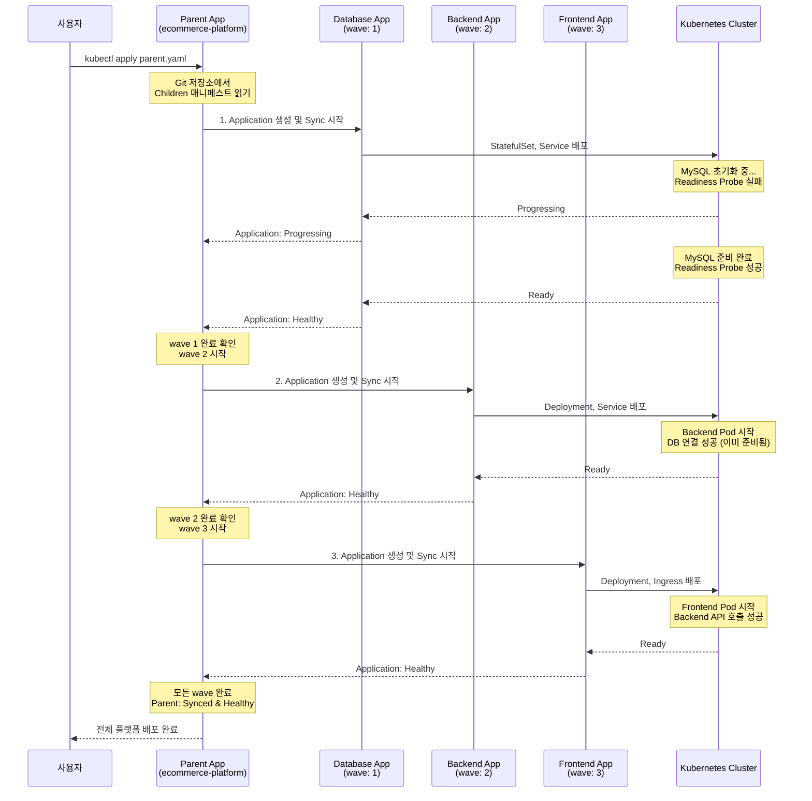
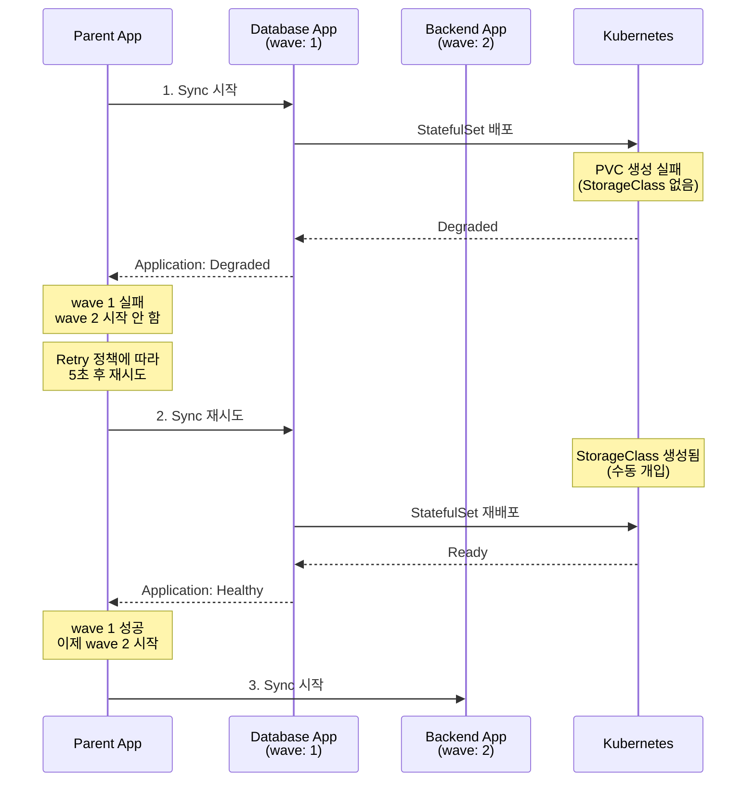
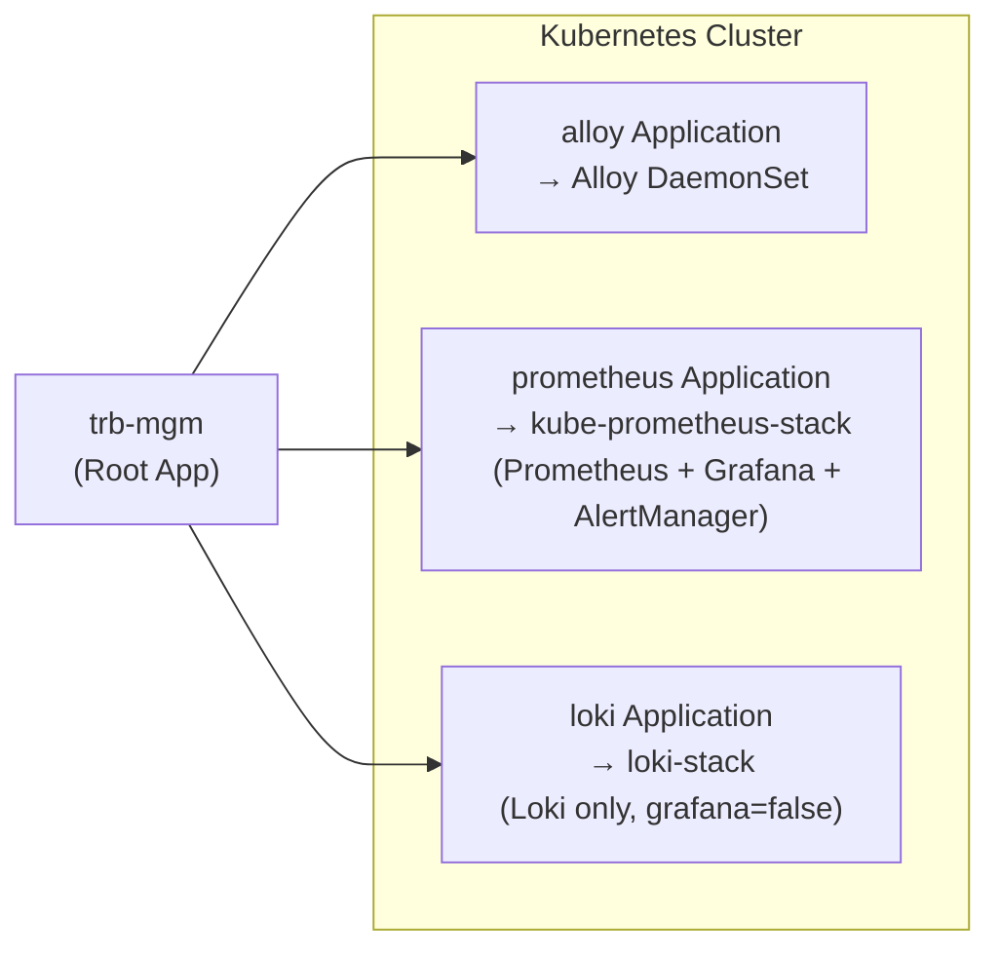
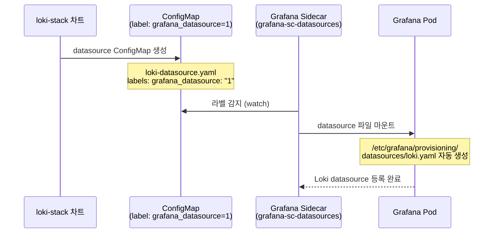
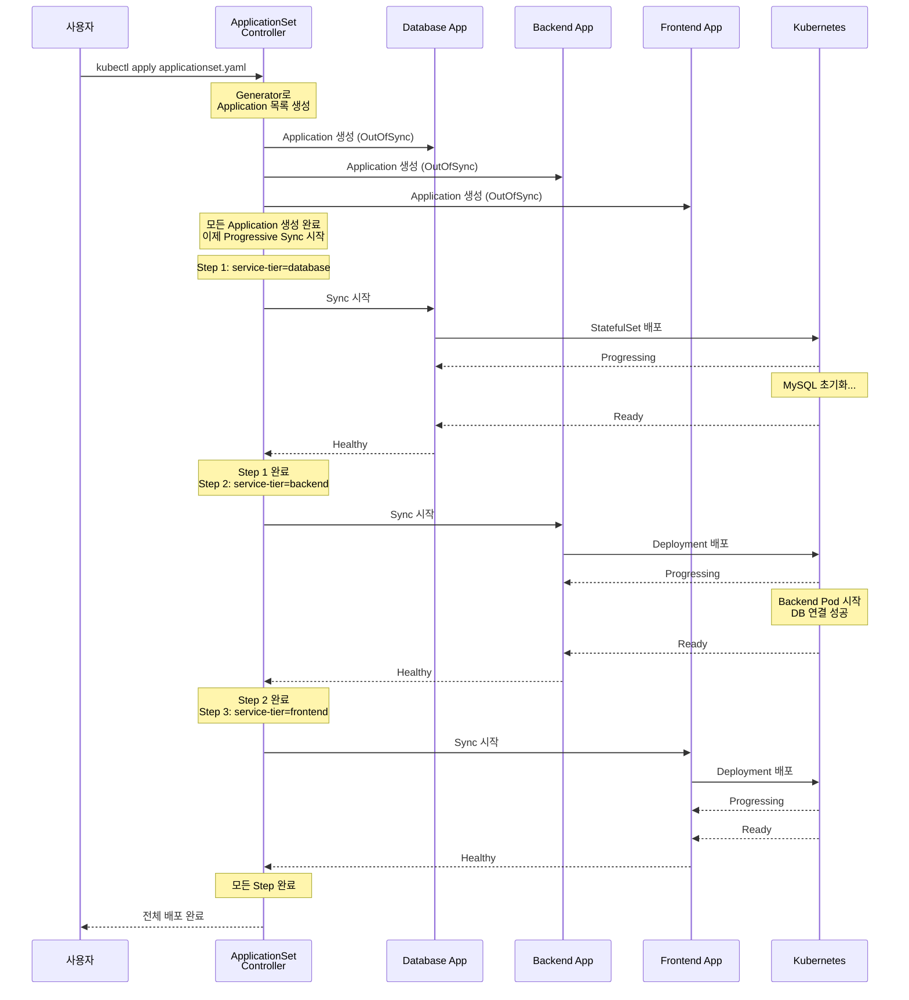
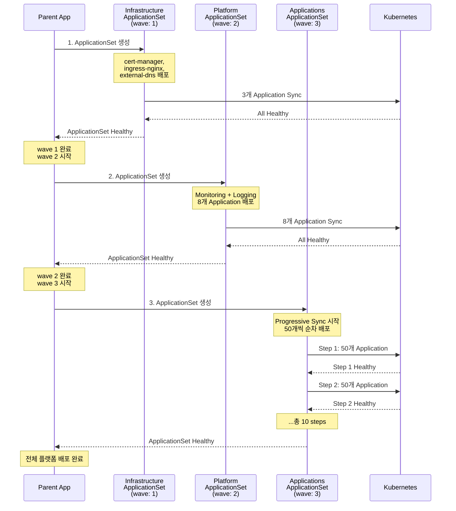

# 10. Applications at Scale

---

## 📌 핵심 요약

> 대규모 환경에서는 수백 개의 마이크로서비스를 동시에 배포하면 클러스터 API 서버가 과부하에 걸리고, 의존성이 있는 서비스(예: DB → Backend → Frontend)가 순서 없이 배포되면 애플리케이션이 제대로 시작하지 못합니다. Argo CD Application은 기본적으로 자율적(autonomous)이어서 서로의 상태를 인식하지 못하므로, **App-of-Apps with Sync Waves**, **ApplicationSets Progressive Sync** 패턴을 활용하여 Application 간 배포 순서를 제어하고 클러스터 부하를 분산시킵니다. 이러한 패턴이 제대로 작동하려면 **Readiness/Liveness Probes**와 **Argo CD Health Checks** 설정이 필수입니다.

---

## 🎯 학습 목표

이 내용을 읽고 나면:
- [ ] Argo CD Application의 자율적 특성과 한계를 이해하고, 왜 대규모 환경에서 문제가 되는지 설명할 수 있다
- [ ] Readiness/Liveness Probes가 없으면 왜 배포 순서 제어가 불가능한지 설명할 수 있다
- [ ] Argo CD Application Health Check를 활성화하고 커스텀 Health Check를 작성할 수 있다
- [ ] App-of-Apps with Sync Waves 패턴을 구현하고 동작 흐름을 설명할 수 있다
- [ ] ApplicationSets Progressive Sync를 설정하고, App-of-Apps와의 차이점을 설명할 수 있다

---

## 📖 본문 정리

### 1. 대규모 환경에서의 문제 상황

#### 1.1 Argo CD Application의 자율성 문제

Argo CD Application은 독립적인 리소스로 설계되어 있어, 각 Application이 다른 Application의 상태나 건강 상태를 전혀 인식하지 못합니다. 이는 GitOps 철학(각 Application이 자신의 Git 상태만 추적)에서는 자연스러운 설계이지만, 대규모 환경에서는 심각한 문제를 일으킵니다.

**실무 예시: 500개 마이크로서비스 동시 배포 시나리오**

```
상황: 새로운 클러스터에 500개 마이크로서비스를 한 번에 배포
- Database Application (MySQL, PostgreSQL 등)
- Message Queue Application (Kafka, RabbitMQ 등)
- Backend Service Application 300개
- Frontend Application 100개
- Monitoring Application (Prometheus, Grafana 등)

문제 1: 순서 보장 불가
- Backend가 DB보다 먼저 배포되면 DB 연결 실패로 CrashLoopBackOff
- Frontend가 Backend보다 먼저 배포되면 API 호출 실패
- Monitoring이 없는 상태로 서비스가 먼저 배포되면 장애 감지 불가

문제 2: 클러스터 과부하
- 500개 Application이 동시에 Sync 시작
- Kubernetes API 서버에 수천 개 리소스 생성 요청 동시 발생
- etcd write throughput 한계 도달
- 결과: API 서버 응답 지연, 일부 배포 실패

문제 3: 의존성 파악 불가
- Application A는 Application B가 "Healthy" 상태인지 확인할 방법 없음
- 개발자가 수동으로 배포 순서를 관리해야 함
- 배포 실패 시 원인 파악이 어려움
```

**왜 자율성이 문제가 되는가?**

Argo CD Application CRD는 다른 Application의 상태를 참조할 수 있는 필드가 없습니다. Kubernetes의 Deployment가 ReplicaSet의 상태를 확인하고, ReplicaSet이 Pod의 상태를 확인하는 것과 달리, Application 간에는 이러한 계층 관계가 없기 때문입니다. 이는 GitOps의 선언적 특성을 유지하기 위한 의도적 설계이지만, 대규모 환경에서는 오케스트레이션 레이어가 필요하게 됩니다.

| 문제 | 설명 | 영향 |
|------|------|------|
| **상호 인식 없음** | Application A는 Application B의 상태를 모름 | 의존 관계가 있는 서비스의 배포 실패 |
| **순서 제어 불가** | 배포 순서를 강제할 네이티브 메커니즘 없음 | 클러스터 전체 배포 실패 가능성 |
| **의존성 표현 불가** | Application 간 종속 관계 정의 불가 | 수동 관리 부담 |

#### 1.2 Sync Waves의 한계

Sync Waves는 **단일 Application 내** 리소스 배포 순서만 제어합니다. 이는 Application이라는 경계 안에서만 작동하는 메커니즘이기 때문입니다.

```yaml
# Sync Waves: 동일 Application 내에서만 유효
apiVersion: v1
kind: Namespace
metadata:
  name: web
  annotations:
    argocd.argoproj.io/sync-wave: "1"  # 먼저 생성
---
apiVersion: v1
kind: Pod
metadata:
  annotations:
    argocd.argoproj.io/sync-wave: "2"  # 나중에 생성
  name: nginx
  namespace: web
```

**왜 Application 간 순서 제어가 불가능한가?**

Sync Wave는 Application Controller가 단일 Application을 Sync할 때만 해석됩니다. Application Controller는 다른 Application의 매니페스트를 읽지 않으므로, 다른 Application의 Sync Wave를 알 수 없습니다. 이는 각 Application이 독립적인 Git 소스를 가질 수 있도록 설계되었기 때문입니다.

> ⚠️ **제한**: Sync Waves는 **Application 간** 순서를 제어할 수 없음 (Application은 다른 Application의 매니페스트를 읽지 않음)

---

### 2. 해결 전략 개요

대규모 환경에서 Application 간 의존성을 해결하는 세 가지 전략이 있습니다. 각 전략은 서로 다른 복잡도와 보장 수준을 제공합니다.

| 전략 | 설명 | 적합한 경우 | 순서 보장 메커니즘 |
|------|------|------------|------------------|
| **Eventual Consistency** | Kubernetes의 재시도 메커니즘에 의존 | 단순한 의존성 (2-3개 Application) | 재시도 + backoff |
| **App-of-Apps + Sync Waves** | 명시적 순서 제어 (권장) | 복잡한 오케스트레이션 (10-100개) | Parent가 Children의 Health 확인 |
| **Progressive Sync** | ApplicationSet 내 순차 배포 | 대규모 환경 (100개 이상) | Rolling 방식 Sync + maxUpdate |

**왜 세 가지 전략이 필요한가?**

단순한 환경에서는 재시도만으로 충분하지만(DB가 늦게 뜨면 Backend가 재시작하면서 자연스럽게 연결), 수십 개 이상의 서비스에서는 재시도 폭풍(retry storm)이 발생하여 클러스터를 불안정하게 만듭니다. App-of-Apps는 명확한 순서를 보장하지만, YAML 파일 관리 부담이 있습니다. Progressive Sync는 대규모 환경에서 클러스터 부하를 분산시키는 데 특화되어 있습니다.

---

### 3. 사전 요구사항 및 모범 사례

#### 3.1 Readiness/Liveness Probes 설정

Argo CD Application의 건강 상태는 배포된 리소스(Deployment, StatefulSet 등)의 건강 상태를 집계하여 결정됩니다. Kubernetes는 Probe가 없으면 컨테이너를 "Ready"로 간주하므로, Argo CD도 아직 시작 중인 리소스를 "Healthy"로 잘못 표시할 수 있습니다.

```yaml
# MySQL StatefulSet의 Probe 예시
spec:
  template:
    spec:
      containers:
        - image: mysql:5.6.51
          name: mysql
          livenessProbe:           # 컨테이너가 "살아있는지" 확인
            tcpSocket:
              port: 3306
            initialDelaySeconds: 12
            periodSeconds: 10
          readinessProbe:          # 요청을 받을 "준비가 됐는지" 확인
            exec:
              command: ["mysql", "-h", "127.0.0.1", "-e", "SELECT 1"]
            initialDelaySeconds: 12
            periodSeconds: 10
```

**왜 Probe가 필수인가?**

```
Probe 없는 경우:
1. MySQL Pod 생성
2. 컨테이너 시작 (프로세스만 실행, 아직 데이터 디렉토리 초기화 중)
3. Kubernetes: "Ready" 상태로 표시 (Probe가 없으므로)
4. Argo CD: "Healthy" 상태로 표시
5. Backend Application Sync 시작 (MySQL이 준비 안 됐는데 배포 시작)
6. Backend Pod: DB 연결 실패 → CrashLoopBackOff

Probe 있는 경우:
1. MySQL Pod 생성
2. 컨테이너 시작 (아직 Ready 아님)
3. Kubernetes: Readiness Probe 실패 → "Not Ready" 상태
4. Argo CD: "Progressing" 상태
5. MySQL 초기화 완료 → Readiness Probe 성공
6. Kubernetes: "Ready" 상태로 전환
7. Argo CD: "Healthy" 상태로 전환
8. 이제 Backend Application Sync 시작 (안전)
```

실무에서는 Readiness Probe 없이 배포하면 App-of-Apps 패턴에서 다음 Wave가 너무 빨리 시작되어 전체 배포가 실패하는 경우가 많습니다.

> ⚠️ **중요**: Probes 없이는 Argo CD가 아직 시작 중인 리소스를 "healthy"로 표시할 수 있음 (배포 순서 제어가 무의미해짐)

#### 3.2 Argo CD Application Health Check 활성화

Argo CD 1.8부터 Application CRD의 Health Check가 기본적으로 비활성화되어 있습니다. 이는 성능상의 이유(Application 수가 많을 때 Health Check 오버헤드)와 하위 호환성 때문입니다. App-of-Apps 패턴에서는 Parent가 Children의 건강 상태를 확인해야 하므로 반드시 활성화해야 합니다.

```yaml
# argocd-cm ConfigMap 패치
apiVersion: v1
kind: ConfigMap
metadata:
  name: argocd-cm
  namespace: argocd
data:
  resource.customizations: |
    argoproj.io/Application:
      health.lua: |
        hs = {}
        hs.status = "Progressing"
        hs.message = ""
        if obj.status ~= nil then
          if obj.status.health ~= nil then
            hs.status = obj.status.health.status
            if obj.status.health.message ~= nil then
              hs.message = obj.status.health.message
            end
          end
        end
        return hs
```

**왜 Lua 스크립트로 Health Check를 정의하는가?**

Argo CD는 다양한 커스텀 리소스(Operator가 만든 CRD 등)를 지원해야 하는데, 각 리소스마다 "건강"의 의미가 다릅니다. 예를 들어 Certificate 리소스는 `.status.conditions[type=Ready]`를 확인해야 하고, Application 리소스는 `.status.health.status`를 확인해야 합니다. Lua를 사용하면 이러한 로직을 유연하게 정의할 수 있습니다.

```bash
# 패치 적용
$ kubectl patch cm/argocd-cm -n argocd --type=merge \
  --patch-file argocd-cm-patchfile.yaml

# 확인
$ kubectl get -n argocd cm/argocd-cm -o \
  jsonpath='{.data.resource\.customizations\.health\.argoproj\.io_Application}'
```

#### 3.3 커스텀 Health Check (예: cert-manager)

cert-manager의 Certificate 리소스는 표준 Kubernetes 리소스가 아니므로, Argo CD가 기본적으로 건강 상태를 판단할 수 없습니다. 이런 경우 커스텀 Health Check를 작성합니다.

```yaml
data:
  resource.customizations: |
    cert-manager.io/Certificate:
      health.lua: |
        hs = {}
        if obj.status ~= nil then
          if obj.status.conditions ~= nil then
            for i, condition in ipairs(obj.status.conditions) do
              if condition.type == "Ready" and condition.status == "False" then
                hs.status = "Degraded"
                hs.message = condition.message
                return hs
              end
              if condition.type == "Ready" and condition.status == "True" then
                hs.status = "Healthy"
                hs.message = condition.message
                return hs
              end
            end
          end
        end
        hs.status = "Progressing"
        hs.message = "Waiting for certificate"
        return hs
```

**실무 예시: TLS 인증서 의존성**

```
1. Infrastructure Layer (wave: 1)
   - cert-manager Operator 배포

2. Platform Layer (wave: 2)
   - Certificate 리소스 배포 (Ingress용 TLS 인증서)
   - 커스텀 Health Check 없으면: Certificate가 발급 중인데 "Healthy"로 표시
   - 결과: Ingress가 잘못된 인증서로 배포됨

3. Application Layer (wave: 3)
   - Ingress 배포 (Certificate 참조)
   - 커스텀 Health Check 있으면: Certificate 발급 완료 후 배포 진행
```

---

### 4. Eventual Consistency 패턴

Kubernetes의 철학인 "결국에는 일관성을 유지한다(Eventual Consistency)"에 의존하는 가장 단순한 방식입니다. 이 패턴은 Application이 실패하더라도 재시도를 통해 결국 성공한다는 가정에 기반합니다.

```yaml
apiVersion: argoproj.io/v1alpha1
kind: Application
metadata:
  name: simple-go
spec:
  destination:
    name: in-cluster
    namespace: demo
  source:
    path: deploy/overlays/default
    repoURL: 'https://github.com/christianh814/simple-go'
    targetRevision: main
  project: default
  syncPolicy:
    automated:
      prune: true
      selfHeal: true
    syncOptions:
      - CreateNamespace=true
    retry:
      limit: 5                    # 최대 재시도 횟수
      backoff:
        duration: 5s              # 초기 대기 시간
        maxDuration: 3m0s         # 최대 대기 시간
        factor: 2                 # 대기 시간 증가 배수 (exponential backoff)
```

**재시도 메커니즘 동작 방식**

```
시나리오: Backend Application이 DB에 의존

1차 Sync 시도 (0초):
  - Backend Pod 생성
  - DB 연결 실패 (DB가 아직 없음)
  - Pod CrashLoopBackOff
  - Argo CD: Sync 실패

2차 Sync 시도 (5초 후):
  - Backend Pod 재생성
  - 여전히 DB 없음
  - 실패

3차 Sync 시도 (10초 후, duration * factor):
  - 이제 DB Application이 배포됨 (동시 배포였으므로)
  - Backend Pod 성공적으로 시작
  - Argo CD: Synced & Healthy
```

**왜 이 방식이 단순한 경우에만 적합한가?**

```
10개 Application이 서로 의존할 때:
- 재시도 폭풍(retry storm) 발생
- 각 Application이 독립적으로 재시도
- 클러스터에 불필요한 부하
- 배포 완료 시간 예측 불가

명시적 순서 제어 (App-of-Apps):
- DB 배포 → Healthy 확인 → Backend 배포
- 재시도 최소화
- 배포 시간 예측 가능
```

**의존 리소스 어노테이션:**

```yaml
metadata:
  annotations:
    argocd.argoproj.io/sync-options: SkipDryRunOnMissingResource=true
```

**왜 이 어노테이션이 필요한가?**

```
상황: CRD와 CustomResource를 동시 배포

1. CRD Application과 CR Application이 동시에 Sync 시작
2. CR Application이 먼저 dry-run 수행
3. 아직 CRD가 없으므로 dry-run 실패 ("unknown resource type")
4. SkipDryRunOnMissingResource=true → dry-run 건너뜀
5. 실제 apply 시점에는 CRD가 생성되어 있음 (Eventual Consistency)
```

> **Note**: CRD의 CustomResource처럼 의존 리소스가 없을 때 dry-run 실패를 방지

---

### 5. App-of-Apps with Sync Waves

#### 5.1 패턴 개요

App-of-Apps 패턴은 Parent Application이 Children Application들을 관리하는 계층 구조입니다. Parent Application의 매니페스트에 Children Application의 정의가 포함되어 있고, Parent가 Sync될 때 Children도 생성됩니다. 여기에 Sync Waves를 결합하면 Children Application 간 배포 순서를 제어할 수 있습니다.

**왜 App-of-Apps가 현재 권장 패턴인가?**

```
장점:
1. 명시적 순서 보장: Parent가 wave 순서대로 Children을 Sync
2. 건강 상태 집계: Parent의 건강 = 모든 Children의 건강
3. 라이프사이클 관리: Parent 삭제 시 모든 Children 자동 삭제
4. Git 기반 관리: Children 정의가 Git에 있어 버전 관리 가능

단점:
1. YAML 파일 증가: Children 수만큼 Application YAML 필요
2. Parent와 Children의 Git 저장소 결합도 높음
```

#### 5.2 실무 예시: 3-Tier 애플리케이션 배포

```
시나리오: 전자상거래 플랫폼 배포

Layer 1 (Database, wave: 1):
- MySQL StatefulSet (상품 DB)
- PostgreSQL StatefulSet (주문 DB)
- Redis Deployment (세션 캐시)

Layer 2 (Backend, wave: 2):
- Product Service (상품 조회)
- Order Service (주문 처리)
- Payment Service (결제 처리)

Layer 3 (Frontend, wave: 3):
- Web Application
- Mobile API Gateway

요구사항:
- Backend는 DB가 완전히 준비된 후 배포
- Frontend는 Backend API가 응답 가능한 상태에서 배포
- 전체 배포 시간 최소화 (불필요한 재시도 없음)
```

#### 5.3 Children Application 설정

**Database Application (wave: 1):**

```yaml
apiVersion: argoproj.io/v1alpha1
kind: Application
metadata:
  annotations:
    argocd.argoproj.io/sync-wave: "1"  # 가장 먼저 배포
  name: database
  namespace: argocd
spec:
  destination:
    name: in-cluster
    namespace: ecommerce-db
  source:
    path: infrastructure/database
    repoURL: 'https://github.com/example/ecommerce'
    targetRevision: main
  project: default
  syncPolicy:
    automated:
      prune: true
      selfHeal: true
    syncOptions:
      - CreateNamespace=true
```

**Backend Application (wave: 2):**

```yaml
apiVersion: argoproj.io/v1alpha1
kind: Application
metadata:
  annotations:
    argocd.argoproj.io/sync-wave: "2"  # Database Healthy 후 배포
  name: backend
  namespace: argocd
spec:
  destination:
    name: in-cluster
    namespace: ecommerce-backend
  source:
    path: services/backend
    repoURL: 'https://github.com/example/ecommerce'
    targetRevision: main
  project: default
  syncPolicy:
    automated:
      prune: true
      selfHeal: true
    syncOptions:
      - CreateNamespace=true
```

**Frontend Application (wave: 3):**

```yaml
apiVersion: argoproj.io/v1alpha1
kind: Application
metadata:
  annotations:
    argocd.argoproj.io/sync-wave: "3"  # Backend Healthy 후 배포
  name: frontend
  namespace: argocd
spec:
  destination:
    name: in-cluster
    namespace: ecommerce-frontend
  source:
    path: services/frontend
    repoURL: 'https://github.com/example/ecommerce'
    targetRevision: main
  project: default
  syncPolicy:
    automated:
      prune: true
      selfHeal: true
    syncOptions:
      - CreateNamespace=true
```

#### 5.4 Parent Application

```yaml
apiVersion: argoproj.io/v1alpha1
kind: Application
metadata:
  name: ecommerce-platform
  namespace: argocd
  finalizers:
  - resources-finalizer.argocd.argoproj.io  # 삭제 시 children도 삭제
spec:
  source:
    path: argocd/applications              # Children YAML이 있는 경로
    repoURL: 'https://github.com/example/ecommerce'
    targetRevision: main
  destination:
    namespace: argocd
    name: in-cluster
  project: default
  syncPolicy:
    automated:
      prune: true
      selfHeal: true
    retry:
      limit: 5
      backoff:
        duration: 5s
        maxDuration: 3m0s
        factor: 2
    syncOptions:
      - CreateNamespace=true
```

**왜 finalizer가 필요한가?**

```
finalizer 없는 경우:
1. Parent Application 삭제
2. Parent만 삭제되고 Children은 남음 (고아 리소스)
3. 수동으로 각 Children Application 삭제 필요

finalizer 있는 경우:
1. Parent Application 삭제 요청
2. Argo CD가 finalizer 확인
3. 모든 Children Application 먼저 삭제
4. Children 삭제 완료 후 Parent 삭제
5. 깔끔한 정리
```

```bash
# Parent Application 적용
$ kubectl apply -n argocd -f parent.yaml
```

#### 5.5 배포 순서 및 흐름

App-of-Apps 패턴에서 배포는 다음과 같은 순서로 진행됩니다. Parent Application Controller가 각 wave의 모든 Application이 Healthy 상태가 될 때까지 기다린 후 다음 wave를 시작합니다.



**배포 중 실패 시나리오**



**왜 wave 순서대로 배포되는가?**

Parent Application Controller는 매니페스트를 Sync Wave 어노테이션 순서로 정렬한 후, 각 wave의 모든 리소스가 Healthy 상태가 될 때까지 기다립니다. Application 리소스도 Kubernetes 리소스이므로 동일한 Sync Wave 로직이 적용됩니다. 다만 Application CRD의 Health Check가 활성화되어 있어야 Parent가 Children의 건강 상태를 인식할 수 있습니다.

> **Note**: Parent Application 삭제 시 모든 Children Application도 삭제됨 (finalizer)

---

### 5.6 실무 예시: 모니터링 스택 App of Apps

#### 5.6.1 배경과 구조

TPS 프로젝트에서 loki-stack, kube-prometheus-stack, alloy를 하나의 부모 Application(trb-mgm)으로 묶어 관리하는 실제 사례입니다. 각 모니터링 컴포넌트를 독립적으로 배포했을 때는 설치 순서와 Grafana datasource 연동을 수동으로 관리해야 했지만, App of Apps로 통합하면 Git 한 곳에서 enabled/disabled를 제어할 수 있기 때문입니다.



```
trb-mgm (Root App)
├── loki Application     → loki-stack chart      → Loki only (grafana.enabled=false)
├── prometheus Application → kube-prometheus-stack → Prometheus + Grafana + AlertManager
└── alloy Application    → alloy chart            → Alloy DaemonSet
```

#### 5.6.2 2계층 enabled 구조

App of Apps에서 "enabled 제어"는 2개 계층이 독립적으로 존재합니다. 이 구분을 모르면 "enabled했는데 왜 안 뜨지?" 또는 "disabled했는데 왜 Pod가 남아있지?" 같은 혼란이 생기기 때문에 반드시 이해해야 합니다.

| 계층 | 위치 | 결정하는 것 | 결정하지 않는 것 |
|------|------|------------|----------------|
| **1계층** | trb-mgm의 `values-dev.yaml` | ArgoCD `Application` 리소스 생성 여부 | 차트 내부 컴포넌트 |
| **2계층** | 각 차트의 `values-dev.yaml` | 차트 내부 컴포넌트(Grafana 등) 설치 여부 | Application 리소스 |

**1계층: Root App의 values-dev.yaml**

```yaml
# trb-mgm/values-dev.yaml
loki:
  enabled: true
  helmPath: helm-charts/loki-stack
prometheus:
  enabled: true
  helmPath: helm-charts/kube-prometheus-stack
alloy:
  enabled: true
  helmPath: helm-charts/alloy
```

여기서 `enabled: false`로 설정하면 ArgoCD Application 리소스 자체가 생성되지 않아 해당 차트 전체가 배포되지 않습니다.

**자식 Application 템플릿 (loki-stack.yaml)**

```yaml
{{- if .Values.loki.enabled }}
apiVersion: argoproj.io/v1alpha1
kind: Application
metadata:
  name: loki
  namespace: argocd
spec:
  project: default
  source:
    repoURL: 'https://gitlab.example.com/tps/helm-charts'
    targetRevision: main
    path: {{ .Values.loki.helmPath }}
    helm:
      valueFiles:
        - values-dev.yaml
  destination:
    server: https://kubernetes.default.svc
    namespace: monitoring
  syncPolicy:
    automated:
      prune: true
      selfHeal: true
    syncOptions:
      - CreateNamespace=true
{{- end }}
```

**2계층: 각 차트의 values-dev.yaml**

```yaml
# helm-charts/loki-stack/values-dev.yaml
loki:
  enabled: true

# Grafana는 kube-prometheus-stack에서 하나만 운영 → 여기서는 비활성화
grafana:
  enabled: false
```

#### 5.6.3 Grafana 중복 방지 패턴

loki-stack과 kube-prometheus-stack은 둘 다 Grafana를 subchart로 포함합니다. 두 차트를 그대로 설치하면 Grafana가 2개 뜨고, datasource 설정이 충돌하기 때문에 하나는 반드시 비활성화해야 합니다.

```yaml
# helm-charts/kube-prometheus-stack/values-dev.yaml
grafana:
  enabled: true                    # 여기서만 Grafana 운영
  sidecar:
    datasources:
      enabled: true                # ConfigMap sidecar로 datasource 자동 수집
      label: grafana_datasource    # 이 라벨이 붙은 ConfigMap을 자동 마운트
```

```yaml
# helm-charts/loki-stack/values-dev.yaml
grafana:
  enabled: false                   # Grafana는 kube-prometheus-stack에 위임
loki:
  enabled: true
```

Loki datasource 연동은 ConfigMap sidecar 라벨로 자동 해결됩니다. Loki 차트가 `grafana_datasource: "1"` 라벨이 붙은 ConfigMap을 생성하면, kube-prometheus-stack의 Grafana sidecar가 이를 감지하여 자동으로 datasource로 등록합니다. 수동으로 Grafana UI에서 datasource를 추가할 필요가 없습니다.



#### 5.6.4 핵심 포인트 정리

**enabled 제어의 2계층 분리**

1계층(trb-mgm values)의 `enabled: false`는 Application 리소스를 생성하지 않아 차트 전체를 배포하지 않습니다. 2계층(차트 내부 values)의 `grafana.enabled: false`는 Helm subchart 설치만 막고, 나머지 컴포넌트(Loki 등)는 정상 배포됩니다. 두 계층을 혼동하면 의도와 다른 동작이 발생하므로 주의해야 합니다.

**운영 관점 장점**

```
Before (개별 관리):
- loki 배포 → kube-prometheus-stack 배포 → alloy 배포 (순서 수동 관리)
- Grafana datasource 수동 등록
- 비활성화 시 개별 Application 삭제

After (App of Apps):
- trb-mgm values-dev.yaml에서 enabled: false 한 줄로 비활성화
- ArgoCD가 prune으로 Application 리소스 자동 제거
- datasource는 ConfigMap sidecar가 자동 연동
```

> ⚠️ **주의**: loki-stack에서 `grafana.enabled: true`로 실수로 켜두면 Grafana가 2개 뜨고 두 인스턴스가 서로 다른 datasource를 바라보게 됩니다. kube-prometheus-stack의 Grafana만 활성화하고 나머지는 모두 `grafana.enabled: false`로 명시적으로 설정하는 것을 권장합니다.

---

### 6. ApplicationSets Progressive Sync

#### 6.1 Progressive Sync가 필요한 이유

ApplicationSets는 단일 템플릿으로 여러 Application을 생성하는 도구입니다. 예를 들어 100개 마이크로서비스를 배포할 때, ApplicationSet 하나로 100개 Application을 생성할 수 있습니다. 하지만 기본적으로 모든 Application이 동시에 Sync되므로, 대규모 환경에서는 클러스터 과부하 문제가 발생합니다.

**실무 예시: 500개 마이크로서비스 동시 배포 문제**

```
상황: 금융 회사의 마이크로서비스 플랫폼 (500개 서비스)
- ApplicationSet으로 500개 Application 생성
- 모든 Application이 동시에 Sync 시작

발생 문제:
1. API 서버 과부하
   - 500개 Application × 평균 10개 리소스 = 5,000개 리소스 동시 생성
   - Kubernetes API 서버의 초당 처리량 한계 도달
   - 일부 요청 타임아웃

2. etcd 쓰기 병목
   - 모든 리소스 상태가 etcd에 기록됨
   - etcd write throughput 한계 (일반적으로 ~10,000 writes/sec)
   - 클러스터 전체 응답 지연

3. 네트워크 대역폭
   - 500개 컨테이너 이미지 동시 pull
   - Registry 대역폭 포화
   - 일부 Pod ImagePullBackOff

Progressive Sync 적용 후:
- 50개씩 순차 배포 (10 waves)
- 각 wave가 Healthy 상태 확인 후 다음 wave 시작
- 클러스터 부하 분산
- 전체 배포 시간: 증가하지만 안정적
```

**왜 Progressive Sync가 ApplicationSet에만 있는가?**

ApplicationSets는 대규모 Application 생성에 특화되어 있어, 동시 배포 문제가 더 심각합니다. App-of-Apps는 일반적으로 수십 개 수준이므로 수동 관리가 가능하지만, ApplicationSet은 수백 개를 자동 생성하므로 Progressive Sync 같은 메커니즘이 필수입니다.

| 항목 | 설명 | 영향 |
|------|------|------|
| **상태** | ⚠️ **Alpha 기능** (변경 가능) | 프로덕션 사용 시 주의 |
| **Auto Sync** | 생성된 Application의 auto sync 비활성화됨 | Progressive Sync가 수동으로 Sync 제어 |
| **Timeout** | 300초 이상 pending 시 healthy로 간주 | 무한 대기 방지 |
| **장점** | 단일 매니페스트로 관리 | ApplicationSet 하나로 수백 개 Application 제어 |

#### 6.2 Progressive Sync 활성화

Progressive Sync는 기본적으로 비활성화되어 있으므로, ApplicationSet Controller의 설정을 변경해야 합니다.

```yaml
# argocd-cmd-params-cm-patchfile.yaml
apiVersion: v1
kind: ConfigMap
metadata:
  name: argocd-cmd-params-cm
  namespace: argocd
data:
  applicationsetcontroller.enable.progressive.syncs: "true"
```

```bash
# ConfigMap 패치
$ kubectl patch cm/argocd-cmd-params-cm -n argocd --type=merge \
  --patch-file argocd-cmd-params-cm-patchfile.yaml

# ApplicationSet Controller 재시작 (설정 반영)
$ kubectl rollout restart deploy/argocd-applicationset-controller -n argocd
```

**왜 재시작이 필요한가?**

ApplicationSet Controller는 시작 시 ConfigMap의 설정을 읽어 메모리에 로드합니다. ConfigMap을 변경해도 이미 실행 중인 프로세스는 새 설정을 자동으로 읽지 않으므로, 재시작하여 새 설정을 적용해야 합니다.

#### 6.3 ApplicationSet 구성

```yaml
apiVersion: argoproj.io/v1alpha1
kind: ApplicationSet
metadata:
  name: microservices
  namespace: argocd
spec:
  generators:
  - list:
      elements:
      - srv: database
        env: production
      - srv: backend
        env: production
      - srv: frontend
        env: production
  template:
    metadata:
      name: '{{srv}}'
      labels:
        service-tier: '{{srv}}'    # Progressive Sync에서 사용할 라벨
        environment: '{{env}}'
    spec:
      project: default
      source:
        repoURL: 'https://github.com/example/repo'
        path: 'apps/{{srv}}'
        targetRevision: main
      destination:
        server: https://kubernetes.default.svc
        namespace: microservices
      syncPolicy:
        syncOptions:
          - CreateNamespace=true
  strategy:
    type: RollingSync
    rollingSync:
      steps:
        - matchExpressions:            # Step 1: database
            - key: service-tier
              operator: In
              values:
                - database
        - matchExpressions:            # Step 2: backend
            - key: service-tier
              operator: In
              values:
                - backend
        - matchExpressions:            # Step 3: frontend
            - key: service-tier
              operator: In
              values:
                - frontend
```

**matchExpressions 동작 방식**

```
ApplicationSet Controller 로직:

1. 모든 Application 생성 (OutOfSync 상태)
   - database Application (label: service-tier=database)
   - backend Application (label: service-tier=backend)
   - frontend Application (label: service-tier=frontend)

2. Step 1 실행
   - matchExpressions로 service-tier=database인 Application 선택
   - 선택된 Application만 Sync
   - Healthy 상태 대기

3. Step 2 실행
   - matchExpressions로 service-tier=backend인 Application 선택
   - 선택된 Application만 Sync
   - Healthy 상태 대기

4. Step 3 실행
   - matchExpressions로 service-tier=frontend인 Application 선택
   - 선택된 Application만 Sync
   - 완료
```

#### 6.4 배포 흐름

Progressive Sync는 App-of-Apps와 달리 모든 Application을 먼저 생성한 후, 라벨 기반으로 순차적으로 Sync합니다. 이는 ApplicationSet의 선언적 특성(모든 Application을 미리 정의)을 유지하면서 배포 순서를 제어하는 방식입니다.



**App-of-Apps vs Progressive Sync 비교**

```
App-of-Apps:
1. Parent 생성
2. Parent Sync 시작
3. wave 1 Children 생성 및 Sync
4. wave 1 Healthy 대기
5. wave 2 Children 생성 및 Sync
6. wave 2 Healthy 대기
7. ...

Progressive Sync:
1. ApplicationSet 생성
2. 모든 Children 생성 (OutOfSync)
3. Step 1 Children만 Sync
4. Step 1 Healthy 대기
5. Step 2 Children만 Sync
6. Step 2 Healthy 대기
7. ...

차이점:
- App-of-Apps: wave 단위로 생성과 Sync 동시 진행
- Progressive Sync: 모든 Application 미리 생성, Sync만 순차 진행
```

> **Note**: App-of-Apps와 달리 모든 Application이 먼저 생성되고, 순차적으로 Sync됨 (선언적 특성 유지)

#### 6.5 고급 옵션: maxUpdate

대규모 환경에서는 한 step 내에서도 수십 개의 Application이 동시에 Sync되어 클러스터에 부하를 줄 수 있습니다. maxUpdate 옵션으로 한 번에 Sync할 Application 수를 제한할 수 있습니다.

```yaml
spec:
  strategy:
    type: RollingSync
    rollingSync:
      steps:
        - matchExpressions:
            - key: env
              operator: In
              values:
                - production
          maxUpdate: 10%              # 한 번에 10%만 배포
```

**실무 예시: 500개 마이크로서비스 배포**

```
상황: 500개 마이크로서비스를 production 환경에 배포

maxUpdate 없는 경우:
- Step 1: 500개 Application 모두 동시 Sync
- API 서버 과부하
- 일부 배포 실패

maxUpdate: 10% 적용:
- Step 1-1: 50개 Application Sync (10% of 500)
- 50개 Healthy 대기
- Step 1-2: 다음 50개 Application Sync
- ...
- Step 1-10: 마지막 50개 Application Sync
- 총 10개 sub-step으로 클러스터 부하 분산

배포 시간:
- 동시 배포: 10분 (하지만 일부 실패)
- 10% 순차: 30분 (하지만 100% 성공)
```

**왜 퍼센티지로 지정하는가?**

ApplicationSet의 Application 수는 Generator에 따라 동적으로 변할 수 있습니다(예: Git 디렉토리 개수, 클러스터 목록 등). 절대값으로 지정하면 Application 수가 변할 때마다 maxUpdate를 수정해야 하지만, 퍼센티지로 지정하면 자동으로 적응합니다.

> **활용**: 수백 개의 Application이 있을 때 "Broadcast Storm" 방지 (클러스터 API 서버 보호)

---

### 7. 패턴 비교

각 패턴은 서로 다른 트레이드오프를 가지고 있으며, 환경 규모와 요구사항에 따라 선택해야 합니다.

| 항목 | Eventual Consistency | App-of-Apps + Sync Waves | Progressive Sync |
|------|---------------------|--------------------------|------------------|
| **복잡도** | 낮음 | 중간 | 중간 |
| **순서 보장** | ❌ (재시도 기반, 예측 불가) | ✅ 명시적 (wave 순서) | ✅ 명시적 (step 순서) |
| **매니페스트 수** | Application 개수만큼 | Parent 1개 + Children N개 | ApplicationSet 1개 |
| **권장 상태** | 단순 시나리오 (2-3개) | ✅ **현재 권장** (10-100개) | Alpha (100개 이상) |
| **Health Check 의존** | 낮음 (재시도만) | 높음 (필수) | 높음 (필수) |
| **대규모 환경** | ❌ (재시도 폭풍) | ⚠️ YAML 관리 부담 | ✅ maxUpdate 지원 |
| **클러스터 부하 제어** | ❌ | ⚠️ wave 단위 제어 | ✅ maxUpdate로 세밀한 제어 |

**선택 가이드**

```
Application 수가 2-3개:
→ Eventual Consistency (간단하고 충분)

Application 수가 10-100개:
→ App-of-Apps + Sync Waves (명확한 순서, 검증된 패턴)

Application 수가 100개 이상:
→ Progressive Sync (대규모 특화, 단 Alpha 기능 주의)

복잡한 다단계 배포 (Infrastructure → Platform → Applications):
→ App-of-ApplicationSets (두 패턴 결합)
```

---

## 🔍 심화 학습

### App-of-ApplicationSets

App-of-Apps와 ApplicationSets를 결합하여 더 복잡한 시나리오를 처리할 수 있습니다. 이 패턴은 각 layer마다 여러 Application이 필요하면서도 layer 간 순서를 보장해야 할 때 유용합니다.

**실무 예시: 클라우드 플랫폼 부트스트래핑**

```
Layer 1: Infrastructure (wave: 1)
- cert-manager (1개)
- ingress-nginx (1개)
- external-dns (1개)

Layer 2: Platform (wave: 2)
- Monitoring Stack: 5개 마이크로서비스 (ApplicationSet)
  - Prometheus, Grafana, Alertmanager, Loki, Tempo
- Logging Stack: 3개 마이크로서비스 (ApplicationSet)
  - Fluentd, Elasticsearch, Kibana

Layer 3: Applications (wave: 3)
- 500개 비즈니스 마이크로서비스 (ApplicationSet with Progressive Sync)
  - 각 팀별로 10-50개 서비스
```



**Parent Application 구성**

```yaml
apiVersion: argoproj.io/v1alpha1
kind: Application
metadata:
  name: platform-parent
  namespace: argocd
spec:
  source:
    path: argocd/applicationsets  # ApplicationSet YAML이 있는 경로
    repoURL: 'https://github.com/example/platform'
    targetRevision: main
  destination:
    namespace: argocd
    name: in-cluster
  project: default
  syncPolicy:
    automated:
      prune: true
      selfHeal: true
```

**왜 이 패턴이 필요한가?**

```
단순 App-of-Apps:
- 500개 Application YAML 관리 필요
- 새 서비스 추가 시 YAML 수동 추가

단순 ApplicationSet:
- layer 간 순서 제어 불가
- Infrastructure가 준비 안 된 상태로 Applications 배포 가능

App-of-ApplicationSets:
- layer 간 순서 보장 (App-of-Apps)
- layer 내 자동 생성 (ApplicationSet)
- 대규모 환경에서 YAML 관리 부담 최소화
```

### Argo CD Built-in Health Checks

Argo CD는 다양한 Kubernetes 타입에 대한 내장 Health Check를 제공합니다. 이는 `argocd-cm` ConfigMap의 기본 설정으로 포함되어 있습니다.

**주요 리소스별 Health Check 로직**

| 리소스 타입 | Health 판단 기준 | Progressing 조건 | Degraded 조건 |
|------------|-----------------|-----------------|---------------|
| **Deployment** | `.status.availableReplicas` == `.spec.replicas` | Rolling Update 중 | `.status.conditions[type=Progressing].status=False` |
| **StatefulSet** | `.status.readyReplicas` == `.spec.replicas` | Rolling Update 중 | `.status.currentRevision` != `.status.updateRevision` 장기화 |
| **DaemonSet** | `.status.numberReady` == `.status.desiredNumberScheduled` | Rolling Update 중 | 일부 노드에서 실패 |
| **Service** | Type=LoadBalancer인 경우 `.status.loadBalancer.ingress` 존재 | Ingress 할당 대기 | N/A |
| **Job** | `.status.succeeded` == `.spec.completions` | 실행 중 | `.status.failed` > 0 |

**실무 예시: StatefulSet Health Check가 중요한 이유**

```
시나리오: MySQL StatefulSet 배포 (3 replicas)

1. StatefulSet 생성
   - Pod mysql-0 생성 시작

2. mysql-0 Running
   - Argo CD: Progressing (readyReplicas 0/3)

3. mysql-0 데이터 초기화 완료, Readiness Probe 성공
   - Argo CD: 여전히 Progressing (readyReplicas 1/3)

4. mysql-1, mysql-2 순차 생성 및 준비
   - Argo CD: Progressing (readyReplicas 2/3)

5. 모든 replica 준비 완료
   - Argo CD: Healthy (readyReplicas 3/3)

Health Check 없으면:
- mysql-0만 Running이면 "Healthy"로 오인
- 실제로는 복제 설정이 안 된 상태
- 다음 wave 배포 시작 → 데이터 일관성 문제
```

[Argo CD GitHub](https://github.com/argoproj/argo-cd/tree/master/resource_customizations)에서 각 리소스 타입별 Lua 스크립트를 확인할 수 있습니다. 커스텀 리소스를 사용하는 경우 이를 참고하여 Health Check를 작성할 수 있습니다.

### 출처
- [Argo CD Health Checks](https://argo-cd.readthedocs.io/en/stable/operator-manual/health/)
- [ApplicationSet Progressive Sync](https://argo-cd.readthedocs.io/en/stable/operator-manual/applicationset/Progressive-Syncs/)
- [App-of-Apps Pattern](https://argo-cd.readthedocs.io/en/stable/operator-manual/cluster-bootstrapping/)

---

## 💡 실무 적용 포인트

### 패턴 선택 가이드

| 상황 | 권장 패턴 | 이유 |
|------|----------|------|
| 단순한 의존성, 빠른 시작 (2-3개) | Eventual Consistency | 재시도로 충분, 설정 간단 |
| 명확한 배포 순서 필요 (10-100개) | App-of-Apps + Sync Waves | 검증된 패턴, wave로 명확한 제어 |
| 수백 개 이상의 Application | Progressive Sync | maxUpdate로 클러스터 부하 분산 |
| 복잡한 다단계 배포 (layer별 수십 개) | App-of-ApplicationSets | layer 순서 + 자동 생성 결합 |

### 체크리스트

| 단계 | 작업 | 우선순위 | 이유 |
|------|------|----------|------|
| 1 | 모든 Deployment에 Probes 설정 | 🔴 필수 | Argo CD가 건강 상태를 정확히 판단하기 위함 |
| 2 | `argocd-cm`에 Application Health Check 추가 | 🔴 필수 | App-of-Apps 패턴에서 Parent가 Children 상태 인식 |
| 3 | 의존성 있는 리소스에 `SkipDryRunOnMissingResource` 추가 | 🟡 권장 | CRD-CR 동시 배포 시 dry-run 실패 방지 |
| 4 | 필요 시 커스텀 Health Check 추가 (Operator CRD 등) | 🟢 선택 | 커스텀 리소스의 건강 상태 정확히 판단 |

### 주의할 점 / 흔한 실수

- ⚠️ **Probes 미설정**: Argo CD가 시작 중인 리소스를 healthy로 오인 → 다음 wave가 너무 빨리 시작되어 실패
- ⚠️ **Application Health Check 비활성화**: Argo CD 1.8+에서 기본 비활성화, 수동 활성화 필요 → Parent가 Children을 "Unknown" 상태로 인식
- ⚠️ **Sync Wave 숫자**: 낮은 숫자가 높은 우선순위 (음수 포함, -1이 0보다 먼저)
- ⚠️ **Progressive Sync Alpha**: 프로덕션 사용 시 주의, API 변경 가능 → 업그레이드 시 설정 확인 필요
- ⚠️ **Progressive Sync Auto Sync**: 생성된 Application의 auto sync 비활성화됨 → Progressive Sync가 수동으로 Sync 제어
- ⚠️ **Parent Application 삭제**: Finalizer로 인해 모든 Children도 삭제됨 → 의도치 않은 대규모 삭제 가능성 주의

### 면접에서 나올 수 있는 질문

**Q: Argo CD Application의 자율성(autonomy)이란 무엇이고 어떤 한계가 있나?**

A: Argo CD Application은 각각 독립적인 Kubernetes 리소스로 설계되어 있어, 다른 Application의 상태나 건강 상태를 전혀 인식하지 못합니다. 이는 GitOps의 선언적 특성을 유지하기 위한 의도적 설계이지만, 대규모 환경에서는 문제가 됩니다. 예를 들어 500개 마이크로서비스를 동시에 배포하면 Database Application과 Backend Application이 동시에 Sync되어 Backend가 DB 연결 실패로 CrashLoopBackOff에 빠질 수 있고, 모든 Application이 동시에 Sync하면서 Kubernetes API 서버가 과부하에 걸릴 수 있습니다. Application 간 의존성을 표현할 수 있는 네이티브 필드가 없기 때문에, App-of-Apps나 Progressive Sync 같은 패턴으로 오케스트레이션 레이어를 추가해야 합니다.

**Q: Sync Waves가 Application 간 순서를 제어할 수 없는 이유는?**

A: Sync Waves는 Application Controller가 단일 Application을 Sync할 때만 해석됩니다. Application Controller는 자신이 관리하는 Application의 매니페스트만 읽고, 다른 Application의 매니페스트는 읽지 않습니다. 이는 각 Application이 독립적인 Git 소스를 가질 수 있도록 설계되었기 때문입니다. 따라서 Application A는 Application B의 Sync Wave 값을 알 수 없고, 순서를 조정할 수 없습니다. Application 간 순서를 제어하려면 Parent Application이 Children Application들을 관리하는 App-of-Apps 패턴을 사용해야 하며, 이때 Children Application에 Sync Wave 어노테이션을 추가하면 Parent가 wave 순서대로 Children을 Sync합니다.

**Q: Readiness/Liveness Probes가 Argo CD Application에 왜 중요한가?**

A: Argo CD는 배포된 리소스(Deployment, StatefulSet 등)의 건강 상태를 집계하여 Application의 건강 상태를 결정합니다. Kubernetes는 Probe가 없으면 컨테이너를 "Ready"로 간주하므로, Argo CD도 아직 시작 중인 리소스를 "Healthy"로 잘못 표시할 수 있습니다. 예를 들어 MySQL StatefulSet이 데이터 디렉토리 초기화 중인데 Readiness Probe가 없으면 Kubernetes가 즉시 "Ready"로 표시하고, Argo CD는 Database Application을 "Healthy"로 판단하여 다음 wave의 Backend Application을 배포 시작합니다. 하지만 MySQL이 아직 준비 안 된 상태이므로 Backend가 DB 연결 실패로 CrashLoopBackOff에 빠집니다. Readiness Probe를 설정하면 MySQL 초기화가 완료된 후에야 "Ready" 상태가 되고, 그때 다음 wave가 시작되어 안전하게 배포됩니다.

**Q: App-of-Apps 패턴의 동작 방식과 장점은?**

A: App-of-Apps 패턴은 Parent Application이 Children Application들을 관리하는 계층 구조입니다. Parent Application의 Git 저장소에 Children Application의 매니페스트가 포함되어 있고, Parent를 Sync하면 Children Application 리소스가 생성됩니다. Children에 Sync Wave 어노테이션을 추가하면 Parent가 wave 순서대로 Children을 Sync하며, 각 wave의 모든 Application이 Healthy 상태가 될 때까지 기다린 후 다음 wave를 시작합니다. 장점은 명시적 순서 보장(wave 1의 Database가 Healthy 후 wave 2의 Backend 배포), 건강 상태 집계(Parent의 건강 상태 = 모든 Children의 건강 상태), 라이프사이클 관리(Parent 삭제 시 finalizer로 모든 Children 자동 삭제), Git 기반 관리(Children 정의가 Git에 있어 버전 관리 및 롤백 가능)입니다. 현재 복잡한 오케스트레이션이 필요한 환경에서 가장 권장되는 패턴입니다.

**Q: ApplicationSets Progressive Sync의 장점과 주의사항은?**

A: Progressive Sync는 ApplicationSet으로 생성된 수백 개의 Application을 순차적으로 Sync하여 클러스터 부하를 분산시키는 기능입니다. 장점은 단일 ApplicationSet 매니페스트로 수백 개 Application을 관리하면서도 배포 순서를 제어할 수 있고, maxUpdate 옵션으로 한 번에 Sync할 Application 수를 퍼센티지로 제한하여 API 서버 과부하를 방지할 수 있습니다. 예를 들어 500개 마이크로서비스를 maxUpdate 10%로 배포하면 50개씩 10개 step으로 나누어 배포하여 클러스터가 안정적으로 처리합니다. 주의사항은 Alpha 기능이므로 API가 변경될 수 있어 프로덕션 사용 시 주의해야 하고, Progressive Sync가 활성화되면 생성된 Application의 auto sync가 비활성화되어 Progressive Sync가 수동으로 Sync를 제어하며, 300초 이상 pending 상태인 Application은 자동으로 healthy로 간주하여 무한 대기를 방지합니다.

**Q: Argo CD Application Health Check를 활성화하는 방법은?**

A: Argo CD 1.8부터 Application CRD의 Health Check가 기본적으로 비활성화되어 있으므로, `argocd-cm` ConfigMap에 Lua 스크립트를 추가해야 합니다. `resource.customizations` 필드에 `argoproj.io/Application` 타입의 `health.lua` 스크립트를 작성하여 Application의 `.status.health.status` 필드를 읽어 건강 상태를 반환하도록 합니다. ConfigMap을 패치한 후 Argo CD Application Controller가 새 설정을 읽도록 재시작하거나 자동으로 반영될 때까지 기다립니다. 이 설정이 활성화되면 Parent Application이 Children Application의 건강 상태를 인식할 수 있어 App-of-Apps 패턴에서 wave 순서 제어가 제대로 작동합니다.

---

## ✅ 핵심 개념 체크리스트

- [ ] Argo CD Application의 자율적 특성과 한계를 이해하고, 대규모 환경에서 왜 문제가 되는지 설명할 수 있는가?
- [ ] Sync Waves가 단일 Application 내에서만 작동하는 이유를 이해하고, Application 간 순서 제어가 불가능한 이유를 설명할 수 있는가?
- [ ] Readiness/Liveness Probes가 없으면 왜 배포 순서 제어가 무의미해지는지 실무 예시로 설명할 수 있는가?
- [ ] `argocd-cm`에 Application Health Check를 추가하는 방법과 이유를 알고 있는가?
- [ ] App-of-Apps 패턴에서 Parent와 Children의 관계, 배포 흐름, finalizer의 역할을 이해했는가?
- [ ] Sync Wave 어노테이션을 통한 순서 제어 방법과 숫자의 우선순위(낮을수록 먼저)를 알고 있는가?
- [ ] ApplicationSets Progressive Sync의 strategy 설정, matchExpressions, maxUpdate 옵션을 이해했는가?
- [ ] App-of-Apps와 Progressive Sync의 차이점(생성 시점, Sync 방식, 적합한 규모)을 설명할 수 있는가?
- [ ] 각 패턴의 적합한 사용 시나리오(Application 수, 환경 복잡도)를 구분할 수 있는가?

---

## 🔗 참고 자료

- 📄 공식 문서: [App-of-Apps Pattern](https://argo-cd.readthedocs.io/en/stable/operator-manual/cluster-bootstrapping/)
- 📄 Health Checks: [Resource Health](https://argo-cd.readthedocs.io/en/stable/operator-manual/health/)
- 📄 Progressive Sync: [ApplicationSet Progressive Sync](https://argo-cd.readthedocs.io/en/stable/operator-manual/applicationset/Progressive-Syncs/)
- 📄 Sync Options: [Sync Options](https://argo-cd.readthedocs.io/en/stable/user-guide/sync-options/)
- 📄 Kubernetes Probes: [Configure Liveness, Readiness and Startup Probes](https://kubernetes.io/docs/tasks/configure-pod-container/configure-liveness-readiness-startup-probes/)

---
