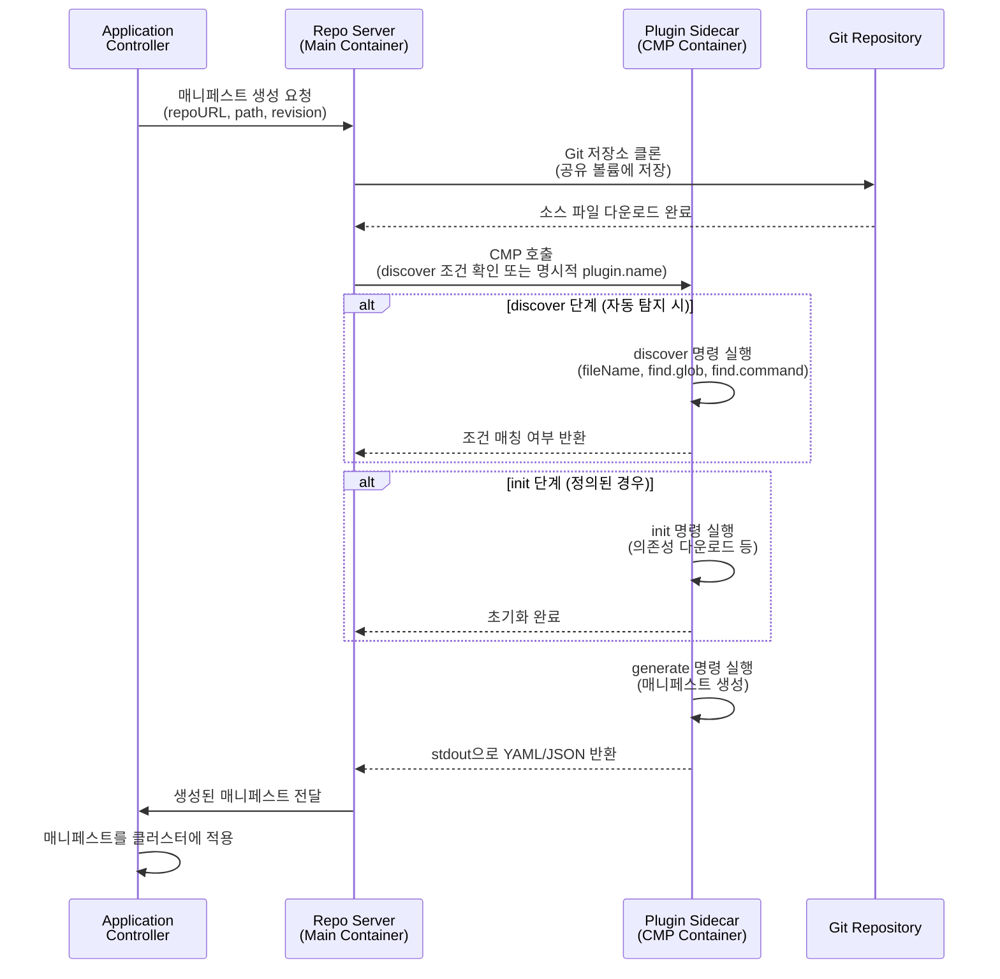
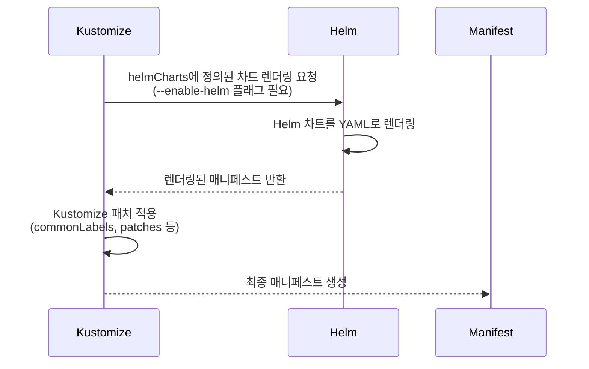
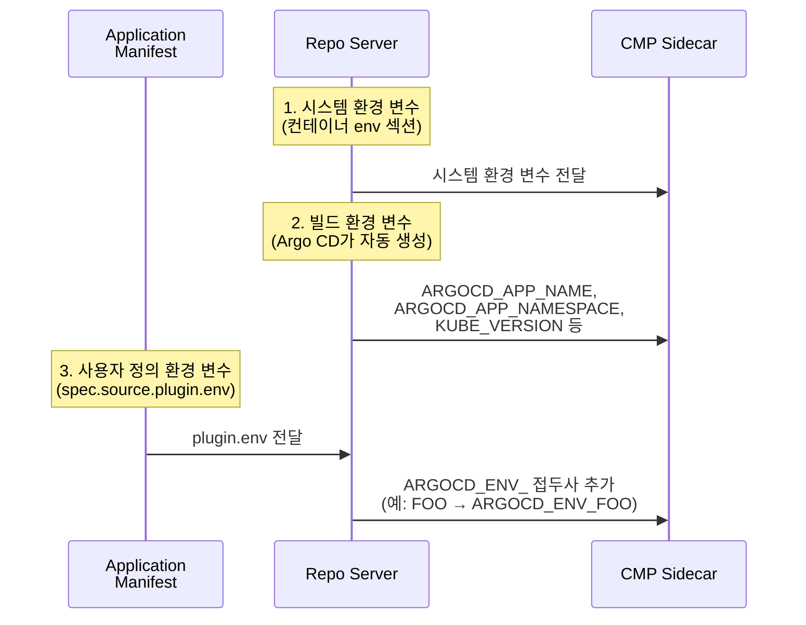
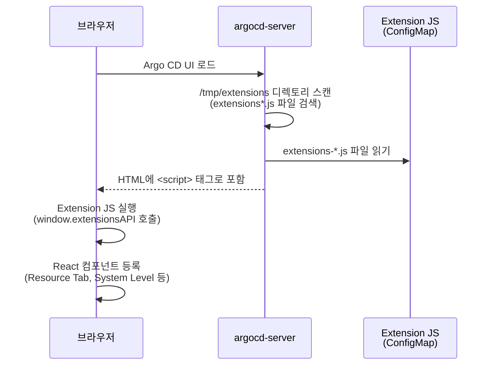

# 11. Extending Argo CD

---

## 📌 핵심 요약

> Argo CD는 기본적으로 Helm, Kustomize, Jsonnet, Plain YAML을 지원하지만, **Config Management Plugins (CMP)**를 통해 커스텀 도구나 도구 조합을 사용할 수 있습니다. CMP는 Sidecar 패턴으로 배포되어 Repo Server와 독립적으로 동작하며, 플러그인별 실행 환경을 격리하여 충돌을 방지합니다. 또한 배너 알림, 커스텀 CSS, UI 확장 기능을 통해 조직의 요구사항에 맞게 사용자 인터페이스를 맞춤화할 수 있습니다.

---

## 🎯 학습 목표

이 내용을 읽고 나면:
- [ ] Config Management Plugin이 Sidecar 패턴으로 동작하는 이유를 설명할 수 있다
- [ ] CMP의 discover, init, generate 단계별 실행 흐름을 sequenceDiagram으로 그릴 수 있다
- [ ] Kustomize + Helm 통합 플러그인을 Sidecar로 배포하고 Application에 연결할 수 있다
- [ ] 환경 변수와 파라미터의 차이를 이해하고 플러그인 실행을 커스터마이징할 수 있다
- [ ] 배너 알림, 커스텀 CSS, UI 확장 기능을 구현하여 조직별 UI를 제공할 수 있다

---

## 📖 본문 정리

### 1. Config Management Plugins (CMP) 개요

#### 1.1 CMP가 필요한 이유

Argo CD는 Helm, Kustomize, Jsonnet, Plain YAML을 내장 지원하지만, 실무에서는 다음과 같은 확장 요구사항이 발생합니다.

**실무 시나리오**:
- **레거시 도구 통합**: "Jsonnet으로 작성된 레거시 매니페스트를 Argo CD에서 관리하고 싶지만, 커스텀 전처리 스크립트가 필요합니다."
- **도구 조합**: "Helm 차트를 먼저 렌더링한 후 Kustomize 패치를 적용하여 환경별 커스터마이징을 추가해야 합니다."
- **특수 처리**: "매니페스트 생성 전 AWS Secrets Manager에서 시크릿을 가져와 템플릿에 주입해야 합니다."
- **사내 도구**: "사내에서 개발한 커스텀 템플릿 엔진(예: CUE, Pulumi YAML 출력)을 Argo CD에서 사용해야 합니다."

이러한 경우 Config Management Plugin을 사용하여 Argo CD의 매니페스트 생성 파이프라인에 커스텀 로직을 삽입할 수 있습니다.

**CMP의 구성 요소**:
| 구성 요소 | 역할 | 배포 형태 |
|----------|------|----------|
| **ConfigManagementPlugin 매니페스트** | 플러그인의 동작 방식을 정의합니다 (discover, init, generate 명령) | ConfigMap으로 관리 |
| **Sidecar 컨테이너** | 플러그인 실행 환경을 제공합니다 (언어 런타임, CLI 도구 포함) | Repo Server Pod에 추가 |
| **Repo Server** | CMP를 호출하고 생성된 매니페스트를 수집합니다 | 기존 컴포넌트 |

#### 1.2 Sidecar 패턴의 장점

**왜 Sidecar 패턴을 사용하는가?**

Argo CD는 CMP v2.0부터 Sidecar 패턴을 강제합니다. 이전 버전(v1.0)은 Repo Server 이미지에 플러그인을 직접 포함했지만, 다음 문제가 있었습니다.

| 문제 | Sidecar 패턴 해결 방식 |
|------|----------------------|
| **의존성 충돌** | Repo Server와 플러그인의 의존성(언어 버전, 라이브러리)이 충돌할 수 있습니다. | 각 플러그인이 독립된 컨테이너를 가지므로 충돌이 없습니다. |
| **빌드 복잡도** | 플러그인을 추가할 때마다 Repo Server 이미지를 재빌드해야 합니다. | Sidecar 이미지만 추가하면 되므로 Repo Server 이미지는 건드리지 않습니다. |
| **보안 격리** | 모든 플러그인이 같은 프로세스에서 실행되어 보안 경계가 약합니다. | 각 Sidecar는 독립된 보안 컨텍스트를 가집니다. |
| **라이프사이클 관리** | 플러그인 업데이트가 Repo Server 전체를 롤링 업데이트시킵니다. | 특정 플러그인만 독립적으로 업데이트할 수 있습니다. |

**실무 예시**:
"우리 팀은 Helm 플러그인에 Helm 3.12를 사용하고, Kustomize 플러그인에 Kustomize 5.0을 사용합니다. Sidecar 패턴 덕분에 각 플러그인의 Dockerfile에서 원하는 버전을 명시하고, Repo Server 이미지는 건드리지 않고 독립적으로 관리할 수 있습니다."

---

### 2. ConfigManagementPlugin 매니페스트

#### 2.1 핵심 속성

ConfigManagementPlugin은 플러그인의 동작을 정의하는 매니페스트입니다. 주로 ConfigMap에 저장하여 Sidecar 컨테이너에 마운트합니다.

```yaml
apiVersion: argoproj.io/v1alpha1
kind: ConfigManagementPlugin
metadata:
  name: my-plugin           # 플러그인 고유 이름 (Application에서 참조)
spec:
  version: v1.0             # 플러그인 버전 (선택사항, 문서화 목적)

  # 초기화 단계 (선택사항)
  # Git 저장소를 클론한 직후, 매니페스트 생성 전에 실행됩니다.
  init:
    command: [sh]
    args: [-c, 'echo "Downloading dependencies..." && npm install']

  # 매니페스트 생성 (필수)
  # 이 단계의 stdout이 Kubernetes 매니페스트로 사용됩니다.
  generate:
    command: [sh, -c]
    args:
      - |
        echo '{"kind": "ConfigMap", "apiVersion": "v1", "metadata": {"name": "example"}}'

  # 플러그인 적용 조건 (선택사항)
  # 이 조건에 맞는 Git 저장소에만 플러그인이 자동 적용됩니다.
  discover:
    fileName: "./subdir/s*.yaml"    # 파일명 패턴 매칭
    find:
      glob: "**/Chart.yaml"          # Glob 패턴으로 파일 검색
      command: [sh, -c, find . -name env.yaml]  # 커스텀 명령 실행
```

#### 2.2 주요 속성 설명

| 속성 | 필수 | 역할 | 실무 사용 예시 |
|------|------|------|---------------|
| `init` | ❌ | 준비 작업을 수행합니다 (의존성 다운로드, 파일 생성 등). | "Helm 차트 의존성을 다운로드하기 위해 `helm dependency build`를 실행합니다." |
| `generate` | ✅ | 핵심 로직으로, 유효한 Kubernetes YAML/JSON을 stdout에 출력해야 합니다. | "Kustomize와 Helm을 조합하여 최종 매니페스트를 생성합니다: `kustomize build --enable-helm`" |
| `discover` | ❌ | 플러그인 자동 적용 조건을 정의합니다. 조건에 맞으면 Application에 명시하지 않아도 자동 선택됩니다. | "Chart.yaml 파일이 있으면 Helm 플러그인을 자동으로 사용합니다." |
| `parameters` | ❌ | UI에 노출할 파라미터를 정의합니다 (static/dynamic). | "환경 이름을 선택할 수 있는 드롭다운을 UI에 추가합니다." |
| `preserveFileMode` | ❌ | Git 저장소의 파일 권한을 유지합니다 (보안 주의 필요). | "실행 스크립트의 실행 권한을 유지해야 할 때 사용하지만, 악의적인 실행 파일이 포함될 위험이 있습니다." |

**왜 generate는 필수인가?**
generate 단계의 출력이 Application Controller에 전달되어 클러스터에 적용되기 때문입니다. init과 discover는 생략 가능하지만, generate가 없으면 매니페스트를 생성할 수 없습니다.

#### 2.3 플러그인 트리거 방식

플러그인은 두 가지 방식으로 트리거됩니다.

**방식 1: 명시적 지정**
Application 매니페스트에 플러그인 이름을 명시합니다.

```yaml
spec:
  source:
    plugin:
      name: my-plugin  # ConfigManagementPlugin의 metadata.name
```

**방식 2: 자동 탐지 (discover)**
discover 조건에 맞는 Git 저장소를 감지하면 자동으로 플러그인을 사용합니다.

```yaml
# ConfigManagementPlugin의 discover 설정
discover:
  fileName: "Chart.yaml"  # 저장소 루트에 Chart.yaml이 있으면 자동 적용
```

**실무 예시**:
"Helm 차트 저장소는 항상 Chart.yaml 파일을 포함하므로, discover에 `fileName: Chart.yaml`을 설정하면 Application에서 plugin.name을 명시하지 않아도 자동으로 Helm 플러그인이 선택됩니다. 하지만 Kustomize + Helm 조합처럼 비표준 워크플로우는 명시적으로 plugin.name을 지정하는 것이 안전합니다."

**트리거 우선순위**:
1. Application에 `plugin.name`이 명시되어 있으면 해당 플러그인을 사용합니다.
2. 명시되지 않았다면 discover 조건에 맞는 플러그인을 자동 선택합니다.
3. 여러 플러그인이 discover 조건에 맞으면 먼저 등록된 플러그인을 사용합니다.

---

### 3. CMP 실행 흐름

#### 3.1 CMP 실행 시퀀스

Argo CD가 Application을 동기화할 때 CMP가 실행되는 전체 흐름은 다음과 같습니다.



**왜 공유 볼륨이 필요한가?**
Repo Server가 클론한 Git 저장소를 Sidecar 컨테이너가 읽어야 하므로, 두 컨테이너 간에 볼륨을 공유해야 합니다. `/var/run/argocd`와 `/home/argocd/cmp-server/plugins` 볼륨이 이 역할을 합니다.

#### 3.2 discover, init, generate 단계별 역할

| 단계 | 실행 시점 | 목적 | stdout 처리 | stderr 처리 | 실무 예시 |
|------|----------|------|------------|------------|----------|
| **discover** | 플러그인 선택 시 | 이 저장소에 플러그인을 적용할지 판단합니다. | 무시 | 로그 출력 | "Chart.yaml이 있으면 Helm 플러그인 사용" |
| **init** | 매니페스트 생성 전 | 준비 작업을 수행합니다 (의존성 다운로드, 환경 설정 등). | 무시 | 로그 출력 | "helm dependency build로 서브차트 다운로드" |
| **generate** | 매니페스트 생성 | Kubernetes 매니페스트를 stdout에 출력합니다 (YAML/JSON). | 매니페스트로 파싱 | UI에 에러 표시 | "kustomize build로 최종 YAML 생성" |

**중요한 규칙**:
- generate의 **stdout**만 매니페스트로 사용됩니다. 로그는 반드시 stderr로 출력해야 합니다.
- generate가 실패하면 Application은 "OutOfSync" 상태가 되고, stderr 메시지가 UI에 표시됩니다.
- init이 실패하면 generate는 실행되지 않습니다.

**실무 예시**:
"init 단계에서 `helm dependency build`가 실패하면 (예: 서브차트 저장소 접근 불가), Argo CD UI에 'init failed: unable to download chart'라는 메시지가 표시되고, 동기화가 중단됩니다. 이때 stderr에 상세한 에러 메시지를 출력하면 디버깅이 쉬워집니다."

---

### 4. Kustomize + Helm 플러그인 구현

#### 4.1 사용 사례

**왜 Kustomize + Helm 조합이 필요한가?**

Helm은 차트 개발자가 제공한 values.yaml 파라미터로만 커스터마이징할 수 있습니다. 하지만 실무에서는 다음과 같은 요구사항이 발생합니다.

**실무 시나리오**:
"공개 Helm 차트(예: prometheus-community/prometheus)를 사용하지만, 차트가 제공하지 않는 커스터마이징이 필요합니다. 예를 들어 모든 Deployment에 특정 레이블을 추가하거나, 모든 Service에 특정 어노테이션을 추가해야 합니다. Kustomize의 commonLabels와 commonAnnotations 기능을 사용하면 Helm 렌더링 후 추가 패치를 적용할 수 있습니다."

**Kustomize + Helm 워크플로우**:


**장점**:
- Helm 차트의 기본 제공 옵션 외에 Kustomize의 전체 기능(패치, 변환, 레이블 추가 등)을 활용할 수 있습니다.
- 전역 설정(argocd-cm)을 변경하지 않고 특정 Application에만 적용할 수 있습니다.
- Helm values.yaml과 Kustomize 패치를 함께 사용하여 다층 커스터마이징이 가능합니다.

#### 4.2 ConfigManagementPlugin 정의

```yaml
# kustomize-helm-plugin ConfigMap
apiVersion: v1
kind: ConfigMap
metadata:
  name: kustomize-helm-plugin
  namespace: argocd
data:
  plugin.yaml: |
    apiVersion: argoproj.io/v1alpha1
    kind: ConfigManagementPlugin
    metadata:
      name: kustomize-helm
    spec:
      generate:
        command: ["/bin/sh", "-c"]
        args: ["kustomize build --enable-helm"]
        # --enable-helm 플래그가 핵심: Kustomize가 Helm 차트를 인플레이팅합니다.
```

**왜 --enable-helm이 필요한가?**
기본적으로 Kustomize는 Helm 차트를 인식하지 못합니다. `--enable-helm` 플래그를 사용하면 kustomization.yaml의 `helmCharts` 섹션을 처리하여 Helm 차트를 렌더링한 후 Kustomize 변환을 적용할 수 있습니다.

#### 4.3 Sidecar 컨테이너 설정

**왜 UID 999가 필수인가?**
Repo Server는 Git 저장소를 UID 999(argocd 서비스 계정)로 클론합니다. Sidecar 컨테이너가 다른 UID로 실행되면 파일 읽기 권한이 없어 "Permission denied" 에러가 발생합니다. 따라서 모든 CMP Sidecar는 반드시 `runAsUser: 999`로 실행해야 합니다.

```yaml
# Repo Server Deployment 패치
containers:
  - name: kustomize-helm
    securityContext:
      runAsNonRoot: true
      runAsUser: 999              # ⚠️ 필수: Repo Server와 동일한 UID
    image: registry.k8s.io/kustomize/kustomize:v4.5.7
    command: [/var/run/argocd/argocd-cmp-server]  # CMP 서버 바이너리 (Repo Server에서 제공)
    volumeMounts:
      - mountPath: /var/run/argocd
        name: var-files           # argocd-cmp-server 바이너리 포함
      - mountPath: /home/argocd/cmp-server/plugins
        name: plugins             # Git 저장소 공유
      - mountPath: /home/argocd/cmp-server/config/plugin.yaml
        subPath: plugin.yaml
        name: kustomize-helm-plugin  # ConfigManagementPlugin 매니페스트
      - mountPath: /tmp
        name: cmp-tmp             # 임시 파일 저장소

volumes:
  - name: kustomize-helm-plugin
    configMap:
      name: kustomize-helm-plugin
  - name: cmp-tmp
    emptyDir: {}
```

#### 4.4 필수 설정 규칙

| 항목 | 필수 값 | 이유 |
|------|---------|------|
| `runAsUser` | 999 | Repo Server가 클론한 Git 저장소 파일에 접근하기 위해 동일한 UID가 필요합니다. |
| `plugin.yaml` 위치 | `/home/argocd/cmp-server/config/plugin.yaml` | Argo CD가 플러그인 매니페스트를 찾는 고정 경로입니다. |
| `/var/run/argocd` 마운트 | 필수 | Repo Server가 제공하는 `argocd-cmp-server` 바이너리를 실행하기 위해 필요합니다. |
| `/home/argocd/cmp-server/plugins` 마운트 | 필수 | Repo Server와 Sidecar 간에 Git 저장소를 공유하는 볼륨입니다. |

**실무 예시**:
"처음 CMP를 배포했을 때 runAsUser를 1000으로 설정했더니 'Error: open ./kustomization.yaml: permission denied'라는 메시지가 나왔습니다. 공식 문서를 확인한 결과 UID 999가 필수라는 것을 알게 되었고, 수정 후 정상 동작했습니다."

#### 4.5 Kustomization 파일 예시

```yaml
# kustomization.yaml - Helm 인플레이터 사용
apiVersion: kustomize.config.k8s.io/v1beta1
kind: Kustomization

# Helm 차트 정의
helmCharts:
  - name: kustomize-helm
    version: 0.1.0
    releaseName: kustomize-helm

helmGlobals:
  chartHome: charts       # 로컬 차트 위치 (Git 저장소 내 상대 경로)

# Kustomize 패치로 추가 커스터마이징
# Helm이 생성한 매니페스트에 추가 데이터를 주입합니다.
patches:
- patch: |-
    apiVersion: v1
    kind: ConfigMap
    metadata:
      name: kustomize-helm
    data:
      specialValue: "Added by Kustomize"
      environment: "production"
```

**실무 예시**:
"우리 팀은 Prometheus Helm 차트를 사용하지만, 모든 Pod에 `team: devops` 레이블을 추가해야 합니다. kustomization.yaml에 `commonLabels: { team: devops }`를 추가하면 Helm 렌더링 후 모든 리소스에 레이블이 자동으로 추가됩니다."

---

### 5. 플러그인 실행 커스터마이징

#### 5.1 환경 변수

CMP는 세 가지 소스에서 환경 변수를 받습니다.



**빌드 환경 변수 예시**:
| 환경 변수 | 값 | 용도 |
|----------|---|------|
| `ARGOCD_APP_NAME` | my-app | Application 이름을 플러그인에서 참조할 때 사용합니다. |
| `ARGOCD_APP_NAMESPACE` | default | 배포 대상 네임스페이스를 플러그인에서 참조할 때 사용합니다. |
| `KUBE_VERSION` | 1.27 | Kubernetes 버전별로 다른 매니페스트를 생성할 때 사용합니다. |
| `KUBE_API_VERSIONS` | apps/v1, batch/v1 | 지원되는 API 버전을 확인하여 호환성을 체크할 때 사용합니다. |

**사용자 정의 환경 변수**:
```yaml
spec:
  source:
    plugin:
      env:
        - name: FOO
          value: bar
# 플러그인 내에서 ARGOCD_ENV_FOO 환경 변수로 접근 가능
```

**왜 ARGOCD_ENV_ 접두사를 추가하는가?**
사용자가 정의한 환경 변수와 시스템 환경 변수의 충돌을 방지하기 위해서입니다. 예를 들어 사용자가 `PATH`라는 이름의 환경 변수를 정의하면 시스템 PATH를 덮어쓸 위험이 있으므로, `ARGOCD_ENV_PATH`로 격리하여 안전하게 전달합니다.

#### 5.2 파라미터

**파라미터와 환경 변수의 차이**:
| 특징 | 환경 변수 | 파라미터 |
|------|----------|----------|
| **데이터 타입** | 문자열만 지원 | string, array, map 지원 |
| **UI 노출** | ❌ UI에 표시되지 않음 | ✅ Parameters 탭에 입력 폼으로 표시 |
| **환경 변수 접두사** | `ARGOCD_ENV_` | `PARAM_` |
| **용도** | 플러그인 내부 설정 | 사용자가 입력할 값 (환경 이름, 리전 등) |

**파라미터 정의 (ConfigManagementPlugin)**:
```yaml
spec:
  parameters:
    # 정적 파라미터 - 모든 Application에 동일한 기본값 제공
    static:
      - name: my-static-param
        title: Example static parameter
        tooltip: 파라미터 설명 (UI에 표시)
        required: false
        string: default-value        # 기본값
        collectionType: ""           # string (기본)

      - name: array-param
        array: [default, items]
        collectionType: array        # 배열 타입

      - name: map-param
        map:
          key1: value1
        collectionType: map          # 맵 타입

    # 동적 파라미터 - Application 소스를 분석하여 생성
    # 예: package.json에서 스크립트 목록을 추출하여 드롭다운으로 제공
    dynamic:
      command: [echo, '[{"name": "example-param", "string": "value"}]']
```

**파라미터 환경 변수 매핑**:
```
파라미터 이름: example-param → PARAM_EXAMPLE_PARAM
배열: array-param[0] → PARAM_ARRAY_PARAM_0
맵: map-param.key1 → PARAM_MAP_PARAM_KEY1
전체 JSON: ARGOCD_APP_PARAMETERS (모든 파라미터를 JSON 형태로)
```

**실무 예시**:
"우리는 multi-region 배포를 지원하기 위해 파라미터에 `region` 필드를 추가했습니다. UI에서 `us-east-1`, `ap-northeast-2` 중 선택하면 `PARAM_REGION` 환경 변수로 전달되고, 플러그인이 리전별 설정 파일을 선택하여 매니페스트를 생성합니다."

---

### 6. UI 커스터마이징

#### 6.1 배너 알림

**왜 배너 알림이 필요한가?**
조직 전체에 예정된 유지보수, 새 기능 안내, 긴급 알림을 전달할 때 모든 사용자가 Argo CD UI에 접속하면 즉시 확인할 수 있도록 하기 위해서입니다.

```yaml
# argocd-cm ConfigMap
data:
  ui.bannercontent: "시스템 점검 예정: 2024-01-15 02:00 KST - 약 1시간 소요"
  ui.bannerposition: "top"        # top 또는 bottom
  ui.bannerpermanent: "true"      # true면 항상 표시, false면 닫기 버튼 제공
  ui.bannerurl: "https://status.example.com"  # 클릭 시 이동할 URL
```

**사용 사례**:
- "예정된 Kubernetes 클러스터 업그레이드를 안내하기 위해 1주일 전부터 배너를 띄웁니다."
- "새로운 Argo CD Notification 기능을 사용자에게 안내하고, 문서 링크를 제공합니다."
- "프로덕션 환경에 문제가 발생했을 때 긴급 알림을 표시합니다."

#### 6.2 커스텀 CSS

**왜 커스텀 CSS가 필요한가?**
프로덕션, 스테이징, 개발 환경의 Argo CD UI를 시각적으로 구분하여 운영자가 실수로 프로덕션에 배포하는 것을 방지하기 위해서입니다.

```yaml
# argocd-cm ConfigMap
data:
  ui.cssurl: "https://example.com/custom-styles.css"
  # 또는 로컬 파일: "/shared/app/custom/styles.css"
```

**프로덕션 환경 구분 예시** (빨간 툴바):
```css
/* argocd-styles-cm ConfigMap의 styles.css */
/* 프로덕션 환경은 툴바를 빨간색으로 표시하여 운영자에게 경고합니다. */
div.columns.small-9.top-bar__left-side {
    background: #fefefe;
}
div.columns.top-bar__left-side,
div.top-bar__title.text-truncate.top-bar__right-side {
    background: #EE0000;   /* 빨간색 - 프로덕션 */
    color: #fff;
}
.top-bar__breadcrumbs,
.top-bar__title {
    color: #fff !important;
}
```

**CSS ConfigMap 마운트**:
```yaml
# argocd-server Deployment
volumeMounts:
  - mountPath: /shared/app/custom
    name: styles
volumes:
  - name: styles
    configMap:
      name: argocd-styles-cm
```

**실무 예시**:
"우리 조직은 프로덕션(빨간색), 스테이징(노란색), 개발(파란색) 환경의 Argo CD UI 색상을 다르게 설정했습니다. 덕분에 운영자가 프로덕션 환경에 접속했을 때 즉시 인지하고, 신중하게 작업할 수 있습니다."

#### 6.3 UI 확장 기능

**왜 UI 확장이 필요한가?**
Argo CD UI에 조직별 커스텀 기능을 추가하여 사용자 경험을 개선하기 위해서입니다. 예를 들어 Prometheus 메트릭, 커스텀 대시보드, 추가 상태 정보를 UI에 통합할 수 있습니다.

**UI Extension 로딩 흐름**:


**왜 extensions*.js 패턴이 필수인가?**
argocd-server는 `/tmp/extensions` 디렉토리에서 `extensions`로 시작하는 JavaScript 파일만 로드합니다. 다른 파일명은 무시되므로 반드시 이 패턴을 따라야 합니다.

| Extension 타입 | 위치 | 사용 예시 |
|---------------|------|----------|
| **Resource Tab** | 리소스 상세 슬라이딩 패널 | "Deployment를 클릭하면 Prometheus 메트릭을 탭으로 표시합니다." |
| **System Level** | 사이드바 메뉴 | "조직의 커스텀 대시보드를 사이드바에 추가합니다." |
| **Application Status Panel** | Application 상태 패널 | "배포 승인 상태를 추가 정보로 표시합니다." |

**System Level Extension 예시**:
```javascript
// extensions-book.js
((window) => {
  const component = () => {
    return React.createElement(
      "div",
      { style: { padding: "10px" } },
      "Argo CD Up and Running - 공식 문서 바로가기"
    );
  };

  // 확장 등록
  window.extensionsAPI.registerSystemLevelExtension(
    component,           // React 컴포넌트
    "Argo CD Book",      // 사이드바 메뉴 타이틀
    "/argocd-book",      // URL 경로
    "fa-book"            // FontAwesome 아이콘 클래스
  );
})(window);
```

**Extension 배포 방법**:

1. **ConfigMap 생성**:
```yaml
# ui-extensions ConfigMap
apiVersion: v1
kind: ConfigMap
metadata:
  name: ui-extensions
  namespace: argocd
data:
  extensions-book.js: |
    ((window) => {
      // ... extension code
    })(window);
```

2. **argocd-server 볼륨 마운트**:
```yaml
volumeMounts:
  - mountPath: /tmp/extensions
    name: extensions
volumes:
  - name: extensions
    configMap:
      name: ui-extensions
```

**실무 예시**:
"우리 팀은 ArgoCD Extension Metrics를 사용하여 각 Deployment의 CPU/Memory 사용량을 Argo CD UI의 Resource Tab에 표시합니다. 덕분에 Prometheus UI를 별도로 열지 않고도 메트릭을 확인할 수 있습니다."

---

## 🔍 심화 학습

### CMP vs 내장 도구

**왜 CMP를 사용하는가?**
내장 도구(Helm, Kustomize)는 argocd-cm에서 전역으로 설정되므로 모든 Application에 동일한 설정이 적용됩니다. 하지만 CMP는 Application별로 독립적으로 플러그인을 선택할 수 있어 유연성이 높습니다.

| 구분 | 내장 도구 (Helm, Kustomize) | Config Management Plugin |
|------|----------------------------|--------------------------|
| **설정 위치** | argocd-cm 전역 설정 (모든 Application에 적용) | Application별 적용 가능 (plugin.name 또는 discover) |
| **유연성** | 제한적 (values.yaml, kustomize flags만 조정 가능) | 무제한 커스터마이징 (임의의 스크립트 실행 가능) |
| **복잡도** | 낮음 (설정만 변경) | 높음 (Sidecar 관리, 볼륨 마운트 필요) |
| **사용 사례** | 표준 Helm/Kustomize 워크플로우 | 도구 조합, 커스텀 전처리, 레거시 도구 통합 |

**실무 예시**:
"대부분의 Application은 표준 Helm 차트를 사용하지만, 일부 레거시 Application은 Jsonnet으로 작성되어 있습니다. CMP를 사용하여 Jsonnet 플러그인을 등록하고, 해당 Application에만 plugin.name을 명시하여 레거시와 신규 Application을 동시에 관리할 수 있습니다."

### 커스텀 헬스 체크가 필요한 이유

**왜 커스텀 헬스 체크를 추가하는가?**
Argo CD는 기본적으로 Deployment, StatefulSet 등의 상태를 체크하지만, CRD(Custom Resource Definition)나 특수한 리소스는 상태를 제대로 판단하지 못합니다. 이때 Lua 스크립트로 커스텀 헬스 체크를 정의하여 Application 상태를 정확하게 반영할 수 있습니다.

**실무 예시**:
"우리 팀은 Kafka Operator의 KafkaTopic 리소스를 사용하는데, Argo CD가 기본적으로 KafkaTopic의 헬스 상태를 판단하지 못합니다. argocd-cm에 Lua 스크립트를 추가하여 `status.conditions[?(@.type=='Ready')].status == 'True'`를 확인하도록 설정했고, 이제 KafkaTopic이 준비되지 않으면 Application이 Degraded 상태로 표시됩니다."

### UI Extension 프로젝트 예시

**실무에서 사용되는 Extension**:
- **ArgoCD Extension Metrics**: Prometheus 메트릭을 Resource Tab에 표시하여 CPU/Memory 사용량을 확인합니다.
- **Argo CD Extension Installer**: ConfigMap을 변경하지 않고 UI에서 동적으로 Extension을 로드할 수 있도록 지원합니다.
- **Custom Approval Extension**: Application Status Panel에 배포 승인 상태를 표시하여 승인 워크플로우를 통합합니다.

### 출처
- [Config Management Plugins](https://argo-cd.readthedocs.io/en/stable/operator-manual/config-management-plugins/)
- [UI Customization](https://argo-cd.readthedocs.io/en/stable/operator-manual/ui-customization/)
- [UI Extensions](https://argo-cd.readthedocs.io/en/stable/developer-guide/ui-extensions/)

---

## 💡 실무 적용 포인트

### 확장 방법 선택 가이드

**어떤 확장 방법을 선택해야 하는가?**

| 요구사항 | 권장 방법 | 이유 |
|----------|----------|------|
| 커스텀 매니페스트 생성 도구 | Config Management Plugin | Argo CD가 지원하지 않는 도구(CUE, Pulumi 등)를 통합할 수 있습니다. |
| 환경별 UI 구분 (dev/staging/prod) | 커스텀 CSS | 색상으로 환경을 시각적으로 구분하여 운영 실수를 방지합니다. |
| 유지보수/공지 알림 | 배너 알림 | 모든 사용자에게 즉시 공지할 수 있습니다. |
| 추가 모니터링/대시보드 | UI Extension | Prometheus 메트릭, 커스텀 대시보드를 Argo CD UI에 통합합니다. |
| Kustomize + Helm 조합 | CMP (kustomize build --enable-helm) | Helm 차트에 Kustomize 패치를 추가로 적용할 수 있습니다. |

### 주의할 점 / 흔한 실수

**왜 이 실수가 자주 발생하는가?**

- ⚠️ **CMP Sidecar UID**: 반드시 `runAsUser: 999`로 설정해야 합니다. 다른 UID를 사용하면 Git 저장소 파일에 접근할 수 없어 "Permission denied" 에러가 발생합니다.
- ⚠️ **plugin.yaml 경로**: `/home/argocd/cmp-server/config/plugin.yaml` 경로는 고정입니다. 다른 경로에 마운트하면 Argo CD가 플러그인을 찾지 못합니다.
- ⚠️ **generate 출력**: generate 명령의 stdout은 반드시 유효한 Kubernetes YAML/JSON만 출력해야 합니다. 로그 메시지를 stdout에 출력하면 파싱 에러가 발생하므로, 로그는 반드시 stderr로 출력해야 합니다.
- ⚠️ **stderr 사용**: generate 에러 메시지는 Argo CD UI에 표시되므로, 민감 정보(시크릿, API 키)를 stderr에 출력하지 않도록 주의해야 합니다.
- ⚠️ **Extension 파일명**: UI Extension 파일명은 반드시 `extensions*.js` 패턴을 따라야 합니다. `custom.js`, `plugin.js` 같은 파일명은 로드되지 않습니다.

**실무 예시**:
"처음 CMP를 배포할 때 plugin.yaml을 `/etc/argocd/plugin.yaml`에 마운트했더니 플러그인이 인식되지 않았습니다. 공식 문서를 확인한 결과 경로가 `/home/argocd/cmp-server/config/plugin.yaml`로 고정되어 있다는 것을 알게 되었고, 수정 후 정상 동작했습니다."

### 면접에서 나올 수 있는 질문

**Q: Config Management Plugin은 어떤 문제를 해결하나요?**
A: Argo CD는 기본적으로 Helm, Kustomize, Jsonnet, Plain YAML만 지원하지만, 실무에서는 커스텀 도구(CUE, Pulumi), 도구 조합(Kustomize + Helm), 특수 처리(AWS Secrets Manager 연동)가 필요합니다. CMP를 사용하면 임의의 스크립트를 실행하여 매니페스트를 생성할 수 있으므로, Argo CD의 매니페스트 생성 파이프라인에 커스텀 로직을 삽입할 수 있습니다.

**Q: CMP가 Sidecar 패턴을 사용하는 이유는?**
A: 이전 버전(v1.0)은 Repo Server 이미지에 플러그인을 직접 포함했지만, 의존성 충돌(언어 버전, 라이브러리), 빌드 복잡도(플러그인 추가 시 이미지 재빌드), 보안 격리 부족 문제가 있었습니다. Sidecar 패턴을 사용하면 각 플러그인이 독립된 컨테이너를 가지므로 충돌이 없고, Repo Server 이미지를 건드리지 않고도 플러그인을 추가할 수 있으며, 각 Sidecar가 독립된 보안 컨텍스트를 가져 격리가 강화됩니다.

**Q: CMP의 discover, init, generate 속성의 역할은?**
A: discover는 플러그인을 자동으로 적용할 조건을 정의하며(예: Chart.yaml 파일이 있으면 Helm 플러그인 사용), init은 매니페스트 생성 전 준비 작업을 수행하고(예: helm dependency build), generate는 핵심 로직으로 Kubernetes 매니페스트를 stdout에 출력합니다(예: kustomize build --enable-helm). discover와 init은 선택사항이지만, generate는 필수입니다.

**Q: 플러그인 파라미터와 환경 변수의 차이점은?**
A: 환경 변수는 문자열만 지원하고 UI에 노출되지 않으며, 주로 플러그인 내부 설정에 사용됩니다(접두사: ARGOCD_ENV_). 반면 파라미터는 string, array, map을 지원하고 UI의 Parameters 탭에 입력 폼으로 표시되어 사용자가 값을 입력할 수 있습니다(접두사: PARAM_). 파라미터는 환경 이름, 리전 등 사용자가 선택해야 하는 값에 적합합니다.

**Q: Argo CD UI를 커스터마이징하는 3가지 방법은?**
A: 1) 배너 알림(ui.bannercontent): 예정된 유지보수나 긴급 알림을 모든 사용자에게 표시합니다. 2) 커스텀 CSS(ui.cssurl): 프로덕션, 스테이징, 개발 환경의 UI 색상을 다르게 설정하여 환경을 시각적으로 구분합니다. 3) UI Extension: JavaScript로 React 컴포넌트를 작성하여 Resource Tab, System Level 메뉴, Application Status Panel에 커스텀 기능을 추가합니다(예: Prometheus 메트릭 표시).

---

## ✅ 핵심 개념 체크리스트

- [ ] CMP의 구성 요소(ConfigManagementPlugin 매니페스트 + Sidecar)를 이해하고, Sidecar 패턴이 의존성 충돌과 빌드 복잡도를 해결하는 이유를 설명할 수 있는가?
- [ ] ConfigManagementPlugin의 discover(자동 탐지), init(준비 작업), generate(매니페스트 생성) 속성을 구분하고, 각 단계의 실행 시점과 stdout/stderr 처리 방식을 이해했는가?
- [ ] Sidecar 컨테이너의 필수 설정(runAsUser: 999, plugin.yaml 경로, 볼륨 마운트)을 알고 있으며, 이 설정이 필요한 이유를 설명할 수 있는가?
- [ ] 환경 변수(ARGOCD_ENV_)와 파라미터(PARAM_)의 차이를 이해하고, UI 노출 여부와 데이터 타입 지원 범위를 설명할 수 있는가?
- [ ] 배너 알림(공지 전달), 커스텀 CSS(환경별 UI 구분), UI Extension(커스텀 기능 추가)의 용도를 구분하고, 각각의 실무 사용 사례를 설명할 수 있는가?

---

## 🔗 참고 자료

- 📄 공식 문서: [Config Management Plugins](https://argo-cd.readthedocs.io/en/stable/operator-manual/config-management-plugins/)
- 📄 UI 커스터마이징: [UI Customization](https://argo-cd.readthedocs.io/en/stable/operator-manual/ui-customization/)
- 📄 UI 확장: [UI Extensions Developer Guide](https://argo-cd.readthedocs.io/en/stable/developer-guide/ui-extensions/)
- 🛠️ Extension 예시: [ArgoCD Extension Metrics](https://github.com/argoproj-labs/argocd-extension-metrics)
- 🛠️ Kustomize Helm: [Kustomize Helm Inflator](https://kubectl.docs.kubernetes.io/references/kustomize/builtins/#_helmchartinflationgenerator_)

---
