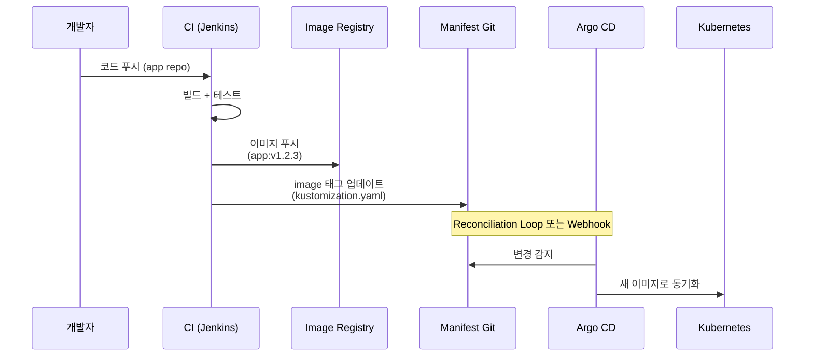
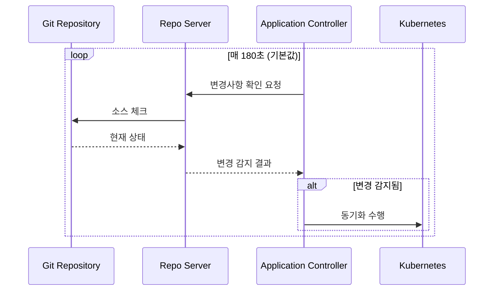
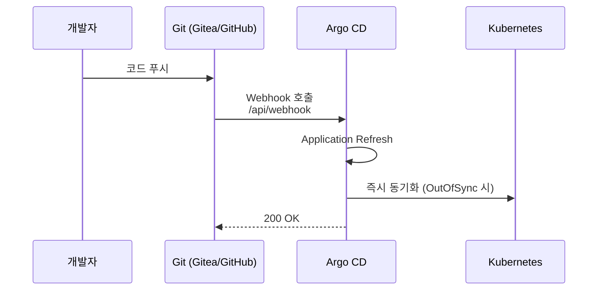
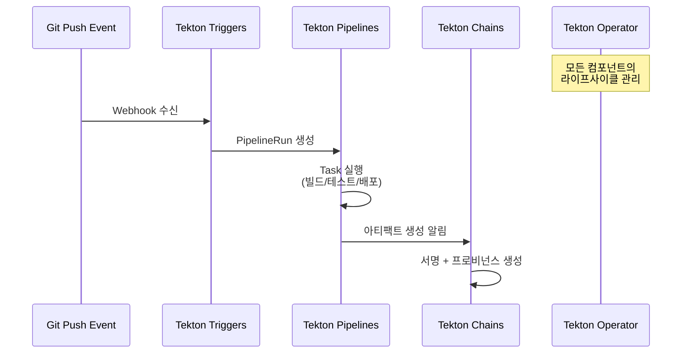
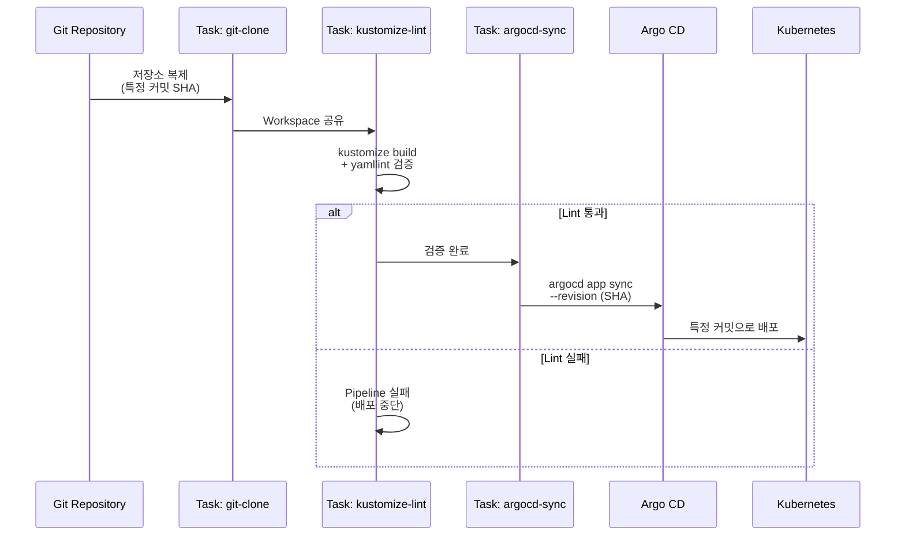
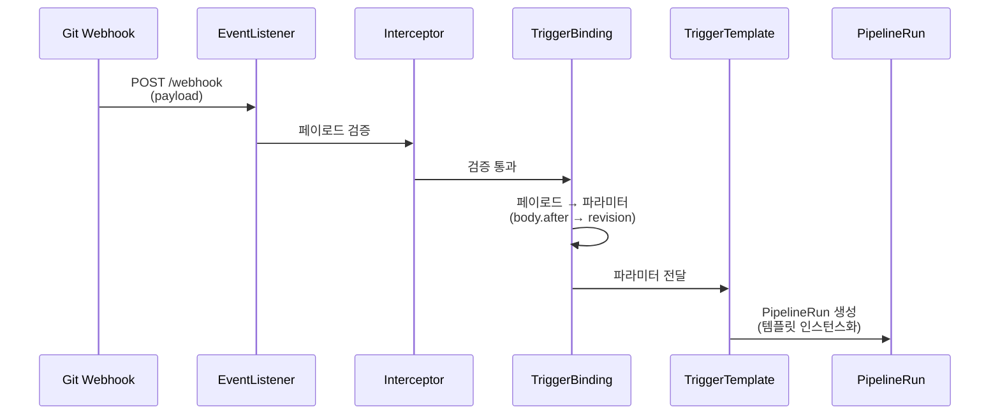
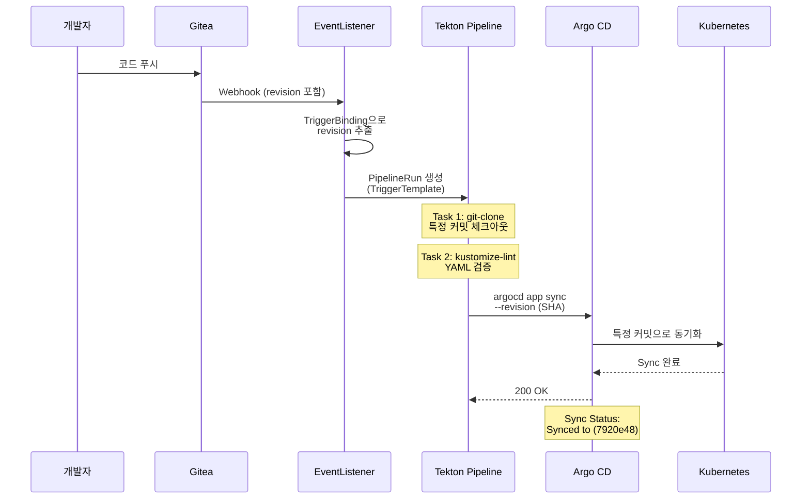

# 12. Integrating CI with Argo CD

---

## 📌 핵심 요약

> CI 시스템과 Argo CD를 통합하면 빌드부터 배포까지 완전한 자동화 파이프라인을 구축할 수 있습니다. CI는 코드 변경을 감지하여 이미지를 빌드하고, Argo CD는 Git 저장소의 매니페스트 변경을 감지하여 클러스터에 배포합니다. **Reconciliation Loop**는 주기적으로 Git 상태를 확인하고, **Webhook**은 즉시 변경을 반영하며, **Tekton**을 활용하면 매니페스트 검증과 동기화를 자동화할 수 있습니다.

---

## 🎯 학습 목표

이 내용을 읽고 나면:
- [ ] CI와 CD(GitOps)의 차이점과 통합 방법을 이해할 수 있다
- [ ] Reconciliation Loop 주기를 조정하고 Webhook을 설정할 수 있다
- [ ] Tekton Pipeline을 구성하여 매니페스트 검증과 동기화를 자동화할 수 있다
- [ ] Tekton Triggers를 활용하여 Git 이벤트 기반 파이프라인을 트리거할 수 있다
- [ ] Project Role과 JWT 토큰을 사용하여 CI에서 Argo CD를 안전하게 호출할 수 있다

---

## 📖 본문 정리

### 1. CI와 CD(GitOps)의 차이

CI(Continuous Integration)는 코드 변경이 발생할 때 빌드, 테스트, 아티팩트 생성을 수행하는 **동기식 프로세스**입니다. 커밋이나 PR 같은 이벤트를 받으면 작업을 시작하고, 완료되면 종료됩니다. 반면 CD(Continuous Deployment)를 GitOps 방식으로 구현한 Argo CD는 **비동기식 프로세스**입니다. Git 저장소를 지속적으로 감시하고, 선언된 상태와 실제 클러스터 상태의 차이를 감지하면 자동으로 동기화합니다.

**왜 CI와 CD를 분리하는가?** 빌드와 배포는 서로 다른 책임을 가지기 때문입니다. CI는 "이 코드가 올바른가?"를 검증하고, CD는 "이 상태가 실제로 반영되었는가?"를 보장합니다. 이 둘을 분리하면 배포 실패가 빌드 파이프라인에 영향을 주지 않고, 롤백도 Git 커밋 revert만으로 가능합니다.

**실무 시나리오**: Jenkins에서 Spring Boot 애플리케이션을 빌드하여 이미지를 레지스트리에 푸시하고, 매니페스트 저장소의 image 태그를 업데이트합니다. Argo CD는 매니페스트 변경을 감지하여 Kubernetes 클러스터에 새 이미지를 배포합니다.



| 특성 | CI | CD (GitOps) |
|------|-----|-------------|
| **동작 방식** | 동기식 (이벤트 시작 → 작업 → 종료) | 비동기식 (지속적 감시 → 차이 발견 → 수렴) |
| **실행 시간** | 유한 (몇 분 ~ 몇십 분) | 지속적 (무한 루프) |
| **트리거** | 이벤트 기반 (커밋, PR) | 상태 차이 감지 |
| **목적** | 빌드, 테스트, 검증 | 선언된 상태로 수렴 |

---

### 2. Reconciliation Loop

Argo CD의 **Reconciliation Loop**는 Application Controller가 일정 주기마다 Git 저장소를 확인하여 변경사항이 있는지 검사하는 메커니즘입니다. 기본적으로 180초(3분)마다 실행되며, 변경이 감지되면 자동으로 동기화를 수행합니다.

**왜 주기적으로 확인하는가?** Webhook이 실패하거나 네트워크 문제로 이벤트를 놓칠 수 있기 때문입니다. Reconciliation Loop는 최후의 안전장치(fallback) 역할을 합니다. Webhook으로 즉시 반영하고, Reconciliation Loop로 누락된 변경을 보완하는 것이 권장 패턴입니다.



#### 2.1 Reconciliation 주기 수정

Reconciliation 주기는 `argocd-cm` ConfigMap의 `timeout.reconciliation` 필드로 조정할 수 있습니다. 짧게 설정하면 변경을 빠르게 감지하지만 Git Provider의 Rate Limiting에 걸릴 수 있고, 길게 설정하면 리소스는 절약되지만 변경 반영이 지연됩니다.

**왜 기본값이 180초인가?** Git Provider의 API 호출 제한을 고려하면서도 합리적인 반영 속도를 제공하는 균형점이기 때문입니다. GitHub은 시간당 5000회, GitLab은 시간당 600회 제한이 있으므로, 수십 개의 Application을 관리한다면 주기를 너무 짧게 설정하면 제한에 걸립니다.

```yaml
# argocd-cm ConfigMap
apiVersion: v1
kind: ConfigMap
metadata:
  name: argocd-cm
  namespace: argocd
data:
  timeout.reconciliation: 120s    # 기본값: 180s (3분)
  # 0s로 설정하면 reconciliation 비활성화
```

**적용 후 재시작 필요**:
```bash
# Application Controller 재시작
kubectl rollout restart sts -n argocd \
  -l app.kubernetes.io/component=application-controller

# Repo Server 재시작
kubectl rollout restart deployment -n argocd \
  -l app.kubernetes.io/component=repo-server
```

#### 2.2 주기 조정 시 고려사항

| 주기 | 장점 | 단점 | 사용 시나리오 |
|------|------|------|--------------|
| **짧게 (< 180s)** | 빠른 변경 감지 | 시스템 부하 증가, Rate Limiting | 개발 환경, 소규모 클러스터 |
| **길게 (> 180s)** | 리소스 절약 | 변경 반영 지연 | 운영 환경, 대규모 클러스터 |
| **0s (비활성화)** | 완전한 이벤트 기반 | Webhook 필수, 장애 시 복구 어려움 | Webhook 인프라가 안정적인 환경 |

> **권장**: 기본값 180s 유지 + Webhook으로 즉시 동기화 보완. Webhook 실패를 Reconciliation Loop가 감지하는 2중 안전장치 구조가 가장 안정적입니다.

---

### 3. Webhook 설정

**Webhook**은 Git 저장소에서 푸시 이벤트가 발생하면 즉시 Argo CD에 HTTP 요청을 보내 Application을 refresh하는 메커니즘입니다. Reconciliation Loop의 최대 3분 지연을 없애고, 코드 푸시 후 수 초 내에 배포를 시작할 수 있습니다.

**왜 Webhook을 사용하는가?** Reconciliation Loop는 폴링(polling) 방식이므로 최대 3분의 지연이 발생합니다. 개발 환경에서 빠른 피드백이 필요하거나, 운영 환경에서 긴급 핫픽스를 즉시 반영해야 할 때 Webhook이 필수입니다.

**실무 시나리오**: Gitea에 매니페스트 저장소를 푸시하면, Gitea가 `https://argocd.example.com/api/webhook`으로 POST 요청을 보냅니다. Argo CD는 해당 저장소를 사용하는 Application을 찾아 즉시 refresh하고, OutOfSync가 감지되면 자동으로 동기화를 시작합니다.



#### 3.1 Webhook Secret 설정

Webhook Secret은 요청이 정당한 Git Provider에서 온 것인지 검증하는 HMAC 서명 키입니다. Secret을 설정하지 않으면 누구나 Argo CD의 webhook 엔드포인트를 호출하여 불필요한 refresh를 유발할 수 있습니다(DDoS 공격).

**왜 Secret이 필요한가?** Git Provider는 요청 본문을 Secret으로 서명하여 `X-Hub-Signature` 헤더에 포함시킵니다. Argo CD는 같은 Secret으로 서명을 검증하여 위조된 요청을 차단합니다.

```yaml
# argocd-secret 패치
apiVersion: v1
kind: Secret
metadata:
  name: argocd-secret
  namespace: argocd
type: Opaque
stringData:
  webhook.github.secret: supersecret      # GitHub
  webhook.gitlab.secret: supersecret      # GitLab
  webhook.bitbucket.secret: supersecret   # Bitbucket
  webhook.bitbucketserver.secret: supersecret
  webhook.gogs.secret: supersecret        # Gogs/Gitea
  webhook.azuredevops.secret: supersecret # Azure DevOps
```

```bash
# Secret 패치 적용
kubectl patch secret argocd-secret -n argocd \
  --patch-file argocd-secret.yaml
```

#### 3.2 Git Provider Webhook 설정 (Gitea 예시)

Gitea 저장소 설정 → Webhooks → Add Webhook에서 다음과 같이 구성합니다.

| 설정 항목 | 값 |
|----------|-----|
| **Target URL** | `https://argocd.upandrunning.local/api/webhook` |
| **HTTP Method** | POST |
| **Content Type** | application/json |
| **Secret** | (argocd-secret에 설정한 값) |
| **Trigger On** | Push Events |
| **Branch Filter** | * (전체) 또는 특정 브랜치 |

> ⚠️ **보안 주의**: Webhook Secret 미설정 시 DDoS 공격에 취약합니다. 공개 인터넷에 노출된 Argo CD는 반드시 Secret을 설정해야 합니다.

---

### 4. Tekton 개요

**Tekton**은 Kubernetes 네이티브 CI/CD 프레임워크로, CRD(Custom Resource Definition)를 사용하여 파이프라인을 선언적으로 정의합니다. Jenkins나 GitLab CI처럼 외부 시스템이 아니라 Kubernetes 클러스터 내부에서 실행되므로, Argo CD와 같은 네임스페이스에서 동작하며 RBAC으로 안전하게 통합할 수 있습니다.

**왜 Tekton을 사용하는가?** Argo CD는 배포만 담당하고 빌드나 검증 기능이 없습니다. Tekton을 함께 사용하면 매니페스트 Linting, 보안 스캔, 동기화 전 검증 등을 Kubernetes 리소스로 정의하여 GitOps 워크플로우에 CI 모범 사례를 적용할 수 있습니다.

#### 4.1 Tekton 서브프로젝트

Tekton 프로젝트는 여러 서브프로젝트로 구성되어 있으며, 각각 특정 역할을 수행합니다.



| 프로젝트 | 설명 | 사용 시나리오 |
|---------|------|--------------|
| **Tekton Pipelines** | CI/CD 파이프라인 구축을 위한 K8s CRD | 빌드, 테스트, 배포 자동화 |
| **Tekton Triggers** | 이벤트 기반 파이프라인 실행 | Git Webhook → PipelineRun 자동 생성 |
| **Tekton Chains** | 아티팩트 프로비넌스 생성/저장/서명 | SLSA 준수, 공급망 보안 |
| **Tekton Operator** | Tekton 컴포넌트 라이프사이클 관리 | 설치, 업그레이드, 설정 관리 |

#### 4.2 Tekton Pipelines 설치

```bash
# Tekton Pipelines 설치
kubectl apply -f \
  https://storage.googleapis.com/tekton-releases/pipeline/latest/release.yaml

# 설치 확인
kubectl get pods -n tekton-pipelines
```

#### 4.3 Tekton Pipelines 핵심 리소스

Tekton은 Task를 기본 단위로 하며, 여러 Task를 조합하여 Pipeline을 구성합니다. 실제 실행은 TaskRun과 PipelineRun 리소스를 생성하여 수행합니다.

**왜 Task와 TaskRun을 분리하는가?** Task는 재사용 가능한 템플릿이고, TaskRun은 특정 파라미터로 인스턴스화된 실행입니다. 하나의 Task를 여러 파라미터로 여러 번 실행할 수 있습니다.

| 리소스 | 설명 | 예시 |
|--------|------|------|
| **Task** | 특정 작업을 수행하는 단계들의 집합 (템플릿) | git-clone, maven-build, docker-push |
| **TaskRun** | Task의 인스턴스화 (실행) | git-clone-run-abc123 |
| **Pipeline** | 여러 Task를 조합한 워크플로우 | build-test-deploy |
| **PipelineRun** | Pipeline의 인스턴스화 (실행) | build-test-deploy-run-xyz789 |

---

### 5. Tekton Pipeline 구축

Argo CD와 Tekton을 통합하려면 **매니페스트 검증(Linting) → Argo CD 동기화** 워크플로우를 구성해야 합니다. Git에서 매니페스트를 복제하고, Kustomize로 빌드한 후 yamllint로 검증하며, 문제가 없으면 Argo CD CLI로 Application을 동기화합니다.

**왜 이런 워크플로우가 필요한가?** 잘못된 YAML을 배포하면 클러스터에 적용되지 않거나 기존 리소스가 삭제될 수 있습니다. CI 단계에서 검증하면 문제를 사전에 차단하고, 특정 커밋 SHA로 동기화하여 정확한 버전 관리를 할 수 있습니다.

**실무 시나리오**: 개발자가 Kustomize overlay를 수정하여 푸시합니다. Tekton이 자동으로 kustomize build를 실행하여 최종 YAML을 생성하고, yamllint로 문법 오류를 검사한 후, 문제가 없으면 Argo CD에 sync 명령을 보내 해당 커밋으로 배포합니다.



#### 5.1 Task 정의 예시

**Git Clone Task**:

이 Task는 Git 저장소를 복제하고 특정 리비전으로 체크아웃합니다. `workspaces.output`을 사용하여 복제한 파일을 다음 Task에 전달합니다.

```yaml
apiVersion: tekton.dev/v1beta1
kind: Task
metadata:
  name: git-clone
spec:
  params:
    - name: repo-url
      type: string
    - name: revision
      type: string
      default: main
  workspaces:
    - name: output
  steps:
    - name: clone
      image: alpine/git
      script: |
        git clone $(params.repo-url) $(workspaces.output.path)
        cd $(workspaces.output.path)
        git checkout $(params.revision)
```

**Kustomize Lint Task**:

이 Task는 Kustomize로 매니페스트를 빌드하고 yamllint로 검증합니다. 두 단계를 거쳐 최종 YAML의 문법 오류와 스타일을 확인합니다.

**왜 kustomize build 후 yamllint를 하는가?** Kustomize overlay는 여러 파일이 합쳐지므로, 개별 파일은 정상이어도 빌드 결과가 잘못될 수 있습니다. 최종 YAML을 검증해야 실제 배포될 내용을 확인할 수 있습니다.

```yaml
apiVersion: tekton.dev/v1beta1
kind: Task
metadata:
  name: kustomize-lint
spec:
  params:
    - name: manifests-dir
      type: string
    - name: yamllint-configmap
      default: yamllint-config
  workspaces:
    - name: source
  volumes:
    - name: yamllint-config
      configMap:
        name: '$(params.yamllint-configmap)'
    - name: shared
      emptyDir: {}
  steps:
    - name: kustomize-build
      image: registry.k8s.io/kustomize/kustomize:v4.5.7
      volumeMounts:
        - name: shared
          mountPath: /shared
      script: |
        kustomize build $(workspaces.source.path)/$(params.manifests-dir) \
          > /shared/manifests.yaml
    - name: yamllint
      image: cytopia/yamllint
      volumeMounts:
        - name: yamllint-config
          mountPath: /config
        - name: shared
          mountPath: /shared
      script: |
        yamllint -c /config/yamllint.yaml /shared/manifests.yaml
```

**Argo CD Sync Task**:

이 Task는 Argo CD CLI를 사용하여 Application을 동기화합니다. JWT 토큰이 환경변수로 제공되면 로그인 없이 바로 sync 명령을 실행할 수 있습니다.

**왜 JWT 토큰을 사용하는가?** CI 파이프라인은 자동화된 프로세스이므로 사용자 계정으로 로그인할 수 없습니다. Project Role로 생성한 JWT 토큰은 특정 권한만 가지므로 최소 권한 원칙을 준수하면서 안전하게 API를 호출할 수 있습니다.

```yaml
apiVersion: tekton.dev/v1beta1
kind: Task
metadata:
  name: argocd-app-sync
spec:
  params:
    - name: application-name
      type: string
    - name: revision
      type: string
    - name: argocd-version
      default: v2.8.0
    - name: flags
      default: ""
  stepTemplate:
    envFrom:
      - configMapRef:
          name: argocd-env-configmap  # ARGOCD_SERVER
      - secretRef:
          name: argocd-env-secret     # ARGOCD_AUTH_TOKEN
  steps:
    - name: sync-app
      image: quay.io/argoproj/argocd:$(params.argocd-version)
      script: |
        # JWT 토큰이 있으면 로그인 불필요
        if [ -z "$ARGOCD_AUTH_TOKEN" ]; then
          argocd login "$ARGOCD_SERVER" \
            --username="$ARGOCD_USERNAME" \
            --password="$ARGOCD_PASSWORD"
        fi

        # 특정 리비전으로 동기화
        argocd app sync "$(params.application-name)" \
          --revision "$(params.revision)" $(params.flags)

        # 동기화 완료 대기
        argocd app wait "$(params.application-name)" \
          --health $(params.flags)
```

#### 5.2 Pipeline 정의

Pipeline은 여러 Task를 `runAfter`로 순서를 지정하여 조합합니다. 앞 단계가 실패하면 뒤 단계는 실행되지 않으므로, Lint 실패 시 배포를 막을 수 있습니다.

**왜 Task를 분리하는가?** 각 Task는 독립적으로 재사용할 수 있고, 실패한 Task만 다시 실행할 수 있습니다. 또한 병렬 실행도 가능하여 빌드 시간을 단축할 수 있습니다.

```yaml
apiVersion: tekton.dev/v1beta1
kind: Pipeline
metadata:
  name: lint-sync-argocd
spec:
  params:
    - name: repo-url
      type: string
    - name: argocd-revision
      type: string
      default: main
    - name: manifests-dir
      type: string
    - name: app-name
      type: string
    - name: argocd-flags
      type: string
      default: ""
  workspaces:
    - name: shared-data
  tasks:
    # 1단계: Git Clone
    - name: git-clone
      taskRef:
        name: git-clone
      params:
        - name: repo-url
          value: $(params.repo-url)
        - name: revision
          value: $(params.argocd-revision)
      workspaces:
        - name: output
          workspace: shared-data

    # 2단계: 매니페스트 검증 (git-clone 완료 후)
    - name: kustomize-lint
      taskRef:
        name: kustomize-lint
      runAfter:
        - git-clone
      params:
        - name: manifests-dir
          value: $(params.manifests-dir)
      workspaces:
        - name: source
          workspace: shared-data

    # 3단계: Argo CD 동기화 (lint 완료 후)
    - name: argocd-sync
      taskRef:
        name: argocd-app-sync
      runAfter:
        - kustomize-lint
      params:
        - name: application-name
          value: $(params.app-name)
        - name: revision
          value: $(params.argocd-revision)
        - name: flags
          value: $(params.argocd-flags)
```

#### 5.3 Pipeline 주요 속성

| 속성 | 설명 | 예시 |
|------|------|------|
| `params` | 파이프라인/태스크 실행 파라미터 | repo-url, revision, app-name |
| `workspaces` | Task 간 데이터 공유를 위한 볼륨 | PVC, emptyDir, ConfigMap |
| `taskRef` | 참조할 Task 지정 | name: git-clone |
| `runAfter` | Task 실행 순서 제어 | runAfter: [git-clone] |

---

### 6. Project Role과 JWT 토큰

**Project Role**은 Argo CD의 RBAC 메커니즘으로, 사용자 계정이 아닌 자동화 프로세스를 위한 서비스 계정 역할을 합니다. CI 파이프라인에서 Argo CD API를 호출할 때 사용자 ID/PW 대신 JWT 토큰을 사용하면 보안이 강화되고 권한을 세밀하게 제어할 수 있습니다.

**왜 사용자 계정 대신 Project Role을 사용하는가?** 사용자 계정은 모든 권한을 가질 수 있지만, Project Role은 특정 프로젝트의 특정 리소스에만 접근하도록 제한할 수 있습니다. CI 파이프라인이 침해되어도 피해 범위를 최소화할 수 있습니다.

**실무 시나리오**: Tekton Pipeline에서 `argocd app sync` 명령을 실행하려면 인증이 필요합니다. Project Role로 생성한 JWT 토큰을 Secret에 저장하고, Task의 환경변수로 주입하면 로그인 없이 API를 호출할 수 있습니다.

#### 6.1 Project Role 생성

```bash
# Project Role 생성 (default 프로젝트에 tekton 역할)
argocd proj role create default tekton

# 권한 추가: Application get/sync 허용
argocd proj role add-policy default tekton \
  --action get --permission allow --object "*"
argocd proj role add-policy default tekton \
  --action sync --permission allow --object "*"
```

#### 6.2 선언적 Project Role 정의

AppProject CRD에 직접 역할과 정책을 정의하면 GitOps 방식으로 관리할 수 있습니다.

**왜 선언적으로 정의하는가?** CLI 명령은 수동 실행이므로 재현성이 떨어지고 버전 관리가 어렵습니다. YAML로 정의하면 Git에 커밋하여 변경 이력을 추적하고, 다른 환경에 동일하게 적용할 수 있습니다.

```yaml
apiVersion: argoproj.io/v1alpha1
kind: AppProject
metadata:
  name: default
  namespace: argocd
spec:
  roles:
    - name: tekton
      policies:
        # 형식: p, proj:<project>:<role>, <resource>, <action>, <object>, allow/deny
        - p, proj:default:tekton, applications, get, default/*, allow
        - p, proj:default:tekton, applications, sync, default/*, allow
```

#### 6.3 JWT 토큰 생성

JWT 토큰은 만료 시간을 설정할 수 있으며, 토큰이 만료되면 갱신해야 합니다. 운영 환경에서는 짧은 만료 시간을 설정하고 자동 갱신 메커니즘을 구축하는 것이 권장됩니다.

**왜 만료 시간을 설정하는가?** 토큰이 유출되어도 시간이 지나면 자동으로 무효화되므로 보안 리스크를 줄일 수 있습니다. 12시간이나 1일 단위로 설정하여 정기적으로 갱신하는 것이 좋습니다.

```bash
# JWT 토큰 생성 (만료 시간 12시간)
PROJECT_ROLE_JWT_TOKEN=$(argocd proj role create-token default tekton \
  -e 12h --token-only)

# Secret 생성
kubectl create secret generic argocd-env-secret \
  --from-literal=ARGOCD_AUTH_TOKEN=$PROJECT_ROLE_JWT_TOKEN \
  --namespace webhooks

# ConfigMap 생성 (서버 주소)
kubectl create configmap argocd-env-configmap \
  --from-literal=ARGOCD_SERVER=argocd.upandrunning.local \
  --namespace webhooks
```

---

### 7. Tekton Triggers

**Tekton Triggers**는 외부 이벤트(Git Webhook, Kafka 메시지 등)를 받아 PipelineRun을 자동으로 생성하는 서브프로젝트입니다. EventListener가 HTTP 엔드포인트를 제공하고, TriggerBinding으로 페이로드를 파라미터로 변환하며, TriggerTemplate으로 PipelineRun을 생성합니다.

**왜 Triggers가 필요한가?** Pipeline을 수동으로 실행하려면 매번 PipelineRun YAML을 작성해야 하지만, Triggers를 사용하면 Git 푸시 이벤트만으로 자동으로 파이프라인이 실행됩니다. 완전한 CI/CD 자동화를 구현할 수 있습니다.

**실무 시나리오**: 개발자가 매니페스트 저장소에 푸시하면, Gitea가 Tekton EventListener로 Webhook을 보냅니다. TriggerBinding이 커밋 SHA를 추출하고, TriggerTemplate이 해당 SHA로 PipelineRun을 생성하여 Lint → Sync 파이프라인을 실행합니다.

#### 7.1 설치

```bash
# Tekton Triggers 설치
kubectl apply -f \
  https://storage.googleapis.com/tekton-releases/triggers/latest/release.yaml

# Interceptors 설치 (이벤트 처리 로직)
kubectl apply -f \
  https://storage.googleapis.com/tekton-releases/triggers/latest/interceptors.yaml
```

#### 7.2 Tekton Triggers 리소스



| 리소스 | 설명 | 역할 |
|--------|------|------|
| **EventListener** | Webhook 이벤트를 수신하는 Pod | HTTP 서버 역할, Ingress로 노출 |
| **Trigger** | 이벤트 처리 규칙 (TriggerTemplate + TriggerBinding) | 어떤 이벤트를 어떻게 처리할지 정의 |
| **TriggerTemplate** | TaskRun/PipelineRun 생성 템플릿 | 파라미터를 받아 실행 리소스 생성 |
| **TriggerBinding** | 이벤트 페이로드에서 파라미터 추출 | JSON 경로로 값 추출 (예: body.after) |
| **Interceptor** | 페이로드 검증, 필터링, 변환 | 특정 브랜치만 처리, Secret 검증 등 |

#### 7.3 TriggerBinding

TriggerBinding은 Git Webhook 페이로드에서 필요한 정보를 추출하여 파라미터로 변환합니다. 예를 들어 `body.after`는 푸시 후 커밋 SHA를 의미하며, 이를 `revision` 파라미터로 매핑합니다.

**왜 body.after를 사용하는가?** Git Webhook은 푸시 전 커밋(`before`)과 푸시 후 커밋(`after`)을 모두 전달합니다. 배포는 최신 상태인 `after`를 사용해야 하므로 이를 추출합니다.

```yaml
apiVersion: triggers.tekton.dev/v1beta1
kind: TriggerBinding
metadata:
  name: tekton-triggers-argocd
spec:
  params:
    # Git 이벤트 페이로드에서 리비전 추출
    - name: revision
      value: $(body.after)    # 푸시 후 커밋 SHA
```

#### 7.4 TriggerTemplate

TriggerTemplate은 파라미터를 받아 PipelineRun을 생성하는 템플릿입니다. `generateName`을 사용하면 Kubernetes가 자동으로 고유한 이름을 생성합니다.

**왜 generateName을 사용하는가?** 같은 파이프라인을 여러 번 실행하면 이름이 충돌합니다. `generateName: lint-sync-argocd-`로 설정하면 `lint-sync-argocd-abc123` 같은 고유 이름이 자동 생성됩니다.

```yaml
apiVersion: triggers.tekton.dev/v1beta1
kind: TriggerTemplate
metadata:
  name: tekton-triggers-argocd
spec:
  params:
    - name: revision
      description: Git revision
  resourcetemplates:
    - apiVersion: tekton.dev/v1beta1
      kind: PipelineRun
      metadata:
        generateName: lint-sync-argocd-
      spec:
        pipelineRef:
          name: lint-sync-argocd
        workspaces:
          - name: shared-data
            volumeClaimTemplate:
              spec:
                accessModes: [ReadWriteOnce]
                resources:
                  requests:
                    storage: 1Gi
        params:
          - name: repo-url
            value: https://git.upandrunning.local/upandrunning/simple-go.git
          - name: argocd-revision
            value: $(tt.params.revision)    # TriggerTemplate 파라미터 참조
          - name: manifests-dir
            value: deploy/overlays/default
          - name: app-name
            value: simple-go
          - name: argocd-flags
            value: --insecure --grpc-web
```

#### 7.5 EventListener

EventListener는 Trigger를 참조하여 실제 HTTP 서버를 실행하는 Pod를 생성합니다. ServiceAccount를 지정하여 RBAC 권한을 부여해야 합니다.

**왜 ServiceAccount가 필요한가?** EventListener는 PipelineRun을 생성해야 하므로 Kubernetes API를 호출할 권한이 필요합니다. ServiceAccount에 `edit` 또는 커스텀 Role을 바인딩하여 권한을 부여합니다.

```yaml
apiVersion: triggers.tekton.dev/v1beta1
kind: EventListener
metadata:
  name: tekton-triggers-argocd
spec:
  serviceAccountName: tekton-triggers-sa    # RBAC용 SA
  triggers:
    - name: gitea-push
      bindings:
        - ref: tekton-triggers-argocd       # TriggerBinding 참조
      template:
        ref: tekton-triggers-argocd         # TriggerTemplate 참조
```

#### 7.6 Ingress 설정

EventListener는 Service를 자동 생성하므로, Ingress로 외부에 노출하여 Git Provider가 접근할 수 있도록 합니다.

**왜 별도 도메인을 사용하는가?** Argo CD Webhook(`/api/webhook`)과 Tekton Webhook을 구분하기 위해서입니다. Argo CD는 Application refresh만 하고, Tekton은 전체 파이프라인을 실행하므로 용도가 다릅니다.

```yaml
apiVersion: networking.k8s.io/v1
kind: Ingress
metadata:
  name: tekton-triggers-argocd
spec:
  ingressClassName: nginx
  rules:
    - host: tekton-triggers-argocd.upandrunning.local
      http:
        paths:
          - path: /webhook
            pathType: Prefix
            backend:
              service:
                name: el-tekton-triggers-argocd  # EventListener 서비스
                port:
                  number: 8080
```

---

### 8. 전체 워크플로우

Argo CD Webhook과 Tekton Triggers를 함께 사용하면 두 가지 자동화 경로를 구성할 수 있습니다.

**경로 1 (Argo CD Webhook)**: Git 푸시 → Argo CD Webhook → Application Refresh → 자동 동기화. 검증 없이 빠르게 반영됩니다.

**경로 2 (Tekton Triggers)**: Git 푸시 → Tekton Webhook → Lint 파이프라인 → Argo CD Sync. 검증 후 특정 커밋으로 동기화합니다.

**왜 두 가지 방법을 함께 사용하는가?** 간단한 변경은 Argo CD Webhook으로 빠르게 반영하고, 중요한 변경은 Tekton Pipeline으로 검증한 후 배포할 수 있습니다. Git 저장소나 브랜치별로 다른 전략을 적용할 수 있습니다.



---

## 🔍 심화 학습

### Webhook vs Tekton Triggers 비교

Argo CD Webhook은 Application을 즉시 refresh하여 빠르게 변경을 반영하지만, 검증 없이 배포됩니다. Tekton Triggers는 Lint, 테스트 등 CI 단계를 수행한 후 배포하므로 안전하지만 복잡도가 높습니다.

**실무 선택 기준**: 개발 환경은 Argo CD Webhook으로 빠른 피드백을 제공하고, 운영 환경은 Tekton Triggers로 검증 후 배포하는 것이 일반적입니다.

| 구분 | Argo CD Webhook | Tekton Triggers |
|------|-----------------|-----------------|
| **기능** | Application Refresh만 | 전체 CI 파이프라인 실행 |
| **검증** | 없음 (즉시 동기화) | 매니페스트 Linting, 테스트 등 |
| **리비전 제어** | 브랜치 기반 (자동 감지) | 특정 커밋 SHA 기반 (정확한 버전) |
| **확장성** | 제한적 | 무제한 (Task 조합) |
| **복잡도** | 단순 (Secret 설정만) | 높음 (Pipeline, Trigger, RBAC) |
| **사용 사례** | 개발 환경, 빠른 반영 | 운영 환경, 검증 필수 |

### Polling vs Webhook 비교

**Polling (Reconciliation Loop)**은 주기적으로 Git을 확인하므로 Webhook 실패 시 fallback으로 동작하지만, 최대 3분 지연이 발생합니다. **Webhook**은 즉시 반영되지만 네트워크 문제나 Git Provider 장애 시 이벤트를 놓칠 수 있습니다.

**왜 둘 다 사용하는가?** Webhook은 99%의 경우를 즉시 처리하고, Polling은 나머지 1%의 실패 케이스를 보완하는 2중 안전장치입니다. 운영 환경에서는 둘 다 활성화하는 것이 권장됩니다.

| 구분 | Polling (Reconciliation) | Webhook |
|------|--------------------------|---------|
| **반영 속도** | 최대 3분 지연 | 수 초 내 즉시 |
| **신뢰성** | 높음 (항상 동작) | 중간 (네트워크 의존) |
| **부하** | 지속적 API 호출 | 이벤트 발생 시만 |
| **설정 복잡도** | 낮음 (기본 활성화) | 중간 (Secret, Ingress) |
| **사용 전략** | Fallback 용도 | 주요 경로 |

### Image Updater와 CI 통합

**Argo CD Image Updater**는 컨테이너 레지스트리를 감시하여 새 이미지가 푸시되면 자동으로 매니페스트를 업데이트하는 도구입니다. CI에서 이미지를 빌드하면 Image Updater가 감지하여 Git에 커밋하고, Argo CD가 배포합니다.

**왜 Image Updater를 사용하는가?** CI 파이프라인에서 매니페스트 저장소를 직접 수정하려면 Git 인증과 커밋 로직이 필요합니다. Image Updater를 사용하면 CI는 이미지만 푸시하고, 나머지는 Image Updater가 자동으로 처리하여 관심사를 분리할 수 있습니다.

**실무 시나리오**: Jenkins에서 Spring Boot 이미지를 `myapp:1.2.3`으로 빌드하여 레지스트리에 푸시합니다. Image Updater가 새 태그를 감지하여 `kustomization.yaml`의 `newTag: 1.2.3`을 업데이트하고 Git에 커밋합니다. Argo CD는 매니페스트 변경을 감지하여 새 이미지로 배포합니다.

### 별도 저장소 전략

실무에서는 애플리케이션 코드와 매니페스트를 별도 저장소로 분리하는 것이 권장됩니다. 코드 저장소는 개발자가 자주 커밋하고, 매니페스트 저장소는 배포 시점에만 변경됩니다.

**왜 저장소를 분리하는가?** 코드 변경이 곧 배포로 이어지지 않도록 제어할 수 있고, 매니페스트 권한을 별도로 관리하여 보안을 강화할 수 있습니다. 또한 하나의 매니페스트 저장소에서 여러 마이크로서비스를 관리할 수 있습니다.

**구조 예시**:
- `app-code` 저장소: Java/Go/Python 코드
- `app-manifests` 저장소: Kustomize overlays, Helm charts

CI는 `app-code`를 빌드하여 이미지를 푸시하고, `app-manifests`의 태그를 업데이트합니다. Argo CD는 `app-manifests`만 감시합니다.

### yamllint 설정

yamllint는 YAML 문법 오류와 스타일을 검사하는 도구입니다. Kubernetes YAML은 들여쓰기 규칙이 엄격하므로, 잘못된 공백이나 탭으로 인한 배포 실패를 사전에 방지할 수 있습니다.

**왜 yamllint가 필요한가?** Kubernetes는 잘못된 YAML을 적용하면 에러 메시지만 출력하고 배포에 실패합니다. 클러스터에 적용하기 전에 CI 단계에서 검증하면 문제를 빠르게 발견할 수 있습니다.

```yaml
# yamllint-configmap
apiVersion: v1
kind: ConfigMap
metadata:
  name: yamllint-config
data:
  yamllint.yaml: |
    rules:
      document-start: disable      # --- 체크 비활성화
      indentation:
        indent-sequences: false    # 시퀀스 들여쓰기 규칙 완화
      line-length:
        max: 120                   # 한 줄 최대 길이
```

---

## 💡 실무 적용 포인트

### 통합 전략 선택 가이드

프로젝트 요구사항에 따라 적절한 통합 방법을 선택해야 합니다. 간단한 환경은 기본 Reconciliation Loop만으로도 충분하지만, 빠른 반영이 필요하면 Webhook을, 검증이 필요하면 Tekton을 추가합니다.

| 요구사항 | 권장 방법 | 이유 |
|----------|----------|------|
| 빠른 변경 반영만 필요 | Webhook (Argo CD 직접) | 설정 간단, 수 초 내 반영 |
| 매니페스트 검증 필요 | Tekton Pipeline + Linting | CI 단계에서 문제 차단 |
| 특정 커밋 기반 배포 | Tekton Triggers (revision 전달) | 정확한 버전 관리 |
| 복잡한 CI 워크플로우 | Tekton 전체 스택 | 빌드, 테스트, 스캔, 배포 통합 |
| 간단한 환경 | Reconciliation Loop 기본값 유지 | 추가 설정 불필요 |

### 주의할 점 / 흔한 실수

- ⚠️ **Reconciliation 주기**: 너무 짧으면 Rate Limiting 발생 (GitHub 5000회/시간, GitLab 600회/시간)
- ⚠️ **Webhook Secret**: 미설정 시 DDoS 공격 취약. 공개 인터넷 노출 시 필수 설정
- ⚠️ **Project Role 범위**: 최소 권한 원칙 적용 (get, sync만). update, delete는 부여하지 않음
- ⚠️ **JWT 토큰 만료**: 만료 시간 설정 및 갱신 자동화 필요 (CronJob으로 주기적 갱신)
- ⚠️ **Tekton SA RBAC**: EventListener Pod가 PipelineRun 생성 권한 필요 (Role + RoleBinding)
- ⚠️ **targetRevision 제거**: Tekton 통합 시 `targetRevision: HEAD` 제거하여 자동 동기화 비활성화
- ⚠️ **Workspace 용량**: PVC 크기 부족 시 git-clone 실패. 대형 저장소는 1Gi 이상 설정

### 면접에서 나올 수 있는 질문

**Q: CI와 CD(GitOps)의 근본적인 차이점은?**
A: CI는 코드 변경을 받아 빌드와 테스트를 수행하는 동기식 프로세스이고, CD(GitOps)는 Git 저장소를 지속적으로 감시하여 선언된 상태로 수렴시키는 비동기식 프로세스입니다. CI는 유한한 작업이고, CD는 무한 루프입니다.

**Q: Argo CD의 Reconciliation Loop 기본 주기는?**
A: 180초(3분)입니다. `argocd-cm` ConfigMap의 `timeout.reconciliation` 필드로 조정할 수 있습니다.

**Q: Webhook과 Reconciliation Loop를 함께 사용하는 이유는?**
A: Webhook은 즉시 반영되지만 네트워크 문제로 이벤트를 놓칠 수 있고, Reconciliation Loop는 주기적으로 확인하여 누락된 변경을 보완하기 때문입니다. 2중 안전장치 역할입니다.

**Q: Tekton Pipeline에서 Task 간 데이터를 공유하는 방법은?**
A: Workspace를 사용합니다. PVC, emptyDir, ConfigMap을 Workspace로 지정하여 여러 Task가 같은 볼륨을 마운트하면 파일을 공유할 수 있습니다.

**Q: Project Role과 일반 사용자 계정의 차이점은?**
A: Project Role은 특정 프로젝트의 특정 리소스에만 접근하도록 제한할 수 있는 서비스 계정 역할이고, 일반 사용자 계정은 모든 권한을 가질 수 있습니다. CI/CD 자동화는 Project Role을 사용하여 최소 권한 원칙을 준수해야 합니다.

**Q: 왜 애플리케이션 코드와 매니페스트를 별도 저장소로 분리하는가?**
A: 코드 변경이 곧 배포로 이어지지 않도록 제어할 수 있고, 매니페스트 권한을 별도로 관리하여 보안을 강화할 수 있습니다. 또한 하나의 매니페스트 저장소에서 여러 마이크로서비스를 관리할 수 있어 운영 효율이 높아집니다.

---

## ✅ 핵심 개념 체크리스트

- [ ] CI(동기식)와 CD/GitOps(비동기식)의 차이를 이해했는가?
- [ ] Reconciliation Loop 주기 조정 방법과 주의사항을 알고 있는가?
- [ ] Webhook 설정 방법과 보안 고려사항을 이해했는가?
- [ ] Tekton의 Task, Pipeline, PipelineRun 관계를 구분할 수 있는가?
- [ ] TriggerBinding, TriggerTemplate, EventListener의 역할을 알고 있는가?
- [ ] Project Role과 JWT 토큰을 생성하고 사용할 수 있는가?
- [ ] 왜 Polling과 Webhook을 함께 사용하는지 설명할 수 있는가?
- [ ] 왜 애플리케이션 코드와 매니페스트를 별도 저장소로 분리하는지 이해했는가?

---

## 🔗 참고 자료

- 📄 공식 문서: [Argo CD Webhook Configuration](https://argo-cd.readthedocs.io/en/stable/operator-manual/webhook/)
- 📄 Tekton: [Tekton Pipelines Documentation](https://tekton.dev/docs/pipelines/)
- 📄 Tekton Triggers: [Tekton Triggers Documentation](https://tekton.dev/docs/triggers/)
- 📄 Project Roles: [Argo CD RBAC](https://argo-cd.readthedocs.io/en/stable/operator-manual/rbac/)
- 📄 Image Updater: [Argo CD Image Updater](https://argocd-image-updater.readthedocs.io/)
- 🛠️ yamllint: [yamllint Documentation](https://yamllint.readthedocs.io/)
- 🛠️ Tekton CLI: [tkn CLI](https://tekton.dev/docs/cli/)

---
