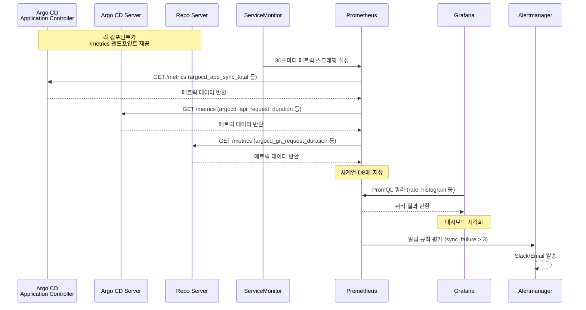
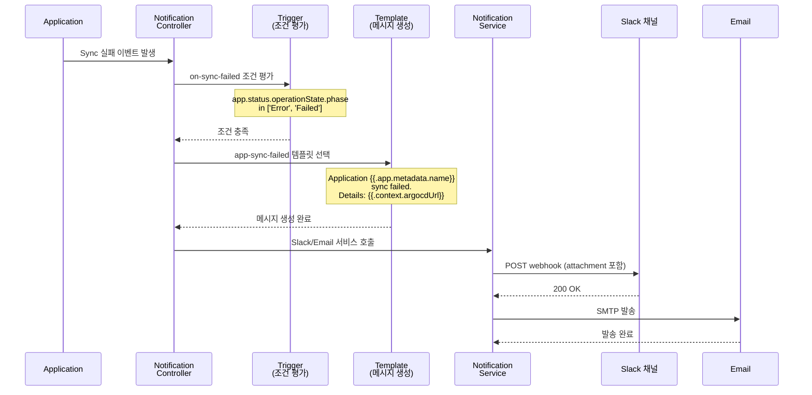
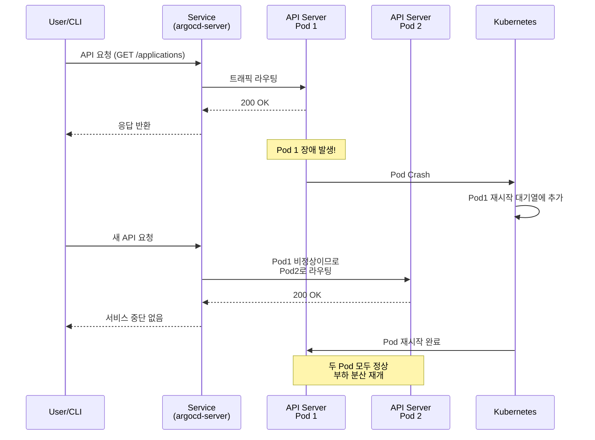
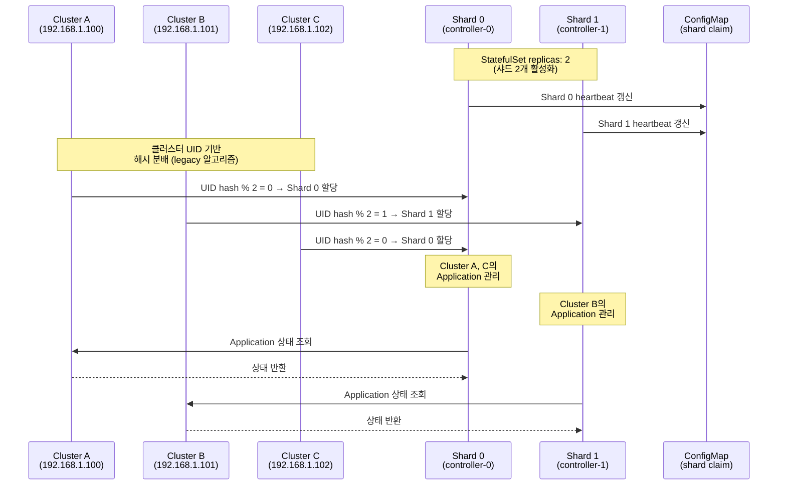
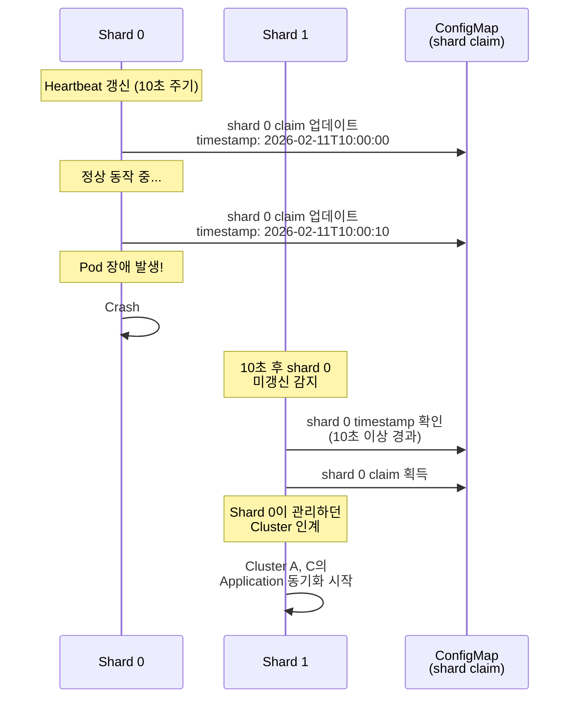

# 13. Operationalizing Argo CD

---

## 📌 핵심 요약

엔터프라이즈 환경에서 Argo CD를 운영하려면 단순히 설치하는 것을 넘어서 실시간 모니터링, 장애 알림, 고가용성 구성, 그리고 확장성 전략이 필요합니다. **왜 이러한 운영 모범 사례가 필요한가?** 프로덕션에서 수십 개의 애플리케이션을 관리하다 보면 수동 모니터링으로는 장애를 놓치기 쉽고, 단일 인스턴스로는 부하를 감당할 수 없기 때문입니다. 이 장에서는 Prometheus/Grafana를 통한 메트릭 수집, Argo CD Notifications를 통한 자동 알림, 고가용성(HA) 구성, 그리고 샤딩을 통한 확장성 전략을 다룹니다.

---

## 🎯 학습 목표

이 내용을 읽고 나면:
- [ ] Prometheus Stack을 설치하고 Argo CD 메트릭을 수집할 수 있다
- [ ] Grafana 대시보드로 Argo CD를 모니터링할 수 있다
- [ ] Argo CD Notifications를 설정하여 Slack/Mattermost에 알림을 보낼 수 있다
- [ ] 고가용성(HA) 모드로 Argo CD를 배포할 수 있다
- [ ] 샤딩을 통해 대규모 클러스터 환경에서 확장할 수 있다

---

## 📖 본문 정리

### 1. 모니터링 개요

#### 1.1 왜 Argo CD UI만으로는 부족한가?

Argo CD UI는 "무엇이 실패했는가?"를 직관적으로 보여주지만, "왜 실패했는가?"와 "얼마나 자주 실패하는가?"를 분석하기 어렵습니다. 예를 들어, 애플리케이션 동기화가 실패했을 때 UI에서는 로그를 확인할 수 있지만, 지난 한 달간 동기화 실패율 추이를 보려면 Prometheus와 Grafana 같은 시계열 데이터베이스가 필요합니다. 또한 여러 Argo CD 인스턴스를 운영하는 멀티 클러스터 환경에서는 통합 모니터링 대시보드가 필수입니다.

**모니터링 도구 비교**

| 도구 | 역할 | 강점 | 제약 |
|------|------|------|------|
| **Argo CD UI** | 애플리케이션 상태, 이슈 트리아지 | 직관적 시각화, 빠른 문제 파악 | 시계열 분석 불가, 단일 인스턴스 뷰 |
| **Prometheus** | 시계열 메트릭 수집/저장 | 실시간 모니터링, 알림 기능 | 시각화 기능 제한적 |
| **Grafana** | 메트릭 시각화, 대시보드 | 통합 뷰, 히스토리 분석 | 메트릭 수집 기능 없음 |

**실무 예시**: 프로덕션 환경에서 Argo CD가 관리하는 애플리케이션이 50개를 넘어가면서 동기화 실패가 가끔씩 발생했습니다. UI로는 개별 실패만 확인할 수 있었지만, Prometheus 메트릭을 Grafana에서 시각화하니 특정 시간대(새벽 2시)에 실패가 집중되는 패턴을 발견했고, 원인이 Git 저장소의 scheduled maintenance임을 파악했습니다.

---

### 2. Prometheus Stack 설치

#### 2.1 Helm을 통한 설치

Prometheus Stack은 Prometheus, Grafana, Alertmanager를 하나의 Helm 차트로 제공하므로 운영자는 각 컴포넌트를 개별적으로 설치하고 연동하는 수고를 덜 수 있습니다.

```bash
# Prometheus Helm 저장소 추가
helm repo add prometheus-community \
  https://prometheus-community.github.io/helm-charts

# 저장소 업데이트
helm repo update

# Prometheus Stack 설치 (Grafana 포함)
helm upgrade -i kube-prometheus-stack -n monitoring --create-namespace \
  --values prometheus-values.yaml \
  prometheus-community/kube-prometheus-stack
```

#### 2.2 Prometheus Values 설정

```yaml
# prometheus-values.yaml
grafana:
  dashboards:
    default:
      argocd:
        # Argo CD 공식 대시보드 자동 설치
        url: https://raw.githubusercontent.com/argoproj/argo-cd/master/examples/dashboard.json
```

#### 2.3 설치 확인

```bash
kubectl get pods -n monitoring

# 예상 출력
# alertmanager-kube-prometheus-stack-alertmanager-0   2/2     Running
# kube-prometheus-stack-grafana-5c77f67c66-zvnnr      3/3     Running
# kube-prometheus-stack-operator-5c68cddf55-khf97    1/1     Running
# prometheus-kube-prometheus-stack-prometheus-0      2/2     Running
```

---

### 3. Argo CD Prometheus 연동

#### 3.1 메트릭 수집 흐름

Argo CD의 각 컴포넌트는 `/metrics` 엔드포인트를 제공하며, Prometheus는 ServiceMonitor를 통해 이를 주기적으로 수집합니다. **왜 ServiceMonitor를 사용하는가?** Kubernetes 환경에서 Pod가 재시작되거나 IP가 바뀌어도 Service를 통해 자동으로 새 엔드포인트를 발견하기 때문입니다.



#### 3.2 ServiceMonitor 설정

```yaml
# argocd-metrics-values.yaml
controller:
  metrics:
    enabled: true
    serviceMonitor:
      enabled: true
      additionalLabels:
        release: kube-prometheus-stack    # Prometheus Helm 릴리스 이름과 일치 필수

server:
  metrics:
    enabled: true
    serviceMonitor:
      enabled: true
      additionalLabels:
        release: kube-prometheus-stack

repoServer:
  metrics:
    enabled: true
    serviceMonitor:
      enabled: true
      additionalLabels:
        release: kube-prometheus-stack

applicationSet:
  metrics:
    enabled: true
    serviceMonitor:
      enabled: true
      additionalLabels:
        release: kube-prometheus-stack
```

**왜 additionalLabels가 필요한가?** Prometheus Operator는 `release` 라벨이 일치하는 ServiceMonitor만 선택하므로, Helm 릴리스 이름(`kube-prometheus-stack`)을 반드시 명시해야 합니다.

#### 3.3 Helm 업그레이드

```bash
helm upgrade -i argo-cd -n argocd --create-namespace \
  --reuse-values \
  --values argocd-metrics-values.yaml \
  argo/argo-cd

# ServiceMonitor 확인
kubectl get ServiceMonitor -n argocd
```

#### 3.4 ServiceMonitor 구조

```yaml
apiVersion: monitoring.coreos.com/v1
kind: ServiceMonitor
metadata:
  labels:
    release: kube-prometheus-stack
  name: argocd-server
  namespace: argocd
spec:
  endpoints:
    - interval: 30s           # 스크래핑 주기
      path: /metrics          # 메트릭 엔드포인트
      port: http-metrics
  namespaceSelector:
    matchNames:
      - argocd
  selector:
    matchLabels:
      app.kubernetes.io/component: server
```

---

### 4. Grafana 대시보드

#### 4.1 Grafana 접근

```bash
# 포트 포워딩
kubectl port-forward -n monitoring svc/kube-prometheus-stack-grafana 8080:80

# 접속: http://localhost:8080
# 기본 계정: admin / prom-operator
```

#### 4.2 Argo CD 대시보드 메트릭

Grafana 대시보드는 시스템 메트릭(CPU/Memory), 애플리케이션 메트릭(Sync 상태), API 메트릭(요청 수/지연 시간)을 통합하여 보여줍니다. **왜 세 가지 카테고리로 나누는가?** 장애 발생 시 원인을 신속하게 좁히기 위해서입니다. 예를 들어, Sync가 느려졌을 때 시스템 메트릭을 보면 CPU가 높은지, API 메트릭을 보면 외부 요청이 몰렸는지 판단할 수 있습니다.

| 메트릭 카테고리 | 포함 항목 | 활용 시나리오 |
|---------------|----------|--------------|
| **시스템** | Memory Usage, CPU Usage, Goroutines | 리소스 부족 여부 판단 |
| **Application** | Sync 상태, Health 상태, Sync 소요 시간 | 동기화 성능 분석 |
| **API** | 요청 수, 지연 시간, 에러율 | API 서버 부하 분석 |
| **Repository** | Clone 시간, Fetch 횟수 | Git 저장소 성능 이슈 파악 |

**실무 예시**: 동기화 소요 시간이 평소 5초에서 30초로 증가했을 때, Grafana에서 Repository 메트릭을 확인하니 Git Clone 시간이 급증했습니다. 원인은 모노레포에 대용량 바이너리가 추가되어 있었고, Git LFS를 적용하여 해결했습니다.

---

### 5. Argo CD Notifications

#### 5.1 왜 Notifications가 필요한가?

프로덕션 환경에서 운영자가 Argo CD UI를 24시간 모니터링할 수는 없습니다. **수동 모니터링의 문제점**: 동기화 실패를 몇 시간 뒤에 발견하면 서비스 장애가 이미 발생한 후일 수 있습니다. Notifications는 중요한 이벤트(동기화 실패, Health Degraded)를 Slack이나 Email로 즉시 알려주므로 빠른 대응이 가능합니다.

#### 5.2 Notification 흐름

Argo CD는 애플리케이션 상태가 변경될 때마다 이벤트를 발생시킵니다. Trigger는 이 이벤트를 평가하여 조건이 충족되면 Template를 사용해 메시지를 생성하고, Notification Service를 통해 Slack/Email 등으로 전송합니다.



#### 5.3 핵심 구성 요소

| 구성 요소 | 역할 | 저장 위치 | 예시 |
|----------|------|----------|------|
| **Template** | 알림 메시지 형식 정의 | argocd-notifications-cm | `template.app-sync-succeeded` |
| **Trigger** | 알림 발송 조건 정의 | argocd-notifications-cm | `trigger.on-sync-failed` |
| **Service** | 알림 대상 (Slack, Email 등) | argocd-notifications-secret | `slack-token`, `email-username` |
| **Subscription** | Application별 알림 구독 | Application annotation | `notifications.argoproj.io/subscribe.on-sync-failed.slack=my-channel` |

#### 5.4 Template 예시

```yaml
apiVersion: v1
kind: ConfigMap
metadata:
  name: argocd-notifications-cm
data:
  template.app-sync-succeeded: |
    message: |
      Application {{.app.metadata.name}} sync is {{.app.status.sync.status}}.
      Application details: {{.context.argocdUrl}}/applications/{{.app.metadata.name}}.
    mattermost:
      attachments: |
        [{
          "title": "{{ .app.metadata.name}}",
          "title_link": "{{.context.argocdUrl}}/applications/{{.app.metadata.name}}",
          "color": "#18be52",
          "fields": [{
            "title": "Sync Status",
            "value": "{{.app.status.sync.status}}",
            "short": true
          }]
        }]
```

#### 5.5 Trigger 예시

```yaml
apiVersion: v1
kind: ConfigMap
metadata:
  name: argocd-notifications-cm
data:
  trigger.on-sync-succeeded: |
    - description: Application syncing has succeeded
      send:
        - app-sync-succeeded       # 사용할 Template
      when: app.status.operationState.phase in ['Succeeded']

  trigger.on-sync-failed: |
    - description: Application syncing has failed
      send:
        - app-sync-failed
      when: app.status.operationState.phase in ['Error', 'Failed']

  trigger.on-health-degraded: |
    - description: Application has degraded
      send:
        - app-health-degraded
      when: app.status.health.status == 'Degraded'
```

#### 5.6 지원 Notification Service

| 서비스 | 용도 | 실무 사용 예시 |
|--------|------|---------------|
| **Slack** | 팀 채널 알림 | 개발팀 전체에게 동기화 실패 알림 |
| **Email** | 개인/그룹 이메일 | 온콜 엔지니어에게 긴급 알림 |
| **Mattermost** | 오픈소스 채팅 플랫폼 | 사내 메신저 연동 |
| **Microsoft Teams** | MS Teams 채널 | 엔터프라이즈 협업 도구 연동 |
| **Webhook** | 임의 HTTP 엔드포인트 | PagerDuty/Opsgenie 같은 인시던트 관리 도구 연동 |
| **GitHub** | PR 상태 업데이트 | PR에 배포 성공/실패 코멘트 자동 추가 |
| **Grafana** | Grafana Annotations | 배포 시점을 Grafana 그래프에 표시 |

---

### 6. Mattermost 연동 설정

#### 6.1 Helm Values 설정

```yaml
# argocd-notification-values.yaml
notifications:
  templates:
    template.app-sync-succeeded: |
      message: |
        Application {{.app.metadata.name}} has been successfully synced.
        Sync operation details are available at: {{.context.argocdUrl}}/applications/{{.app.metadata.name}}
      mattermost:
        attachments: |
          [{
            "title": "{{ .app.metadata.name}}",
            "title_link": "{{.context.argocdUrl}}/applications/{{.app.metadata.name}}",
            "color": "#18be52"
          }]

  triggers:
    trigger.on-sync-succeeded: |
      - description: Application syncing has succeeded
        send:
          - app-sync-succeeded
        when: app.status.operationState.phase in ['Succeeded']
```

#### 6.2 Helm 업그레이드

```bash
# Mattermost 토큰과 함께 설치
helm upgrade -i argocd -n argocd --create-namespace \
  --reuse-values \
  --values argocd-notification-values.yaml \
  --set notifications.secret.items.mattermost-token=<token> \
  argo/argo-cd
```

#### 6.3 Application 구독 설정

```bash
# Application에 알림 구독 annotation 추가
kubectl annotate application <app-name> -n argocd \
  notifications.argoproj.io/subscribe.on-sync-succeeded.mattermost=<channel-id>

# 다중 채널 구독 (세미콜론 구분)
# notifications.argoproj.io/subscribe.on-sync-succeeded.mattermost=channel1;channel2
```

#### 6.4 구독 Annotation 형식

```
notifications.argoproj.io/subscribe.<trigger>.<service>=<recipient>

예시:
- notifications.argoproj.io/subscribe.on-sync-succeeded.slack=my-channel
- notifications.argoproj.io/subscribe.on-sync-failed.email=team@example.com
- notifications.argoproj.io/subscribe.on-health-degraded.webhook=https://pagerduty.com/...
```

**실무 예시**: 프로덕션 애플리케이션은 `on-sync-failed`와 `on-health-degraded`를 온콜 채널에 구독시키고, 스테이징 애플리케이션은 `on-sync-succeeded`만 개발 채널에 구독시켜 알림 피로도를 줄였습니다.

---

### 7. 고가용성 (High Availability)

#### 7.1 왜 HA 구성이 필요한가?

단일 인스턴스로 Argo CD를 운영하면 Pod 재시작 중에는 API 서버에 접근할 수 없고, Application Controller가 멈춰서 동기화가 중단됩니다. **프로덕션 환경에서의 위험**: 배포 중 Argo CD가 재시작되면 배포가 멈춰서 서비스 장애로 이어질 수 있습니다. HA 모드는 여러 인스턴스를 띄워서 한 Pod가 죽어도 다른 Pod가 역할을 계속 수행하도록 보장합니다.

#### 7.2 Argo CD 아키텍처 특성

Argo CD의 모든 컴포넌트는 Stateless이며, 영구 데이터는 Kubernetes etcd에 저장됩니다. Redis는 임시 캐시로만 사용되므로 Redis가 장애를 겪어도 캐시를 재구축하여 복구됩니다. **왜 Stateless가 중요한가?** Stateless 아키텍처 덕분에 Kubernetes가 Pod를 자동으로 재스케줄링할 수 있고, 운영자는 복잡한 상태 복제 메커니즘을 신경 쓰지 않아도 됩니다.

| 특성 | 설명 | 장점 |
|------|------|------|
| **Stateless** | 모든 데이터는 K8s 오브젝트로 저장 | Pod 재시작 시 상태 복구 불필요 |
| **Redis 캐시** | 일시적 캐시, 장애 시 자동 재구축 | Redis 장애가 치명적이지 않음 |
| **HA 책임** | Kubernetes가 Pod 재스케줄링 담당 | 별도 HA 솔루션 불필요 |

#### 7.3 HA Failover 흐름

HA 모드에서 API Server Pod 하나가 장애를 겪으면 Kubernetes Service는 즉시 트래픽을 다른 Pod로 라우팅합니다. Repo Server도 마찬가지로 여러 인스턴스 중 하나가 요청을 처리합니다.



#### 7.4 HA 모드 설정 (고정 Replica)

```yaml
# argocd-ha-values.yaml
redis-ha:
  enabled: true             # Redis HA 활성화

controller:
  replicas: 1               # 샤딩 없이 1개 (샤딩은 별도 섹션)

server:
  replicas: 2               # API Server 2개

repoServer:
  replicas: 2               # Repo Server 2개

applicationSet:
  replicas: 2               # ApplicationSet Controller 2개
```

#### 7.5 HA 모드 설정 (Autoscaling)

```yaml
# argocd-ha-autoscaling-values.yaml
redis-ha:
  enabled: true

controller:
  replicas: 1

server:
  autoscaling:
    enabled: true
    minReplicas: 2
    maxReplicas: 5
    targetCPUUtilizationPercentage: 80

repoServer:
  autoscaling:
    enabled: true
    minReplicas: 2
    maxReplicas: 5

applicationSet:
  replicas: 2
```

**왜 Autoscaling을 사용하는가?** API Server와 Repo Server는 사용자 요청과 Git 저장소 동기화로 인해 부하가 급증할 수 있습니다. Autoscaling을 사용하면 피크 시간대에 자동으로 인스턴스를 늘려서 지연 시간을 줄일 수 있습니다.

#### 7.6 HA 요구사항

| 요구사항 | 이유 | 해결 방법 |
|---------|------|----------|
| **최소 3개 Worker 노드** | Redis StatefulSet의 podAntiAffinity | 노드 3개 이상 확보 또는 podAntiAffinity 완화 |
| **Redis Quorum** | 3개 Redis 인스턴스로 Quorum 구성 | redis-ha.enabled: true 설정 |
| **Affinity 규칙** | 컨트롤러 분산 배치 권장 | podAntiAffinity로 다른 노드에 배치 |

**실무 예시**: Worker 노드가 2개뿐인 환경에서 redis-ha를 활성화하니 Redis Pod가 Pending 상태로 남았습니다. podAntiAffinity 설정을 완화하여 같은 노드에도 배치되도록 수정했습니다.

---

### 8. 확장성 (Scalability)

#### 8.1 왜 Scale Up이 필요한가?

Argo CD가 관리하는 애플리케이션이 300개를 넘으면서 Application Controller의 CPU 사용률이 80%를 초과하고, UI 응답 속도가 느려지는 현상이 발생했습니다. **왜 이런 일이 생기는가?** Application Controller는 모든 애플리케이션의 상태를 주기적으로 Git 저장소와 비교하므로 애플리케이션 수가 증가하면 CPU와 메모리 부하가 선형적으로 증가합니다. 이럴 때는 컴포넌트별로 리소스를 늘리거나(Scale Up) 샤딩을 통해 부하를 분산시켜야 합니다(Scale Out).

#### 8.2 Scale Up (리소스 증가)

```yaml
# argocd-resources-values.yaml
redis:
  resources:
    limits:
      cpu: 200m
      memory: 128Mi
    requests:
      cpu: 100m
      memory: 64Mi

controller:
  resources:
    limits:
      cpu: 500m
      memory: 512Mi
    requests:
      cpu: 250m
      memory: 256Mi

server:
  resources:
    limits:
      cpu: 100m
      memory: 128Mi
    requests:
      cpu: 50m
      memory: 64Mi

repoServer:
  resources:
    limits:
      cpu: 50m
      memory: 128Mi
    requests:
      cpu: 10m
      memory: 64Mi

applicationSet:
  resources:
    limits:
      cpu: 100m
      memory: 128Mi
    requests:
      cpu: 100m
      memory: 128Mi
```

#### 8.3 컴포넌트별 Scale Up 시점

| 컴포넌트 | Scale Up 시점 | 증상 | 권장 조치 |
|---------|--------------|------|----------|
| **Redis** | K8s API 요청 증가, 대용량 저장소 | 메모리 부족으로 재시작 | Memory 증가 또는 Redis HA |
| **Application Controller** | 다수 Application, 상태 조회 지연 | CPU 80% 초과, Sync 지연 | CPU 증가 또는 샤딩 |
| **API Server** | 멀티테넌트 환경, UI/CLI 느려짐 | 요청 지연 시간 증가 | CPU/Memory 증가, Replica 증가 |
| **Repo Server** | 다수 저장소, 대형 모노레포 | Git Clone 시간 증가 | CPU/Memory 증가, Replica 증가 |
| **ApplicationSet Controller** | 다수 ApplicationSet | CPU 증가 | CPU 증가 |

**실무 예시**: Repo Server가 대형 모노레포를 Clone하는 데 30초 이상 걸리면서 동기화가 타임아웃되었습니다. Repo Server의 CPU를 50m에서 200m으로 증가시키고, Memory를 128Mi에서 512Mi로 증가시켰더니 Clone 시간이 10초 이내로 단축되었습니다.

---

### 9. 샤딩 (Sharding)

#### 9.1 왜 샤딩이 필요한가?

Application Controller는 단일 Pod로 실행되므로 애플리케이션 수가 증가하면 CPU와 메모리 부하가 한계에 도달합니다. **Scale Up의 한계**: CPU를 4 core까지 늘려도 여전히 1000개 애플리케이션을 처리하기 어렵다면, 여러 Controller로 부하를 분산시키는 샤딩이 필요합니다. 샤딩은 Application Controller를 여러 인스턴스로 나누고, 각 인스턴스가 일부 클러스터만 관리하도록 합니다.

#### 9.2 샤딩 메커니즘

샤딩은 클러스터 단위로 분배됩니다. 각 클러스터는 하나의 샤드에 할당되며, 해당 샤드의 Application Controller가 그 클러스터의 모든 애플리케이션을 관리합니다.



#### 9.3 샤딩 알고리즘

| 알고리즘 | 설명 | 분배 방식 | 상태 | 권장 사용 |
|---------|------|----------|------|----------|
| **legacy** | UID 기반 해시 분배 | `cluster_uid % shard_count` | 기본값 | 소규모 환경 |
| **round-robin** | 균등 분배 | 순차 할당 | Alpha | 대규모 환경 (불균등 방지) |

**왜 legacy가 불균등한가?** 해시 함수의 특성상 클러스터 UID가 특정 값에 몰리면 일부 샤드에 부하가 집중될 수 있습니다. round-robin은 클러스터를 순차적으로 할당하여 균등 분배를 보장합니다.

#### 9.4 샤딩 활성화

```yaml
# argocd-sharding-values.yaml
controller:
  replicas: 2    # 2개 샤드 활성화
```

```bash
# Helm 업그레이드
helm upgrade -i argocd -n argocd --reuse-values \
  --values argocd-sharding-values.yaml argo/argo-cd

# StatefulSet 확인
kubectl get sts -n argocd
# argocd-application-controller   2/2

# Pod 확인
kubectl get pods -n argocd -l app.kubernetes.io/component=application-controller
# argocd-application-controller-0   (Shard 0)
# argocd-application-controller-1   (Shard 1)
```

#### 9.5 클러스터별 샤드 확인

```bash
argocd admin cluster stats -n argocd

# 출력 예시
# SERVER                          SHARD  CONNECTION  APPS COUNT
# https://192.168.4.134:60183     0                  5
# https://kubernetes.default.svc  0                  10
```

#### 9.6 수동 샤드 할당

자동 분배가 불균등하거나 특정 클러스터를 전용 샤드에 할당하고 싶을 때는 클러스터 Secret에 `shard` 필드를 추가합니다.

```bash
# 클러스터 Secret 패치로 샤드 지정
kubectl patch secret <cluster-secret-name> -n argocd \
  --patch '{"stringData":{"shard":"1"}}'

# 예시: remote 클러스터를 shard 1에 할당
kubectl patch secret remote -n argocd \
  --patch '{"stringData":{"shard":"1"}}'
```

**실무 예시**: 프로덕션 클러스터 2개와 개발 클러스터 10개를 관리하는 환경에서, 프로덕션 클러스터를 Shard 0에 수동 할당하고 개발 클러스터를 Shard 1에 자동 분배하여 프로덕션 부하를 격리했습니다.

#### 9.7 샤드 할당 전략

| 환경 | 권장 전략 | 이유 |
|------|----------|------|
| **소규모 (<100 앱)** | 기본 legacy 알고리즘 | 추가 설정 불필요, 충분한 성능 |
| **대규모 균등 부하** | round-robin 고려 | 불균등 분배 방지 |
| **프로덕션 중요도 높음** | 수동 샤드 할당 (1:1 매핑) | 프로덕션 부하 격리, 예측 가능한 성능 |
| **혼합 환경** | PreProd: 공유 샤드, Prod: 전용 샤드 | 리소스 효율성 + 프로덕션 안정성 |

---

## 🔍 심화 학습

### 샤드 Failover

샤드 간에는 Heartbeat 메커니즘이 있어서 한 샤드가 장애를 겪으면 다른 샤드가 자동으로 인계받습니다. **왜 10초가 걸리는가?** Application Controller는 10초마다 ConfigMap에 Heartbeat를 기록하므로, 장애를 감지하는 데 최소 10초가 걸립니다.



**Heartbeat 주기**: 기본 10초 (`controller.heartbeatTime`)
**Failover 시간**: 최소 10초 후 다른 샤드가 인계

### 모니터링과 확장성 조합

확장성 전략은 모니터링 데이터를 기반으로 결정해야 합니다. **왜 데이터 기반 결정이 중요한가?** 무작정 샤딩을 늘리면 오히려 오버헤드가 증가할 수 있고, 리소스만 늘리면 비용이 낭비됩니다.

1. Prometheus/Grafana로 메트릭 수집
2. 리소스 사용량 분석 (CPU, Memory, Sync Duration)
3. 병목 지점 식별 (Controller, Repo Server 등)
4. Scale Up 또는 샤딩 적용
5. 변경 후 메트릭 재분석 (개선 효과 검증)

**실무 예시**: Grafana에서 Application Controller CPU가 지속적으로 90% 이상임을 확인하고 샤딩을 2개로 늘렸더니 각 샤드의 CPU가 50%로 감소했습니다. 하지만 Repo Server의 Git Clone 시간은 여전히 높아서 Repo Server Replica를 3개로 증가시켰습니다.

### 출처
- [Prometheus Operator](https://prometheus-operator.dev/)
- [Argo CD Notifications](https://argo-cd.readthedocs.io/en/stable/operator-manual/notifications/)
- [Argo CD High Availability](https://argo-cd.readthedocs.io/en/stable/operator-manual/high_availability/)

---

## 💡 실무 적용 포인트

### 운영 전략 가이드

| 요구사항 | 권장 구성 | 이유 |
|----------|----------|------|
| 기본 모니터링 | Prometheus + Grafana + Argo CD 공식 대시보드 | 시계열 분석과 히스토리 추적 가능 |
| 장애 알림 | on-sync-failed, on-health-degraded 트리거 | 즉시 대응으로 서비스 장애 방지 |
| 배포 알림 | on-sync-succeeded 트리거 (Slack/Teams) | 배포 이력 추적, 팀 가시성 향상 |
| 소규모 HA | server/repoServer replicas: 2 | Pod 재시작 중에도 서비스 중단 없음 |
| 대규모 HA | 모든 컴포넌트 Autoscaling + 샤딩 | 피크 시간대 자동 확장, 부하 분산 |
| 멀티 클러스터 | 클러스터별 전용 샤드 할당 | 프로덕션 부하 격리, 예측 가능한 성능 |

### 주의할 점 / 흔한 실수

- **ServiceMonitor 라벨**: `release` 라벨이 Prometheus Helm 릴리스 이름과 일치해야 메트릭이 수집됩니다. 일치하지 않으면 Prometheus가 ServiceMonitor를 무시합니다.
- **Redis HA**: 최소 3개 Worker 노드 필요 (podAntiAffinity). 노드가 부족하면 Redis Pod가 Pending 상태로 남습니다.
- **샤딩 vs HA**: `controller.replicas > 1`은 샤딩 활성화이며 HA와는 다릅니다. HA는 server/repoServer의 replicas를 늘리는 것입니다.
- **샤드 불균형**: legacy 알고리즘은 불균등 분배 가능하므로, 대규모 환경에서는 round-robin 또는 수동 할당을 고려해야 합니다.
- **--reuse-values**: Helm 업그레이드 시 기존 값 유지 필수. 생략하면 이전에 설정한 값이 사라집니다.
- **알림 구독**: Application annotation 필수 (ConfigMap만으로는 알림이 발송되지 않음). Trigger와 Template만 정의하고 Subscription을 빼먹는 실수가 많습니다.

### 면접에서 나올 수 있는 질문

**Q: Argo CD UI와 Prometheus/Grafana 모니터링의 차이점은?**
A: Argo CD UI는 현재 애플리케이션 상태와 배포 이력을 직관적으로 보여주지만, 시계열 분석과 통합 모니터링은 어렵습니다. Prometheus는 시계열 메트릭을 수집하여 장기 추세 분석과 알림을 제공하고, Grafana는 여러 Argo CD 인스턴스의 메트릭을 통합 대시보드로 시각화할 수 있습니다.

**Q: Argo CD Notifications의 Template과 Trigger의 역할은?**
A: Template는 알림 메시지의 형식을 정의하고(Slack attachment, Email 본문 등), Trigger는 알림을 발송할 조건을 정의합니다(동기화 실패, Health Degraded 등). Trigger가 조건을 충족하면 Template를 사용해 메시지를 생성하고 Notification Service로 전송합니다.

**Q: Argo CD가 Stateless 아키텍처인 이유는?**
A: 모든 영구 데이터는 Kubernetes etcd에 CRD 또는 ConfigMap으로 저장되므로 Argo CD 컴포넌트는 상태를 보유하지 않습니다. Redis는 임시 캐시로만 사용되며 장애 시 재구축됩니다. 이 덕분에 Kubernetes가 Pod를 자동으로 재스케줄링할 수 있고, HA 구성이 단순해집니다.

**Q: 샤딩이 필요한 시점과 적용 방법은?**
A: Application Controller의 CPU/메모리 사용률이 지속적으로 80%를 초과하거나, 관리하는 애플리케이션이 수백 개를 넘어서 동기화 지연이 발생할 때 샤딩이 필요합니다. `controller.replicas`를 2 이상으로 설정하면 StatefulSet이 여러 인스턴스를 생성하고, 각 인스턴스가 클러스터를 분담하여 관리합니다.

**Q: legacy와 round-robin 샤딩 알고리즘의 차이점은?**
A: legacy는 클러스터 UID를 해시하여 샤드에 할당하므로 설정이 간단하지만 불균등 분배 가능성이 있습니다. round-robin은 클러스터를 순차적으로 할당하여 균등 분배를 보장하지만 Alpha 상태이므로 프로덕션에서는 신중하게 사용해야 합니다.

---

## ✅ 핵심 개념 체크리스트

- [ ] Prometheus Stack 설치와 ServiceMonitor 설정 방법을 알고 있는가?
- [ ] Grafana에서 Argo CD 메트릭을 확인할 수 있는가?
- [ ] Template, Trigger, Subscription의 관계를 이해했는가?
- [ ] HA 모드와 샤딩의 차이를 구분할 수 있는가?
- [ ] 컴포넌트별 Scale Up 시점을 판단할 수 있는가?
- [ ] 수동 샤드 할당 방법을 알고 있는가?

---

## 🔗 참고 자료

- 📄 공식 문서: [Argo CD Metrics](https://argo-cd.readthedocs.io/en/stable/operator-manual/metrics/)
- 📄 Notifications: [Argo CD Notifications](https://argo-cd.readthedocs.io/en/stable/operator-manual/notifications/)
- 📄 HA 구성: [High Availability](https://argo-cd.readthedocs.io/en/stable/operator-manual/high_availability/)
- 📄 샤딩: [Application Controller Sharding](https://argo-cd.readthedocs.io/en/stable/operator-manual/high_availability/#argocd-application-controller)
- 🛠️ Prometheus: [Prometheus Operator](https://prometheus-operator.dev/)
- 🛠️ Grafana: [Grafana Documentation](https://grafana.com/docs/)
- 🛠️ Mattermost: [Mattermost Helm Chart](https://docs.mattermost.com/install/install-kubernetes.html)

---
