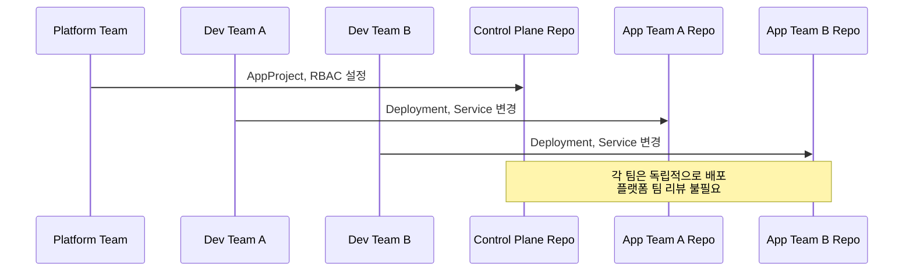
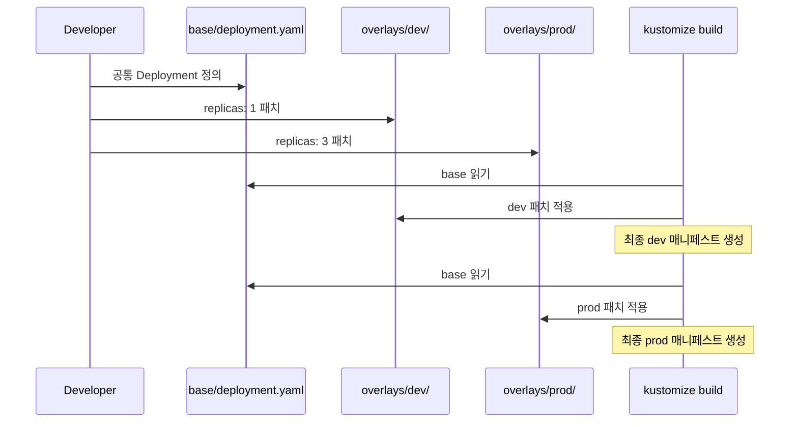
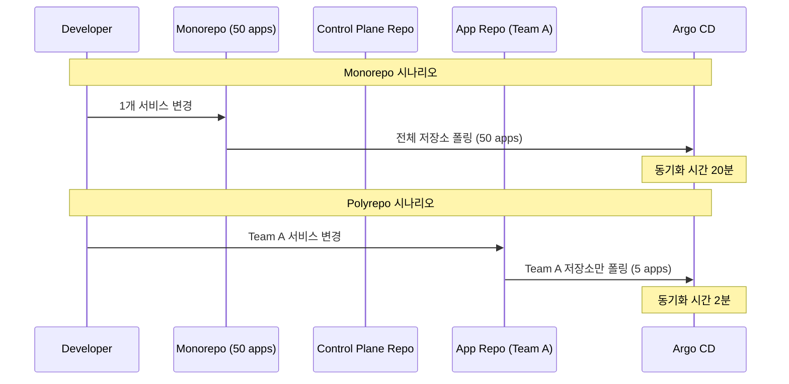
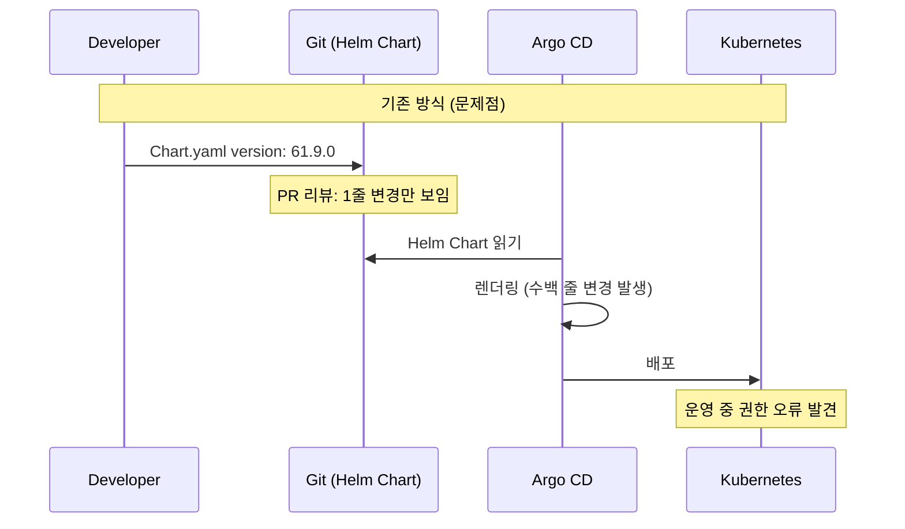
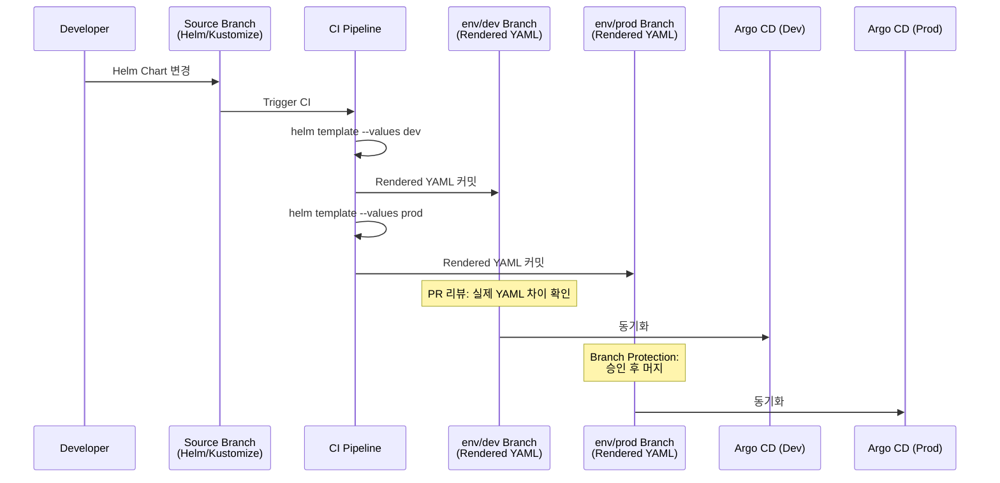
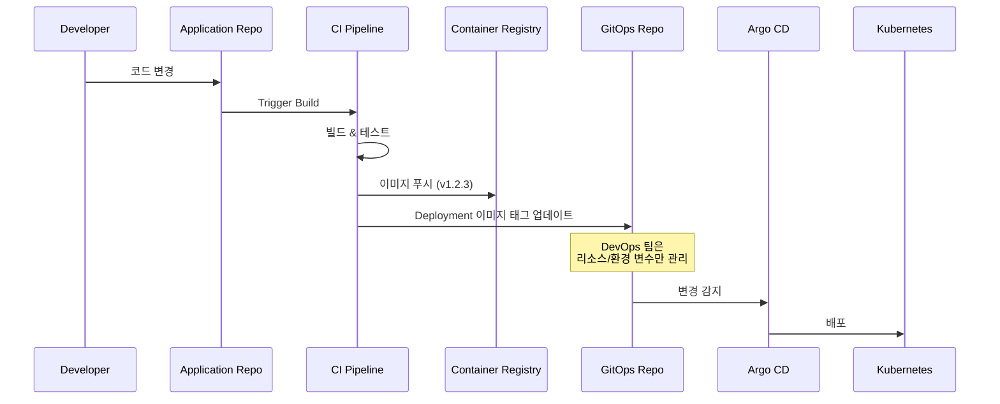
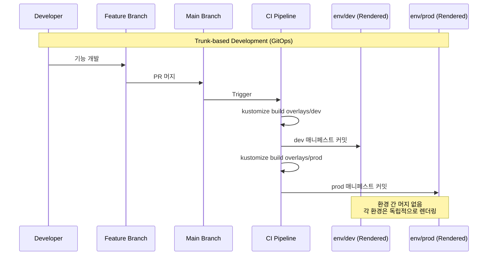
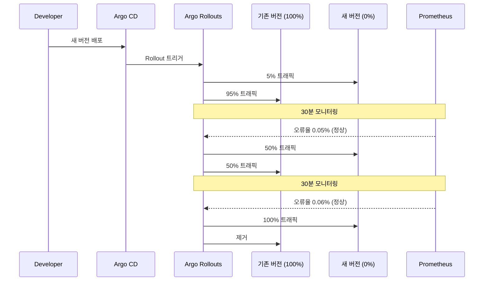
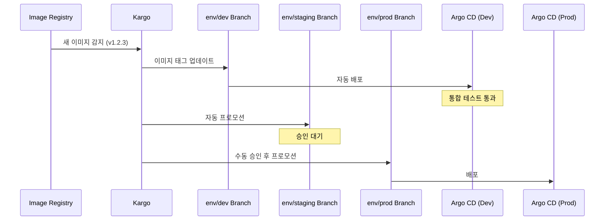

# 14. Future Considerations

---

## 📌 핵심 요약

> 이 장에서는 Argo CD와 GitOps의 미래 발전 방향과 모범 사례를 다룹니다. GitOps 디렉토리 구조는 조직의 커뮤니케이션 구조를 반영해야 하며, DRY 원칙을 통해 YAML 중복을 제거합니다. Monorepo와 Polyrepo는 팀 규모와 책임 분리 수준에 따라 선택하며, Rendered Manifests 패턴은 실제 배포될 매니페스트의 가시성을 확보합니다. GitOps에서는 환경 간 브랜치 머지가 아닌 Trunk-based Development를 사용하며, Progressive Delivery(Argo Rollouts)와 GitOps Promotions(Kargo)를 통해 안전한 배포 자동화를 구현합니다.

---

## 🎯 학습 목표

이 내용을 읽고 나면:
- [ ] Conway의 법칙이 GitOps 디렉토리 구조에 미치는 영향을 설명할 수 있다
- [ ] DRY 원칙을 적용하여 YAML 중복을 제거하는 이유와 방법을 이해한다
- [ ] Monorepo와 Polyrepo의 실무적 선택 기준을 비교할 수 있다
- [ ] Rendered Manifests 패턴이 해결하는 문제와 워크플로우를 설명할 수 있다
- [ ] Trunk-based Development가 GitOps에 적합한 이유를 이해한다
- [ ] Argo Rollouts, Kargo 등 다음 단계 도구들의 역할을 파악할 수 있다

---

## 📖 본문 정리

### 1. GitOps의 진화

#### 1.1 Conway의 법칙

**"조직은 자신의 커뮤니케이션 구조를 복제한 시스템을 설계한다"**는 Conway의 법칙은 GitOps 저장소 구조 설계에서 핵심 원칙으로 작용합니다. 플랫폼 팀이 Control Plane을 관리하고, 개발 팀들이 각자의 애플리케이션 매니페스트를 관리하는 구조는 조직의 책임 분리를 그대로 반영합니다.

**왜 조직 구조를 반영해야 하는가?**
커뮤니케이션 구조와 맞지 않는 저장소 설계는 권한 충돌, 리뷰 병목, 변경 속도 저하를 유발합니다. 예를 들어 플랫폼 팀과 개발 팀이 동일한 저장소를 공유하면, 개발 팀의 배포 속도가 플랫폼 팀의 리뷰 속도에 의존하게 됩니다.

**실무 예시**
10개 개발 팀이 단일 Monorepo를 공유하다가, 배포 속도 저하와 머지 충돌로 인해 팀별 Polyrepo로 전환한 사례: 각 팀이 독립적으로 GitOps 매니페스트를 관리하며, 플랫폼 팀은 Control Plane Repo에서 AppProject와 RBAC만 중앙 관리합니다.



| 원칙 | 설명 | 왜 중요한가? |
|------|------|------------|
| **조직 구조 반영** | 디렉토리 구조는 조직의 커뮤니케이션 구조를 반영 | 권한 충돌과 리뷰 병목 방지 |
| **분리된 책임** | 팀별 역할에 따라 저장소/디렉토리 분리 | 배포 속도와 자율성 확보 |
| **구조 변경** | 디렉토리 구조가 맞지 않으면 구조 또는 조직 변경 필요 | 생산성 저하 방지 |

---

### 2. GitOps 디렉토리 구조

#### 2.1 DRY 원칙 (Don't Repeat YAML)

**왜 YAML 중복을 제거해야 하는가?**
dev, staging, prod 환경에서 동일한 Deployment YAML을 복사-붙여넣기하면, 컨테이너 이미지 버전이나 리소스 제한을 변경할 때 3곳을 모두 수정해야 하며, 한 곳을 누락하면 환경 간 불일치가 발생합니다. 이는 운영 리스크이자 관리 비용입니다.

**DRY 원칙 적용 방법**
Kustomize의 `base/` + `overlays/` 구조는 공통 부분(base)과 환경별 차이(overlays)를 분리합니다. 예를 들어 base에는 Deployment 기본 구조를 정의하고, overlays/dev에서는 replicas: 1, overlays/prod에서는 replicas: 3으로 패치합니다.



| 도구 | 용도 | DRY 적용 방식 | 왜 이 방식인가? |
|------|------|--------------|---------------|
| **Kustomize** | 기본 매니페스트 + 환경별 패치 | `base/` + `overlays/` | 템플릿 언어 없이 순수 YAML 사용 |
| **Helm** | 템플릿 + 환경별 values | `templates/` + `values-*.yaml` | 동적 값 주입 필요 시 유용 |

#### 2.2 파라미터화 (Parameterization)

**왜 Kustomize만으로 부족한가?**
Kustomize는 배포 전에 모든 값을 미리 알아야 하므로, 클러스터 FQDN처럼 배포 시점에 결정되는 값은 처리하기 어렵습니다. 예를 들어 5개 클러스터에 동일한 애플리케이션을 배포하되 Ingress 호스트명만 다르게 설정하려면, Helm의 values 파일로 주입하는 것이 효율적입니다.

**실무 예시**
멀티 클러스터 환경에서 각 클러스터마다 `app.{cluster-name}.example.com` 형식의 FQDN을 사용하는 경우, Helm Chart의 `values-cluster-a.yaml`, `values-cluster-b.yaml`로 관리하면 중복 없이 클러스터별 설정을 주입할 수 있습니다.

```yaml
# Helm values 예시 - 클러스터별 FQDN
# values-cluster-a.yaml
ingress:
  host: app.cluster-a.example.com

# values-cluster-b.yaml
ingress:
  host: app.cluster-b.example.com
```

> **권장**: Kustomize로 환경별 구조를 관리하고, Helm으로 동적 값을 주입하는 조합 사용

#### 2.3 Monorepo vs Polyrepo

**Monorepo와 Polyrepo 중 어떻게 선택하는가?**
Monorepo는 모든 매니페스트를 단일 저장소에서 관리하여 중앙 집중 거버넌스를 제공하지만, 수백 개의 Application을 관리하면 Argo CD의 Git 폴링과 렌더링 성능이 저하됩니다. Polyrepo는 팀별로 저장소를 분리하여 확장성을 확보하지만, 다수 저장소 관리와 교차 참조의 복잡성이 증가합니다.

**실무 시나리오**
팀이 10개 서비스를 Monorepo로 관리하다가, 서비스 수가 50개로 증가하면서 Argo CD 동기화 시간이 5분→20분으로 늘어난 사례: Control Plane Repo(플랫폼 팀)와 App Deployment Repo(개발 팀별)로 Polyrepo 전환 후, 각 저장소의 동기화 시간은 2분 이내로 개선되었습니다.



| 전략 | 장점 | 단점 | 언제 사용하는가? |
|------|------|------|----------------|
| **Monorepo** | 중앙 집중 관리, 단일 거버넌스 | Argo CD 성능 이슈 (대규모 시) | 소규모 팀, 통합 거버넌스 우선 |
| **Polyrepo** | 분리된 책임, 더 나은 확장성 | 다수 저장소 관리 복잡성 | 대규모 팀, 배포 속도 우선 |

#### 2.4 Polyrepo 일반적 구성

**왜 저장소를 역할별로 분리하는가?**
플랫폼 팀은 클러스터 전체의 RBAC과 AppProject를 관리하고, 개발 팀은 자신의 애플리케이션 배포만 관리하며, 인프라 팀은 네트워크와 스토리지 리소스를 관리합니다. 각 팀의 변경 주기와 리뷰 프로세스가 다르므로, 저장소를 분리하면 팀 간 간섭 없이 독립적으로 작업할 수 있습니다.

| 저장소 | 관리 주체 | 내용 | 왜 분리하는가? |
|--------|----------|------|--------------|
| **Control Plane Repo** | Platform/DevOps 팀 | AppProject, Application, 플랫폼 도구 | 클러스터 전체 거버넌스 제어 |
| **App Deployment Repo** | 개발 팀 | Deployment, Service, ConfigMap, Secret | 개발 팀의 배포 자율성 보장 |
| **Infra Repo** | Infra/SRE 팀 | 인프라 관련 매니페스트 | 인프라 변경의 별도 리뷰 프로세스 |

---

### 3. Rendered Manifests 패턴

#### 3.1 기존 방식의 문제점

**왜 Helm Chart 버전 변경의 실제 영향을 알기 어려운가?**
Git에서 `Chart.yaml`의 버전이 `58.6.1`에서 `61.9.0`으로 변경되었다고 해서, 실제로 어떤 Kubernetes 리소스가 어떻게 바뀌는지는 Helm을 렌더링하기 전까지 알 수 없습니다. 메이저 버전 변경이라면 수백 줄의 매니페스트 차이가 발생할 수 있지만, PR 리뷰 단계에서는 1줄 변경으로만 보입니다.

**실무 예시**
Helm Chart 버전 업그레이드로 ServiceAccount가 추가되고 RBAC 권한이 변경되었지만, 리뷰 단계에서 이를 확인하지 못해 프로덕션 배포 후 권한 오류가 발생한 사례: Rendered Manifests 패턴을 사용했다면, PR에서 실제 YAML 차이를 확인하여 사전 검증할 수 있었습니다.



#### 3.2 Rendered Manifests 패턴

**왜 CI에서 미리 렌더링하는가?**
CI 파이프라인에서 `helm template` 또는 `kustomize build`로 최종 YAML을 생성하여 환경별 브랜치에 저장하면, PR 리뷰 단계에서 실제 배포될 매니페스트의 전체 차이를 확인할 수 있습니다. 또한 Argo CD는 이미 렌더링된 YAML을 그대로 적용하므로 렌더링 오버헤드가 없어 성능이 향상됩니다.

**실무 워크플로우**
개발자가 Helm Chart를 변경하면, CI가 자동으로 dev/staging/prod용 YAML을 렌더링하여 각각 `env/dev`, `env/staging`, `env/prod` 브랜치에 커밋합니다. Argo CD는 각 환경별 브랜치를 추적하며, 브랜치에 보호 규칙(branch protection)을 적용하여 승인 없는 프로덕션 배포를 방지합니다.



#### 3.3 장단점

**왜 Rendered Manifests를 도입하는가?**
완전한 가시성(실제 배포 내용 확인)과 불변성(Git 커밋으로 릴리스 아티팩트 보관)을 확보하며, Argo CD의 렌더링 부담을 제거하여 성능을 향상시킵니다. 다만 CI에 렌더링 책임이 이전되고, Sealed Secrets처럼 렌더링 시점에 Secret을 암호화하는 도구와는 호환이 어렵습니다.

| 장점 | 단점 |
|------|------|
| 원하는 상태의 완전한 가시성 (PR 리뷰 가능) | CI 엔진에 렌더링 책임 이전 |
| 진정한 불변(Immutable) 상태 (Git 커밋 = 릴리스) | Plain-text Secret 도구와 호환 어려움 |
| Argo CD 성능 향상 (렌더링 불필요) | 추가 복잡성 (CI 설정 필요) |
| 환경별 정책/보호 규칙 적용 가능 (Branch Protection) | |

> **중요**: Rendered Manifests 브랜치는 릴리스 아티팩트이며, 환경 간 머지용이 아님

---

### 4. GitOps 워크플로우

#### 4.1 관심사의 분리

**왜 애플리케이션 코드와 GitOps 매니페스트를 분리하는가?**
애플리케이션 코드는 개발자가 기능을 구현하고 빌드-테스트-릴리스 주기를 거치며, GitOps 매니페스트는 DevOps 팀이 Kubernetes 리소스를 구성하고 환경별 정책을 적용합니다. 라이프사이클과 관리 주체가 다르므로 별도 저장소로 분리하면 각 팀이 독립적으로 작업할 수 있습니다.

**실무 예시**
개발자는 애플리케이션 저장소에서 코드를 변경하고 CI가 컨테이너 이미지를 빌드합니다. CI는 이미지 태그를 GitOps 저장소의 Deployment에 자동으로 업데이트하며, DevOps 팀은 리소스 제한이나 환경 변수만 GitOps 저장소에서 관리합니다.



| 영역 | 라이프사이클 | 관리 주체 | 왜 분리하는가? |
|------|------------|----------|--------------|
| **애플리케이션 코드** | 개발 → 빌드 → 테스트 → 릴리스 | 개발자 | 기능 구현 속도와 품질 확보 |
| **GitOps 매니페스트** | 구성 변경 → 리뷰 → 적용 | DevOps/Platform 팀 | 환경별 정책과 거버넌스 적용 |

> **권장**: 애플리케이션 코드와 GitOps 매니페스트는 별도 저장소로 분리

#### 4.2 Git Flow vs Trunk-based Development

**왜 GitOps에서는 Trunk-based Development를 권장하는가?**
Git Flow는 dev → staging → prod 브랜치 간 머지를 사용하지만, GitOps에서는 환경별 Secret과 ConfigMap이 다르므로 브랜치 머지 시 충돌이 발생합니다. Trunk-based Development는 main 브랜치에 모든 변경을 머지하고, Kustomize/Helm의 오버레이로 환경별 차이를 관리하여 충돌을 방지합니다.

**실무 시나리오**
Git Flow로 staging 브랜치에서 prod 브랜치로 머지 시, dev 환경의 ConfigMap(디버그 로그 활성화)이 prod로 전파되어 운영 환경에서 디버그 로그가 남는 사고: Trunk-based Development + Kustomize overlays를 사용하면, main 브랜치의 base는 공통 구조만 정의하고 환경별 설정은 overlays에서 독립적으로 관리합니다.



| 워크플로우 | 적합한 용도 | GitOps 적합성 | 왜 그런가? |
|-----------|------------|--------------|----------|
| **Git Flow** | 애플리케이션 개발 | ❌ (환경 간 머지 문제) | 환경별 설정 충돌 발생 |
| **Trunk-based** | GitOps 매니페스트 | ✅ (권장) | 환경별 오버레이로 독립 관리 |

#### 4.3 환경 프로모션 방식

**왜 환경 간 브랜치 머지를 피해야 하는가?**
dev 브랜치를 staging 브랜치로 머지하면, dev의 Secret(개발용 API 키)과 ConfigMap(디버그 설정)이 staging으로 전파되어 환경 간 불일치가 발생합니다. 각 환경은 main 브랜치의 base를 기반으로 독립적으로 렌더링하여, 환경별 설정이 격리됩니다.

**❌ 피해야 할 방식 (Git Flow)**:
```
dev 브랜치 → staging 브랜치 머지 → prod 브랜치 머지
# 문제: 환경별 Secret/ConfigMap 충돌
```

**✅ 권장 방식 (Trunk-based + Kustomize/Helm)**:
```
main 브랜치 (단일 소스)
├── base/
├── overlays/dev/
├── overlays/staging/
└── overlays/prod/

# Rendered Manifests 사용 시
main → CI 렌더링 → env/dev, env/staging, env/prod 브랜치
```

---

### 5. 커뮤니티 참여

#### 5.1 Slack 채널

| 워크스페이스 | 채널 | 용도 |
|-------------|------|------|
| **CNCF Slack** | #argo-cd | Argo CD 일반 |
| | #argo-cd-contributors | 기여자 |
| | #argo-rollouts | Progressive Delivery |
| | #argo-workflows | Workflows |
| **Kubernetes Slack** | #kustomize | Kustomize |
| | #helm-users | Helm 사용자 |
| | #gitops | GitOps 일반 |
| | #kind | kind 클러스터 |

- **CNCF Slack 가입**: https://slack.cncf.io
- **Kubernetes Slack 가입**: https://slack.k8s.io

#### 5.2 GitHub 조직

| 조직 | 설명 | URL |
|------|------|-----|
| **argoproj** | Argo Project 공식 (Graduated) | github.com/argoproj |
| **argoproj-labs** | 실험적 프로젝트 | github.com/argoproj-labs |

**Argo Project (Graduated)**:
- Argo CD
- Argo Workflows
- Argo Rollouts
- Argo Events

---

### 6. 다음 단계 (Next Steps)

#### 6.1 Progressive Delivery

**왜 Progressive Delivery가 필요한가?**
Argo CD는 새 버전을 전체 Pod에 즉시 배포하지만, 프로덕션에서는 일부 사용자에게 먼저 배포하여 안정성을 검증하고 점진적으로 확대하는 것이 안전합니다. Blue-Green은 전체 전환 전 대기 상태로 검증하고, Canary는 5% → 50% → 100%로 트래픽을 점진적으로 증가시킵니다.

**실무 예시**
전자상거래 사이트에서 새 결제 모듈을 Canary 배포로 전체 사용자의 5%에게 먼저 적용하고, 오류율이 0.1% 이하인지 30분간 모니터링한 후 50%로 확대합니다. 만약 오류율이 임계치를 초과하면 자동으로 롤백합니다.



| 전략 | 설명 | 언제 사용하는가? |
|------|------|----------------|
| **Blue-Green** | 새 버전 전체 배포 후 트래픽 전환 | 전체 검증 후 즉시 전환 필요 시 |
| **Canary** | 일부 사용자에게 먼저 배포 후 점진적 확대 | 안전성 검증이 중요한 프로덕션 |

**Argo Rollouts**:
- Argo CD와 통합되는 Progressive Delivery 도구
- Blue-Green, Canary 전략 지원
- Istio, NGINX, Traefik 등 트래픽 관리자 통합
- 공식 사이트: https://argoproj.github.io/rollouts/

#### 6.2 GitOps Promotions 도구

**왜 자동화된 프로모션 도구가 필요한가?**
개발자가 컨테이너 이미지를 새로 푸시하면, Image Updater가 자동으로 GitOps 저장소의 이미지 태그를 업데이트하고 Argo CD가 배포합니다. Kargo는 여러 소스(Git, Helm, Image Registry)를 추적하여 dev → staging → prod 순서로 프로모션하며, 프로덕션은 수동 승인 후 진행합니다.

**실무 워크플로우**
Kargo가 새 이미지를 감지하여 dev 환경에 자동 배포하고, 통합 테스트가 통과하면 staging으로 자동 프로모션합니다. 프로덕션은 DevOps 팀의 승인 후 Kargo가 GitOps 저장소에 커밋하여 배포를 트리거합니다.

| 도구 | 개발사 | 기능 | 왜 사용하는가? |
|------|--------|------|--------------|
| **Argo CD Image Updater** | Argo Labs | 이미지 업데이트 감지 및 Git 커밋 | 이미지 태그 자동 업데이트 |
| **Kargo** | Akuity | Git, Helm, Image 저장소 추적 및 프로모션 | 환경 간 자동/수동 프로모션 |
| **Telefonistka** | Wayfair | 환경 간 안전한 GitOps 프로모션 | 프로모션 정책 및 승인 워크플로우 |

**Kargo 워크플로우**:


- **Kargo 공식 사이트**: https://kargo.io
- **Telefonistka GitHub**: https://github.com/wayfair-incubator/telefonistka

---

## 🔍 심화 학습

### GitOps 디렉토리 구조 참고 자료

| 프로젝트 | 설명 | URL |
|---------|------|-----|
| **GitOps 1:1 Repo** | 저장소:클러스터 1:1 레이아웃 | github.com/christianh814/gitops-1 |
| **GitOps Standards** | 모노레포 멀티클러스터 예시 | github.com/gnunn-gitops |
| **GitOps Bridge** | IaC + GitOps 통합 프레임워크 | github.com/gitops-bridge-dev |
| **Flux Repository Structures** | Flux CD 저장소 구조 가이드 | fluxcd.io/flux/guides |

### Git Flow vs Trunk-based 비교

| 측면 | Git Flow | Trunk-based | 왜 차이가 나는가? |
|------|----------|-------------|-----------------|
| **브랜치 수명** | Long-lived | Short-lived | GitOps는 환경별 오버레이로 관리 |
| **머지 방향** | 환경 간 머지 | main으로만 머지 | 환경 간 충돌 방지 |
| **환경 관리** | 브랜치로 구분 | 디렉토리/오버레이로 구분 | 설정 격리 |
| **복잡도** | 높음 | 낮음 | 머지 충돌 감소 |
| **GitOps 적합성** | 낮음 | 높음 | 단일 소스의 진실 유지 |

### 출처
- [Argo Project](https://argoproj.github.io/)
- [OpenGitOps](https://opengitops.dev/)
- [Kargo](https://kargo.io/)
- [Argo Rollouts](https://argoproj.github.io/rollouts/)

---

## 💡 실무 적용 포인트

### GitOps 성숙도 로드맵

| 단계 | 목표 | 도구/패턴 | 왜 이 순서인가? |
|------|------|----------|---------------|
| **1단계** | 기본 GitOps 도입 | Argo CD + Kustomize/Helm | 선언적 배포 기반 확립 |
| **2단계** | 디렉토리 구조 최적화 | DRY 원칙, Polyrepo 전환 | 관리 복잡도 감소 |
| **3단계** | 가시성 강화 | Rendered Manifests 패턴 | 배포 내용 사전 확인 |
| **4단계** | Progressive Delivery | Argo Rollouts 도입 | 안전한 프로덕션 배포 |
| **5단계** | 자동화된 프로모션 | Kargo, Image Updater | 수동 작업 제거 |

### 주의할 점 / 흔한 실수

- ⚠️ **Git Flow 사용**: GitOps에서 환경 간 브랜치 머지는 Secret/ConfigMap 충돌을 유발하므로 피해야 함
- ⚠️ **YAML 중복**: DRY 원칙 미적용 시 환경별 복사-붙여넣기로 관리 복잡도 급증
- ⚠️ **Monorepo 성능**: 대규모 저장소(100+ apps)는 Argo CD의 Git 폴링과 렌더링 성능 저하 발생
- ⚠️ **코드/매니페스트 혼합**: 라이프사이클과 관리 주체가 다르므로 별도 저장소로 분리 권장
- ⚠️ **Rendered Manifests 오해**: 환경 간 머지가 아닌 CI의 릴리스 아티팩트로 사용
- ⚠️ **Progressive Delivery 혼동**: Argo CD 자체는 점진적 배포 미지원, Argo Rollouts 필요

### 면접에서 나올 수 있는 질문

- Q: GitOps 저장소 구조 설계 시 Conway의 법칙이 의미하는 바는?
  - A: 조직의 커뮤니케이션 구조를 반영하여 저장소를 설계해야 권한 충돌과 리뷰 병목을 방지할 수 있습니다.

- Q: Monorepo와 Polyrepo의 장단점 비교?
  - A: Monorepo는 중앙 집중 거버넌스를 제공하지만 대규모 시 Argo CD 성능이 저하되고, Polyrepo는 팀별 독립성과 확장성을 제공하지만 다수 저장소 관리 복잡성이 증가합니다.

- Q: Rendered Manifests 패턴이 해결하는 문제는?
  - A: Helm Chart 버전 변경 시 실제 배포될 YAML의 차이를 PR 단계에서 확인할 수 없는 문제를 해결하며, CI에서 렌더링하여 환경별 브랜치에 저장함으로써 완전한 가시성과 불변성을 제공합니다.

- Q: GitOps에 Git Flow 대신 Trunk-based Development를 권장하는 이유는?
  - A: Git Flow의 환경 간 브랜치 머지는 Secret과 ConfigMap 충돌을 유발하지만, Trunk-based Development는 main 브랜치에서 모든 변경을 관리하고 Kustomize 오버레이로 환경별 설정을 독립적으로 유지하여 충돌을 방지합니다.

- Q: Argo CD와 Argo Rollouts의 역할 차이는?
  - A: Argo CD는 GitOps를 통해 선언적 배포를 제공하지만 점진적 배포는 지원하지 않으며, Argo Rollouts는 Canary와 Blue-Green 전략으로 안전한 Progressive Delivery를 제공합니다.

---

## ✅ 핵심 개념 체크리스트

- [ ] Conway의 법칙이 GitOps 디렉토리 구조에 미치는 영향을 설명할 수 있는가?
- [ ] DRY 원칙을 Kustomize/Helm으로 적용하는 이유와 방법을 이해했는가?
- [ ] Monorepo와 Polyrepo의 실무적 선택 기준을 비교할 수 있는가?
- [ ] Rendered Manifests 패턴의 워크플로우와 해결하는 문제를 설명할 수 있는가?
- [ ] Trunk-based Development가 GitOps에 적합한 이유를 이해했는가?
- [ ] Argo Rollouts, Kargo 등 다음 단계 도구들의 역할을 파악했는가?

---

## 🔗 참고 자료

- 📄 공식 문서: [Argo Project](https://argoproj.github.io/)
- 📄 OpenGitOps: [OpenGitOps Principles](https://opengitops.dev/)
- 📄 Argo Rollouts: [Progressive Delivery](https://argoproj.github.io/rollouts/)
- 📄 Kargo: [GitOps Promotions](https://kargo.io/)
- 🛠️ Argo CD Image Updater: [argoproj-labs/argocd-image-updater](https://github.com/argoproj-labs/argocd-image-updater)
- 🛠️ Telefonistka: [wayfair-incubator/telefonistka](https://github.com/wayfair-incubator/telefonistka)
- 💬 CNCF Slack: [slack.cncf.io](https://slack.cncf.io)
- 💬 Kubernetes Slack: [slack.k8s.io](https://slack.k8s.io)
- 📖 GitOps Repository Patterns: [Cloudogu Blog](https://cloudogu.com/en/blog/)

---

## 📚 책 마무리

이 책을 통해 Argo CD와 GitOps의 기본 개념부터 엔터프라이즈 운영까지 전반적인 내용을 다루었습니다.

### 학습 여정 요약

| 장 | 주제 | 핵심 내용 |
|----|------|----------|
| 1-2장 | 기초 | Argo CD 소개, 설치 |
| 3-4장 | 상호작용 | UI, CLI, API, Application 관리 |
| 5-6장 | 저장소 | Helm, Kustomize, 저장소 관리 |
| 7-8장 | 클러스터 | 멀티클러스터, 멀티테넌시 |
| 9장 | 보안 | TLS, 인증, RBAC |
| 10장 | 확장 | 대규모 Application 관리 |
| 11장 | 확장 기능 | CMP, UI 커스터마이징 |
| 12장 | CI 통합 | Webhook, Tekton |
| 13장 | 운영 | 모니터링, 알림, HA, 샤딩 |
| 14장 | 미래 | 패턴, 커뮤니티, 다음 단계 |

> **"오픈소스를 과학에 비유하곤 합니다. 아이디어를 공개적으로 발전시키고 다른 사람의 아이디어를 개선하는 개념을 오늘날의 과학으로 만들어 놀라운 발전을 이루었습니다."**
> — Linus Torvalds, Linux 커널 창시자

---
