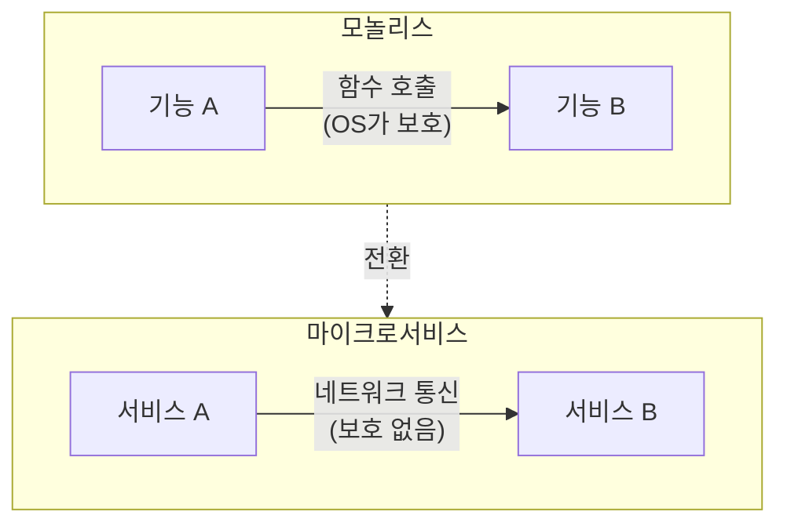
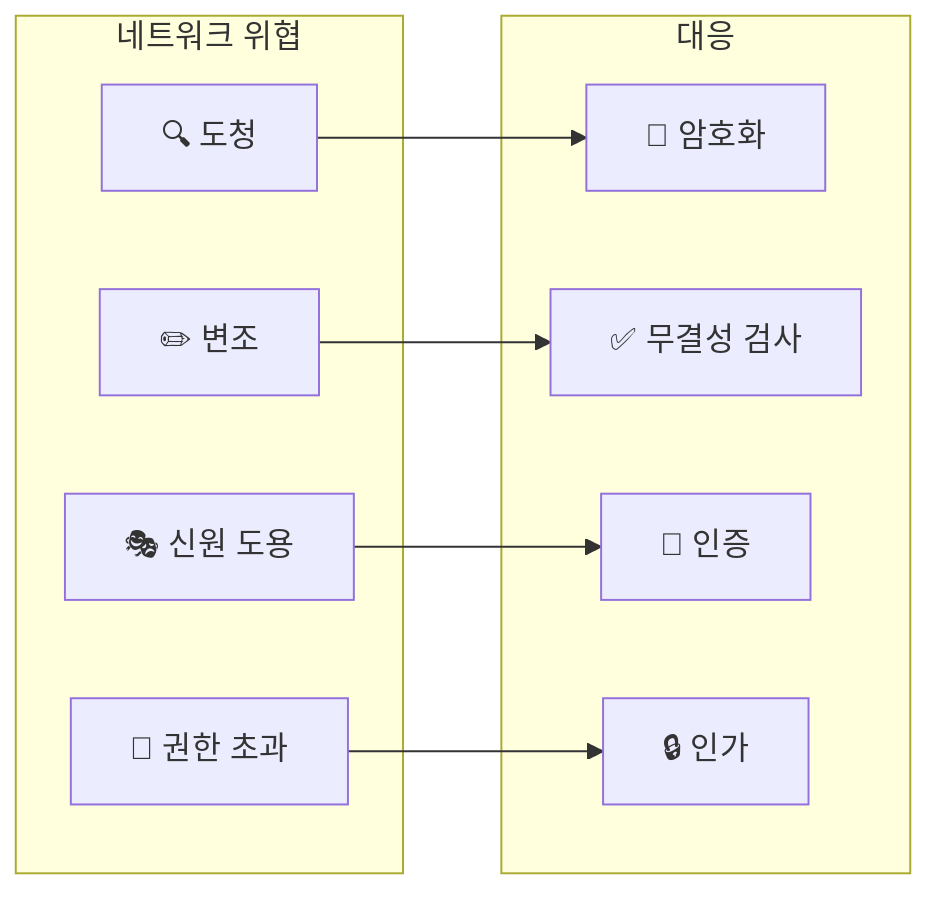
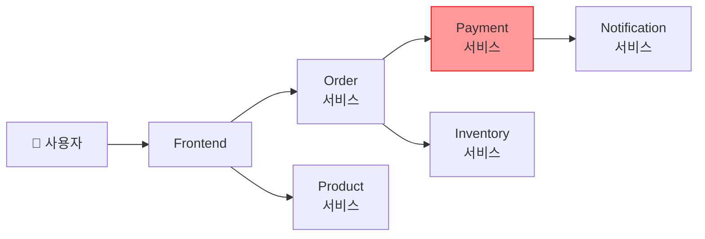
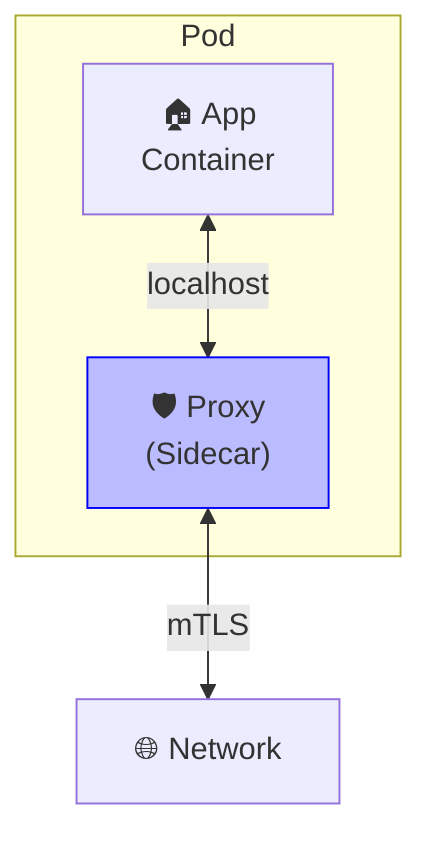

# Chapter 1. Service Mesh 101

## 핵심 요약

> 이 장에서는 Service Mesh가 무엇이고 왜 필요한지 다룹니다.
> 핵심은 "마이크로서비스 환경에서 보안, 신뢰성, 관측성을 애플리케이션 코드 변경 없이 인프라 수준에서 제공하는 것"입니다.

---

## 학습 목표

이 내용을 읽고 나면:
- [ ] Service Mesh가 해결하는 문제를 설명할 수 있다
- [ ] 모놀리스와 마이크로서비스의 보안 차이를 비교할 수 있다
- [ ] Golden Metrics 3가지를 면접에서 설명할 수 있다
- [ ] Sidecar 모델의 동작 원리와 장단점을 말할 수 있다

---

## 본문 정리

### 1. Service Mesh란?

Service Mesh는 마이크로서비스 환경에서 서비스 간 통신을 관리하는 인프라 계층입니다.

왜 필요할까요? 마이크로서비스는 모놀리스와 달리 서비스 간 통신이 네트워크를 통해 이루어집니다. 네트워크는 본질적으로 불안정하고, 해킹에 취약하며, 느립니다. 이 문제를 애플리케이션마다 직접 해결하려면 모든 서비스에 동일한 코드를 반복 작성해야 합니다.

Service Mesh는 이런 공통 기능을 인프라로 분리해서, 개발자가 비즈니스 로직에만 집중할 수 있게 해줍니다.

> 💬 **비유**: Service Mesh는 아파트의 관리사무소와 비슷합니다.
>
> 각 세대(마이크로서비스)가 보안, 택배 관리, 시설 점검을 직접 하면 비효율적입니다. 관리사무소(Service Mesh)가 이 공통 업무를 대신 처리하면, 입주민은 각자 생활(비즈니스 로직)에만 집중할 수 있습니다.

---

### 2. 모놀리스 vs 마이크로서비스

모놀리스 애플리케이션은 하나의 프로세스 안에서 동작합니다. 내부 통신은 함수 호출로 이루어지므로, 운영체제가 제공하는 프로세스 격리 덕분에 외부에서 통신을 가로채거나 변조할 수 없습니다.

마이크로서비스는 다릅니다. 각 서비스가 독립된 프로세스로 동작하고, 서비스 간 통신은 네트워크를 통해 이루어집니다. 운영체제의 보호 메커니즘은 프로세스 내부에서만 작동하므로, 네트워크 구간은 보호받지 못합니다.

---

### 3. Security (보안)

네트워크는 본질적으로 안전하지 않습니다. Service Mesh가 해결하는 4가지 보안 위협이 있습니다.

#### 도청 (Eavesdropping)

악의적인 사용자가 서비스 간 통신을 가로채서 읽을 수 있습니다. 신용카드 정보나 개인정보가 유출될 수 있습니다.

해결책은 **암호화**입니다. 데이터를 암호화하면 가로채더라도 읽을 수 없습니다.

#### 변조 (Tampering)

공격자가 전송 중인 데이터를 수정할 수 있습니다. 주문 금액을 바꾸거나, 요청 내용을 조작할 수 있습니다.

중요한 점은 **암호화만으로는 변조를 막을 수 없다**는 것입니다. 암호화된 데이터도 내용을 모른 채 깨뜨릴 수 있습니다. 반드시 **무결성 검사**(체크섬)를 함께 사용해야 합니다.

#### 신원 도용 (Identity Theft)

결제 서비스에 요청을 보냈는데, 실제로는 공격자가 만든 가짜 서비스일 수 있습니다.

**강력한 인증**이 필요합니다. 통신 상대방이 정말 내가 원하는 서비스인지 확인해야 합니다.

#### 권한 초과 (Overreach)

상품 목록 서비스가 결제 서비스에 직접 요청을 보낼 수 있다면 문제입니다. 해킹당한 서비스가 다른 서비스에 무제한 접근할 수 있게 됩니다.

**인가**와 **최소 권한 원칙**이 필요합니다. 각 서비스는 꼭 필요한 권한만 가져야 합니다.

---

### 4. Reliability (신뢰성)

모놀리스에서 함수 호출이 실패하는 경우는 거의 없습니다. 하지만 마이크로서비스의 네트워크 통신은 언제든 실패할 수 있습니다.

#### 요청 실패 (Request Failure)

네트워크 요청은 다양한 이유로 실패합니다. 서비스가 죽었거나, 네트워크가 혼잡하거나, 타임아웃이 발생할 수 있습니다.

Service Mesh는 **재시도(Retry)**를 자동으로 처리합니다. 물론 모든 요청을 재시도할 수 있는 건 아닙니다. 결제 요청을 두 번 보내면 두 번 결제될 수 있습니다. 그래서 **멱등성**이 중요합니다.

#### 서비스 장애 (Service Failure)

단일 인스턴스가 아니라 서비스 전체가 죽을 수도 있습니다. 잘못된 버전이 배포되거나, 클러스터 전체가 다운될 수 있습니다.

Service Mesh는 **Failover**를 제공합니다. 백업 클러스터나 이전 버전으로 트래픽을 전환할 수 있습니다.

#### 서비스 과부하 (Service Overload)

한 서비스에 요청이 몰리면, 그 서비스뿐 아니라 연쇄적으로 다른 서비스도 영향받을 수 있습니다.

**Circuit Breaking**이 해결책입니다. 과부하된 서비스로 가는 요청을 빠르게 실패시켜서, 전체 시스템이 무너지는 것을 막습니다.

> 💬 **비유**: Circuit Breaking은 가정의 누전 차단기와 같습니다.
>
> 과전류가 흐르면 차단기가 끊어져서 집 전체가 타는 것을 막습니다. 마찬가지로 한 서비스가 과부하되면 해당 경로를 차단해서 전체 시스템이 다운되는 것을 방지합니다.

---

### 5. Observability (관측성)

모놀리스는 내부 로깅이나 대시보드로 상태를 파악할 수 있습니다. 하지만 마이크로서비스는 수십, 수백 개의 서비스가 복잡하게 연결되어 있어서 전체 상황을 파악하기 어렵습니다.

#### Call Graph (호출 그래프)

어떤 서비스가 어떤 서비스를 호출하는지 보여주는 그래프입니다.

왜 중요할까요? 사용자가 경험하는 오류의 원인이 깊숙이 묻힌 서비스에 있을 수 있습니다. 전체 그래프를 볼 수 있어야 진짜 원인을 찾을 수 있습니다.

위 그래프에서 사용자가 오류를 경험했다면, 원인은 Payment 서비스일 수도 있고, Inventory 서비스일 수도 있습니다. 호출 그래프 없이는 추적이 불가능합니다.

#### Golden Metrics (황금 메트릭)

수많은 메트릭 중 특히 유용한 3가지가 있어서 "황금 메트릭"이라 부릅니다.

**Latency (지연 시간)**는 요청이 완료되는 데 걸리는 시간입니다. 보통 P95나 P99로 표현합니다. "P95 = 5ms"는 95%의 요청이 5ms 이내에 완료된다는 의미입니다.

왜 평균이 아니라 P95일까요? 평균은 이상치를 숨깁니다. 99개 요청이 1ms, 1개 요청이 1000ms면 평균은 11ms로 괜찮아 보이지만, 실제로 100명 중 1명은 1초를 기다립니다.

**Traffic (트래픽)**은 서비스가 처리하는 요청 수입니다. 보통 RPS(Requests Per Second)로 표현합니다.

**Success Rate (성공률)**은 성공한 요청의 비율입니다. SR 99.9%는 1000개 요청 중 1개만 실패한다는 의미입니다.

---

### 6. Sidecar 모델

Service Mesh는 어떻게 애플리케이션 코드 변경 없이 이 모든 기능을 제공할까요? Linkerd를 포함한 대부분의 Service Mesh는 **Sidecar 모델**을 사용합니다.

> 💬 **비유**: Sidecar는 오토바이의 사이드카에서 이름을 가져왔습니다.
>
> 오토바이(애플리케이션) 옆에 사이드카(프록시)를 붙이면, 운전자는 신경 쓰지 않아도 사이드카가 알아서 짐을 나르거나 승객을 태울 수 있습니다. 애플리케이션은 자기 일만 하고, 네트워크 관련 일은 사이드카가 처리합니다.

**작동 원리:**
1. 모든 애플리케이션 Pod 옆에 프록시 컨테이너를 배치합니다
2. 호스트의 네트워크 라우팅 규칙을 변경합니다
3. 모든 인바운드/아웃바운드 트래픽이 프록시를 통과합니다
4. 프록시가 암호화, 인증, 재시도, 메트릭 수집 등을 처리합니다

**장점:**
- 운영체제가 애플리케이션에 제공하는 보안 보호가 사이드카에도 동일하게 적용됩니다
- 애플리케이션과 동일하게 관리할 수 있습니다 (`kubectl rollout restart`가 그대로 동작)
- 공격 표면이 단일 보안 컨텍스트로 제한됩니다

**단점:**
- 모든 Pod에 사이드카가 필요합니다. 1000개 Pod면 1000개 사이드카입니다
- 추가 지연 시간이 발생합니다 (Linkerd는 이를 최소화하는 데 많은 노력을 기울입니다)

---

### 7. 왜 Service Mesh가 필요한가?

보안, 신뢰성, 관측성은 선택이 아닙니다. 어떤 팀도 "보안은 필요 없어"라고 말하지 않습니다.

선택은 **누가 이 기능을 제공할 것인가**입니다.

**직접 구현하면?** 모든 마이크로서비스에 동일한 코드를 반복 작성해야 합니다. 시니어 개발자는 비즈니스 로직에 집중하고 싶어하므로, 이런 "지루한" 코드는 주니어에게 맡겨질 수 있습니다. 재시도 로직을 잘못 구현하면 시스템 전체가 불안정해집니다.

**라이브러리를 사용하면?** 개발 시간은 줄어들지만, 모든 개발자가 라이브러리 사용법을 배워야 합니다. 언어나 런타임이 다르면 다른 라이브러리를 찾아야 합니다. 한 서비스가 라이브러리를 업그레이드하면 호환성 문제가 생길 수 있습니다.

**Service Mesh를 사용하면?** 애플리케이션 개발자는 이 기능이 존재하는지도 몰라도 됩니다. 인프라 팀이 한 번 설정하면 모든 서비스에 일관되게 적용됩니다.

---

## 면접 대비

### 한 줄 정의

"Service Mesh란 마이크로서비스 간 통신을 관리하여 보안, 신뢰성, 관측성을 애플리케이션 코드 변경 없이 인프라 수준에서 제공하는 플랫폼 계층입니다."

### 핵심 포인트 3가지

1. **3대 기능**: Security(암호화, 인증, 인가), Reliability(재시도, Failover, Circuit Breaking), Observability(호출 그래프, Golden Metrics)

2. **Sidecar 모델**: 모든 Pod 옆에 프록시를 배치하여 트래픽을 중재. OS 수준 보안이 그대로 적용되고, 단일 보안 컨텍스트로 공격 표면 최소화

3. **가치**: 개발자가 비즈니스 로직에 집중할 수 있도록 공통 인프라 기능을 분리

### 자주 묻는 질문

**Q: 암호화하면 변조도 막을 수 있지 않나요?**

A: 아닙니다. 암호화는 데이터를 읽을 수 없게 만들 뿐, 데이터가 변경되지 않았음을 보장하지 않습니다. 암호화된 데이터도 비트를 뒤집으면 손상됩니다. 그래서 모든 암호화 프로토콜은 무결성 검사(체크섬, MAC)를 함께 사용합니다.

**Q: Golden Metrics가 왜 평균이 아니라 Percentile인가요?**

A: 평균은 이상치를 숨기기 때문입니다. 99%의 요청이 1ms고 1%가 10초라면, 평균은 100ms로 괜찮아 보입니다. 하지만 100명 중 1명은 10초를 기다립니다. P99는 이런 worst case를 드러냅니다.

**Q: Sidecar의 단점은 뭔가요?**

A: 첫째, 모든 Pod에 사이드카가 필요해서 리소스를 더 사용합니다. 둘째, 모든 트래픽이 프록시를 거치므로 지연 시간이 추가됩니다. Linkerd는 Rust로 작성된 경량 프록시를 사용해서 이 오버헤드를 최소화합니다.

---

## 핵심 개념 체크리스트

- [ ] Service Mesh의 3대 기능을 말할 수 있는가?
- [ ] 암호화와 무결성 검사의 차이를 설명할 수 있는가?
- [ ] Circuit Breaking이 왜 필요한지 비유로 설명할 수 있는가?
- [ ] Golden Metrics 3가지와 각각의 의미를 말할 수 있는가?
- [ ] Sidecar 모델의 동작 원리와 장단점을 설명할 수 있는가?

---

## 참고 자료

- CNCF Glossary: [Service Mesh](https://glossary.cncf.io/service-mesh/)
- Google SRE Book: [Monitoring Distributed Systems](https://sre.google/sre-book/monitoring-distributed-systems/)
