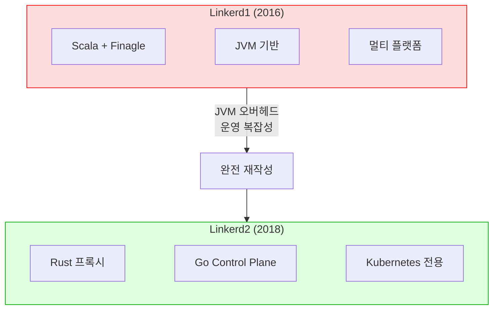
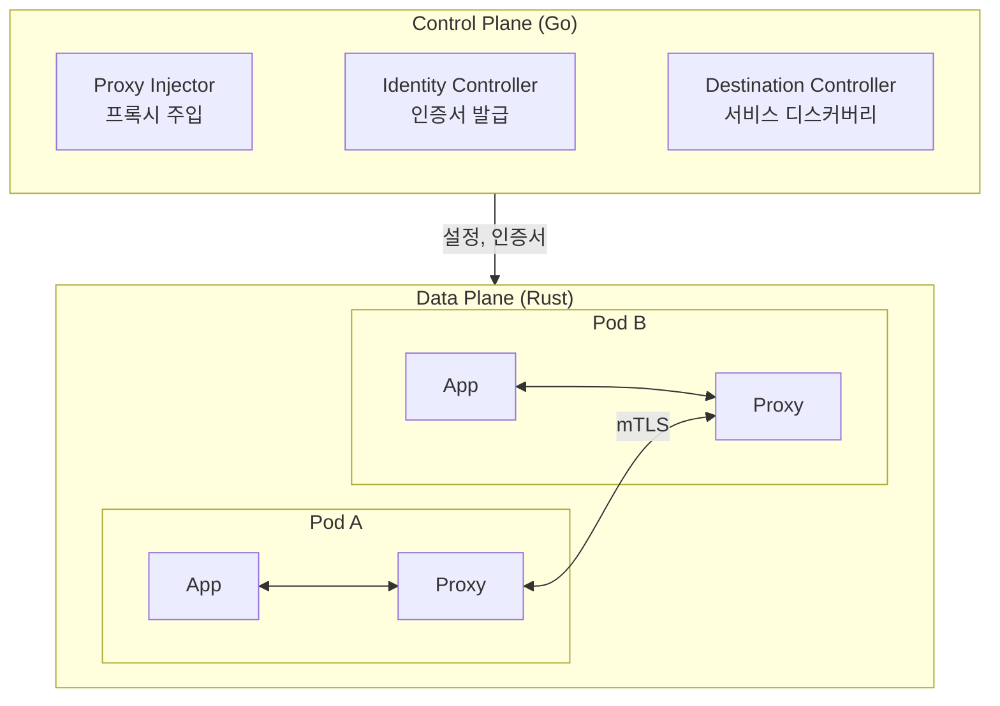
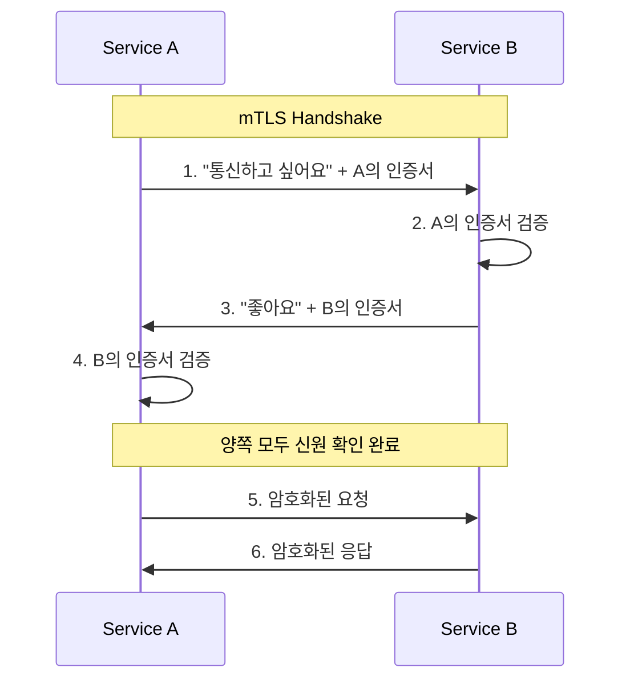
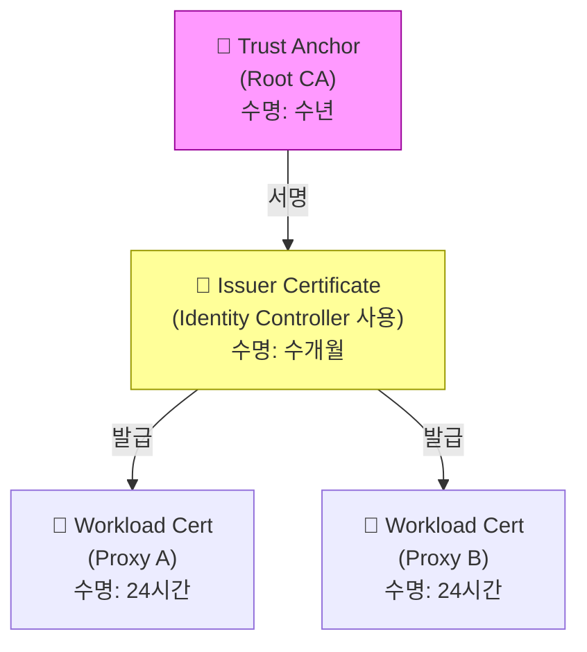
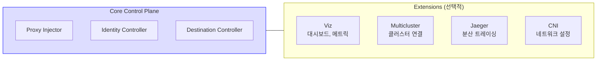

# Chapter 2. Intro to Linkerd

## 핵심 요약

> 이 장에서는 Linkerd의 역사와 아키텍처를 다룹니다.
> 핵심은 "Linkerd는 운영 단순성(Operational Simplicity)을 최우선으로 설계된 Service Mesh로, Rust 기반의 경량 프록시와 Go 기반의 Control Plane으로 구성된다"는 것입니다.

---

## 학습 목표

이 내용을 읽고 나면:
- [ ] Linkerd1에서 Linkerd2로 재작성된 이유를 설명할 수 있다
- [ ] Data Plane과 Control Plane의 역할을 구분할 수 있다
- [ ] mTLS가 Linkerd에서 어떤 역할을 하는지 설명할 수 있다
- [ ] 주요 Extension들의 용도를 말할 수 있다

---

## 본문 정리

### 1. Linkerd의 역사

Linkerd는 2015년 Twitter 출신 엔지니어 William Morgan과 Oliver Gould가 Buoyant에서 만들었습니다. "Service Mesh"라는 용어를 처음 만든 프로젝트이기도 합니다.

#### Linkerd1의 문제

첫 버전(Linkerd1)은 Scala로 작성되었고 Twitter의 Finagle RPC 라이브러리를 기반으로 했습니다. 여러 컨테이너 스케줄러를 지원하는 강력한 기능을 제공했지만, 치명적인 문제가 있었습니다.

왜 실패했을까요? Finagle을 사용하려면 JVM 위에서 실행해야 했습니다. JVM의 메모리 사용량과 시작 시간은 모든 Pod에 Sidecar로 붙이기에는 너무 무거웠습니다. 수천 개의 Pod가 있다면, 수천 개의 JVM이 필요한 셈입니다.

#### Linkerd2의 탄생

2018년, Linkerd 팀은 Linkerd1의 경험을 바탕으로 완전히 새로 작성했습니다.

**핵심 결정 3가지:**
1. **Kubernetes 전용**: 다른 오케스트레이터 지원을 포기하고 Kubernetes에 집중
2. **Go로 Control Plane 작성**: 운영 도구와의 호환성, 개발 생산성
3. **Rust로 프록시 작성**: 메모리 안전성 + 네이티브 성능

왜 Envoy 대신 자체 프록시를 만들었을까요? Envoy는 범용 프록시라서 기능이 많지만, 그만큼 복잡하고 무겁습니다. Linkerd는 "운영 단순성"을 최우선으로 했기 때문에, 꼭 필요한 기능만 가진 경량 프록시를 직접 만들었습니다.

> 💬 **비유**: Envoy가 스위스 아미 나이프라면, linkerd2-proxy는 수술용 메스입니다.
>
> 스위스 아미 나이프는 다재다능하지만 무겁고 정교한 작업에는 적합하지 않습니다. 수술용 메스는 한 가지 일만 하지만, 그 일을 완벽하게 합니다. Linkerd는 Service Mesh에 필요한 기능만 정확히 수행하는 가벼운 도구를 선택했습니다.

---

### 2. Linkerd 아키텍처

Linkerd는 다른 Service Mesh와 마찬가지로 **Data Plane**과 **Control Plane**으로 구성됩니다.

**Data Plane**은 실제 애플리케이션 트래픽을 처리하는 부분입니다. 각 Pod에 Sidecar로 배치된 linkerd2-proxy가 이 역할을 합니다. 암호화, 재시도, 로드밸런싱 등 모든 네트워크 기능을 프록시가 처리합니다.

**Control Plane**은 Data Plane을 관리하는 부분입니다. 프록시 설정 배포, 인증서 발급, 서비스 디스커버리 등을 담당합니다.

왜 이렇게 분리했을까요? 관심사의 분리입니다. Data Plane은 성능이 중요하므로 Rust로 작성했고, Control Plane은 Kubernetes와의 통합이 중요하므로 Go로 작성했습니다.

#### Control Plane 구성요소

**Proxy Injector**는 새 Pod가 생성될 때 Sidecar 프록시를 자동으로 주입합니다. Kubernetes의 Mutating Admission Webhook을 사용합니다.

**Identity Controller**는 각 프록시에 TLS 인증서를 발급합니다. 이 인증서로 프록시는 자신의 정체를 증명하고, 다른 프록시와 암호화된 통신을 합니다.

**Destination Controller**는 프록시에게 "이 서비스로 가려면 어디로 가야 하는지" 알려줍니다. Kubernetes의 Service, Endpoint 정보를 프록시가 이해할 수 있는 형태로 변환합니다.

---

### 3. mTLS와 인증서

Linkerd는 클러스터 내 모든 통신을 mTLS(mutual TLS)로 보호합니다.

일반 TLS는 클라이언트가 서버의 신원을 확인합니다. 웹 브라우저가 은행 사이트의 인증서를 확인하는 것처럼요. 하지만 서버는 클라이언트가 누구인지 모릅니다.

mTLS는 양방향입니다. 클라이언트도 서버에게 자신의 인증서를 제시합니다. 그래서 "mutual(상호)" TLS입니다.

왜 mTLS가 필요할까요? Service Mesh에서는 모든 서비스가 서로를 신뢰해야 합니다. 결제 서비스가 주문 서비스의 요청을 받을 때, 그 요청이 정말 주문 서비스에서 온 것인지 확인해야 합니다. mTLS가 없다면, 악의적인 Pod가 주문 서비스인 척 결제 요청을 보낼 수 있습니다.

> 💬 **비유**: mTLS는 회사 출입 시스템과 비슷합니다.
>
> 일반 TLS는 건물 입구에서 "이 건물이 진짜 우리 회사 건물인지" 확인하는 것입니다. mTLS는 거기에 더해 "나도 이 회사 직원임을 증명하는 사원증"을 보여주는 것입니다. 양쪽 모두 신원을 확인해야 출입이 허용됩니다.

#### 인증서 계층 구조

인증서는 계층 구조를 가집니다. 상위 인증서가 하위 인증서의 유효성을 보증합니다.

**Trust Anchor (Root CA)**: 최상위 인증서입니다. 자기 자신을 서명합니다. Linkerd 설치 전에 미리 생성해야 합니다.

**Issuer Certificate**: Trust Anchor가 서명한 중간 인증서입니다. Identity Controller가 이 인증서를 사용해서 프록시 인증서를 발급합니다.

**Workload Certificate**: 각 프록시가 받는 인증서입니다. 수명이 짧고(기본 24시간) 자동으로 갱신됩니다.

왜 이렇게 계층을 만들까요? Trust Anchor의 Private Key가 유출되면 전체 시스템이 위험해집니다. 그래서 Trust Anchor는 오프라인에 보관하고, 일상적인 발급은 Issuer Certificate로 합니다. Issuer가 유출되어도 Trust Anchor로 새 Issuer를 만들면 됩니다.

---

### 4. Linkerd Extensions

Linkerd의 핵심 Control Plane은 최소한의 기능만 가집니다. 추가 기능은 Extension으로 제공됩니다.

왜 Extension으로 분리했을까요? 모든 사용자가 모든 기능을 필요로 하지 않습니다. 대시보드가 필요 없는 팀도 있고, 분산 트레이싱을 쓰지 않는 팀도 있습니다. 필요한 것만 설치하면 리소스를 아끼고 복잡성을 줄일 수 있습니다.

#### Linkerd Viz

대시보드와 메트릭 수집을 제공합니다.

**주요 구성요소:**
- **Web**: 대시보드 GUI
- **Tap**: 실시간 요청 메타데이터 조회 (경로, 헤더 등)
- **Metrics API**: 메트릭 요약 데이터 제공
- **Prometheus**: 메트릭 저장 (프로덕션에서는 외부 Prometheus 사용 권장)

⚠️ **주의**: Viz 대시보드는 인증이 없습니다. 외부에 노출할 경우 반드시 API Gateway 등으로 보호해야 합니다.

⚠️ **주의**: 기본 설치되는 Prometheus는 영구 저장소가 없습니다. 프로덕션에서는 반드시 외부 Prometheus를 사용하세요.

#### Linkerd Multicluster

여러 Kubernetes 클러스터를 연결합니다. 특별한 게이트웨이를 통해 다른 클러스터의 서비스를 마치 로컬 서비스처럼 호출할 수 있습니다.

#### Linkerd Jaeger

분산 트레이싱을 지원합니다. 프록시가 Jaeger에 span을 전송할 수 있게 해줍니다.

⚠️ **중요**: Linkerd는 트레이싱 헤더를 전파할 수 있지만, 애플리케이션이 먼저 트레이싱을 구현해야 합니다. Linkerd가 자동으로 애플리케이션에 트레이싱을 추가해주지는 않습니다.

#### Linkerd CNI

프록시가 네트워크 트래픽을 가로채려면 커널의 네트워크 설정을 변경해야 합니다. 기본적으로 init container가 이 작업을 하지만, 권한 제약이 있는 환경에서는 CNI 플러그인을 사용합니다.

⚠️ **중요**: CNI 플러그인은 다른 Linkerd 컴포넌트보다 먼저 설치해야 합니다.

---

## 심화 학습

### Rust를 선택한 이유

Linkerd2 개발이 시작된 2018년, Rust는 메모리 안전성으로 주목받고 있었습니다. C/C++의 성능을 가지면서도 메모리 관련 버그(buffer overflow, use-after-free 등)를 컴파일 타임에 방지할 수 있습니다.

다만 당시 Rust의 네트워킹 생태계는 성숙하지 않았습니다. Linkerd 팀은 hyper(HTTP 라이브러리)와 tokio(비동기 런타임)에 직접 기능을 추가하며 Rust 생태계 발전에 기여했습니다.

### KEP-753 (Native Sidecar)

Kubernetes 1.28부터 공식적인 Sidecar 컨테이너 타입이 도입되었습니다(KEP-753). 이전에는 Sidecar가 개념적으로만 존재했고, 실제로는 일반 컨테이너와 구분이 없었습니다.

Native Sidecar의 장점은 시작/종료 순서가 보장된다는 것입니다. 애플리케이션 컨테이너보다 먼저 시작하고 나중에 종료됩니다. Linkerd edge-23.11.4부터 이 기능을 지원합니다.

---

## 면접 대비

### 한 줄 정의

"Linkerd는 운영 단순성을 최우선으로 설계된 Service Mesh로, Rust 기반의 경량 프록시(linkerd2-proxy)와 Go 기반의 Control Plane으로 구성됩니다."

### 핵심 포인트 3가지

1. **Linkerd1 → Linkerd2 재작성 이유**: JVM 오버헤드가 Sidecar 모델에 적합하지 않았음. Rust(프록시)와 Go(Control Plane)로 완전 재작성

2. **아키텍처**: Data Plane(Rust 프록시, 트래픽 처리) + Control Plane(Go, 프록시 관리). 관심사 분리와 각 영역에 최적화된 언어 선택

3. **mTLS**: 상호 인증으로 모든 서비스가 서로의 신원을 확인. Trust Anchor → Issuer → Workload 인증서 계층 구조

### 자주 묻는 질문

**Q: Linkerd는 왜 Envoy 대신 자체 프록시를 만들었나요?**

A: 운영 단순성 때문입니다. Envoy는 범용 프록시라서 기능이 많지만, 그만큼 설정이 복잡하고 리소스를 많이 사용합니다. Linkerd는 Service Mesh에 필요한 기능만 가진 경량 프록시를 직접 만들어서, 학습 곡선을 낮추고 리소스 사용을 최소화했습니다.

**Q: mTLS에서 Trust Anchor와 Issuer를 분리하는 이유는?**

A: 보안을 위해서입니다. Trust Anchor의 Private Key가 유출되면 전체 메시가 위험해집니다. 그래서 Trust Anchor는 오프라인에 안전하게 보관하고, 일상적인 인증서 발급은 Issuer가 합니다. Issuer가 유출되어도 Trust Anchor로 새 Issuer를 만들면 복구할 수 있습니다.

**Q: Linkerd Viz의 Tap은 무엇인가요?**

A: 실시간으로 서비스 간 요청의 메타데이터(경로, 헤더, 상태 코드 등)를 볼 수 있는 기능입니다. 라이브 환경에서 디버깅할 때 유용합니다. 단, 요청 본문(body)은 볼 수 없습니다. 본문까지 보려면 애플리케이션 레벨 로깅이 필요합니다.

---

## 핵심 개념 체크리스트

- [ ] Linkerd1이 왜 Linkerd2로 재작성되었는지 설명할 수 있는가?
- [ ] Data Plane과 Control Plane의 역할을 구분할 수 있는가?
- [ ] Control Plane의 3가지 구성요소(Proxy Injector, Identity Controller, Destination Controller)를 설명할 수 있는가?
- [ ] mTLS가 일반 TLS와 어떻게 다른지 말할 수 있는가?
- [ ] 인증서 계층 구조(Trust Anchor → Issuer → Workload)를 이해하고 있는가?
- [ ] 주요 Extension(Viz, Multicluster, Jaeger, CNI)의 용도를 알고 있는가?

---

## 참고 자료

- Linkerd 공식 문서: [linkerd.io/docs](https://linkerd.io/docs/)
- Linkerd GitHub: [github.com/linkerd/linkerd2](https://github.com/linkerd/linkerd2)
- linkerd2-proxy GitHub: [github.com/linkerd/linkerd2-proxy](https://github.com/linkerd/linkerd2-proxy)
