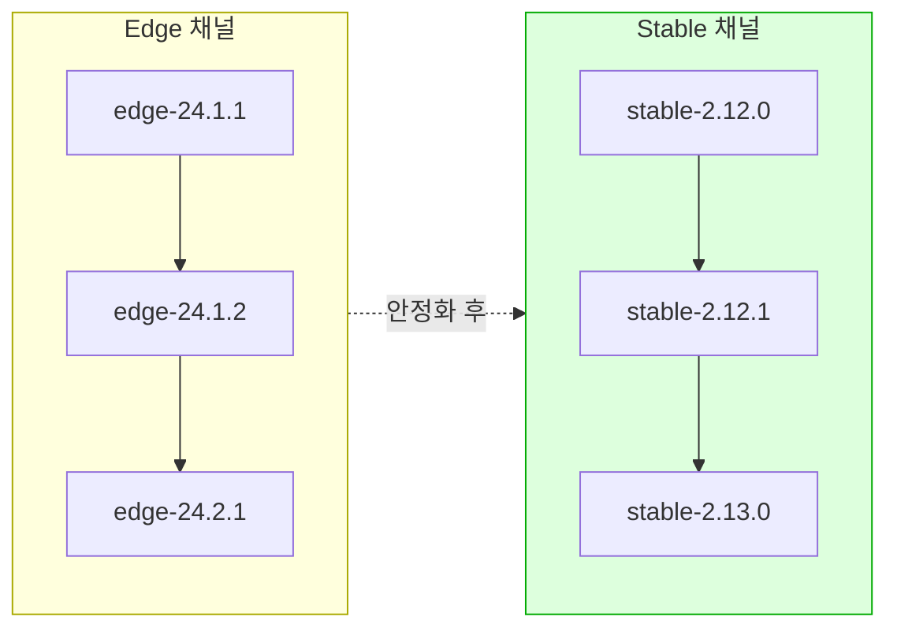
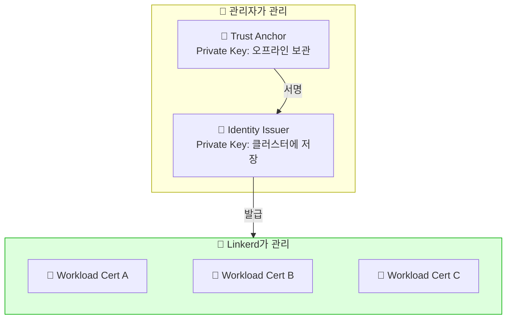
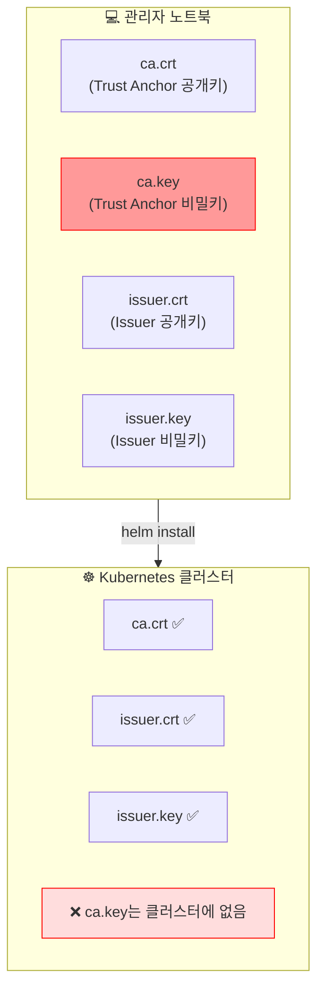
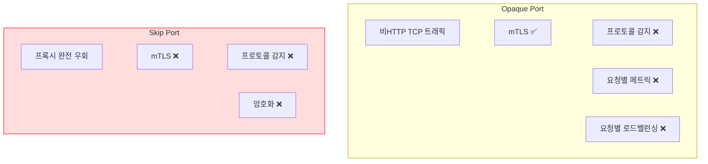

# Chapter 3. Deploying Linkerd

## 핵심 요약

> 이 장에서는 Linkerd 설치 방법과 주요 설정을 다룹니다.
> 핵심은 "프로덕션 환경에서는 반드시 TLS 인증서를 직접 관리해야 하며, Helm을 사용한 설치가 권장된다"는 것입니다.

---

## 학습 목표

이 내용을 읽고 나면:
- [ ] Linkerd의 Stable과 Edge 버전 차이를 설명할 수 있다
- [ ] CLI 설치와 Helm 설치의 차이점과 각각의 장단점을 말할 수 있다
- [ ] Trust Anchor와 Identity Issuer 인증서를 직접 생성할 수 있다
- [ ] Opaque Port와 Skip Port의 차이를 설명할 수 있다

---

## 본문 정리

### 1. 설치 전 고려사항

Linkerd 설치는 빠르고 쉽습니다. 하지만 그 쉬움이 실제 운영에서의 함정을 가릴 수 있습니다.

**반드시 미리 준비해야 할 것:**
1. **TLS 인증서 계획**: Trust Anchor와 Identity Issuer 인증서를 어떻게 생성하고 보관할지
2. **비HTTP 포트 파악**: 애플리케이션이 사용하는 모든 비HTTP 포트를 알아야 프로토콜 감지를 올바르게 설정할 수 있음

왜 인증서 계획이 중요할까요? CLI로 간단히 설치하면 Linkerd가 인증서를 자동 생성합니다. 하지만 이 경우 Trust Anchor의 Private Key가 어디에도 저장되지 않습니다. 나중에 인증서를 갱신할 때 큰 문제가 됩니다.

---

### 2. Linkerd 버전 체계

Linkerd는 두 가지 릴리스 채널을 운영합니다.

#### Stable 채널

벤더 릴리스용 채널입니다. Buoyant Enterprise for Linkerd 같은 상용 버전이 여기에 속합니다.

```
stable-2.<major>.<minor>.<patch>
```

예를 들어 "Linkerd 2.12.3"은 major가 12, minor가 3입니다.

**버전 규칙:**
- Major 변경: 호환성 깨지는 변경 또는 중요한 신기능
- Minor 변경: 이전 버전과 완전 호환, 개선 또는 버그 수정
- Patch: 드물게 발생, 보안 수정

#### Edge 채널

순수 오픈소스 Linkerd 릴리스입니다. 최신 변경사항이 포함되며, 보통 주 단위로 릴리스됩니다.

```
edge-<2자리 연도>.<월>.<월 내 번호>
```

예: `edge-24.1.1`은 2024년 1월 첫 번째 Edge 릴리스입니다.

⚠️ **주의**: Edge 채널은 Semantic Versioning을 따르지 않습니다. 설치 전 반드시 릴리스 노트를 확인해야 합니다.



---

### 3. Linkerd와 Kubernetes 리소스

Linkerd는 Kubernetes 네이티브로 설계되었습니다. 다른 Service Mesh와 달리, Linkerd의 CRD(Custom Resource Definition)를 전혀 사용하지 않고도 운영할 수 있습니다.

왜 이게 장점일까요? Kubernetes의 기본 리소스(Deployment, Service, Pod)만 알면 Linkerd를 사용할 수 있습니다. 학습 곡선이 낮고, 기존 워크로드에 Linkerd를 추가해도 동작이 바뀌지 않습니다.

> 💬 **비유**: Linkerd는 "투명한 업그레이드"와 같습니다.
>
> 자동차에 블랙박스를 달아도 운전 방법이 바뀌지 않듯이, Linkerd를 추가해도 애플리케이션의 동작은 그대로입니다. 단지 보안, 관측성, 신뢰성이 자동으로 추가될 뿐입니다.

---

### 4. TLS 인증서 구조

Linkerd는 세 계층의 인증서 구조를 사용합니다.

**Trust Anchor (Root CA)**: 최상위 인증서. 설치 전에 생성해야 하며, Private Key는 안전하게 오프라인 보관

**Identity Issuer**: Trust Anchor가 서명한 중간 인증서. Linkerd Identity Controller가 이 인증서로 Workload 인증서를 발급

**Workload Certificate**: 각 프록시가 받는 인증서. Linkerd가 자동으로 관리



---

### 5. 설치 방법: CLI vs Helm

Linkerd는 두 가지 방법으로 설치할 수 있습니다.

#### CLI 설치

```bash
# 사전 점검
linkerd check --pre

# CRD 설치
linkerd install --crds | kubectl apply -f -

# Control Plane 설치
linkerd install | kubectl apply -f -

# 설치 확인
linkerd check

# Viz 설치
linkerd viz install | kubectl apply -f -
```

**장점**: 빠르고 간단함
**단점**: 인증서를 자동 생성하면 Private Key가 저장되지 않음

⚠️ **주의**: `linkerd install`이 자동 생성한 인증서는 데모용으로만 사용하세요. Trust Anchor의 Private Key가 어디에도 저장되지 않아서, 인증서 갱신이 불가능합니다.

#### Helm 설치 (프로덕션 권장)

Buoyant(Linkerd 개발사)는 프로덕션에서 Helm 설치를 권장합니다.

왜 Helm이 권장될까요? Helm 설치는 인증서를 명시적으로 제공해야 합니다. 이 과정에서 자연스럽게 인증서 관리를 고민하게 되고, 나중에 갱신할 때 문제가 없습니다.

**1단계: 인증서 생성 (step CLI 사용)**

```bash
# Trust Anchor (Root CA) 생성
step certificate create root.linkerd.cluster.local ca.crt ca.key \
  --profile root-ca --no-password --insecure

# Identity Issuer (중간 인증서) 생성
step certificate create identity.linkerd.cluster.local issuer.crt issuer.key \
  --profile intermediate-ca --not-after 8760h --no-password --insecure \
  --ca ca.crt --ca-key ca.key
```

**2단계: Helm으로 설치**

```bash
# Linkerd Helm repo 추가
helm repo add linkerd https://helm.linkerd.io/stable
helm repo update

# CRD 설치
helm install linkerd-crds linkerd/linkerd-crds \
  -n linkerd --create-namespace

# Control Plane 설치 (인증서 지정)
helm install linkerd-control-plane \
  -n linkerd \
  --set-file identityTrustAnchorsPEM=ca.crt \
  --set-file identity.issuer.tls.crtPEM=issuer.crt \
  --set-file identity.issuer.tls.keyPEM=issuer.key \
  linkerd/linkerd-control-plane

# 설치 확인
linkerd check

# Viz 설치
helm install linkerd-viz linkerd/linkerd-viz \
  -n linkerd-viz --create-namespace
```

**Helm 설치 시 인증서 배치:**



> 💬 **비유**: Trust Anchor의 Private Key는 "금고의 마스터 키"와 같습니다.
>
> 마스터 키를 매장에 두지 않고 은행 금고에 보관하듯이, Trust Anchor의 Private Key는 클러스터에 두지 않고 안전한 곳에 오프라인으로 보관합니다. 일상적인 업무(Workload 인증서 발급)는 복사본(Identity Issuer)으로 처리합니다.

---

### 6. Linkerd Viz

Linkerd Viz는 대시보드와 메트릭 수집을 제공하는 Extension입니다.

**제공 기능:**
- Namespace, Workload, Pod, Service별 상세 메트릭
- 워크로드 간 연결 정보 (TLS 상태, 메시 상태, 워크로드 ID)
- Tap을 통한 실시간 경로/헤더 조회
- 경로별 메트릭 분석

⚠️ **주의사항 3가지:**

1. **인증 없음**: Viz 대시보드는 자체 인증이 없습니다. 외부 노출 시 API Gateway로 보호 필요
2. **Prometheus 영구 저장 없음**: 기본 설치되는 Prometheus는 영구 저장소가 없습니다. 프로덕션에서는 외부 Prometheus 사용 필수
3. **별도 설치 필요**: Viz는 Core의 일부지만 별도로 설치해야 합니다

---

### 7. 주요 설정 옵션

#### 클러스터 네트워크

Linkerd는 설치 시 클러스터 네트워크 설정을 자동으로 읽지 못합니다. 기본적으로 다음 범위를 가정합니다:

```
10.0.0.0/8, 100.64.0.0/10, 172.16.0.0/12, 192.168.0.0/16
```

클러스터가 다른 IP 범위를 사용한다면 설치 시 명시적으로 지정해야 합니다.

#### 리소스 요청/제한

기본 설치는 리소스 요청/제한을 설정하지 않습니다. 프로덕션에서는 반드시 설정해야 합니다.

⚠️ **주의**: Destination 컴포넌트는 클러스터 Endpoint 수에 비례해서 메모리를 사용합니다. 메모리 제한을 너무 낮게 설정하면 OOMKilled 루프에 빠질 수 있습니다.

#### Opaque Port vs Skip Port



**Opaque Port**는 비HTTP TCP 트래픽에 사용합니다. Linkerd가 mTLS는 적용하지만, 프로토콜을 이해하지 못하므로 요청별 메트릭이나 로드밸런싱은 불가능합니다. 일반적인 연결 기반 로드밸런싱만 됩니다.

**기본 Opaque 포트:**
- SMTP: 25, 587
- MySQL: 3306, 4444 (Galera)
- PostgreSQL: 5432
- Redis: 6379
- Elasticsearch: 9300
- Memcached: 11211

**Skip Port**는 Linkerd가 완전히 무시하는 포트입니다. 프록시를 우회하므로 mTLS도 적용되지 않습니다.

⚠️ **주의**: Skip Port는 암호화되지 않습니다. 인바운드, 아웃바운드, 또는 둘 다 지정해야 합니다.

**기본 Skip 포트:** 4567, 4568 (Galera)

---

## 실무 적용 포인트

### 이런 상황에서 주의하세요

1. **데모 → 프로덕션 전환 시**: CLI로 빠르게 설치했다면, 프로덕션 전에 반드시 인증서를 재생성하고 Helm으로 재설치하세요

2. **비HTTP 서비스가 있을 때**: MySQL, Redis, gRPC 등 비HTTP 프로토콜을 사용하는 서비스가 있다면 Opaque Port 설정을 확인하세요

3. **인증서 만료 전**: Identity Issuer 인증서는 기본 1년입니다. 만료 전에 갱신 계획을 세워야 합니다

### 체크리스트: 프로덕션 설치 전

- [ ] Trust Anchor, Identity Issuer 인증서 생성 완료
- [ ] Trust Anchor Private Key 안전한 곳에 보관
- [ ] 비HTTP 포트 목록 파악
- [ ] 클러스터 네트워크 범위 확인
- [ ] Control Plane 리소스 요청/제한 설정
- [ ] 외부 Prometheus 연동 계획

---

## 면접 대비

### 한 줄 정의

"Linkerd 설치는 CLI로 간단하게 할 수 있지만, 프로덕션에서는 인증서를 직접 관리하고 Helm을 사용하는 것이 권장됩니다."

### 핵심 포인트 3가지

1. **CLI vs Helm**: CLI는 빠르지만 인증서를 자동 생성해서 나중에 갱신이 어려움. Helm은 인증서를 명시적으로 제공해야 해서 프로덕션에 적합

2. **인증서 관리**: Trust Anchor의 Private Key는 클러스터에 저장하면 안 됨. Identity Issuer의 Private Key만 클러스터에 저장

3. **Opaque vs Skip Port**: Opaque는 mTLS 유지하면서 프로토콜 감지 비활성화. Skip은 프록시 완전 우회 (암호화 없음)

### 자주 묻는 질문

**Q: CLI 설치와 Helm 설치의 가장 큰 차이는?**

A: 인증서 관리입니다. CLI는 인증서를 자동 생성하지만 Private Key를 저장하지 않아서 갱신이 어렵습니다. Helm은 인증서를 명시적으로 제공해야 해서, 자연스럽게 인증서 관리를 고민하게 됩니다. 프로덕션에서는 Helm이 권장됩니다.

**Q: Opaque Port는 언제 사용하나요?**

A: MySQL, Redis처럼 비HTTP TCP 프로토콜을 사용하는 서비스에 사용합니다. Linkerd가 프로토콜을 이해하지 못하므로 요청별 로드밸런싱이나 메트릭은 불가능하지만, mTLS로 암호화는 됩니다.

**Q: Linkerd Viz의 Prometheus를 그대로 프로덕션에서 쓰면 안 되는 이유는?**

A: 기본 설치되는 Prometheus는 영구 저장소가 없습니다. Pod가 재시작되면 모든 메트릭이 사라집니다. 프로덕션에서는 반드시 PV가 있는 외부 Prometheus를 사용해야 합니다.

---

## 핵심 개념 체크리스트

- [ ] Stable과 Edge 채널의 차이를 설명할 수 있는가?
- [ ] CLI 설치 시 인증서가 자동 생성될 때의 문제점을 알고 있는가?
- [ ] step CLI로 Trust Anchor와 Identity Issuer를 생성할 수 있는가?
- [ ] Helm 설치 시 어떤 인증서 파일이 필요한지 알고 있는가?
- [ ] Opaque Port와 Skip Port의 차이를 명확히 구분할 수 있는가?
- [ ] 프로덕션에서 Viz Prometheus를 그대로 사용하면 안 되는 이유를 알고 있는가?

---

## 참고 자료

- Linkerd Getting Started: [linkerd.io/getting-started](https://linkerd.io/getting-started/)
- Linkerd Production Runbook: [linkerd.io/docs/production](https://linkerd.io/docs/)
- Smallstep step CLI: [smallstep.com/docs/step-cli](https://smallstep.com/docs/step-cli/)
