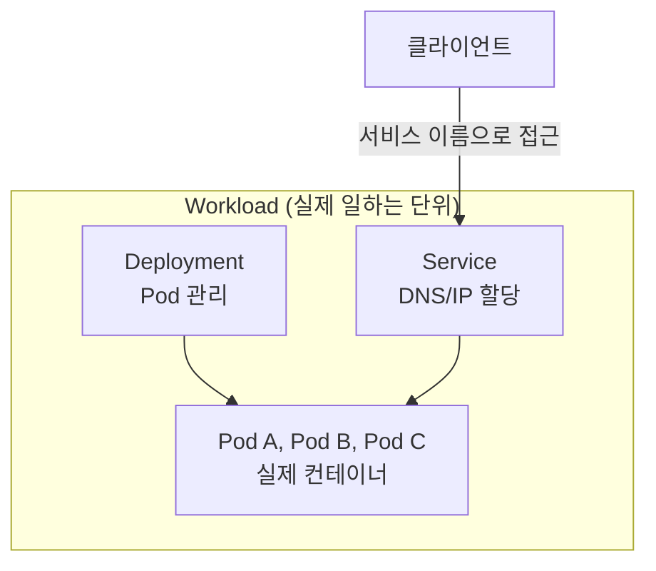
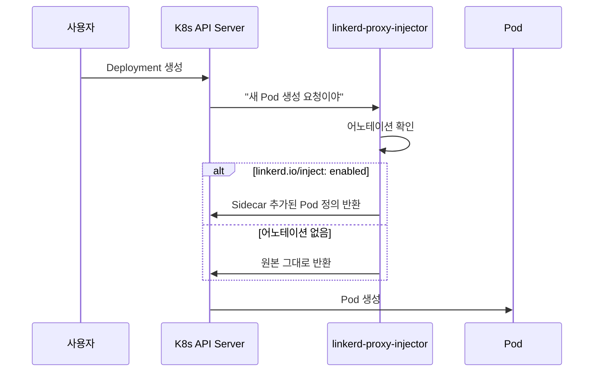
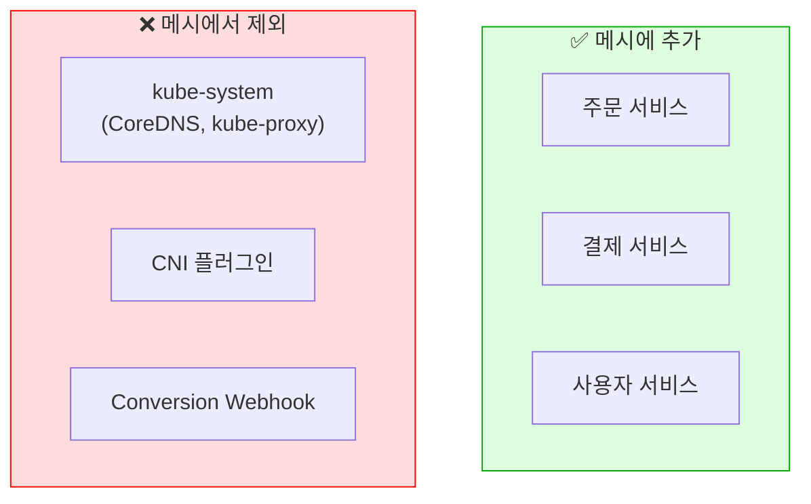
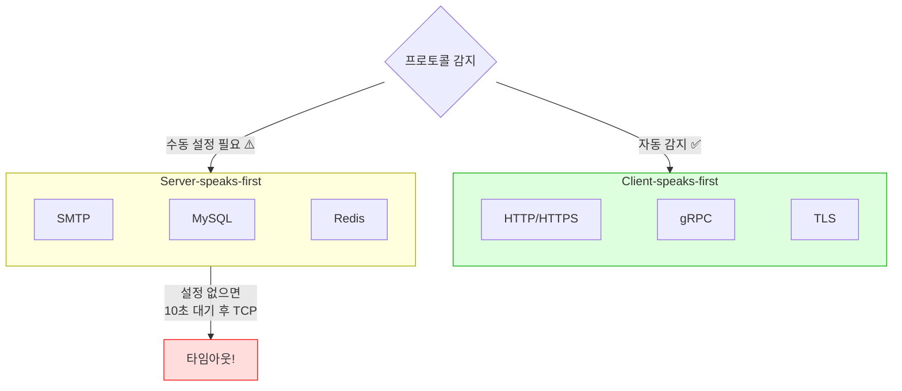
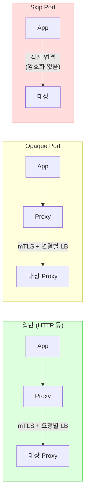

# Chapter 4. Adding Workloads to the Mesh

## 핵심 요약

> 이 장에서는 워크로드를 Linkerd 메시에 추가하는 방법을 다룹니다.
> 핵심은 "Sidecar 주입은 어노테이션으로 제어하며, 프로토콜 감지가 자동으로 되지 않는 경우(Server-speaks-first) Opaque 또는 Skip 포트를 설정해야 한다"는 것입니다.

---

## 학습 목표

이 내용을 읽고 나면:
- [ ] Workload, Service, service의 차이를 설명할 수 있다
- [ ] linkerd-proxy-injector의 동작 방식을 설명할 수 있다
- [ ] Client-speaks-first와 Server-speaks-first 프로토콜의 차이를 말할 수 있다
- [ ] Opaque Port와 Skip Port를 언제 사용하는지 판단할 수 있다

---

## 본문 정리

### 1. 용어 정리: Workload vs Service

Kubernetes에서 이 용어들은 혼란스럽게 사용됩니다. 정확히 구분해 봅시다.

**Service** (대문자): Kubernetes 리소스입니다. DNS 이름과 IP 주소를 할당하는 역할을 합니다.

**Workload**: 실제로 일을 하는 것입니다. 네트워크 요청을 받아서 코드를 실행합니다. 보통 Pod(계산) + Deployment/DaemonSet(관리) + Service(네트워크)의 조합입니다.

**service** (소문자): 문맥에 따라 Service 또는 Workload를 가리키는 비공식 용어입니다.



---

### 2. 메시에 워크로드 추가하기

"메시에 워크로드를 추가한다"는 것은 "각 Pod에 Linkerd Sidecar를 주입한다"는 의미입니다.

Pod 정의를 직접 수정할 수도 있지만, Linkerd가 자동으로 해주는 것이 더 안전하고 편리합니다.

#### linkerd-proxy-injector

Linkerd는 `linkerd-proxy-injector`라는 Kubernetes Admission Controller를 제공합니다. 새 Pod가 생성될 때 특정 어노테이션이 있으면 자동으로 Sidecar를 주입합니다.



#### 주입 방법

**개별 워크로드에 주입**: Pod 템플릿에 어노테이션 추가

```yaml
apiVersion: apps/v1
kind: Deployment
metadata:
  name: my-app
spec:
  template:
    metadata:
      annotations:
        linkerd.io/inject: enabled  # 이 어노테이션!
    spec:
      containers:
      - name: my-app
        image: my-app:latest
```

**네임스페이스 전체에 주입**: Namespace에 어노테이션 추가

```yaml
apiVersion: v1
kind: Namespace
metadata:
  name: my-namespace
  annotations:
    linkerd.io/inject: enabled
```

이렇게 하면 해당 네임스페이스에 생성되는 모든 Pod에 Sidecar가 주입됩니다.

> 💬 **비유**: Namespace 어노테이션은 "구역 전체 소독"과 같습니다.
>
> 개별 집마다 소독할 수도 있지만, 아파트 관리사무소에서 "이 동 전체를 소독한다"고 결정하면 모든 세대에 적용됩니다. Namespace 어노테이션도 마찬가지로, 해당 네임스페이스의 모든 Pod에 Sidecar가 주입됩니다.

#### 어노테이션 값

| 값 | 의미 |
|---|------|
| `linkerd.io/inject: enabled` | 일반 모드로 Sidecar 주입 |
| `linkerd.io/inject: ingress` | Ingress 모드로 주입 (Chapter 5에서 상세) |
| `linkerd.io/inject: disabled` | 명시적으로 주입 거부 (Namespace 어노테이션 무시) |

---

### 3. 메시에 추가하지 말아야 할 것

**규칙:**
- ✅ 애플리케이션 워크로드: 항상 메시에 추가
- ❌ 클러스터 인프라: 절대 메시에 추가하지 않음

왜 인프라는 제외할까요? `kube-system`의 Pod들은 스스로를 보호하도록 설계되어 있습니다. 일부는 네트워크 계층에 직접 접근해야 하므로, 중간에 프록시가 있으면 오히려 문제가 됩니다.

**메시에 추가하지 않는 것들:**
- `kube-system` 네임스페이스의 모든 것
- CNI 구현체 (네트워크 계층 직접 접근 필요)
- Kubernetes Conversion Webhook (자체 TLS 요구사항 있음)



---

### 4. 프로토콜 감지 (Protocol Detection)

Linkerd는 연결의 프로토콜을 알아야 제대로 관리할 수 있습니다.

왜 프로토콜을 알아야 할까요?

**관측성**: 요청의 시작과 끝을 알아야 지연 시간과 성공률을 측정할 수 있습니다.

**신뢰성**: HTTP/2나 gRPC는 하나의 연결에 여러 요청이 동시에 흐릅니다. 프로토콜을 모르면 연결 기반 로드밸런싱만 가능하고, 요청 기반 로드밸런싱은 불가능합니다.

**보안**: 워크로드가 이미 TLS를 사용한다면, Linkerd가 다시 암호화하면 안 됩니다.

> 💬 **비유**: 프로토콜 감지는 "우편물 분류"와 같습니다.
>
> 택배 기사가 상자를 볼 때, 깨지기 쉬운 물건인지, 냉동 보관이 필요한지 알아야 적절히 처리할 수 있습니다. 마찬가지로 Linkerd도 HTTP인지, gRPC인지, MySQL인지 알아야 적절한 로드밸런싱과 메트릭 수집이 가능합니다.

#### Client-speaks-first vs Server-speaks-first

자동 프로토콜 감지에는 한계가 있습니다. **연결을 만든 쪽이 먼저 데이터를 보내는 프로토콜**에서만 작동합니다.

왜 Server-speaks-first가 문제일까요? Linkerd는 프로토콜을 알기 전에는 어떤 서버에 연결할지 결정할 수 없습니다. 그런데 서버가 먼저 말하는 프로토콜에서는 서버에 연결해야 프로토콜을 알 수 있습니다. 닭과 달걀 문제입니다!

**Client-speaks-first (자동 감지 가능):**
- HTTP, HTTPS
- gRPC
- TLS 자체

**Server-speaks-first (수동 설정 필요):**
- SMTP (메일 서버가 먼저 인사)
- MySQL (서버가 먼저 버전 정보 전송)
- Redis

Server-speaks-first 프로토콜에서 Linkerd는 10초 동안 기다린 후 "모르겠다"고 판단하고 일반 TCP로 처리합니다. 이 10초 지연을 피하려면 Opaque 또는 Skip으로 설정해야 합니다.



---

### 5. Opaque Port vs Skip Port

Server-speaks-first 프로토콜을 처리하는 두 가지 방법이 있습니다.

#### Opaque Port

Linkerd 프록시를 거치지만, 프로토콜을 이해하지 않습니다.

**특징:**
- ✅ mTLS 적용 (암호화됨)
- ✅ 정책 적용 가능
- ❌ 요청별 메트릭 없음 (연결별 메트릭만)
- ❌ 요청별 로드밸런싱 없음 (연결별 로드밸런싱만)

#### Skip Port

Linkerd 프록시를 완전히 우회합니다.

**특징:**
- ❌ mTLS 없음 (암호화 안 됨)
- ❌ 정책 적용 불가
- ❌ 메트릭 없음
- ❌ 로드밸런싱 없음



#### 언제 어떤 것을 사용할까?

**Opaque를 사용하는 경우:**
- Server-speaks-first 프로토콜이지만 메시 내부 통신인 경우
- mTLS 암호화가 필요한 경우
- 정책 적용이 필요한 경우

**Skip을 사용하는 경우:**
- 대상이 메시 외부에 있는 경우 (프록시가 없으므로 mTLS 불가)
- 레거시 시스템과 통신하는 경우

> 💬 **비유**: Opaque는 "봉인된 택배", Skip은 "택배 안 맡기고 직접 전달"입니다.
>
> Opaque는 내용물은 모르지만 택배 시스템을 통해 안전하게 배송됩니다. Skip은 택배를 안 맡기고 직접 전달하는 것이라, 분실이나 손상 위험이 있습니다.

---

### 6. 프로토콜 감지 설정

어노테이션으로 포트별 동작을 설정할 수 있습니다.

```yaml
metadata:
  annotations:
    # Opaque 포트 설정
    config.linkerd.io/opaque-ports: "3306,6379"

    # 인바운드 Skip 설정
    config.linkerd.io/skip-inbound-ports: "8000-9000"

    # 아웃바운드 Skip 설정
    config.linkerd.io/skip-outbound-ports: "25,587"

    # 서브넷 Skip 설정
    config.linkerd.io/skip-subnets: "10.0.0.0/8,192.168.1.0/24"
```

**기본 Opaque 포트 (Linkerd 2.12+):**

| 프로토콜 | 포트 |
|---------|------|
| SMTP | 25, 587 |
| MySQL | 3306, 4444 |
| PostgreSQL | 5432 |
| Redis | 6379 |
| Elasticsearch | 9300 |
| Memcached | 11211 |

⚠️ **주의**: 이 포트들에서 Client-speaks-first 프로토콜(예: HTTP)을 사용한다면, Server 리소스로 재정의하거나 다른 포트를 사용해야 합니다.

---

### 7. 프록시 리소스 설정

Sidecar 프록시의 CPU/메모리 리소스를 어노테이션으로 설정할 수 있습니다.

```yaml
metadata:
  annotations:
    config.linkerd.io/proxy-cpu-request: "100m"
    config.linkerd.io/proxy-cpu-limit: "500m"
    config.linkerd.io/proxy-memory-request: "64Mi"
    config.linkerd.io/proxy-memory-limit: "256Mi"
```

| 어노테이션 | 설명 |
|-----------|------|
| `proxy-cpu-request` | 프록시가 요청하는 CPU |
| `proxy-cpu-limit` | 프록시가 사용할 수 있는 최대 CPU |
| `proxy-memory-request` | 프록시가 요청하는 메모리 |
| `proxy-memory-limit` | 프록시가 사용할 수 있는 최대 메모리 |
| `proxy-ephemeral-storage-request` | 임시 스토리지 요청 |
| `proxy-ephemeral-storage-limit` | 임시 스토리지 제한 |

---

## 심화 학습

### HTTP/2와 gRPC의 로드밸런싱

HTTP/1.1에서는 보통 요청마다 새 연결을 만들거나, Keep-Alive로 순차적으로 요청합니다. 연결 기반 로드밸런싱으로도 어느 정도 분산됩니다.

HTTP/2와 gRPC는 다릅니다. 하나의 연결에 수십, 수백 개의 요청이 동시에 흐릅니다(Multiplexing). 연결 기반 로드밸런싱을 하면, 한 번 연결된 Pod에 모든 요청이 몰릴 수 있습니다.

Linkerd는 프로토콜을 감지하면 자동으로 요청 기반 로드밸런싱을 합니다. 설정이 필요 없습니다. 이것이 "운영 단순성"의 예시입니다.

### 왜 워크로드 간 TLS를 직접 설정하면 안 되나?

워크로드가 직접 TLS를 사용하면, Linkerd가 내용을 볼 수 없습니다. 요청별 메트릭, 요청별 로드밸런싱, 재시도 등 모든 고급 기능이 비활성화됩니다.

대신 워크로드는 Plain HTTP로 통신하고, Linkerd가 mTLS를 적용하게 하세요. 이렇게 하면 모든 기능을 활용할 수 있습니다.

---

## 면접 대비

### 한 줄 정의

"Linkerd에 워크로드를 추가한다는 것은 Pod에 Sidecar 프록시를 주입하는 것이며, 이는 어노테이션으로 제어됩니다."

### 핵심 포인트 3가지

1. **주입 방법**: `linkerd.io/inject: enabled` 어노테이션을 Pod 템플릿이나 Namespace에 추가. Namespace에 추가하면 해당 네임스페이스의 모든 Pod에 적용

2. **프로토콜 감지**: Client-speaks-first(HTTP, gRPC)는 자동 감지. Server-speaks-first(MySQL, Redis)는 Opaque/Skip 설정 필요. 설정 없으면 10초 타임아웃

3. **Opaque vs Skip**: Opaque는 mTLS 유지하면서 프로토콜 무시. Skip은 프록시 완전 우회(암호화 없음). 메시 내부 통신은 Opaque, 외부는 Skip

### 자주 묻는 질문

**Q: Namespace 어노테이션과 Pod 어노테이션이 충돌하면?**

A: Pod 어노테이션이 우선합니다. Namespace에 `inject: enabled`가 있어도, Pod에 `inject: disabled`가 있으면 주입되지 않습니다. 이를 통해 특정 Pod만 제외할 수 있습니다.

**Q: Server-speaks-first 프로토콜에서 Opaque 대신 Skip을 쓰면 안 되나요?**

A: 메시 내부 통신이라면 Opaque가 낫습니다. Skip은 mTLS가 적용되지 않아서 암호화되지 않습니다. 대상이 메시 외부에 있어서 프록시가 없는 경우에만 Skip을 사용하세요.

**Q: HTTP/2에서 연결 기반 로드밸런싱이 문제인 이유는?**

A: HTTP/2는 하나의 연결에 여러 요청이 동시에 흐릅니다. 연결을 한 번 특정 Pod에 할당하면, 그 연결의 모든 요청이 같은 Pod로 갑니다. 트래픽이 한 Pod에 몰리고 다른 Pod는 놀게 됩니다. Linkerd는 프로토콜을 감지하면 자동으로 요청 기반 로드밸런싱을 해서 이 문제를 해결합니다.

---

## 핵심 개념 체크리스트

- [ ] Workload와 Service의 차이를 설명할 수 있는가?
- [ ] linkerd-proxy-injector가 어떻게 동작하는지 아는가?
- [ ] Namespace 어노테이션과 Pod 어노테이션의 우선순위를 아는가?
- [ ] 왜 kube-system은 메시에 추가하지 않는지 설명할 수 있는가?
- [ ] Client-speaks-first와 Server-speaks-first의 차이를 아는가?
- [ ] Opaque Port와 Skip Port를 언제 사용하는지 판단할 수 있는가?
- [ ] HTTP/2에서 요청 기반 로드밸런싱이 왜 중요한지 설명할 수 있는가?

---

## 참고 자료

- Linkerd Proxy Injection: [linkerd.io/docs/proxy-injection](https://linkerd.io/docs/)
- Linkerd Protocol Detection: [linkerd.io/docs/protocol-detection](https://linkerd.io/docs/)
- Linkerd Proxy Configuration: [linkerd.io/docs/proxy-configuration](https://linkerd.io/docs/)
