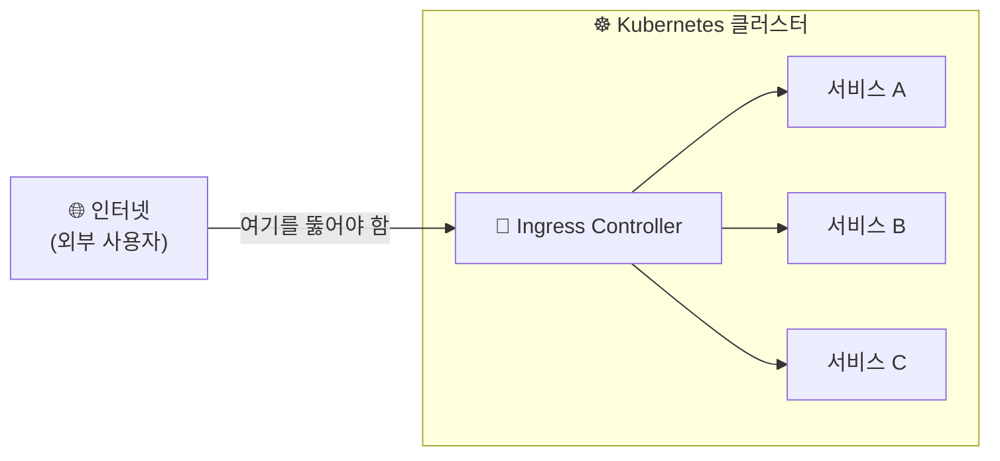
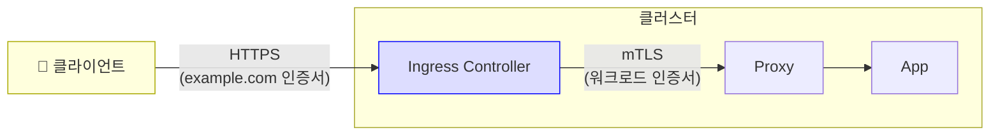
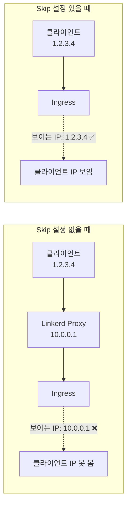
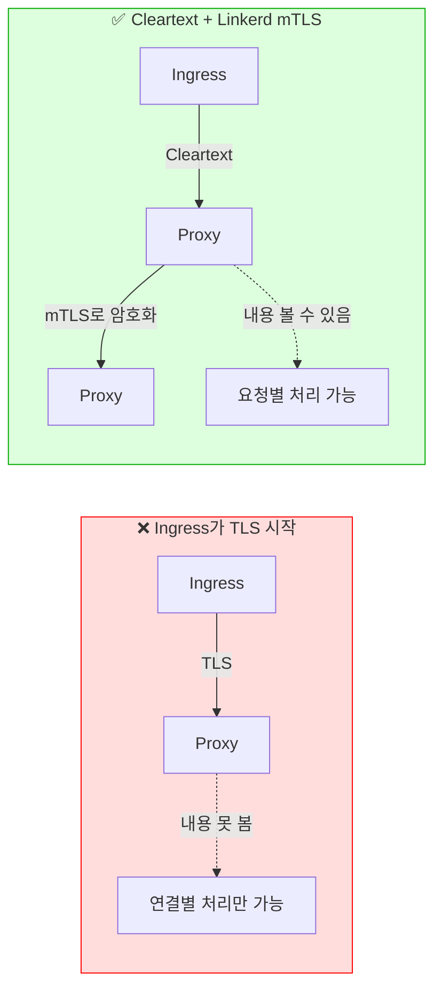
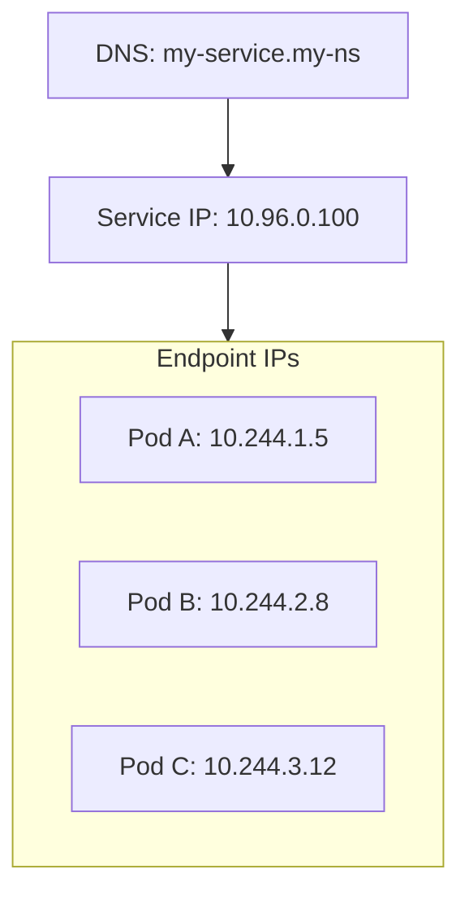
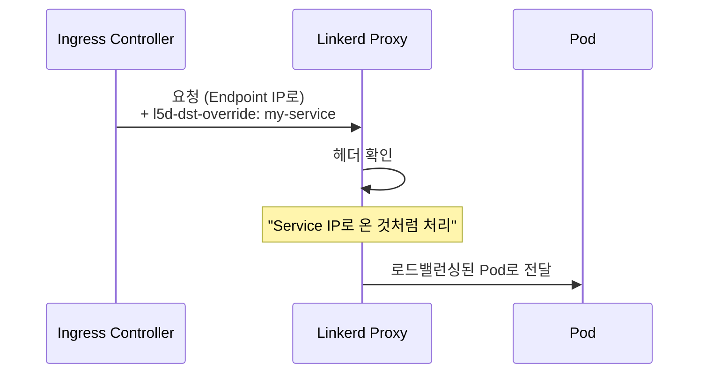

# Chapter 5. Ingress and Linkerd

## 핵심 요약

> 이 장에서는 Ingress Controller와 Linkerd를 함께 사용하는 방법을 다룹니다.
> 핵심은 "Ingress Controller는 메시의 또 다른 워크로드이며, 클러스터 내부에서는 Cleartext를 사용하고 Service IP로 라우팅해야 Linkerd의 모든 기능을 활용할 수 있다"는 것입니다.

---

## 학습 목표

이 내용을 읽고 나면:
- [ ] Ingress 문제가 무엇인지 설명할 수 있다
- [ ] Ingress Controller의 인바운드 포트를 Skip해야 하는 이유를 말할 수 있다
- [ ] Service IP로 라우팅하는 것과 Endpoint IP로 라우팅하는 것의 차이를 설명할 수 있다
- [ ] Ingress Mode가 언제 필요한지 판단할 수 있다

---

## 본문 정리

### 1. Ingress 문제란?

Kubernetes 클러스터는 내부를 보호하도록 설계되어 있습니다. 하지만 실제 사용자는 클러스터 외부(인터넷)에 있습니다. 외부 사용자가 내부 서비스에 접근할 수 있게 하는 것이 **Ingress 문제**입니다.

Linkerd는 Ingress Controller를 포함하지 않습니다. 대신 어떤 Ingress Controller든 메시와 함께 사용할 수 있도록 설계되었습니다.

왜 Linkerd가 자체 Ingress Controller를 제공하지 않을까요? 다른 Service Mesh는 자체 Ingress를 강제하기도 합니다. 하지만 Linkerd는 유연성과 운영 단순성을 위해 Ingress에 중립적인 접근을 취합니다. 이미 사용 중인 Ingress Controller가 있다면 그대로 쓸 수 있습니다.



---

### 2. Ingress Controller의 공통 특성

모든 Ingress Controller는 다음 특성을 공유합니다:

**클러스터 엣지에 위치**: 보통 `LoadBalancer` 타입 Service 뒤에 있으며, 인터넷에 직접 노출됩니다. 보안이 핵심 관심사입니다.

**라우팅 제어**: 어떤 외부 요청이 어떤 내부 서비스로 가는지 제어합니다. Ingress Controller 설치가 모든 서비스를 인터넷에 노출하면 안 됩니다.

**Layer 7 라우팅**: 대부분 HTTP/gRPC에 대한 정교한 라우팅을 지원합니다.
- 예: "hostname이 foo.example.com이고 path가 /bar/로 시작하면 bar-service로 라우팅"

**Layer 4 라우팅**: TCP 수준의 단순한 라우팅도 지원합니다.
- 예: "포트 1234로 오는 TCP 연결을 bar-service로 라우팅"

**TLS 종료/시작**: HTTPS를 위해 클러스터 엣지에서 TLS를 처리합니다.

---

### 3. Ingress Controller와 TLS

Ingress Controller는 두 개의 독립된 TLS 영역을 관리합니다.

**외부 TLS**: 클라이언트 ↔ Ingress Controller
- 사용자가 기대하는 인증서 (예: `*.example.com`)
- HTTPS

**내부 mTLS**: Ingress Controller ↔ 메시 워크로드
- Linkerd가 관리하는 워크로드 인증서
- mTLS

이 두 영역은 분리되어야 합니다. 클라이언트에게 보여주는 인증서와 메시 내부의 워크로드 ID는 다른 것이기 때문입니다.



---

### 4. Linkerd와 Ingress Controller

Linkerd 관점에서 Ingress Controller는 **그냥 또 다른 메시 워크로드**입니다.

외부 클라이언트가 Ingress Controller에 접속할 수 있다는 사실은 Linkerd가 신경 쓸 일이 아닙니다. Sidecar를 주입하면 mTLS, 메트릭 등 모든 기능이 그대로 동작합니다.

> 💬 **비유**: Ingress Controller는 "건물의 정문 경비원"과 같습니다.
>
> 경비원도 회사 직원이고 사원증(Sidecar)을 발급받습니다. 다만 외부인(인터넷 사용자)을 만나는 역할이 특수할 뿐입니다. 건물 내부에서는 다른 직원과 똑같이 규칙(mTLS, 정책)을 따릅니다.

---

### 5. Skip Inbound Ports

Ingress Controller에서 거의 항상 필요한 특별한 설정이 있습니다: **인바운드 포트 Skip**.

왜 필요할까요? 많은 Ingress Controller가 클라이언트 IP 주소를 알아야 합니다 (라우팅, 인가, 로깅 등). 하지만 Linkerd가 연결을 처리하면, Ingress Controller가 보는 IP는 항상 Linkerd 프록시 IP입니다.



**설정 방법:**

```yaml
metadata:
  annotations:
    config.linkerd.io/skip-inbound-ports: "8080"
```

⚠️ **주의**: Skip할 포트는 **Pod가 실제로 듣는 포트**입니다. Service의 port가 아닙니다!

```yaml
apiVersion: v1
kind: Service
spec:
  ports:
  - port: 80        # 클라이언트가 사용하는 포트
    targetPort: 8080  # Pod가 실제로 듣는 포트 ← 이걸 Skip!
```

**보안 걱정은 없나요?** Ingress Controller는 원래 인터넷에 직접 노출되도록 설계되었습니다. 인바운드를 Skip해도 Ingress Controller 자체의 보안 기능이 작동합니다.

---

### 6. 클러스터 내부에서 Cleartext 사용

이상하게 들릴 수 있지만, Ingress Controller가 메시 워크로드에 연결할 때는 **Cleartext(평문)**를 사용해야 합니다.

왜 TLS를 쓰면 안 되나요? Ingress Controller가 직접 TLS를 시작하면, Linkerd는 암호화된 스트림 안을 볼 수 없습니다. 그러면:
- ❌ 요청별 로드밸런싱 불가 (연결별만 가능)
- ❌ 요청별 메트릭 없음
- ❌ 재시도, 타임아웃 등 고급 기능 비활성화

Cleartext를 사용해도 안전합니다. Linkerd의 mTLS가 연결을 보호하기 때문입니다.



---

### 7. Service IP로 라우팅 vs Endpoint IP로 라우팅

Kubernetes Service는 세 가지 구성요소를 가집니다:

1. **DNS 이름**: 클러스터 DNS에 등록된 이름 (예: `my-service.my-ns.svc.cluster.local`)
2. **Service IP**: Service 자체의 단일 IP 주소
3. **Endpoint IP**: Service 뒤에 있는 각 Pod의 IP 주소들



**Linkerd의 동작:**
- **Service IP로 연결**: Linkerd가 로드밸런싱 담당 ✅
- **Endpoint IP로 직접 연결**: Linkerd는 로드밸런싱 안 함 (이미 특정 Pod 지정됨)

왜 이렇게 설계했을까요? 애플리케이션 설계자에게 선택권을 주기 위해서입니다. Linkerd에 맡기고 싶으면 Service IP로 라우팅하고, 직접 제어하고 싶으면 Endpoint IP를 사용합니다.

**대부분의 경우 Service IP 라우팅이 좋습니다.** Linkerd의 모든 기능을 활용할 수 있습니다.

---

### 8. Ingress Mode

일부 Ingress Controller는 Service IP가 아닌 Endpoint IP로만 라우팅합니다. 이런 경우를 위해 **Ingress Mode**가 있습니다.

**작동 방식:**

Ingress Controller가 `l5d-dst-override` 헤더에 Service 이름을 넣어서 요청을 보냅니다. Linkerd는 Endpoint IP로 온 요청이라도, 이 헤더를 보고 Service IP로 온 것처럼 처리합니다.

```
l5d-dst-override: my-service.my-ns.svc.cluster.local
```



**설정:**

```yaml
metadata:
  annotations:
    linkerd.io/inject: ingress  # enabled 대신 ingress
```

⚠️ **주의**: Ingress Controller가 `l5d-dst-override` 헤더를 주입할 수 있어야 합니다. 이 헤더를 주입할 수 없는 Ingress Controller는 Ingress Mode와 호환되지 않습니다.

**가능하면 Ingress Mode 대신 Service IP 라우팅을 설정하는 것이 좋습니다.**

---

### 9. Ingress Controller별 설정

#### Emissary-ingress

Envoy 기반 Kubernetes 네이티브 API Gateway입니다. CNCF 인큐베이팅 프로젝트입니다.

**특징**: 기본적으로 Service IP로 라우팅합니다.

**설정**: 특별한 설정 없이 작동합니다. 클라이언트 IP가 필요하면 인바운드 포트만 Skip하면 됩니다.

```yaml
config.linkerd.io/skip-inbound-ports: "8080"
```

#### NGINX (ingress-nginx)

오래된 웹 서버/API Gateway로, Kubernetes 최초의 Ingress Controller 중 하나입니다.

**특징**: 기본적으로 **Endpoint IP로 라우팅**합니다.

**설정**: Ingress 리소스에 어노테이션 추가 필요

```yaml
apiVersion: networking.k8s.io/v1
kind: Ingress
metadata:
  annotations:
    nginx.ingress.kubernetes.io/service-upstream: "true"  # Service IP 사용
```

#### Envoy Gateway

Gateway API 구현체입니다. 버전 1.0이 최근 출시되었습니다.

**특징**:
- Gateway 리소스 변경 시 Data Plane Pod를 삭제하고 재생성합니다
- 버전 1.0에서는 **Endpoint IP로만 라우팅**합니다 (향후 개선 예정)

**설정**: Namespace에 어노테이션 적용 (Pod 재생성에 대응)

```yaml
apiVersion: v1
kind: Namespace
metadata:
  name: envoy-gateway-system
  annotations:
    linkerd.io/inject: enabled
```

---

## 실무 적용 포인트

### Ingress Controller 메시 추가 체크리스트

1. [ ] Ingress Controller Pod에 Sidecar 주입 설정
2. [ ] 클라이언트 IP 필요시 인바운드 포트 Skip 설정
3. [ ] 클러스터 내부 연결을 Cleartext로 설정 (TLS 끄기)
4. [ ] Service IP 라우팅 설정 (또는 Ingress Mode)
5. [ ] `linkerd check` 및 트래픽 테스트

### 주의할 점

- ⚠️ Skip할 포트는 Service port가 아닌 **targetPort (Pod 포트)**
- ⚠️ Ingress Controller가 워크로드에 TLS 시작하면 Linkerd 기능 제한
- ⚠️ Ingress Mode는 `l5d-dst-override` 헤더 주입 가능해야 사용 가능

---

## 면접 대비

### 한 줄 정의

"Linkerd에서 Ingress Controller는 또 다른 메시 워크로드이며, 클러스터 내부에서는 Cleartext를 사용하고 Service IP로 라우팅해야 모든 기능을 활용할 수 있습니다."

### 핵심 포인트 3가지

1. **인바운드 포트 Skip**: Ingress Controller가 클라이언트 IP를 알아야 하면 인바운드 포트를 Skip. Linkerd 프록시를 거치면 프록시 IP만 보임

2. **Cleartext 사용**: Ingress → 워크로드 연결은 Cleartext로. Ingress가 TLS 시작하면 Linkerd가 내용을 못 봐서 요청별 처리 불가

3. **Service IP 라우팅**: Endpoint IP 직접 연결하면 로드밸런싱 안 됨. Service IP로 라우팅해야 Linkerd가 로드밸런싱. 불가능하면 Ingress Mode 사용

### 자주 묻는 질문

**Q: 왜 Linkerd는 자체 Ingress Controller를 제공하지 않나요?**

A: 유연성과 운영 단순성 때문입니다. 이미 사용 중인 Ingress Controller가 있다면 그대로 쓸 수 있습니다. Ingress Controller와 Service Mesh를 다른 시점에 도입할 수도 있습니다. Linkerd의 핵심 철학인 "운영 단순성"에 맞는 접근입니다.

**Q: Ingress Controller의 인바운드를 Skip해도 보안에 문제없나요?**

A: 네, 문제없습니다. Ingress Controller는 원래 인터넷에 직접 노출되도록 설계되었습니다. 자체 보안 기능(TLS 종료, 인증, 인가 등)이 있습니다. Skip은 Linkerd 프록시를 우회할 뿐, Ingress Controller의 보안 기능은 그대로 작동합니다.

**Q: Ingress Mode의 `l5d-dst-override` 헤더는 누가 설정하나요?**

A: Ingress Controller가 설정해야 합니다. Linkerd가 자동으로 만들 수 없습니다. 왜냐하면 Endpoint IP만으로는 어떤 Service에 속하는지 알 수 없기 때문입니다 (하나의 Pod가 여러 Service에 속할 수 있음).

---

## 핵심 개념 체크리스트

- [ ] Ingress 문제가 무엇인지 설명할 수 있는가?
- [ ] Ingress Controller의 인바운드 포트를 Skip하는 이유를 아는가?
- [ ] Skip할 포트가 Service port가 아닌 targetPort인 이유를 아는가?
- [ ] 클러스터 내부에서 Cleartext를 권장하는 이유를 설명할 수 있는가?
- [ ] Service IP 라우팅과 Endpoint IP 라우팅의 차이를 아는가?
- [ ] Ingress Mode가 언제 필요한지 판단할 수 있는가?
- [ ] 주요 Ingress Controller(Emissary, NGINX, Envoy Gateway)의 특성을 아는가?

---

## 참고 자료

- Linkerd Ingress Documentation: [linkerd.io/docs/ingress](https://linkerd.io/docs/)
- Emissary-ingress: [getambassador.io](https://www.getambassador.io/)
- ingress-nginx: [kubernetes.github.io/ingress-nginx](https://kubernetes.github.io/ingress-nginx/)
- Envoy Gateway: [gateway.envoyproxy.io](https://gateway.envoyproxy.io/)
