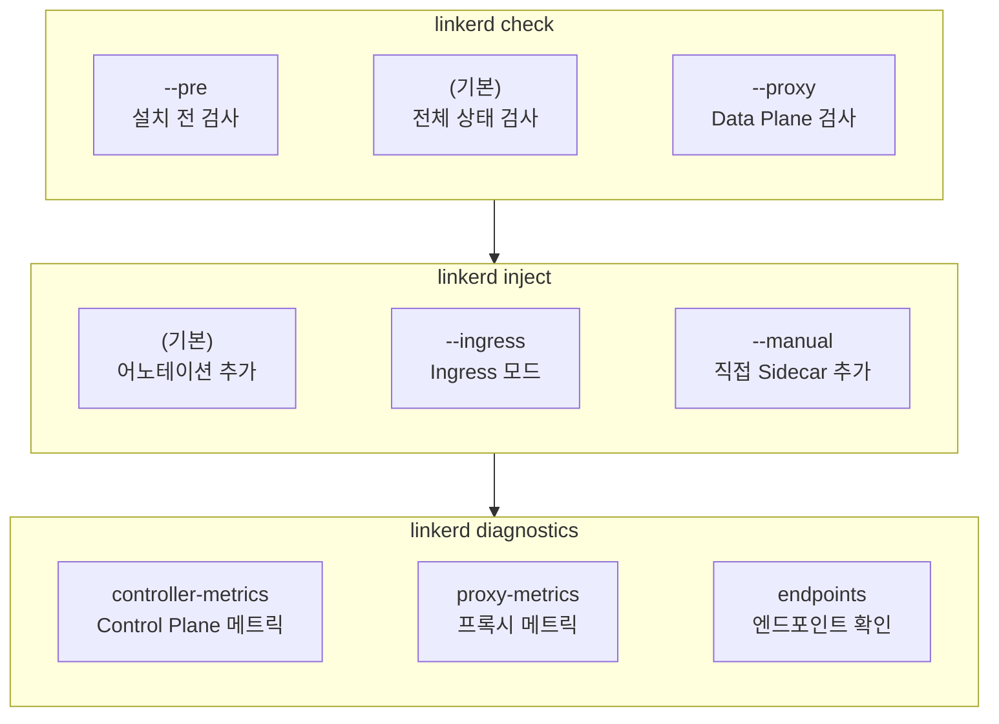
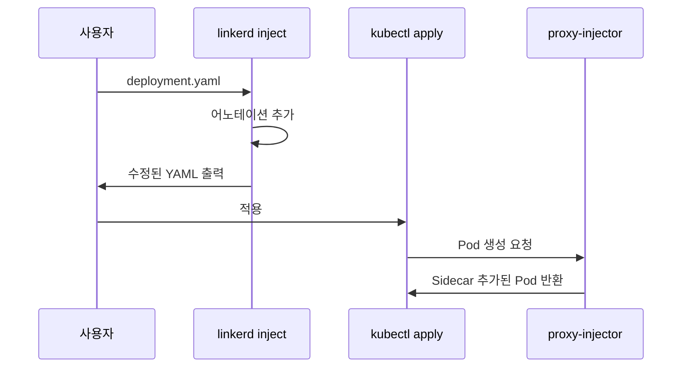
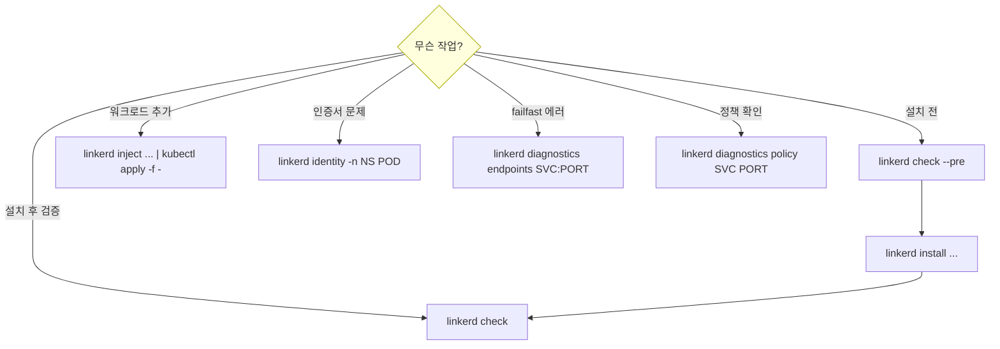

# Chapter 6. The Linkerd CLI

## 핵심 요약

> 이 장에서는 Linkerd CLI의 설치와 주요 명령어를 다룹니다.
> 핵심은 "CLI는 Linkerd와 직접 상호작용하는 권장 방법이며, `check`, `inject`, `identity`, `diagnostics` 명령이 가장 자주 사용된다"는 것입니다.

---

## 학습 목표

이 내용을 읽고 나면:
- [ ] Linkerd CLI를 설치하고 업데이트할 수 있다
- [ ] `linkerd check`의 다양한 옵션을 이해하고 사용할 수 있다
- [ ] `linkerd inject`로 워크로드에 Sidecar를 주입할 수 있다
- [ ] `linkerd diagnostics`로 문제를 진단할 수 있다

---

## 본문 정리

### 1. CLI 설치

#### Edge 채널 설치

```bash
curl --proto '=https' --tlsv1.2 -sSfL https://run.linkerd.io/install-edge | sh

# PATH에 추가
export PATH=$HOME/.linkerd2/bin:$PATH
```

#### 특정 버전 설치

```bash
curl --proto '=https' --tlsv1.2 -sSfL https://run.linkerd.io/install-edge \
    | LINKERD2_VERSION="stable-2.13.12" sh
```

⚠️ **주의**: `LINKERD2_VERSION`은 `sh` 명령에 설정해야 합니다. `curl`에 설정하면 효과가 없습니다.

#### 대안 설치 방법

```bash
# Homebrew (Mac)
brew install linkerd

# 또는 GitHub Releases에서 직접 다운로드
```

---

### 2. CLI 버전과 Control Plane 버전

CLI 버전과 Control Plane 버전은 **독립적**입니다. 반드시 일치시켜야 합니다.

왜 중요할까요? 일부 CLI 명령은 복잡한 조작을 수행합니다. 버전이 다르면 예상치 못한 동작이 발생할 수 있습니다. **1 major 버전 차이까지는 OK**, 그 이상은 지원되지 않습니다.

```bash
$ linkerd version
Client version: stable-2.14.6
Server version: stable-2.14.6  # 일치해야 함!
```

---

### 3. 주요 명령어



---

### 4. linkerd check

Linkerd의 상태를 한눈에 확인하는 가장 중요한 명령입니다.

#### 기본 사용

```bash
linkerd check
```

**수행하는 검사:**
- Linkerd가 올바르게 설치되었는지
- 인증서가 유효한지
- 모든 설치된 Extension 검사
- 필요한 권한 확인

> 💬 **비유**: `linkerd check`는 "자동차 점검 리포트"와 같습니다.
>
> 시동이 걸리는지, 오일은 충분한지, 타이어 공기압은 적정한지 한 번에 확인합니다. 문제가 있으면 어디가 문제인지 알려줍니다.

#### 설치 전 검사

```bash
linkerd check --pre
```

**Linkerd가 설치되지 않은 상태에서 실행**하는 유일한 check 옵션입니다.

**확인 사항:**
- 클러스터가 Linkerd 최소 요구사항 충족하는지
- 설치에 필요한 권한이 있는지

⚠️ CNI 플러그인을 사용할 예정이라면:
```bash
linkerd check --pre --linkerd-cni-enabled
```

#### Data Plane 검사

```bash
linkerd check --proxy
```

프록시가 올바르게 동작하는지 확인합니다.

#### Extension별 검사

```bash
# Viz Extension만 검사
linkerd viz check

# Multicluster Extension만 검사
linkerd multicluster check
```

기본 `linkerd check`는 모든 Extension을 검사합니다. 특정 Extension만 검사하면 시간을 절약할 수 있습니다.

#### 유용한 옵션

| 옵션 | 설명 |
|------|------|
| `--output json` | JSON 형식 출력 (프로그래밍 처리용) |
| `--output short` | 간략한 출력 |
| `--wait 1m` | 타임아웃 변경 (기본 5분) |
| `--namespace app` | 특정 네임스페이스의 프록시만 검사 |

---

### 5. linkerd inject

Kubernetes 리소스에 Linkerd 프록시를 추가하는 명령입니다.

**중요한 특성:**
- 입력을 **수정하지 않고** 수정된 버전을 **출력**합니다
- 실제 적용은 사용자가 직접 해야 합니다

```bash
# URL에서 읽어서 바로 적용
linkerd inject https://url.to/yml | kubectl apply -f -

# 로컬 파일 수정 후 적용
linkerd inject deployment.yaml | kubectl apply -f -

# 파일로 저장 (GitOps용)
linkerd inject deployment.yaml > deployment-injected.yaml
```

#### 동작 방식

기본적으로 `linkerd inject`는 Pod에 `linkerd.io/inject: enabled` 어노테이션만 추가합니다. 실제 Sidecar 주입은 `linkerd-proxy-injector`가 Pod 생성 시 수행합니다.



#### 주요 옵션

| 옵션 | 용도 |
|------|------|
| `--ingress` | Ingress 모드 어노테이션 설정 |
| `--manual` | 어노테이션 대신 Sidecar 직접 추가 |
| `--enable-debug-sidecar` | 디버그 Sidecar 추가 |

`--manual`은 프록시 설정을 세밀하게 제어해야 할 때 사용합니다. 단, 전체 프록시 설정과 동기화가 어려워질 수 있으니 주의가 필요합니다.

---

### 6. linkerd identity

Pod의 인증서 정보를 확인하는 명령입니다.

```bash
linkerd identity -n linkerd linkerd-destination-7447d467f8-f4n9w
```

**출력 정보:**
- 인증서 버전, 시리얼 번호
- 발급자 (Issuer)
- 유효 기간 (Not Before / Not After)
- Subject (워크로드 ID)
- 서명 알고리즘

**사용 시점:**
- 인증서 문제 디버깅
- 인증서가 올바른 CA에서 발급되었는지 확인
- 인증서 만료 시간 확인

---

### 7. linkerd diagnostics

Control Plane과 Data Plane에서 직접 정보를 수집하는 고급 진단 도구입니다.

#### Control Plane 메트릭 수집

```bash
linkerd diagnostics controller-metrics
```

Linkerd Control Plane 컴포넌트들의 Prometheus 메트릭을 수집합니다.

#### 프록시 메트릭 수집

```bash
linkerd diagnostics proxy-metrics -n emojivoto deploy/web
```

특정 워크로드의 프록시 메트릭을 수집합니다.

#### 엔드포인트 확인

```bash
linkerd diagnostics endpoints emoji-svc.emojivoto.svc.cluster.local:8080
```

**Failfast 디버깅에 필수!** Service에 유효한 Endpoint가 없으면 "No endpoints found"가 출력되고, 요청은 failfast 상태에 빠집니다.

```
NAMESPACE   IP           PORT   POD                     SERVICE
emojivoto   10.42.0.15   8080   emoji-5b97875957-xn269  emoji-svc.emojivoto
```

⚠️ **주의**: 반드시 **FQDN + 포트**를 지정해야 합니다.

#### 정책 진단

```bash
linkerd diagnostics policy -n faces svc/smiley 80 > smiley-diag.json
```

특정 Service/Port에 적용된 정책을 상세히 출력합니다. 출력이 매우 길므로 파일로 리다이렉트하는 것이 좋습니다.

---

## 실무 적용 포인트

### 상황별 명령어 가이드



### 자주 사용하는 명령 조합

```bash
# 1. 새 클러스터에 Linkerd 설치
linkerd check --pre
linkerd install --crds | kubectl apply -f -
linkerd install | kubectl apply -f -
linkerd check

# 2. 애플리케이션 메시에 추가
linkerd inject deployment.yaml | kubectl apply -f -
linkerd check --proxy -n my-namespace

# 3. 문제 진단
linkerd check                    # 전체 상태
linkerd identity -n NS POD       # 인증서 확인
linkerd diagnostics endpoints SVC:PORT  # Endpoint 확인
```

---

## 면접 대비

### 한 줄 정의

"Linkerd CLI는 설치, 검증, 주입, 진단 등 Linkerd와 상호작용하는 모든 작업을 수행하는 권장 도구입니다."

### 핵심 포인트 3가지

1. **linkerd check**: 가장 중요한 명령. `--pre`(설치 전), 기본(전체), `--proxy`(Data Plane) 세 가지 모드. 버그 리포트에 항상 포함

2. **linkerd inject**: 리소스를 수정하지 않고 수정된 버전을 출력. 실제 적용은 사용자가 해야 함. 기본적으로 어노테이션만 추가

3. **linkerd diagnostics endpoints**: Failfast 디버깅의 핵심. Service에 Endpoint가 없으면 failfast 발생. FQDN + 포트 필수

### 자주 묻는 질문

**Q: CLI 버전과 Control Plane 버전이 다르면 어떻게 되나요?**

A: 1 major 버전 차이까지는 동작하지만, 그 이상은 지원되지 않습니다. CLI 명령 중 일부는 복잡한 조작을 수행하므로, 버전이 다르면 예상치 못한 동작이 발생할 수 있습니다. 항상 버전을 일치시키세요.

**Q: linkerd inject는 왜 직접 리소스를 수정하지 않나요?**

A: GitOps나 다른 배포 방식을 지원하기 위해서입니다. 출력을 파일로 저장하고 Git에 커밋할 수도 있고, 바로 `kubectl apply`에 파이프할 수도 있습니다. 사용자에게 선택권을 줍니다.

**Q: failfast 에러가 발생했을 때 가장 먼저 확인할 것은?**

A: `linkerd diagnostics endpoints SVC.NS.svc.cluster.local:PORT`로 Endpoint가 있는지 확인하세요. "No endpoints found"가 나오면 Service 뒤에 Ready 상태인 Pod가 없는 것입니다. Pod 상태, Selector 매칭, Readiness Probe를 확인하세요.

---

## 핵심 개념 체크리스트

- [ ] CLI를 설치하고 PATH에 추가할 수 있는가?
- [ ] CLI 버전과 Control Plane 버전을 일치시켜야 하는 이유를 아는가?
- [ ] `linkerd check`의 세 가지 주요 모드(`--pre`, 기본, `--proxy`)를 구분할 수 있는가?
- [ ] `linkerd inject`가 리소스를 직접 수정하지 않는 이유를 아는가?
- [ ] `linkerd diagnostics endpoints`로 failfast 원인을 진단할 수 있는가?

---

## 참고 자료

- Linkerd CLI Reference: [linkerd.io/reference/cli](https://linkerd.io/reference/cli/)
- Linkerd Quickstart: [linkerd.io/getting-started](https://linkerd.io/getting-started/)
- Linkerd Releases: [github.com/linkerd/linkerd2/releases](https://github.com/linkerd/linkerd2/releases)
