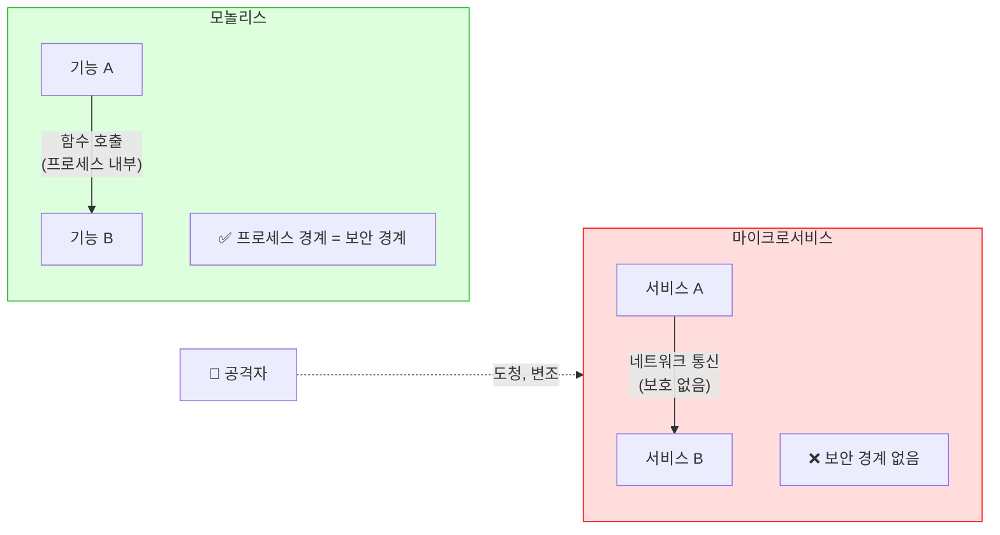
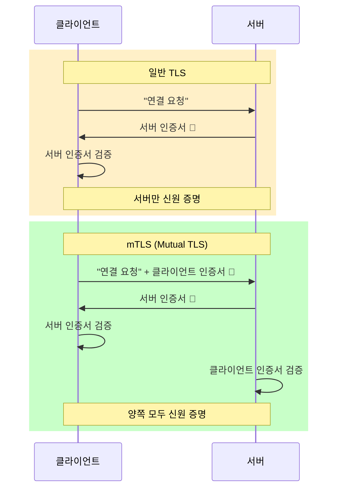
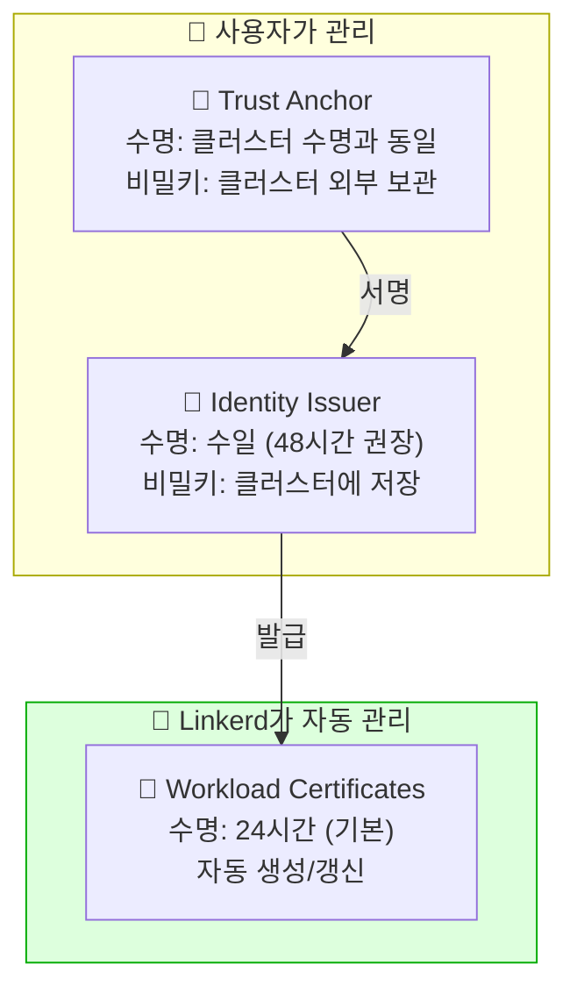
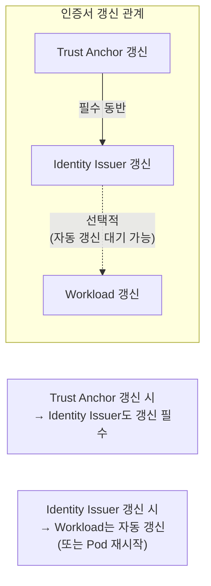
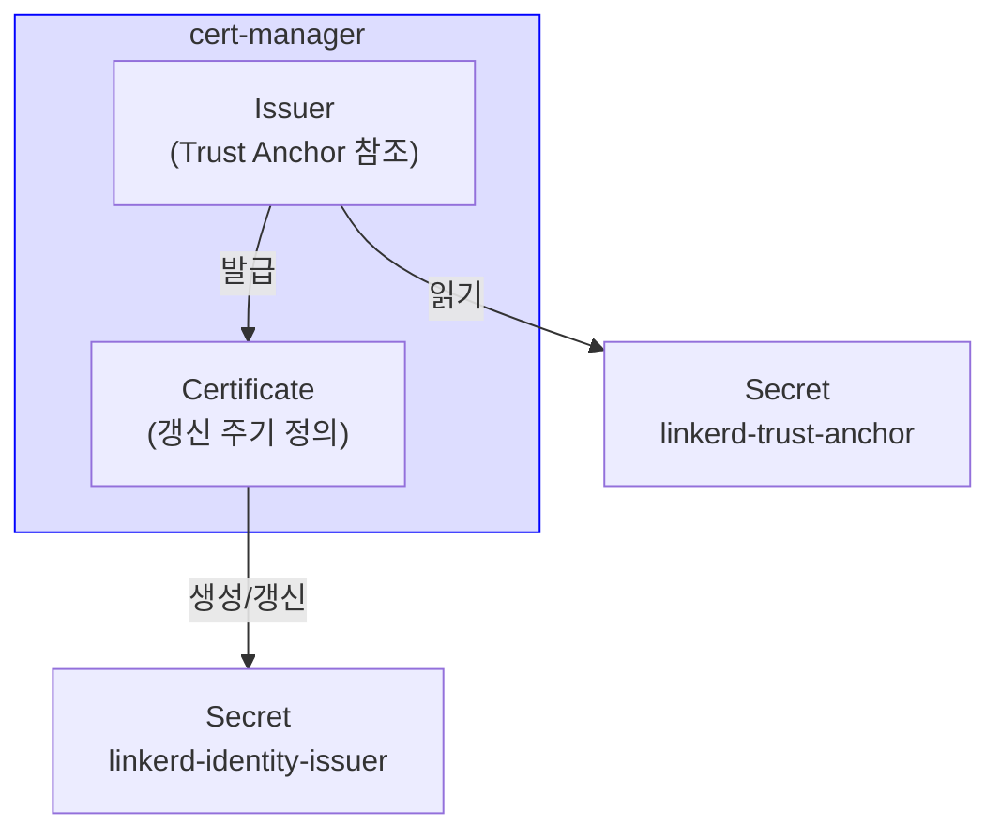

# Chapter 7. mTLS, Linkerd, and Certificates

## 핵심 요약

> 이 장에서는 Linkerd의 mTLS와 인증서 관리를 다룹니다.
> 핵심은 "Linkerd는 모든 메시 내 통신에 mTLS를 자동 적용하며, Trust Anchor와 Identity Issuer는 사용자가, Workload 인증서는 Linkerd가 자동 관리한다"는 것입니다.

---

## 학습 목표

이 내용을 읽고 나면:
- [ ] 보안 통신의 3요소(진정성, 기밀성, 무결성)를 설명할 수 있다
- [ ] TLS와 mTLS의 차이를 말할 수 있다
- [ ] Linkerd 인증서 계층(Trust Anchor, Identity Issuer, Workload)의 역할을 구분할 수 있다
- [ ] cert-manager로 Identity Issuer 자동 갱신을 설정할 수 있다

---

## 본문 정리

### 1. 마이크로서비스의 보안 문제

모놀리스에서는 프로세스 경계가 자연스러운 보안 경계였습니다. 함수 호출로 전달되던 민감한 정보가 마이크로서비스에서는 네트워크를 통해 전송됩니다.

문제는 네트워크가 안전하지 않다는 것입니다. 외부 팀이나 클라우드 제공자가 관리하는 인프라에서 실행되는 경우가 많고, 네트워크에 접근할 수 있는 공격자는 쉽게 통신을 읽고, 가로채고, 수정할 수 있습니다.

또한 네트워크는 호출자의 신원을 보장하지 않습니다. IP 주소는 쉽게 스푸핑할 수 있습니다.



---

### 2. 보안 통신의 3요소

진정으로 안전한 통신을 위해서는 세 가지가 필요합니다.

**진정성 (Authenticity)**: 내가 대화하는 상대가 정말 그 사람인지 확신할 수 있어야 합니다.

**기밀성 (Confidentiality)**: 아무도 전송 중인 데이터를 읽을 수 없어야 합니다.

**무결성 (Integrity)**: 메시지가 전송 중에 변조되지 않았음을 확신할 수 있어야 합니다.

Linkerd는 이 세 가지를 모두 제공하기 위해 **mTLS (mutual TLS)**를 사용합니다.

---

### 3. TLS vs mTLS

**TLS**는 1999년부터 사용된 업계 표준 보안 통신 메커니즘입니다. 웹 브라우저가 은행 사이트와 통신할 때 사용하는 그것입니다.

TLS는 세 가지를 제공합니다:
- **기밀성**: 데이터 암호화
- **무결성**: 메시지 다이제스트(암호화 체크섬)
- **진정성**: 인증서로 신원 확인

**일반 TLS**에서는 **서버만** 인증서를 보냅니다. 브라우저가 쇼핑 사이트에 접속할 때, 쇼핑 사이트는 인증서를 보내지만 브라우저는 보내지 않습니다. 대신 로그인으로 사용자를 인증합니다.

**mTLS (mutual TLS)**에서는 **양쪽 모두** 인증서를 보냅니다. 클라이언트도 서버도 자신의 신원을 증명합니다.

왜 Service Mesh에서 mTLS가 필요할까요? 모든 서비스가 서로를 신뢰해야 하기 때문입니다. 결제 서비스가 요청을 받을 때, 그 요청이 정말 주문 서비스에서 온 것인지 확인해야 합니다.



---

### 4. 인증서와 신뢰 계층

인증서는 **공개키**와 **비밀키**의 쌍(keypair)으로 구성됩니다.

- **비밀키**: 오직 해당 주체만 알아야 함
- **공개키**: 통신이 필요한 모든 사람에게 배포

인증서는 다른 인증서를 **서명(sign)**할 수 있습니다. 이렇게 하면 **신뢰 계층**이 만들어집니다. 상위 인증서가 하위 인증서의 유효성을 보증합니다.

> 💬 **비유**: 인증서 계층은 "공증 시스템"과 같습니다.
>
> 공증인(Trust Anchor)이 법무사(Identity Issuer)를 인증하고, 법무사가 일반 문서(Workload 인증서)를 공증합니다. 문서를 받는 사람은 공증인까지 거슬러 올라가 문서가 진짜인지 확인할 수 있습니다.

---

### 5. Linkerd 인증서 계층

Linkerd는 세 단계의 인증서 계층을 사용합니다.



#### Trust Anchor

모든 신뢰의 기반입니다. 두 가지 용도로 사용됩니다:

1. **Identity Issuer 발급** (설치 시, Linkerd 외부에서)
2. **워크로드 신원 검증** (운영 중, 공개키만 필요)

⚠️ **핵심 원칙**: Trust Anchor의 비밀키는 **절대 클러스터에 저장하지 마세요**. 외부 시스템에 안전하게 보관하고, 공개키만 클러스터에 복사합니다.

**멀티클러스터와 Trust Anchor**: 같은 Trust Anchor를 공유하는 클러스터들은 서로 mTLS 통신이 가능합니다. 반대로, 통신하면 안 되는 클러스터(예: 개발과 프로덕션)는 Trust Anchor를 공유하면 안 됩니다.

#### Identity Issuer

Identity Controller가 Workload 인증서를 발급할 때 사용합니다. Trust Anchor로 서명되어야 하며, **비밀키가 클러스터에 저장**되어야 합니다.

⚠️ **주의**: 각 클러스터는 **고유한 Identity Issuer**를 가져야 합니다. 같은 Identity Issuer를 공유하면 한 클러스터에서 만든 인증서로 다른 클러스터의 정책을 우회할 수 있습니다.

#### Workload Certificates

각 Pod의 프록시가 Identity Controller에게 요청해서 받는 인증서입니다. Kubernetes ServiceAccount에 암호학적으로 연결되어 있습니다.

인증서 이름 형식:
```
$serviceAccountName.$namespace.serviceaccount.identity.linkerd.$clusterDomain
```

예: `web.emojivoto.serviceaccount.identity.linkerd.cluster.local`

Linkerd가 **완전히 자동으로** 관리합니다. 신경 쓸 필요 없습니다.

---

### 6. 인증서 수명과 갱신

키를 오래 사용할수록 해킹 가치가 높아집니다. 그래서 인증서는 유한한 수명을 가지고, 만료 전에 **갱신(Rotation)**해야 합니다.



#### 갱신 주기 권장

| 인증서 | 권장 수명 | 갱신 방법 |
|--------|----------|----------|
| Trust Anchor | 클러스터 수명과 동일 | 클러스터 재생성 시 함께 |
| Identity Issuer | 48시간 | cert-manager 자동 |
| Workload | 24시간 (기본) | Linkerd 자동 |

#### Workload 인증서 튜닝

기본 24시간 수명을 줄일 수 있지만, 두 가지 운영 영향이 있습니다:

1. Identity Controller 부하 증가 (더 자주 갱신 요청)
2. 문제 해결 시간 감소 (70% 지점에서 갱신 시작, 24시간이면 7시간, 2시간이면 40분)

---

### 7. cert-manager로 자동 인증서 관리

cert-manager는 인증서 생성과 갱신을 자동화하는 CNCF 프로젝트입니다.

#### 설치

```bash
# cert-manager 설치
helm repo add jetstack https://charts.jetstack.io
helm repo update
helm install cert-manager jetstack/cert-manager \
  --namespace cert-manager \
  --create-namespace \
  --set installCRDs=true
```

#### 구성



**1. Trust Anchor 생성 및 저장**

```bash
# Trust Anchor 생성
step certificate create root.linkerd.cluster.local ca.crt ca.key \
  --profile root-ca --no-password --insecure --not-after=87600h

# Namespace 생성
kubectl create ns linkerd

# Secret으로 저장 (프로덕션에서는 외부 저장소 사용!)
kubectl create secret tls linkerd-trust-anchor \
  --cert=ca.crt --key=ca.key -n linkerd
```

⚠️ **프로덕션 주의**: Trust Anchor 비밀키를 클러스터에 저장하는 것은 데모용입니다. 프로덕션에서는 Vault 같은 외부 저장소를 사용하세요.

**2. Issuer 생성**

```yaml
apiVersion: cert-manager.io/v1
kind: Issuer
metadata:
  name: linkerd-trust-anchor
  namespace: linkerd
spec:
  ca:
    secretName: linkerd-trust-anchor
```

**3. Certificate 생성 (48시간마다 자동 갱신)**

```yaml
apiVersion: cert-manager.io/v1
kind: Certificate
metadata:
  name: linkerd-identity-issuer
  namespace: linkerd
spec:
  secretName: linkerd-identity-issuer
  duration: 48h                    # 48시간마다 갱신
  issuerRef:
    name: linkerd-trust-anchor
    kind: Issuer
  commonName: identity.linkerd.cluster.local
  dnsNames:
  - identity.linkerd.cluster.local
  isCA: true
  privateKey:
    algorithm: ECDSA
  usages:
  - cert sign
  - crl sign
  - server auth
  - client auth
```

**4. Linkerd 설치**

```bash
helm install linkerd-control-plane -n linkerd \
  --set-file identityTrustAnchorsPEM=ca.crt \
  --set identity.issuer.scheme=kubernetes.io/tls \
  linkerd/linkerd-control-plane
```

---

## 면접 대비

### 한 줄 정의

"Linkerd는 모든 메시 내 통신에 mTLS를 자동 적용하여 진정성, 기밀성, 무결성을 보장하며, 인증서는 세 단계(Trust Anchor → Identity Issuer → Workload) 계층으로 관리됩니다."

### 핵심 포인트 3가지

1. **mTLS vs TLS**: TLS는 서버만 인증서를 보내고, mTLS는 양쪽 모두 인증서를 보냄. Service Mesh에서는 모든 서비스가 서로를 인증해야 하므로 mTLS 필요

2. **인증서 관리 책임**: Trust Anchor와 Identity Issuer는 사용자가 관리, Workload 인증서는 Linkerd가 자동 관리. Trust Anchor 비밀키는 클러스터 외부에 보관

3. **자동 갱신**: cert-manager로 Identity Issuer를 48시간마다 자동 갱신. Workload 인증서는 Linkerd가 24시간마다 자동 갱신

### 자주 묻는 질문

**Q: Trust Anchor 비밀키를 왜 클러스터에 저장하면 안 되나요?**

A: Trust Anchor는 모든 신뢰의 기반입니다. 비밀키가 유출되면 공격자가 어떤 인증서든 발급할 수 있고, 전체 메시의 보안이 무너집니다. 클러스터는 침해될 수 있으므로, Trust Anchor 비밀키는 Vault 같은 외부 시스템에 보관해야 합니다.

**Q: 같은 Trust Anchor를 여러 클러스터에서 공유해도 되나요?**

A: 상황에 따라 다릅니다. 같은 Trust Anchor를 공유하면 클러스터 간 mTLS 통신이 가능해집니다. 멀티클러스터 메시를 구성할 때는 유용합니다. 하지만 통신하면 안 되는 클러스터(예: 개발과 프로덕션)는 Trust Anchor를 공유하면 안 됩니다.

**Q: 인증서가 만료되면 어떻게 되나요?**

A: Linkerd는 기본적으로 mTLS를 요구하므로, 인증서가 만료되면 Pod 간 통신이 실패합니다. 이것이 **프로덕션 Linkerd 클러스터 다운타임의 가장 흔한 원인**입니다. cert-manager로 자동 갱신을 설정하고, 인증서 상태를 모니터링하는 것이 중요합니다.

---

## 핵심 개념 체크리스트

- [ ] 보안 통신의 3요소(진정성, 기밀성, 무결성)를 설명할 수 있는가?
- [ ] TLS와 mTLS의 차이를 말할 수 있는가?
- [ ] Linkerd 인증서 계층 3단계의 역할과 수명을 알고 있는가?
- [ ] Trust Anchor 비밀키를 클러스터 외부에 보관해야 하는 이유를 아는가?
- [ ] 같은 Trust Anchor를 공유하면 어떤 일이 가능해지는지 아는가?
- [ ] cert-manager로 Identity Issuer 자동 갱신을 설정할 수 있는가?
- [ ] 인증서 만료가 프로덕션 다운타임의 주요 원인임을 알고 있는가?

---

## 참고 자료

- Linkerd mTLS Documentation: [linkerd.io/docs/mtls](https://linkerd.io/docs/)
- RFC 8446 (TLS 1.3): [tools.ietf.org/html/rfc8446](https://tools.ietf.org/html/rfc8446)
- cert-manager: [cert-manager.io](https://cert-manager.io/)
- Linkerd Certificate Rotation: [linkerd.io/docs/tasks/rotating-identity-certificates](https://linkerd.io/docs/)
