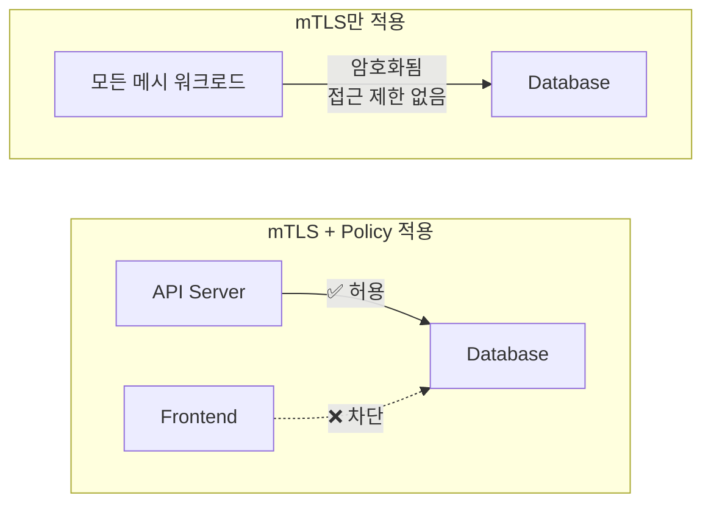
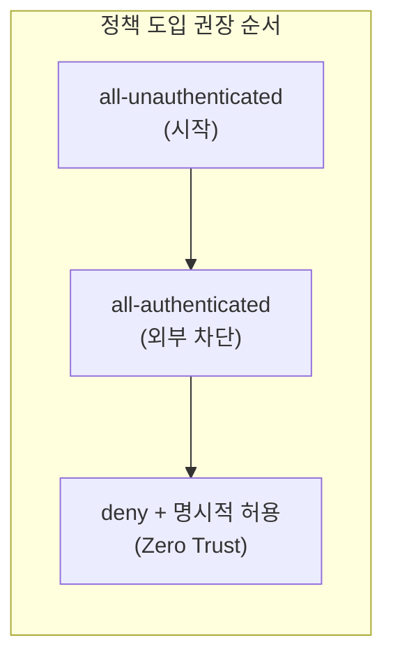
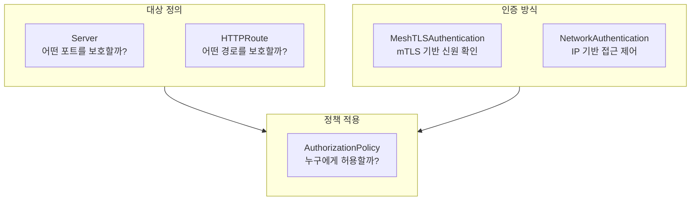
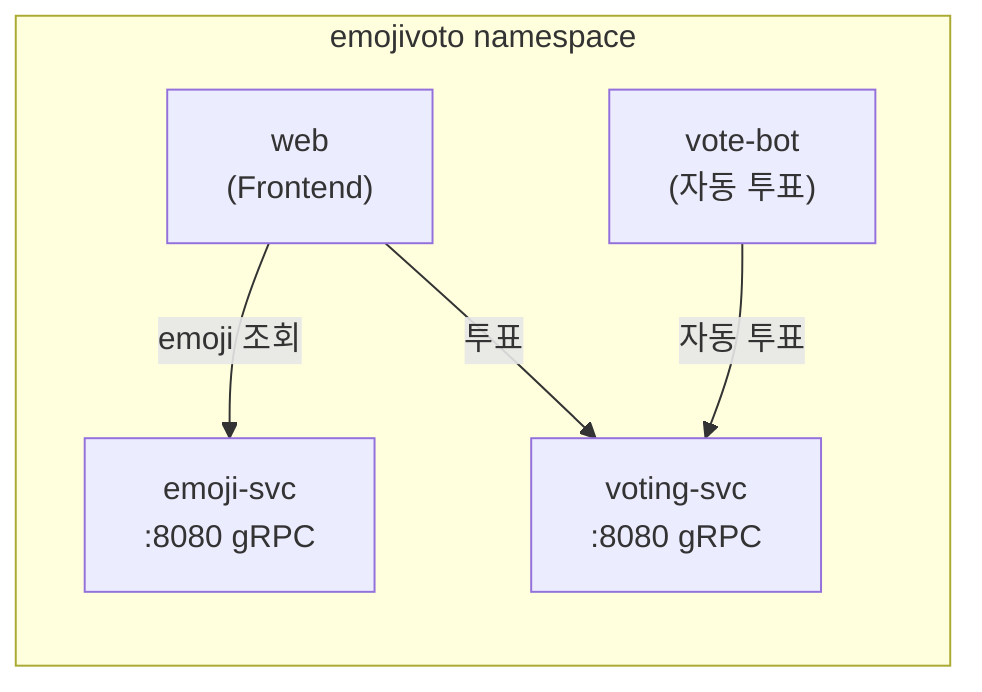
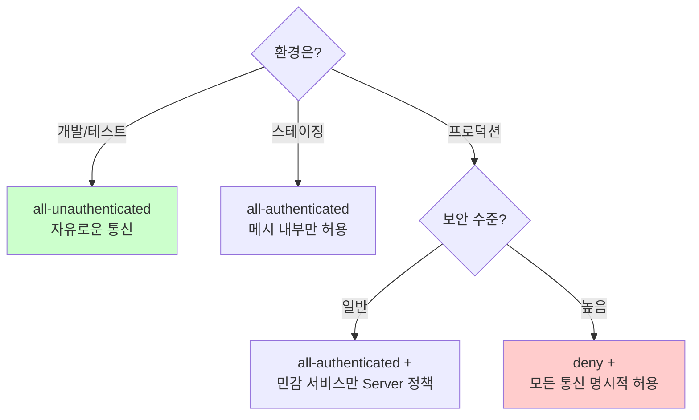

# Chapter 8. Linkerd Policy: Overview and Server-Based Policy

## 핵심 요약

> 이 장에서는 Linkerd의 정책(Policy) 시스템을 다룹니다.
> 핵심은 "정책은 어떤 워크로드가 어떤 워크로드와 통신할 수 있는지를 제어하며, 기본 정책(Default Policy)과 세분화된 Server-Based Policy로 구성된다"는 것입니다.

---

## 학습 목표

이 내용을 읽고 나면:
- [ ] Linkerd의 5가지 기본 정책을 이해하고 적절한 상황에 선택할 수 있다
- [ ] Server 리소스를 정의하여 특정 포트에 정책을 적용할 수 있다
- [ ] AuthorizationPolicy로 세분화된 접근 제어를 구성할 수 있다
- [ ] MeshTLSAuthentication과 NetworkAuthentication의 차이를 설명할 수 있다

---

## 본문 정리

### 1. Linkerd 정책이란?

Linkerd 정책은 **"누가 누구와 통신할 수 있는가?"**를 제어하는 메커니즘입니다.

왜 정책이 필요할까요? mTLS가 통신을 암호화하지만, 암호화만으로는 충분하지 않습니다. 예를 들어, 모든 워크로드가 데이터베이스에 직접 접근할 수 있다면 보안상 위험합니다. 정책을 통해 "프론트엔드는 API 서버만 호출할 수 있고, 데이터베이스는 API 서버만 접근 가능"과 같은 규칙을 설정할 수 있습니다.

> 💬 **비유**: 정책은 건물의 출입 통제 시스템과 같습니다.
>
> mTLS가 "신분증을 가진 사람만 건물에 들어올 수 있다"라면, 정책은 "신분증이 있어도 1층 직원은 3층 서버실에 출입할 수 없다"와 같은 세부 규칙입니다.



---

### 2. 기본 정책 (Default Policy)

Linkerd는 Control Plane 설치 시 기본 정책을 설정합니다. 이 정책은 명시적인 정책이 없는 모든 트래픽에 적용됩니다.

#### 5가지 기본 정책

| 정책 | 메시 내부 | 메시 외부 | 사용 시점 |
|------|----------|----------|----------|
| `all-unauthenticated` | ✅ 허용 | ✅ 허용 | 개발/테스트 환경, 정책 도입 전 |
| `all-authenticated` | ✅ 허용 | ❌ 차단 | 외부 차단이 필요한 환경 |
| `cluster-unauthenticated` | ✅ 허용 | ✅ 허용 | 같은 클러스터 내 통신 허용 |
| `cluster-authenticated` | ✅ 허용 | ❌ 차단 | 클러스터 내부만 mTLS 필수 |
| `deny` | ❌ 차단 | ❌ 차단 | Zero Trust, 명시적 허용 필수 |

왜 `all-unauthenticated`가 기본값일까요? Linkerd는 점진적 도입을 권장합니다. 처음부터 `deny`로 시작하면 기존 서비스가 모두 중단됩니다. `all-unauthenticated`로 시작해서 점차 정책을 강화하는 것이 안전합니다.



#### 정책 설정 방법

**설치 시 설정** (Helm):
```yaml
# values.yaml
proxy:
  defaultInboundPolicy: all-authenticated
```

**기존 클러스터 변경** (CLI):
```bash
linkerd upgrade --set proxy.defaultInboundPolicy=all-authenticated | kubectl apply -f -
```

**네임스페이스별 오버라이드** (어노테이션):
```yaml
apiVersion: v1
kind: Namespace
metadata:
  name: production
  annotations:
    config.linkerd.io/default-inbound-policy: deny
```

---

### 3. Policy 리소스 개요

Linkerd 정책은 여러 CRD(Custom Resource Definition)로 구성됩니다.



| 리소스 | 역할 | 예시 |
|--------|------|------|
| **Server** | 보호할 포트 정의 | "8080 포트를 정책으로 보호" |
| **HTTPRoute** | 보호할 HTTP 경로 정의 | "/admin 경로만 특별 보호" |
| **MeshTLSAuthentication** | mTLS 기반 인증 조건 | "특정 ServiceAccount만 허용" |
| **NetworkAuthentication** | 네트워크 기반 인증 조건 | "10.0.0.0/8 대역만 허용" |
| **AuthorizationPolicy** | 최종 허용 규칙 | Server + 인증 조건 결합 |

---

### 4. Server 리소스

Server는 **"어떤 Pod의 어떤 포트를 정책으로 보호할 것인가"**를 정의합니다.

```yaml
apiVersion: policy.linkerd.io/v1beta3
kind: Server
metadata:
  name: emoji-grpc
  namespace: emojivoto
spec:
  podSelector:
    matchLabels:
      app: emoji-svc
  port: grpc                    # 포트 이름 또는 번호
  proxyProtocol: gRPC           # HTTP/1.1, HTTP/2, gRPC, opaque
```

**podSelector**: 이 Server가 적용될 Pod를 선택합니다. Kubernetes의 label selector와 동일합니다.

**port**: 보호할 포트입니다. 포트 번호(8080) 또는 포트 이름(grpc)을 사용할 수 있습니다.

**proxyProtocol**: Linkerd가 해당 포트의 트래픽을 어떻게 처리할지 결정합니다.

| proxyProtocol | 용도 | HTTPRoute 지원 |
|---------------|------|----------------|
| `HTTP/1.1` | REST API | ✅ |
| `HTTP/2` | gRPC (h2c) | ✅ |
| `gRPC` | gRPC over HTTP/2 | ✅ |
| `opaque` | TCP, 비-HTTP | ❌ |

> ⚠️ **주의**: Server를 생성하면 해당 포트는 기본 정책을 **무시**합니다. 명시적인 AuthorizationPolicy가 없으면 모든 트래픽이 **차단**됩니다.

---

### 5. AuthorizationPolicy

AuthorizationPolicy는 **"누가 Server에 접근할 수 있는가"**를 정의합니다.

#### 기본 구조

```yaml
apiVersion: policy.linkerd.io/v1alpha1
kind: AuthorizationPolicy
metadata:
  name: allow-vote-bot
  namespace: emojivoto
spec:
  targetRef:
    group: policy.linkerd.io
    kind: Server
    name: emoji-grpc            # 어떤 Server에 적용?
  requiredAuthenticationRefs:
    - name: vote-bot-authn      # 어떤 인증 조건?
      kind: MeshTLSAuthentication
      group: policy.linkerd.io
```

#### MeshTLSAuthentication 예시

특정 ServiceAccount만 허용:
```yaml
apiVersion: policy.linkerd.io/v1alpha1
kind: MeshTLSAuthentication
metadata:
  name: vote-bot-authn
  namespace: emojivoto
spec:
  identities:
    - "vote-bot.emojivoto.serviceaccount.identity.linkerd.cluster.local"
```

#### NetworkAuthentication 예시

특정 IP 대역만 허용:
```yaml
apiVersion: policy.linkerd.io/v1alpha1
kind: NetworkAuthentication
metadata:
  name: internal-network
  namespace: emojivoto
spec:
  networks:
    - cidr: 10.0.0.0/8
    - cidr: 192.168.0.0/16
```

---

### 6. Server-Based Policy 실습: emojivoto

emojivoto 애플리케이션에 정책을 적용하는 예시입니다.



#### 목표
- emoji-svc: web만 접근 허용
- voting-svc: web과 vote-bot만 접근 허용

#### 1단계: Server 정의

```yaml
# emoji-server.yaml
apiVersion: policy.linkerd.io/v1beta3
kind: Server
metadata:
  name: emoji-grpc
  namespace: emojivoto
spec:
  podSelector:
    matchLabels:
      app: emoji-svc
  port: grpc
  proxyProtocol: gRPC
---
# voting-server.yaml
apiVersion: policy.linkerd.io/v1beta3
kind: Server
metadata:
  name: voting-grpc
  namespace: emojivoto
spec:
  podSelector:
    matchLabels:
      app: voting-svc
  port: grpc
  proxyProtocol: gRPC
```

> ⚠️ 이 시점에서 emoji-svc와 voting-svc로의 모든 트래픽이 차단됩니다!

#### 2단계: MeshTLSAuthentication 정의

```yaml
# web-authn.yaml
apiVersion: policy.linkerd.io/v1alpha1
kind: MeshTLSAuthentication
metadata:
  name: web-authn
  namespace: emojivoto
spec:
  identities:
    - "web.emojivoto.serviceaccount.identity.linkerd.cluster.local"
---
# vote-bot-authn.yaml
apiVersion: policy.linkerd.io/v1alpha1
kind: MeshTLSAuthentication
metadata:
  name: vote-bot-authn
  namespace: emojivoto
spec:
  identities:
    - "vote-bot.emojivoto.serviceaccount.identity.linkerd.cluster.local"
```

#### 3단계: AuthorizationPolicy 정의

```yaml
# allow-web-to-emoji.yaml
apiVersion: policy.linkerd.io/v1alpha1
kind: AuthorizationPolicy
metadata:
  name: allow-web-to-emoji
  namespace: emojivoto
spec:
  targetRef:
    group: policy.linkerd.io
    kind: Server
    name: emoji-grpc
  requiredAuthenticationRefs:
    - name: web-authn
      kind: MeshTLSAuthentication
      group: policy.linkerd.io
---
# allow-web-to-voting.yaml
apiVersion: policy.linkerd.io/v1alpha1
kind: AuthorizationPolicy
metadata:
  name: allow-web-to-voting
  namespace: emojivoto
spec:
  targetRef:
    group: policy.linkerd.io
    kind: Server
    name: voting-grpc
  requiredAuthenticationRefs:
    - name: web-authn
      kind: MeshTLSAuthentication
      group: policy.linkerd.io
---
# allow-votebot-to-voting.yaml
apiVersion: policy.linkerd.io/v1alpha1
kind: AuthorizationPolicy
metadata:
  name: allow-votebot-to-voting
  namespace: emojivoto
spec:
  targetRef:
    group: policy.linkerd.io
    kind: Server
    name: voting-grpc
  requiredAuthenticationRefs:
    - name: vote-bot-authn
      kind: MeshTLSAuthentication
      group: policy.linkerd.io
```

#### 결과 검증

```bash
# 정책 진단
linkerd diagnostics policy -n emojivoto svc/emoji-svc 8080

# 접근 테스트 (web Pod에서)
kubectl exec -n emojivoto deploy/web -- curl -s emoji-svc:8080/healthz
# 성공!

# 접근 테스트 (다른 Pod에서)
kubectl exec -n default deploy/test-pod -- curl -s emoji-svc.emojivoto:8080/healthz
# 실패! (권한 없음)
```

---

### 7. 네임스페이스 격리

특정 네임스페이스를 완전히 격리하려면 다음과 같이 설정합니다.

```yaml
apiVersion: v1
kind: Namespace
metadata:
  name: production
  annotations:
    config.linkerd.io/default-inbound-policy: deny
```

이 설정 후:
1. production 네임스페이스의 모든 Pod는 기본적으로 트래픽 수신 차단
2. 명시적인 Server + AuthorizationPolicy 없이는 통신 불가
3. 다른 네임스페이스의 정책에 영향 없음

```mermaid
flowchart TB
    subgraph cluster["Kubernetes Cluster"]
        subgraph prod["production namespace<br>(deny 정책)"]
            api["api-server"]
            db["database"]
        end

        subgraph dev["development namespace<br>(all-unauthenticated)"]
            devapp["dev-app"]
        end

        subgraph default["default namespace<br>(all-unauthenticated)"]
            test["test-pod"]
        end
    end

    devapp -.->|"❌ 차단"| api
    test -.->|"❌ 차단"| api
    api -->|"✅ 명시적 허용 필요"| db
```

---

## 실무 적용 포인트

### 상황별 정책 선택 가이드



### 정책 도입 순서

1. **현황 파악**: `linkerd viz stat` 로 현재 트래픽 흐름 파악
2. **기본 정책 설정**: `all-authenticated`로 외부 트래픽 차단
3. **민감 서비스 식별**: 데이터베이스, 인증 서비스 등
4. **Server 정의**: 민감 서비스의 포트에 Server 생성
5. **AuthorizationPolicy 정의**: 허용할 클라이언트 명시
6. **테스트**: `linkerd diagnostics policy`로 검증
7. **점진적 확대**: 다른 서비스에도 정책 적용

### 주의할 점

- ⚠️ Server 생성 = 즉시 차단! AuthorizationPolicy 없이 Server만 만들면 해당 포트로의 모든 트래픽이 차단됩니다.
- ⚠️ ServiceAccount 이름 정확성: identity 형식은 `{sa}.{namespace}.serviceaccount.identity.linkerd.cluster.local` 입니다. 오타 주의!
- ⚠️ 순서 의존성: Server → MeshTLSAuthentication → AuthorizationPolicy 순서로 적용해야 합니다.

---

## 면접 대비

### 한 줄 정의

"Linkerd 정책은 메시 내에서 워크로드 간 통신을 제어하는 규칙으로, Server 리소스로 보호 대상을 정의하고 AuthorizationPolicy로 접근 권한을 부여합니다."

### 핵심 포인트 3가지

1. **기본 정책 5가지**: `all-unauthenticated`(기본값), `all-authenticated`, `cluster-unauthenticated`, `cluster-authenticated`, `deny`. 점진적 도입을 위해 `all-unauthenticated`에서 시작하여 `deny`로 강화

2. **Server = 즉시 차단**: Server 리소스를 생성하면 해당 포트는 기본 정책을 무시하고 명시적 AuthorizationPolicy 없이는 모든 트래픽 차단

3. **인증 방식 2가지**: MeshTLSAuthentication(mTLS 기반, ServiceAccount identity), NetworkAuthentication(IP 기반, CIDR). 실무에서는 MeshTLSAuthentication 권장

### 자주 묻는 질문

**Q: 기본 정책을 deny로 설정하면 어떻게 되나요?**

A: 모든 인바운드 트래픽이 차단됩니다. 각 서비스에 Server와 AuthorizationPolicy를 명시적으로 정의해야만 통신이 가능합니다. Zero Trust 보안 모델을 구현할 때 사용하지만, 초기 설정 복잡도가 높아 점진적 도입을 권장합니다.

**Q: Server와 HTTPRoute의 차이는 무엇인가요?**

A: Server는 포트 레벨에서 정책을 적용합니다. 예를 들어 "8080 포트 전체를 보호"합니다. HTTPRoute는 경로 레벨에서 더 세밀한 제어가 가능합니다. 예를 들어 "/admin 경로만 특별 보호, /public은 허용"할 수 있습니다. HTTPRoute는 다음 장에서 자세히 다룹니다.

**Q: NetworkAuthentication은 언제 사용하나요?**

A: 메시에 포함되지 않은 워크로드(레거시 시스템, 외부 서비스)에서의 접근을 허용할 때 사용합니다. 하지만 IP 기반 인증은 mTLS보다 보안성이 낮으므로, 가능하면 MeshTLSAuthentication을 사용하고 NetworkAuthentication은 과도기에만 사용하는 것이 좋습니다.

---

## 핵심 개념 체크리스트

- [ ] 5가지 기본 정책의 차이를 설명할 수 있는가?
- [ ] Server 리소스 생성 시 트래픽이 차단되는 이유를 아는가?
- [ ] MeshTLSAuthentication의 identity 형식을 알고 있는가?
- [ ] AuthorizationPolicy가 Server와 인증 조건을 연결하는 방식을 이해하는가?
- [ ] 점진적 정책 도입 순서를 설명할 수 있는가?

---

## 참고 자료

- Linkerd Policy Reference: [linkerd.io/reference/authorization-policy](https://linkerd.io/reference/authorization-policy/)
- Server-Based Policy Guide: [linkerd.io/tasks/configuring-per-route-policy](https://linkerd.io/tasks/configuring-per-route-policy/)
- Zero Trust with Linkerd: [buoyant.io/blog/zero-trust-with-linkerd](https://buoyant.io/blog/zero-trust-with-linkerd)
