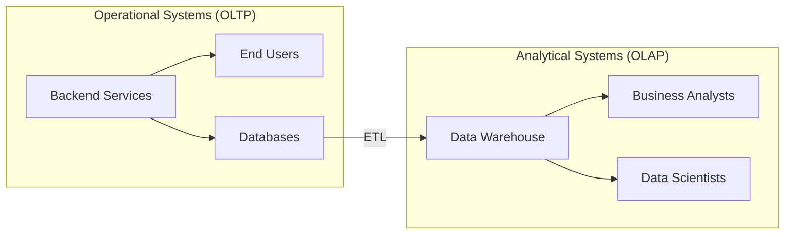
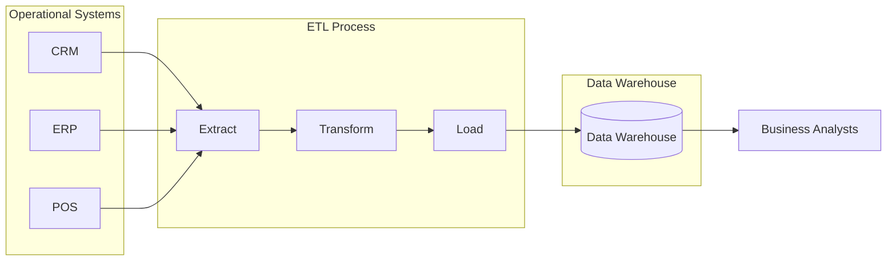
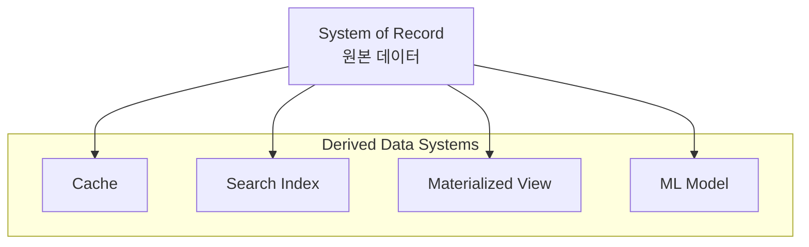
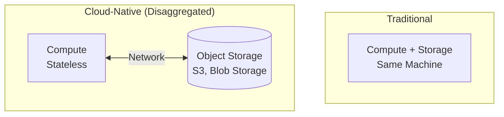
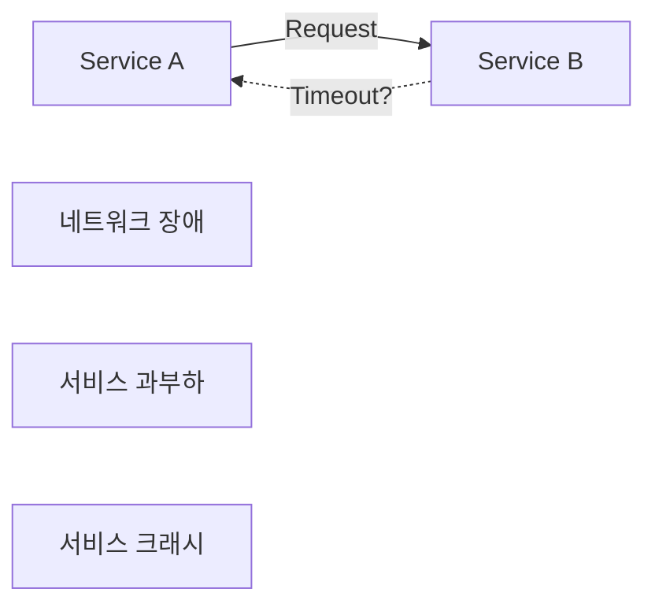

# Chapter 1: Trade-offs in Data Systems Architecture (데이터 시스템 아키텍처의 트레이드오프)

---

## 📌 핵심 요약
> 데이터 시스템 아키텍처에는 **정답이 없다**. 모든 선택에는 트레이드오프가 있다. 이 장에서는 **운영 시스템 vs 분석 시스템**, **클라우드 vs 셀프 호스팅**, **분산 시스템 vs 단일 노드**, **비즈니스 요구 vs 사용자 권리** 등 핵심 트레이드오프를 탐구하고, 올바른 질문을 던지는 방법을 학습한다.

---

## 🎯 학습 목표
이 내용을 읽고 나면:
- [ ] 운영 시스템(OLTP)과 분석 시스템(OLAP)의 차이를 설명할 수 있다
- [ ] 데이터 웨어하우스와 데이터 레이크의 목적과 차이를 이해할 수 있다
- [ ] 시스템 오브 레코드(System of Record)와 파생 데이터(Derived Data)를 구분할 수 있다
- [ ] 클라우드 서비스와 셀프 호스팅의 트레이드오프를 분석할 수 있다
- [ ] 분산 시스템이 필요한 상황과 단일 노드가 더 나은 상황을 판단할 수 있다
- [ ] GDPR 등 데이터 프라이버시 규제가 시스템 설계에 미치는 영향을 이해할 수 있다

---

## 📖 본문 정리

### 1. 데이터 집약적 애플리케이션이란?

데이터 관리가 개발의 주요 도전 과제인 애플리케이션을 **데이터 집약적(Data-Intensive)** 애플리케이션이라 한다.

| 유형 | 주요 도전 과제 |
|------|---------------|
| **Compute-Intensive** | 대규모 연산의 병렬화 |
| **Data-Intensive** | 대용량 데이터 저장/처리, 변경 관리, 일관성, 고가용성 |

**일반적인 데이터 시스템 구성 요소:**
- **Databases**: 데이터 저장 및 조회
- **Caches**: 비용이 큰 연산 결과 저장
- **Search Indexes**: 키워드 검색 및 필터링
- **Stream Processing**: 실시간 이벤트 처리
- **Batch Processing**: 대량 데이터 주기적 처리

> 💬 **비유**: 데이터 집약적 시스템은 도서관과 같다. 책(데이터)을 저장하고, 카탈로그(인덱스)로 검색하고, 인기 도서 코너(캐시)에 자주 찾는 책을 배치하며, 신간 알림(스트림 처리)과 연말 통계(배치 처리)를 제공한다.

---

### 2. 운영 시스템 vs 분석 시스템

#### 2.1 두 시스템의 특성 비교



| 속성 | 운영 시스템 (OLTP) | 분석 시스템 (OLAP) |
|------|-------------------|-------------------|
| **읽기 패턴** | Point Query (키로 개별 레코드 조회) | 대량 레코드 집계 |
| **쓰기 패턴** | 개별 레코드 CRUD | 벌크 임포트 (ETL/스트림) |
| **사용자** | 최종 사용자 (웹/모바일) | 내부 분석가 |
| **쿼리 유형** | 애플리케이션에 정의된 고정 쿼리 | 임의의 탐색적 쿼리 |
| **데이터 표현** | 현재 상태 (최신 시점) | 시간에 따른 이벤트 히스토리 |
| **데이터 크기** | GB ~ TB | TB ~ PB |

> 💬 **비유**: OLTP는 은행 창구(개별 고객의 입출금 처리), OLAP는 은행 본사 분석팀(전체 고객의 거래 패턴 분석)과 같다.

#### 2.2 OLTP에서 OLAP를 분리하는 이유

1. **데이터 사일로**: 관심 데이터가 여러 운영 시스템에 분산
2. **스키마 불일치**: OLTP에 좋은 스키마가 분석에는 부적합
3. **성능 영향**: 분석 쿼리가 운영 시스템 성능에 영향
4. **보안/컴플라이언스**: OLTP 시스템에 직접 접근 불가

---

### 3. 데이터 웨어하우스와 데이터 레이크

#### 3.1 데이터 웨어하우스



**ETL (Extract-Transform-Load)**:
- **Extract**: OLTP 시스템에서 데이터 추출
- **Transform**: 분석 친화적 스키마로 변환, 정제
- **Load**: 데이터 웨어하우스에 적재

> **Note**: 순서를 바꾼 **ELT**(Extract-Load-Transform)도 있음. 변환을 웨어하우스 로드 후 수행.

#### 3.2 데이터 레이크

데이터 과학자들은 SQL 기반 데이터 웨어하우스보다 더 유연한 환경이 필요:

| 데이터 웨어하우스 | 데이터 레이크 |
|------------------|--------------|
| 관계형 데이터 모델 | 파일 기반 (스키마 미강제) |
| SQL 쿼리 | Python, R, Spark 등 |
| 구조화된 데이터 | 텍스트, 이미지, 센서 데이터 등 비정형 포함 |
| 비용 높음 | 오브젝트 스토리지로 저렴 |

> 💬 **비유 (Sushi Principle)**: "Raw data is better" - 회(raw fish)가 요리된 생선보다 신선하듯, 원시 데이터를 저장하고 각 소비자가 필요에 맞게 가공하는 것이 더 유연하다.

#### 3.3 HTAP (Hybrid Transactional/Analytic Processing)

단일 시스템에서 OLTP와 OLAP를 모두 처리하려는 시도:
- 내부적으로는 여전히 OLTP + OLAP 분리 구조인 경우가 많음
- 데이터 웨어하우스를 대체하지 않음
- **사용 사례**: 사기 탐지 (대량 스캔 + 개별 레코드 업데이트 모두 필요)

---

### 4. 시스템 오브 레코드 vs 파생 데이터



| 구분 | System of Record | Derived Data |
|------|------------------|--------------|
| **역할** | 정보의 권위 있는 버전 | 기존 데이터의 변환/처리 결과 |
| **중복성** | 정규화 (중복 없음) | 성능을 위한 의도적 중복 |
| **복구** | 손실 시 복구 불가 | 원본에서 재생성 가능 |
| **예시** | Primary Database | 캐시, 인덱스, 뷰, 모델 |

> 💬 **비유**: 시스템 오브 레코드는 법원의 원본 판결문, 파생 데이터는 그 판결문의 요약본, 번역본, 검색 인덱스와 같다.

---

### 5. 클라우드 vs 셀프 호스팅

#### 5.1 소프트웨어 배포 스펙트럼

```
[In-House] ←――――――――――――――――――――――――――――→ [SaaS]
  ↑                                           ↑
자체 개발 + 자체 운영                  벤더 개발 + 벤더 운영
(통제력 ↑, 투자 ↑)                    (통제력 ↓, 투자 ↓)
```

| 유형 | 소프트웨어 | 운영 |
|------|-----------|------|
| Bespoke (자체 개발) | 직접 작성 | 직접 운영 |
| Off-the-shelf (셀프 호스팅) | 오픈소스/상용 | 직접 운영 |
| IaaS | 오픈소스/상용 | 클라우드 VM에서 운영 |
| SaaS | 벤더 제공 | 벤더 운영 |

#### 5.2 클라우드 서비스의 장단점

**장점:**
- 시스템 관리 경험 없어도 빠르게 시작
- 부하 변동이 클 때 탄력적 스케일링
- 운영 전문성의 규모의 경제

**단점:**
- ❌ 필요한 기능 부재 시 직접 추가 불가
- ❌ 서비스 장애 시 대기만 가능
- ❌ 성능 문제 디버깅 어려움 (내부 메트릭 접근 불가)
- ❌ **벤더 락인**: 서비스 종료/가격 인상 시 마이그레이션 강제
- ❌ 보안/규제 준수 복잡화

> 💬 **비유**: 클라우드는 렌터카, 셀프 호스팅은 자가용 구매와 같다. 렌터카는 유지보수 걱정 없지만 원하는 대로 개조할 수 없고, 렌터카 회사 정책에 종속된다.

---

### 6. 클라우드 네이티브 아키텍처

#### 6.1 클라우드 네이티브 vs 셀프 호스팅 시스템

| 카테고리 | 셀프 호스팅 | 클라우드 네이티브 |
|---------|-----------|------------------|
| **OLTP** | MySQL, PostgreSQL, MongoDB | AWS Aurora, Azure SQL DB, Google Spanner |
| **OLAP** | Teradata, ClickHouse, Spark | Snowflake, BigQuery, Azure Synapse |

#### 6.2 스토리지와 컴퓨트의 분리 (Disaggregation)



**전통적 아키텍처:**
- 같은 머신에서 CPU + 디스크 함께 사용
- RAID로 디스크 장애 대응

**클라우드 네이티브:**
- **로컬 디스크**: 임시 캐시로 취급 (ephemeral)
- **오브젝트 스토리지**: 장기 저장 (S3 등)
- **멀티테넌트**: 여러 고객의 데이터를 같은 하드웨어에서 처리

> 💬 **비유**: 전통적 아키텍처는 책상 서랍에 서류를 보관하는 것, 클라우드 네이티브는 중앙 문서 보관소에 저장하고 필요할 때 가져오는 것과 같다.

---

### 7. 분산 시스템 vs 단일 노드

#### 7.1 분산 시스템이 필요한 경우

| 이유 | 설명 |
|------|------|
| **본질적 분산** | 여러 사용자/디바이스 간 상호작용 |
| **클라우드 서비스 간 요청** | 데이터가 다른 서비스에 저장 |
| **장애 내성/고가용성** | 머신 장애 시에도 서비스 지속 |
| **확장성** | 단일 머신 용량 초과 |
| **지연 시간** | 전 세계 사용자에게 가까운 서버 제공 |
| **탄력성** | 부하에 따른 리소스 스케일 업/다운 |
| **전문 하드웨어** | GPU, RDMA 등 특수 목적 하드웨어 |
| **법적 규정** | 데이터 거주지(Data Residency) 요구사항 |

#### 7.2 분산 시스템의 문제점



- **네트워크 실패**: 모든 요청은 타임아웃 가능성 있음
- **지연 시간**: 네트워크 호출은 로컬 함수 호출보다 훨씬 느림
- **디버깅 어려움**: 문제 원인 파악 복잡 → Observability 도구 필요
- **일관성 유지**: 각 서비스가 별도 DB를 가질 때 데이터 일관성 보장 어려움

> ⚠️ **권장**: 단일 머신으로 가능하다면 분산 시스템을 피하라. CPU, 메모리, 디스크가 계속 성장하고 있으며, DuckDB, SQLite 같은 단일 노드 DB로 많은 워크로드 처리 가능.

> 💬 **비유**: 분산 시스템은 여러 도시에 분산된 팀으로 프로젝트를 진행하는 것. 화상 회의(네트워크)가 끊기거나, 시차로 소통이 지연되고, 누가 무슨 일을 했는지 파악하기 어렵다.

---

### 8. 마이크로서비스와 서버리스

#### 8.1 마이크로서비스 아키텍처

**장점:**
- 서비스별 독립적 업데이트
- 서비스별 맞춤 하드웨어 리소스 할당
- API 뒤에 구현 상세 숨김 → 변경 용이
- 서비스별 독립 DB → DB 구조 변경 용이

**단점:**
- 서비스마다 배포, 모니터링, 로깅 인프라 필요
- 개발 시 의존 서비스도 함께 실행해야 함
- API 진화 어려움 (클라이언트와의 호환성)

> **핵심**: 마이크로서비스는 기술적 문제가 아닌 **조직 문제**의 해결책. 대규모 조직에서 팀 간 독립성을 위해 유용. 소규모 회사에서는 불필요한 오버헤드.

#### 8.2 서버리스 (FaaS)

| 특성 | VM 기반 | 서버리스 |
|------|---------|---------|
| 인스턴스 관리 | 직접 시작/종료 | 자동 할당/해제 |
| 과금 | 인스턴스 시간 | 실행 시간 |
| 제약 | 없음 | 실행 시간 제한, 런타임 제한 |
| Cold Start | 없음 | 있을 수 있음 |

> 💬 **비유**: VM은 월세 아파트(사용 안 해도 월세 지불), 서버리스는 호텔(사용한 만큼만 지불, 대신 제약 있음).

---

### 9. 데이터 시스템, 법률, 그리고 사회

#### 9.1 개인정보 보호 규제

| 규제 | 지역 | 핵심 내용 |
|------|------|----------|
| **GDPR** | EU | 개인 데이터에 대한 권리, 삭제권(잊힐 권리) |
| **CCPA** | 캘리포니아 | 소비자 프라이버시 권리 |
| **EU AI Act** | EU | AI의 개인 데이터 사용 제한 |

#### 9.2 데이터 최소화 원칙 (Datensparsamkeit)

```
Big Data 철학: "미래에 유용할 수 있으니 모든 데이터를 저장하자"
     ↓ 충돌 ↓
GDPR 원칙: "명시된 목적으로만 수집, 필요 이상 보관 금지"
```

**데이터 저장의 실제 비용:**
- S3 요금만이 아님
- ⚠️ 데이터 유출 시 책임과 평판 손상
- ⚠️ 법적 비용과 벌금
- ⚠️ 정부/경찰의 데이터 제출 요청 가능성

> 💬 **비유**: 데이터는 자산이자 부채다. 많은 재고(데이터)는 판매 기회(분석)를 늘리지만, 창고 비용(저장)과 도난 위험(유출), 규제 위반 리스크도 함께 증가한다.

---

## 🔍 심화 학습

### OLTP vs OLAP 심화

| 용어 | 의미 |
|------|------|
| **OLTP** | Online Transaction Processing - 저지연 읽기/쓰기 |
| **OLAP** | Online Analytic Processing - 대량 레코드 집계 분석 |
| **Product Analytics** | 사용자 대면 제품에 내장된 분석 (Pinot, Druid, ClickHouse) |

### 클라우드 네이티브 심화

**오브젝트 스토리지 특성:**
- 수백 KB ~ 수 GB 크기 파일 저장에 최적화
- 파일시스템보다 제한된 API (기본적인 읽기/쓰기)
- 자동으로 여러 머신에 분산 → 용량/장애 걱정 불필요
- Snowflake, BigQuery 등이 S3를 기반으로 구축

### 출처
- [1] Kouzes et al. "The Changing Paradigm of Data-Intensive Computing" (2009)
- [5] Codd et al. "Providing OLAP to User-Analysts" (1993)
- [7] Chaudhuri & Dayal "An Overview of Data Warehousing and OLAP Technology" (1997)
- [26] Vuppalapati et al. "Building An Elastic Query Engine on Disaggregated Storage" (2020)
- [45] McSherry et al. "Scalability! But at What COST?" (2015)

---

## 💡 실무 적용 포인트

### 이런 상황에서 사용하세요

| 상황 | 권장 접근 |
|------|----------|
| **단일 머신으로 충분한 워크로드** | 분산 시스템 피하기 (DuckDB, SQLite) |
| **부하 변동이 큰 분석** | 클라우드 서비스 (탄력적 스케일링) |
| **예측 가능한 안정적 부하** | 셀프 호스팅 고려 (비용 절감) |
| **여러 OLTP에서 데이터 통합 분석** | 데이터 웨어하우스 구축 |
| **ML/AI 팀의 유연한 데이터 접근** | 데이터 레이크 구축 |

### 주의할 점 / 흔한 실수

- ⚠️ **과도한 분산**: 단일 노드로 충분한데 복잡한 분산 시스템 구축
- ⚠️ **벤더 락인 무시**: 클라우드 서비스 채택 시 마이그레이션 비용 미고려
- ⚠️ **OLTP에서 직접 분석**: 운영 시스템 성능 저하 유발
- ⚠️ **데이터 무분별 수집**: GDPR 등 규제 위반 리스크
- ⚠️ **소규모 팀에서 마이크로서비스**: 불필요한 복잡성 증가

### 면접에서 나올 수 있는 질문

- **Q**: OLTP와 OLAP의 차이점은 무엇인가요?
  - A: OLTP는 개별 레코드의 저지연 CRUD 처리(Point Query), OLAP는 대량 레코드의 집계 분석. OLTP는 현재 상태, OLAP는 히스토리 중심. 사용자도 다름 (최종 사용자 vs 분석가).

- **Q**: 데이터 웨어하우스와 데이터 레이크의 차이는?
  - A: 웨어하우스는 관계형 스키마를 강제하고 SQL로 쿼리, 레이크는 스키마 없이 파일 저장 (Parquet, JSON, 이미지 등). 레이크가 더 유연하고 저렴하지만, 웨어하우스가 BI 도구와 통합이 쉬움.

- **Q**: 언제 분산 시스템 대신 단일 노드를 선택해야 하나요?
  - A: 단일 머신의 CPU/메모리/디스크로 워크로드 처리 가능할 때. 분산 시스템은 네트워크 장애, 디버깅 복잡성, 일관성 문제를 수반. DuckDB, SQLite로 많은 워크로드 처리 가능.

- **Q**: 마이크로서비스는 언제 사용해야 하나요?
  - A: 대규모 조직에서 팀 간 독립적 개발/배포가 필요할 때. 소규모 팀에서는 오버헤드만 증가. 마이크로서비스는 기술 문제가 아닌 조직 문제의 해결책.

---

## ✅ 핵심 개념 체크리스트

- [ ] OLTP와 OLAP의 읽기/쓰기 패턴 차이를 설명할 수 있는가?
- [ ] ETL과 ELT의 차이를 아는가?
- [ ] 데이터 웨어하우스에서 OLTP를 분리하는 4가지 이유를 설명할 수 있는가?
- [ ] 데이터 레이크가 웨어하우스와 다른 점을 아는가?
- [ ] System of Record와 Derived Data의 차이를 이해하는가?
- [ ] 클라우드 서비스의 주요 단점 5가지를 설명할 수 있는가?
- [ ] 스토리지-컴퓨트 분리(Disaggregation)의 개념을 아는가?
- [ ] 분산 시스템이 필요한 8가지 상황을 알고 있는가?
- [ ] 분산 시스템의 주요 문제점을 설명할 수 있는가?
- [ ] GDPR의 데이터 최소화 원칙을 이해하는가?

---

## 🔗 참고 자료

- 📄 원서: Martin Kleppmann, "Designing Data-Intensive Applications, 2nd Edition"
- 📄 논문: [McSherry et al. "Scalability! But at What COST?" (2015)](https://www.usenix.org/conference/hotos15/workshop-program/presentation/mcsherry)
- 📄 블로그: [Jordan Tigani "Big Data is Dead" (2023)](https://motherduck.com/blog/big-data-is-dead/)
- 📄 블로그: [Nima Badizadegan "Use One Big Server" (2022)](https://specbranch.com/posts/one-big-server/)
- 📄 규제: [GDPR Official Text](https://eur-lex.europa.eu/eli/reg/2016/679/oj)
