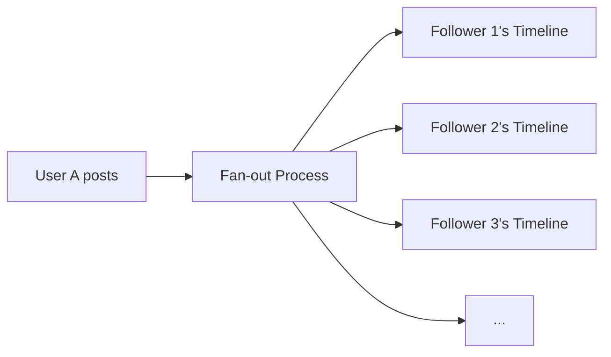
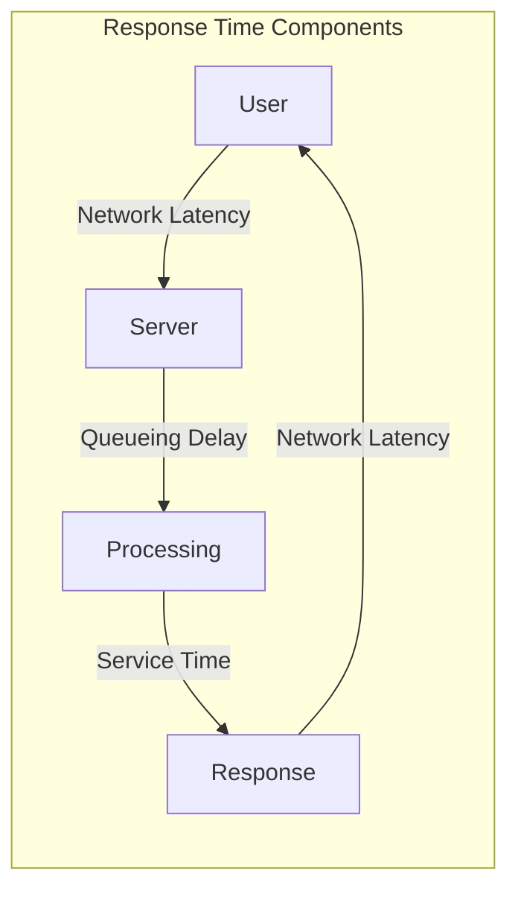
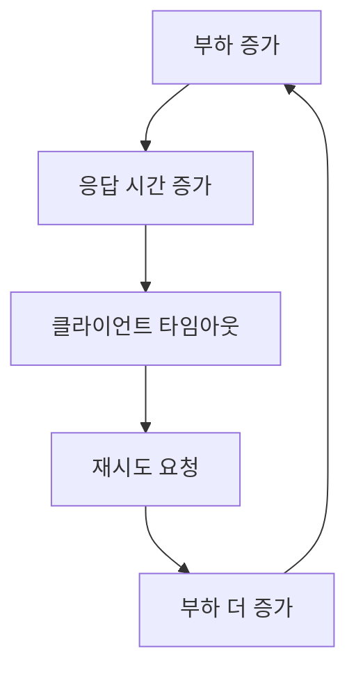
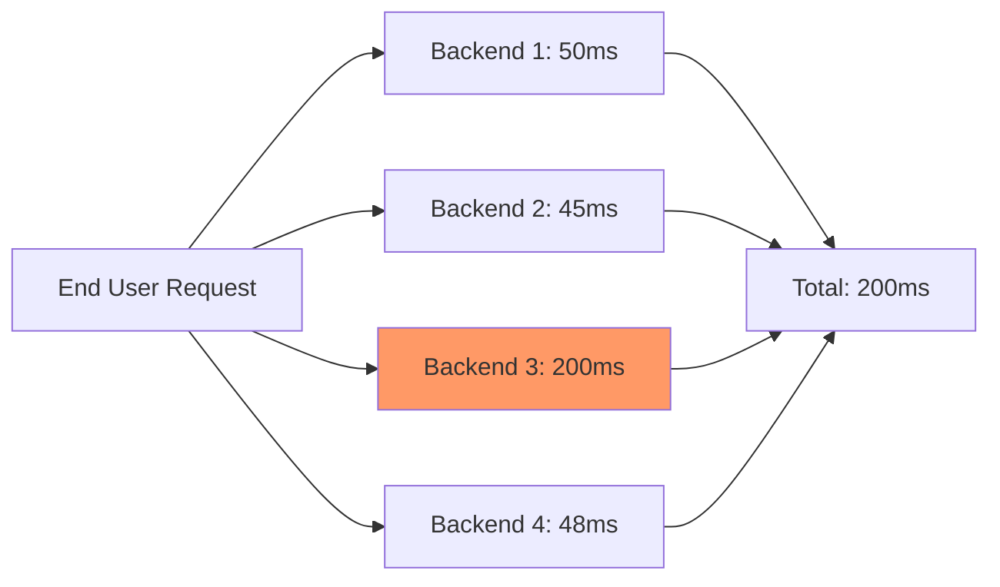
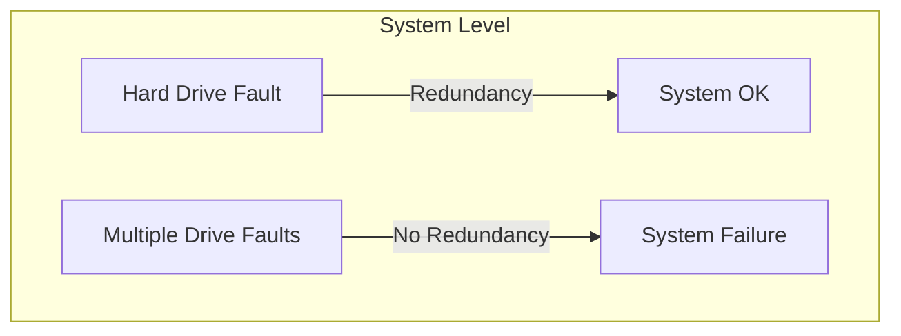
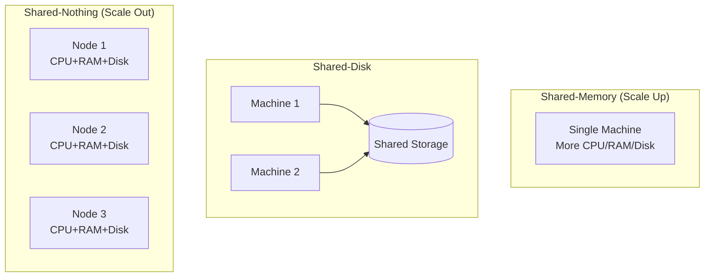
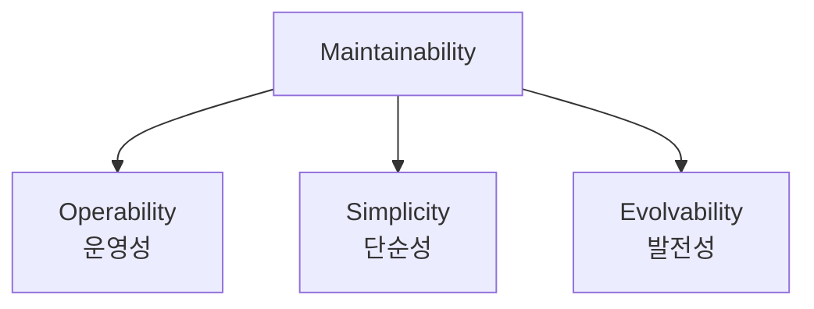

# Chapter 2: Defining Nonfunctional Requirements (비기능적 요구사항 정의)

---

## 📌 핵심 요약
> 비기능적 요구사항은 시스템이 **어떻게** 동작해야 하는지를 정의한다. 이 장에서는 **성능(Performance)**, **신뢰성(Reliability)**, **확장성(Scalability)**, **유지보수성(Maintainability)** 네 가지 핵심 요구사항을 다룬다. 응답 시간은 백분위수로 측정하고, 신뢰성은 장애 허용(Fault Tolerance)으로 달성하며, 확장성은 부하에 맞게 리소스를 조절하는 능력이다.

---

## 🎯 학습 목표
이 내용을 읽고 나면:
- [ ] 응답 시간(Response Time)과 처리량(Throughput)의 차이를 설명할 수 있다
- [ ] 백분위수(Percentile)를 사용한 성능 측정 방법을 이해할 수 있다
- [ ] 장애(Fault)와 실패(Failure)의 차이를 구분할 수 있다
- [ ] 하드웨어 장애와 소프트웨어 장애의 특성을 이해할 수 있다
- [ ] 수직 확장(Scale Up)과 수평 확장(Scale Out)의 트레이드오프를 분석할 수 있다
- [ ] 유지보수성의 세 가지 측면(운영성, 단순성, 발전성)을 설명할 수 있다

---

## 📖 본문 정리

### 1. 사례 연구: 소셜 네트워크 홈 타임라인

#### 1.1 문제 정의

**가정:**
- 하루 5억 개 포스트 (초당 5,800개, 피크 시 150,000개/초)
- 평균 사용자: 200명 팔로우, 200명 팔로워
- 동시 접속자: 1,000만 명

**단순한 접근 (Pull 방식):**
```sql
SELECT posts.*, users.* FROM posts
  JOIN follows ON posts.sender_id = follows.followee_id
  JOIN users   ON posts.sender_id = users.id
  WHERE follows.follower_id = current_user
  ORDER BY posts.timestamp DESC
  LIMIT 1000
```

**문제점:**
- 5초마다 폴링 시 → 초당 200만 쿼리
- 200명 팔로우 시 → 초당 4억 번의 포스트 조회

> 💬 **비유**: 매번 친구들의 집을 방문해서 새 소식이 있는지 확인하는 것과 같다. 친구가 200명이면 200개의 집을 매번 돌아다녀야 한다.

#### 1.2 해결책: 구체화(Materialization)와 Fan-out



**Push 방식:**
- 각 사용자의 홈 타임라인을 **미리 계산하여 캐시**
- 새 포스트 시 → 모든 팔로워의 타임라인에 삽입 (Fan-out)
- 읽기는 캐시에서 즉시 제공

**성능 비교:**
| 접근 방식 | 읽기 비용 | 쓰기 비용 |
|----------|----------|----------|
| Pull (Query) | 초당 4억 조회 | 낮음 |
| Push (Fan-out) | 캐시에서 즉시 | 초당 100만 쓰기 |

> 💬 **비유**: 우체부가 각 집의 우편함에 신문을 배달하는 것. 구독자가 직접 신문사에 가서 가져오는 것보다 훨씬 효율적이다.

#### 1.3 극단적 케이스 처리

**문제: 셀럽 계정 (팔로워 1억 명)**
- 한 번 포스트 시 1억 개의 타임라인 업데이트 필요

**해결책: 하이브리드 접근**
- 일반 사용자: Fan-out으로 미리 타임라인에 삽입
- 셀럽 계정: 별도 저장 후 읽기 시점에 병합

---

### 2. 성능 측정 (Describing Performance)

#### 2.1 두 가지 핵심 메트릭

| 메트릭 | 정의 | 단위 | 관심 대상 |
|--------|------|------|----------|
| **Response Time** | 요청~응답까지 경과 시간 | ms, s | 사용자 경험 |
| **Throughput** | 초당 처리량 | req/s, MB/s | 비용, 용량 계획 |



#### 2.2 처리량과 응답 시간의 관계

```
응답 시간
    ▲
    │         ╱
    │        ╱
    │       ╱
    │      ╱
    │     ╱
    │────────────────────▶ 처리량
              ↑
         용량 한계 접근 시
         급격히 증가
```

> 💬 **비유**: 고속도로와 같다. 차량이 적을 때는 빠르게 달릴 수 있지만, 정체가 시작되면 속도가 급격히 떨어진다.

#### 2.3 과부하 시스템의 악순환 (Metastable Failure)



**해결책:**
- **Exponential Backoff**: 재시도 간격을 점진적으로 증가
- **Circuit Breaker**: 오류 발생 서비스에 일시적으로 요청 중단
- **Load Shedding**: 과부하 시 서버가 선제적으로 요청 거부
- **Backpressure**: 클라이언트에게 속도 줄이라고 응답

---

### 3. 백분위수 (Percentiles)

#### 3.1 평균 vs 백분위수

```
응답 시간 분포:
    ▲ 요청 수
    │   ██
    │  ████
    │ ██████
    │████████
    │██████████  ▒▒  ◼  (꼬리)
    └───────────────────▶ 응답 시간
         ↑      ↑   ↑
        p50   p95  p99
```

| 메트릭 | 의미 | 용도 |
|--------|------|------|
| **Mean (평균)** | 모든 값의 산술 평균 | 처리량 한계 추정 |
| **Median (p50)** | 절반이 이보다 빠름 | "일반적인" 응답 시간 |
| **p95** | 95%가 이보다 빠름 | 대부분의 사용자 경험 |
| **p99** | 99%가 이보다 빠름 | 중요 고객 경험 |
| **p999** | 99.9%가 이보다 빠름 | 최악의 경우 |

> 💬 **비유**: 학교 시험 점수. 평균 70점이어도 당신이 30점을 받았다면 "평균적인 학생 경험"과는 거리가 멀다. 백분위수는 "상위 몇 %에 해당하는가"를 알려준다.

#### 3.2 꼬리 지연 시간 (Tail Latency)의 중요성

**Amazon의 사례:**
- p999 (99.9백분위)까지 관리
- 가장 느린 요청 = 가장 많은 데이터를 가진 고객 = 가장 가치 있는 고객

**Tail Latency Amplification:**


하나의 느린 백엔드 호출이 전체 요청을 느리게 만듦.

#### 3.3 SLO와 SLA

| 용어 | 정의 | 예시 |
|------|------|------|
| **SLO** (Service Level Objective) | 서비스 성능 목표 | p99 < 1s, 가용성 99.9% |
| **SLA** (Service Level Agreement) | SLO 미달 시 계약 | SLO 미달 시 요금 환불 |

---

### 4. 신뢰성과 장애 허용 (Reliability and Fault Tolerance)

#### 4.1 Fault vs Failure



| 용어 | 정의 | 예시 |
|------|------|------|
| **Fault** | 시스템의 일부가 오작동 | 디스크 1개 고장 |
| **Failure** | 시스템 전체가 서비스 제공 불가 | 서비스 다운 |
| **SPOF** | Single Point of Failure | 장애 시 전체 실패 유발 부품 |

> 💬 **비유**: Fault는 자동차 타이어 펑크, Failure는 자동차가 멈추는 것. 스페어 타이어(중복성)가 있으면 Fault가 Failure로 이어지지 않는다.

#### 4.2 장애 허용 (Fault Tolerance)

**원칙:**
- 특정 유형의 특정 수의 장애를 허용하도록 설계
- 모든 장애를 허용하는 것은 불가능 (지구가 블랙홀에 빨려들어가면?)

**Chaos Engineering:**
- 의도적으로 장애를 주입하여 시스템 테스트
- 장애 처리 메커니즘이 실제로 작동하는지 확인

---

### 5. 하드웨어와 소프트웨어 장애

#### 5.1 하드웨어 장애 통계

| 구성 요소 | 연간 장애율 | 비고 |
|----------|-----------|------|
| HDD | 2-5% | 10,000대 클러스터 → 매일 1대 장애 |
| SSD | 0.5-1% | 수정 불가 오류 연 1회/드라이브 |
| CPU | 0.1% | 잘못된 계산 결과 반환 가능 |
| RAM | 1%+ (수정불가 오류) | ECC 메모리도 완벽하지 않음 |
| 데이터센터 | 드물지만 치명적 | 화재, 홍수, 지진, 태양 폭풍 |

**해결책: 중복성 (Redundancy)**
- RAID: 디스크 중복
- 이중 전원 공급
- 다중 데이터센터 (Availability Zones)
- Rolling Upgrade: 노드 하나씩 재시작

#### 5.2 소프트웨어 장애의 특성

**하드웨어 vs 소프트웨어 장애:**
| 특성 | 하드웨어 | 소프트웨어 |
|------|---------|-----------|
| 상관관계 | 약함 (독립적) | 강함 (같은 버그 공유) |
| 예측 가능성 | 통계적으로 예측 가능 | 예측 어려움 |
| 영향 범위 | 단일 컴포넌트 | 전체 시스템 동시 영향 |

**소프트웨어 장애 예시:**
- 2012년 윤초 버그: Linux 커널 버그로 Java 앱 동시 중단
- SSD 펌웨어 버그: 정확히 32,768시간(약 3.7년) 후 모든 SSD 동시 고장
- Cascading Failure: 한 컴포넌트 문제가 연쇄적으로 전파

> 💬 **비유**: 하드웨어 장애는 개별 병사가 쓰러지는 것, 소프트웨어 장애는 전체 부대에 퍼지는 전염병과 같다.

#### 5.3 인간과 신뢰성

**사실:**
- 운영자의 설정 변경이 장애의 주요 원인 (70-90%)
- 하드웨어 장애는 10-25%에 불과

**해결책:**
- **Blameless Postmortem**: 비난 없는 사후 분석
- 롤백 메커니즘
- 점진적 롤아웃 (Gradual Roll-out)
- 명확한 모니터링과 관측성 도구

> ⚠️ **핵심**: "인간 오류"는 원인이 아니라 증상. 진짜 원인은 시스템 설계와 조직 우선순위에 있다.

---

### 6. 확장성 (Scalability)

#### 6.1 확장성이란?

확장성은 **일차원적 레이블이 아니다**. "X는 확장 가능하다"는 무의미.

**올바른 질문:**
- "특정 방식으로 부하가 증가하면, 어떤 선택지가 있는가?"
- "추가 부하를 처리하기 위해 리소스를 어떻게 추가할 수 있는가?"
- "현재 성장률로 현 아키텍처의 한계에 언제 도달하는가?"

#### 6.2 부하 기술 (Describing Load)

부하를 기술하는 방법:
- 초당 요청 수
- 일일 데이터 유입량
- 읽기/쓰기 비율
- 캐시 적중률
- 동시 접속 사용자 수

#### 6.3 확장 아키텍처



| 아키텍처 | 장점 | 단점 |
|----------|------|------|
| **Shared-Memory** (Scale Up) | 단순함 | 비용 비선형 증가, 한계 있음 |
| **Shared-Disk** | 전통적 DW에 적합 | 잠금 경합, 확장성 제한 |
| **Shared-Nothing** (Scale Out) | 선형 확장 가능, 유연 | 복잡성, 샤딩 필요 |

> 💬 **비유**: Scale Up은 더 큰 트럭을 사는 것, Scale Out은 트럭 여러 대를 운영하는 것. 트럭 한 대로 운반할 수 있는 양에는 한계가 있지만, 트럭 대수는 무한히 늘릴 수 있다.

#### 6.4 확장성 원칙

1. **독립적으로 동작하는 작은 컴포넌트로 분해**
   - 마이크로서비스
   - 샤딩
   - 스트림 처리

2. **필요 이상으로 복잡하게 만들지 않기**
   - 단일 머신 DB로 충분하면 분산 시스템 피하기
   - 예측 가능한 부하면 수동 확장도 괜찮음
   - 서비스 5개가 50개보다 단순

3. **부하 증가 10배마다 아키텍처 재검토**

---

### 7. 유지보수성 (Maintainability)

#### 7.1 소프트웨어 비용의 대부분은 유지보수

**유지보수 작업:**
- 버그 수정
- 시스템 운영 유지
- 장애 조사
- 새 플랫폼 적응
- 새 기능 추가
- 기술 부채 상환

#### 7.2 세 가지 설계 원칙



| 원칙 | 목표 | 수단 |
|------|------|------|
| **Operability** | 운영 팀의 작업을 쉽게 | 모니터링, 자동화, 문서화 |
| **Simplicity** | 새 엔지니어가 이해하기 쉽게 | 추상화, 일관된 패턴 |
| **Evolvability** | 요구사항 변경에 쉽게 적응 | 느슨한 결합, 가역성 |

#### 7.3 운영성 (Operability)

**좋은 운영성을 위한 시스템 특성:**
- 주요 메트릭 모니터링 지원
- 개별 머신 의존성 제거 (유지보수 중에도 서비스 지속)
- 명확한 운영 모델 문서화
- 합리적인 기본값 + 관리자 오버라이드 가능
- 예측 가능한 동작, 최소한의 놀라움

#### 7.4 단순성 (Simplicity)

> "복잡성 속에서는 숨겨진 가정, 의도치 않은 결과, 예상치 못한 상호작용을 쉽게 간과한다."

**복잡성 관리 도구: 추상화**
- 고급 프로그래밍 언어: 머신 코드 숨김
- SQL: 디스크/메모리 구조 숨김
- 트랜잭션: 동시성과 장애 복구 숨김

#### 7.5 발전성 (Evolvability)

**변경을 어렵게 만드는 것: 비가역성**

| 변경 유형 | 가역성 | 위험도 |
|----------|--------|--------|
| 설정 변경 | 높음 | 낮음 |
| 코드 롤백 | 중간 | 중간 |
| DB 스키마 변경 | 낮음 | 높음 |
| 마이그레이션 (롤백 불가) | 없음 | 매우 높음 |

> 💬 **비유**: 연필로 쓰면 지울 수 있지만, 잉크로 쓰면 지울 수 없다. 시스템 설계도 마찬가지로 "지울 수 있는" 결정을 선호해야 한다.

---

## 🔍 심화 학습

### Response Time vs Latency

| 용어 | 정의 |
|------|------|
| **Response Time** | 클라이언트가 보는 전체 시간 |
| **Service Time** | 서버가 실제로 요청을 처리하는 시간 |
| **Latency** | 요청이 대기하는 시간 (처리되지 않는 시간) |
| **Network Latency** | 네트워크를 통해 이동하는 시간 |
| **Queueing Delay** | 처리 대기열에서 기다리는 시간 |

### 백분위수 계산 라이브러리

- **HdrHistogram**: 고정밀 히스토그램
- **t-digest**: 메모리 효율적 근사
- **DDSketch**: 상대 오차 보장

> ⚠️ **주의**: 백분위수를 평균내면 안 됨. 히스토그램을 합산해야 함.

### 출처
- [7] Bronson et al. "Metastable Failures in Distributed Systems" (2021)
- [20] DeCandia et al. "Dynamo: Amazon's Highly Available Key-Value Store" (2007)
- [27] Dean & Barroso "The Tail at Scale" (2013)
- [40] Rosenthal & Jones "Chaos Engineering" (2020)
- [74] Allspaw "Blameless PostMortems and a Just Culture" (2012)

---

## 💡 실무 적용 포인트

### 이런 상황에서 사용하세요

| 상황 | 권장 접근 |
|------|----------|
| **성능 모니터링** | 평균 대신 p50, p95, p99 사용 |
| **SLA 정의** | p99 < 1s 같은 백분위수 기반 목표 |
| **장애 대비** | 단일 장애점(SPOF) 제거, 중복성 확보 |
| **확장 계획** | 부하 10배 증가 시나리오 검토 |
| **신규 기능** | 롤백 가능한 방식으로 배포 |

### 주의할 점 / 흔한 실수

- ⚠️ **평균만 보기**: p99가 10초여도 평균은 100ms일 수 있음
- ⚠️ **모든 장애 허용 시도**: 불가능하고 비용만 증가
- ⚠️ **과도한 확장성 투자**: 스타트업에서 Google 규모 설계
- ⚠️ **인간 오류 비난**: 진짜 원인은 시스템 설계
- ⚠️ **비가역적 결정 경시**: 롤백 불가능한 변경은 신중하게

### 면접에서 나올 수 있는 질문

- **Q**: 왜 평균 대신 백분위수를 사용해야 하나요?
  - A: 평균은 분포를 숨긴다. p99가 10초여도 평균은 100ms일 수 있음. 꼬리 지연 시간(tail latency)이 사용자 경험에 큰 영향. Amazon은 p999까지 관리.

- **Q**: Fault와 Failure의 차이는?
  - A: Fault는 컴포넌트 수준의 오작동, Failure는 시스템 전체의 서비스 불가. 중복성으로 Fault가 Failure로 이어지지 않게 설계.

- **Q**: 수직 확장(Scale Up)과 수평 확장(Scale Out)의 트레이드오프는?
  - A: Scale Up은 단순하지만 비용이 비선형 증가하고 한계 있음. Scale Out은 선형 확장 가능하지만 분산 시스템의 복잡성(샤딩, 일관성 등) 수반.

- **Q**: Blameless Postmortem이란?
  - A: 장애 후 개인을 비난하지 않고 시스템적 원인을 찾는 문화. "Bob이 조심했어야 했다"가 아니라 "왜 그런 실수가 가능했는가" 분석. 이를 통해 조직이 학습.

---

## ✅ 핵심 개념 체크리스트

- [ ] Response Time, Throughput, Latency의 차이를 설명할 수 있는가?
- [ ] 백분위수(p50, p95, p99, p999)의 의미와 용도를 아는가?
- [ ] Tail Latency Amplification 현상을 이해하는가?
- [ ] Metastable Failure와 그 해결책(Backoff, Circuit Breaker)을 아는가?
- [ ] Fault와 Failure의 차이를 구분할 수 있는가?
- [ ] 하드웨어 장애와 소프트웨어 장애의 특성 차이를 아는가?
- [ ] Chaos Engineering의 목적을 설명할 수 있는가?
- [ ] Shared-Nothing 아키텍처의 장단점을 아는가?
- [ ] 유지보수성의 세 가지 측면(Operability, Simplicity, Evolvability)을 설명할 수 있는가?
- [ ] 비가역성이 시스템 변경에 미치는 영향을 이해하는가?

---

## 🔗 참고 자료

- 📄 원서: Martin Kleppmann, "Designing Data-Intensive Applications, 2nd Edition"
- 📄 논문: [Dean & Barroso "The Tail at Scale" (2013)](https://doi.org/10.1145/2408776.2408794)
- 📄 논문: [Bronson et al. "Metastable Failures in Distributed Systems" (2021)](https://doi.org/10.1145/3458336.3465286)
- 📄 블로그: [Marc Brooker "Exponential Backoff And Jitter"](https://aws.amazon.com/blogs/architecture/exponential-backoff-and-jitter/)
- 📄 도서: [Casey Rosenthal "Chaos Engineering" (2020)](https://www.oreilly.com/library/view/chaos-engineering/9781492043850/)
- 📄 블로그: [John Allspaw "Blameless PostMortems and a Just Culture"](https://www.etsy.com/codeascraft/blameless-postmortems)
