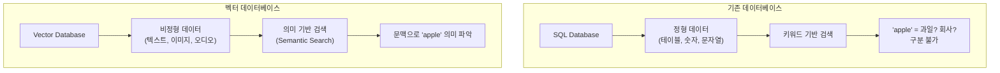
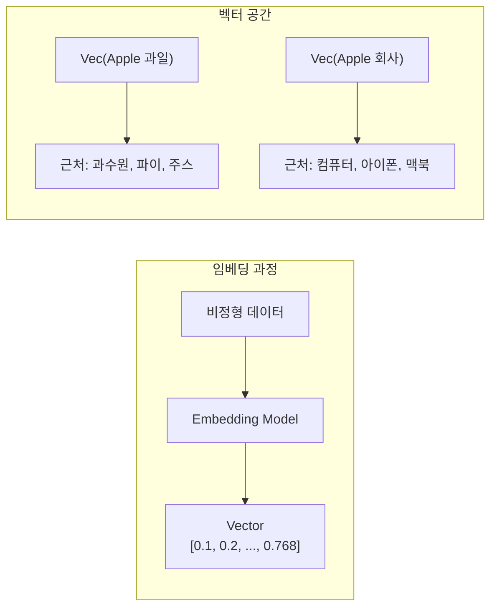
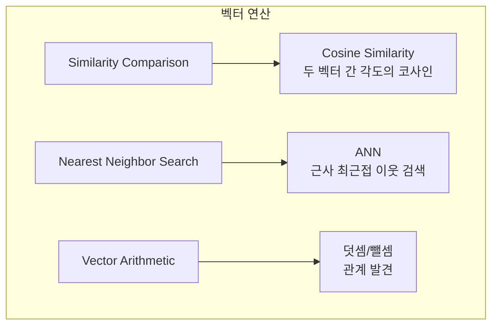
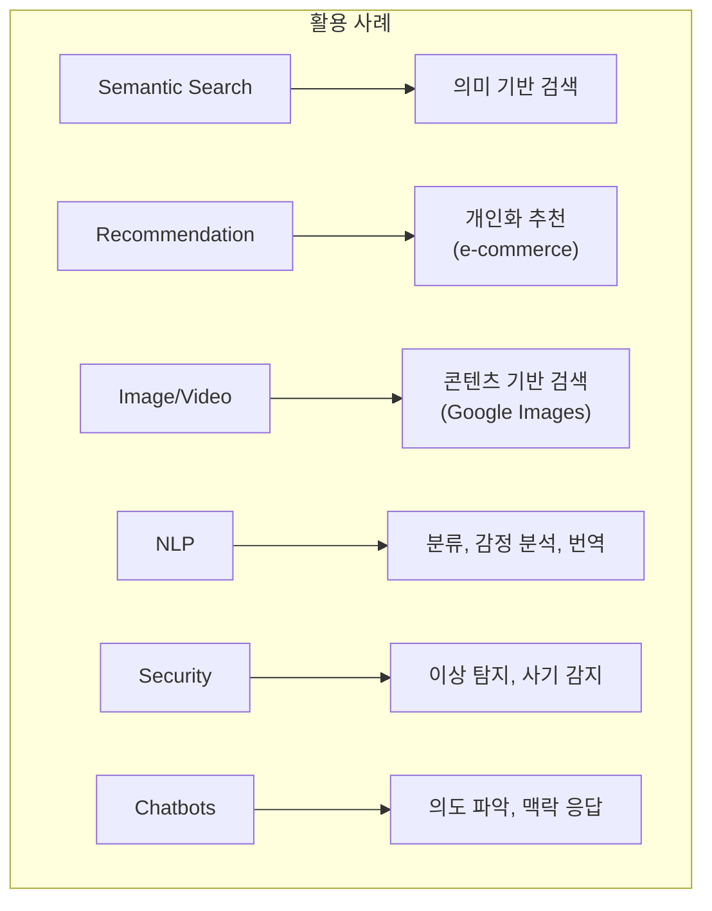
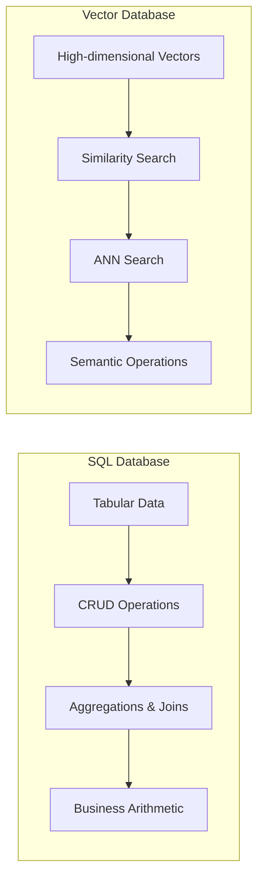
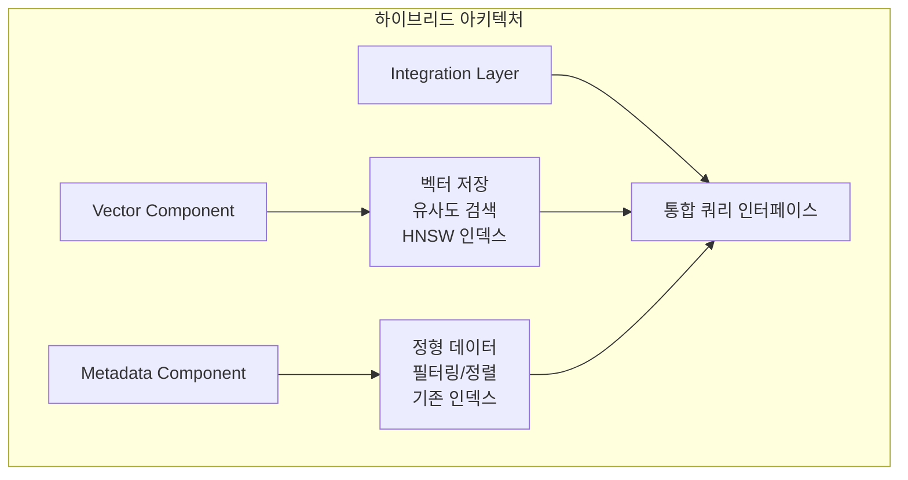
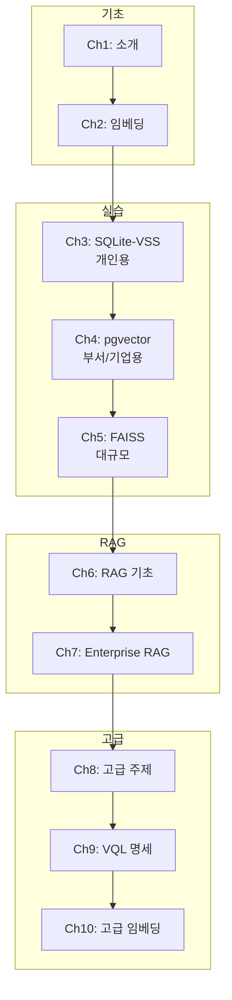

# Chapter 1: Introduction to Vector Databases (벡터 데이터베이스 소개)

## 📌 핵심 요약

> **"벡터 데이터베이스는 텍스트, 이미지, 오디오, 비디오 등 비정형 데이터를 벡터(float 배열)로 변환하여 의미 기반 유사도 검색(Semantic Search)을 가능하게 한다. VECTOR 타입은 Cosine Similarity, ANN(Approximate Nearest Neighbors) 등 벡터 전용 연산을 제공하며, PostgreSQL + pgvector 같은 하이브리드 아키텍처가 기업 환경에서 정형 데이터와 벡터 데이터를 함께 관리하는 최적의 방안이다."**

이 챕터에서는 벡터 데이터베이스의 기본 개념, 필요성, 그리고 기존 SQL/NoSQL 데이터베이스와의 차이점을 학습한다.

---

## 🎯 학습 목표

이 챕터를 완료하면 다음을 할 수 있다:

- [ ] 벡터 데이터베이스가 필요한 이유 설명
- [ ] VECTOR 데이터 타입과 임베딩 개념 이해
- [ ] Cosine Similarity, ANN 등 벡터 연산 이해
- [ ] SQL, NoSQL, 벡터 데이터베이스 비교
- [ ] 하이브리드 아키텍처의 장점 설명
- [ ] 벡터 데이터베이스 활용 사례 파악

---

## 📖 본문 정리

### 1.1 벡터 데이터베이스가 필요한 이유



#### 기존 데이터베이스의 한계

| 항목 | 기존 DB | 벡터 DB |
|------|---------|---------|
| **데이터 유형** | 정형 데이터 (테이블) | 비정형 데이터 (텍스트, 이미지 등) |
| **검색 방식** | 키워드 매칭 | 의미 기반 유사도 검색 |
| **비정형 저장** | BLOB (불투명 바이너리) | 벡터 (의미 보존) |
| **AI 연동** | 제한적 | LLM과 네이티브 통합 |

#### genAI 시대의 벡터 데이터베이스

```
관계형 DB ─────── 비즈니스 데이터의 기반 기술
벡터 DB ───────── AI/genAI의 기반 기술
```

> **핵심**: 미래의 애플리케이션은 비즈니스 데이터와 텍스트/이미지/오디오/비디오의 의미를 결합하여 풍부하고 지능적인 인터랙티브 애플리케이션을 만들 것이다.

---

### 1.2 VECTOR: 새로운 데이터 타입



#### 임베딩(Embedding)이란?

| 용어 | 설명 |
|------|------|
| **Embedding (동사)** | 데이터를 벡터로 변환하는 과정 |
| **Embedding (명사)** | 변환 결과인 벡터 또는 벡터 집합 |
| **Corpus** | 변환할 텍스트 데이터의 집합 (예: 여러 문서) |

```
비유: 화가(painter)가 그림(painting)을 그린다
     → 임베딩(embedding) 과정이 임베딩(embedding)을 생성한다
```

#### VECTOR 타입의 특징

```sql
-- PostgreSQL + pgvector 예시
CREATE EXTENSION IF NOT EXISTS vector;

CREATE TABLE documents (
    id SERIAL PRIMARY KEY,
    content TEXT,
    embedding VECTOR(768)  -- 768차원 벡터
);

-- 유사도 검색 (Cosine Distance)
SELECT * FROM documents
ORDER BY embedding <=> '[0.1, 0.2, ..., 0.768]'
LIMIT 10;
```

---

### 1.3 VECTOR 타입의 연산



#### 1. 유사도 비교 (Similarity Comparison)

**Cosine Similarity**:
- 두 벡터 간 각도의 코사인 값 측정
- 동일 벡터: 1 (최대)
- 유사한 의미: 1에 가까움
- 다른 의미: 0에 가까움

```
Vec("king") ←→ Vec("queen"): 높은 유사도
Vec("king") ←→ Vec("banana"): 낮은 유사도
```

#### 2. 최근접 이웃 검색 (Nearest Neighbor Search)

**ANN (Approximate Nearest Neighbors)**:
- 정확한 검색보다 빠른 근사 검색
- genAI 애플리케이션에서는 근사 결과로 충분
- 인덱스: LSH, HNSW 등 사용

#### 3. 벡터 연산 (Vector Arithmetic)

Word2Vec 논문의 유명한 예시:

```
Vec("Queen") ≈ Vec("King") - Vec("Man") + Vec("Woman")
```

---

### 1.4 벡터 데이터베이스 활용 사례



| 분야 | 활용 예시 |
|------|-----------|
| **시맨틱 검색** | 키워드가 아닌 의미로 검색 |
| **추천 시스템** | 사용자 선호도 기반 개인화 추천 |
| **이미지/비디오 검색** | 콘텐츠 기반 시각 데이터 검색 |
| **NLP** | 텍스트 분류, 감정 분석, 번역 |
| **보안** | 사이버 보안, 사기 탐지, 이상 탐지 |
| **생명정보학** | 유전자 서열, 단백질 구조 분석 |
| **금융** | 시장 트렌드, 리스크 평가, 알고리즘 트레이딩 |
| **챗봇** | 사용자 의도 파악, 맥락적 응답 |
| **신약 개발** | 약물 후보 물질 식별 |

---

### 1.5 SQL vs Vector 데이터베이스



#### SQL 데이터베이스의 기반: 회계 수학

| SQL 특징 | 설명 |
|----------|------|
| **테이블 구조** | 스프레드시트, 장부와 유사 |
| **데이터 타입** | 정수, 실수, 문자열, BCD (통화) |
| **CRUD** | Create, Read, Update, Delete |
| **집계/조인** | SUM, JOIN - 재무 보고에 필수 |

#### SQL에서 벡터 저장의 한계

```sql
-- 기술적으로 가능하지만 비효율적
CREATE TABLE vector_data (
    id INT PRIMARY KEY,
    vector FLOAT[]  -- 단순 float 배열
);

INSERT INTO vector_data (id, vector)
VALUES (1, ARRAY[0.1, 0.2, ..., 0.768]);
```

**한계점**:
- ❌ 성능: 고차원 데이터에 비효율적인 인덱스
- ❌ 연산 부재: 유사도 검색, ANN 미지원
- ❌ 확장성: 벡터 수와 차원이 증가하면 성능 급격히 저하

#### 벡터 전용 기능의 필요성

| 필요 기능 | 설명 |
|-----------|------|
| **고차원 인덱싱** | LSH, HNSW 등 특수 인덱스 |
| **네이티브 연산** | Cosine Similarity, Euclidean Distance, k-NN |
| **ANN 최적화** | 근사 검색으로 속도 향상 |
| **Sparse Vector** | 희소 벡터 효율적 저장 |

---

### 1.6 NoSQL vs Vector 데이터베이스

#### NoSQL + Vector 확장 지원 현황

| NoSQL DB | 벡터 기능 |
|----------|-----------|
| **Redis** | RediSearch 벡터 유사도 검색 |
| **MongoDB** | Atlas 벡터 검색 |
| **Elasticsearch** | Dense Vector 필드, 벡터 함수 |
| **Cassandra** | 플러그인으로 벡터 검색 확장 |

#### NoSQL 벡터 확장의 한계

| 한계 | 설명 |
|------|------|
| **성능** | 전용 벡터 DB 대비 최적화 부족 |
| **기능성** | 벡터 연산, 인덱싱 방법 제한적 |
| **확장성** | 수십억 벡터 규모에서 성능 저하 |
| **통합성** | 벡터-비벡터 결합 쿼리 복잡 |

#### NoSQL + Vector가 적합한 경우

```
✅ 혼합 데이터: 정형 + 반정형 + 벡터 (벡터가 주가 아닌 경우)
✅ 기존 인프라: NoSQL에 대한 기존 투자 활용
✅ 중간 규모: 수십억 벡터가 아닌 적당한 규모
```

---

### 1.7 하이브리드 아키텍처



#### 벡터 + 메타데이터의 필요성

| 사례 | 벡터 | 메타데이터 |
|------|------|------------|
| **문서 검색** | 문서 임베딩 | 제목, 저자, 날짜, 카테고리 |
| **이미지 검색** | 이미지 임베딩 | 파일명, 크기, GPS, 태그 |

#### 순수 벡터 저장의 한계

- ❌ 메타데이터 필터링/정렬 어려움
- ❌ 단순 메타데이터를 벡터로 저장하면 비효율적
- ❌ 데이터 무결성 제약 조건 부재

#### 하이브리드 쿼리 예시

```sql
-- 의사 코드 (비공식 문법)
FIND TOP 10 SIMILAR VECTORS TO [0.1, 0.2, ..., 0.5]
WHERE metadata.category = 'science'
  AND metadata.publish_date > '2023-01-01'
ORDER BY similarity DESC, metadata.views DESC;
```

```sql
-- PostgreSQL + pgvector 실제 문법
SELECT d.id, d.title, d.content,
       d.embedding <=> query_embedding AS distance
FROM documents d
JOIN metadata m ON d.id = m.doc_id
WHERE m.category = 'science'
  AND m.publish_date > '2023-01-01'
ORDER BY distance ASC, m.views DESC
LIMIT 10;
```

#### 하이브리드의 장점

| 장점 | 설명 |
|------|------|
| **유연성** | 벡터 유사도 + SQL 필터링 결합 |
| **성능** | 각 컴포넌트별 최적화된 인덱스 |
| **데이터 관리** | 메타데이터 별도 관리, FK로 연결 |
| **확장성** | 중소 규모 (수십억 미만)에 최적 |

---

### 1.8 책 전체 로드맵



| 챕터 | 주제 | 핵심 기술 |
|------|------|-----------|
| **Ch 2** | 임베딩 | Word2Vec, 문장/문서 임베딩, 트랜스포머 |
| **Ch 3** | SQLite-VSS | 개인용 벡터 DB, 이메일/문서 검색 |
| **Ch 4** | pgvector | PostgreSQL 확장, 인덱스, 메트릭 |
| **Ch 5** | FAISS | Meta AI, GPU, 대규모 유사도 검색 |
| **Ch 6** | RAG 기초 | Retrieval + Generation, Ollama |
| **Ch 7** | Enterprise RAG | 확장 가능한 RAG, pgvector 기반 |
| **Ch 8** | 고급 주제 | 연구 동향, 미래 기술 |
| **Ch 9** | VQL | 벡터 쿼리 언어 명세 |
| **Ch 10** | 고급 임베딩 | 고급 임베딩 기법 |

---

## 💡 실무 적용 포인트

### 벡터 DB 선택 가이드

```
규모 기준 선택:
├─ 개인용 (GB 단위) → SQLite-VSS
├─ 부서용 (TB 단위) → PostgreSQL + pgvector
├─ 대규모 (수십억 벡터) → FAISS, Pinecone, Milvus
└─ 기존 NoSQL 인프라 → Redis/MongoDB/Elasticsearch + Vector
```

### 하이브리드 vs 전용 벡터 DB

| 시나리오 | 권장 |
|----------|------|
| 기존 PostgreSQL 인프라 + 벡터 필요 | pgvector |
| 순수 벡터 검색, 수십억 규모 | 전용 벡터 DB (Pinecone, Milvus) |
| 메타데이터 필터링 필수 | 하이브리드 (pgvector, Weaviate) |
| 개인 프로토타입 | SQLite-VSS |

### 핵심 개념 요약

| 용어 | 정의 |
|------|------|
| **Vector** | float 배열, 데이터의 의미를 담은 수치 표현 |
| **Embedding** | 데이터 → 벡터 변환 과정 또는 그 결과 |
| **Cosine Similarity** | 두 벡터 간 각도 기반 유사도 (0~1) |
| **ANN** | 근사 최근접 이웃 (빠른 유사 벡터 검색) |
| **HNSW** | Hierarchical Navigable Small World 인덱스 |
| **RAG** | Retrieval Augmented Generation |

---

## ✅ 핵심 개념 체크리스트

- [ ] 벡터 DB는 비정형 데이터의 의미 기반 검색을 가능하게 함
- [ ] VECTOR 타입 = float 배열 + 유사도 연산
- [ ] Embedding = 데이터 → 벡터 변환 (동사) 또는 변환 결과 (명사)
- [ ] Cosine Similarity: 두 벡터 간 각도의 코사인 (1 = 동일, 0 = 무관)
- [ ] ANN (Approximate Nearest Neighbors): 빠른 근사 검색
- [ ] SQL DB: 회계 수학 기반, 벡터 연산 미지원
- [ ] NoSQL + Vector: 가능하지만 전용 DB 대비 제한적
- [ ] 하이브리드: 벡터 + 메타데이터 통합 관리 (pgvector 등)
- [ ] 중소 규모는 하이브리드, 수십억 규모는 전용 벡터 DB

---

## 🔗 참고 자료

- [pgvector GitHub](https://github.com/pgvector/pgvector)
- [Word2Vec Paper](https://arxiv.org/abs/1301.3781)
- [HNSW Algorithm](https://arxiv.org/abs/1603.09320)
- [FAISS GitHub](https://github.com/facebookresearch/faiss)

---

## 📚 다음 챕터 미리보기

- **Chapter 2**: Embeddings - Turning Data into Vectors
  - Word2Vec 심층 분석
  - 문장/문서 임베딩
  - 트랜스포머의 임베딩 레이어
  - 실습: Word2Vec 코드 체험

