# Chapter 2: Embeddings (임베딩)

## 📌 핵심 요약

> **"임베딩은 텍스트, 이미지, 오디오 등 비정형 데이터를 벡터 공간의 점으로 변환하는 기술이다. Word2Vec에서 시작해 Transformer 기반 모델까지 발전했으며, 의미적으로 유사한 데이터가 벡터 공간에서 가깝게 위치하도록 학습된다."**

이 챕터에서는 벡터 임베딩의 개념과 발전 과정, 그리고 실제 활용 방법을 학습한다.

---

## 🎯 학습 목표

이 챕터를 완료하면 다음을 할 수 있다:

- [ ] 벡터 임베딩의 필요성과 작동 원리 설명
- [ ] Word2Vec (CBOW, Skip-gram) 아키텍처 이해
- [ ] Doc2Vec을 통한 문서 수준 임베딩 이해
- [ ] Sparse vs Dense 임베딩 비교 분석
- [ ] Transformer 기반 임베딩 모델 구분 (Encoder-only, Decoder-only, Encoder-Decoder)
- [ ] Sentence Transformers 활용 코드 작성
- [ ] Zero-Shot Learning 개념 이해
- [ ] Vector Arithmetic (벡터 연산) 실습

---

## 📖 본문 정리

### 2.1 벡터 임베딩이란?

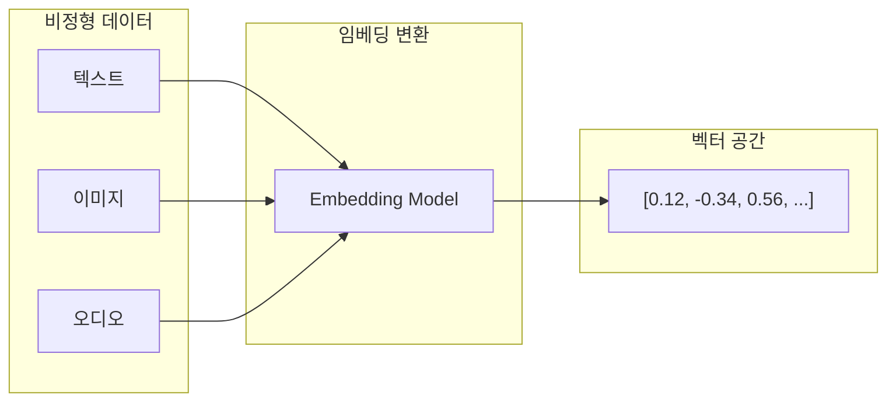

#### 임베딩의 핵심 개념

| 개념 | 설명 |
|------|------|
| **벡터 표현** | 데이터를 고차원 벡터 공간의 점으로 변환 |
| **의미적 유사성** | 유사한 의미를 가진 데이터는 가까운 위치에 배치 |
| **차원 축소** | 고차원 정보를 효율적인 저차원으로 압축 |
| **연속적 표현** | 이산적 데이터를 연속적 벡터로 변환 |

#### 왜 임베딩이 필요한가?

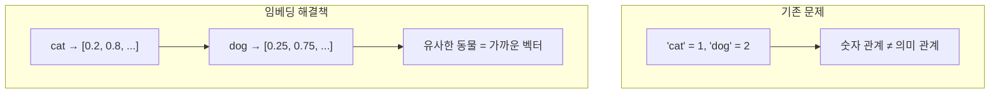

---

### 2.2 Word2Vec: 혁명의 시작

**2013년 Google이 발표한 Word2Vec**은 단어의 의미를 벡터로 표현하는 획기적인 방법을 제시했다.

#### 핵심 아이디어

> **"You shall know a word by the company it keeps"** (J.R. Firth, 1957)
>
> 단어의 의미는 함께 등장하는 문맥에서 파악할 수 있다.

#### Word2Vec 아키텍처

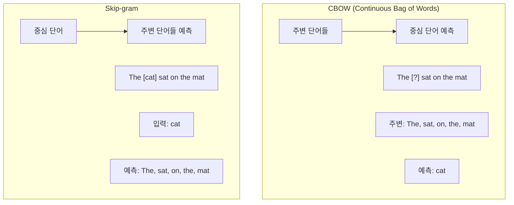

| 모델 | 입력 | 출력 | 특징 |
|------|------|------|------|
| **CBOW** | 주변 단어들 | 중심 단어 | 빠른 학습, 자주 등장하는 단어에 강함 |
| **Skip-gram** | 중심 단어 | 주변 단어들 | 희귀 단어에 강함, 더 정밀한 표현 |

#### Word2Vec 학습 과정

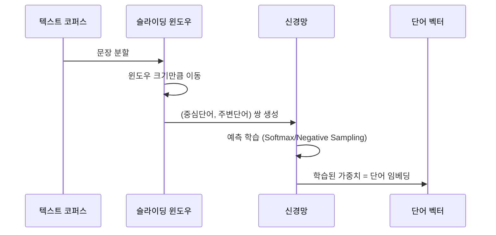

---

### 2.3 Doc2Vec: 단어에서 문서로

**Doc2Vec (Paragraph Vector)**은 Word2Vec을 확장하여 **문서 전체**를 하나의 벡터로 표현한다.

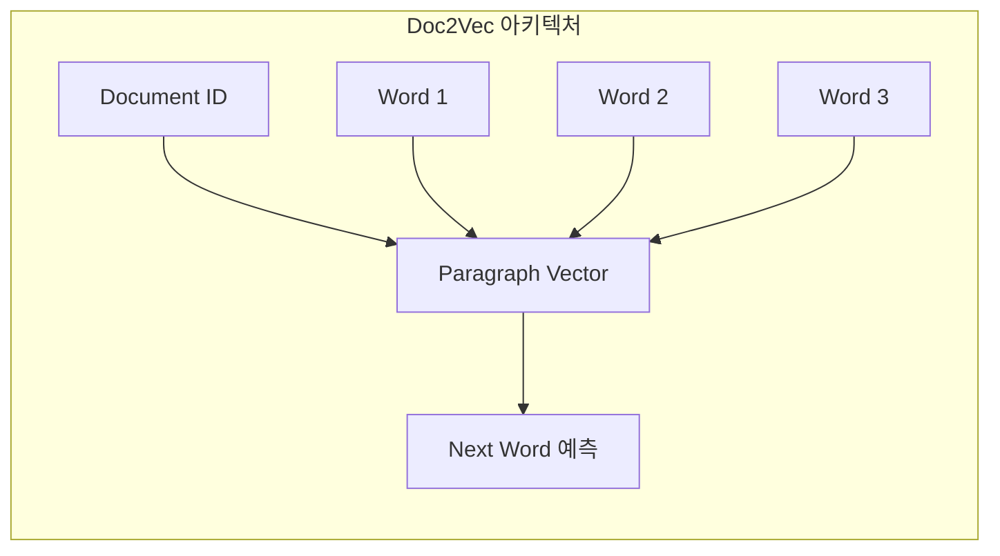

#### Doc2Vec vs Word2Vec

| 특성 | Word2Vec | Doc2Vec |
|------|----------|---------|
| **입력 단위** | 단어 | 문서/문단 |
| **출력** | 단어 벡터 | 문서 벡터 |
| **활용** | 단어 유사도, 단어 연산 | 문서 분류, 문서 유사도 |
| **문맥 범위** | 윈도우 내 단어 | 전체 문서 |

#### Doc2Vec 변형

1. **PV-DM (Distributed Memory)**: CBOW + Document Vector
2. **PV-DBOW (Distributed Bag of Words)**: Skip-gram + Document Vector

---

### 2.4 Sparse vs Dense 임베딩

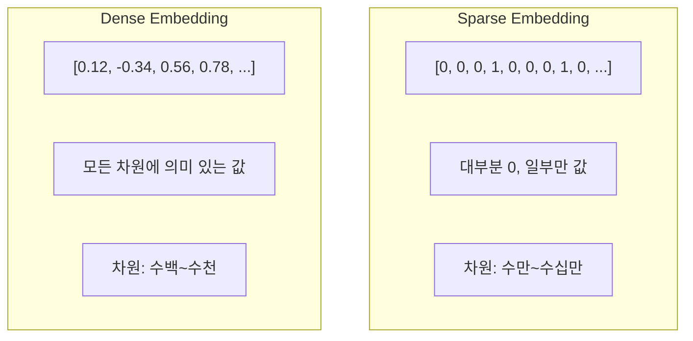

#### 비교 분석

| 특성 | Sparse Embedding | Dense Embedding |
|------|------------------|-----------------|
| **예시** | TF-IDF, One-Hot, BM25 | Word2Vec, BERT, GPT |
| **차원** | 10,000 ~ 100,000+ | 300 ~ 4,096 |
| **해석 가능성** | 높음 (각 차원 = 단어/특성) | 낮음 (추상적 의미) |
| **저장 효율** | 희소 행렬로 효율적 | 모든 값 저장 필요 |
| **의미 포착** | 표면적 (단어 일치) | 심층적 (의미 유사성) |
| **OOV 처리** | 불가 | 가능 (일반화) |

#### 실무 선택 가이드

```
키워드 검색, 정확한 매칭 필요 → Sparse (BM25)
의미 기반 검색, 유사도 필요 → Dense (BERT, Sentence-BERT)
최상의 결과 → Hybrid (Sparse + Dense)
```

---

### 2.5 임베딩에서 현대 언어 모델로

#### Transformer 아키텍처 (2017)

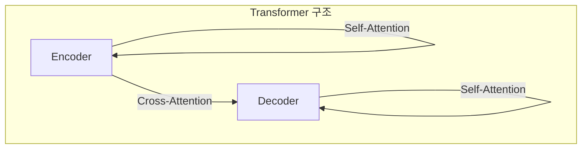

#### Transformer 기반 모델 분류

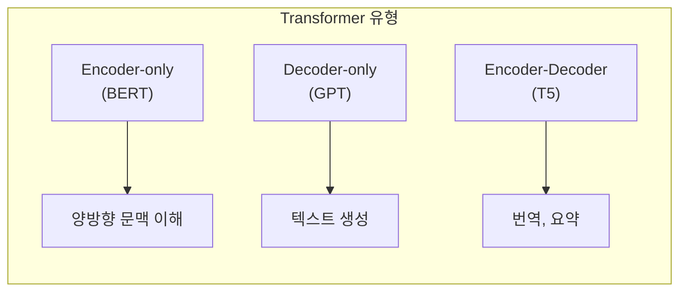

| 유형 | 대표 모델 | 특징 | 주요 활용 |
|------|-----------|------|-----------|
| **Encoder-only** | BERT, RoBERTa | 양방향 문맥 | 임베딩, 분류, NER |
| **Decoder-only** | GPT-3/4, LLaMA | 자동회귀 생성 | 텍스트 생성, 대화 |
| **Encoder-Decoder** | T5, BART | 시퀀스 변환 | 번역, 요약, QA |

---

### 2.6 임베딩 모델 (Embedding Models)

임베딩 모델은 **텍스트를 벡터로 변환하는 것에 특화**된 모델이다.

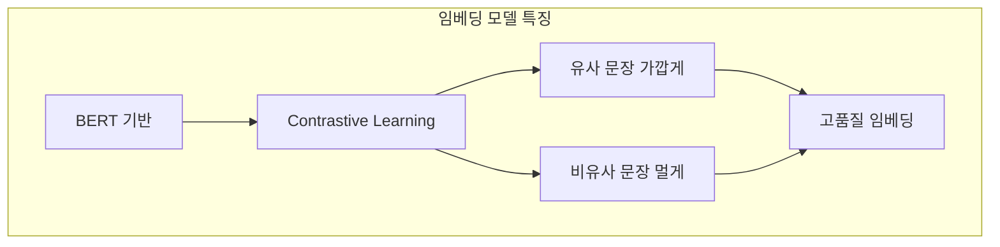

#### 주요 임베딩 모델

| 모델 | 차원 | 특징 |
|------|------|------|
| **OpenAI text-embedding-ada-002** | 1536 | 상용 API, 높은 품질 |
| **Cohere embed-v3** | 1024 | 다국어 지원 |
| **all-MiniLM-L6-v2** | 384 | 빠른 속도, 적은 리소스 |
| **all-mpnet-base-v2** | 768 | 높은 정확도 |
| **bge-large-en** | 1024 | MTEB 벤치마크 상위 |

---

### 2.7 Sentence Transformers

**Sentence-BERT (SBERT)**는 문장 수준의 고품질 임베딩을 효율적으로 생성한다.

#### 기존 BERT의 문제점

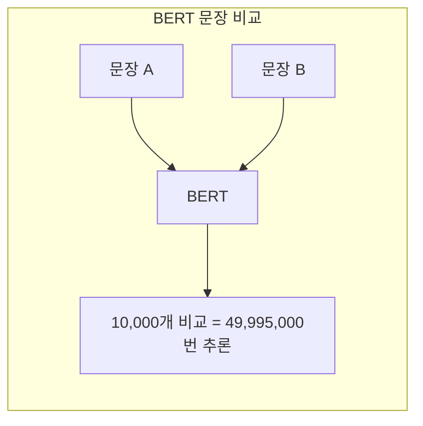

#### Sentence-BERT 해결책

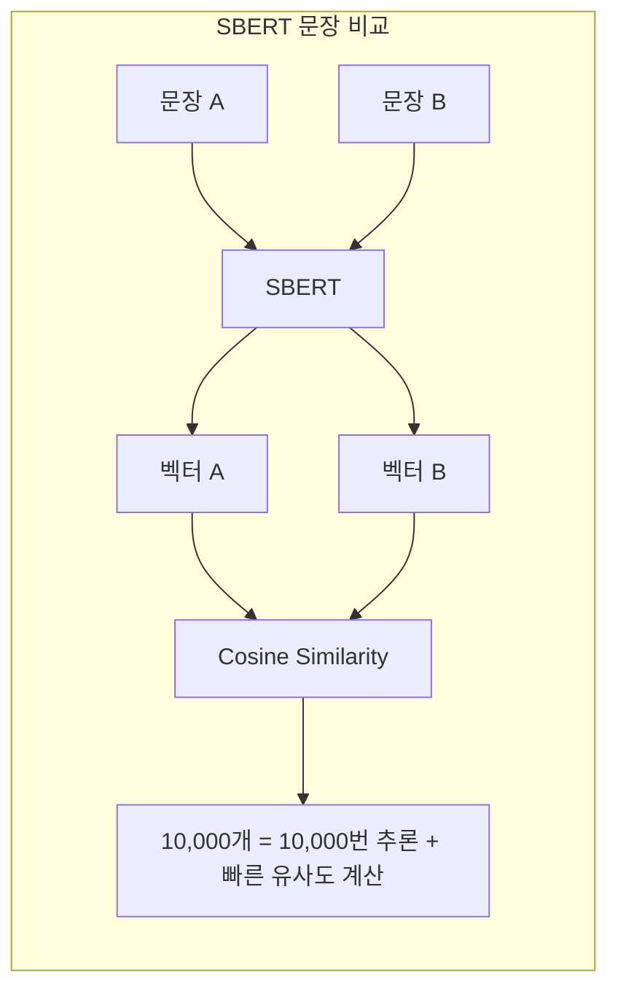

#### Sentence Transformers 사용법

```python
from sentence_transformers import SentenceTransformer

# 모델 로드
model = SentenceTransformer('all-MiniLM-L6-v2')

# 문장 임베딩
sentences = [
    "The cat sat on the mat.",
    "A dog is playing in the park.",
    "The feline rested on the rug."
]

embeddings = model.encode(sentences)

# 유사도 계산
from sklearn.metrics.pairwise import cosine_similarity

similarity_matrix = cosine_similarity(embeddings)
print(similarity_matrix)
# [[1.0, 0.2, 0.85],   # cat-mat vs dog, cat-mat vs feline-rug
#  [0.2, 1.0, 0.15],   # dog vs others
#  [0.85, 0.15, 1.0]]  # feline-rug (의미상 cat-mat과 유사)
```

#### 모델 선택 가이드

| 모델 | 속도 | 품질 | 용도 |
|------|------|------|------|
| **all-MiniLM-L6-v2** | ⚡⚡⚡ | ⭐⭐ | 빠른 프로토타입, 리소스 제한 |
| **all-mpnet-base-v2** | ⚡⚡ | ⭐⭐⭐ | 균형 잡힌 선택 |
| **multi-qa-mpnet-base-dot-v1** | ⚡⚡ | ⭐⭐⭐ | QA 특화 |

---

### 2.8 임베딩 레이어와 Zero-Shot Learning

#### 임베딩 레이어 (Embedding Layer)

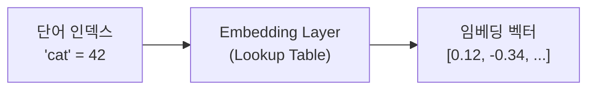

```python
import torch.nn as nn

# 임베딩 레이어 정의
vocab_size = 10000    # 어휘 크기
embedding_dim = 300   # 임베딩 차원

embedding = nn.Embedding(vocab_size, embedding_dim)

# 단어 인덱스 → 임베딩 벡터
word_index = torch.tensor([42])  # 'cat' = 42
cat_embedding = embedding(word_index)  # [1, 300] 벡터
```

#### Zero-Shot Learning

**학습하지 않은 클래스도 분류**할 수 있는 능력

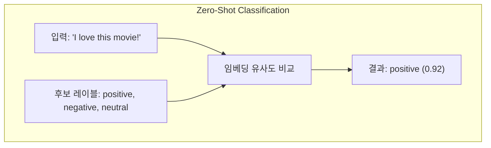

```python
from transformers import pipeline

classifier = pipeline("zero-shot-classification")

result = classifier(
    "I just got promoted at work!",
    candidate_labels=["happy", "sad", "angry", "surprised"]
)

# 출력: {'labels': ['happy', 'surprised', 'sad', 'angry'],
#        'scores': [0.89, 0.08, 0.02, 0.01]}
```

---

### 2.9 Vector Arithmetic (벡터 연산)

Word2Vec의 가장 놀라운 발견: **벡터 연산으로 의미 관계 표현 가능**

```
king - man + woman ≈ queen
paris - france + japan ≈ tokyo
```

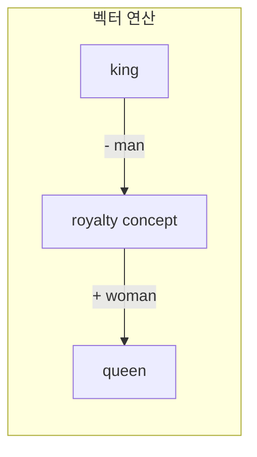

#### 벡터 연산 코드

```python
import numpy as np
from gensim.models import KeyedVectors

# Word2Vec 모델 로드
word2vec_model = KeyedVectors.load_word2vec_format(
    'GoogleNews-vectors-negative300.bin',
    binary=True
)

def vector_arithmetic(*words_and_weights):
    """
    벡터 연산 수행
    예: vector_arithmetic(("king", 1), ("man", -1), ("woman", 1))
    """
    resulting_vector = np.zeros(word2vec_model.vector_size)
    for word, weight in words_and_weights:
        if word in word2vec_model:
            resulting_vector += weight * word2vec_model[word]
    return resulting_vector

# king - man + woman = ?
result_vector = vector_arithmetic(
    ("king", 1),
    ("man", -1),
    ("woman", 1)
)

# 가장 유사한 단어 찾기
similar_words = word2vec_model.similar_by_vector(result_vector, topn=5)
print(similar_words)
# [('queen', 0.7118), ('monarch', 0.6189), ('princess', 0.5902), ...]
```

#### 벡터 연산 활용 예시

| 연산 | 결과 | 의미 |
|------|------|------|
| `king - man + woman` | queen | 성별 관계 |
| `paris - france + italy` | rome | 수도 관계 |
| `walking - walk + swim` | swimming | 시제 관계 |
| `good - bad + terrible` | wonderful | 반의어 관계 |

---

## 💡 실무 적용 포인트

### 임베딩 모델 선택 플로우

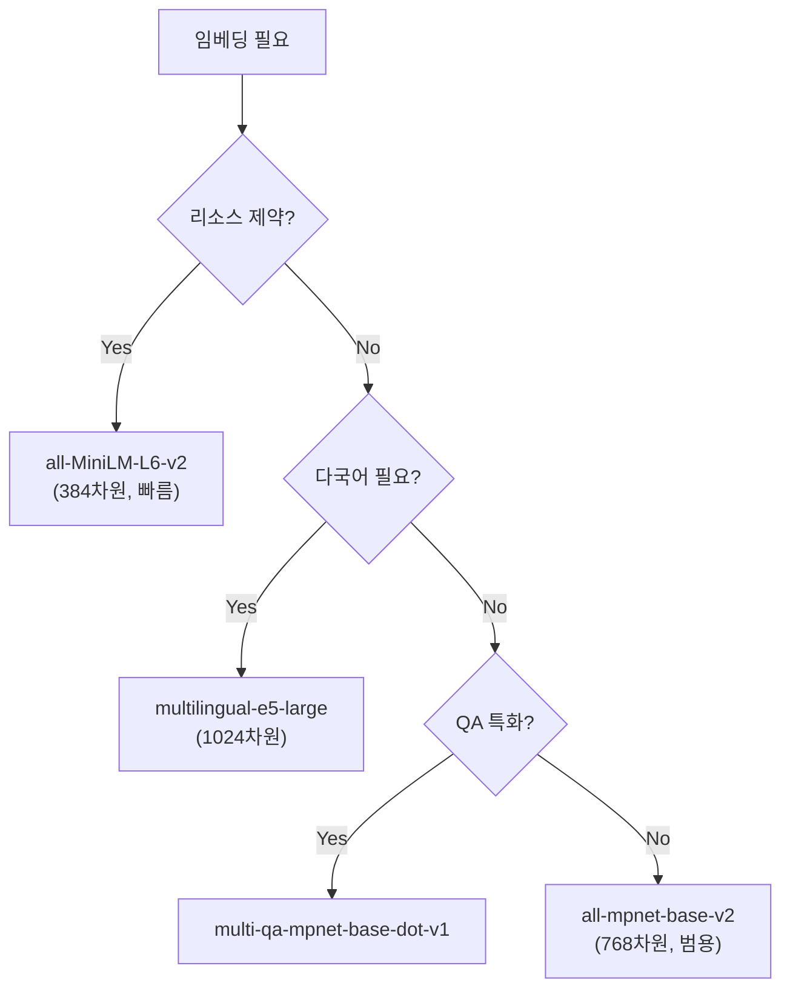

### ChromaDB와 Sentence Transformers 연동

```python
import chromadb
from sentence_transformers import SentenceTransformer

# ChromaDB 클라이언트 생성
client = chromadb.Client()
collection = client.create_collection("my_documents")

# Sentence Transformers 모델
model = SentenceTransformer('all-MiniLM-L6-v2')

# 문서 추가
documents = [
    "Machine learning is a subset of AI.",
    "Neural networks are inspired by the brain.",
    "Deep learning uses multiple layers."
]
embeddings = model.encode(documents).tolist()

collection.add(
    documents=documents,
    embeddings=embeddings,
    ids=["doc1", "doc2", "doc3"]
)

# 의미 기반 검색
query = "What is artificial intelligence?"
query_embedding = model.encode([query]).tolist()

results = collection.query(
    query_embeddings=query_embedding,
    n_results=2
)
print(results)
```

### 임베딩 품질 평가

```python
from sentence_transformers import SentenceTransformer, util

model = SentenceTransformer('all-mpnet-base-v2')

# 테스트 문장 쌍
pairs = [
    ("A cat is sleeping.", "A feline is resting."),      # 의미상 유사
    ("A cat is sleeping.", "A dog is running."),         # 의미상 다름
    ("I love programming.", "I enjoy coding."),          # 의미상 유사
]

for sent1, sent2 in pairs:
    emb1 = model.encode(sent1)
    emb2 = model.encode(sent2)
    similarity = util.cos_sim(emb1, emb2).item()
    print(f"'{sent1}' vs '{sent2}': {similarity:.4f}")

# 출력:
# 'A cat is sleeping.' vs 'A feline is resting.': 0.8234
# 'A cat is sleeping.' vs 'A dog is running.': 0.3421
# 'I love programming.' vs 'I enjoy coding.': 0.8912
```

---

## ✅ 핵심 개념 체크리스트

- [ ] 임베딩: 비정형 데이터를 벡터 공간의 점으로 변환
- [ ] Word2Vec: CBOW (주변→중심), Skip-gram (중심→주변)
- [ ] Doc2Vec: 문서 전체를 하나의 벡터로 표현
- [ ] Sparse Embedding: 고차원, 희소 (TF-IDF, BM25)
- [ ] Dense Embedding: 저차원, 밀집 (Word2Vec, BERT)
- [ ] Transformer 유형: Encoder-only (BERT), Decoder-only (GPT), Encoder-Decoder (T5)
- [ ] Sentence Transformers: 문장 수준 고품질 임베딩 (all-MiniLM-L6-v2, all-mpnet-base-v2)
- [ ] Contrastive Learning: 유사 문장 가깝게, 비유사 문장 멀게 학습
- [ ] Zero-Shot Learning: 학습하지 않은 클래스도 분류 가능
- [ ] Vector Arithmetic: king - man + woman = queen

---

## 🔗 참고 자료

- [Word2Vec 논문 (Mikolov et al., 2013)](https://arxiv.org/abs/1301.3781)
- [Sentence-BERT 논문](https://arxiv.org/abs/1908.10084)
- [Sentence Transformers 문서](https://www.sbert.net/)
- [Hugging Face Embedding Models](https://huggingface.co/models?pipeline_tag=sentence-similarity)
- [ChromaDB 문서](https://docs.trychroma.com/)

---

## 📚 다음 챕터 미리보기

- **Chapter 3**: 벡터 유사도 검색 알고리즘 (Similarity Search)

