# Chapter 3: Similarity Search with FAISS (FAISS를 활용한 유사도 검색)

## 📌 핵심 요약

> **"FAISS(Facebook AI Similarity Search)는 Meta에서 개발한 고성능 벡터 유사도 검색 라이브러리다. Flat, IVF, HNSW 등 다양한 인덱스 구조와 Scalar/Product Quantization 기법을 제공하여, 대규모 벡터 데이터셋에서 효율적인 근사 최근접 이웃(ANN) 검색을 가능하게 한다."**

이 챕터에서는 FAISS의 핵심 개념, 인덱스 유형, 양자화 기법, 그리고 실제 구현 방법을 학습한다.

---

## 🎯 학습 목표

이 챕터를 완료하면 다음을 할 수 있다:

- [ ] FAISS의 핵심 개념과 필요성 설명
- [ ] 거리 메트릭 (L2, Inner Product, Cosine) 이해 및 선택
- [ ] FAISS 인덱스 유형별 특징과 트레이드오프 이해
- [ ] Scalar Quantization과 Product Quantization 원리 이해
- [ ] ANN (Approximate Nearest Neighbor) 문제 정의 및 해결 방법
- [ ] HNSW 인덱스의 계층적 구조와 탐색 알고리즘 이해
- [ ] FAISS를 활용한 유사도 검색 시스템 구현

---

## 📖 본문 정리

### 3.1 FAISS란?

**FAISS (Facebook AI Similarity Search)**는 Meta에서 개발하고 오픈소스로 공개한 **대규모 벡터 유사도 검색 및 클러스터링** 라이브러리다.

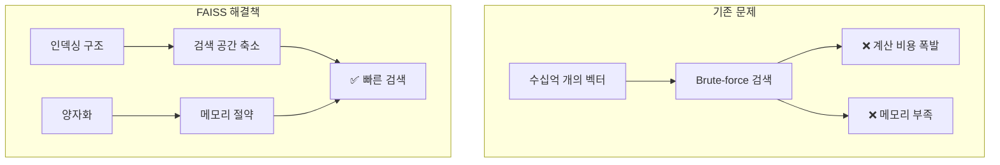

#### FAISS의 핵심 기능

| 기능 | 설명 |
|------|------|
| **다양한 인덱스** | Flat, IVF, HNSW, PQ 등 |
| **양자화** | Scalar/Product Quantization으로 메모리 절약 |
| **GPU 가속** | NVIDIA GPU를 통한 병렬 처리 |
| **클러스터링** | 벡터 그룹화 알고리즘 |
| **하이브리드** | 여러 인덱스 구조 조합 |

---

### 3.2 벡터 표현 (Vector Representations)

FAISS에서 벡터는 **고차원 공간의 밀집 부동소수점 배열**이다.

#### 수학적 표현

$$\mathbf{x} = [x_1, x_2, ..., x_d] \in \mathbb{R}^d$$

- $d$: 벡터 차원 (예: BERT 768차원, ResNet 2048차원)
- $x_i$: i번째 차원의 좌표값

#### 데이터셋 표현

$$D = \{\mathbf{x}_1, \mathbf{x}_2, ..., \mathbf{x}_n\}$$

- $n$: 데이터셋 내 벡터 개수

---

### 3.3 거리 메트릭 (Distance Metrics)

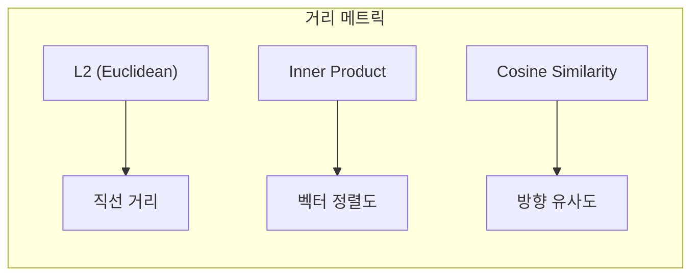

#### L2 (Euclidean) Distance

**두 점 사이의 직선 거리**

$$d_{L2}(\mathbf{x}, \mathbf{y}) = \sqrt{\sum_{i=1}^{d}(x_i - y_i)^2}$$

```python
# FAISS L2 인덱스
index = faiss.IndexFlatL2(dimension)
```

#### Inner Product (내적)

**벡터 정렬 정도 측정** (정규화된 벡터에서 코사인 유사도와 동일)

$$\langle \mathbf{x}, \mathbf{y} \rangle = \sum_{i=1}^{d} x_i \cdot y_i$$

```python
# FAISS Inner Product 인덱스
index = faiss.IndexFlatIP(dimension)
```

#### Cosine Similarity

**벡터 방향의 유사도** (크기 무관)

$$\cos(\theta) = \frac{\mathbf{x} \cdot \mathbf{y}}{||\mathbf{x}|| \cdot ||\mathbf{y}||}$$

```python
# 코사인 유사도를 위한 벡터 정규화
faiss.normalize_L2(vectors)
index = faiss.IndexFlatIP(dimension)  # 정규화 후 IP = Cosine
```

#### 메트릭 선택 가이드

| 메트릭 | 사용 상황 | 특징 |
|--------|----------|------|
| **L2** | 일반적인 유사도 검색 | 스케일에 민감 |
| **Inner Product** | 정규화된 임베딩 | NLP에서 자주 사용 |
| **Cosine** | 문서 유사도, 텍스트 검색 | 길이 무관 |

---

### 3.4 FAISS 인덱스 유형

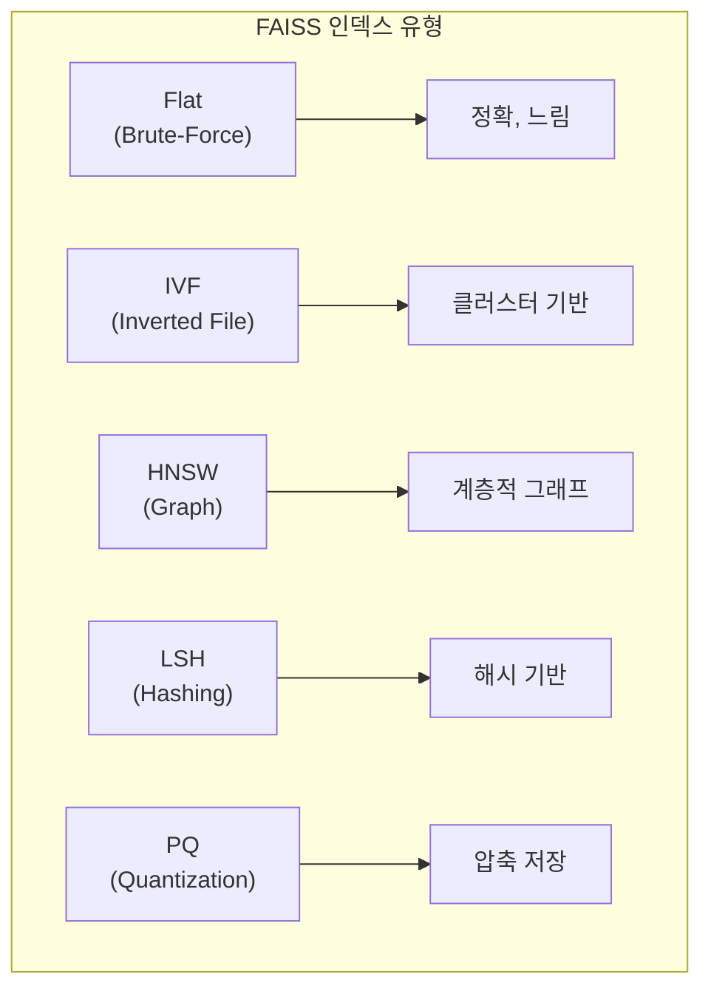

#### 3.4.1 Flat Indexes (Brute-Force)

**전체 데이터를 순차 검색** - 정확하지만 느림

| 인덱스 | 거리 메트릭 | 설명 |
|--------|------------|------|
| `IndexFlatL2` | L2 | 유클리드 거리 |
| `IndexFlatIP` | Inner Product | 내적 (코사인 유사도용) |

```python
import faiss
import numpy as np

d = 128  # 차원
index = faiss.IndexFlatL2(d)

# 벡터 추가 (학습 불필요)
vectors = np.random.random((10000, d)).astype('float32')
index.add(vectors)

# 검색
query = np.random.random((1, d)).astype('float32')
D, I = index.search(query, k=5)  # 상위 5개
```

**장점**: 정확한 결과 보장
**단점**: O(n) 복잡도, 대규모 데이터에 부적합

#### 3.4.2 IVF Indexes (Inverted File)

**클러스터 기반 파티셔닝**으로 검색 공간 축소

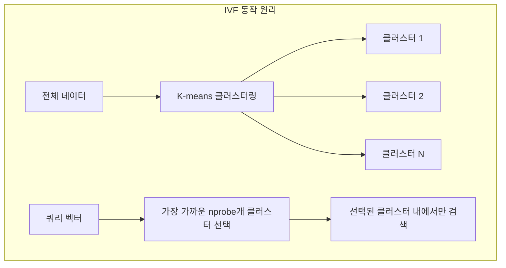

| 인덱스 | 설명 |
|--------|------|
| `IndexIVFFlat` | IVF + Flat (클러스터 내 전체 검색) |
| `IndexIVFPQ` | IVF + Product Quantization |
| `IndexIVFScalarQuantizer` | IVF + Scalar Quantization |

```python
# IVF 인덱스 생성
nlist = 100  # 클러스터 수
quantizer = faiss.IndexFlatL2(d)  # 클러스터 중심 인덱스
index = faiss.IndexIVFFlat(quantizer, d, nlist)

# 학습 필수!
index.train(vectors)
index.add(vectors)

# nprobe: 검색할 클러스터 수 (정확도 vs 속도 트레이드오프)
index.nprobe = 10
D, I = index.search(query, k=5)
```

**nprobe 파라미터**:
- 높은 값 → 높은 정확도, 느린 속도
- 낮은 값 → 낮은 정확도, 빠른 속도

#### 3.4.3 HNSW Indexes (Hierarchical Navigable Small World)

**계층적 그래프 구조**로 빠른 탐색

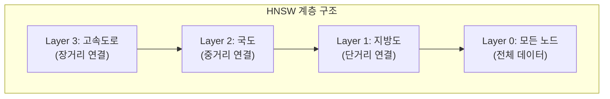

```python
# HNSW 인덱스 생성
M = 16  # 레이어당 연결 수
index = faiss.IndexHNSWFlat(d, M)

# 구성 파라미터
index.hnsw.efConstruction = 40  # 인덱스 구축 시 후보 수
index.hnsw.efSearch = 16        # 검색 시 후보 수

# 학습 없이 바로 추가
index.add(vectors)
D, I = index.search(query, k=5)
```

**HNSW 파라미터**:

| 파라미터 | 역할 | 트레이드오프 |
|----------|------|-------------|
| **M** | 레이어당 연결 수 | 높음 → 정확도↑, 메모리↑ |
| **efConstruction** | 구축 시 후보 수 | 높음 → 품질↑, 구축시간↑ |
| **efSearch** | 검색 시 후보 수 | 높음 → 정확도↑, 속도↓ |

#### 3.4.4 인덱스 비교 표

| 인덱스 | 메서드 | 파라미터 | 바이트/벡터 | 정확도 | 비고 |
|--------|--------|----------|-------------|--------|------|
| `IndexFlatL2` | Flat | d | 4*d | Exact | Brute-force |
| `IndexFlatIP` | Flat | d | 4*d | Exact | 코사인용 (정규화 필요) |
| `IndexHNSWFlat` | HNSW | d, M | 4*d + M*8 | 근사 | 빠른 검색 |
| `IndexIVFFlat` | IVF | d, nlist | 4*d + 8 | 근사 | 학습 필요 |
| `IndexIVFPQ` | IVF+PQ | d, nlist, M, nbits | M*nbits/8 + 8 | 근사 | 메모리 효율 |
| `IndexPQ` | PQ | d, M, nbits | M*nbits/8 | 근사 | 압축 |

---

### 3.5 양자화 (Quantization)

양자화는 **벡터를 더 적은 비트로 표현**하여 메모리를 절약하고 검색 속도를 높이는 기법이다.

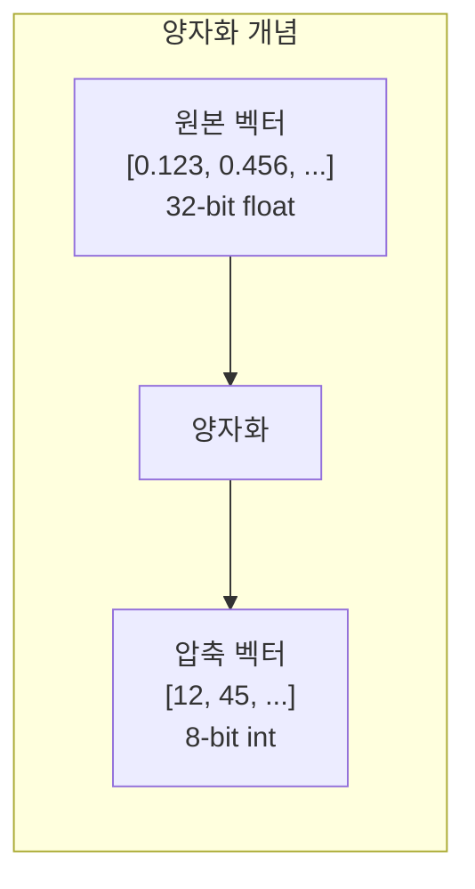

#### 3.5.1 Scalar Quantization (SQ)

**각 차원을 독립적으로 양자화**

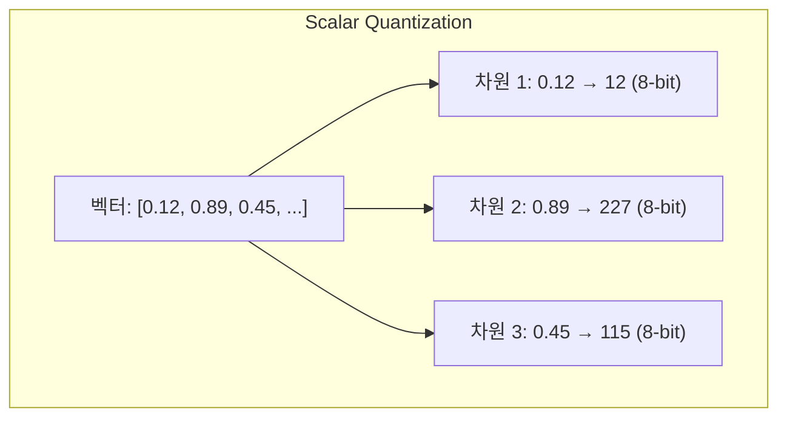

**SQ 유형**:

| 유형 | 비트 | 범위 | 설명 |
|------|------|------|------|
| `QT_8bit` | 8 | 0-255 | 기본 |
| `QT_4bit` | 4 | 0-15 | 더 공격적 압축 |
| `QT_fp16` | 16 | 반정밀도 | 정확도 유지 |

```python
# Scalar Quantizer 인덱스
index = faiss.IndexScalarQuantizer(d, faiss.ScalarQuantizer.QT_8bit)
index.train(vectors)
index.add(vectors)
```

#### 3.5.2 Product Quantization (PQ)

**벡터를 서브벡터로 분할 후 각각 양자화**

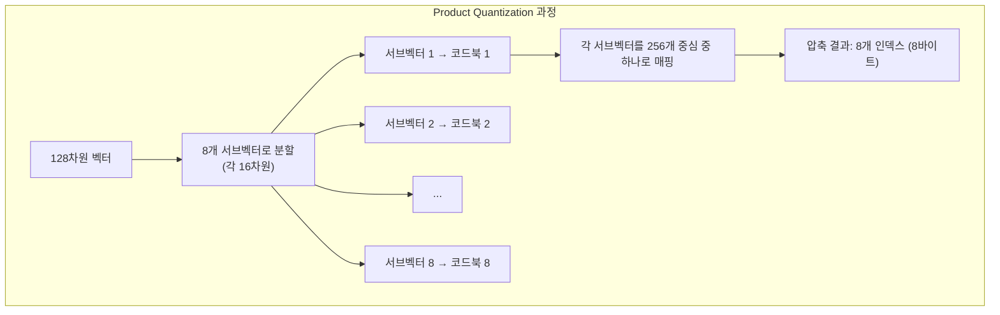

**PQ 파라미터**:
- **M**: 서브벡터 개수 (원본 차원 / M = 서브벡터 차원)
- **nbits**: 각 서브벡터의 코드북 크기 (2^nbits개 중심)

```python
# Product Quantization 인덱스
M = 8       # 서브벡터 개수
nbits = 8   # 코드북 크기: 2^8 = 256

index = faiss.IndexPQ(d, M, nbits)
index.train(vectors)
index.add(vectors)
```

**IVF + PQ 조합 (가장 많이 사용)**:

```python
nlist = 100
M = 8
nbits = 8

quantizer = faiss.IndexFlatL2(d)
index = faiss.IndexIVFPQ(quantizer, d, nlist, M, nbits)

index.train(vectors)
index.add(vectors)
```

#### SQ vs PQ 비교

| 특성 | Scalar Quantization | Product Quantization |
|------|---------------------|----------------------|
| **접근 방식** | 차원별 독립 양자화 | 서브벡터별 클러스터링 |
| **압축률** | 중간 (4x-8x) | 높음 (32x-64x) |
| **정확도 손실** | 적음 | 중간 |
| **학습 시간** | 빠름 | 느림 |
| **적합한 경우** | 정확도 중시 | 메모리 제약 |

---

### 3.6 ANN (Approximate Nearest Neighbor) 문제

#### ANN의 정의

**정확한 최근접 이웃 대신 근사값을 허용**하여 속도 향상

$$\text{Find } \mathbf{x}_i \text{ such that } d(\mathbf{q}, \mathbf{x}_i) \leq (1 + \epsilon) \cdot d(\mathbf{q}, \mathbf{x}^*)$$

- $\mathbf{q}$: 쿼리 벡터
- $\mathbf{x}^*$: 실제 최근접 이웃
- $\epsilon$: 허용 오차 (예: 0.1 = 10% 오차 허용)

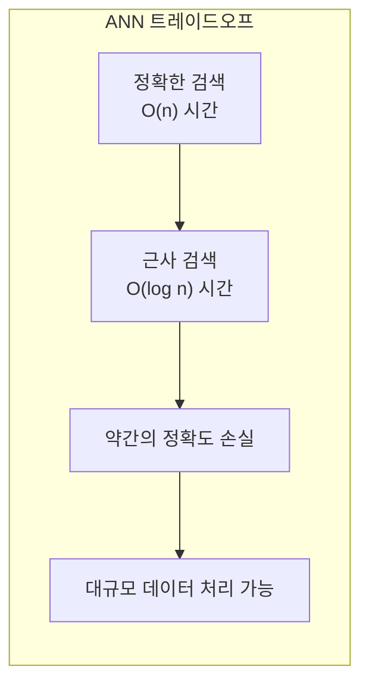

#### FAISS의 ANN 기법

| 기법 | 인덱스 | 원리 |
|------|--------|------|
| **IVF** | IndexIVFFlat | 클러스터 파티셔닝 |
| **PQ** | IndexPQ, IndexIVFPQ | 벡터 압축 + 근사 거리 |
| **HNSW** | IndexHNSWFlat | 그래프 탐색 |
| **LSH** | IndexLSH | 해시 버킷 |

#### ANN 코드 예제

```python
import faiss
import numpy as np

# 데이터 생성
d = 64          # 차원
nb = 100000     # DB 벡터 수
nq = 1000       # 쿼리 수

np.random.seed(1234)
xb = np.random.random((nb, d)).astype('float32')
xq = np.random.random((nq, d)).astype('float32')

# IVFFlat 인덱스 생성
nlist = 100     # 클러스터 수
k = 4           # 검색할 이웃 수

quantizer = faiss.IndexFlatL2(d)
index = faiss.IndexIVFFlat(quantizer, d, nlist)

# 학습 및 추가
index.train(xb)
index.add(xb)

# 검색 파라미터 설정
index.nprobe = 10  # 검색할 클러스터 수

# 검색 수행
D, I = index.search(xq, k)

# 결과: I = 인덱스, D = 거리
print(f"상위 {k}개 이웃 인덱스:\n{I[:5]}")
print(f"거리:\n{D[:5]}")
```

---

### 3.7 HNSW 심층 분석

#### HNSW의 핵심 아이디어

**고속도로 시스템 비유**:
- **상위 레이어**: 장거리 연결 (고속도로)
- **하위 레이어**: 단거리 연결 (지방도)
- **탐색**: 위에서 아래로 점진적 세분화

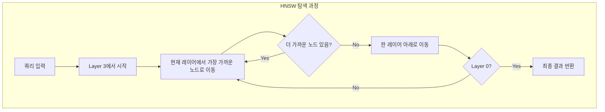

#### 완전한 HNSW 예제

```python
import numpy as np
import faiss
from typing import List, Tuple

class SimilaritySearcher:
    """HNSW 기반 유사도 검색 클래스"""

    def __init__(self, dimension: int, M: int = 16):
        self.dimension = dimension
        self.index = faiss.IndexHNSWFlat(dimension, M)

        # 파라미터 설정
        self.index.hnsw.efConstruction = 40
        self.index.hnsw.efSearch = 16

        # 원본 데이터 저장
        self.items = []

    def add_items(self, vectors: np.ndarray, items: List[str]):
        """벡터와 메타데이터 추가"""
        assert vectors.shape[1] == self.dimension
        assert vectors.shape[0] == len(items)

        self.index.add(vectors.astype('float32'))
        self.items.extend(items)

    def search(self, query_vector: np.ndarray, k: int = 5) -> List[Tuple[str, float]]:
        """k개의 가장 유사한 아이템 검색"""
        query_vector = query_vector.reshape(1, self.dimension)

        distances, indices = self.index.search(
            query_vector.astype('float32'), k)

        results = []
        for idx, dist in zip(indices[0], distances[0]):
            if idx != -1:
                results.append((self.items[idx], dist))

        return results

# 사용 예시
dimension = 128
searcher = SimilaritySearcher(dimension)

# 샘플 데이터
num_items = 10000
vectors = np.random.random((num_items, dimension)).astype('float32')
items = [f"item_{i}" for i in range(num_items)]

# 인덱스에 추가
searcher.add_items(vectors, items)

# 검색
query = np.random.random(dimension).astype('float32')
results = searcher.search(query, k=5)

for item, distance in results:
    print(f"{item}: distance = {distance:.4f}")
```

---

### 3.8 FAISS 아키텍처

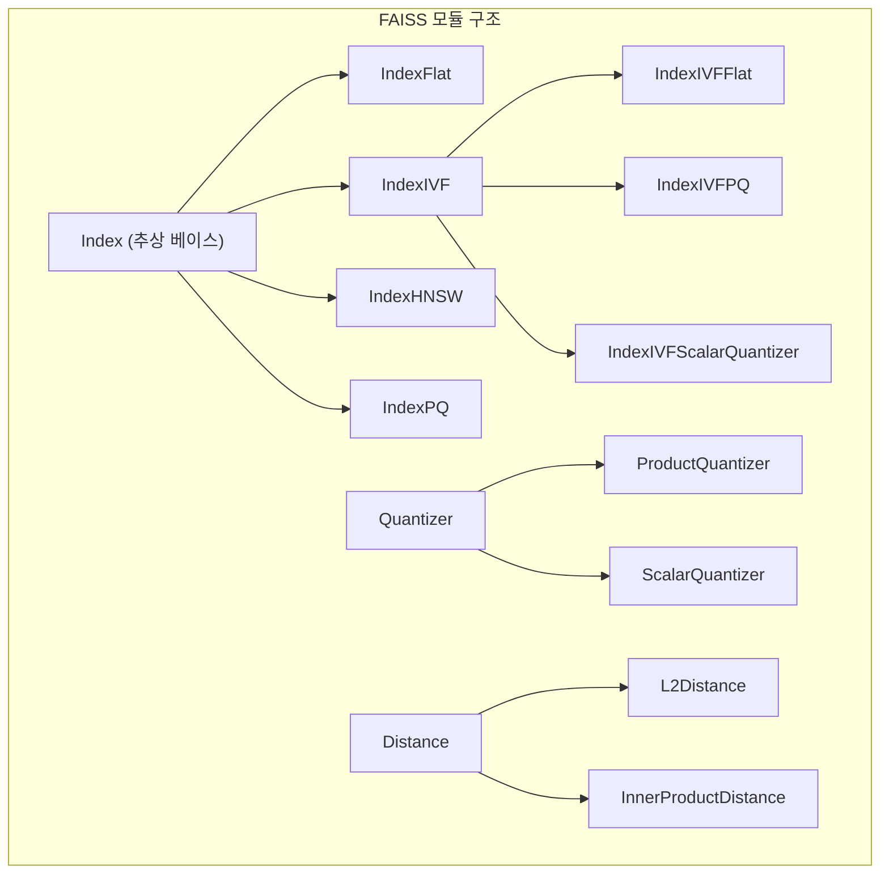

#### 핵심 컴포넌트

| 컴포넌트 | 역할 |
|----------|------|
| **Index** | 벡터 저장 및 검색 인터페이스 |
| **Quantizer** | 벡터 압축 (PQ, SQ) |
| **Distance** | 거리 계산 (L2, IP) |
| **Transform** | 전처리 (PCA, 정규화) |

---

## 💡 실무 적용 포인트

### 인덱스 선택 플로우차트

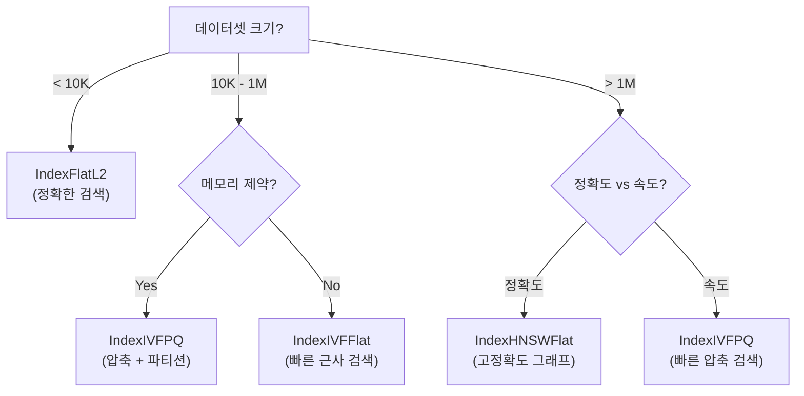

### 인덱스 벤치마크 코드

```python
import faiss
import numpy as np
import time

def benchmark_indexes(dimension=128, num_vectors=100000, k=5):
    """인덱스 유형별 성능 비교"""
    vectors = np.random.random((num_vectors, dimension)).astype('float32')
    query = np.random.random((1, dimension)).astype('float32')

    # 인덱스 생성
    flat_index = faiss.IndexFlatL2(dimension)

    ivf_index = faiss.IndexIVFFlat(
        faiss.IndexFlatL2(dimension), dimension, int(np.sqrt(num_vectors)))

    hnsw_index = faiss.IndexHNSWFlat(dimension, 16)

    # 학습 및 추가
    flat_index.add(vectors)

    ivf_index.train(vectors)
    ivf_index.add(vectors)

    hnsw_index.add(vectors)

    # 벤치마크
    results = {}
    for name, index in [('Flat', flat_index), ('IVF', ivf_index), ('HNSW', hnsw_index)]:
        start = time.time()
        for _ in range(100):
            index.search(query, k)
        results[name] = (time.time() - start) / 100

    return results

# 실행
results = benchmark_indexes()
for name, time_per_query in results.items():
    print(f"{name}: {time_per_query*1000:.3f} ms/query")
```

### 최적 파라미터 가이드

| 상황 | 권장 인덱스 | 파라미터 |
|------|------------|----------|
| **소규모 (< 10K)** | IndexFlatL2 | - |
| **중규모 정확도 중시** | IndexHNSWFlat | M=32, ef=64 |
| **중규모 속도 중시** | IndexIVFFlat | nlist=√n, nprobe=10 |
| **대규모 메모리 제약** | IndexIVFPQ | M=8, nbits=8 |
| **대규모 고정확도** | IndexIVFPQ + Refine | M=16, rerank=100 |

### 인덱스 저장/로드

```python
# 저장
faiss.write_index(index, "my_index.faiss")

# 로드
loaded_index = faiss.read_index("my_index.faiss")
```

---

## ✅ 핵심 개념 체크리스트

- [ ] FAISS: Meta의 고성능 벡터 유사도 검색 라이브러리
- [ ] 거리 메트릭: L2 (유클리드), Inner Product (내적), Cosine (코사인)
- [ ] IndexFlat: Brute-force, 정확하지만 느림
- [ ] IndexIVF: 클러스터 기반 파티셔닝, nprobe로 정확도/속도 조절
- [ ] IndexHNSW: 계층적 그래프, M/efConstruction/efSearch 파라미터
- [ ] Scalar Quantization: 차원별 독립 양자화 (QT_8bit, QT_4bit)
- [ ] Product Quantization: 서브벡터 분할 + 코드북 매핑
- [ ] ANN: 근사 최근접 이웃, 속도와 정확도 트레이드오프
- [ ] 인덱스 선택: 데이터 크기, 메모리, 정확도 요구사항에 따라 결정

---

## 🔗 참고 자료

- [FAISS GitHub Repository](https://github.com/facebookresearch/faiss)
- [FAISS Wiki](https://github.com/facebookresearch/faiss/wiki)
- [FAISS Tutorial](https://github.com/facebookresearch/faiss/wiki/Getting-started)
- [Product Quantization 논문](https://lear.inrialpes.fr/pubs/2011/JDS11/jegou_searching_with_quantization.pdf)
- [HNSW 논문](https://arxiv.org/abs/1603.09320)

---

## 📚 다음 챕터 미리보기

- **Chapter 4**: 벡터 데이터베이스 심화 (실제 DB 시스템 비교)

