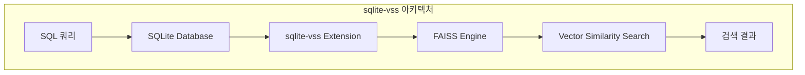
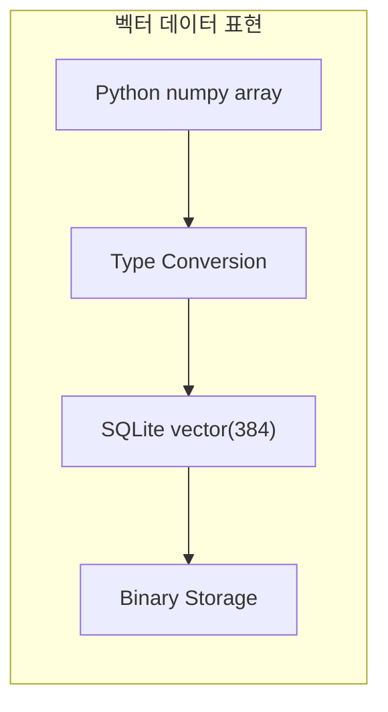
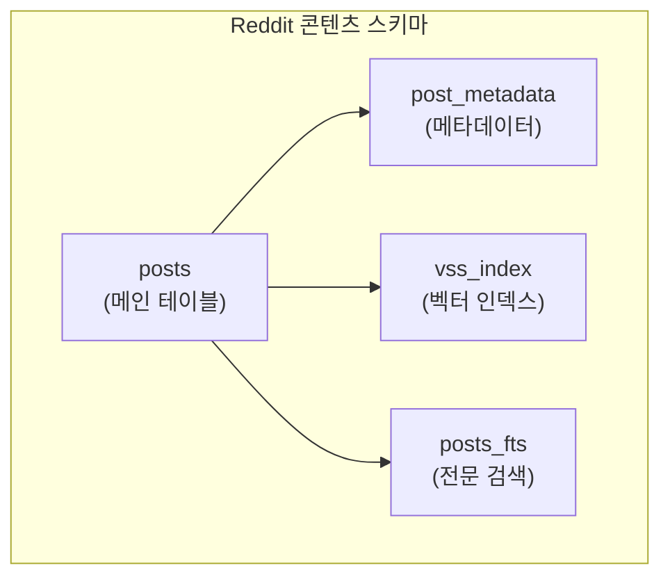
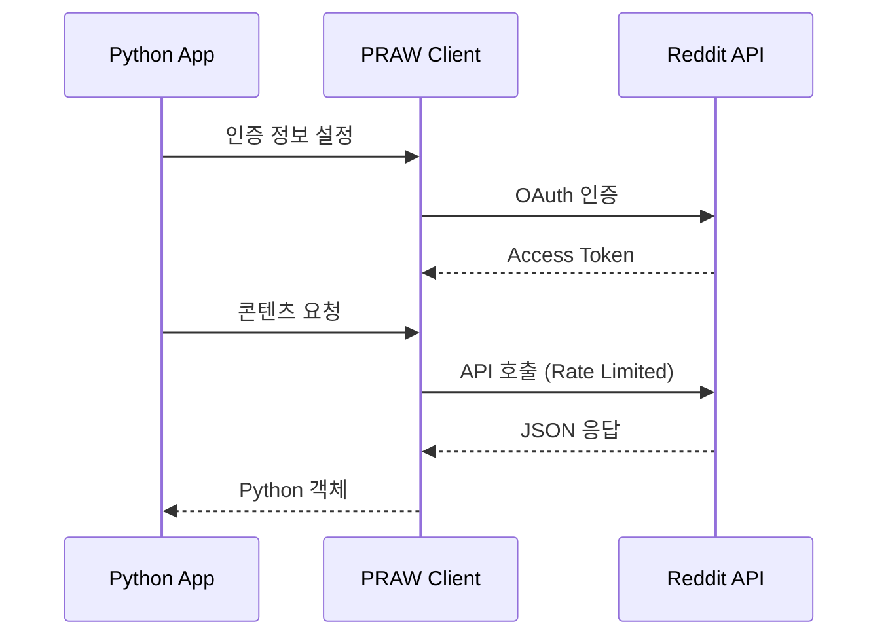
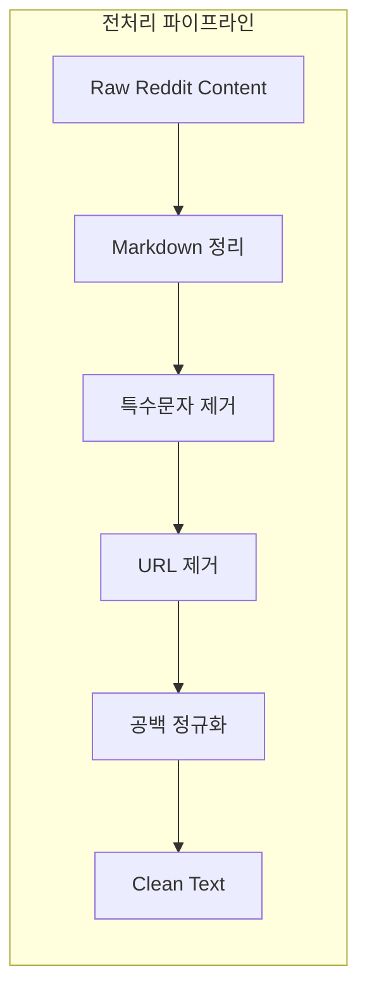
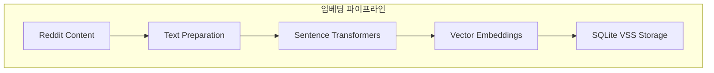
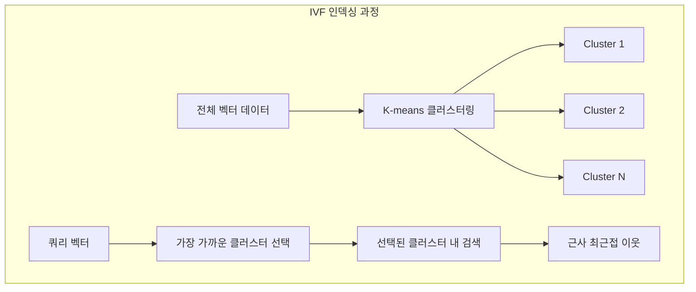
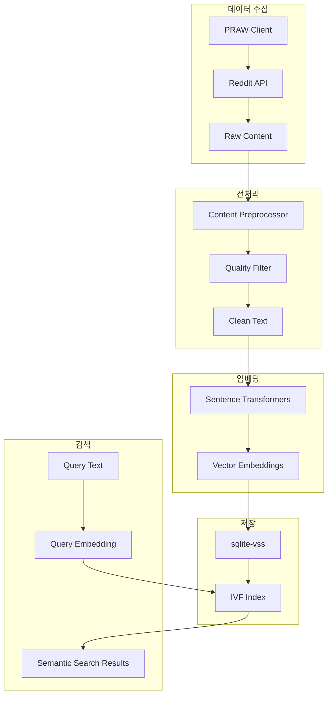

# Chapter 4: Semantic Search with Sqlite3 (SQLite를 활용한 시맨틱 검색)

## 📌 핵심 요약

> **"sqlite-vss는 SQLite의 벡터 유사도 검색 확장으로, FAISS를 내부적으로 사용하면서 익숙한 SQL 환경에서 벡터 검색을 가능하게 한다. 이를 통해 Reddit 게시물과 같은 개인 지식 관리 시스템을 구축하고, 의미 기반 검색(Semantic Search)을 수행할 수 있다."**

이 챕터에서는 sqlite-vss 확장을 사용한 시맨틱 검색 시스템 구축 방법을 학습한다.

---

## 🎯 학습 목표

이 챕터를 완료하면 다음을 할 수 있다:

- [ ] sqlite-vss 확장 설치 및 설정
- [ ] SQLite에서 벡터 데이터 타입 활용
- [ ] 벡터 검색을 위한 스키마 설계
- [ ] PRAW를 사용한 Reddit 데이터 수집
- [ ] 콘텐츠 전처리 및 임베딩 생성
- [ ] IVF 인덱싱을 통한 검색 최적화
- [ ] 벡터 유사도와 메타데이터 필터링 결합
- [ ] 크로스 서브레딧 시맨틱 검색 구현

---

## 📖 본문 정리

### 4.1 SQLite VSS 확장 이해

**sqlite-vss (Vector Similarity Search)**는 SQLite에 벡터 검색 기능을 추가하는 확장으로, 내부적으로 **FAISS**를 사용한다.



#### 설치 및 설정

```bash
# 바이너리 다운로드
wget https://github.com/asg017/sqlite-vss/releases/download/v0.1.0/sqlite-vss-linux-x86_64.tar.gz
tar -xzf sqlite-vss-linux-x86_64.tar.gz
```

```python
import sqlite3

# 확장 로드
conn = sqlite3.connect('reddit_vectors.db')
conn.enable_load_extension(True)
conn.load_extension("./sqlite-vss0")
```

#### 핵심 기능

| 기능 | 설명 |
|------|------|
| **Vector 데이터 타입** | 고차원 벡터 효율적 저장 |
| **거리 함수** | `vss_cosine_distance()`, `vss_l2_distance()`, `vss_inner_product()` |
| **벡터 연산** | `vss_create_vector()`, `vss_normalize()`, `vss_dimension()` |
| **인덱싱** | HNSW, IVF 지원 |

#### 기본 벡터 연산

```sql
-- 벡터 생성
SELECT vss_create_vector(1.0, 2.0, 3.0);

-- 코사인 거리 계산
SELECT vss_cosine_distance(
    vss_create_vector(1.0, 0.0),
    vss_create_vector(0.0, 1.0)
);

-- 벡터 정규화
SELECT vss_normalize(vss_create_vector(1.0, 2.0, 3.0));
```

#### sqlite-vss의 장점

| 장점 | 설명 |
|------|------|
| **통합 저장소** | 임베딩과 메타데이터를 단일 DB에 저장 |
| **효율적 쿼리** | 벡터 유사도 + SQL 필터링 결합 |
| **이식성** | 파일 기반으로 휴대 용이 |
| **저자원** | 개인 규모 데이터셋에 적합 |

---

### 4.2 SQLite에서 벡터 데이터 타입 다루기



#### 벡터 테이블 생성

```sql
-- 벡터 컬럼이 있는 테이블 생성
CREATE TABLE embeddings (
    id INTEGER PRIMARY KEY,
    content_vector vector(384),  -- 차원 명시
    metadata TEXT
);
```

#### Python-SQLite 타입 변환

```python
import numpy as np

def numpy_to_vss(array):
    """numpy 배열을 VSS 벡터 형식으로 변환"""
    return f"vss_create_vector({','.join(map(str, array))})"

def insert_vector(conn, vector_array):
    sql = "INSERT INTO embeddings (content_vector) VALUES (?)"
    conn.execute(sql, (numpy_to_vss(vector_array),))
```

#### 주요 고려사항

| 항목 | 설명 |
|------|------|
| **차원 고정** | 테이블 생성 시 차원 크기 선언 필수 |
| **이진 저장** | 벡터는 효율적인 바이너리 형식으로 저장 |
| **오버헤드** | 각 벡터 컬럼은 차원에 비례한 오버헤드 발생 |
| **에러 핸들링** | 차원 불일치, 수치 오버플로우 주의 |

---

### 4.3 벡터 검색을 위한 스키마 설계



#### 메인 포스트 테이블

```sql
-- 벡터 임베딩이 포함된 메인 테이블
CREATE TABLE posts (
    id INTEGER PRIMARY KEY,
    post_id TEXT UNIQUE,
    title TEXT,
    content TEXT,
    subreddit TEXT,
    created_utc INTEGER,
    author TEXT,
    content_vector vector(384),  -- 콘텐츠 임베딩
    title_vector vector(384)     -- 제목 임베딩
);

-- 메타데이터 테이블
CREATE TABLE post_metadata (
    post_id TEXT PRIMARY KEY,
    score INTEGER,
    num_comments INTEGER,
    is_original_content BOOLEAN,
    FOREIGN KEY (post_id) REFERENCES posts(post_id)
);
```

#### 다중 인덱스 전략

```sql
-- 1. 메타데이터용 B-tree 인덱스
CREATE INDEX idx_posts_subreddit ON posts(subreddit);
CREATE INDEX idx_posts_created ON posts(created_utc);

-- 2. 전문 검색용 FTS5 인덱스
CREATE VIRTUAL TABLE posts_fts USING fts5(
    title, content, content='posts', content_rowid='id'
);

-- 3. 벡터 유사도 인덱스
CREATE VIRTUAL TABLE vss_index USING vss0(
    content_vector(384),
    id INTEGER
);
```

#### ANN 인덱스 설정

```sql
-- ANN 파라미터 설정 테이블
CREATE TABLE vector_config (
    model_version TEXT,
    vector_dim INTEGER,
    index_type TEXT,
    distance_metric TEXT,
    ef_construction INTEGER,  -- HNSW 파라미터
    m INTEGER                 -- HNSW 파라미터
);

-- HNSW 인덱스 생성
CREATE INDEX ann_index ON post_vectors
    USING vss0_hnsw(vector)
    WITH (
        dim=384,
        m=16,
        ef_construction=200
    );
```

---

### 4.4 PRAW를 사용한 Reddit 데이터 수집

**PRAW (Python Reddit API Wrapper)**는 Reddit API의 공식 Python 인터페이스다.



#### Reddit 클라이언트 구현

```python
import praw
import time
from prawcore.exceptions import PrawcoreException
from typing import Generator, Optional

class RedditClient:
    def __init__(self, client_id: str, client_secret: str,
                 username: str, password: str):
        """Reddit 클라이언트 초기화 (에러 핸들링 및 Rate Limiting 포함)"""
        self.reddit = praw.Reddit(
            client_id=client_id,
            client_secret=client_secret,
            user_agent=f"python:content_fetcher:v1.0 (by /u/{username})",
            username=username,
            password=password
        )
        self.rate_limit_delay = 1.0

    def _handle_request(self, func, *args, **kwargs):
        """일반 에러 핸들러 (지수 백오프 포함)"""
        max_retries = 3
        for attempt in range(max_retries):
            try:
                time.sleep(self.rate_limit_delay)
                return func(*args, **kwargs)
            except PrawcoreException as e:
                if "Too Many Requests" in str(e):
                    wait_time = min(pow(2, attempt), 300)
                    print(f"Rate limited. Waiting {wait_time}s...")
                    time.sleep(wait_time)
                    self.rate_limit_delay *= 1.5
                elif attempt == max_retries - 1:
                    raise

    def get_saved_content(self, limit: Optional[int] = None) -> Generator:
        """저장된 포스트 및 댓글 조회"""
        def _fetch_saved():
            return self.reddit.user.me().saved(limit=limit)

        saved_items = self._handle_request(_fetch_saved)
        if saved_items:
            for item in saved_items:
                if isinstance(item, praw.models.Submission):
                    yield {
                        'type': 'submission',
                        'id': item.id,
                        'title': item.title,
                        'subreddit': item.subreddit.display_name,
                        'created_utc': item.created_utc
                    }
                else:  # Comment
                    yield {
                        'type': 'comment',
                        'id': item.id,
                        'body': item.body,
                        'subreddit': item.subreddit.display_name
                    }
```

---

### 4.5 콘텐츠 추출 및 전처리



#### 콘텐츠 전처리기

```python
import re
import markdown
from bs4 import BeautifulSoup

class ContentPreprocessor:
    def __init__(self):
        self.url_pattern = re.compile(
            r'http[s]?://(?:[a-zA-Z]|[0-9]|[$-_@.&+]|[!*\(\),]|(?:%[0-9a-fA-F][0-9a-fA-F]))+'
        )
        self.markdown_parser = markdown.Markdown()

    def clean_markdown(self, text):
        """Markdown을 HTML로 변환 후 텍스트 추출"""
        html = self.markdown_parser.convert(text)
        soup = BeautifulSoup(html, 'html.parser')
        return soup.get_text()

    def remove_special_chars(self, text):
        """Reddit 특수 포맷 및 특수문자 제거"""
        text = re.sub(r'\[removed\]|\[deleted\]', '', text)
        text = re.sub(r'&amp;|&lt;|&gt;', ' ', text)
        return text.strip()

    def process_text(self, text):
        """전체 전처리 파이프라인"""
        text = self.clean_markdown(text)
        text = self.remove_special_chars(text)
        text = re.sub(r'\s+', ' ', text)  # 공백 정규화
        return text
```

#### 콘텐츠 품질 필터

```python
class ContentFilter:
    def __init__(self, min_score=5, min_length=50):
        self.min_score = min_score
        self.min_length = min_length

    def is_quality_content(self, content, metadata):
        """품질 기준 충족 여부 검사"""
        if len(content) < self.min_length:
            return False
        if metadata.get('score', 0) < self.min_score:
            return False
        if '[removed]' in content or '[deleted]' in content:
            return False
        return True
```

---

### 4.6 임베딩 생성 및 저장



#### 임베딩 생성기

```python
from sentence_transformers import SentenceTransformer
import torch
import numpy as np
from typing import List, Dict

class EmbeddingGenerator:
    def __init__(self, model_name: str = 'all-MiniLM-L6-v2'):
        # 디바이스 선택 (Apple Silicon → CUDA → CPU)
        if torch.backends.mps.is_available():
            self.device = 'mps'
        elif torch.cuda.is_available():
            self.device = 'cuda'
        else:
            self.device = 'cpu'

        self.model = SentenceTransformer(model_name, device=self.device)
        self.embedding_dim = self.model.get_sentence_embedding_dimension()

    @property
    def dimension(self) -> int:
        return self.embedding_dim
```

#### 배치 임베딩 및 저장

```python
class ContentEmbedder:
    def __init__(self, embedding_generator, batch_size: int = 32):
        self.generator = embedding_generator
        self.batch_size = batch_size

    def prepare_text(self, content: Dict) -> str:
        """콘텐츠 타입에 따른 텍스트 준비"""
        if content['type'] == 'submission':
            return f"{content['title']} {content.get('selftext', '')}"
        else:
            return content['body']

    def batch_embed(self, contents: List[Dict]) -> np.ndarray:
        """배치 단위 임베딩 생성"""
        texts = [self.prepare_text(c) for c in contents]

        embeddings = []
        for i in range(0, len(texts), self.batch_size):
            batch_texts = texts[i:i + self.batch_size]
            batch_embeddings = self.generator.model.encode(
                batch_texts,
                convert_to_numpy=True,
                show_progress_bar=False
            )
            embeddings.append(batch_embeddings)

        return np.vstack(embeddings)
```

#### SQLite 저장소

```python
class EmbeddingStorage:
    def __init__(self, db_path: str):
        self.conn = sqlite3.connect(db_path)
        self.setup_database()

    def setup_database(self):
        """테이블 및 인덱스 생성"""
        self.conn.executescript("""
            CREATE VIRTUAL TABLE IF NOT EXISTS content_embeddings USING vss0(
                embedding_vector(384),
                content_id TEXT,
                content_type TEXT
            );

            CREATE TABLE IF NOT EXISTS content_metadata (
                content_id TEXT PRIMARY KEY,
                content_type TEXT,
                title TEXT,
                author TEXT,
                created_utc INTEGER,
                score INTEGER,
                metadata JSON
            );
        """)
        self.conn.commit()

    def store_embeddings(self, embeddings: np.ndarray, contents: List[Dict]):
        """임베딩 및 메타데이터 저장"""
        cursor = self.conn.cursor()

        for embedding, content in zip(embeddings, contents):
            cursor.execute("""
                INSERT INTO content_embeddings
                (embedding_vector, content_id, content_type)
                VALUES (?, ?, ?)
            """, (embedding.tobytes(), content['id'], content['type']))

            cursor.execute("""
                INSERT INTO content_metadata
                (content_id, content_type, title, author, created_utc, score, metadata)
                VALUES (?, ?, ?, ?, ?, ?, ?)
            """, (
                content['id'],
                content['type'],
                content.get('title', ''),
                content['author'],
                content['created_utc'],
                content['score'],
                json.dumps(content)
            ))

        self.conn.commit()
```

---

### 4.7 유사도 검색을 위한 인덱싱

#### IVF (Inverted File) 인덱싱



| 특성 | 설명 |
|------|------|
| **복잡도** | O(n) → O(k+m) 감소 |
| **정확도-속도 트레이드오프** | 클러스터 수, probe 수 조절 |
| **클러스터링** | K-means로 벡터 공간 분할 |
| **다중 클러스터 탐색** | recall 향상을 위해 여러 클러스터 검색 |

---

### 4.8 시맨틱 검색 쿼리 구현

#### 기본 시맨틱 검색

```python
def search_reddit_content(query_text, subreddit=None, min_score=0, limit=10):
    """벡터 유사도 + 메타데이터 필터링 결합 검색"""
    conn = sqlite3.connect('reddit_vectors.db')
    conn.enable_load_extension(True)
    conn.load_extension("./sqlite-vss0")

    # 쿼리 임베딩 생성
    model = SentenceTransformer('all-MiniLM-L6-v2')
    query_embedding = model.encode(query_text)
    query_vector = "vss_create_vector(" + ",".join(map(str, query_embedding)) + ")"

    # 쿼리 구성
    base_query = f"""
    SELECT
        posts.id, posts.title, posts.url, posts.score,
        posts.created_utc, posts.subreddit,
        vss_cosine_distance(posts.content_vector, {query_vector}) AS distance
    FROM posts
    WHERE 1=1
    """

    params = []
    if subreddit:
        base_query += " AND posts.subreddit = ?"
        params.append(subreddit)

    if min_score > 0:
        base_query += " AND posts.score >= ?"
        params.append(min_score)

    base_query += " ORDER BY distance ASC LIMIT ?"
    params.append(limit)

    results = conn.execute(base_query, params).fetchall()
    conn.close()
    return results
```

#### 고급 필터링 검색

```python
def advanced_reddit_search(query_text, filters=None, sort_by='relevance',
                           time_period=None, limit=20):
    """다중 필터 옵션이 포함된 고급 시맨틱 검색"""
    conn = sqlite3.connect('reddit_vectors.db')
    conn.enable_load_extension(True)
    conn.load_extension("./sqlite-vss0")

    model = SentenceTransformer('all-MiniLM-L6-v2')
    query_embedding = model.encode(query_text)
    query_vector = "vss_create_vector(" + ",".join(map(str, query_embedding)) + ")"

    query_parts = [
        f"SELECT p.id, p.title, p.selftext, p.score, p.num_comments,",
        f"p.created_utc, p.subreddit, p.author,",
        f"vss_cosine_distance(p.content_vector, {query_vector}) AS distance",
        "FROM posts p WHERE 1=1"
    ]

    params = []

    # 필터 적용
    if filters:
        if 'subreddit' in filters:
            placeholders = ','.join(['?'] * len(filters['subreddit']))
            query_parts.append(f"AND p.subreddit IN ({placeholders})")
            params.extend(filters['subreddit'])

        if 'min_score' in filters:
            query_parts.append("AND p.score >= ?")
            params.append(filters['min_score'])

    # 시간 필터
    if time_period:
        current_time = int(time.time())
        time_filters = {
            'day': 86400, 'week': 604800,
            'month': 2592000, 'year': 31536000
        }
        if time_period in time_filters:
            query_parts.append("AND p.created_utc >= ?")
            params.append(current_time - time_filters[time_period])

    # 정렬
    sort_options = {
        'relevance': "ORDER BY distance ASC",
        'date': "ORDER BY p.created_utc DESC",
        'score': "ORDER BY p.score DESC"
    }
    query_parts.append(sort_options.get(sort_by, sort_options['relevance']))

    query_parts.append("LIMIT ?")
    params.append(limit)

    final_query = " ".join(query_parts)
    results = conn.execute(final_query, params).fetchall()
    conn.close()
    return results
```

---

### 4.9 크로스 서브레딧 유사 콘텐츠 검색

```python
def cross_subreddit_similarity_search(topic, source_subreddits,
                                       target_subreddits, limit=20):
    """다른 서브레딧 커뮤니티에서 동일 주제가 어떻게 논의되는지 검색"""
    conn = sqlite3.connect('reddit_vectors.db')
    conn.enable_load_extension(True)
    conn.load_extension("./sqlite-vss0")

    model = SentenceTransformer('all-MiniLM-L6-v2')
    topic_embedding = model.encode(topic)
    topic_vector = "vss_create_vector(" + ",".join(map(str, topic_embedding)) + ")"

    # 소스 서브레딧에서 대표 포스트 찾기
    source_placeholders = ','.join(['?'] * len(source_subreddits))
    source_query = f"""
    SELECT id, title, selftext, subreddit,
           vss_cosine_distance(content_vector, {topic_vector}) AS distance
    FROM posts
    WHERE subreddit IN ({source_placeholders})
    ORDER BY distance ASC
    LIMIT 10
    """

    source_posts = conn.execute(source_query, source_subreddits).fetchall()

    # 타겟 서브레딧에서 유사 포스트 검색
    results = []
    target_placeholders = ','.join(['?'] * len(target_subreddits))

    for post in source_posts:
        post_id, post_title, _, post_subreddit, _ = post

        cursor = conn.execute(
            "SELECT content_vector FROM posts WHERE id = ?", (post_id,))
        post_vector = cursor.fetchone()[0]

        similar_query = f"""
        SELECT id, title, selftext, subreddit, created_utc, score,
               vss_cosine_distance(content_vector, ?) AS distance
        FROM posts
        WHERE subreddit IN ({target_placeholders})
        ORDER BY distance ASC
        LIMIT ?
        """

        params = [post_vector] + target_subreddits + [limit // len(source_posts)]
        similar_posts = conn.execute(similar_query, params).fetchall()

        for similar in similar_posts:
            results.append({
                'source_post': {'id': post_id, 'title': post_title,
                               'subreddit': post_subreddit},
                'similar_post': {
                    'id': similar[0], 'title': similar[1],
                    'subreddit': similar[3],
                    'similarity': 1 - similar[6]
                }
            })

    results.sort(key=lambda x: x['similar_post']['similarity'], reverse=True)
    conn.close()
    return results[:limit]
```

---

## 💡 실무 적용 포인트

### 전체 시스템 아키텍처



### 구현 체크리스트

```
□ 환경 설정
  ├── sqlite-vss 확장 설치
  ├── PRAW 인증 설정
  └── Sentence Transformers 모델 로드

□ 스키마 설계
  ├── 벡터 테이블 생성 (차원 명시)
  ├── 메타데이터 테이블 생성
  ├── FTS5 전문 검색 인덱스
  └── VSS 벡터 인덱스

□ 데이터 파이프라인
  ├── Reddit 콘텐츠 수집 (Rate Limiting)
  ├── 콘텐츠 전처리 (Markdown, URL 제거)
  ├── 품질 필터링
  └── 배치 임베딩 생성 및 저장

□ 검색 구현
  ├── 기본 시맨틱 검색
  ├── 메타데이터 필터링 결합
  ├── 시간 기반 필터
  └── 크로스 서브레딧 검색
```

### 성능 최적화 팁

| 영역 | 최적화 방법 |
|------|------------|
| **임베딩** | GPU 사용, 배치 처리 (32-64) |
| **저장** | 바이너리 형식, 트랜잭션 배치 |
| **인덱싱** | IVF 클러스터 수 조절 (√n) |
| **검색** | nprobe 파라미터 튜닝 |
| **메모리** | 스트리밍 처리, 배치 크기 조절 |

---

## ✅ 핵심 개념 체크리스트

- [ ] sqlite-vss: SQLite의 벡터 유사도 검색 확장 (FAISS 기반)
- [ ] 벡터 함수: `vss_create_vector()`, `vss_cosine_distance()`, `vss_normalize()`
- [ ] 스키마 설계: 벡터 테이블 + 메타데이터 테이블 + 인덱스
- [ ] PRAW: Reddit API Python 래퍼, Rate Limiting 필수
- [ ] 전처리: Markdown 정리, 특수문자 제거, 품질 필터링
- [ ] 임베딩: Sentence Transformers (all-MiniLM-L6-v2)
- [ ] IVF 인덱싱: 클러스터 기반 근사 검색
- [ ] 하이브리드 검색: 벡터 유사도 + SQL 메타데이터 필터링

---

## 🔗 참고 자료

- [sqlite-vss GitHub](https://github.com/asg017/sqlite-vss)
- [PRAW Documentation](https://praw.readthedocs.io/)
- [Sentence Transformers](https://www.sbert.net/)
- [SQLite FTS5](https://www.sqlite.org/fts5.html)

---

## 📚 다음 챕터 미리보기

- **Chapter 5**: 전용 벡터 데이터베이스 비교 (Pinecone, Weaviate, Milvus 등)

