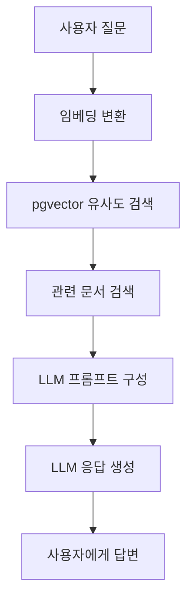
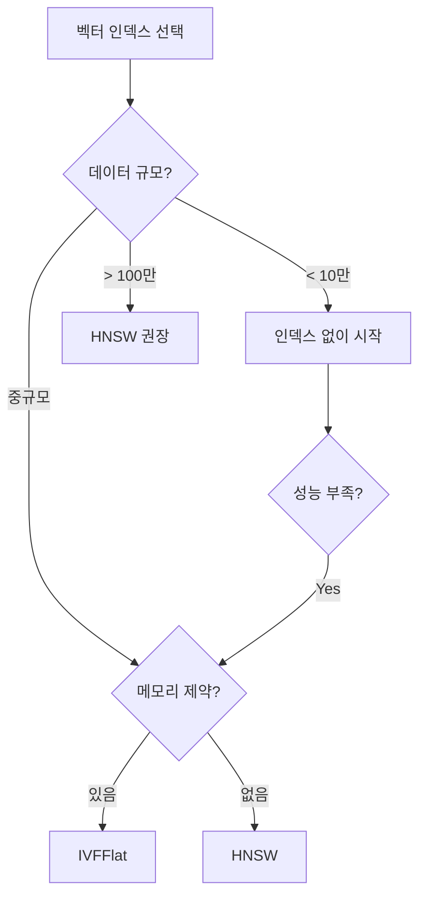

# pgvector를 활용한 유사도 검색

> **통합 문서**: Just Use Postgres (기본 개념) + Vector Databases (실전 ArXiv 시스템) 통합

---

## 📌 핵심 요약

pgvector 확장을 통해 PostgreSQL에서 벡터 유사도 검색을 구현하고, 엔터프라이즈급 RDBMS의 ACID 특성과 벡터 검색을 결합한 하이브리드 데이터베이스를 구축한다. IVFFlat과 HNSW 두 가지 근사 최근접 이웃(ANN) 인덱스 알고리즘의 특성과 튜닝 방법도 다룬다.

---

## 🎯 학습 목표

- [ ] pgvector 확장 설치 및 벡터 데이터 타입 이해
- [ ] 코사인 거리 연산자로 유사도 검색 수행
- [ ] IVFFlat vs HNSW 인덱스 선택 기준 이해
- [ ] RAG 파이프라인 구축
- [ ] 하이브리드 검색 (벡터 + 메타데이터) 구현

---

## 📖 본문

### 1. 벡터 임베딩이란?


**임베딩(Embedding)**: 비정형 데이터를 고차원 벡터(숫자 배열)로 변환한 것

**특징**:
- 의미적으로 유사한 데이터 → 벡터 공간에서 가까운 위치
- 차원 수는 모델에 따라 다름 (384, 768, 1024, 1536 등)
- 유사도 측정: 코사인 거리, 유클리드 거리, 내적

---

### 2. pgvector 설치 및 기본 사용

#### 2.1 확장 설치

```bash
# Ubuntu/Debian
sudo apt install postgresql-14-pgvector

# RHEL/CentOS
sudo dnf install -y pgvector
```

```sql
-- 확장 활성화
CREATE EXTENSION vector;

-- 설치 확인
SELECT * FROM pg_extension WHERE extname = 'vector';
```

#### 2.2 테이블 생성

```sql
-- 벡터 컬럼이 있는 테이블 생성
CREATE TABLE items (
    id SERIAL PRIMARY KEY,
    title TEXT NOT NULL,
    content TEXT,
    embedding vector(1024)  -- 1024차원 벡터
);
```

#### 2.3 벡터 데이터 타입

```sql
-- 배열에서 생성
SELECT ARRAY[1,2,3]::vector;

-- 문자열에서 생성
SELECT '[1,2,3]'::vector;

-- 차원 지정
CREATE TABLE papers (
    embedding vector(768)  -- 768차원 벡터
);
```

---

### 3. 거리 연산자

| 연산자 | 거리 유형 | 설명 | 용도 |
|--------|----------|------|------|
| `<=>` | 코사인 거리 | 1 - 코사인 유사도 | 텍스트 임베딩 (권장) |
| `<->` | L2 (유클리드) | sqrt(sum(x[i]-y[i])^2) | 기하학적 거리 |
| `<#>` | 내적 | sum(x[i]*y[i]) | 정규화된 벡터 |

#### 유사도 검색 쿼리

```sql
-- 코사인 거리로 유사한 항목 5개 찾기
SELECT
    title,
    content,
    embedding <=> :query_embedding AS distance
FROM items
ORDER BY embedding <=> :query_embedding
LIMIT 5;
```

---

### 4. 벡터 인덱스

#### 4.1 왜 인덱스가 필요한가?

```
인덱스 없이: 모든 벡터와 거리 계산 (Full Scan) → O(N)
인덱스 사용: 근사 최근접 이웃(ANN) → 속도 대폭 향상
```

#### 4.2 IVFFlat vs HNSW 비교

| 특성 | IVFFlat | HNSW |
|------|---------|------|
| **알고리즘** | 역파일 인덱스 + 플랫 검색 | 계층적 탐색 가능 소세계 그래프 |
| **빌드 속도** | 빠름 | 느림 |
| **쿼리 속도** | 보통 | 빠름 |
| **메모리 사용** | 적음 | 많음 |
| **정확도** | 보통 | 높음 |
| **데이터 변경** | REINDEX 필요 | 불필요 |
| **적합한 상황** | 메모리 제한, 데이터 자주 변경 | 읽기 중심, 높은 정확도 |

#### 4.3 IVFFlat 인덱스

```sql
-- IVFFlat 인덱스 생성
CREATE INDEX ON items
USING ivfflat (embedding vector_cosine_ops)
WITH (lists = 100);

-- 검색 시 탐색할 리스트 수 설정
SET ivfflat.probes = 10;
```

**파라미터**:
| 파라미터 | 설명 | 권장값 |
|----------|------|--------|
| `lists` | 클러스터(리스트) 수 | sqrt(행 수) ~ 행 수/1000 |
| `probes` | 검색 시 탐색할 리스트 수 | sqrt(lists) |

#### 4.4 HNSW 인덱스

```sql
-- HNSW 인덱스 생성
CREATE INDEX ON items
USING hnsw (embedding vector_cosine_ops)
WITH (m = 16, ef_construction = 64);

-- 검색 품질 조정
SET hnsw.ef_search = 40;
```

**파라미터**:
| 파라미터 | 설명 | 영향 | 권장값 |
|----------|------|------|--------|
| `m` | 노드당 최대 연결 수 | ↑ = 품질↑, 메모리↑ | 16 |
| `ef_construction` | 빌드 시 탐색 범위 | ↑ = 품질↑, 빌드 시간↑ | 64 |
| `ef_search` | 검색 시 탐색 범위 | ↑ = 품질↑, 속도↓ | 40 |

---

### 5. RAG 파이프라인 구축

#### 5.1 RAG 개념



#### 5.2 Python 구현

```python
import ollama
import psycopg2

def get_embedding(text):
    """텍스트를 벡터 임베딩으로 변환"""
    response = ollama.embeddings(
        model="mxbai-embed-large",
        prompt=text
    )
    return response["embedding"]

def rag_query(user_question):
    # 1. 질문을 임베딩으로 변환
    query_embedding = get_embedding(user_question)

    # 2. 유사한 문서 검색
    cursor.execute("""
        SELECT title, content
        FROM items
        ORDER BY embedding <=> %s
        LIMIT 5
    """, (query_embedding,))

    similar_docs = cursor.fetchall()

    # 3. 컨텍스트 구성
    context = "\n".join([
        f"Title: {title}\nContent: {content}"
        for title, content in similar_docs
    ])

    # 4. LLM에 질문
    prompt = f"""Based on the following information:
{context}

Answer this question: {user_question}
"""

    response = ollama.chat(
        model="llama3",
        messages=[{"role": "user", "content": prompt}]
    )

    return response["message"]["content"]
```

---

### 6. 하이브리드 검색

#### 6.1 메타데이터 필터링

```sql
-- 벡터 검색 + 키워드 필터링 조합
SELECT title, content
FROM items
WHERE category = 'AI'           -- 메타데이터 필터
  AND published_date >= '2023-01-01'
ORDER BY embedding <=> :query_embedding
LIMIT 10;
```

#### 6.2 관련성 랭킹 함수

```sql
CREATE OR REPLACE FUNCTION calculate_relevance(
    similarity float,
    publication_date date,
    citation_count int
) RETURNS float AS $$
BEGIN
    RETURN (
        0.6 * (1.0 - similarity) +                    -- 벡터 유사도 (60%)
        0.2 * (1.0 - EXTRACT(YEAR FROM age(
            current_date, publication_date))::float / 10.0) +  -- 최신성 (20%)
        0.2 * LEAST(citation_count::float / 1000.0, 1.0)       -- 인용 (20%)
    );
END;
$$ LANGUAGE plpgsql;
```

---

### 7. 실전 예제: ArXiv 논문 검색 시스템

#### 7.1 스키마 설계

```sql
CREATE TABLE papers (
    paper_id TEXT PRIMARY KEY,
    title TEXT NOT NULL,
    abstract TEXT,
    published_date DATE NOT NULL,
    categories TEXT[],
    embedding vector(768)
);

CREATE TABLE paper_sections (
    section_id SERIAL PRIMARY KEY,
    paper_id TEXT REFERENCES papers(paper_id),
    section_type TEXT NOT NULL,  -- abstract, introduction, methods
    content TEXT,
    embedding vector(768)
);

-- HNSW 인덱스
CREATE INDEX ON papers USING hnsw (embedding vector_cosine_ops);
CREATE INDEX ON paper_sections USING hnsw (embedding vector_cosine_ops);
```

#### 7.2 시맨틱 검색 쿼리

```sql
-- 날짜 범위와 카테고리 필터가 있는 유사 논문 검색
WITH query_embedding AS (
    SELECT embedding
    FROM paper_sections
    WHERE paper_id = 'target_paper_id' AND section_type = 'abstract'
)
SELECT
    p.paper_id,
    p.title,
    p.published_date,
    ps.embedding <=> (SELECT * FROM query_embedding) AS similarity
FROM papers p
JOIN paper_sections ps ON p.paper_id = ps.paper_id
WHERE
    ps.section_type = 'abstract'
    AND p.published_date >= '2023-01-01'
    AND p.categories @> ARRAY['cs.AI']
ORDER BY similarity
LIMIT 20;
```

---

### 8. 인덱스 선택 가이드



| 상황 | 권장 인덱스 |
|------|------------|
| 소규모 데이터 (< 10만) | 인덱스 없이 시작 |
| 메모리 제한 있음 | IVFFlat |
| 데이터 자주 변경 | IVFFlat |
| 읽기 중심 워크로드 | HNSW |
| 높은 정확도 필요 | HNSW |
| 대규모 데이터 | HNSW (충분한 메모리 확보) |

---

### 9. 성능 최적화

#### 9.1 쿼리 실행 계획 분석

```sql
EXPLAIN ANALYZE
SELECT * FROM items
ORDER BY embedding <-> query_vector
LIMIT 10;
```

#### 9.2 Materialized View 활용

```sql
CREATE MATERIALIZED VIEW search_view AS
SELECT
    p.paper_id, p.title, p.published_date,
    p.categories, ps.embedding
FROM papers p
JOIN paper_sections ps ON p.paper_id = ps.paper_id
WHERE ps.section_type = 'abstract';

CREATE INDEX ON search_view USING hnsw (embedding vector_cosine_ops);
CREATE INDEX ON search_view (published_date);
CREATE INDEX ON search_view USING GIN (categories);
```

#### 9.3 메모리 요구량 계산

```python
# 1백만 개 384차원 벡터 예시
vector_storage = 384 * 4 * 1_000_000      # ~1.5GB
index_overhead = 75 * 1_000_000           # ~75MB (HNSW)
working_memory = 384 * 4 * 1000           # ~1.5MB (배치 1000개당)
```

---

## 💡 실무 적용

### 임베딩 모델 선택

| 모델 | 차원 | 특징 |
|------|------|------|
| mxbai-embed-large | 1024 | 범용, Ollama 지원 |
| text-embedding-ada-002 | 1536 | OpenAI, 높은 품질 |
| all-mpnet-base-v2 | 768 | 오픈소스, SentenceTransformers |
| sentence-transformers/384 | 384 | 빠른 속도, 작은 크기 |

### SQLite-VSS vs pgvector

| 특성 | SQLite-VSS | pgvector |
|------|-----------|----------|
| **규모** | 소규모 | 대규모 |
| **동시성** | 제한적 | MVCC 기반 |
| **엔터프라이즈 기능** | 기본 | ACID, 복제, 백업 |
| **적합 환경** | 개발/프로토타입 | 프로덕션 |

---

## ✅ 체크리스트

- [ ] pgvector 확장 설치 (`CREATE EXTENSION vector`)
- [ ] 벡터 데이터 타입 (`vector(dim)`)
- [ ] 거리 연산자: `<=>` (코사인), `<->` (L2), `<#>` (내적)
- [ ] IVFFlat 인덱스: lists, probes 파라미터
- [ ] HNSW 인덱스: m, ef_construction, ef_search 파라미터
- [ ] IVFFlat vs HNSW 선택 기준
- [ ] RAG 파이프라인 구성 요소
- [ ] 하이브리드 검색 (벡터 + 메타데이터)

---

## 🔗 참고 자료

- [pgvector GitHub](https://github.com/pgvector/pgvector)
- [HNSW 논문](https://arxiv.org/abs/1603.09320)
- [Sentence Transformers](https://www.sbert.net/)
- [Ollama](https://ollama.ai)
