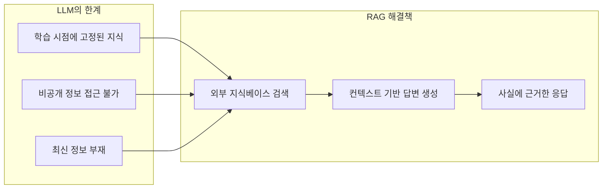
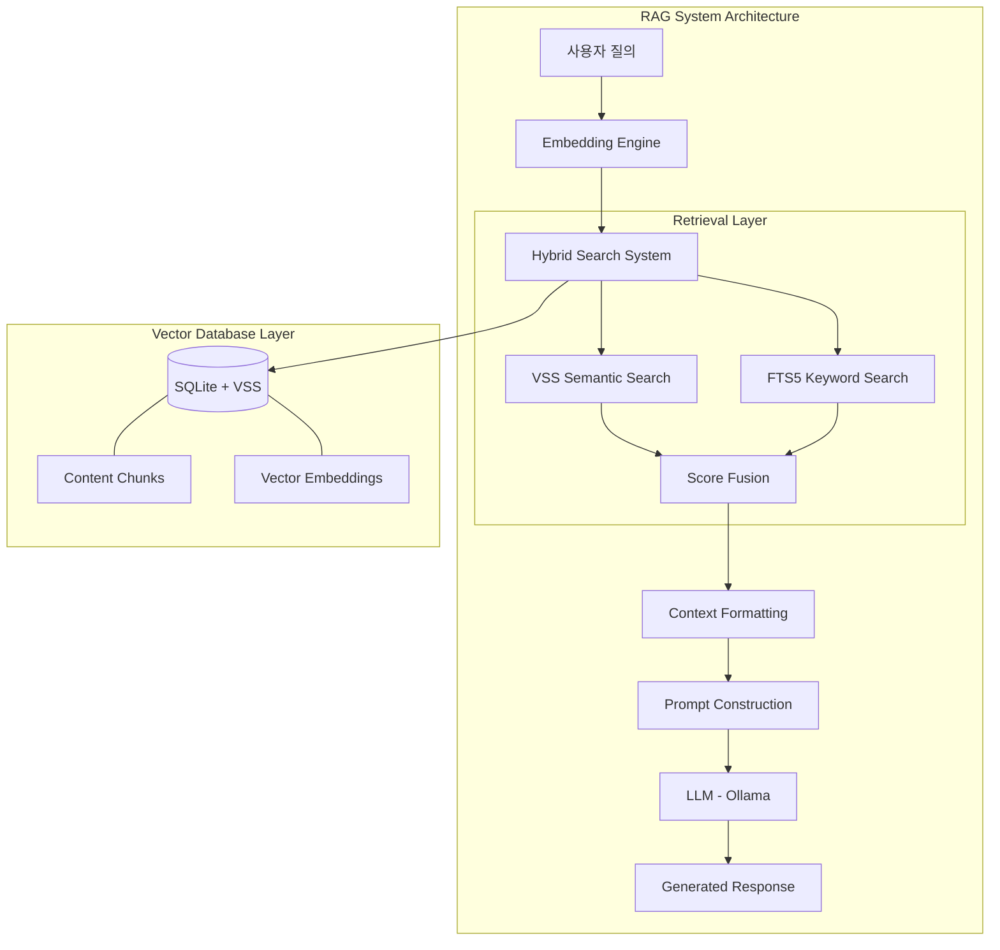
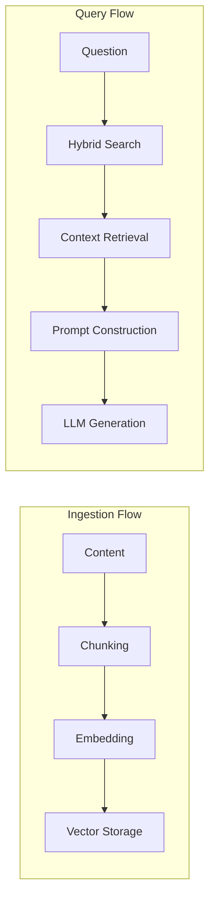
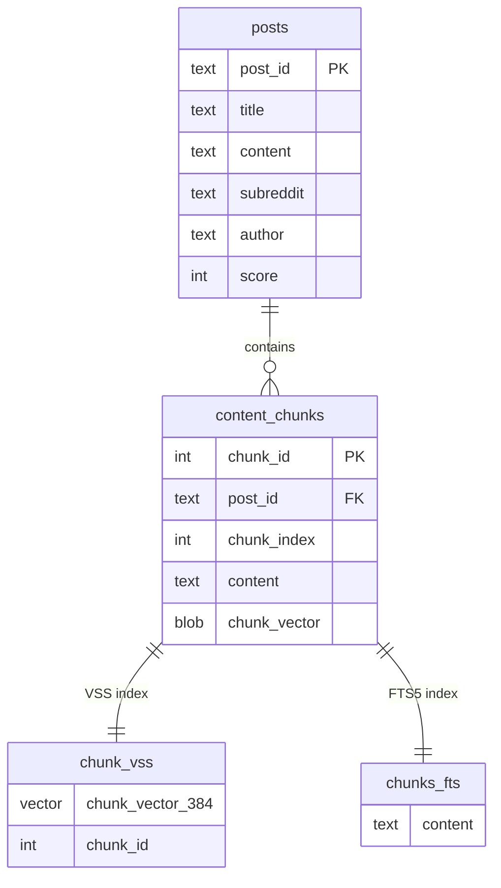
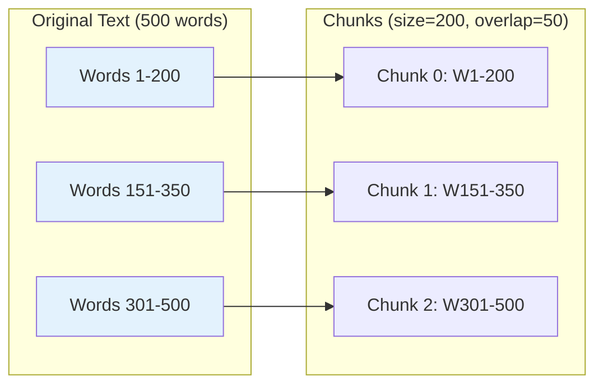
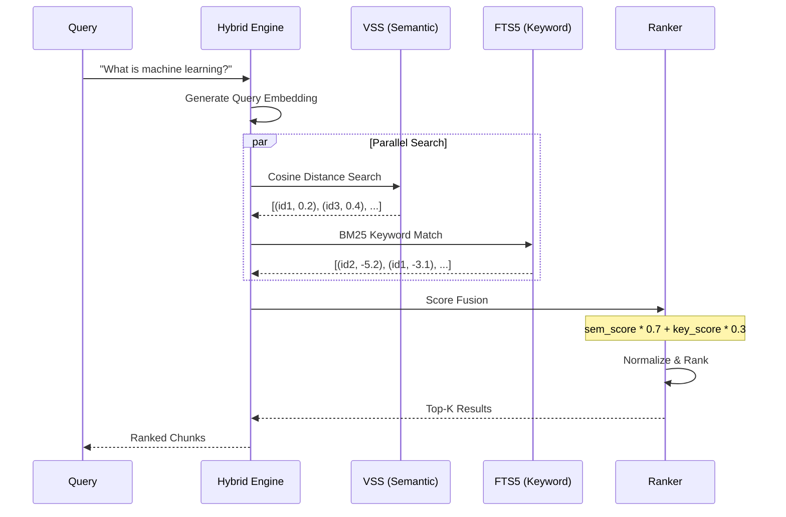
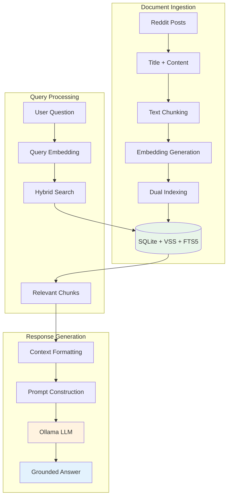
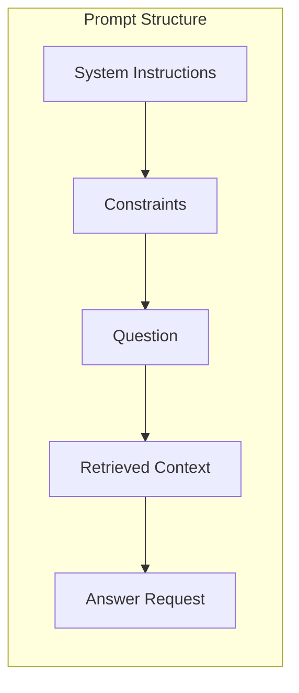
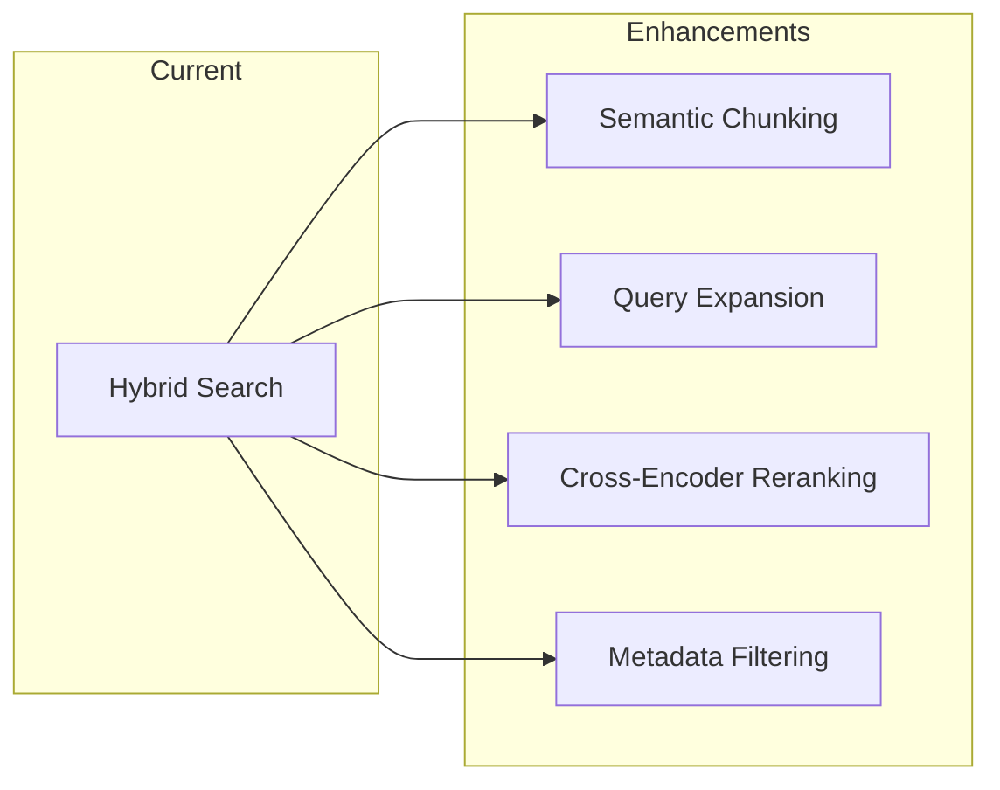

# Chapter 6: Building a Retrieval-Augmented Generation (RAG) System with SQLite VSS and Ollama

## 📌 핵심 요약

> **"SQLite VSS 확장과 Ollama 로컬 LLM을 결합하여 완전한 RAG 시스템을 구축한다. 하이브리드 검색(시맨틱 + 키워드)으로 관련 문서를 검색하고, 검색된 컨텍스트를 LLM에 제공하여 정확하고 근거 있는 답변을 생성한다. RAG는 LLM의 근본적 한계(학습 시점에 고정된 지식)를 해결하여 최신 또는 비공개 정보를 활용한 질의응답을 가능하게 한다."**

이 챕터에서는 Reddit 콘텐츠를 기반으로 질문에 답변하는 완전한 RAG 파이프라인을 구현한다.

---

## 🎯 학습 목표

이 챕터를 완료하면 다음을 할 수 있다:

- [ ] RAG 시스템의 5가지 핵심 컴포넌트 이해 및 구현
- [ ] SQLite VSS 확장으로 벡터 검색 데이터베이스 구축
- [ ] 텍스트 청킹(Chunking) 전략 구현 (중첩 윈도우 방식)
- [ ] 하이브리드 검색 시스템 구현 (VSS + FTS5 + Score Fusion)
- [ ] Ollama를 활용한 로컬 LLM 통합
- [ ] 완전한 RAG 파이프라인 오케스트레이션
- [ ] 환각(Hallucination) 방지를 위한 프롬프트 설계

---

## 📖 본문 정리

### 6.1 RAG 시스템 아키텍처 개요

#### RAG가 해결하는 문제



#### 5가지 핵심 컴포넌트



| 컴포넌트 | 역할 | 구현 기술 |
|----------|------|-----------|
| **Vector Database Layer** | 청크와 임베딩 저장, 유사도 검색 | SQLite + VSS |
| **Embedding Engine** | 텍스트 → 벡터 변환 | SentenceTransformers |
| **Hybrid Search System** | 시맨틱 + 키워드 검색 결합 | VSS + FTS5 |
| **LLM Integration** | 자연어 답변 생성 | Ollama (Llama 3.1) |
| **RAG Pipeline Orchestrator** | 검색-생성 프로세스 조율 | Python |

#### 데이터 흐름



---

### 6.2 데이터베이스 기반: SQLite VSS

#### VSS 확장 설치 및 초기화

```python
import sqlite3
import requests
import json
from sentence_transformers import SentenceTransformer
from typing import List, Dict, Optional

def setup_database(db_path='reddit_rag.db'):
    """SQLite with VSS extension 설정"""
    conn = sqlite3.connect(db_path)
    conn.row_factory = sqlite3.Row  # 딕셔너리 형태로 반환

    # VSS 확장 로드
    conn.enable_load_extension(True)
    try:
        conn.load_extension("./sqlite-vss0")
        print("VSS extension loaded successfully")
    except Exception as e:
        print(f"Error loading VSS: {e}")
        print("Download from: https://github.com/asg017/sqlite-vss/releases")
        raise

    return conn
```

**핵심 포인트**:
- `row_factory = sqlite3.Row`: 쿼리 결과를 딕셔너리로 반환하여 코드 가독성 향상
- VSS 확장이 SQLite를 하이브리드 벡터 데이터베이스로 변환

#### 스키마 설계

```python
    cursor = conn.cursor()

    # 원본 게시물 테이블
    cursor.execute("""
        CREATE TABLE IF NOT EXISTS posts (
            post_id TEXT PRIMARY KEY,
            title TEXT,
            content TEXT,
            subreddit TEXT,
            author TEXT,
            score INTEGER
        )
    """)

    # 청크 테이블 (벡터 지원)
    cursor.execute("""
        CREATE TABLE IF NOT EXISTS content_chunks (
            chunk_id INTEGER PRIMARY KEY,
            post_id TEXT,
            chunk_index INTEGER,
            content TEXT,
            chunk_vector BLOB,  -- BLOB으로 벡터 저장
            FOREIGN KEY (post_id) REFERENCES posts(post_id)
        )
    """)

    # VSS 가상 테이블 (벡터 검색용)
    cursor.execute("""
        CREATE VIRTUAL TABLE IF NOT EXISTS chunk_vss USING vss0(
            chunk_vector(384),
            chunk_id INTEGER
        )
    """)

    # FTS5 가상 테이블 (키워드 검색용)
    cursor.execute("""
        CREATE VIRTUAL TABLE IF NOT EXISTS chunks_fts USING fts5(
            content,
            content='content_chunks',
            content_rowid='chunk_id'
        )
    """)

    conn.commit()
    return conn
```

#### 스키마 구조



| 테이블 | 용도 | 특징 |
|--------|------|------|
| `posts` | 원본 콘텐츠 저장 | 메타데이터 포함 (subreddit, author, score) |
| `content_chunks` | 청크 + 임베딩 저장 | BLOB으로 벡터 저장 |
| `chunk_vss` | 벡터 유사도 검색 | 384차원 벡터 인덱스 |
| `chunks_fts` | 키워드 전문 검색 | BM25 랭킹 지원 |

---

### 6.3 텍스트 처리 및 임베딩 생성

#### 임베딩 모델 관리 (싱글톤 패턴)

```python
# 전역 임베딩 모델 (싱글톤)
embedding_model = None

def get_embedding_model():
    """임베딩 모델 초기화 또는 반환"""
    global embedding_model
    if embedding_model is None:
        embedding_model = SentenceTransformer('all-MiniLM-L6-v2')
        print(f"Loaded embedding model (dimension: {embedding_model.get_sentence_embedding_dimension()})")
    return embedding_model
```

**모델 선택 이유**:
- `all-MiniLM-L6-v2`: 품질과 속도의 균형
- 384차원 임베딩 생성
- CPU에서도 효율적으로 실행

#### 텍스트 청킹 전략

```python
def chunk_text(text, chunk_size=200, overlap=50):
    """단어 수 기반 텍스트 청킹"""
    words = text.split()
    chunks = []

    for i in range(0, len(words), chunk_size - overlap):
        chunk = ' '.join(words[i:i + chunk_size])
        if chunk:
            chunks.append(chunk)

    return chunks
```



| 파라미터 | 값 | 설명 |
|----------|-----|------|
| `chunk_size` | 200 단어 | 충분한 컨텍스트 유지 |
| `overlap` | 50 단어 (25%) | 청크 경계에서 정보 손실 방지 |

#### 콘텐츠 저장 파이프라인

```python
def store_post_with_chunks(conn, post_data):
    """게시물과 청크를 임베딩과 함께 저장"""
    cursor = conn.cursor()

    # 1. 원본 게시물 저장
    cursor.execute("""
        INSERT OR REPLACE INTO posts (post_id, title, content, subreddit, author, score)
        VALUES (?, ?, ?, ?, ?, ?)
    """, (
        post_data['post_id'],
        post_data['title'],
        post_data['content'],
        post_data['subreddit'],
        post_data['author'],
        post_data.get('score', 0)
    ))

    # 2. 제목 + 본문 결합 후 청킹
    full_text = f"{post_data['title']}\n\n{post_data['content']}"
    chunks = chunk_text(full_text)

    # 3. 임베딩 모델 가져오기
    model = get_embedding_model()

    # 4. 각 청크 처리
    for idx, chunk_content in enumerate(chunks):
        # 임베딩 생성
        embedding = model.encode(chunk_content)

        # 청크 저장
        cursor.execute("""
            INSERT INTO content_chunks (post_id, chunk_index, content, chunk_vector)
            VALUES (?, ?, ?, ?)
        """, (post_data['post_id'], idx, chunk_content, embedding.tobytes()))

        chunk_id = cursor.lastrowid

        # VSS 인덱스에 추가
        vector_str = f"vss_create_vector({','.join(map(str, embedding))})"
        cursor.execute(f"""
            INSERT INTO chunk_vss (chunk_id, chunk_vector)
            VALUES (?, {vector_str})
        """, (chunk_id,))

        # FTS5 인덱스에 추가
        cursor.execute("""
            INSERT INTO chunks_fts (rowid, content)
            VALUES (?, ?)
        """, (chunk_id, chunk_content))

    conn.commit()
    print(f"Stored post {post_data['post_id']} with {len(chunks)} chunks")
```

**제목 + 본문 결합 이유**: 제목에 본문 이해에 중요한 컨텍스트가 포함되어 있음

---

### 6.4 하이브리드 검색 구현

#### 하이브리드 검색의 장점

| 검색 방식 | 강점 | 약점 |
|-----------|------|------|
| **시맨틱 검색** | 의미와 맥락 이해 | 정확한 키워드 누락 가능 |
| **키워드 검색** | 정확한 용어 매칭 | 동의어, 맥락 이해 불가 |
| **하이브리드** | 두 방식의 장점 결합 | 가중치 튜닝 필요 |

#### 하이브리드 검색 함수

```python
def hybrid_search(conn, query_text, limit=5, semantic_weight=0.7):
    """벡터 + 키워드 검색 결합"""
    cursor = conn.cursor()
    model = get_embedding_model()

    # 쿼리 임베딩 생성
    query_embedding = model.encode(query_text)
    vector_str = f"vss_create_vector({','.join(map(str, query_embedding))})"
```

#### 시맨틱 검색 컴포넌트

```python
    # VSS를 이용한 시맨틱 검색
    cursor.execute(f"""
        SELECT
            c.chunk_id,
            c.post_id,
            c.content,
            vss_cosine_distance(v.chunk_vector, {vector_str}) as distance
        FROM chunk_vss v
        JOIN content_chunks c ON v.chunk_id = c.chunk_id
        ORDER BY distance ASC
        LIMIT ?
    """, (limit * 2,))  # 병합을 위해 더 많은 결과 가져오기

    semantic_results = {}
    for row in cursor.fetchall():
        semantic_results[row['chunk_id']] = {
            'chunk_id': row['chunk_id'],
            'post_id': row['post_id'],
            'content': row['content'],
            'semantic_score': 1 - row['distance']  # 거리 → 유사도 변환
        }
```

#### 키워드 검색 컴포넌트

```python
    # FTS5를 이용한 키워드 검색
    keyword_weight = 1 - semantic_weight
    keyword_results = {}

    try:
        cursor.execute("""
            SELECT
                c.chunk_id,
                c.post_id,
                c.content,
                bm25(chunks_fts) as score
            FROM chunks_fts f
            JOIN content_chunks c ON f.rowid = c.chunk_id
            WHERE chunks_fts MATCH ?
            ORDER BY score
            LIMIT ?
        """, (query_text, limit * 2))

        for row in cursor.fetchall():
            keyword_results[row['chunk_id']] = {
                'chunk_id': row['chunk_id'],
                'post_id': row['post_id'],
                'content': row['content'],
                'keyword_score': abs(row['score'])  # BM25는 음수 반환
            }
    except:
        # FTS5 매칭 실패 시 시맨틱 결과만 사용
        pass
```

#### 점수 융합 및 랭킹

```python
    # 결과 결합
    all_chunk_ids = set(semantic_results.keys()) | set(keyword_results.keys())
    combined_results = []

    for chunk_id in all_chunk_ids:
        sem_score = semantic_results.get(chunk_id, {}).get('semantic_score', 0)
        key_score = keyword_results.get(chunk_id, {}).get('keyword_score', 0)

        # 키워드 점수 정규화
        if keyword_results:
            max_keyword = max(r['keyword_score'] for r in keyword_results.values())
            if max_keyword > 0:
                key_score = key_score / max_keyword

        # 가중 평균으로 최종 점수 계산
        combined_score = (sem_score * semantic_weight) + (key_score * keyword_weight)

        content = semantic_results.get(chunk_id, keyword_results.get(chunk_id, {})).get('content', '')
        post_id = semantic_results.get(chunk_id, keyword_results.get(chunk_id, {})).get('post_id', '')

        combined_results.append({
            'chunk_id': chunk_id,
            'post_id': post_id,
            'content': content,
            'score': combined_score
        })

    # 점수 기준 정렬 후 상위 K개 반환
    combined_results.sort(key=lambda x: x['score'], reverse=True)
    return combined_results[:limit]
```

#### 하이브리드 검색 흐름



---

### 6.5 LLM 통합: Ollama

#### Ollama API 클라이언트

```python
def call_ollama(prompt, model="llama3.1:8b", temperature=0.1):
    """Ollama API 호출"""
    url = "http://localhost:11434/api/generate"

    payload = {
        "model": model,
        "prompt": prompt,
        "stream": False,
        "options": {
            "temperature": temperature,  # 낮은 온도 = 일관된 응답
            "top_p": 0.9
        }
    }

    try:
        response = requests.post(url, json=payload)
        response.raise_for_status()
        return response.json()['response']
    except Exception as e:
        print(f"Ollama error: {e}")
        return f"Error calling Ollama: {str(e)}"
```

**Temperature 0.1 사용 이유**: 제공된 컨텍스트에 기반한 일관되고 사실적인 응답 보장

#### Ollama 상태 확인

```python
def test_ollama():
    """Ollama 실행 여부 확인"""
    try:
        response = requests.get("http://localhost:11434/api/tags")
        models = response.json()
        print("Available Ollama models:", [m['name'] for m in models.get('models', [])])
        return True
    except:
        print("Ollama not running. Start with: ollama serve")
        return False
```

#### Ollama 설정

```bash
# macOS 설치
brew install ollama

# 모델 다운로드
ollama pull llama3.1:8b

# 서버 시작
ollama serve
```

| 모델 | 크기 | 특징 |
|------|------|------|
| `llama3.1:8b` | 8B | 품질-속도 균형 (권장) |
| `llama3.1:70b` | 70B | 최고 품질, 높은 리소스 요구 |
| `mistral` | 7B | 가벼움, 빠른 응답 |
| `mixtral` | 8x7B | MoE 아키텍처 |

---

### 6.6 RAG 파이프라인 오케스트레이션

#### 컨텍스트 포맷팅

```python
def format_context(chunks, conn):
    """검색된 청크를 LLM용으로 포맷"""
    cursor = conn.cursor()
    formatted_chunks = []

    for i, chunk in enumerate(chunks, 1):
        # 게시물 메타데이터 조회
        cursor.execute("""
            SELECT title, subreddit, author, score
            FROM posts
            WHERE post_id = ?
        """, (chunk['post_id'],))

        post = cursor.fetchone()
        if post:
            formatted_chunks.append(f"""
SOURCE {i}:
From r/{post['subreddit']} by u/{post['author']} (Score: {post['score']})
Title: {post['title']}

Content:
{chunk['content']}
""")

    return "\n---\n".join(formatted_chunks)
```

**메타데이터 포함 이유**: LLM이 정보의 출처와 신뢰도를 이해하여 더 나은 답변 생성

#### 질의응답 파이프라인

```python
def answer_question(conn, question, num_chunks=5):
    """완전한 RAG 파이프라인으로 질문에 답변"""
    print(f"\nQuestion: {question}")

    # Step 1: 관련 청크 검색
    start_time = time.time()
    chunks = hybrid_search(conn, question, limit=num_chunks)
    retrieval_time = (time.time() - start_time) * 1000

    if not chunks:
        return "No relevant information found in the database."

    print(f"Retrieved {len(chunks)} chunks in {retrieval_time:.1f}ms")

    # Step 2: 컨텍스트 포맷팅
    context = format_context(chunks, conn)

    # Step 3: 프롬프트 생성
    prompt = f"""You are a helpful assistant that answers questions based on Reddit content.
Use ONLY the information provided below to answer the question.
If the information is insufficient, say so clearly.

QUESTION: {question}

RETRIEVED INFORMATION:
{context}

ANSWER:"""

    # Step 4: LLM 응답 생성
    start_time = time.time()
    answer = call_ollama(prompt)
    generation_time = (time.time() - start_time) * 1000

    print(f"Generated answer in {generation_time:.1f}ms")
    print(f"Total time: {retrieval_time + generation_time:.1f}ms")

    return answer
```

#### RAG 파이프라인 흐름



#### 프롬프트 설계 원칙



| 요소 | 목적 |
|------|------|
| **System Instructions** | LLM 역할 정의 |
| **Constraints** | "ONLY use provided information" - 환각 방지 |
| **Question** | 사용자 질의 |
| **Retrieved Context** | 검색된 청크 (메타데이터 포함) |
| **Answer Request** | 응답 요청 |

---

### 6.7 데모 및 테스트

#### 샘플 데이터

```python
def load_sample_data(conn):
    """테스트용 샘플 Reddit 데이터 로드"""
    sample_posts = [
        {
            'post_id': 'post001',
            'title': 'ELI5: What is machine learning?',
            'content': """Machine learning is like teaching a computer to recognize patterns
            by showing it many examples. Instead of programming exact rules, you feed it data
            and it learns the patterns itself. For example, to teach it to recognize cats,
            you show it thousands of cat pictures until it learns what makes a cat a cat.
            It's used in spam filters, recommendation systems, and voice assistants.""",
            'subreddit': 'explainlikeimfive',
            'author': 'curious_user',
            'score': 245
        },
        {
            'post_id': 'post002',
            'title': 'Best Python libraries for beginners?',
            'content': """I recommend starting with: NumPy for numerical computing, Pandas
            for data manipulation, Matplotlib for basic plotting, Requests for HTTP requests,
            and Flask for simple web apps. These libraries cover most beginner needs and have
            excellent documentation. Don't try to learn them all at once - start with one
            based on your project needs.""",
            'subreddit': 'learnpython',
            'author': 'python_mentor',
            'score': 189
        },
        {
            'post_id': 'post003',
            'title': 'How do vector databases work?',
            'content': """Vector databases store data as high-dimensional vectors (lists of
            numbers) that represent the semantic meaning of the data. When you search, your
            query is converted to a vector and the database finds the most similar vectors
            using distance metrics like cosine similarity. This enables semantic search where
            you find content by meaning rather than exact keyword matches. Popular vector
            databases include Pinecone, Weaviate, and pgvector for PostgreSQL.""",
            'subreddit': 'programming',
            'author': 'db_expert',
            'score': 156
        }
    ]

    print("Loading sample data...")
    for post in sample_posts:
        store_post_with_chunks(conn, post)
    print(f"Loaded {len(sample_posts)} sample posts")
```

#### 메인 데모 함수

```python
def main():
    """RAG 시스템 데모"""
    print("=== Minimal RAG System with SQLite VSS and Ollama ===\n")

    # 1. 데이터베이스 설정
    print("1. Setting up database...")
    conn = setup_database()

    # 2. Ollama 확인
    print("\n2. Checking Ollama...")
    if not test_ollama():
        print("Please start Ollama first: ollama serve")
        print("Then pull a model: ollama pull llama3.1:8b")
        return

    # 3. 샘플 데이터 로드
    print("\n3. Loading sample data...")
    cursor = conn.cursor()
    cursor.execute("SELECT COUNT(*) FROM posts")
    if cursor.fetchone()[0] == 0:
        load_sample_data(conn)
    else:
        print("Data already loaded")

    # 4. 데모 질문
    print("\n4. Demonstrating RAG system...")
    demo_questions = [
        "What is machine learning and how does it work?",
        "What Python libraries should a beginner learn?",
        "How do vector databases enable semantic search?"
    ]

    for question in demo_questions[:1]:
        answer = answer_question(conn, question)
        print(f"\nAnswer: {answer}\n")
        print("=" * 50)

    # 5. 대화형 모드
    print("\n5. Interactive Q&A (type 'quit' to exit)")
    print("-" * 50)

    while True:
        question = input("\nYour question: ").strip()

        if question.lower() in ['quit', 'exit', 'q']:
            break

        if not question:
            continue

        answer = answer_question(conn, question)
        print(f"\nAnswer: {answer}")

    conn.close()
    print("\nGoodbye!")
```

---

### 6.8 확장 및 개선 권장사항

#### 누락된 Reddit 데이터 기능

| 기능 | 설명 | 구현 방안 |
|------|------|-----------|
| **댓글 스레드** | 가장 가치 있는 인사이트가 댓글에 존재 | PRAW로 댓글 트리 수집, 부모-자식 관계 저장 |
| **게시물 메타데이터** | 타임스탬프, 어워드, 크로스포스트 등 | 검색 관련성 및 답변 품질 향상 |
| **미디어 콘텐츠** | 이미지, 비디오, 외부 링크 | 멀티모달 처리 필요 |
| **실시간 수집** | 실제 Reddit 콘텐츠 수집 | API 인증, 레이트 리밋 처리 |

#### 검색 개선



| 개선 | 설명 |
|------|------|
| **Semantic Chunking** | 문장 임베딩 분석으로 관련 아이디어를 함께 유지 |
| **Query Expansion** | LLM으로 대안적 쿼리 생성하여 재현율 향상 |
| **Cross-Encoder Reranking** | 초기 검색 후 query-document 관련성 재평가 |
| **Metadata Filtering** | subreddit, 날짜, 점수 등으로 사전 필터링 |

#### 성능 최적화

| 영역 | 기법 | 효과 |
|------|------|------|
| **임베딩 캐시** | 텍스트 해시 → 임베딩 매핑 | 중복 처리 시간 절약 |
| **커넥션 풀링** | 다중 DB 연결 | 동시 작업 지원 |
| **배치 처리** | 임베딩/DB 작업 그룹화 | 처리량 향상 |
| **비동기 파이프라인** | 검색-생성 병렬화 | 다중 쿼리 처리 |

#### 고급 RAG 패턴

| 패턴 | 설명 |
|------|------|
| **Multi-hop Reasoning** | 복잡한 질문에 대해 반복적 검색 수행 |
| **Source Diversity** | 에코 챔버 방지를 위해 다양한 출처 보장 |
| **Confidence Scoring** | 검색 품질에 따른 신뢰도 표시 |
| **Fact Verification** | 생성된 답변을 소스 자료와 대조 검증 |

---

## 💡 실무 적용 포인트

### 프로젝트 구조

```
rag_system/
├── database/
│   ├── __init__.py
│   └── sqlite_vss.py      # DB 초기화 및 관리
├── processing/
│   ├── __init__.py
│   └── text_processor.py  # 청킹 및 임베딩
├── search/
│   ├── __init__.py
│   └── hybrid_search.py   # 하이브리드 검색
├── llm/
│   ├── __init__.py
│   └── ollama_client.py   # LLM 통합
├── pipeline/
│   ├── __init__.py
│   └── rag_pipeline.py    # 파이프라인 오케스트레이션
├── reddit_rag.db          # SQLite 데이터베이스
└── main.py                # 엔트리포인트
```

### 핵심 파라미터 요약

| 파라미터 | 기본값 | 설명 |
|----------|--------|------|
| `chunk_size` | 200 단어 | 청크당 단어 수 |
| `overlap` | 50 단어 | 청크 간 중첩 |
| `limit` | 5 | 검색 결과 수 |
| `semantic_weight` | 0.7 | 시맨틱 검색 가중치 |
| `keyword_weight` | 0.3 | 키워드 검색 가중치 |
| `temperature` | 0.1 | LLM 생성 온도 (낮을수록 일관적) |
| `embedding_dim` | 384 | 임베딩 벡터 차원 |

### 성능 메트릭 기준

| 단계 | 예상 시간 | 병목 요인 |
|------|-----------|-----------|
| **검색** | ~10-50ms | 인덱스 크기, 쿼리 복잡도 |
| **생성** | ~100-2000ms | 모델 크기, 컨텍스트 길이 |
| **전체** | ~200-3000ms | LLM 추론이 주요 병목 |

---

## ✅ 핵심 개념 체크리스트

- [ ] RAG가 해결하는 LLM의 한계 이해 (고정된 지식, 비공개 정보 접근 불가)
- [ ] 5가지 핵심 컴포넌트 (DB, Embedder, Search, LLM, Orchestrator)
- [ ] SQLite VSS 확장 설치 및 벡터 테이블 생성
- [ ] FTS5 전문 검색 인덱스 구성 (BM25 랭킹)
- [ ] 텍스트 청킹: 200 단어, 50 단어 중첩 전략
- [ ] 하이브리드 검색: VSS (0.7) + FTS5 (0.3) 가중 평균
- [ ] 거리 → 유사도 변환 (`1 - distance`)
- [ ] BM25 점수 정규화 (`abs(score) / max_score`)
- [ ] Ollama 로컬 LLM 설정 (temperature=0.1)
- [ ] 환각 방지 프롬프트: "Use ONLY the information provided"
- [ ] 컨텍스트 포맷팅: 메타데이터 포함 (출처, 작성자, 점수)
- [ ] 성능 측정: 검색 시간 vs 생성 시간

---

## 🔗 참고 자료

- [SQLite VSS GitHub](https://github.com/asg017/sqlite-vss)
- [Ollama](https://ollama.ai/)
- [SentenceTransformers](https://www.sbert.net/)
- [SQLite FTS5](https://www.sqlite.org/fts5.html)
- [RAG Paper - Lewis et al. (2020)](https://arxiv.org/abs/2005.11401)
- [PRAW - Python Reddit API Wrapper](https://praw.readthedocs.io/)

---

## 📚 다음 챕터 미리보기

- **Chapter 7**: 고급 벡터 데이터베이스 기능 및 최적화 전략
