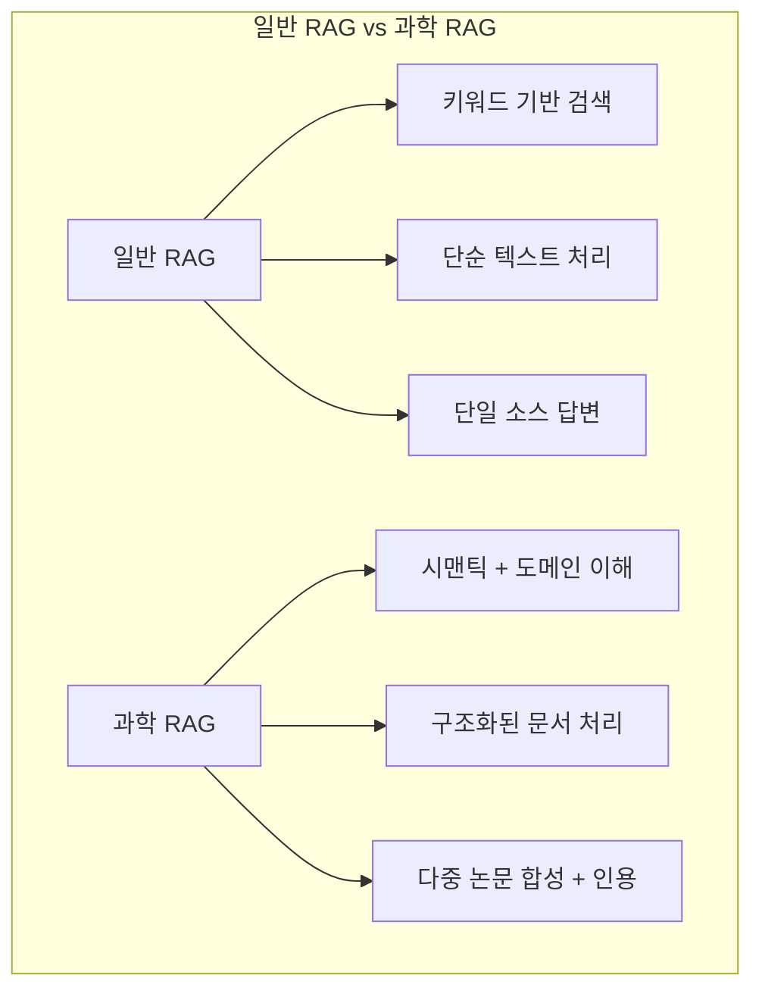
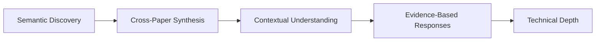
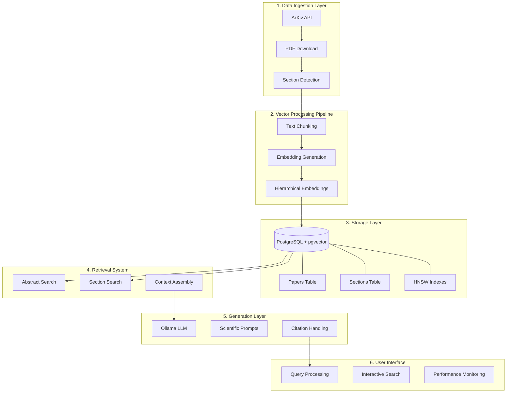
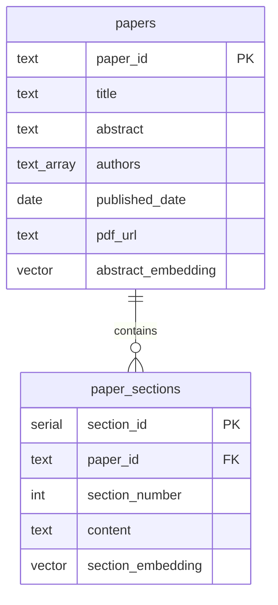
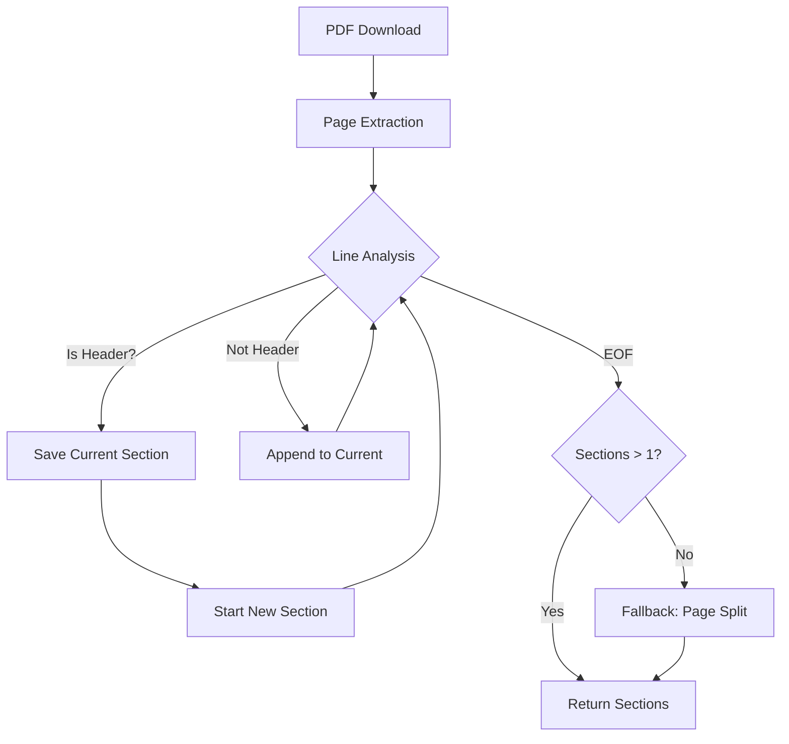
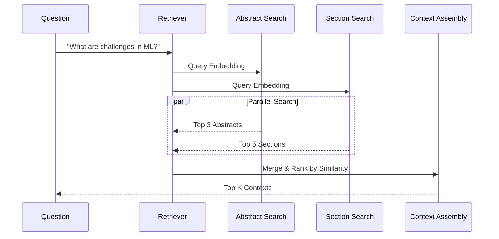

# Chapter 7: Building a Scientific RAG System with PostgreSQL and pgvector

## 📌 핵심 요약

> **"PostgreSQL과 pgvector를 활용하여 과학 문헌 전용 RAG 시스템을 구축한다. ArXiv API로 논문을 수집하고, PDF에서 섹션별 텍스트를 추출하며, 계층적 임베딩(초록/섹션)으로 다중 레벨 시맨틱 검색을 구현한다. HNSW 인덱스로 대규모 벡터 검색을 최적화하고, Ollama LLM으로 과학적 근거에 기반한 답변을 생성한다."**

이 챕터에서는 ArXiv 논문 15,000+/월이라는 과학 문헌 폭발 시대에 연구자들이 관련 지식을 효율적으로 발견하고 합성할 수 있는 과학 RAG 시스템을 구현한다.

---

## 🎯 학습 목표

이 챕터를 완료하면 다음을 할 수 있다:

- [ ] 과학 RAG의 고유한 도전과제 이해 (기술 용어, 구조화된 콘텐츠, 인용 네트워크)
- [ ] PostgreSQL + pgvector로 ACID 보장 벡터 데이터베이스 구축
- [ ] HNSW 인덱스로 대규모 근사 최근접 이웃 검색 최적화
- [ ] ArXiv API와 PDF 처리 파이프라인 구현
- [ ] 계층적 임베딩 (초록 레벨 + 섹션 레벨) 전략 적용
- [ ] 다중 레벨 시맨틱 검색 시스템 구현
- [ ] 과학 문헌 전용 프롬프트 엔지니어링

---

## 📖 본문 정리

### 7.1 과학 RAG의 고유한 도전과제



| 도전과제 | 설명 | 해결 전략 |
|----------|------|-----------|
| **기술 용어** | 도메인별 정밀 언어, 동일 개념의 다양한 표현 | 학술 텍스트 학습 임베딩 모델 |
| **구조화된 콘텐츠** | 초록, 방법론, 결과, 결론 등 섹션 구조 | 계층적 인덱싱 (초록/섹션) |
| **인용 네트워크** | 논문 간 참조 관계가 추가 맥락 제공 | 메타데이터 + 관계 추적 |
| **수학적 표기** | 수식과 방정식이 의미 전달 | 향후 LaTeX OCR 통합 |
| **증거 품질** | 피어 리뷰, 학술지, 인용 수 중요 | 메타데이터 기반 필터링 |

#### 시스템 목표



| 목표 | 설명 |
|------|------|
| **시맨틱 발견** | 키워드가 아닌 개념적 유사성으로 논문 발견 |
| **교차 논문 합성** | 여러 논문의 정보를 요구하는 질문에 답변 |
| **맥락적 이해** | 쿼리에 관련된 특정 섹션(방법론, 결과) 검색 |
| **증거 기반 응답** | 적절한 인용과 함께 실제 연구에 근거한 답변 |
| **기술적 깊이** | 도메인 전문성이 필요한 복잡한 과학 쿼리 처리 |

---

### 7.2 시스템 아키텍처 개요



#### 6가지 핵심 컴포넌트

| 컴포넌트 | 역할 | 기술 |
|----------|------|------|
| **Data Ingestion** | 논문 수집, PDF 처리, 섹션 감지 | ArXiv API, PyMuPDF |
| **Vector Processing** | 텍스트 → 벡터 변환, 계층적 임베딩 | SentenceTransformers |
| **Storage** | 메타데이터 + 벡터 저장, ACID 보장 | PostgreSQL + pgvector |
| **Retrieval** | 다중 레벨 검색, 컨텍스트 조립 | 코사인 유사도, HNSW |
| **Generation** | 과학적 답변 생성, 인용 처리 | Ollama (Llama 3.1) |
| **User Interface** | 쿼리 처리, 대화형 검색 | Python CLI |

---

### 7.3 데이터베이스 기반: PostgreSQL + pgvector

#### pgvector 확장 설정

```python
import psycopg2
import arxiv
import requests
import time
from sentence_transformers import SentenceTransformer
from typing import List, Dict, Optional
from dataclasses import dataclass
import numpy as np

def setup_database():
    """PostgreSQL with pgvector 설정"""
    DB_CONFIG = {
        'host': 'localhost',
        'port': '5432',
        'database': 'scientific_rag',
        'user': 'postgres',
        'password': 'password'
    }

    conn = psycopg2.connect(**DB_CONFIG)
    cursor = conn.cursor()

    # pgvector 확장 활성화
    cursor.execute("CREATE EXTENSION IF NOT EXISTS vector;")
```

**pgvector의 장점**:
- 벡터 연산이 데이터베이스 내부에서 수행 → 데이터 전송 오버헤드 감소
- ACID 트랜잭션 보장 → 데이터 일관성
- 관계형 쿼리와 벡터 검색 결합 가능

#### 스키마 설계

```python
    # 논문 테이블 (메타데이터 + 초록 임베딩)
    cursor.execute("""
        CREATE TABLE IF NOT EXISTS papers (
            paper_id TEXT PRIMARY KEY,
            title TEXT NOT NULL,
            abstract TEXT,
            authors TEXT[],           -- PostgreSQL 배열 타입
            published_date DATE,
            pdf_url TEXT,
            abstract_embedding vector(384)
        );
    """)

    # 섹션 테이블 (청크 + 섹션 임베딩)
    cursor.execute("""
        CREATE TABLE IF NOT EXISTS paper_sections (
            section_id SERIAL PRIMARY KEY,
            paper_id TEXT REFERENCES papers(paper_id),
            section_number INTEGER,
            content TEXT NOT NULL,
            section_embedding vector(384)
        );
    """)
```



#### HNSW 인덱스 생성

```python
    # 초록 임베딩 HNSW 인덱스
    cursor.execute("""
        CREATE INDEX IF NOT EXISTS idx_abstract_embeddings
        ON papers USING hnsw (abstract_embedding vector_cosine_ops);
    """)

    # 섹션 임베딩 HNSW 인덱스
    cursor.execute("""
        CREATE INDEX IF NOT EXISTS idx_section_embeddings
        ON paper_sections USING hnsw (section_embedding vector_cosine_ops);
    """)

    conn.commit()
    return DB_CONFIG
```

**HNSW (Hierarchical Navigable Small World)**:
- 근사 최근접 이웃(ANN) 검색 알고리즘
- 다층 그래프 구조로 로그 복잡도 검색
- 수백만 벡터에서도 밀리초 단위 검색

| 인덱스 타입 | 장점 | 단점 |
|-------------|------|------|
| **HNSW** | 빠른 검색, 높은 recall | 빌드 시간, 메모리 사용 |
| **IVFFlat** | 낮은 메모리, 빠른 빌드 | 상대적으로 낮은 recall |

---

### 7.4 임베딩 생성 전략

```python
# 전역 임베딩 모델 (싱글톤)
embedding_model = None

def get_embedding_model():
    """임베딩 모델 초기화 또는 반환"""
    global embedding_model
    if embedding_model is None:
        embedding_model = SentenceTransformer('all-MiniLM-L6-v2')
        print(f"Loaded embedding model (dimension: {embedding_model.get_sentence_embedding_dimension()})")
    return embedding_model

def generate_embedding(text):
    """텍스트 임베딩 생성"""
    model = get_embedding_model()
    return model.encode(text, convert_to_numpy=True)
```

| 특성 | 값 | 이유 |
|------|-----|------|
| **모델** | `all-MiniLM-L6-v2` | 학술 텍스트 쌍으로 학습됨 |
| **차원** | 384 | 의미적 풍부함과 계산 효율성 균형 |
| **싱글톤** | 전역 변수 | 모델 재로딩 방지로 성능 향상 |

---

### 7.5 ArXiv 통합 및 PDF 처리

#### 논문 발견

```python
@dataclass
class Paper:
    paper_id: str
    title: str
    abstract: str
    authors: List[str]
    published_date: str
    pdf_url: str

def fetch_arxiv_papers(query, max_results=5):
    """ArXiv에서 논문 가져오기"""
    print(f"Fetching papers from ArXiv: {query}")

    client = arxiv.Client()
    search = arxiv.Search(
        query=query,
        max_results=max_results,
        sort_by=arxiv.SortCriterion.SubmittedDate
    )

    papers = []
    for result in client.results(search):
        paper = Paper(
            paper_id=result.entry_id.split('/')[-1],
            title=result.title,
            abstract=result.summary,
            authors=[author.name for author in result.authors],
            published_date=result.published.date(),
            pdf_url=result.pdf_url
        )
        papers.append(paper)
        time.sleep(0.5)  # Rate limiting

    print(f"Retrieved {len(papers)} papers")
    return papers
```

**ArXiv 쿼리 문법**:
- `cat:cs.LG`: 카테고리 필터 (Machine Learning)
- `abs:"machine learning"`: 초록 검색
- `ti:"neural network"`: 제목 검색
- 불리언 연산: `AND`, `OR`, `ANDNOT`

#### PDF 텍스트 추출

```python
def download_pdf_text(pdf_url):
    """PyMuPDF를 사용한 PDF 텍스트 추출"""
    try:
        import fitz  # PyMuPDF

        # PDF 다운로드
        headers = {'User-Agent': 'Mozilla/5.0 (Macintosh; Intel Mac OS X 10_15_7)'}
        response = requests.get(pdf_url, headers=headers, timeout=30)

        if response.status_code != 200:
            return []

        # PDF 열기
        doc = fitz.open(stream=response.content, filetype="pdf")

        # 섹션별 텍스트 추출
        sections = []
        current_section = ""

        # 섹션 헤더 키워드
        section_headers = [
            'introduction', 'abstract', 'methodology', 'method',
            'results', 'discussion', 'conclusion', 'references',
            'related work', 'experiments', 'background', 'approach',
            'evaluation', 'analysis'
        ]

        for page_num in range(len(doc)):
            page = doc[page_num]
            text = page.get_text()
            lines = text.split('\n')

            for line in lines:
                line_lower = line.lower().strip()

                # 섹션 헤더 감지
                is_header = False
                for header in section_headers:
                    if (line_lower == header or
                        (len(line.split()) <= 3 and header in line_lower) or
                        line_lower.startswith(f"{header}.")):
                        is_header = True
                        break

                if is_header and current_section.strip():
                    sections.append(current_section.strip())
                    current_section = line + "\n"
                else:
                    current_section += line + "\n"

        # 마지막 섹션 추가
        if current_section.strip():
            sections.append(current_section.strip())

        # 섹션 감지 실패 시 페이지별 분할
        if len(sections) <= 1:
            sections = []
            for page_num in range(min(10, len(doc))):
                page = doc[page_num]
                text = page.get_text()
                if text.strip():
                    sections.append(text.strip())

        doc.close()

        # 100자 미만 섹션 필터링 (헤더/푸터 제거)
        filtered_sections = [s for s in sections if len(s) > 100]
        return filtered_sections[:20]

    except Exception as e:
        print(f"Error extracting PDF text: {e}")
        return []
```

#### 섹션 감지 흐름



---

### 7.6 텍스트 청킹

```python
def simple_chunk_text(text, chunk_size=500, overlap=50):
    """문자 수 기반 텍스트 청킹"""
    chunks = []
    words = text.split()

    current_chunk = []
    current_length = 0

    for word in words:
        word_length = len(word) + 1  # +1 for space

        if current_length + word_length > chunk_size and current_chunk:
            # 현재 청크 저장
            chunks.append(' '.join(current_chunk))

            # 중첩으로 새 청크 시작
            if overlap > 0:
                overlap_words = current_chunk[-overlap//10:]
                current_chunk = overlap_words
                current_length = sum(len(w) + 1 for w in overlap_words)
            else:
                current_chunk = []
                current_length = 0

        current_chunk.append(word)
        current_length += word_length

    # 마지막 청크 추가
    if current_chunk:
        chunks.append(' '.join(current_chunk))

    return chunks
```

| 파라미터 | 값 | 설명 |
|----------|-----|------|
| `chunk_size` | 500자 | 약 1 문단, 의미적 일관성 유지 |
| `overlap` | 50자 | 청크 경계 정보 손실 방지 |

---

### 7.7 저장 파이프라인

```python
def store_paper_with_embeddings(db_config, paper, sections):
    """논문과 섹션을 임베딩과 함께 저장"""
    conn = psycopg2.connect(**db_config)
    cursor = conn.cursor()

    try:
        # 초록 임베딩 생성
        abstract_embedding = generate_embedding(paper.abstract)

        # 논문 저장 (UPSERT)
        cursor.execute("""
            INSERT INTO papers (paper_id, title, abstract, authors,
                              published_date, pdf_url, abstract_embedding)
            VALUES (%s, %s, %s, %s, %s, %s, %s)
            ON CONFLICT (paper_id) DO UPDATE SET
                title = EXCLUDED.title,
                abstract = EXCLUDED.abstract,
                abstract_embedding = EXCLUDED.abstract_embedding
        """, (
            paper.paper_id,
            paper.title,
            paper.abstract,
            paper.authors,
            paper.published_date,
            paper.pdf_url,
            abstract_embedding.tolist()
        ))

        # 섹션별 저장
        for i, section_text in enumerate(sections):
            if section_text.strip():
                # 섹션 청킹
                chunks = simple_chunk_text(section_text)

                for j, chunk in enumerate(chunks):
                    section_embedding = generate_embedding(chunk)

                    cursor.execute("""
                        INSERT INTO paper_sections
                        (paper_id, section_number, content, section_embedding)
                        VALUES (%s, %s, %s, %s)
                    """, (
                        paper.paper_id,
                        i * 100 + j,  # 섹션 순서 + 청크 순서
                        chunk,
                        section_embedding.tolist()
                    ))

        conn.commit()
        print(f"Stored paper {paper.paper_id} with {len(sections)} sections")

    except Exception as e:
        conn.rollback()
        raise
    finally:
        cursor.close()
        conn.close()
```

**ON CONFLICT (UPSERT)**:
- 동일 `paper_id` 존재 시 업데이트
- 멱등성 보장 → 재처리 시 중복 방지

---

### 7.8 다중 레벨 시맨틱 검색

#### 초록 레벨 검색

```python
def search_papers_by_abstract(db_config, query, limit=5, threshold=0.7):
    """초록 유사도로 논문 검색"""
    conn = psycopg2.connect(**db_config)
    cursor = conn.cursor()

    query_embedding = generate_embedding(query)

    cursor.execute("""
        SELECT
            paper_id,
            title,
            abstract,
            authors,
            1 - (abstract_embedding <=> %s::vector) as similarity
        FROM papers
        WHERE abstract_embedding IS NOT NULL
          AND 1 - (abstract_embedding <=> %s::vector) > %s
        ORDER BY similarity DESC
        LIMIT %s
    """, (query_embedding.tolist(), query_embedding.tolist(), threshold, limit))

    results = cursor.fetchall()
    cursor.close()
    conn.close()

    return [{
        'paper_id': row[0],
        'title': row[1],
        'abstract': row[2],
        'authors': row[3],
        'similarity': row[4]
    } for row in results]
```

**용도**: 연구 환경 파악, 관련 논문 발견

#### 섹션 레벨 검색

```python
def search_paper_sections(db_config, query, limit=10, threshold=0.7):
    """섹션 유사도로 상세 내용 검색"""
    conn = psycopg2.connect(**db_config)
    cursor = conn.cursor()

    query_embedding = generate_embedding(query)

    cursor.execute("""
        SELECT
            ps.paper_id,
            p.title,
            ps.section_number,
            ps.content,
            1 - (ps.section_embedding <=> %s::vector) as similarity
        FROM paper_sections ps
        JOIN papers p ON ps.paper_id = p.paper_id
        WHERE ps.section_embedding IS NOT NULL
          AND 1 - (ps.section_embedding <=> %s::vector) > %s
        ORDER BY similarity DESC
        LIMIT %s
    """, (query_embedding.tolist(), query_embedding.tolist(), threshold, limit))

    results = cursor.fetchall()
    cursor.close()
    conn.close()

    return [{
        'paper_id': row[0],
        'title': row[1],
        'section_number': row[2],
        'content': row[3],
        'similarity': row[4]
    } for row in results]
```

**용도**: 특정 방법론, 결과, 기술적 세부사항 검색

#### pgvector 거리 연산자

| 연산자 | 의미 | 수식 |
|--------|------|------|
| `<=>` | 코사인 거리 | 1 - cos(a, b) |
| `<->` | 유클리드 거리 | √Σ(aᵢ - bᵢ)² |
| `<#>` | 내적 (음수) | -Σ(aᵢ × bᵢ) |

**`1 - (a <=> b)`**: 거리 → 유사도 변환 (0~1 스케일)

---

### 7.9 RAG 파이프라인

#### Ollama LLM 통합

```python
def call_ollama(prompt, model="llama3.1:8b"):
    """Ollama API 호출"""
    url = "http://localhost:11434/api/generate"

    payload = {
        "model": model,
        "prompt": prompt,
        "stream": False,
        "options": {
            "temperature": 0.1,  # 일관된 사실적 응답
            "top_p": 0.9
        }
    }

    try:
        response = requests.post(url, json=payload, timeout=60)
        response.raise_for_status()
        return response.json()['response']
    except Exception as e:
        return f"Error calling Ollama: {str(e)}"
```

#### 컨텍스트 검색

```python
def retrieve_relevant_contexts(db_config, question, max_contexts=5):
    """RAG용 관련 컨텍스트 검색"""
    # 초록 + 섹션 이중 검색
    abstract_results = search_papers_by_abstract(db_config, question, limit=3, threshold=0.6)
    section_results = search_paper_sections(db_config, question, limit=max_contexts, threshold=0.6)

    contexts = []

    # 초록 컨텍스트
    for result in abstract_results:
        contexts.append({
            'type': 'abstract',
            'paper_id': result['paper_id'],
            'title': result['title'],
            'content': result['abstract'],
            'similarity': result['similarity']
        })

    # 섹션 컨텍스트
    for result in section_results:
        contexts.append({
            'type': 'section',
            'paper_id': result['paper_id'],
            'title': result['title'],
            'content': result['content'],
            'similarity': result['similarity']
        })

    # 유사도 기준 정렬 후 상위 K개
    contexts.sort(key=lambda x: x['similarity'], reverse=True)
    return contexts[:max_contexts]
```



#### 과학 프롬프트 엔지니어링

```python
def format_scientific_rag_prompt(question, contexts):
    """과학 RAG용 프롬프트 포맷팅"""
    if not contexts:
        return f"Question: {question}\n\nI don't have relevant scientific literature to answer this question."

    context_parts = []
    for i, ctx in enumerate(contexts, 1):
        source_type = "Abstract" if ctx['type'] == 'abstract' else "Section"
        context_parts.append(
            f"Source {i} ({source_type} from '{ctx['title']}', similarity: {ctx['similarity']:.3f}):\n"
            f"{ctx['content'][:500]}..."
        )

    context_section = "\n\n".join(context_parts)

    prompt = f"""You are a scientific assistant helping researchers understand academic literature.
Answer the question based ONLY on the provided research paper excerpts.
Cite the specific papers when referencing information.

Question: {question}

Relevant research findings:
{context_section}

Answer based on the scientific literature above:"""

    return prompt
```

**프롬프트 설계 원칙**:

| 요소 | 목적 |
|------|------|
| **역할 설정** | "scientific assistant" → 적절한 톤과 전문성 |
| **제약 조건** | "ONLY on provided" → 환각 방지 |
| **인용 요청** | "Cite specific papers" → 학술적 엄밀성 |
| **유사도 점수** | 사용자가 관련성 평가 가능 |
| **소스 타입** | Abstract vs Section 구분 |

#### 완전한 RAG 실행

```python
def scientific_rag_answer(db_config, question, max_contexts=5):
    """과학 RAG 답변 생성"""
    print(f"\nScientific Question: {question}")

    # Step 1: 관련 컨텍스트 검색
    start_time = time.time()
    contexts = retrieve_relevant_contexts(db_config, question, max_contexts)
    retrieval_time = (time.time() - start_time) * 1000

    print(f"Retrieved {len(contexts)} contexts in {retrieval_time:.1f}ms")

    if not contexts:
        return "I couldn't find relevant scientific literature to answer this question."

    # 검색된 컨텍스트 표시
    for i, ctx in enumerate(contexts, 1):
        print(f"  {i}. {ctx['title'][:50]}... (similarity: {ctx['similarity']:.3f})")

    # Step 2: 프롬프트 구성
    prompt = format_scientific_rag_prompt(question, contexts)

    # Step 3: LLM 응답 생성
    start_time = time.time()
    answer = call_ollama(prompt)
    generation_time = (time.time() - start_time) * 1000

    print(f"Generated answer in {generation_time:.1f}ms")
    print(f"Total time: {retrieval_time + generation_time:.1f}ms")

    return {
        'answer': answer,
        'contexts': contexts,
        'stats': {
            'retrieval_time_ms': retrieval_time,
            'generation_time_ms': generation_time,
            'num_contexts': len(contexts)
        }
    }
```

---

### 7.10 확장 권장사항

#### PDF 처리 개선

| 기능 | 설명 |
|------|------|
| **수식 추출** | LaTeX OCR, MathML 추출 |
| **그림/표 분석** | 멀티모달 모델로 시각화 설명 |
| **인용 파싱** | 참조 추출 → 다중 홉 추론 |
| **구조화 추출** | ML 모델로 방법론/결과/기여 식별 |

#### 검색 향상


| 기법 | 설명 |
|------|------|
| **하이브리드 검색** | 벡터 + 키워드 + 인용 + 메타데이터 결합 |
| **쿼리 분해** | 복잡한 질문을 부분으로 나눠 검색 |
| **반복 정제** | LLM이 추가 검색 요청 가능 |
| **개념 연결** | 지식 그래프로 쿼리 확장 |

#### 성능 최적화

| 영역 | 기법 |
|------|------|
| **분산 처리** | PDF 처리/임베딩 병렬화 |
| **증분 업데이트** | 전체 재처리 없이 신규 논문 추가 |
| **캐싱** | 임베딩, 검색 결과, 답변 캐싱 |
| **인덱스 튜닝** | HNSW 파라미터 (M, ef_construction) 최적화 |

---

## 💡 실무 적용 포인트

### 프로젝트 구조

```
scientific_rag/
├── database/
│   └── setup_pgvector.py      # DB 초기화
├── ingestion/
│   ├── arxiv_client.py        # ArXiv API
│   └── pdf_processor.py       # PDF 처리
├── embeddings/
│   └── embedding_model.py     # 임베딩 생성
├── search/
│   ├── abstract_search.py     # 초록 검색
│   └── section_search.py      # 섹션 검색
├── rag/
│   ├── context_retriever.py   # 컨텍스트 검색
│   ├── prompt_formatter.py    # 프롬프트 생성
│   └── ollama_client.py       # LLM 통합
└── main.py                    # 엔트리포인트
```

### 핵심 파라미터 요약

| 파라미터 | 값 | 설명 |
|----------|-----|------|
| `embedding_dim` | 384 | all-MiniLM-L6-v2 출력 차원 |
| `chunk_size` | 500자 | 텍스트 청크 크기 |
| `overlap` | 50자 | 청크 간 중첩 |
| `threshold` | 0.6-0.7 | 유사도 필터 임계값 |
| `max_contexts` | 5 | RAG 컨텍스트 수 |
| `temperature` | 0.1 | LLM 생성 온도 |

### 성능 기대치

| 단계 | 시간 | 비고 |
|------|------|------|
| **검색** | 50-200ms | HNSW 인덱스 사용 시 |
| **생성** | 500-5000ms | 답변 길이에 따라 변동 |
| **PDF 처리** | 5-30초 | 논문 길이에 따라 변동 |

### PostgreSQL vs 전용 벡터 DB

| 특성 | PostgreSQL + pgvector | 전용 벡터 DB |
|------|----------------------|--------------|
| **트랜잭션** | ACID 보장 | 제한적 |
| **관계형 쿼리** | 완전 지원 | 제한적 |
| **운영 복잡도** | 단일 DB | 추가 인프라 |
| **확장성** | ~100만 문서 | 수십억 문서 |
| **학습 곡선** | SQL 친숙 | 새로운 API |

---

## ✅ 핵심 개념 체크리스트

- [ ] 과학 RAG의 5가지 도전과제 (기술 용어, 구조화 콘텐츠, 인용, 수식, 증거 품질)
- [ ] PostgreSQL + pgvector로 ACID 보장 벡터 저장소 구축
- [ ] HNSW 인덱스로 ANN 검색 최적화 (`vector_cosine_ops`)
- [ ] `<=>` 연산자: 코사인 거리, `1 - distance` = 유사도
- [ ] ArXiv API로 논문 메타데이터 수집 (카테고리, 초록 검색)
- [ ] PyMuPDF로 PDF 텍스트 추출 및 섹션 감지
- [ ] 계층적 임베딩: 초록 레벨 + 섹션 레벨
- [ ] 다중 레벨 검색: 광범위(초록) + 상세(섹션)
- [ ] 과학 프롬프트 설계: 역할 + 제약 + 인용 요청
- [ ] ON CONFLICT (UPSERT)로 멱등성 보장

---

## 🔗 참고 자료

- [pgvector GitHub](https://github.com/pgvector/pgvector)
- [ArXiv API](https://arxiv.org/help/api)
- [PyMuPDF (fitz)](https://pymupdf.readthedocs.io/)
- [SentenceTransformers](https://www.sbert.net/)
- [Ollama](https://ollama.ai/)
- [HNSW Algorithm](https://arxiv.org/abs/1603.09320)

---

## 📚 다음 챕터 미리보기

- **Chapter 8**: 멀티모달 벡터 검색 및 이미지-텍스트 통합
