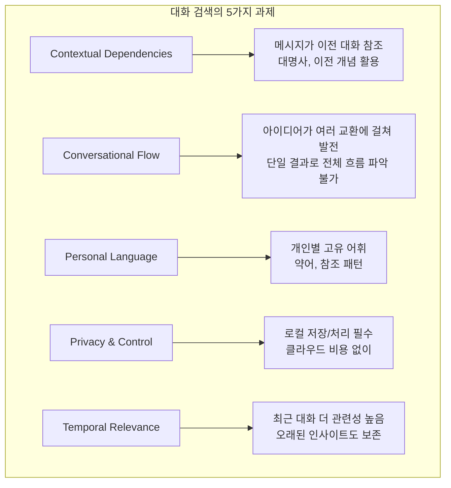
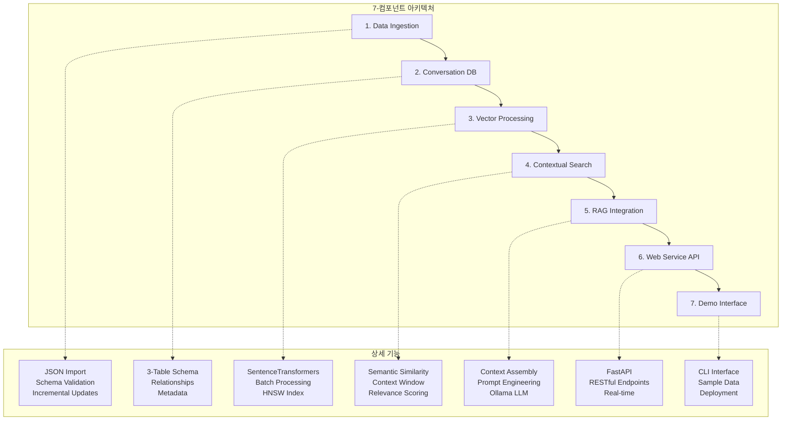
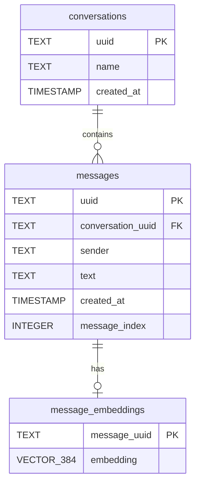
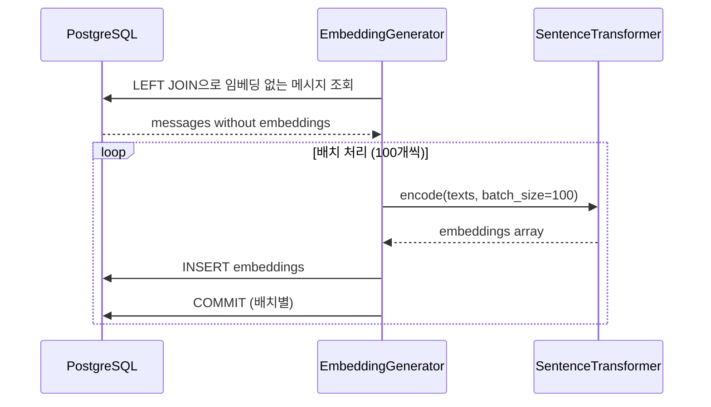
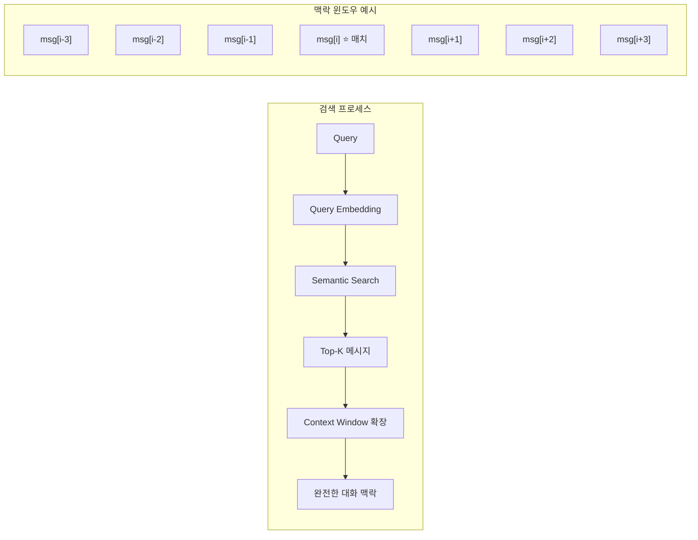
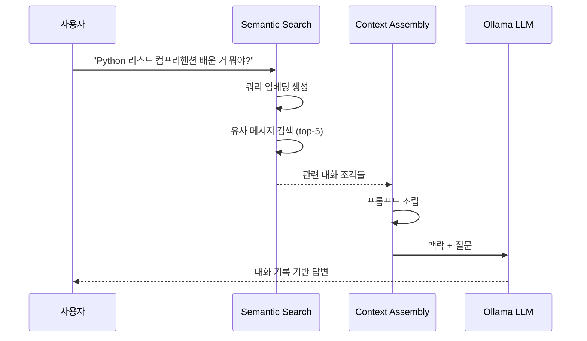
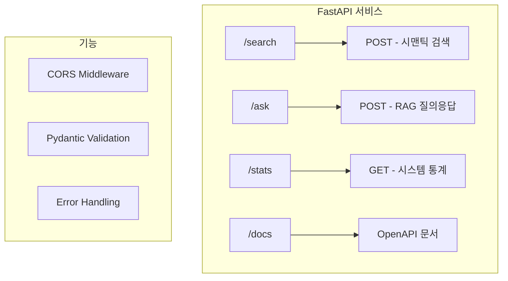
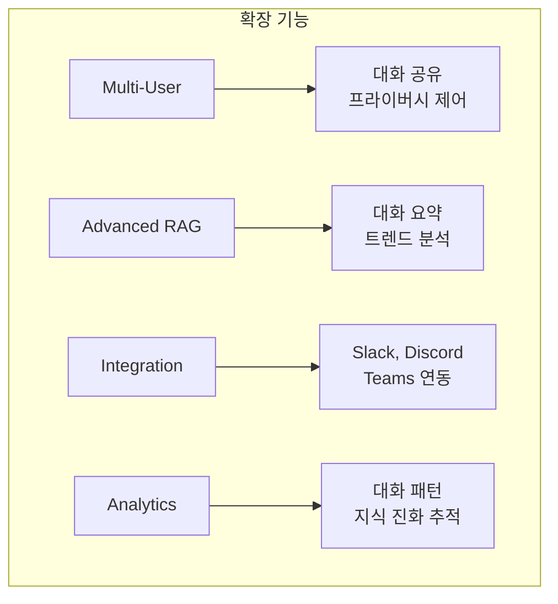

# Chapter 8: 대화 검색 및 RAG 시스템 구축 (Building a Complete Conversation Search and RAG System)

## 📌 핵심 요약

> **"PostgreSQL + pgvector로 개인 AI 대화 기록을 검색 가능한 지식 베이스로 변환한다. 3-테이블 스키마(conversations, messages, message_embeddings)로 대화 구조를 보존하고, HNSW 인덱스로 빠른 유사도 검색을 수행하며, FastAPI로 웹 서비스 API를 제공한다. 대화 맥락(context window)을 유지하면서 Ollama 로컬 LLM으로 개인정보를 보호하는 RAG 파이프라인을 구축한다."**

이 챕터에서는 Claude와 같은 AI 어시스턴트와의 대화 기록을 검색하고 RAG로 활용하는 완전한 시스템을 구축한다.

---

## 🎯 학습 목표

이 챕터를 완료하면 다음을 할 수 있다:

- [ ] 대화 데이터의 고유한 검색 과제 이해
- [ ] 3-테이블 스키마로 대화 구조 저장
- [ ] JSON 대화 내보내기 파일 임포트 처리
- [ ] 배치 처리로 대규모 임베딩 생성
- [ ] 맥락 윈도우(Context Window) 검색 구현
- [ ] 대화 기반 RAG 파이프라인 구축
- [ ] FastAPI로 웹 서비스 API 제공
- [ ] 개인정보 보호 로컬 LLM 통합

---

## 📖 본문 정리

### 8.1 대화 검색의 고유한 과제



| 과제 | 설명 | 해결 방법 |
|------|------|-----------|
| **맥락 의존성** | "그 방법이 잘 작동해요"는 맥락 없이 무의미 | Context Window 검색 |
| **대화 흐름** | 아이디어가 여러 메시지에 걸쳐 발전 | 메시지 순서 보존 |
| **개인 언어 패턴** | 사용자별 고유 표현 방식 | 의미론적 검색 |
| **프라이버시** | 개인 대화 데이터 보호 | 로컬 저장/처리 |
| **시간적 관련성** | 최근 vs 오래된 인사이트 균형 | 타임스탬프 메타데이터 |

---

### 8.2 시스템 아키텍처 개요



---

### 8.3 데이터베이스 스키마 설계

#### 3-테이블 아키텍처



#### 테이블 분리의 장점

| 장점 | 설명 |
|------|------|
| **Lazy Loading** | 임베딩 없이 메시지 먼저 임포트 가능 |
| **Embedding Updates** | 새 모델 배포 시 메시지 데이터 유지 |
| **Storage Optimization** | 벡터 데이터가 메인 테이블 부풀리지 않음 |
| **Query Performance** | 벡터 연산과 텍스트 쿼리 분리 |

#### 데이터베이스 설정 코드

```python
def setup_database():
    """PostgreSQL + pgvector 설정"""
    DB_CONFIG = {
        'host': 'localhost',
        'port': '5432',
        'database': 'claude_conversations',
        'user': 'postgres',
        'password': 'password'
    }

    conn = psycopg2.connect(**DB_CONFIG)
    cursor = conn.cursor()

    # pgvector 확장 활성화
    cursor.execute("CREATE EXTENSION IF NOT EXISTS vector;")

    # 대화 테이블
    cursor.execute("""
        CREATE TABLE IF NOT EXISTS conversations (
            uuid TEXT PRIMARY KEY,
            name TEXT NOT NULL,
            created_at TIMESTAMP DEFAULT CURRENT_TIMESTAMP
        );
    """)

    # 메시지 테이블 - message_index로 순서 보존
    cursor.execute("""
        CREATE TABLE IF NOT EXISTS messages (
            uuid TEXT PRIMARY KEY,
            conversation_uuid TEXT REFERENCES conversations(uuid),
            sender TEXT NOT NULL,
            text TEXT NOT NULL,
            created_at TIMESTAMP DEFAULT CURRENT_TIMESTAMP,
            message_index INTEGER
        );
    """)

    # 임베딩 테이블 - 384차원 벡터
    cursor.execute("""
        CREATE TABLE IF NOT EXISTS message_embeddings (
            message_uuid TEXT PRIMARY KEY REFERENCES messages(uuid),
            embedding vector(384) NOT NULL
        );
    """)

    # HNSW 인덱스 - 빠른 유사도 검색
    cursor.execute("""
        CREATE INDEX IF NOT EXISTS idx_message_embeddings_vector
        ON message_embeddings
        USING hnsw (embedding vector_cosine_ops);
    """)

    conn.commit()
    return DB_CONFIG
```

**핵심 포인트**:
- `message_index`: 대화 내 메시지 순서 보존 (맥락 윈도우 검색에 필수)
- `vector(384)`: all-MiniLM-L6-v2 모델의 임베딩 차원
- `hnsw (embedding vector_cosine_ops)`: 코사인 유사도 최적화 인덱스

---

### 8.4 대화 임포트 및 데이터 처리

#### JSON 임포트 처리

```python
def import_conversations(db_config, conversations_file):
    """Claude 대화 내보내기 JSON 임포트"""
    with open(conversations_file, 'r') as f:
        data = json.load(f)

    conversations = data.get('conversations', [])
    total_conversations = 0
    total_messages = 0

    for conv in conversations:
        try:
            # 대화 삽입 - UPSERT로 중복 방지
            cursor.execute("""
                INSERT INTO conversations (uuid, name, created_at)
                VALUES (%s, %s, %s)
                ON CONFLICT (uuid) DO NOTHING
            """, (
                conv['uuid'],
                conv['name'],
                datetime.fromisoformat(conv['created_at'].replace('Z', '+00:00'))
            ))

            # 메시지 삽입 - enumerate로 순서 인덱스 생성
            for idx, msg in enumerate(conv.get('messages', [])):
                cursor.execute("""
                    INSERT INTO messages (uuid, conversation_uuid, sender, text, created_at, message_index)
                    VALUES (%s, %s, %s, %s, %s, %s)
                    ON CONFLICT (uuid) DO NOTHING
                """, (msg['uuid'], conv['uuid'], msg['sender'], msg['text'],
                      datetime.fromisoformat(msg['created_at'].replace('Z', '+00:00')), idx))

            conn.commit()

        except Exception as e:
            print(f"Error: {conv.get('uuid', 'unknown')}: {e}")
            conn.rollback()  # 트랜잭션 롤백 후 계속
            continue

    return total_conversations, total_messages
```

**핵심 패턴**:
- `ON CONFLICT DO NOTHING`: 멱등성 보장 (동일 파일 재처리 가능)
- `.replace('Z', '+00:00')`: ISO 타임스탬프 'Z' UTC 처리
- `enumerate()`: 메시지 순서 인덱스 자동 생성
- 대화별 트랜잭션: 오류 시 해당 대화만 롤백

---

### 8.5 배치 임베딩 생성



#### 증분 처리 전략

```python
# 싱글톤 패턴 - 모델 재사용
embedding_model = None

def get_embedding_model():
    """임베딩 모델 초기화 (싱글톤)"""
    global embedding_model
    if embedding_model is None:
        embedding_model = SentenceTransformer('all-MiniLM-L6-v2')
        print(f"Loaded model (dimension: {embedding_model.get_sentence_embedding_dimension()})")
    return embedding_model

def generate_message_embeddings(db_config, batch_size=100):
    """임베딩 없는 메시지만 처리 (증분 업데이트)"""
    # LEFT JOIN으로 임베딩 없는 메시지 찾기
    cursor.execute("""
        SELECT m.uuid, m.text
        FROM messages m
        LEFT JOIN message_embeddings me ON m.uuid = me.message_uuid
        WHERE me.message_uuid IS NULL
        ORDER BY m.created_at
    """)

    messages = cursor.fetchall()
    model = get_embedding_model()

    # 배치 처리
    for i in range(0, len(messages), batch_size):
        batch = messages[i:i + batch_size]
        uuids = [msg[0] for msg in batch]
        texts = [msg[1] for msg in batch]

        # 배치 인코딩 - 개별 인코딩보다 훨씬 빠름
        embeddings = model.encode(texts, convert_to_numpy=True)

        for uuid, embedding in zip(uuids, embeddings):
            cursor.execute("""
                INSERT INTO message_embeddings (message_uuid, embedding)
                VALUES (%s, %s)
                ON CONFLICT (message_uuid) DO NOTHING
            """, (uuid, embedding.tolist()))

        conn.commit()  # 배치별 커밋

        if i % (batch_size * 5) == 0:
            print(f"Generated {i + len(batch)} embeddings...")
```

**배치 처리 장점**:
- 모델 오버헤드 분산 (개별 인코딩 대비 10배 이상 빠름)
- 메모리 사용량 제어 (batch_size=100)
- 진행 상황 피드백 (5배치마다 출력)
- 증분 처리 (새 대화 추가 시 기존 임베딩 재생성 불필요)

---

### 8.6 맥락 윈도우 검색 (Contextual Search)



#### 의미론적 검색

```python
def search_messages(db_config, query, limit=10, threshold=0.7):
    """시맨틱 유사도 기반 메시지 검색"""
    model = get_embedding_model()
    query_embedding = model.encode([query])[0]

    # 3-테이블 JOIN으로 풍부한 컨텍스트 반환
    cursor.execute("""
        SELECT
            m.uuid,
            m.text,
            m.sender,
            m.created_at,
            c.name as conversation_name,
            1 - (me.embedding <=> %s::vector) as similarity
        FROM message_embeddings me
        JOIN messages m ON me.message_uuid = m.uuid
        JOIN conversations c ON m.conversation_uuid = c.uuid
        WHERE 1 - (me.embedding <=> %s::vector) > %s
        ORDER BY similarity DESC
        LIMIT %s
    """, (query_embedding.tolist(), query_embedding.tolist(), threshold, limit))

    return [{'message_uuid': r[0], 'text': r[1], 'sender': r[2],
             'created_at': r[3], 'conversation_name': r[4], 'similarity': r[5]}
            for r in cursor.fetchall()]
```

#### 맥락 윈도우 검색

```python
def get_message_context(db_config, message_uuid, context_size=3):
    """메시지 주변 맥락 검색 (앞뒤 3개씩)"""
    # 대상 메시지 위치 정보 조회
    cursor.execute("""
        SELECT conversation_uuid, message_index, text, sender
        FROM messages WHERE uuid = %s
    """, (message_uuid,))

    target = cursor.fetchone()
    conv_uuid, target_index, target_text, target_sender = target

    # 주변 메시지 조회 (message_index 기반)
    cursor.execute("""
        SELECT uuid, text, sender, message_index, created_at
        FROM messages
        WHERE conversation_uuid = %s
          AND message_index >= %s
          AND message_index <= %s
        ORDER BY message_index
    """, (conv_uuid, target_index - context_size, target_index + context_size))

    return {
        'target_message_uuid': message_uuid,
        'conversation_uuid': conv_uuid,
        'context_messages': [{
            'uuid': msg[0], 'text': msg[1], 'sender': msg[2],
            'message_index': msg[3], 'created_at': msg[4],
            'is_target': msg[0] == message_uuid  # 매칭된 메시지 표시
        } for msg in cursor.fetchall()]
    }
```

**맥락 윈도우의 중요성**:
- `context_size=3`: 앞뒤 3개씩 = 총 7개 메시지
- `is_target` 플래그: 어떤 메시지가 실제 검색 매칭인지 표시
- `message_index` 기반: 대화 순서 정확히 유지

---

### 8.7 대화 기반 RAG 파이프라인



#### 로컬 LLM 통합 (Ollama)

```python
def call_ollama(prompt, model="llama3.1:8b"):
    """Ollama API 호출 - 프라이버시 보호"""
    payload = {
        "model": model,
        "prompt": prompt,
        "stream": False,
        "options": {
            "temperature": 0.1,  # 낮은 temperature = 사실 기반 응답
            "top_p": 0.9
        }
    }

    response = requests.post("http://localhost:11434/api/generate",
                            json=payload, timeout=30)
    return response.json()['response']

def test_ollama():
    """Ollama 상태 확인"""
    response = requests.get("http://localhost:11434/api/tags", timeout=5)
    models = response.json()
    print("Available models:", [m['name'] for m in models.get('models', [])])
    return True
```

#### 대화 맥락용 프롬프트 엔지니어링

```python
@dataclass
class Context:
    text: str
    conversation_name: str
    sender: str
    similarity: float

def format_rag_prompt(question, contexts):
    """대화 기록용 RAG 프롬프트"""
    if not contexts:
        return f"Question: {question}\n\nI don't have any relevant information."

    context_parts = []
    for i, ctx in enumerate(contexts, 1):
        context_parts.append(
            f"Context {i} (from '{ctx.conversation_name}' - {ctx.sender}, "
            f"similarity: {ctx.similarity:.3f}):\n{ctx.text}"
        )

    context_section = "\n\n".join(context_parts)

    prompt = f"""You are a helpful assistant answering questions based on
the user's conversation history with Claude.
Use ONLY the information provided in the contexts below to answer the question.
If the answer cannot be found in the contexts, say so clearly.

Question: {question}

Relevant contexts from your conversations:
{context_section}

Answer based on the above contexts:"""

    return prompt
```

**프롬프트 설계 요소**:
- 출처 명시: 대화명, 발신자, 유사도 점수
- 제약 조건: "ONLY the information provided" - 환각 방지
- 개인 맥락: "your conversation history with Claude"

#### 완전한 RAG 파이프라인

```python
def answer_question(db_config, question, max_contexts=5, threshold=0.7):
    """전체 RAG 파이프라인"""
    print(f"\nQuestion: {question}")

    # Step 1: 관련 맥락 검색
    start_time = time.time()
    results = search_messages(db_config, question, limit=max_contexts, threshold=threshold)
    contexts = [Context(text=r['text'], conversation_name=r['conversation_name'],
                       sender=r['sender'], similarity=r['similarity']) for r in results]
    retrieval_time = (time.time() - start_time) * 1000

    print(f"Retrieved {len(contexts)} contexts in {retrieval_time:.1f}ms")

    if not contexts:
        return "I couldn't find any relevant information in your conversation history."

    # Step 2: 프롬프트 포맷팅
    prompt = format_rag_prompt(question, contexts)

    # Step 3: 답변 생성
    start_time = time.time()
    answer = call_ollama(prompt)
    generation_time = (time.time() - start_time) * 1000

    print(f"Generated answer in {generation_time:.1f}ms")

    return {
        'answer': answer,
        'contexts': contexts,
        'stats': {
            'retrieval_time_ms': retrieval_time,
            'generation_time_ms': generation_time,
            'num_contexts': len(contexts)
        }
    }
```

---

### 8.8 FastAPI 웹 서비스



#### API 엔드포인트 구현

```python
from fastapi import FastAPI, HTTPException
from fastapi.middleware.cors import CORSMiddleware
from pydantic import BaseModel

app = FastAPI(title="Claude Conversation Search", version="1.0.0")

# CORS 설정 (웹 브라우저 접근 허용)
app.add_middleware(
    CORSMiddleware,
    allow_origins=["*"],  # 프로덕션에서는 제한 필요
    allow_methods=["*"],
    allow_headers=["*"],
)

# 요청 모델 (자동 유효성 검사)
class SearchRequest(BaseModel):
    query: str
    limit: int = 10
    threshold: float = 0.7

class RAGRequest(BaseModel):
    question: str
    max_contexts: int = 5
    threshold: float = 0.7

@app.post("/search")
async def search_endpoint(request: SearchRequest):
    """시맨틱 메시지 검색"""
    try:
        results = search_messages(DB_CONFIG, request.query,
                                  request.limit, request.threshold)
        return {"results": results}
    except Exception as e:
        raise HTTPException(status_code=500, detail=str(e))

@app.post("/ask")
async def ask_endpoint(request: RAGRequest):
    """RAG 질의응답"""
    try:
        result = answer_question(DB_CONFIG, request.question,
                                request.max_contexts, request.threshold)
        return result
    except Exception as e:
        raise HTTPException(status_code=500, detail=str(e))

@app.get("/stats")
async def stats_endpoint():
    """시스템 통계"""
    cursor.execute("SELECT COUNT(*) FROM conversations")
    total_conversations = cursor.fetchone()[0]

    cursor.execute("SELECT COUNT(*) FROM messages")
    total_messages = cursor.fetchone()[0]

    cursor.execute("SELECT COUNT(*) FROM message_embeddings")
    total_embeddings = cursor.fetchone()[0]

    return {
        "total_conversations": total_conversations,
        "total_messages": total_messages,
        "total_embeddings": total_embeddings,
        "embedding_coverage": f"{(total_embeddings/total_messages)*100:.1f}%"
    }

def start_api(db_config):
    """서버 시작"""
    global DB_CONFIG
    DB_CONFIG = db_config

    import uvicorn
    print("API docs: http://localhost:8000/docs")
    uvicorn.run(app, host="0.0.0.0", port=8000, log_level="info")
```

---

### 8.9 샘플 데이터 및 데모

#### 현실적인 테스트 데이터

```python
def create_sample_data(db_config):
    """테스트용 샘플 대화 데이터"""
    sample_conversations = [
        {
            "uuid": "conv_001",
            "name": "Python Learning Discussion",
            "created_at": "2024-01-15T10:00:00Z",
            "messages": [
                {"uuid": "msg_001", "sender": "Human",
                 "text": "I'm learning Python and struggling with list comprehensions.",
                 "created_at": "2024-01-15T10:00:00Z"},
                {"uuid": "msg_002", "sender": "Assistant",
                 "text": "List comprehensions are a concise way to create lists. "
                         "The basic syntax is [expression for item in iterable].",
                 "created_at": "2024-01-15T10:01:00Z"},
                {"uuid": "msg_003", "sender": "Human",
                 "text": "What about filtering with conditions?",
                 "created_at": "2024-01-15T10:02:00Z"},
                {"uuid": "msg_004", "sender": "Assistant",
                 "text": "You can add conditions with 'if'. Example: "
                         "[x**2 for x in range(10) if x % 2 == 0]",
                 "created_at": "2024-01-15T10:03:00Z"}
            ]
        },
        {
            "uuid": "conv_002",
            "name": "Machine Learning Concepts",
            "created_at": "2024-01-16T14:00:00Z",
            "messages": [
                {"uuid": "msg_005", "sender": "Human",
                 "text": "Explain supervised vs unsupervised learning",
                 "created_at": "2024-01-16T14:00:00Z"},
                {"uuid": "msg_006", "sender": "Assistant",
                 "text": "Supervised uses labeled data. Unsupervised finds patterns without labels.",
                 "created_at": "2024-01-16T14:01:00Z"}
            ]
        }
    ]

    # 표준 임포트 파이프라인 사용
    sample_data = {"conversations": sample_conversations}
    with tempfile.NamedTemporaryFile(mode='w', suffix='.json', delete=False) as f:
        json.dump(sample_data, f)
        temp_file = f.name

    import_conversations(db_config, temp_file)
    Path(temp_file).unlink()  # 정리
```

#### 메인 데모 함수

```python
def main():
    """전체 시스템 데모"""
    print("=== Claude Conversation Search & RAG System ===\n")

    # 1. 데이터베이스 설정
    db_config = setup_database()

    # 2. 데이터 확인/생성
    cursor.execute("SELECT COUNT(*) FROM messages")
    if cursor.fetchone()[0] == 0:
        create_sample_data(db_config)

    # 3. 임베딩 생성
    generate_message_embeddings(db_config)

    # 4. Ollama 확인
    ollama_available = test_ollama()

    # 5. 검색 데모
    query = "Python programming help"
    results = search_messages(db_config, query, limit=3)
    for r in results:
        print(f"Similarity: {r['similarity']:.3f} | {r['conversation_name']}")

    # 6. RAG 데모
    if ollama_available:
        question = "What did I learn about Python list comprehensions?"
        result = answer_question(db_config, question)
        print(f"Answer: {result['answer'][:200]}...")

    # 7. API 서버 시작 옵션
    if input("Start API server? (y/n): ").lower().startswith('y'):
        start_api(db_config)

if __name__ == "__main__":
    import sys
    if len(sys.argv) > 1 and sys.argv[1] == "import":
        import_from_file()  # 실제 파일 임포트 모드
    else:
        main()  # 데모 모드
```

---

## 💡 실무 적용 포인트

### 시스템 성능 특성

| 지표 | 성능 | 조건 |
|------|------|------|
| **검색 응답** | < 100ms | HNSW 인덱스, 수만 개 메시지 |
| **임베딩 생성** | ~1,000 msg/분 | batch_size=100 |
| **API 응답** | 실시간 | 인터랙티브 사용 가능 |
| **증분 업데이트** | 지원 | 기존 임베딩 유지 |

### 디렉토리 구조

```
conversation_rag/
├── conversation_rag.py     # 메인 시스템 코드
├── conversations.json      # Claude 대화 내보내기
├── requirements.txt        # 의존성
└── README.md
```

### 의존성

```
psycopg2-binary>=2.9.0
sentence-transformers>=2.2.0
fastapi>=0.100.0
uvicorn>=0.22.0
requests>=2.28.0
```

### 핵심 API 요약

| API | 역할 |
|-----|------|
| `setup_database()` | PostgreSQL + pgvector 초기화 |
| `import_conversations()` | JSON 대화 파일 임포트 |
| `generate_message_embeddings()` | 배치 임베딩 생성 |
| `search_messages()` | 시맨틱 메시지 검색 |
| `get_message_context()` | 맥락 윈도우 검색 |
| `answer_question()` | RAG 질의응답 |
| `start_api()` | FastAPI 서버 시작 |

### 확장 가능성



---

## ✅ 핵심 개념 체크리스트

- [ ] 대화 검색의 5가지 고유 과제 (맥락 의존성, 흐름, 개인 언어, 프라이버시, 시간)
- [ ] 3-테이블 스키마 설계 (conversations, messages, message_embeddings 분리)
- [ ] `message_index`로 대화 순서 보존
- [ ] `ON CONFLICT DO NOTHING`으로 멱등성 임포트
- [ ] 배치 임베딩 생성 (batch_size=100, 배치별 커밋)
- [ ] 증분 처리 (LEFT JOIN으로 임베딩 없는 메시지만 처리)
- [ ] 맥락 윈도우 검색 (context_size=3, is_target 플래그)
- [ ] 대화용 RAG 프롬프트 (출처 명시, 제약 조건)
- [ ] FastAPI 웹 서비스 (/search, /ask, /stats)
- [ ] 로컬 LLM (Ollama, temperature=0.1)

---

## 🔗 참고 자료

- [PostgreSQL pgvector](https://github.com/pgvector/pgvector)
- [SentenceTransformers](https://www.sbert.net/)
- [FastAPI Documentation](https://fastapi.tiangolo.com/)
- [Ollama](https://ollama.ai/)

---

## 📚 다음 챕터 미리보기

- **Chapter 9**: 추가 벡터 데이터베이스 기술 및 고급 패턴
