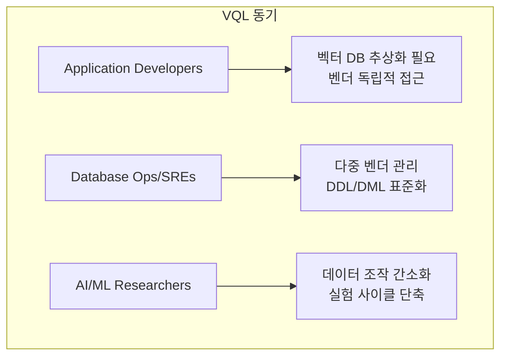
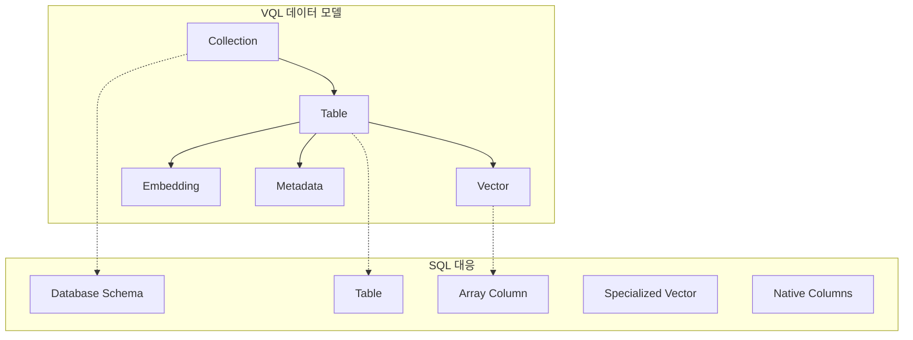
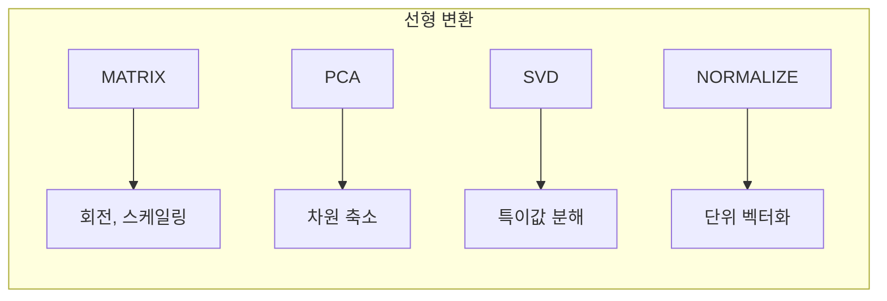
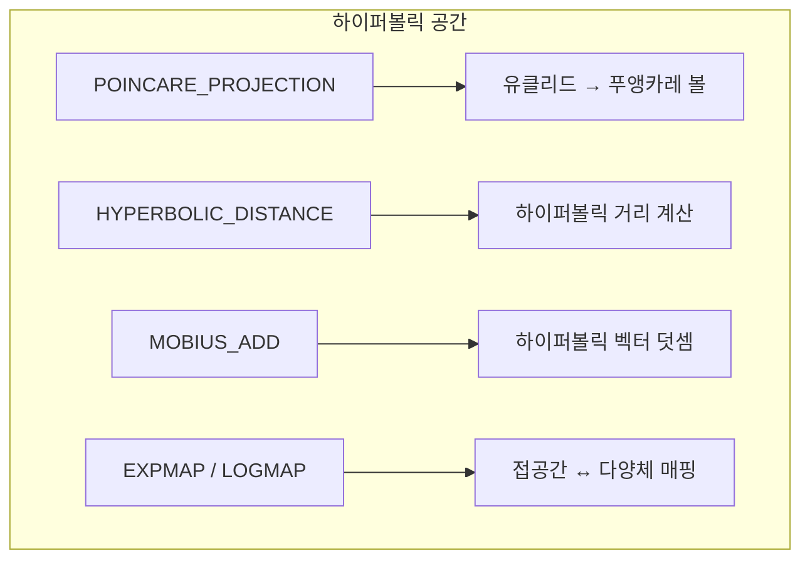
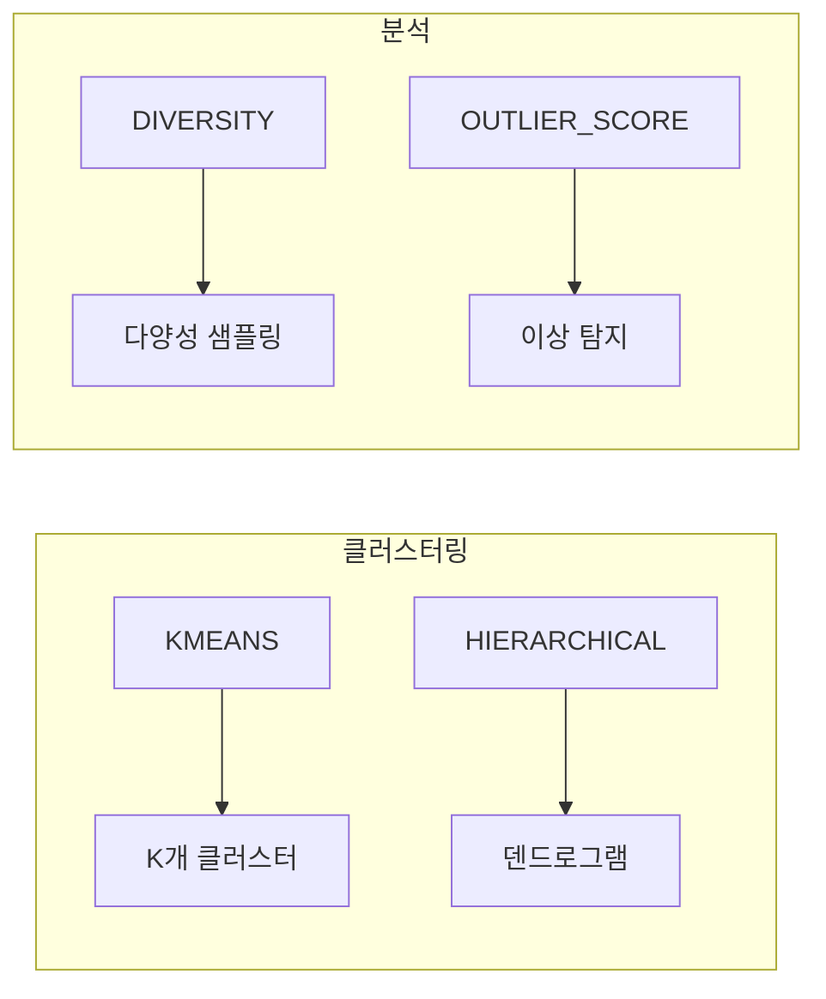
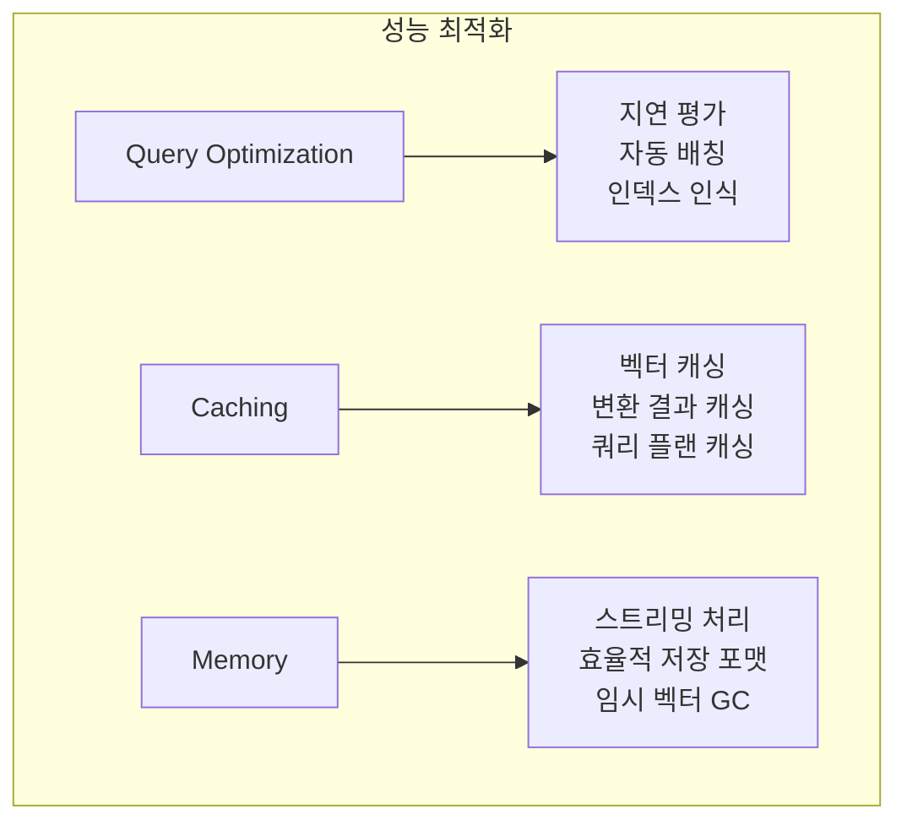

# Chapter 9: Vector Query Language (VQL) — 초안 명세 (Draft Specification)

## 📌 핵심 요약

> **"VQL은 SQL 문법과 벡터 연산을 결합한 벡터 데이터베이스 전용 쿼리 언어이다. SIMILARITY SEARCH, HYBRID SEARCH, RANGE SEARCH 등 벡터 검색 연산과 PCA, UMAP, 푸앵카레 투영(Poincaré Projection) 등 선형/비선형 변환을 지원한다. Collection.Table 구조로 데이터를 조직하고, HNSW/IVFFlat 인덱스를 관리하며, 클러스터링, 이상 탐지, 하이퍼볼릭 공간 연산까지 SQL-like 문법으로 제공한다."**

이 챕터에서는 벡터 데이터베이스를 위한 표준화된 쿼리 언어 VQL의 설계 명세를 학습한다.

---

## 🎯 학습 목표

이 챕터를 완료하면 다음을 할 수 있다:

- [ ] VQL의 동기와 대상 사용자 이해
- [ ] 벡터 검색 연산 (Similarity, Hybrid, Range, Batch) 작성
- [ ] 선형 변환 (PCA, Random Projection, SVD) 적용
- [ ] 비선형 변환 (하이퍼볼릭, 매니폴드 학습) 활용
- [ ] 벡터 함수와 집계 연산 사용
- [ ] 클러스터링과 분석 쿼리 작성
- [ ] 벡터 인덱스 생성 및 최적화
- [ ] 타입 시스템과 오류 처리 이해

---

## 📖 본문 정리

### 9.1 VQL 동기 및 대상 사용자



| 대상 사용자 | 현재 문제점 | VQL 솔루션 |
|-------------|-------------|------------|
| **앱 개발자** | 벤더별 구현에 종속됨 | 공통 추상화 레이어 |
| **DevOps/SRE** | 벤더별 DDL/DML 문법 차이 | 표준화된 스크립트 |
| **AI/ML 연구자** | 데이터 조작용 프로그램 작성 필요 | VQL 매크로 언어로 간소화 |

---

### 9.2 핵심 개념

#### 데이터 모델



| VQL 개념 | 설명 | SQL 대응 |
|----------|------|----------|
| **Collection** | 벡터 데이터의 최상위 컨테이너 | Database Schema |
| **Table** | 메타데이터와 연관된 벡터 집합 | Table |
| **Vector** | 고정 차원의 숫자 배열 | Array Column |
| **Embedding** | 엔티티를 인코딩한 특수 벡터 | Specialized Vector |
| **Metadata** | 네이티브 컬럼으로 저장된 추가 정보 | Regular Columns |

#### 기본 문법 구조

```sql
SELECT fields
FROM collection_name.table_name
VECTOR_OPERATION operation_parameters
WHERE metadata_filters
ORDER BY distance_metric
LIMIT top_k;
```

---

### 9.3 벡터 연산 (Vector Operations)

#### 9.3.1 유사도 검색 (Similarity Search)

```sql
-- 기본 유사도 검색
SELECT *
FROM ecommerce.product_vectors
SIMILARITY SEARCH [1.2, 0.8, -0.2, 0.5]
USING METRIC cosine
TOP K 10;

-- 메타데이터 필터링 + 임계값
SELECT product_name, category, price
FROM ecommerce.product_vectors
SIMILARITY SEARCH [1.2, 0.8, -0.2, 0.5]
USING METRIC euclidean
WHERE category = 'electronics' AND price < 1000
TOP K 5
THRESHOLD 0.8;
```

**핵심 키워드**:
- `SIMILARITY SEARCH [vector]`: 쿼리 벡터 지정
- `USING METRIC cosine|euclidean`: 거리 측정 방식
- `TOP K n`: 상위 n개 반환
- `THRESHOLD value`: 유사도 임계값 필터

#### 9.3.2 하이브리드 검색 (Hybrid Search)

```sql
-- 벡터 유사도 + 텍스트 검색 결합
HYBRID SEARCH (
    VECTOR [1.2, 0.8, -0.2] WEIGHT 0.7,
    TEXT "machine learning" WEIGHT 0.3
)
FROM research.paper_vectors
WHERE publication_year > 2020;
```

**핵심 포인트**:
- 벡터 유사도와 텍스트 매칭을 가중치로 결합
- `WEIGHT`: 각 검색 방식의 중요도 (합계 = 1.0)

#### 9.3.3 범위 검색 (Range Search)

```sql
-- 거리 임계값 내 모든 벡터 검색
SELECT *
FROM user_data.behavior_vectors
RANGE SEARCH [user_vector]
USING METRIC cosine
THRESHOLD 0.5;
```

**Top-K vs Range Search**:
- `TOP K`: 가장 유사한 K개만 반환
- `RANGE SEARCH`: 임계값 내 **모든** 결과 반환

#### 9.3.4 배치 연산 (Batch Operations)

```sql
-- 여러 쿼리 벡터에 대한 일괄 검색
BATCH SIMILARITY SEARCH (
    SELECT query_vectors FROM user_queries.batch_requests
)
FROM ecommerce.product_vectors
TOP K 5;
```

---

### 9.4 선형 변환 (Linear Transformations)



#### 변환 행렬 정의 및 적용

```sql
-- 회전 행렬 정의
CREATE TRANSFORM rotation_matrix AS MATRIX [
    [cos(theta), -sin(theta)],
    [sin(theta), cos(theta)]
];

-- 변환 적용
SELECT TRANSFORM(vector_data, rotation_matrix) AS rotated_vector
FROM machine_learning.feature_vectors;

-- 변환 체이닝
SELECT TRANSFORM_CHAIN(
    vector_data,
    [scaling_matrix, rotation_matrix, projection_matrix]
) AS transformed_vector
FROM machine_learning.feature_vectors;
```

#### 내장 선형 변환

```sql
-- PCA (주성분 분석)
SELECT PCA(vector_data, dimensions=50) AS reduced_vector
FROM analytics.high_dimensional_data;

-- Random Projection
SELECT RANDOM_PROJECTION(vector_data, output_dim=100, seed=42) AS projected
FROM analytics.sparse_vectors;

-- Whitening Transform (특성 장식 제거)
SELECT WHITEN(vector_data) AS whitened_vector
FROM analytics.correlated_data;

-- Normalization (L2 정규화)
SELECT NORMALIZE(vector_data) AS unit_vector
FROM analytics.unnormalized_data;
```

#### 선형 대수 연산

```sql
-- 행렬 곱셈
SELECT MATMUL(matrix1, matrix2) AS product;

-- 고유값 분해
SELECT EIGENDECOMPOSE(correlation_matrix) AS (eigenvalues, eigenvectors);

-- 특이값 분해 (SVD)
SELECT SVD(data_matrix) AS (U, S, V);
```

---

### 9.5 비선형 변환 (Nonlinear Transformations)

#### 9.5.1 하이퍼볼릭 공간 연산



```sql
-- 푸앵카레 볼 모델로 투영 (계층적 데이터에 적합)
SELECT POINCARE_PROJECTION(vector_data, radius=1.0) AS hyperbolic_vector
FROM hierarchy.tree_structures;

-- 하이퍼볼릭 거리 계산
SELECT HYPERBOLIC_DISTANCE(vector1, vector2, model='poincare') AS h_distance;

-- 뫼비우스 덧셈 (하이퍼볼릭 공간에서의 덧셈)
SELECT MOBIUS_ADD(hyperbolic_vec1, hyperbolic_vec2, curvature=-1.0) AS combined;

-- 지수 맵 (접공간 → 다양체)
SELECT EXPMAP(tangent_vector, base_point, model='poincare') AS hyperbolic_point;

-- 로그 맵 (다양체 → 접공간)
SELECT LOGMAP(hyperbolic_point, base_point, model='poincare') AS tangent_vector;
```

**하이퍼볼릭 공간의 활용**:
- 계층적 데이터 표현 (트리 구조, 분류 체계)
- 유클리드 공간보다 계층 관계 더 잘 보존

#### 9.5.2 매니폴드 연산

```sql
-- 리만 최적화
OPTIMIZE ON MANIFOLD 'hyperbolic'
OBJECTIVE minimize_hyperbolic_distance(source_vectors, target_vectors)
USING riemannian_gradient_descent(learning_rate=0.01, max_iterations=1000);

-- 평행 이동 (측지선을 따라)
SELECT PARALLEL_TRANSPORT(vector, start_point, end_point, manifold='poincare')
AS transported_vector;

-- 측지선 보간
SELECT GEODESIC_INTERPOLATE(point1, point2, t=0.5, manifold='poincare') AS midpoint;
```

#### 9.5.3 매니폴드 학습 (Manifold Learning)

```sql
-- ISOMAP
SELECT ISOMAP(vector_data, n_neighbors=5, n_components=2) AS manifold_vector;

-- UMAP
SELECT UMAP(vector_data, n_neighbors=15, min_dist=0.1) AS umap_vector;

-- t-SNE
SELECT TSNE(vector_data, perplexity=30, n_components=2) AS tsne_vector;

-- 커널 변환 (RBF)
SELECT KERNEL_TRANSFORM(vector_data, kernel='rbf', gamma=0.1) AS kernel_space;
```

#### 9.5.4 공간 변환

```sql
-- 하이퍼볼릭 모델 간 변환 (푸앵카레 → 로렌츠)
SELECT CONVERT_SPACE(hyperbolic_vector, from='poincare', to='lorentz')
AS lorentz_vector;

-- 곡률 변환
SELECT CURVATURE_PROJECT(vector_data, source_curvature=-1.0, target_curvature=-0.5)
AS projected;
```

---

### 9.6 벡터 함수 및 집계

#### 기본 벡터 함수

```sql
-- 벡터 차원
SELECT DIMENSION(embedding) AS vector_dim;

-- 거리 계산
SELECT DISTANCE(vector1, vector2, 'cosine') AS similarity;

-- 벡터 연결
SELECT CONCAT(vector1, vector2) AS combined_vector;

-- 내적
SELECT DOT(vector1, vector2) AS dot_product;

-- 벡터 산술
SELECT vector_data + influence_vector AS adjusted_vector;
SELECT vector_data * scalar_value AS scaled_vector;
```

#### 벡터 집계

```sql
-- 중심점 계산 (평균 벡터)
SELECT AVG(user_vector) AS centroid
FROM analytics.user_profiles
GROUP BY user_category;

-- 대표 벡터 (중앙값 - 이상치에 강건)
SELECT MEDIAN_VECTOR(feature_vector) AS representative
FROM analytics.product_features
GROUP BY product_category;
```

---

### 9.7 클러스터링 및 분석



```sql
-- K-means 클러스터링
CLUSTER customer_data.behavior_vectors
USING KMEANS
CLUSTERS 5
OUTPUT AS customer_segments;

-- 계층적 클러스터링
CLUSTER content.document_vectors
USING HIERARCHICAL
LINKAGE 'ward'
OUTPUT AS doc_hierarchy;

-- 다양성 샘플링 (유사도 + 다양성 균형)
SELECT *
FROM search.result_vectors
SIMILARITY SEARCH [query_vector]
WITH DIVERSITY FACTOR 0.3
TOP K 10;

-- 이상 탐지
SELECT *, OUTLIER_SCORE(behavior_vector) AS anomaly_score
FROM analytics.user_behavior
WHERE OUTLIER_SCORE(behavior_vector) > 0.95;
```

---

### 9.8 인덱스 관리

```sql
-- HNSW 인덱스 생성
CREATE INDEX product_vectors_idx
ON ecommerce.product_vectors
USING ALGORITHM 'hnsw'
WITH (
    M = 16,
    ef_construction = 200,
    distance_metric = 'cosine'
);

-- 복합 인덱스 (메타데이터 필터링 + 벡터 검색)
CREATE INDEX category_vector_idx
ON ecommerce.product_vectors (category, vector_data)
USING ALGORITHM 'ivfflat'
WITH (lists = 1000);

-- 인덱스 재구축
REBUILD INDEX product_vectors_idx
WITH (M = 32, ef_construction = 400);

-- 인덱스 성능 분석
ANALYZE INDEX product_vectors_idx;
```

---

### 9.9 고급 기능

#### 사용자 정의 변환

```sql
-- 커스텀 변환 정의
CREATE TRANSFORM normalize_and_scale AS (
    SELECT NORMALIZE(vector_data) * scale_factor AS result
    WHERE scale_factor = 1.5
);

-- 복합 변환 (체이닝)
CREATE TRANSFORM feature_extractor AS
    CHAIN(
        NORMALIZE(),
        PCA(dimensions=50),
        POINCARE_PROJECTION(radius=1.0)
    );
```

#### 최적화 및 학습

```sql
-- 최적 변환 학습
OPTIMIZE TRANSFORM learning_projection
OBJECTIVE minimize_distance(source_vectors, target_vectors)
USING gradient_descent(learning_rate=0.01, max_iterations=1000);

-- 변환 검증
VALIDATE TRANSFORM my_transform
CHECK (
    orthogonality = TRUE,
    determinant != 0,
    condition_number < 100
);
```

---

### 9.10 타입 시스템

#### 벡터 타입

```sql
VECTOR(dim)                      -- 고정 차원 벡터
DYNAMIC_VECTOR                   -- 가변 차원 벡터
EMBEDDING                        -- 메타데이터 포함 벡터
HYPERBOLIC_VECTOR(model, dim)    -- 하이퍼볼릭 공간 벡터
MANIFOLD_POINT(type, coords)     -- 다양체 위의 점
```

#### 변환 타입

```sql
MATRIX(rows, cols)    -- 고정 차원 행렬
TRANSFORM             -- 변환 함수
TRANSFORM_CHAIN       -- 복합 변환
DISTANCE              -- 유사도 점수 (숫자)
```

#### 공간 정의

```sql
-- 사용자 정의 공간
CREATE SPACE hyperbolic_space (
    model = 'poincare',
    curvature = -1.0,
    dimension = 50
);

-- 공간 제약 검증
VALIDATE IN hyperbolic_space
CHECK (
    point_norm < 1.0,
    satisfies_hyperbolic_constraints = TRUE
);
```

---

### 9.11 오류 처리 및 검증

```sql
-- 차원 불일치 처리
ON DIMENSION MISMATCH
    THEN PAD_ZEROS | TRUNCATE | REJECT;

-- 무효 벡터 처리 (NaN, Infinite)
ON INVALID VECTOR
    THEN NULL | REJECT | DEFAULT [default_vector];

-- 벡터 품질 검증
SELECT *
FROM analytics.user_data
WHERE VECTOR_QUALITY(user_vector) > 0.9;

-- 유효 벡터 필터링
SELECT *
FROM analytics.processed_data
WHERE IS_VALID_VECTOR(vector_data) = TRUE;
```

---

### 9.12 성능 고려사항



| 최적화 영역 | 전략 |
|-------------|------|
| **쿼리 최적화** | Lazy evaluation, 자동 배칭, 인덱스 인식 쿼리 플래닝 |
| **캐싱** | 자주 접근하는 벡터, 변환 결과, 쿼리 플랜 캐싱 |
| **메모리 관리** | 대용량 스트리밍, 효율적 저장 포맷, 임시 벡터 GC |

---

### 9.13 구현 가이드라인

| 영역 | 고려사항 |
|------|----------|
| **백엔드 통합** | 다중 벡터 DB 백엔드, 플러그인 거리 메트릭, 확장 가능한 변환 프레임워크 |
| **API 설계** | RESTful API, 스트리밍 결과, 비동기 쿼리 실행 |
| **보안** | Role 기반 접근 제어, 쿼리 레벨 보안 정책, 벡터 데이터 암호화 |

---

### 9.14 사용 사례 예시

#### 추천 시스템

```sql
SELECT product_id, product_name, similarity_score
FROM ecommerce.product_vectors
SIMILARITY SEARCH (
    SELECT user_vector FROM analytics.user_profiles WHERE user_id = 12345
)
WHERE category IN ('electronics', 'books')
TOP K 20;
```

#### 시맨틱 검색

```sql
SELECT document_id, title, relevance
FROM content.document_vectors
HYBRID SEARCH (
    VECTOR [text_vector] WEIGHT 0.8,
    TEXT "artificial intelligence" WEIGHT 0.2
)
WHERE publication_date > '2020-01-01'
TOP K 50;
```

#### 이상 탐지

```sql
SELECT user_id, behavior_vector, anomaly_score
FROM analytics.user_behavior
WHERE OUTLIER_SCORE(behavior_vector) > 0.95
ORDER BY anomaly_score DESC;
```

#### 계층적 클러스터링 (하이퍼볼릭)

```sql
SELECT product_id, category,
       HYPERBOLIC_HIERARCHY_EMBED(feature_vector, depth=3) AS hierarchical_pos
FROM ecommerce.product_features
ORDER BY HYPERBOLIC_TREE_DISTANCE(hierarchical_pos, root_category);
```

---

## 💡 실무 적용 포인트

### VQL 핵심 연산 요약

| 연산 유형 | 키워드 | 용도 |
|-----------|--------|------|
| **Similarity Search** | `SIMILARITY SEARCH ... TOP K` | 상위 K개 유사 벡터 |
| **Hybrid Search** | `HYBRID SEARCH (VECTOR ... TEXT ...)` | 벡터 + 텍스트 결합 |
| **Range Search** | `RANGE SEARCH ... THRESHOLD` | 임계값 내 모든 벡터 |
| **Batch Search** | `BATCH SIMILARITY SEARCH` | 일괄 쿼리 처리 |
| **Transform** | `TRANSFORM()`, `TRANSFORM_CHAIN()` | 벡터 변환 |
| **PCA** | `PCA(vector, dimensions=n)` | 차원 축소 |
| **Cluster** | `CLUSTER ... USING KMEANS` | 클러스터링 |
| **Outlier** | `OUTLIER_SCORE()` | 이상 탐지 |

### 선형 vs 비선형 변환

| 구분 | 변환 | 용도 |
|------|------|------|
| **선형** | PCA, SVD, Random Projection, Normalize | 차원 축소, 정규화 |
| **비선형** | UMAP, t-SNE, ISOMAP | 시각화, 매니폴드 학습 |
| **하이퍼볼릭** | Poincaré, Möbius, EXPMAP/LOGMAP | 계층적 데이터 표현 |

### 인덱스 알고리즘 선택

| 알고리즘 | 특징 | 사용 시나리오 |
|----------|------|---------------|
| **HNSW** | 높은 정확도, 빠른 검색 | 일반적인 유사도 검색 |
| **IVFFlat** | 필터링과 함께 효율적 | 메타데이터 필터 + 벡터 검색 |

### VQL vs SQL 대응

| SQL | VQL |
|-----|-----|
| `SELECT * FROM table` | `SELECT * FROM collection.table` |
| `WHERE condition` | `WHERE metadata_filters` |
| `ORDER BY column` | `ORDER BY distance_metric` |
| `LIMIT n` | `TOP K n` |
| `CREATE INDEX` | `CREATE INDEX ... USING ALGORITHM 'hnsw'` |

---

## ✅ 핵심 개념 체크리스트

### 벡터 검색 연산
- [ ] `SIMILARITY SEARCH [vector] USING METRIC cosine TOP K n`
- [ ] `HYBRID SEARCH (VECTOR ... WEIGHT, TEXT ... WEIGHT)`
- [ ] `RANGE SEARCH ... THRESHOLD value` (임계값 내 모든 결과)
- [ ] `BATCH SIMILARITY SEARCH` (일괄 쿼리)

### 선형 변환
- [ ] `CREATE TRANSFORM ... AS MATRIX [...]`
- [ ] `TRANSFORM_CHAIN([matrix1, matrix2, ...])`
- [ ] `PCA(vector, dimensions=n)`, `SVD(matrix)`, `NORMALIZE(vector)`

### 비선형 변환
- [ ] `POINCARE_PROJECTION(vector, radius=1.0)` (하이퍼볼릭)
- [ ] `UMAP()`, `TSNE()`, `ISOMAP()` (매니폴드 학습)
- [ ] `EXPMAP()`, `LOGMAP()` (접공간 매핑)

### 클러스터링 및 분석
- [ ] `CLUSTER ... USING KMEANS CLUSTERS n`
- [ ] `WITH DIVERSITY FACTOR value`
- [ ] `OUTLIER_SCORE(vector) > threshold`

### 인덱스 관리
- [ ] `CREATE INDEX ... USING ALGORITHM 'hnsw' WITH (M=16, ef_construction=200)`
- [ ] `REBUILD INDEX ... WITH (new_params)`
- [ ] `ANALYZE INDEX`

### 타입 시스템
- [ ] `VECTOR(dim)`, `EMBEDDING`, `HYPERBOLIC_VECTOR(model, dim)`
- [ ] `CREATE SPACE ... (model, curvature, dimension)`

### 오류 처리
- [ ] `ON DIMENSION MISMATCH THEN PAD_ZEROS|TRUNCATE|REJECT`
- [ ] `IS_VALID_VECTOR()`, `VECTOR_QUALITY()`

---

## 🔗 참고 자료

- [VQL Draft Specification](https://github.com/vector-db/vql-spec) (향후 공개 예정)
- [HNSW Algorithm](https://arxiv.org/abs/1603.09320)
- [Poincaré Embeddings](https://arxiv.org/abs/1705.08039)
- [UMAP Documentation](https://umap-learn.readthedocs.io/)

---

## 📚 다음 챕터 미리보기

- **Chapter 10**: 벡터 데이터베이스의 미래와 고급 응용
