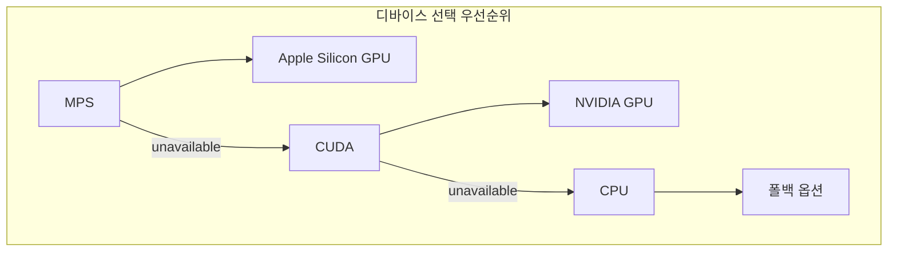
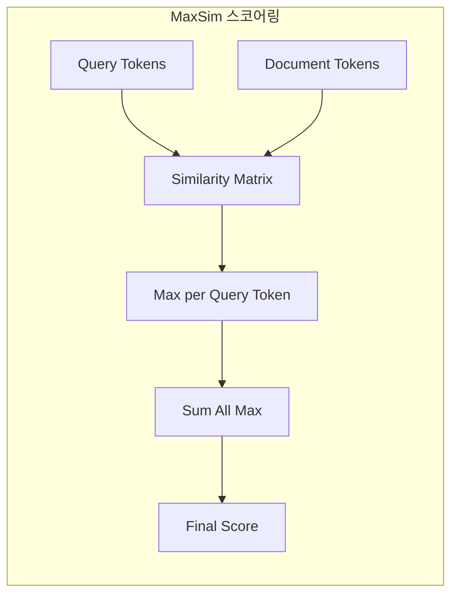
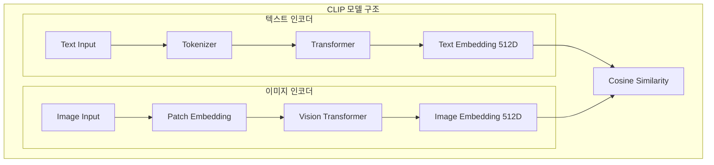
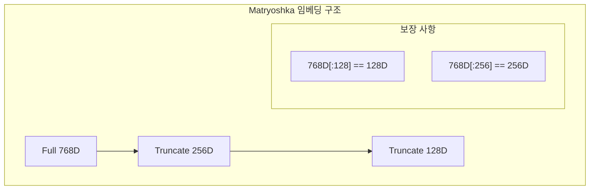
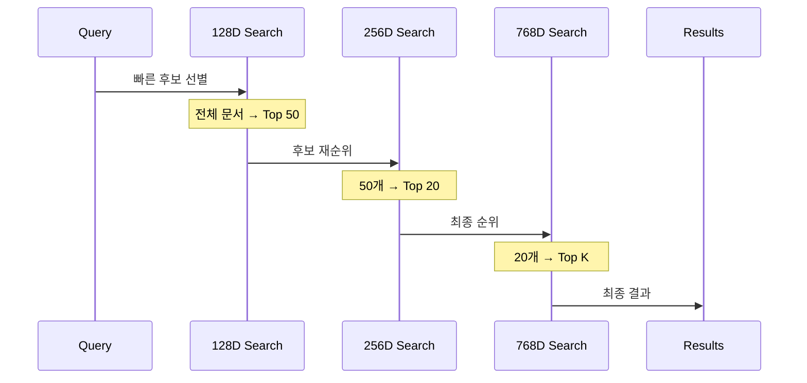
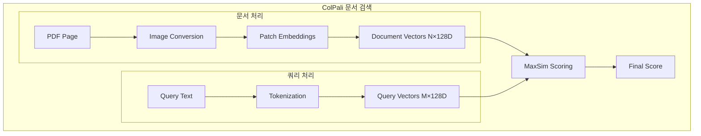
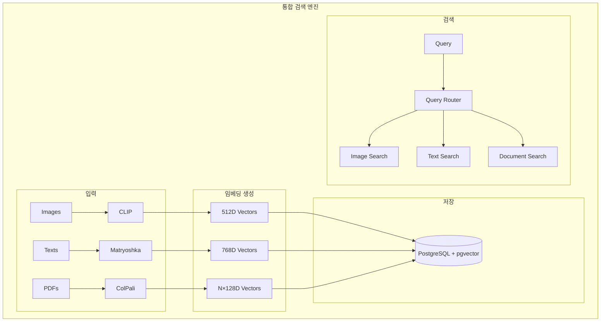
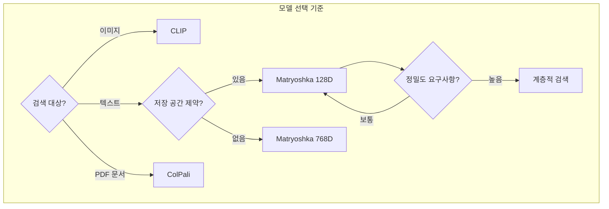
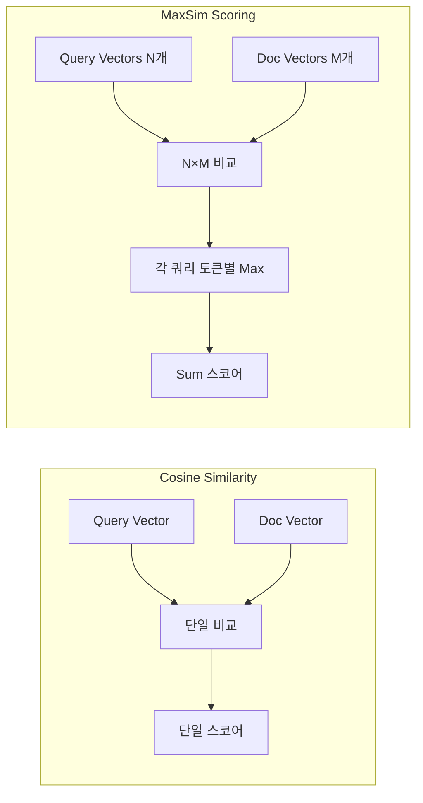

# Chapter 10: Advanced Embedding Techniques (고급 임베딩 기법)

## 📌 핵심 요약

> **"CLIP으로 이미지 검색, Matryoshka로 효율적 텍스트 검색, ColPali로 PDF 문서 검색을 구현한다. 세 가지 임베딩 기법을 통합하여 멀티모달 검색 엔진을 구축하고, MaxSim 스코어링과 계층적 검색으로 성능을 최적화한다."**

이 챕터에서는 세 가지 고급 임베딩 기법(CLIP, Matryoshka, ColPali)을 학습하고 통합 검색 엔진을 구축한다.

---

## 🎯 학습 목표

이 챕터를 완료하면 다음을 할 수 있다:

- [ ] CLIP으로 자연어 기반 이미지 검색 구현
- [ ] Matryoshka 임베딩으로 계층적 텍스트 검색 구현
- [ ] ColPali로 텍스트 추출 없이 PDF 문서 검색 구현
- [ ] MaxSim 스코어링 알고리즘 이해 및 구현
- [ ] 세 가지 임베딩 기법을 통합한 검색 엔진 구축
- [ ] 디바이스 감지 및 최적 연산 장치 선택

---

## 📖 본문 정리

### 10.1 공통 유틸리티

#### 디바이스 감지

```python
import torch

def get_device():
    """최적 연산 장치 자동 감지"""
    if torch.backends.mps.is_available():
        return "mps"  # Apple Silicon
    elif torch.cuda.is_available():
        return "cuda"  # NVIDIA GPU
    return "cpu"
```



#### MaxSim 스코어링

```python
import numpy as np

def maxsim_score(query_embeddings, document_embeddings):
    """
    ColPali용 MaxSim 스코어 계산
    - 쿼리의 각 토큰에 대해 문서에서 가장 유사한 토큰 찾기
    - 최대 유사도 합산
    """
    # L2 정규화
    query_norm = query_embeddings / np.linalg.norm(
        query_embeddings, axis=1, keepdims=True
    )
    doc_norm = document_embeddings / np.linalg.norm(
        document_embeddings, axis=1, keepdims=True
    )

    # 유사도 행렬 계산
    similarity_matrix = np.matmul(query_norm, doc_norm.T)

    # 각 쿼리 토큰의 최대 유사도
    max_similarities = np.max(similarity_matrix, axis=1)

    return float(np.sum(max_similarities))
```



---

### 10.2 CLIP: 이미지 검색

#### 개요

| 항목 | 설명 |
|------|------|
| **모델** | `openai/clip-vit-base-patch32` |
| **임베딩 차원** | 512D |
| **특징** | Zero-shot 이미지 분류, 자연어 기반 검색 |
| **용도** | 이미지-텍스트 크로스모달 검색 |

#### CLIP 아키텍처



#### 구현

```python
from transformers import CLIPProcessor, CLIPModel
from PIL import Image

class CLIPSearchEngine:
    def __init__(self):
        self.device = get_device()
        self.model = CLIPModel.from_pretrained(
            "openai/clip-vit-base-patch32"
        ).to(self.device)
        self.processor = CLIPProcessor.from_pretrained(
            "openai/clip-vit-base-patch32"
        )

    def embed_image(self, image_path: str) -> np.ndarray:
        """이미지 임베딩 생성"""
        image = Image.open(image_path).convert("RGB")
        inputs = self.processor(
            images=image,
            return_tensors="pt"
        ).to(self.device)

        with torch.no_grad():
            features = self.model.get_image_features(**inputs)

        return features.cpu().numpy().flatten()

    def embed_text(self, text: str) -> np.ndarray:
        """텍스트 임베딩 생성"""
        inputs = self.processor(
            text=text,
            return_tensors="pt",
            padding=True
        ).to(self.device)

        with torch.no_grad():
            features = self.model.get_text_features(**inputs)

        return features.cpu().numpy().flatten()

    def search(self, query: str, image_embeddings: list, top_k: int = 5):
        """자연어 쿼리로 이미지 검색"""
        query_embedding = self.embed_text(query)

        similarities = []
        for idx, img_emb in enumerate(image_embeddings):
            sim = np.dot(query_embedding, img_emb) / (
                np.linalg.norm(query_embedding) * np.linalg.norm(img_emb)
            )
            similarities.append((idx, sim))

        similarities.sort(key=lambda x: x[1], reverse=True)
        return similarities[:top_k]
```

---

### 10.3 Matryoshka 임베딩: 텍스트 검색

#### 개요

| 항목 | 설명 |
|------|------|
| **모델** | `nomic-ai/nomic-embed-text-v1.5` |
| **임베딩 차원** | 768D (128D, 256D로 truncate 가능) |
| **특징** | 차원 축소해도 앞부분 동일 보장 |
| **용도** | 효율적 계층 검색, 저장 공간 최적화 |

#### Matryoshka 원리



```python
# Matryoshka 속성 검증
embedding_128d = model.encode(texts, truncate_dim=128)
embedding_768d = model.encode(texts)  # 전체 차원

# 앞 128차원이 동일함을 보장
assert np.allclose(embedding_768d[:, :128], embedding_128d)
```

#### 구현

```python
from sentence_transformers import SentenceTransformer

class MatryoshkaSearchEngine:
    def __init__(self):
        self.model = SentenceTransformer(
            "nomic-ai/nomic-embed-text-v1.5",
            trust_remote_code=True
        )

    def embed_text(self, texts: list, dim: int = 768) -> np.ndarray:
        """
        텍스트 임베딩 생성
        dim: 128, 256, 768 중 선택
        """
        return self.model.encode(
            texts,
            truncate_dim=dim,
            convert_to_numpy=True
        )

    def tiered_search(self, query: str, documents: list,
                      top_k: int = 10) -> list:
        """
        계층적 검색: 128D → 256D → 768D
        """
        # Phase 1: 128D로 빠른 후보 선별
        query_128 = self.embed_text([query], dim=128)[0]
        docs_128 = self.embed_text(documents, dim=128)

        candidates_128 = self._search(query_128, docs_128, top_k=50)

        # Phase 2: 256D로 재순위
        candidate_docs = [documents[i] for i, _ in candidates_128]
        query_256 = self.embed_text([query], dim=256)[0]
        docs_256 = self.embed_text(candidate_docs, dim=256)

        candidates_256 = self._search(query_256, docs_256, top_k=20)

        # Phase 3: 768D로 최종 순위
        final_docs = [candidate_docs[i] for i, _ in candidates_256]
        query_768 = self.embed_text([query], dim=768)[0]
        docs_768 = self.embed_text(final_docs, dim=768)

        return self._search(query_768, docs_768, top_k=top_k)

    def _search(self, query_emb, doc_embs, top_k):
        similarities = []
        for idx, doc_emb in enumerate(doc_embs):
            sim = np.dot(query_emb, doc_emb) / (
                np.linalg.norm(query_emb) * np.linalg.norm(doc_emb)
            )
            similarities.append((idx, sim))
        similarities.sort(key=lambda x: x[1], reverse=True)
        return similarities[:top_k]
```

#### 계층적 검색 전략



| 단계 | 차원 | 후보 수 | 목적 |
|------|------|---------|------|
| Phase 1 | 128D | 전체 → 50 | 빠른 필터링 |
| Phase 2 | 256D | 50 → 20 | 중간 정밀도 |
| Phase 3 | 768D | 20 → K | 최고 정밀도 |

---

### 10.4 ColPali: 문서 검색

#### 개요

| 항목 | 설명 |
|------|------|
| **모델** | `vidore/colpali-v1.2` |
| **기반** | PaliGemma-3B |
| **특징** | OCR/텍스트 추출 불필요, 다중 벡터 |
| **용도** | PDF, 이미지 기반 문서 검색 |

#### ColPali 아키텍처



#### 구현

```python
from colpali_engine.models import ColPali, ColPaliProcessor
from pdf2image import convert_from_path

class ColPaliSearchEngine:
    def __init__(self):
        self.device = get_device()
        self.model = ColPali.from_pretrained(
            "vidore/colpali-v1.2",
            torch_dtype=torch.bfloat16
        ).to(self.device).eval()
        self.processor = ColPaliProcessor.from_pretrained(
            "vidore/colpali-v1.2"
        )

    def embed_pdf_page(self, pdf_path: str, page_num: int = 0) -> np.ndarray:
        """PDF 페이지 임베딩 생성 (다중 벡터)"""
        images = convert_from_path(pdf_path)
        image = images[page_num]

        inputs = self.processor(
            images=[image],
            return_tensors="pt"
        ).to(self.device)

        with torch.no_grad():
            embeddings = self.model(**inputs)

        # 다중 벡터 반환 (N×128D)
        return embeddings.cpu().numpy()[0]

    def embed_query(self, query: str) -> np.ndarray:
        """쿼리 임베딩 생성 (다중 벡터)"""
        inputs = self.processor(
            text=[query],
            return_tensors="pt"
        ).to(self.device)

        with torch.no_grad():
            embeddings = self.model(**inputs)

        # 다중 벡터 반환 (M×128D)
        return embeddings.cpu().numpy()[0]

    def search(self, query: str, document_embeddings: list,
               top_k: int = 5) -> list:
        """MaxSim 기반 문서 검색"""
        query_embeddings = self.embed_query(query)

        scores = []
        for idx, doc_emb in enumerate(document_embeddings):
            score = maxsim_score(query_embeddings, doc_emb)
            scores.append((idx, score))

        scores.sort(key=lambda x: x[1], reverse=True)
        return scores[:top_k]
```

#### ColPali vs 전통적 문서 검색

| 항목 | 전통적 방식 | ColPali |
|------|------------|---------|
| **전처리** | OCR + 텍스트 추출 필수 | 불필요 |
| **레이아웃** | 손실됨 | 보존됨 |
| **표/그래프** | 처리 어려움 | 자연스럽게 처리 |
| **임베딩** | 단일 벡터 | 다중 벡터 |
| **스코어링** | Cosine Similarity | MaxSim |

---

### 10.5 통합 검색 엔진

#### 전체 아키텍처



#### 구현

```python
class UnifiedSearchEngine:
    def __init__(self, db_config: dict):
        self.clip = CLIPSearchEngine()
        self.matryoshka = MatryoshkaSearchEngine()
        self.colpali = ColPaliSearchEngine()
        self.db = self._connect_db(db_config)

    def index_image(self, image_path: str, metadata: dict):
        """이미지 인덱싱"""
        embedding = self.clip.embed_image(image_path)
        self._store_embedding(
            table="images",
            embedding=embedding,
            metadata=metadata
        )

    def index_text(self, text: str, metadata: dict):
        """텍스트 인덱싱 (다중 차원 저장)"""
        # 128D, 256D, 768D 모두 저장
        emb_128 = self.matryoshka.embed_text([text], dim=128)[0]
        emb_256 = self.matryoshka.embed_text([text], dim=256)[0]
        emb_768 = self.matryoshka.embed_text([text], dim=768)[0]

        self._store_embedding(
            table="texts",
            embedding={
                "dim_128": emb_128,
                "dim_256": emb_256,
                "dim_768": emb_768
            },
            metadata=metadata
        )

    def index_pdf(self, pdf_path: str, metadata: dict):
        """PDF 인덱싱 (페이지별)"""
        from pdf2image import convert_from_path
        images = convert_from_path(pdf_path)

        for page_num, _ in enumerate(images):
            embedding = self.colpali.embed_pdf_page(pdf_path, page_num)
            self._store_embedding(
                table="documents",
                embedding=embedding,
                metadata={**metadata, "page": page_num}
            )

    def search(self, query: str, search_type: str, top_k: int = 10):
        """통합 검색"""
        if search_type == "image":
            return self._search_images(query, top_k)
        elif search_type == "text":
            return self._search_texts(query, top_k)
        elif search_type == "document":
            return self._search_documents(query, top_k)
        else:
            raise ValueError(f"Unknown search type: {search_type}")
```

---

### 10.6 프로덕션 고려사항

#### 배치 처리

```python
def batch_embed_images(self, image_paths: list, batch_size: int = 32):
    """이미지 배치 임베딩"""
    embeddings = []

    for i in range(0, len(image_paths), batch_size):
        batch = image_paths[i:i + batch_size]
        images = [Image.open(p).convert("RGB") for p in batch]

        inputs = self.processor(
            images=images,
            return_tensors="pt",
            padding=True
        ).to(self.device)

        with torch.no_grad():
            features = self.model.get_image_features(**inputs)

        embeddings.extend(features.cpu().numpy())

    return np.array(embeddings)
```

#### 쿼리 캐싱

```python
from functools import lru_cache

class CachedSearchEngine:
    @lru_cache(maxsize=1000)
    def embed_query_cached(self, query: str) -> tuple:
        """쿼리 임베딩 캐싱"""
        embedding = self.embed_query(query)
        return tuple(embedding.tolist())
```

#### 모델 선택 가이드



| 모델 | 장점 | 단점 | 추천 사용 사례 |
|------|------|------|---------------|
| **CLIP** | Zero-shot, 크로스모달 | 512D 고정 | 이미지 검색, 상품 검색 |
| **Matryoshka** | 차원 유연성, 효율적 | 텍스트 전용 | 대규모 텍스트 검색 |
| **ColPali** | OCR 불필요, 레이아웃 보존 | 계산 비용 높음 | PDF 문서 검색 |

---

## 💡 실무 적용 포인트

### 디렉토리 구조

```
advanced_embedding/
├── engines/
│   ├── clip_engine.py
│   ├── matryoshka_engine.py
│   ├── colpali_engine.py
│   └── unified_engine.py
├── utils/
│   ├── device.py          # 디바이스 감지
│   └── scoring.py         # MaxSim 등 스코어링
├── database/
│   └── postgres.py        # PostgreSQL 연결
└── main.py
```

### 핵심 비교표

| 항목 | CLIP | Matryoshka | ColPali |
|------|------|------------|---------|
| **입력** | 이미지/텍스트 | 텍스트 | PDF 페이지 |
| **차원** | 512D 고정 | 128/256/768D 선택 | N×128D 다중 |
| **스코어링** | Cosine | Cosine | MaxSim |
| **모델 크기** | ~400MB | ~500MB | ~6GB |
| **추론 속도** | 빠름 | 매우 빠름 | 느림 |

### MaxSim vs Cosine Similarity



---

## ✅ 핵심 개념 체크리스트

- [ ] 디바이스 감지 (`MPS > CUDA > CPU`)
- [ ] MaxSim 스코어링 알고리즘 이해
- [ ] CLIP 이미지-텍스트 크로스모달 검색
- [ ] Matryoshka 계층적 차원 구조 (`768D[:128] == 128D`)
- [ ] 계층적 검색 전략 (128D → 256D → 768D)
- [ ] ColPali 다중 벡터 임베딩
- [ ] PDF 페이지 → 이미지 변환 → 패치 임베딩
- [ ] 통합 검색 엔진 아키텍처
- [ ] 배치 처리 및 쿼리 캐싱 최적화

---

## 🔗 참고 자료

- [OpenAI CLIP](https://github.com/openai/CLIP)
- [Nomic Embed Text](https://huggingface.co/nomic-ai/nomic-embed-text-v1.5)
- [ColPali Paper](https://arxiv.org/abs/2407.01449)
- [Matryoshka Representation Learning](https://arxiv.org/abs/2205.13147)

---

## 📚 다음 챕터 미리보기

- 책 완료! 벡터 데이터베이스의 기초부터 고급 임베딩 기법까지 학습 완료.
