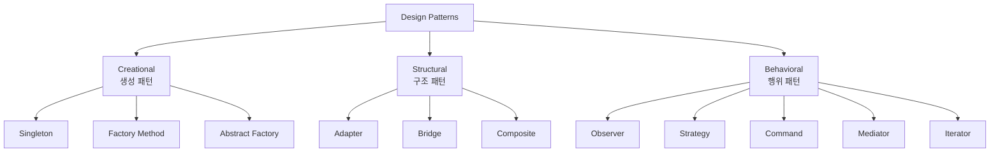
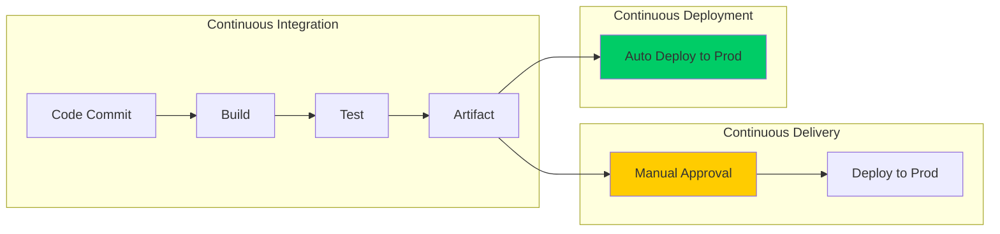
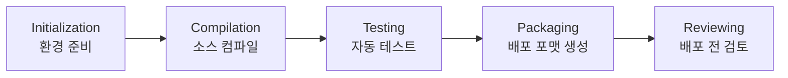
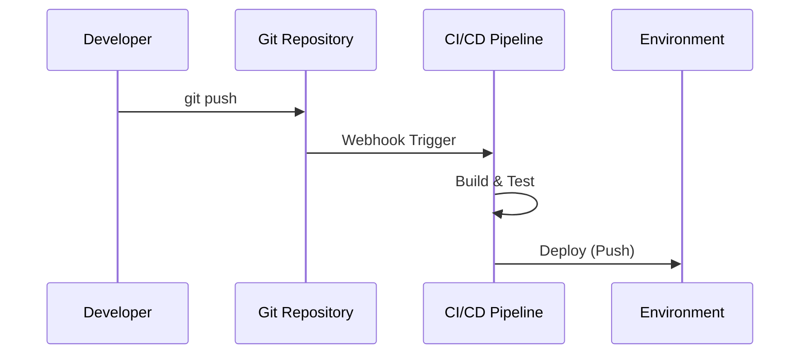
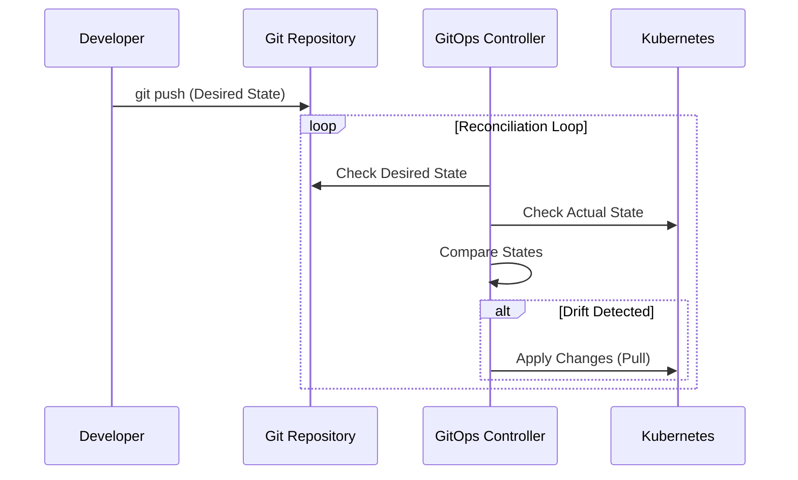
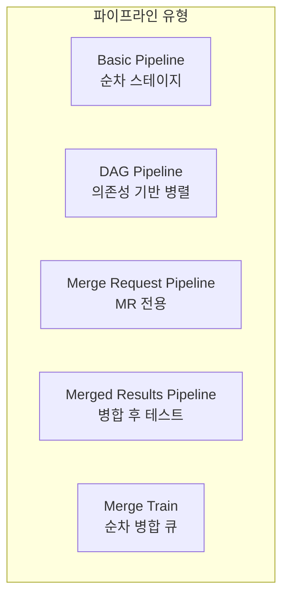
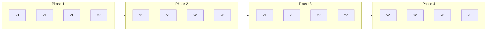
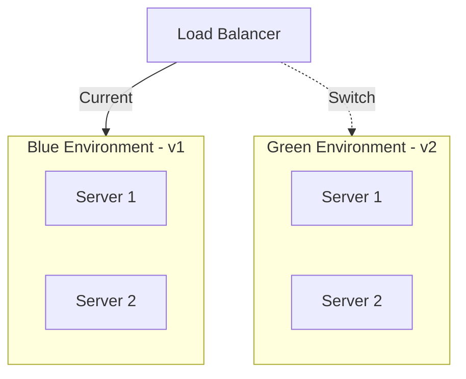
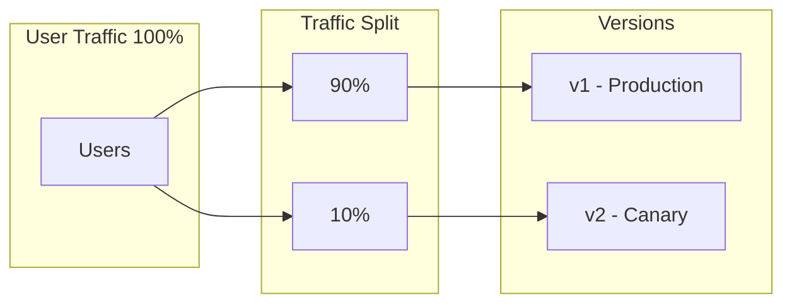

---

## 📌 핵심 요약
> 이 장에서는 CI/CD 디자인 패턴의 기초와 소프트웨어 개발 전반에 미치는 영향을 다룬다. 핵심은 **디자인 패턴의 기원(GoF)과 CI/CD의 관계를 이해**하고, Push/Pull 배포 모델, 테스트 피라미드/다이아몬드, 그리고 Rolling/Blue-Green/Canary 배포 전략의 개념을 파악하는 것이다.

## 🎯 학습 목표
이 내용을 읽고 나면:
- [ ] 디자인 패턴의 3가지 유형(Creational, Structural, Behavioral)을 설명할 수 있다
- [ ] CI/CD의 정의와 Continuous Delivery vs Continuous Deployment의 차이를 구분할 수 있다
- [ ] Push 모델과 Pull 모델(GitOps)의 차이를 비교할 수 있다
- [ ] 테스트 피라미드와 테스트 다이아몬드의 용도를 설명할 수 있다
- [ ] Rolling, Blue-Green, Canary 배포 전략을 상황에 맞게 선택할 수 있다

## 📖 본문 정리

### 1. 디자인 패턴 개요

디자인 패턴은 소프트웨어 설계 시 반복적으로 발생하는 문제에 대한 **재사용 가능한 해결책**이다.

#### 디자인 패턴의 기원
- **1977년**: Christopher Alexander의 *A Pattern Language* (건축/도시계획)
- **1994년**: Gang of Four(GoF)의 *Design Patterns – Elements of Reusable Object-Oriented Software* → 소프트웨어 분야에서 디자인 패턴 개념 대중화

#### 디자인 패턴의 핵심 특성

| 특성 | 설명 |
|------|------|
| **Reusability** | 검증된 솔루션을 다양한 곳에 적용 가능 |
| **Abstraction** | 시스템 설계를 설명하는 공통 어휘 제공 |
| **Maintainability** | 문서화된 패턴으로 코드 이해/수정 용이 |
| **Flexibility** | 전면 재작성 없이 시스템 진화 가능 |

> 💬 **비유**: 디자인 패턴은 "코드의 처방전"과 같다. 증상(문제)에 맞는 약(패턴)을 처방하여 코드 품질을 높인다.

---

### 2. 디자인 패턴의 3가지 유형



#### 2.1 Creational Patterns (생성 패턴)

객체 생성 과정을 다루는 패턴이다.

| 패턴 | 목적 | CI/CD 적용 예시 |
|------|------|-----------------|
| **Singleton** | 클래스의 인스턴스를 하나만 생성 | 설정 관리자, 로깅 서비스, DB 커넥션 풀 |
| **Factory Method** | 객체 생성을 서브클래스에 위임 | 환경별 파이프라인 생성 (Dev/Staging/Prod) |
| **Abstract Factory** | 관련 객체 패밀리를 생성하는 팩토리의 팩토리 | 다중 클라우드 인프라 프로비저닝 |

**Factory Method 패턴 CI/CD 적용 예시**:

```
PipelineCreator (Abstract)
├── DevelopmentPipelineCreator → DevelopmentPipeline
├── StagingPipelineCreator → StagingPipeline
└── ProductionPipelineCreator → ProductionPipeline
```

#### 2.2 Structural Patterns (구조 패턴)

클래스/객체의 구성 방식을 다루는 패턴이다.

| 패턴 | 목적 | CI/CD 적용 예시 |
|------|------|-----------------|
| **Adapter** | 호환되지 않는 인터페이스를 연결 | 다른 CI 도구 통합 (Jenkins ↔ GitLab) |
| **Bridge** | 추상화와 구현을 분리 | 다양한 DB 구현체 연결 |
| **Composite** | 트리 구조로 계층적 관계 표현 | 복잡한 GUI, 파이프라인 스테이지 구성 |

#### 2.3 Behavioral Patterns (행위 패턴)

객체 간 상호작용과 책임 분배를 다루는 패턴이다.

| 패턴 | 목적 | CI/CD 적용 예시 |
|------|------|-----------------|
| **Observer** | 상태 변화를 여러 객체에 알림 | 파이프라인 상태 알림 (Slack, Email) |
| **Strategy** | 알고리즘을 캡슐화하여 런타임에 교체 | 배포 전략 선택 (Blue-Green, Canary, Rolling) |
| **Command** | 요청을 객체로 캡슐화 | Undo/Redo, 매크로 기록 |
| **Mediator** | 객체 간 통신을 중재자가 처리 | 느슨한 결합, 모듈 테스트 용이 |
| **Iterator** | 컬렉션 순회를 추상화 | 파일 라인별 읽기, 로그 순회 |

---

### 3. CI/CD의 정의와 진화

#### CI/CD 정의

| 용어 | 정의 | 출처 |
|------|------|------|
| **Continuous Delivery** | "모든 유형의 변경(기능, 설정, 버그 수정, 실험)을 안전하고 빠르게, 지속 가능한 방식으로 프로덕션 또는 사용자에게 전달하는 능력" | Jez Humble |
| **Continuous Integration** | "코드 변경을 자주 통합하고, 각 변경을 체크인 시 검증하는 실천" | CD Foundation |

#### Continuous Delivery vs Continuous Deployment



| 구분 | Continuous Delivery | Continuous Deployment |
|------|---------------------|----------------------|
| **수동 단계** | 있음 (승인, 수동 테스트 등) | 없음 (완전 자동화) |
| **프로덕션 배포** | 수동 트리거 필요 | 자동 트리거 |
| **CI에 수동 단계** | 허용 | 불허 (CD 달성 불가) |

> 💬 **핵심**: CI에 수동 단계가 있으면 Continuous Deployment는 불가능하고, Continuous Delivery만 가능하다.

#### Build Cycle 5단계



---

### 4. Push vs Pull 배포 모델

#### Push 모델 (전통적 CI/CD)



- **트리거**: 코드 커밋 시 즉시 파이프라인 실행
- **특징**: 변경 발생 → 즉시 실행 (지연 없음)
- **도구**: Jenkins, GitLab CI, GitHub Actions, Azure DevOps

#### Pull 모델 (GitOps)



- **트리거**: 컨트롤러가 주기적으로 상태 비교
- **특징**: Desired State (VCS) vs Actual State (Cluster) 비교
- **도구**: Argo CD, Flux

| 비교 항목 | Push 모델 | Pull 모델 (GitOps) |
|----------|----------|-------------------|
| **트리거 방식** | 이벤트 기반 (Webhook) | 폴링 기반 (Reconciliation) |
| **실행 주체** | CI 서버가 배포 실행 | 클러스터 내 컨트롤러가 배포 실행 |
| **상태 관리** | 명시적 배포 명령 | 선언적 상태 관리 |
| **Drift 감지** | 별도 구현 필요 | 기본 내장 |

---

### 5. 테스트 패턴: 피라미드 vs 다이아몬드

#### 테스트 피라미드 (Monolithic 적합)

```
        /\
       /  \  UI/E2E Tests (느림, 비쌈)
      /----\
     /      \  Integration Tests
    /--------\
   /          \  Unit Tests (빠름, 저렴)
  /______________\
```

- **하단**: Unit Tests - 가장 많이, 빠르게, 저렴하게
- **상단**: E2E Tests - 적게, 느리게, 비싸게
- **원칙**: 쉬운 테스트가 통과해야 복잡한 테스트 실행

#### 테스트 다이아몬드 (Microservices 적합)

```
        /\
       /  \  E2E Tests
      /----\
     /      \
    /        \  Integration Tests ← 가장 많이!
    \        /
     \------/
      \    /  Unit Tests
       \  /
        \/
```

- **핵심 차이**: Integration Tests에 집중
- **이유**: 마이크로서비스는 서비스 간 통신이 핵심
- **적용**: 서비스 간 API 계약, 메시지 큐 통합 테스트

| 아키텍처 | 권장 테스트 패턴 | 집중 영역 |
|----------|-----------------|----------|
| Monolithic | 테스트 피라미드 | Unit Tests |
| Microservices | 테스트 다이아몬드 | Integration Tests |

---

### 6. Infrastructure as Code (IaC) in CI/CD

#### IaC의 주요 고려사항

| 개념 | 설명 | 패턴/도구 |
|------|------|----------|
| **State File 관리** | 템플릿과 실제 인프라 간 매핑 | OpenTofu/Terraform State |
| **Pull Request** | 인프라 변경 검토 및 감사 | GitHub/GitLab PR |
| **Cost 분석** | 클라우드 비용 추정 | Infracost, Terracost |
| **Golden Image** | 검증된 VM 이미지 | Packer |
| **Drift Detection** | 선언 상태와 실제 상태 차이 감지 | Spacelift, Terraform Plan |

#### State File 활용 예시

```bash
# Plan 생성 및 아티팩트 저장
$ tofu plan -out plan.tfplan

# 저장된 Plan으로 적용 (검토 후)
$ tofu apply plan.tfplan
```

#### 설정 전달 패턴 (Configuration Shipping)

```hcl
# 하드코딩 방식 (위험)
data "aws_vpc" "this" {
  id = "vpc-12345678"  # ID 직접 입력 필요
}

# 태그 기반 조회 (권장)
data "aws_vpc" "this" {
  filter {
    name   = "tag:Name"
    values = ["my-vpc"]  # 이름으로 조회
  }
}
```

---

### 7. 파이프라인의 유형



| 유형 | 특징 | 사용 사례 |
|------|------|----------|
| **Basic** | 스테이지별 순차 실행 | 간단한 Build → Test → Deploy |
| **DAG** | 작업 간 의존성 정의, 병렬 실행 | Lint, Unit Test, Integration 병렬 |
| **Merge Request** | MR에서만 실행 | 코드 리뷰 시 검증 |
| **Merged Results** | 병합 결과 기준 테스트 | 충돌 사전 감지 |
| **Merge Train** | MR 순차 큐잉 | main 브랜치 안정성 보장 |

---

### 8. CI/CD 도구 생태계

#### Orchestration 도구

| 도구 | 특징 |
|------|------|
| **Jenkins** | 오픈소스, 풍부한 플러그인 생태계 |
| **GitLab CI/CD** | GitLab 통합, YAML 기반 설정 |
| **GitHub Actions** | GitHub 통합, 마켓플레이스 Actions |
| **Azure DevOps** | Microsoft 클라우드 통합 |
| **Argo CD** | Kubernetes GitOps, 선언적 배포 |
| **Tekton** | Kubernetes 네이티브, CDF 프로젝트 |

#### 모니터링 도구

| 도구 | 용도 |
|------|------|
| **ELK Stack** | 로그 수집/분석/시각화 |
| **Prometheus + Grafana** | 메트릭 수집 및 대시보드 |
| **Datadog / New Relic** | APM, 인프라 모니터링 |

---

### 9. 배포 전략

#### 9.1 Rolling Deployment



- **방식**: 서버를 점진적으로 새 버전으로 교체
- **장점**: 리소스 효율적, 다운타임 최소화
- **단점**: 롤백 시간 소요, 두 버전 공존 기간

#### 9.2 Blue-Green Deployment



- **방식**: 동일한 두 환경 유지, 트래픽 스위칭
- **장점**: 즉시 롤백 가능, 다운타임 제로
- **단점**: 2배의 인프라 비용

#### 9.3 Canary Deployment



- **방식**: 소수 사용자에게 먼저 배포, 점진적 확대
- **장점**: 리스크 최소화, 실 환경 피드백
- **단점**: 트래픽 라우팅 복잡성, 모니터링 필수

#### 배포 전략 비교

| 전략 | 다운타임 | 롤백 속도 | 리소스 비용 | 복잡도 |
|------|----------|----------|------------|--------|
| **Rolling** | 거의 없음 | 느림 | 낮음 | 낮음 |
| **Blue-Green** | 없음 | 즉시 | 높음 (2배) | 중간 |
| **Canary** | 없음 | 빠름 | 중간 | 높음 |

---

## 🔍 심화 학습

### 추가 조사 내용
- **Feature Toggles**: 배포 전략은 아니지만, 런타임에 기능 활성화/비활성화 가능
- **Progressive Delivery**: Canary의 확장, 자동화된 롤아웃/롤백
- **GitOps 2.0**: Pull 모델의 진화, 멀티 클러스터 관리

### 출처
- [Continuous Delivery - Jez Humble](https://continuousdelivery.com/)
- [CD Foundation Best Practices](https://bestpractices.cd.foundation/)
- [AWS Well-Architected CI/CD](https://aws.amazon.com/blogs/devops/choosing-a-well-architected-ci-cd-approach-open-source-on-aws)

---

## 💡 실무 적용 포인트

### 이런 상황에서 사용하세요
- **새 프로젝트**: 테스트 피라미드로 시작, 마이크로서비스 전환 시 다이아몬드로
- **위험 최소화**: Canary → Blue-Green → Rolling 순으로 안전성 높음
- **Kubernetes 환경**: GitOps (Argo CD) + Pull 모델 권장
- **빠른 롤백 필요**: Blue-Green 배포 선택

### 주의할 점 / 흔한 실수
- ⚠️ CI에 수동 단계가 있으면 Continuous Deployment 불가 (Delivery만 가능)
- ⚠️ Push/Pull 모델 혼용 시 상태 동기화 문제 발생 가능
- ⚠️ 테스트 다이아몬드를 모놀리식에 적용하면 비효율적
- ⚠️ Blue-Green은 데이터베이스 스키마 변경 시 복잡해짐
- ⚠️ IaC State File을 Git에 커밋하면 안 됨 (민감 정보 포함 가능)

### 면접에서 나올 수 있는 질문
- Q: Continuous Delivery와 Continuous Deployment의 차이는?
- Q: Push 모델과 Pull 모델(GitOps)의 장단점을 비교하세요.
- Q: 테스트 피라미드와 테스트 다이아몬드는 각각 어떤 아키텍처에 적합한가?
- Q: Blue-Green과 Canary 배포의 차이점과 선택 기준은?
- Q: Observer 패턴을 CI/CD에 어떻게 적용할 수 있는가?

---

## ✅ 핵심 개념 체크리스트
- [ ] GoF 디자인 패턴의 3가지 유형을 나열할 수 있는가?
- [ ] Strategy 패턴이 CI/CD 배포 전략에 어떻게 적용되는지 설명할 수 있는가?
- [ ] CI가 끝나고 CD가 시작되는 연결점(Artifact)을 이해했는가?
- [ ] Push vs Pull 모델의 트리거 방식 차이를 설명할 수 있는가?
- [ ] 테스트 피라미드가 마이크로서비스에 적합하지 않은 이유를 알고 있는가?
- [ ] Rolling, Blue-Green, Canary 중 상황에 맞는 전략을 선택할 수 있는가?

---

## 🔗 참고 자료
- 📚 서적: *Design Patterns – Elements of Reusable Object-Oriented Software* (GoF, 1994)
- 📚 서적: *Continuous Delivery* (Jez Humble & David Farley, 2010)
- 📚 서적: *Strategizing Continuous Delivery in the Cloud* (Garima Bajpai & Thomas Schuetz, 2023)
- 📄 공식 문서: [CD Foundation Architecture](https://bestpractices.cd.foundation/architecture/)
- 📄 공식 문서: [Argo CD](https://argo-cd.readthedocs.io/)

---
