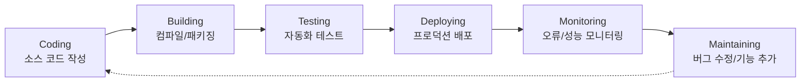
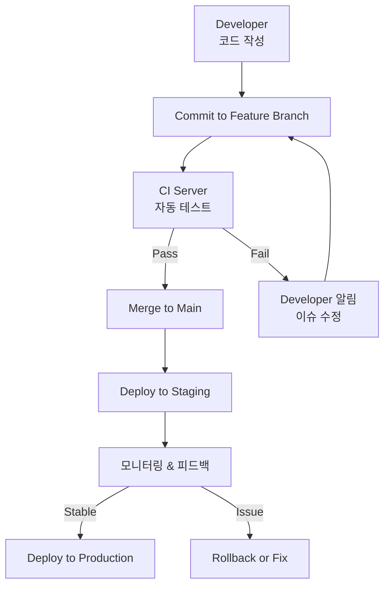
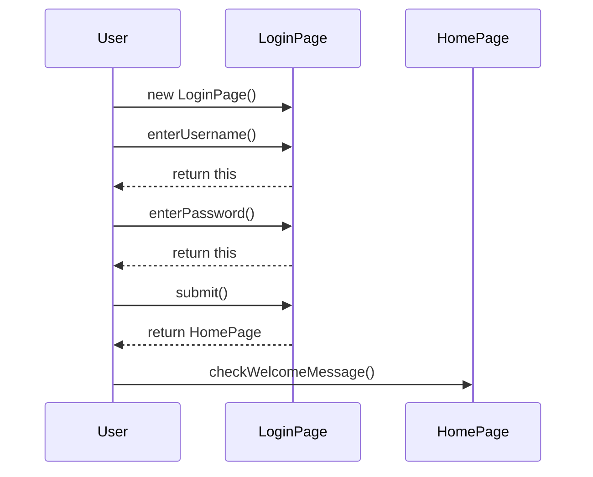
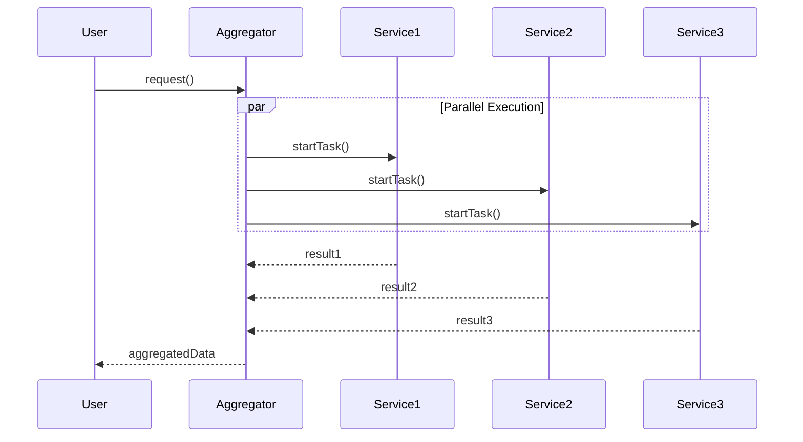
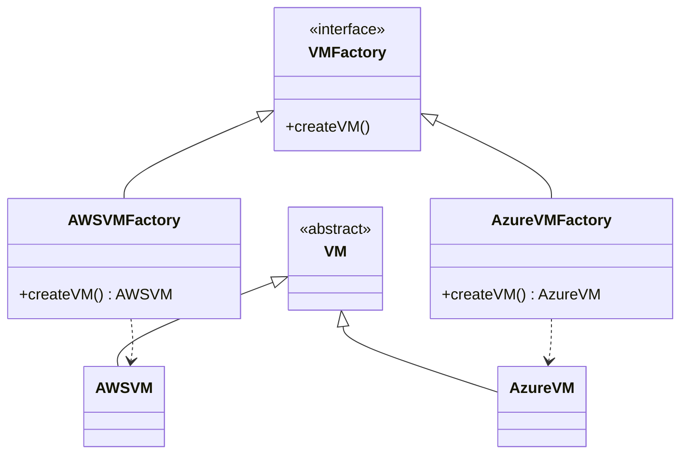
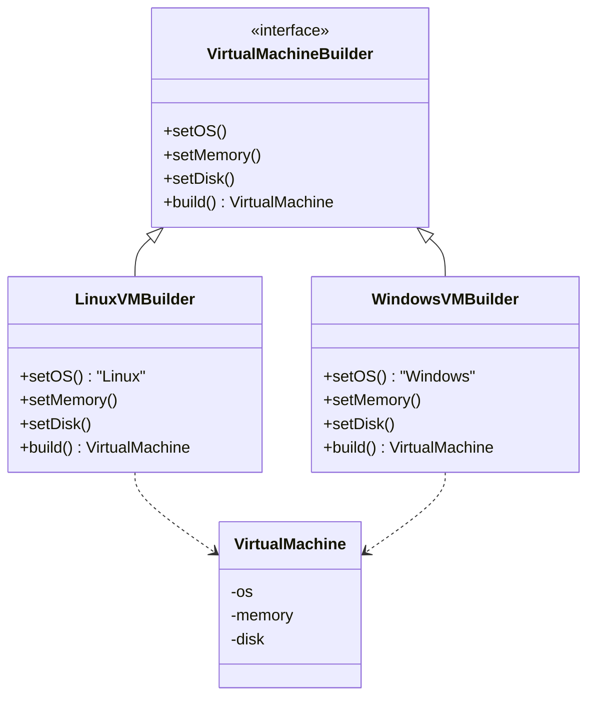
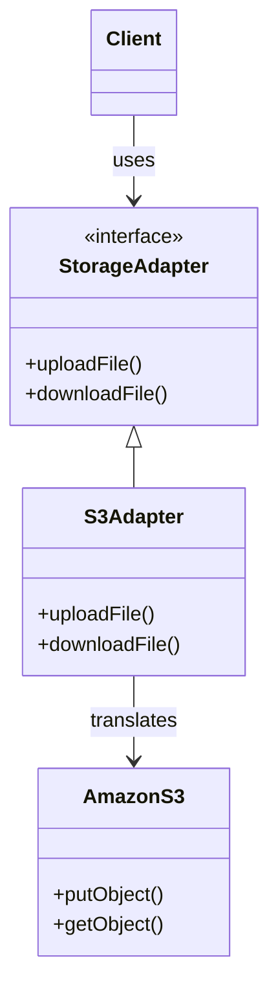
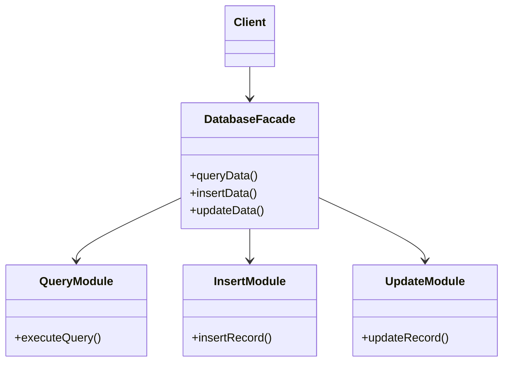
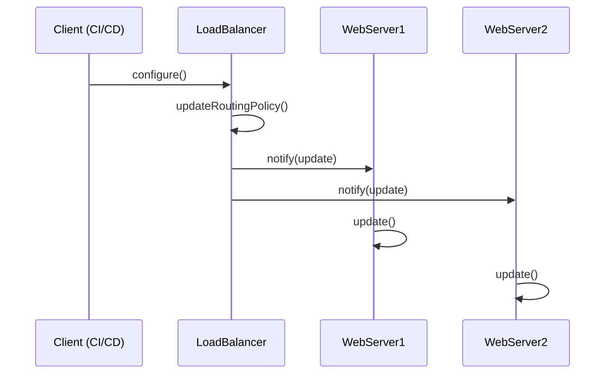
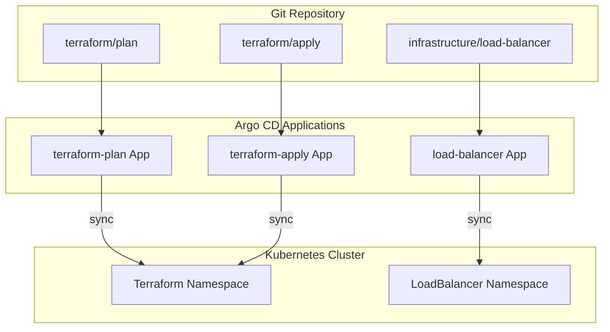

---

## 📌 핵심 요약
> 이 장에서는 CI/CD 디자인 패턴의 유형과 핵심 컴포넌트를 다룬다. 핵심은 **Pipeline as Code(PaC)와 Infrastructure as Code(IaC)의 개념과 구현 방법을 이해**하고, 순차/병렬 실행 원칙, 그리고 다양한 CI/CD 도구(Jenkins, GitLab, GitHub Actions 등)에서의 PaC 구현 방식을 파악하는 것이다.

## 🎯 학습 목표
이 내용을 읽고 나면:
- [ ] Build and Deploy 모델의 6단계를 설명할 수 있다
- [ ] Pipeline as Code(PaC)의 개념과 이점을 설명할 수 있다
- [ ] 순차 실행과 병렬 실행의 차이와 적용 시나리오를 구분할 수 있다
- [ ] Jenkins, GitLab, GitHub Actions 등에서 PaC를 구현할 수 있다
- [ ] IaC에서 Factory Method, Builder, Adapter, Facade, Observer 패턴을 적용할 수 있다

## 📖 본문 정리

### 1. Build and Deploy 모델

소프트웨어를 빌드하고 배포하는 프로세스의 공통 단계이다.



| 단계 | 설명 | 주요 활동 |
|------|------|----------|
| **Coding** | 소스 코드 작성 | 프로그래밍 언어 및 도구 사용 |
| **Building** | 실행 파일로 변환 | 컴파일, 링크, 패키징 |
| **Testing** | 품질 검증 | Unit, Integration, System, Acceptance 테스트 |
| **Deploying** | 프로덕션 배포 | 복사, 설치, 구성, 업데이트 |
| **Monitoring** | 운영 모니터링 | 오류, 성능, 사용자 피드백 추적 |
| **Maintaining** | 유지보수 | 버그 수정, 기능 추가, 패치 적용 |

---

### 2. Pipeline as Code (PaC)

#### PaC란?

GUI나 CLI 대신 **코드로 파이프라인을 정의**하는 방식이다. 파이프라인 정의를 애플리케이션 코드와 함께 버전 관리할 수 있다.

#### PaC의 이점

| 이점 | 설명 |
|------|------|
| **Version Control** | 파이프라인 변경 이력 추적, 롤백 가능 |
| **Reusability** | 스테이지, 스텝을 모듈화하여 재사용 |
| **Testability** | 파이프라인 로직 테스트 및 디버깅 가능 |
| **Flexibility** | 조건 분기, 루프, 병렬 처리, 에러 핸들링 지원 |
| **Collaboration** | Pull Request로 코드 리뷰 및 협업 |
| **Automation** | 이벤트(커밋, PR) 기반 자동 트리거 |

> 💬 **비유**: PaC는 "인프라의 레시피"와 같다. 요리사(개발자)가 레시피(코드)를 공유하면 누구나 같은 요리(파이프라인)를 만들 수 있다.

---

### 3. Faster Team Feedback (빠른 피드백 루프)



#### 빠른 피드백의 이점

- 더 빠르고 자주 소프트웨어 전달 → 고객 만족도 증가
- 개발 주기 초기에 버그 발견 → 비용 절감
- 각 단계에서 피드백 수집 → 사용자 요구사항 정렬

#### 도전 과제

- CI/CD 파이프라인 설정 및 유지보수에 투자 필요
- 지속적 개선 문화와 조직적 지원 필요
- 빈번한 변화와 불확실성에 대한 유연성 필요

---

### 4. 순차 실행 vs 병렬 실행

#### 비교

| 구분 | Sequential (순차) | Parallel (병렬) |
|------|------------------|-----------------|
| **실행 방식** | 한 번에 하나씩 순서대로 | 동시에 여러 작업 실행 |
| **장점** | 이해하기 쉬움, 결과 예측 가능 | 빠름, 효율적, 리소스 활용 |
| **단점** | 느림, 비효율적 | 복잡함, 동기화 이슈 (Race Condition, Deadlock) |
| **적합한 패턴** | Chain of Responsibility | Executor |

#### Sequential 실행 예시: Fluent Page Object Model



#### Parallel 실행 예시: Aggregator Pattern



#### 선택 기준

- **순차 실행**: 명확한 단계별 순서가 있는 경우, 동시성 이슈 회피
- **병렬 실행**: 독립적인 작업, 우선순위가 다른 작업, 성능 최적화 필요
- **Strategy 패턴**: 상황에 따라 순차/병렬 모두 지원 (암호화, 압축, 정렬, 필터링)

---

### 5. PaC 구현: 도구별 가이드

#### 5.1 Jenkins (Jenkinsfile)

```groovy
// Jenkinsfile (Declarative)
pipeline {
    agent any

    stages {
        stage('Build') {
            steps {
                sh 'mvn clean compile'
            }
        }
        stage('Test') {
            steps {
                sh 'mvn test'
            }
        }
        stage('Deploy') {
            steps {
                sh 'mvn deploy'
            }
        }
    }

    post {
        failure {
            mail to: 'team@example.com',
                 subject: 'Build Failed',
                 body: 'Check Jenkins for details.'
        }
    }
}
```

**구현 단계**:
1. 프로젝트 루트에 `Jenkinsfile` 생성
2. Groovy DSL로 stages, steps, actions 정의
3. VCS에 커밋/푸시 → Jenkins 자동 실행

#### 5.2 GitLab CI/CD (.gitlab-ci.yml)

```yaml
# .gitlab-ci.yml
stages:
  - build
  - test
  - deploy

variables:
  MAVEN_OPTS: "-Dmaven.repo.local=.m2/repository"

build:
  stage: build
  script:
    - mvn clean compile
  artifacts:
    paths:
      - target/

test:
  stage: test
  script:
    - mvn test
  dependencies:
    - build

deploy:
  stage: deploy
  script:
    - mvn deploy
  only:
    - main
```

**GitLab Runners 설정** (`config.toml`):

| 옵션 | 설명 |
|------|------|
| `concurrent` | 동시 실행 가능한 작업 수 |
| `limit` | Runner에 할당 가능한 최대 작업 수 |
| `executor` | 실행 방식 (shell, docker, ssh 등) |
| `environment` | 모든 작업에 설정되는 환경 변수 |

#### 5.3 GitHub Actions (.github/workflows/*.yml)

```yaml
# .github/workflows/ci.yml
name: CI Pipeline

on:
  push:
    branches: [main, develop]
  pull_request:
    branches: [main]

jobs:
  build:
    runs-on: ubuntu-latest

    steps:
      - uses: actions/checkout@v4

      - name: Setup Java
        uses: actions/setup-java@v4
        with:
          java-version: '17'
          distribution: 'temurin'

      - name: Build
        run: mvn clean compile

      - name: Test
        run: mvn test

  deploy:
    needs: build
    runs-on: ubuntu-latest
    if: github.ref == 'refs/heads/main'

    steps:
      - name: Deploy
        run: echo "Deploying to production..."
```

**Best Practices**:
- 워크플로우, 작업, 스텝에 설명적인 이름 사용
- Secrets로 민감 정보 관리
- Matrix Strategy로 다양한 OS/언어 버전 테스트

#### 5.4 Azure Pipelines (azure-pipelines.yml)

```yaml
# azure-pipelines.yml
trigger:
  - main

pool:
  vmImage: 'ubuntu-latest'

variables:
  buildConfiguration: 'Release'

stages:
  - stage: Build
    jobs:
      - job: BuildJob
        steps:
          - task: DotNetCoreCLI@2
            inputs:
              command: 'build'
              projects: '**/*.csproj'

  - stage: Test
    dependsOn: Build
    jobs:
      - job: TestJob
        steps:
          - task: DotNetCoreCLI@2
            inputs:
              command: 'test'

  - stage: Deploy
    dependsOn: Test
    jobs:
      - deployment: DeployJob
        environment: 'production'
        strategy:
          runOnce:
            deploy:
              steps:
                - script: echo "Deploying..."
```

#### 5.5 Travis CI (.travis.yml)

```yaml
# .travis.yml
language: java
jdk:
  - openjdk17

cache:
  directories:
    - $HOME/.m2

stages:
  - build
  - test
  - deploy

jobs:
  include:
    - stage: build
      script: mvn clean compile

    - stage: test
      script: mvn test

    - stage: deploy
      script: mvn deploy
      if: branch = main
```

#### 5.6 Bamboo (bamboo-specs.yml)

```yaml
# .bamboo.yml
version: 2
plan:
  project-key: PROJ
  key: BUILD
  name: My Build Plan

stages:
  - Build:
      jobs:
        - Build Job:
            tasks:
              - script:
                  interpreter: SHELL
                  scripts:
                    - mvn clean compile

  - Test:
      jobs:
        - Test Job:
            tasks:
              - script:
                  interpreter: SHELL
                  scripts:
                    - mvn test
```

#### 도구 비교 요약

| 도구 | 파일명 | 언어/형식 | 특징 |
|------|--------|----------|------|
| **Jenkins** | Jenkinsfile | Groovy | 풍부한 플러그인, 유연한 스크립팅 |
| **GitLab CI** | .gitlab-ci.yml | YAML | GitLab 통합, Runner 커스터마이징 |
| **GitHub Actions** | .github/workflows/*.yml | YAML | GitHub 통합, Marketplace Actions |
| **Azure Pipelines** | azure-pipelines.yml | YAML | Azure 통합, 환경 관리 |
| **Travis CI** | .travis.yml | YAML | 오픈소스 친화, 간단한 설정 |
| **Bamboo** | .bamboo.yml | YAML/Java | Atlassian 통합 (Jira, Bitbucket) |

---

### 6. Infrastructure as Code (IaC) 컴포넌트

#### IaC 핵심 컴포넌트

| 컴포넌트 | 설명 | 도구 예시 |
|----------|------|----------|
| **Declarative Config** | 원하는 상태를 선언적으로 정의 | YAML, JSON, HCL |
| **Modules** | 재사용 가능한 모듈로 분리 | Terraform Modules, CloudFormation Nested Stacks |
| **Parameterization** | 환경별 설정을 파라미터로 관리 | Terraform Variables, CloudFormation Parameters |
| **Conditional Logic** | 시나리오별 조건 분기 | Terraform Conditions, CloudFormation Conditions |
| **Resource Tagging** | 메타데이터로 리소스 조직화 | AWS Tags, Azure Tags |
| **Version Control** | 변경 이력 추적 및 협업 | Git, GitHub, GitLab |
| **Secrets Management** | 민감 정보 분리 및 보안 관리 | HashiCorp Vault, AWS Secrets Manager |

---

### 7. IaC에서의 디자인 패턴

#### 7.1 Factory Method 패턴

환경/파라미터에 따라 다른 유형의 인프라 리소스를 생성한다.



**적용 예시**: 클라우드 제공자(AWS/Azure)에 따라 다른 Terraform 모듈 사용

#### 7.2 Builder 패턴

복잡한 객체의 생성 과정을 분리하여 다양한 표현을 생성한다.



**적용 예시**: Ansible Playbook으로 OS, 메모리, 디스크 타입을 다르게 구성

#### 7.3 Adapter 패턴

호환되지 않는 인터페이스를 연결하여 통합한다.



**적용 예시**: Chef로 S3, GCS 등 다양한 스토리지 서비스에 공통 인터페이스 제공

#### 7.4 Facade 패턴

복잡한 시스템에 단순화된 인터페이스를 제공한다.



**적용 예시**: Puppet으로 데이터베이스 작업(쿼리, 삽입, 업데이트)에 단일 메서드 제공

#### 7.5 Observer 패턴

상태 변경 시 의존 객체들에게 자동으로 알림을 전송한다.



**적용 예시**: Terraform으로 로드 밸런서 라우팅 정책 변경 시 웹 서버에 알림

---

### 8. Argo CD에서 Observer 패턴 적용

Argo CD는 GitOps 기반으로 Git 저장소의 변경을 감지하여 Kubernetes 클러스터에 반영한다.



#### Argo CD Application 예시

```yaml
# Terraform Plan Application
apiVersion: argoproj.io/v1alpha1
kind: Application
metadata:
  name: terraform-plan
spec:
  project: default
  source:
    repoURL: 'https://github.com/your-org/your-repo'
    targetRevision: HEAD
    path: terraform/plan
  destination:
    server: 'https://kubernetes.default.svc'
    namespace: terraform
  syncPolicy:
    automated:
      prune: true      # 삭제된 리소스 제거
      selfHeal: true   # 드리프트 자동 복구
```

#### Observer 패턴 매핑

| Argo CD 컴포넌트 | Observer 패턴 역할 |
|------------------|-------------------|
| Git Repository | Subject (상태 변경 소스) |
| Argo CD Application | Observer (변경 감지 및 반응) |
| Kubernetes Cluster | 업데이트 대상 시스템 |

---

## 🔍 심화 학습

### 추가 조사 내용
- **Tekton Pipelines**: Kubernetes 네이티브 CI/CD, CDF 프로젝트
- **Spinnaker**: Netflix 오픈소스, 멀티 클라우드 CD 플랫폼
- **Pulumi**: 프로그래밍 언어(TypeScript, Python)로 IaC 작성

### 출처
- [Jenkins Pipeline Syntax](https://www.jenkins.io/doc/book/pipeline/syntax/)
- [GitHub Actions Documentation](https://docs.github.com/en/actions)
- [Argo CD Documentation](https://argo-cd.readthedocs.io/)
- [Terraform Modules](https://developer.hashicorp.com/terraform/language/modules)

---

## 💡 실무 적용 포인트

### 이런 상황에서 사용하세요
- **새 프로젝트**: GitHub Actions 또는 GitLab CI로 빠르게 시작
- **엔터프라이즈**: Jenkins + Shared Library로 조직 전체 표준화
- **Kubernetes 환경**: Argo CD + Terraform으로 GitOps 구현
- **멀티 클라우드**: Factory Method 패턴으로 클라우드별 모듈 분리

### 주의할 점 / 흔한 실수
- ⚠️ Jenkinsfile을 너무 복잡하게 작성하면 유지보수 어려움 → Shared Library 활용
- ⚠️ 병렬 실행 시 공유 리소스 접근은 Race Condition 유발 가능
- ⚠️ IaC 모듈화 없이 단일 파일로 관리하면 복잡도 증가
- ⚠️ Secrets를 코드에 하드코딩하면 보안 위험 → Vault 또는 Secrets Manager 사용
- ⚠️ Argo CD의 `selfHeal: true`는 수동 변경을 자동으로 되돌림 (의도적 변경 주의)

### 면접에서 나올 수 있는 질문
- Q: Pipeline as Code의 이점은 무엇인가?
- Q: Jenkins Declarative Pipeline과 Scripted Pipeline의 차이는?
- Q: 순차 실행과 병렬 실행을 언제 사용하는가?
- Q: IaC에서 Terraform Modules를 사용하는 이유는?
- Q: Argo CD에서 Observer 패턴이 어떻게 적용되는가?

---

## ✅ 핵심 개념 체크리스트
- [ ] Build and Deploy 모델의 6단계를 순서대로 설명할 수 있는가?
- [ ] PaC의 4가지 핵심 이점(Version Control, Reusability, Testability, Flexibility)을 알고 있는가?
- [ ] Chain of Responsibility(순차)와 Executor(병렬) 패턴의 차이를 이해했는가?
- [ ] Jenkins, GitLab, GitHub Actions 중 하나 이상에서 파이프라인을 작성할 수 있는가?
- [ ] IaC에서 Factory Method, Builder, Adapter, Facade, Observer 패턴의 적용 사례를 알고 있는가?
- [ ] Argo CD의 GitOps 워크플로우와 Observer 패턴의 관계를 설명할 수 있는가?

---

## 🔗 참고 자료
- 📄 공식 문서: [Jenkins Pipeline](https://www.jenkins.io/doc/book/pipeline/)
- 📄 공식 문서: [GitLab CI/CD](https://docs.gitlab.com/ee/ci/)
- 📄 공식 문서: [GitHub Actions](https://docs.github.com/en/actions)
- 📄 공식 문서: [Azure Pipelines](https://learn.microsoft.com/en-us/azure/devops/pipelines/)
- 📄 공식 문서: [Argo CD](https://argo-cd.readthedocs.io/)
- 📄 공식 문서: [Terraform Modules](https://developer.hashicorp.com/terraform/language/modules)

---
