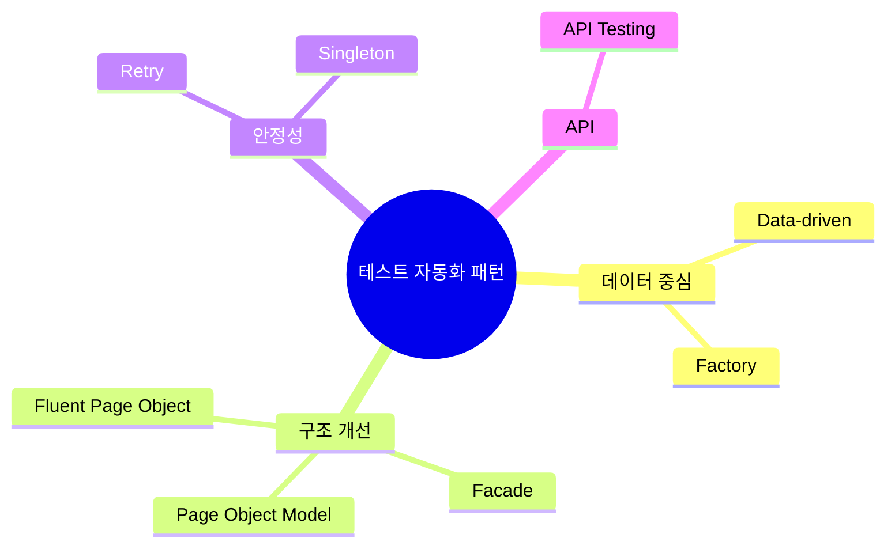
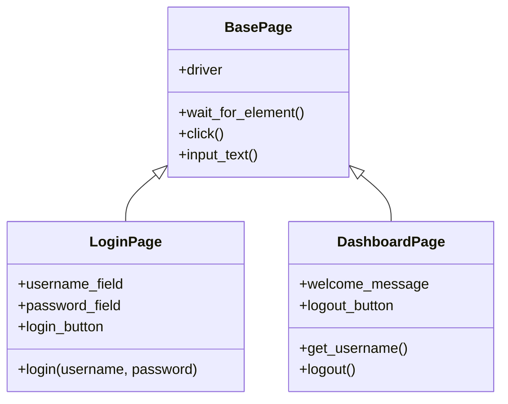
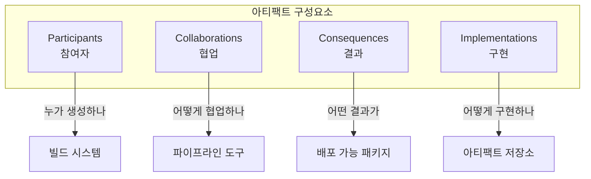
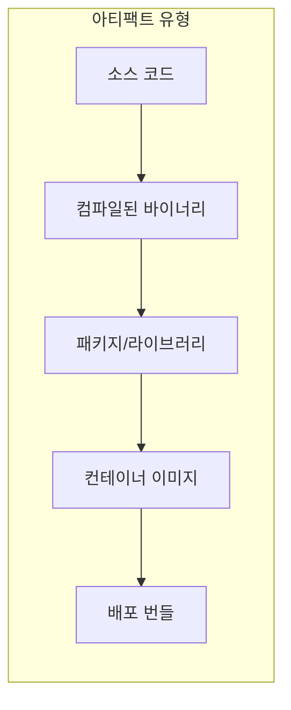
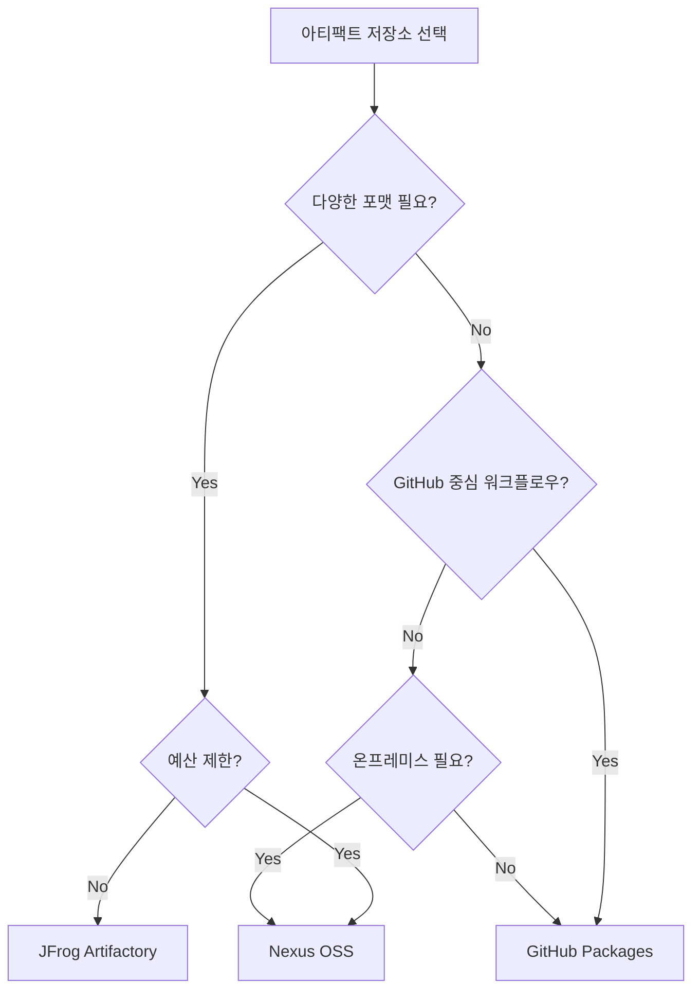
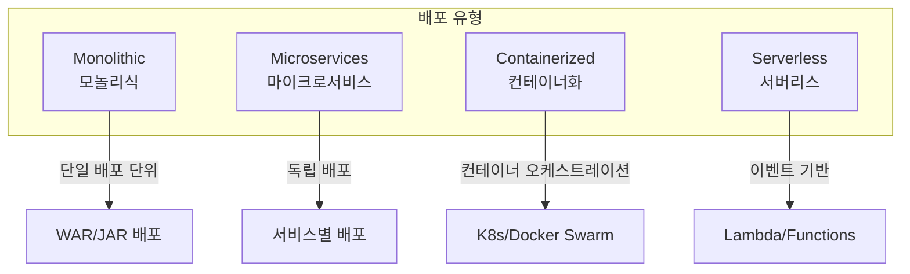
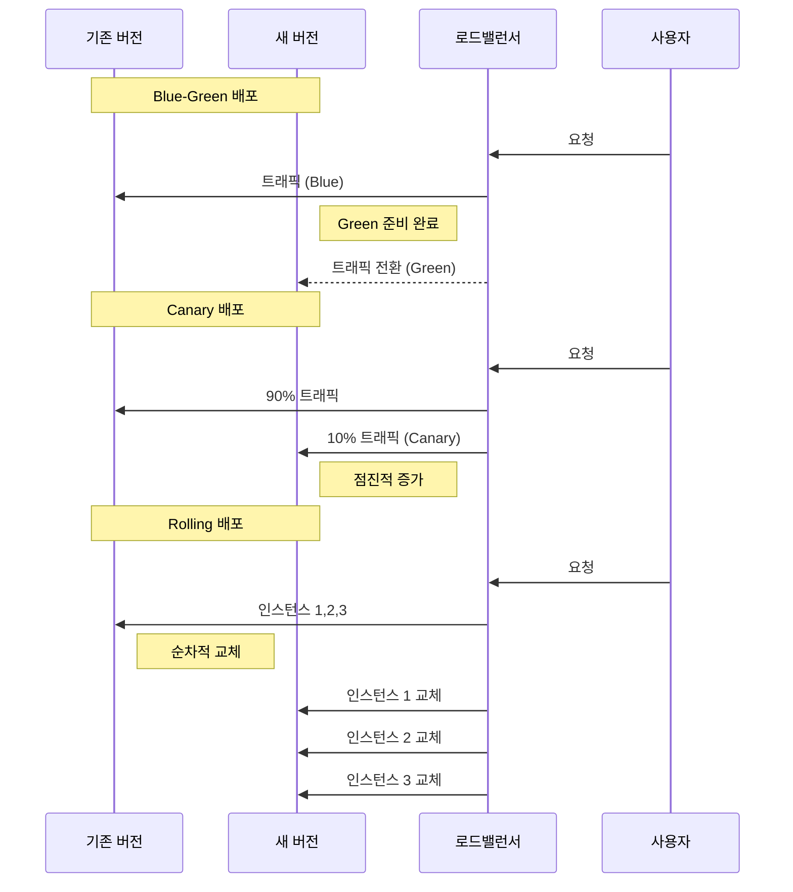
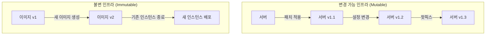
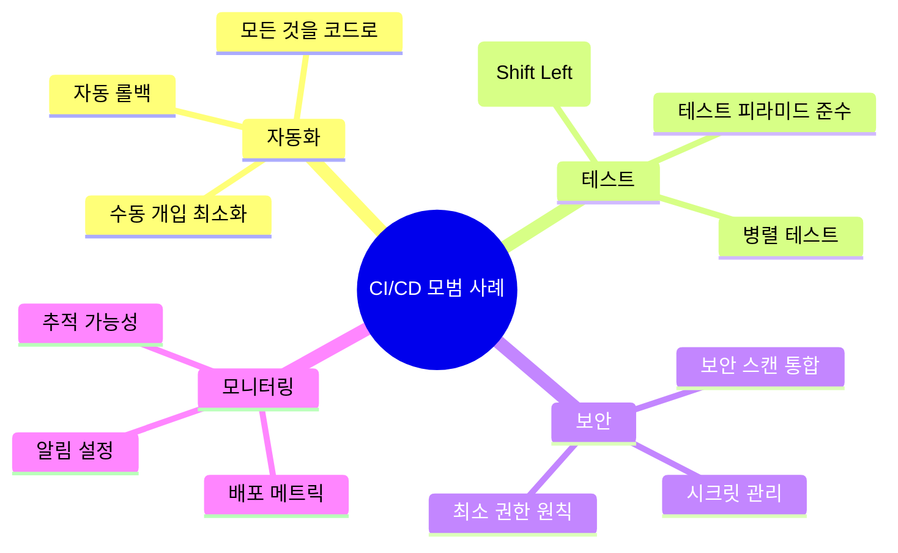

---

## 📌 핵심 요약
> 이 장에서는 CI/CD 파이프라인의 **테스트 자동화 패턴부터 배포까지** 전체 흐름을 다룬다. 핵심은 **테스트 자동화 디자인 패턴의 실제 적용**, **아티팩트 관리 전략**, 그리고 **다양한 배포 유형과 브랜칭 전략**을 이해하는 것이다.

## 🎯 학습 목표
이 내용을 읽고 나면:
- [ ] 8가지 테스트 자동화 패턴(Data-driven, Retry, Factory, POM, Facade, Singleton, API, Fluent)을 설명할 수 있다
- [ ] 아티팩트의 4가지 구성요소(Participants, Collaborations, Consequences, Implementations)를 이해할 수 있다
- [ ] 주요 아티팩트 저장소(Nexus, Artifactory, GitHub Packages)의 특징을 비교할 수 있다
- [ ] 8가지 배포 유형과 각각의 사용 사례를 구분할 수 있다
- [ ] 5가지 브랜칭 전략과 적합한 상황을 판단할 수 있다

## 📖 본문 정리

### 1. 테스트 자동화 디자인 패턴

CI/CD 파이프라인에서 테스트 자동화는 핵심 구성요소다. 다양한 디자인 패턴을 활용하여 **유지보수성**, **재사용성**, **안정성**을 높일 수 있다.



#### 1.1 Data-driven Testing Pattern

테스트 로직과 테스트 데이터를 분리하여 **동일한 테스트를 여러 데이터셋으로 실행**할 수 있게 한다.

```python
# pytest를 사용한 Data-driven 테스트 예시
import pytest

# 테스트 데이터 분리
test_data = [
    ("user1@email.com", "password123", True),
    ("invalid_email", "password123", False),
    ("user2@email.com", "", False),
]

@pytest.mark.parametrize("email,password,expected", test_data)
def test_login(email, password, expected):
    result = login_service.authenticate(email, password)
    assert result == expected
```

| 장점 | 단점 |
|------|------|
| 테스트 커버리지 증가 | 데이터 관리 복잡성 |
| 코드 중복 제거 | 대규모 데이터셋 유지보수 어려움 |
| 새 테스트 케이스 추가 용이 | 실패 시 어떤 데이터가 문제인지 추적 필요 |

#### 1.2 Retry Pattern

네트워크 지연, 일시적 서비스 불안정 등으로 인한 **Flaky 테스트**를 방지한다.

```python
# Retry 패턴 구현 예시
import time
from functools import wraps

def retry(max_attempts=3, delay=1):
    def decorator(func):
        @wraps(func)
        def wrapper(*args, **kwargs):
            attempts = 0
            while attempts < max_attempts:
                try:
                    return func(*args, **kwargs)
                except Exception as e:
                    attempts += 1
                    if attempts == max_attempts:
                        raise e
                    time.sleep(delay)
        return wrapper
    return decorator

@retry(max_attempts=3, delay=2)
def test_api_endpoint():
    response = api_client.get("/unstable-endpoint")
    assert response.status_code == 200
```

> 💬 **비유**: Retry 패턴은 "전화가 안 받으면 3번까지 다시 거는 것"과 같다. 일시적인 문제로 인한 실패를 자동으로 재시도한다.

#### 1.3 Factory Pattern

테스트 객체 생성 로직을 중앙화하여 **일관된 테스트 데이터 생성**을 보장한다.

```python
# Factory 패턴을 사용한 테스트 객체 생성
class UserFactory:
    @staticmethod
    def create_admin():
        return User(role="admin", permissions=["read", "write", "delete"])

    @staticmethod
    def create_regular_user():
        return User(role="user", permissions=["read"])

    @staticmethod
    def create_guest():
        return User(role="guest", permissions=[])

# 테스트에서 사용
def test_admin_can_delete():
    admin = UserFactory.create_admin()
    assert admin.can_delete() == True

def test_guest_cannot_delete():
    guest = UserFactory.create_guest()
    assert guest.can_delete() == False
```

#### 1.4 Page Object Model (POM)

웹 UI 테스트에서 **페이지 구조를 객체로 추상화**하여 테스트 코드의 유지보수성을 높인다.



```python
# Page Object Model 구현 예시
class LoginPage:
    def __init__(self, driver):
        self.driver = driver
        self.username_field = "//input[@id='username']"
        self.password_field = "//input[@id='password']"
        self.login_button = "//button[@type='submit']"

    def login(self, username, password):
        self.driver.find_element(By.XPATH, self.username_field).send_keys(username)
        self.driver.find_element(By.XPATH, self.password_field).send_keys(password)
        self.driver.find_element(By.XPATH, self.login_button).click()
        return DashboardPage(self.driver)

# 테스트 코드 - 깔끔하고 읽기 쉬움
def test_successful_login():
    login_page = LoginPage(driver)
    dashboard = login_page.login("user@email.com", "password123")
    assert dashboard.get_username() == "user@email.com"
```

#### 1.5 Facade Pattern

복잡한 테스트 설정을 **단순화된 인터페이스로 감싸** 사용 편의성을 높인다.

```python
# Facade 패턴으로 복잡한 설정 단순화
class TestEnvironmentFacade:
    def __init__(self):
        self.database = None
        self.api_server = None
        self.mock_services = []

    def setup_integration_test(self):
        """통합 테스트 환경 한번에 설정"""
        self.database = DatabaseConnection.connect("test_db")
        self.database.seed_test_data()
        self.api_server = APIServer.start(port=8080)
        self.mock_services.append(MockPaymentService.start())
        return self

    def teardown(self):
        """모든 리소스 정리"""
        self.database.cleanup()
        self.api_server.stop()
        for service in self.mock_services:
            service.stop()

# 테스트에서 간단하게 사용
def test_order_processing():
    env = TestEnvironmentFacade().setup_integration_test()
    try:
        # 테스트 로직
        order = create_order()
        assert order.status == "completed"
    finally:
        env.teardown()
```

#### 1.6 Singleton Pattern

테스트 환경에서 **공유 리소스의 단일 인스턴스**를 보장한다 (DB 연결, 브라우저 인스턴스 등).

```python
# Singleton 패턴으로 브라우저 인스턴스 관리
class BrowserSingleton:
    _instance = None
    _driver = None

    def __new__(cls):
        if cls._instance is None:
            cls._instance = super().__new__(cls)
            cls._driver = webdriver.Chrome()
        return cls._instance

    @property
    def driver(self):
        return self._driver

    @classmethod
    def quit(cls):
        if cls._driver:
            cls._driver.quit()
            cls._instance = None
            cls._driver = None

# 여러 테스트에서 동일한 브라우저 인스턴스 사용
browser = BrowserSingleton()
driver = browser.driver
```

#### 1.7 API Testing Pattern

UI 없이 **API 엔드포인트를 직접 테스트**하여 빠른 피드백을 얻는다.

```python
# API 테스트 패턴 예시
import requests

class APITestBase:
    BASE_URL = "https://api.example.com/v1"

    def __init__(self):
        self.session = requests.Session()
        self.session.headers.update({"Content-Type": "application/json"})

    def authenticate(self, token):
        self.session.headers.update({"Authorization": f"Bearer {token}"})

class UserAPITest(APITestBase):
    def test_create_user(self):
        payload = {"name": "Test User", "email": "test@email.com"}
        response = self.session.post(f"{self.BASE_URL}/users", json=payload)

        assert response.status_code == 201
        assert response.json()["name"] == "Test User"

    def test_get_user(self, user_id):
        response = self.session.get(f"{self.BASE_URL}/users/{user_id}")

        assert response.status_code == 200
        return response.json()
```

#### 1.8 Fluent Page Object Pattern

메서드 체이닝을 활용하여 **더 읽기 쉬운 테스트 코드**를 작성한다.

```python
# Fluent Page Object 패턴
class LoginPageFluent:
    def __init__(self, driver):
        self.driver = driver

    def enter_username(self, username):
        self.driver.find_element(By.ID, "username").send_keys(username)
        return self  # 자기 자신 반환으로 체이닝 가능

    def enter_password(self, password):
        self.driver.find_element(By.ID, "password").send_keys(password)
        return self

    def click_login(self):
        self.driver.find_element(By.ID, "login-btn").click()
        return DashboardPage(self.driver)

# Fluent 스타일 테스트 - 자연어처럼 읽힘
def test_login_flow():
    dashboard = (LoginPageFluent(driver)
                 .enter_username("user@email.com")
                 .enter_password("password123")
                 .click_login())

    assert dashboard.is_logged_in() == True
```

| 패턴 | 주요 용도 | 적용 시점 |
|------|----------|----------|
| Data-driven | 다양한 데이터로 동일 테스트 | 입력 검증, 경계값 테스트 |
| Retry | Flaky 테스트 방지 | 네트워크 의존 테스트 |
| Factory | 테스트 객체 생성 | 복잡한 객체 설정 필요 시 |
| POM | UI 요소 추상화 | 웹 UI 테스트 |
| Facade | 복잡한 설정 단순화 | 통합 테스트 환경 |
| Singleton | 공유 리소스 관리 | DB, 브라우저 인스턴스 |
| API Testing | 빠른 API 검증 | 백엔드 API 테스트 |
| Fluent | 가독성 높은 테스트 | 복잡한 워크플로우 테스트 |

---

### 2. 아티팩트(Artifacts) 이해

CI/CD 파이프라인에서 **아티팩트**는 빌드 과정의 산출물로, 배포 가능한 패키지를 의미한다.

#### 2.1 아티팩트의 4가지 구성요소



| 구성요소 | 설명 | 예시 |
|----------|------|------|
| **Participants** | 아티팩트 생성/소비 주체 | 빌드 서버, 개발자, 배포 시스템 |
| **Collaborations** | 아티팩트 간 상호작용 | 의존성 해결, 버전 관리 |
| **Consequences** | 아티팩트 사용 결과 | 배포 가능 상태, 롤백 가능성 |
| **Implementations** | 실제 저장/관리 방법 | Nexus, Artifactory, S3 |

#### 2.2 아티팩트 유형



| 아티팩트 유형 | 확장자/형식 | 사용 환경 |
|--------------|-------------|----------|
| JAR/WAR | `.jar`, `.war` | Java 애플리케이션 |
| NPM 패키지 | `package.tgz` | Node.js |
| Docker 이미지 | `image:tag` | 컨테이너 환경 |
| Helm Chart | `.tgz` | Kubernetes |
| DEB/RPM | `.deb`, `.rpm` | Linux 패키지 |

---

### 3. 아티팩트 저장소 비교

#### 3.1 주요 아티팩트 저장소

| 저장소 | 지원 형식 | 라이선스 | 특징 |
|--------|----------|----------|------|
| **Nexus Repository** | Maven, NPM, Docker, PyPI, NuGet 등 | OSS/Pro | 다양한 포맷 지원, 프록시 기능 |
| **JFrog Artifactory** | 모든 주요 포맷 | OSS/Pro/Enterprise | 고급 메타데이터, 복제 기능 |
| **GitHub Packages** | NPM, Maven, Docker, NuGet, RubyGems | Free/Enterprise | GitHub 통합, Actions 연동 |

#### 3.2 선택 기준



---

### 4. 배포 유형 (Deployment Types)

#### 4.1 애플리케이션 아키텍처별 배포



| 배포 유형 | 장점 | 단점 | 적합한 상황 |
|----------|------|------|------------|
| **Monolithic** | 단순한 배포, 낮은 초기 복잡도 | 스케일링 어려움, 배포 위험 | 소규모 팀, MVP |
| **Microservices** | 독립 배포, 기술 다양성 | 운영 복잡도, 네트워크 오버헤드 | 대규모 팀, 복잡한 도메인 |
| **Containerized** | 일관된 환경, 빠른 스케일링 | 컨테이너 관리 복잡도 | 클라우드 네이티브 |
| **Serverless** | 운영 부담 최소화, 비용 효율 | 콜드 스타트, 벤더 종속 | 이벤트 기반, 변동 트래픽 |

#### 4.2 배포 전략별 비교



| 전략 | 다운타임 | 롤백 속도 | 리소스 요구 | 위험도 |
|------|----------|----------|------------|--------|
| **Blue-Green** | 없음 | 즉시 | 2배 인프라 | 낮음 |
| **Canary** | 없음 | 빠름 | 약간 추가 | 매우 낮음 |
| **Rolling** | 없음 | 중간 | 최소 | 중간 |
| **Recreate** | 있음 | 느림 | 최소 | 높음 |

#### 4.3 Feature Toggles (Feature Flags)

코드 배포와 기능 릴리스를 분리하여 **런타임에 기능을 활성화/비활성화**한다.

```python
# Feature Toggle 구현 예시
class FeatureToggle:
    def __init__(self, config_source):
        self.config = config_source

    def is_enabled(self, feature_name, user_context=None):
        feature = self.config.get(feature_name)
        if not feature:
            return False

        # 전역 활성화
        if feature.get("enabled_globally"):
            return True

        # 사용자별 활성화 (A/B 테스트)
        if user_context and feature.get("enabled_users"):
            return user_context.user_id in feature["enabled_users"]

        # 비율 기반 활성화
        if feature.get("percentage"):
            return hash(user_context.user_id) % 100 < feature["percentage"]

        return False

# 사용 예시
feature_toggle = FeatureToggle(config)

if feature_toggle.is_enabled("new_checkout_flow", user):
    # 새로운 체크아웃 플로우
    return new_checkout()
else:
    # 기존 체크아웃 플로우
    return legacy_checkout()
```

| Toggle 유형 | 수명 | 용도 |
|------------|------|------|
| **Release Toggle** | 단기 | 미완성 기능 숨김 |
| **Experiment Toggle** | 단기~중기 | A/B 테스트 |
| **Ops Toggle** | 단기 | 운영 제어 (성능 이슈 시 비활성화) |
| **Permission Toggle** | 장기 | 유료/프리미엄 기능 |

---

### 5. 브랜칭 전략 (Branching Strategies)

#### 5.1 주요 브랜치 유형

```mermaid
gitgraph
    commit id: "Initial"
    branch develop
    checkout develop
    commit id: "Dev work"
    branch feature/login
    checkout feature/login
    commit id: "Login feature"
    commit id: "Login tests"
    checkout develop
    merge feature/login
    branch release/1.0
    checkout release/1.0
    commit id: "Version bump"
    checkout main
    merge release/1.0 tag: "v1.0.0"
    checkout develop
    merge release/1.0
    branch hotfix/security
    checkout hotfix/security
    commit id: "Security fix"
    checkout main
    merge hotfix/security tag: "v1.0.1"
    checkout develop
    merge hotfix/security
```

| 브랜치 유형 | 용도 | 수명 | 병합 대상 |
|------------|------|------|----------|
| **main/master** | 프로덕션 코드 | 영구 | - |
| **develop** | 개발 통합 | 영구 | main |
| **feature/** | 기능 개발 | 단기 | develop |
| **release/** | 릴리스 준비 | 단기 | main, develop |
| **hotfix/** | 긴급 수정 | 매우 단기 | main, develop |

#### 5.2 브랜칭 모델 비교

| 모델 | 복잡도 | 적합한 팀 규모 | CI/CD 친화도 |
|------|--------|--------------|--------------|
| **Git Flow** | 높음 | 대규모 | 중간 |
| **GitHub Flow** | 낮음 | 소~중규모 | 높음 |
| **GitLab Flow** | 중간 | 중규모 | 높음 |
| **Trunk-based** | 낮음 | 모든 규모 | 매우 높음 |

> 💬 **비유**: Git Flow는 "복잡한 공장 생산라인", Trunk-based는 "작은 공방에서 바로 제품 출시"와 같다.

---

### 6. 기타 CI/CD 패턴

#### 6.1 Pipeline Orchestration Pattern

여러 파이프라인을 조율하여 **복잡한 워크플로우를 관리**한다.

```yaml
# GitHub Actions - Pipeline Orchestration 예시
name: Orchestrated Pipeline

on:
  push:
    branches: [main]

jobs:
  build:
    runs-on: ubuntu-latest
    steps:
      - uses: actions/checkout@v4
      - name: Build
        run: npm run build
    outputs:
      artifact-id: ${{ steps.upload.outputs.artifact-id }}

  test:
    needs: build
    runs-on: ubuntu-latest
    strategy:
      matrix:
        test-type: [unit, integration, e2e]
    steps:
      - name: Run ${{ matrix.test-type }} tests
        run: npm run test:${{ matrix.test-type }}

  security-scan:
    needs: build
    runs-on: ubuntu-latest
    steps:
      - name: Security scan
        run: npm audit

  deploy:
    needs: [test, security-scan]
    runs-on: ubuntu-latest
    steps:
      - name: Deploy to production
        run: ./deploy.sh
```

#### 6.2 Artifact Promotion Pattern

아티팩트를 **환경별로 승격**시키며 품질을 보장한다.


#### 6.3 Immutable Infrastructure Pattern

인프라를 수정하지 않고 **새로운 인스턴스로 교체**한다.



| 특성 | Mutable | Immutable |
|------|---------|-----------|
| 변경 방식 | 기존 서버 수정 | 새 서버로 교체 |
| 일관성 | 드리프트 발생 가능 | 항상 일관됨 |
| 롤백 | 복잡 | 이전 이미지로 간단 |
| 디버깅 | 상태 추적 어려움 | 이미지 버전으로 추적 |

#### 6.4 Parallel Workflows Pattern

독립적인 작업을 **동시에 실행**하여 파이프라인 속도를 높인다.

```yaml
# GitLab CI - Parallel Workflow 예시
stages:
  - build
  - test
  - deploy

build:
  stage: build
  script:
    - npm run build

# 병렬 실행되는 테스트 작업들
unit-test:
  stage: test
  script:
    - npm run test:unit

integration-test:
  stage: test
  script:
    - npm run test:integration

security-scan:
  stage: test
  script:
    - npm audit

lint:
  stage: test
  script:
    - npm run lint

deploy:
  stage: deploy
  needs:
    - unit-test
    - integration-test
    - security-scan
    - lint
  script:
    - ./deploy.sh
```

---

### 7. 산업 모범 사례 및 도전 과제

#### 7.1 모범 사례



| 영역 | 모범 사례 | 구현 방법 |
|------|----------|----------|
| **버전 관리** | 시맨틱 버저닝 | `MAJOR.MINOR.PATCH` |
| **빌드** | 재현 가능한 빌드 | 락파일, 고정 버전 |
| **테스트** | Shift Left | 개발 초기 테스트 통합 |
| **배포** | 점진적 롤아웃 | Canary, Feature Flags |
| **모니터링** | 관찰 가능성 | 로그, 메트릭, 트레이스 |

#### 7.2 주요 도전 과제

| 도전 과제 | 영향 | 완화 전략 |
|----------|------|----------|
| **Flaky 테스트** | 신뢰도 저하 | Retry 패턴, 격리된 환경 |
| **긴 빌드 시간** | 피드백 지연 | 캐싱, 병렬화, 증분 빌드 |
| **환경 차이** | 배포 실패 | 컨테이너화, IaC |
| **시크릿 관리** | 보안 위험 | Vault, 환경변수 암호화 |
| **의존성 관리** | 빌드 깨짐 | 락파일, 의존성 스캔 |

---

## 🔍 심화 학습

### 추가 조사 내용

- **Chaos Engineering**: 프로덕션에서 의도적으로 장애를 주입하여 시스템 복원력 테스트 (Netflix Chaos Monkey)
- **GitOps 진화**: Argo CD, Flux CD를 활용한 선언적 배포 관리
- **eBPF 기반 관찰 가능성**: 커널 레벨에서 배포 성능 모니터링

### 출처
- [Martin Fowler - Feature Toggles](https://martinfowler.com/articles/feature-toggles.html)
- [Atlassian Git Tutorials - Branching Strategies](https://www.atlassian.com/git/tutorials/comparing-workflows)
- [Google SRE Book - Release Engineering](https://sre.google/sre-book/release-engineering/)

---

## 💡 실무 적용 포인트

### 이런 상황에서 사용하세요

- **Flaky 테스트로 CI가 불안정할 때**: Retry 패턴 + 테스트 격리
- **UI 테스트 유지보수가 힘들 때**: Page Object Model + Fluent 패턴
- **배포가 위험할 때**: Canary 배포 + Feature Toggles
- **릴리스 주기가 긴 팀**: GitHub Flow + Trunk-based 고려

### 주의할 점 / 흔한 실수

- ⚠️ Feature Toggle을 장기간 방치하면 기술 부채가 됨 → 정기적 정리 필요
- ⚠️ 모든 테스트에 Retry를 적용하면 근본 원인을 숨김 → 선별적 적용
- ⚠️ Blue-Green 배포 시 데이터베이스 마이그레이션 고려 필수
- ⚠️ 브랜칭 전략을 팀 규모에 맞지 않게 선택하면 오버헤드 증가

### 면접에서 나올 수 있는 질문

- Q: Page Object Model과 Fluent Page Object의 차이점은?
- Q: Blue-Green과 Canary 배포를 언제 각각 사용하나요?
- Q: Feature Toggle의 종류와 각각의 수명 주기는?
- Q: Immutable Infrastructure의 장점과 구현 방법은?
- Q: Trunk-based Development와 Git Flow의 트레이드오프는?

---

## ✅ 핵심 개념 체크리스트

- [ ] 8가지 테스트 자동화 패턴의 용도를 각각 한 문장으로 설명할 수 있는가?
- [ ] Data-driven과 Factory 패턴의 차이를 알고 있는가?
- [ ] 아티팩트 저장소(Nexus, Artifactory, GitHub Packages) 선택 기준을 아는가?
- [ ] Blue-Green, Canary, Rolling 배포의 특징을 비교할 수 있는가?
- [ ] Feature Toggle의 4가지 유형을 설명할 수 있는가?
- [ ] Git Flow와 Trunk-based의 적합한 상황을 판단할 수 있는가?
- [ ] Immutable Infrastructure의 개념과 장점을 설명할 수 있는가?

---

## 🔗 참고 자료

- 📄 공식 문서: [Nexus Repository Documentation](https://help.sonatype.com/repomanager3)
- 📄 공식 문서: [JFrog Artifactory Docs](https://www.jfrog.com/confluence/display/JFROG/JFrog+Artifactory)
- 📄 Martin Fowler: [Continuous Delivery](https://martinfowler.com/bliki/ContinuousDelivery.html)
- 📄 Feature Flags: [LaunchDarkly Best Practices](https://launchdarkly.com/blog/feature-flag-best-practices/)
- 🎬 추천 영상: [GOTO Conferences - CI/CD Best Practices](https://www.youtube.com/c/GotoConferences)

---
