---

## 📌 핵심 요약
> 이 장에서는 **CI/CD 디자인 패턴을 비즈니스 성과에 연결**하는 방법을 다룬다. 핵심은 **OKR 기반 목표 설정**, **DORA 메트릭을 통한 측정**, 그리고 **조직 차원의 CI/CD 도입 확대 전략**을 이해하는 것이다.

## 🎯 학습 목표
이 내용을 읽고 나면:
- [ ] CI/CD 디자인 패턴의 전략적 의도(Strategic Intent)를 비즈니스 성과와 연결할 수 있다
- [ ] Sequential, Parallel, Hybrid 실행 방식의 차이와 CI/CD 적용 방법을 설명할 수 있다
- [ ] DORA 4대 메트릭(배포 빈도, 리드 타임, 변경 실패율, MTTR)을 이해하고 활용할 수 있다
- [ ] CI/CD 디자인 패턴의 4가지 유형(Structural, Creational, Behavioral, Domain-driven)을 구분할 수 있다
- [ ] CI/CD 도입의 문화적 저항을 인식하고 극복 방안을 제시할 수 있다

## 📖 본문 정리

### 1. CI/CD 디자인 패턴의 전략적 의도

소프트웨어는 오늘날 모든 비즈니스의 핵심이다. CI/CD 디자인 패턴은 **개발자 생산성 향상**과 **제품 수익성 개선**을 위한 체계적인 접근 방식을 제공한다.

#### 1.1 디자인 패턴 특성과 비즈니스 성과 연결

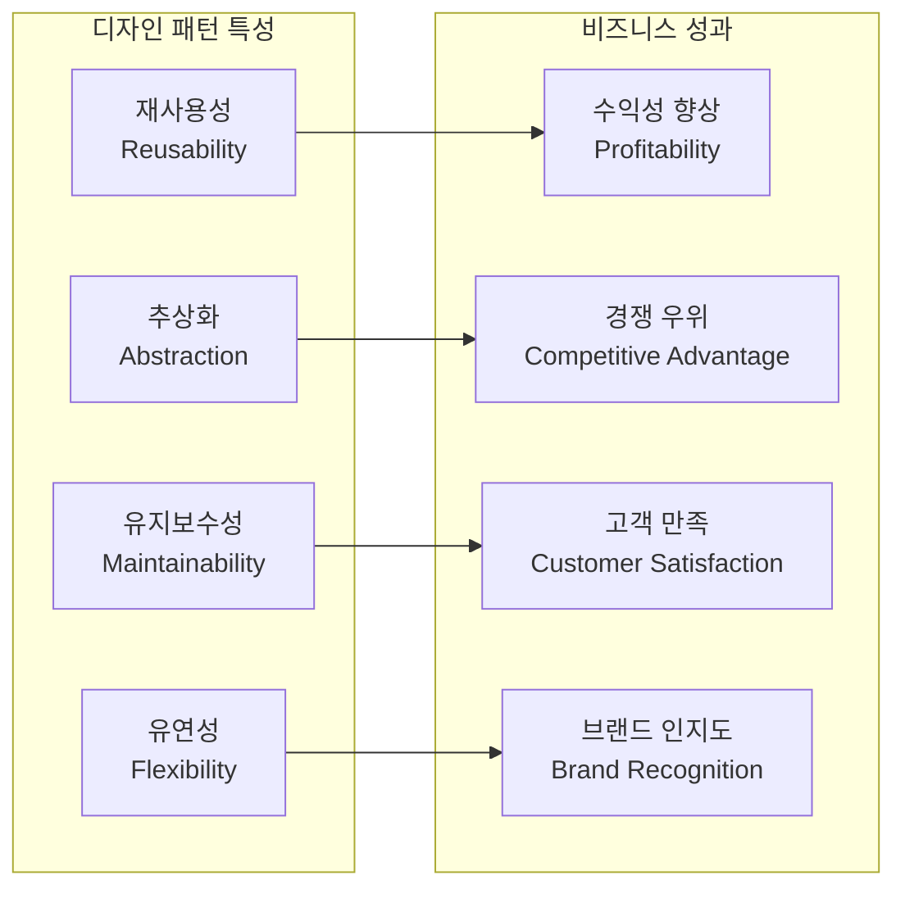

| 디자인 패턴 특성 | 전략적 의도 | 비즈니스 성과 |
|-----------------|------------|--------------|
| **재사용성** | 공통 문제에 대한 솔루션 | 비용 효율적인 소프트웨어 → **수익성 향상** |
| **추상화** | 기능 확장 채널 제공 | 적은 투자로 제품 가치 향상 → **경쟁 우위** |
| **유지보수성** | 쉬운 수정 및 지원 | 안정성 개선 → **고객 만족** |
| **유연성/적응성** | 최소 노력으로 빠른 진화 | 빠른 혁신 → **브랜드 인지도** |

#### 1.2 OKR 기반 전략적 계획 수립

OKR(Objectives and Key Results)은 비즈니스 목표를 정의하고 관리하는 효과적인 프레임워크다.

| 구성요소 | 설명 | 예시 |
|---------|------|------|
| **Purpose** | 조직 가치와 정렬된 고객 가치 | 조직의 디지털 전환 가속화 |
| **Long-term Goals** | 목적과 정렬된 비즈니스 성과 | 소프트웨어 딜리버리 성능 향상 |
| **Actionable Objective** | 가치 창출을 위한 협업 방법 | 빠른 기능 릴리스 및 장애 대응 |
| **Measurable** | 진행과 성공 측정 방법 | 새 기능 및 버그 수정 릴리스 빈도 |

> 💬 **비유**: OKR은 "등산 목표"와 같다. Purpose는 "건강해지기", Long-term Goal은 "에베레스트 등정", Objective는 "매주 5km 등산", Measurable은 "주당 등산 횟수"다.

---

### 2. CI/CD 디자인 패턴의 현황 (State of Play)

#### 2.1 실행 방식별 CI/CD 패턴

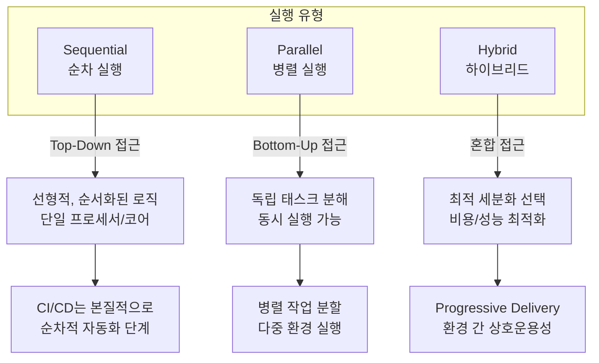

| 실행 유형 | 정의 | CI/CD 적용 |
|----------|------|-----------|
| **Sequential** | 단일 프로세서에서 코드를 순서대로 실행 | CI/CD는 본질적으로 순차적. 이벤트 기반 모델로 진화 가능 |
| **Parallel** | 독립 태스크로 분해하여 동시 실행 | 자동 작업 분할, 다중 클라우드 환경에서 병렬 실행 |
| **Hybrid** | 순차 + 병렬 혼합 | Progressive Delivery, 다중 환경 배포로 상호운용성 확보 |

---

### 3. CI/CD 10년의 발전

2009년 DevOps 등장 이후, CI/CD는 중심적인 역할을 해왔다. 그러나 **표준화와 거버넌스** 측면에서는 여전히 과제가 남아있다.

#### 3.1 CI 프로세스 (잘 정의된 영역)

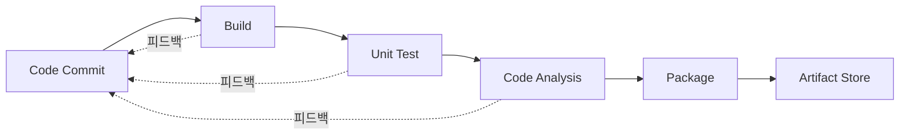

CI의 각 단계에서 피드백 루프를 정의하여 **빠르고 정확한 응답**을 제공할 수 있다.

#### 3.2 CD 프로세스

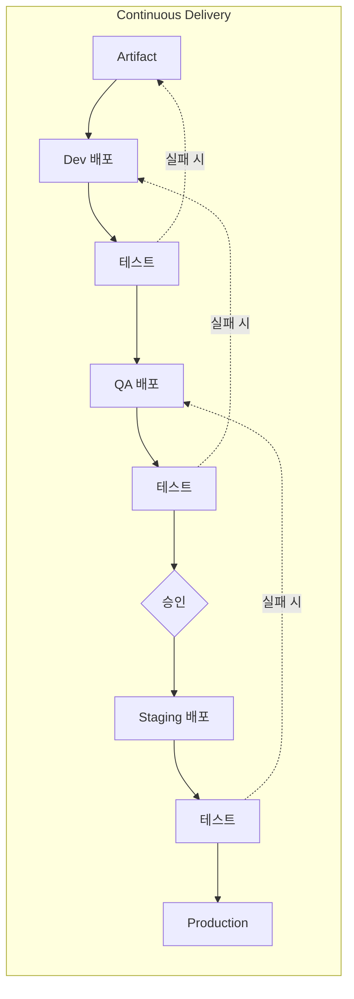

**Continuous Delivery vs Deployment**:
- **Delivery**: 승인자 그룹이 필요, 수동 승인 단계 포함
- **Deployment**: 완전 자동화, 의사결정 게이트 자동 평가

#### 3.3 여전히 해결해야 할 과제

| 영역 | 현재 상태 | 도전 과제 |
|------|----------|----------|
| **Infrastructure Delivery** | 일반 CI/CD 도구로 부족 | 인프라 전용 플랫폼 필요 (OpenTofu 등) |
| **GitOps** | Push → Pull 모델 전환 | 트리거 정의 변경에 팀들이 어려움 겪음 |
| **Scale** | 확장이 가장 큰 도전 | 표준화 없는 설계 또는 설계 부재 |
| **Security** | 파이프라인 자체 보안 부족 | 코드 보안은 하지만 파이프라인 보안은 간과 |

---

### 4. DORA 메트릭 소개

DORA(DevOps Research and Assessment)는 DevOps 딜리버리 프로세스 측정의 표준 프레임워크다.

#### 4.1 DORA 4대 메트릭

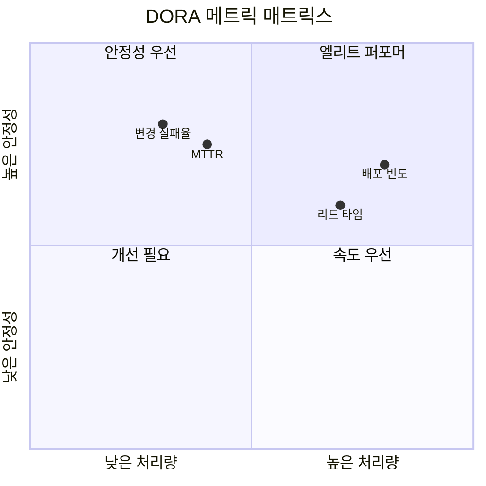

| 카테고리 | 메트릭 | 설명 | 측정 질문 |
|----------|--------|------|----------|
| **Throughput** | Deployment Frequency | 시간당 배포 횟수 | 얼마나 자주 배포하는가? |
| **Throughput** | Lead Time for Changes | 커밋부터 프로덕션까지 시간 | 변경을 전달하는 데 얼마나 걸리는가? |
| **Stability** | Change Failure Rate | 실패한 파이프라인 비율 | 프로세스가 얼마나 안정적인가? |
| **Stability** | MTTR (Mean Time to Restore) | 복구에 걸린 시간 | 장애 복구에 얼마나 걸리는가? |

> 📊 **참고**: DORA는 2020년대 초 **Reliability**를 세 번째 차원으로 도입 (가용성, 확장성, 성능 포함)

#### 4.2 보완 측정 지표

DORA 메트릭만으로는 불충분할 수 있다. 추가 지표로 정확한 분석이 가능하다.

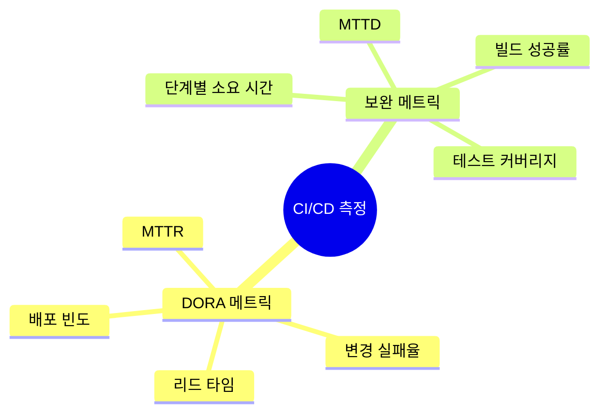

| 보완 메트릭 | 설명 | 활용 |
|------------|------|------|
| **Build Success Rate** | 아티팩트 빌드 성공률 | 실패 원인 분류 (도구/개발/환경) |
| **Stage Duration** | 각 단계별 소요 시간 | 병목 구간 식별 및 개선 |
| **Test Coverage** | 테스트 커버리지 비율 | 높은 실패율 시 중요 지표 |
| **MTTD** (Mean Time to Detect) | 문제 인지까지 시간 | 피드백 루프/알림 개선 필요성 파악 |

#### 4.3 빌드 실패 원인 분류

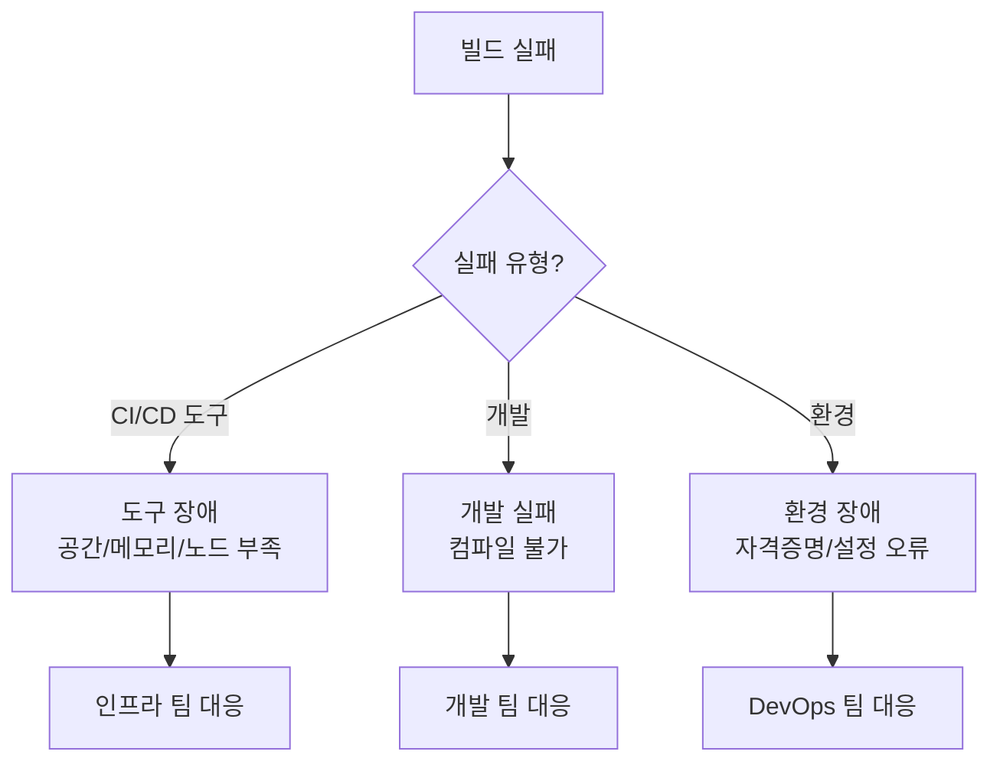

---

### 5. CI/CD 디자인 패턴의 North Star

성숙한 디자인 패턴 확립을 위한 핵심 가이드라인을 정의한다.

#### 5.1 패턴 평가 기준

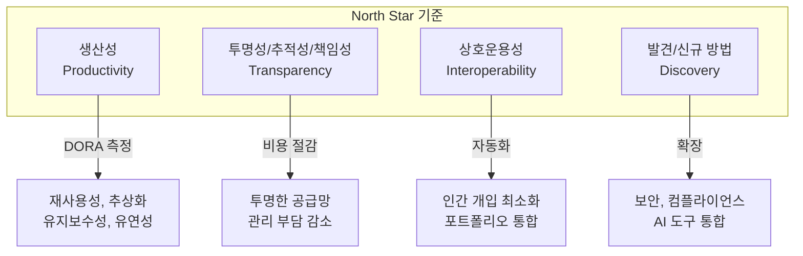

| 기준 | 설명 | 측정 방법 |
|------|------|----------|
| **Productivity** | 재사용성, 추상화, 유지보수성, 유연성 평가 | DORA + 보완 메트릭 |
| **Transparency** | 투명한 공급망으로 관리 비용 절감 | 문서화 수준, 변경 추적성 |
| **Interoperability** | 인간 개입 최소화로 포트폴리오 통합 | 자동화 비율, API 통합도 |
| **Discovery** | 보안, 컴플라이언스, AI 도구 도입 | 신규 도구 도입률, 보안 스캔 커버리지 |

---

### 6. CI/CD 디자인 패턴 도입 확대

#### 6.1 4가지 CI/CD 디자인 패턴 카탈로그

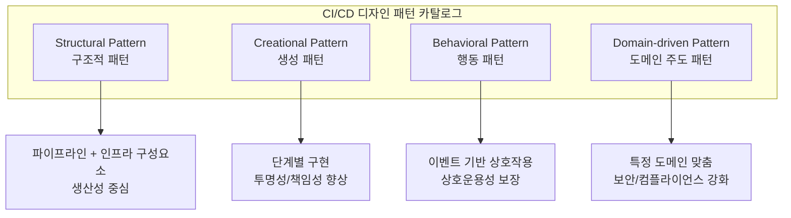

| 패턴 유형 | 핵심 특징 | 주요 목표 | 적합한 상황 |
|----------|----------|----------|------------|
| **Structural** | 파이프라인 + 인프라 통합 | 생산성 | 기본 CI/CD 구축 |
| **Creational** | 클라우드 제공자의 Full-stack 배포 | 투명성, 책임성 | 복잡도 감소 필요 시 |
| **Behavioral** | 이벤트 기반 통신 | 상호운용성, 추적성 | 마이크로서비스 환경 |
| **Domain-driven** | 도메인 특화 설계 | 보안, 컴플라이언스 | 항공, 국방 등 규제 산업 |

#### 6.2 대규모 도입을 위한 필수 요소

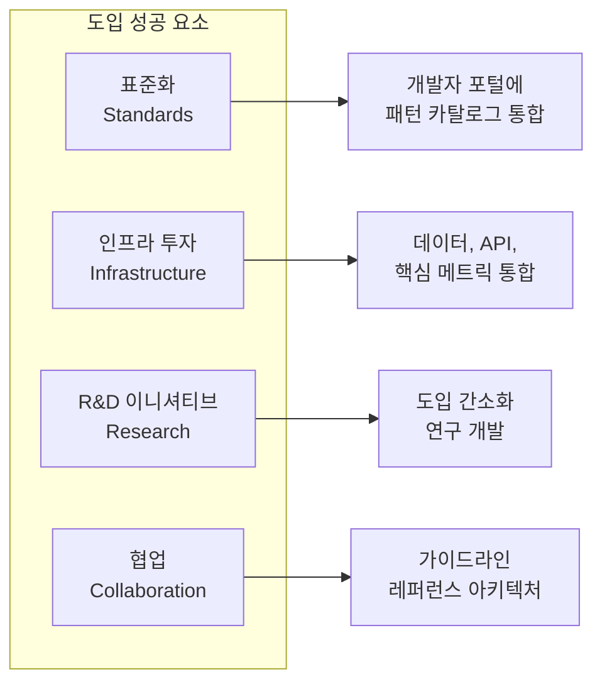

---

### 7. CI/CD 도입 장벽 제거

#### 7.1 주요 장벽과 해결 방안

| 장벽 | 원인 | 해결 방안 |
|------|------|----------|
| **데이터 부족** | CI/CD 도입 현황 조사 미흡 | 커뮤니티 내 데이터 교환 활성화 |
| **기술 인프라 사일로** | 분산된 애플리케이션/인프라 소유권 | 통합 플랫폼 및 거버넌스 구축 |
| **전문가 부족** | 기술 발전 속도 > 인력 양성 속도 | 신속한 업스킬링/리스킬링 프로그램 |
| **비즈니스 협업 부재** | IT와 비즈니스 분리 | 비즈니스 전문가 참여 필수화 |

---

### 8. 변화에 대한 저항 - 문화적 측면

CI/CD는 단순한 자동화가 아니다. DevOps의 **CALMS** 원칙 중 **Culture**가 핵심이다.

#### 8.1 저항의 형태

```mermaid
flowchart TB
    R[변화 저항] --> R1[기존 방식 고수<br/>"우리는 항상 이렇게 해왔다"]
    R --> R2[자동화 두려움<br/>"내 일자리를 뺏길 것이다"]
    R --> R3[통제권 상실 우려<br/>"수동 검증 없이는 불안하다"]

    R1 --> S1[스크립트를 파이프라인으로<br/>그대로 이전]
    R2 --> S2[불필요한 수동 단계 추가]
    R3 --> S3[완전 자동화 회피]
```

#### 8.2 저항 극복 전략

| 저항 유형 | 표면적 이유 | 근본 원인 | 극복 방안 |
|----------|------------|----------|----------|
| **기존 방식 고수** | "작동하니까" | 학습 비용 회피 | 점진적 마이그레이션 + 교육 |
| **자동화 두려움** | "일자리 위협" | 역할 변화 불안 | 새로운 역할 정의 + 성장 기회 제시 |
| **통제권 상실** | "수동 검증 필요" | 신뢰 부족 | 점진적 자동화 + 모니터링 강화 |

> 💬 **핵심**: 표면적인 이유가 아닌 **깊은 문제의 근본 원인**을 찾아야 한다.

#### 8.3 CALMS 프레임워크

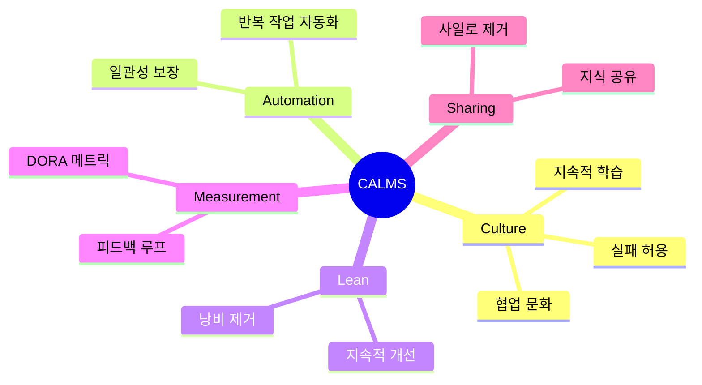

---

## 🔍 심화 학습

### 추가 조사 내용

- **SPACE 프레임워크**: DORA 이후 등장한 개발자 생산성 측정 프레임워크 (Satisfaction, Performance, Activity, Communication, Efficiency)
- **Platform Engineering**: CI/CD를 넘어 내부 개발자 플랫폼(IDP) 구축으로 진화
- **Value Stream Management**: 비즈니스 가치 흐름 관점에서 CI/CD 최적화

### 출처
- [DORA - DevOps Research and Assessment](https://dora.dev)
- [State of DevOps Reports](https://cloud.google.com/devops/state-of-devops)
- [Martin Fowler - Continuous Integration](https://martinfowler.com/articles/continuousIntegration.html)
- [CD Foundation - Best Practices](https://bestpractices.cd.foundation/)

---

## 💡 실무 적용 포인트

### 이런 상황에서 사용하세요

- **경영진에게 CI/CD 투자 설득**: 디자인 패턴 특성 → 비즈니스 성과 연결 테이블 활용
- **팀 성과 측정이 필요할 때**: DORA 4대 메트릭 + 보완 메트릭 조합
- **조직 확대 시 표준화 필요**: 4가지 패턴 카탈로그를 개발자 포털에 통합
- **문화적 저항에 직면했을 때**: 근본 원인 분석 + CALMS 프레임워크 적용

### 주의할 점 / 흔한 실수

- ⚠️ DORA 메트릭만으로 결론 내리면 잘못된 판단 가능 → 보완 메트릭 병행 필수
- ⚠️ 기술팀과 비즈니스팀 분리 시 전략적 정렬 실패 → OKR로 연결
- ⚠️ 파이프라인 보안을 간과하면 공급망 공격에 취약 → Pipeline 자체 보안 고려
- ⚠️ 표면적 저항 이유만 해결하면 반복됨 → 근본 원인 탐색 필요

### 면접에서 나올 수 있는 질문

- Q: DORA 메트릭 4가지는 무엇이고, 각각 무엇을 측정하나요?
- Q: Continuous Delivery와 Continuous Deployment의 차이점은?
- Q: CI/CD 확장 시 가장 큰 도전 과제는 무엇이고 어떻게 해결하나요?
- Q: CI/CD 도입에 대한 조직 저항을 어떻게 극복하나요?
- Q: CALMS 프레임워크의 각 요소를 설명해주세요.

---

## ✅ 핵심 개념 체크리스트

- [ ] 디자인 패턴의 4가지 특성(재사용성, 추상화, 유지보수성, 유연성)을 비즈니스 성과와 연결할 수 있는가?
- [ ] OKR의 Purpose, Goals, Objectives, Measurable을 CI/CD 맥락에서 정의할 수 있는가?
- [ ] Sequential, Parallel, Hybrid 실행 방식의 차이를 설명할 수 있는가?
- [ ] DORA 4대 메트릭(배포 빈도, 리드 타임, 변경 실패율, MTTR)을 설명할 수 있는가?
- [ ] CI/CD가 10년간 발전했음에도 여전히 과제인 4가지 영역(Infrastructure, GitOps, Scale, Security)을 아는가?
- [ ] 4가지 CI/CD 디자인 패턴(Structural, Creational, Behavioral, Domain-driven)을 구분할 수 있는가?
- [ ] 변화 저항의 근본 원인을 찾고 CALMS로 해결하는 방법을 아는가?

---

## 🔗 참고 자료

- 📄 공식 사이트: [DORA - dora.dev](https://dora.dev)
- 📄 CD Foundation: [Best Practices](https://bestpractices.cd.foundation/)
- 📄 Martin Fowler: [Continuous Integration](https://martinfowler.com/articles/continuousIntegration.html)
- 📚 참고 서적: *Strategizing Continuous Delivery in the Cloud* (Garima Bajpai, Thomas Schuetz, 2023)
- 📚 참고 서적: *Design Patterns for Cloud Native Applications* (Kasun Indrasiri, Sriskandarajah Suhothayan, 2021)
- 🎬 추천 영상: [CD Pipeline - TechStrong TV](https://techstrong.tv/videos/cd-pipeline)

---
