---

## 📌 핵심 요약
> 이 장에서는 **구조적 CI/CD 디자인 패턴**을 깊이 탐구한다. 핵심은 **Monorepo vs Polyrepo** 선택, **파이프라인 의존성 관리**, **도구/코드/모듈화**의 핵심 구성요소, 그리고 **RBAC를 통한 접근 제어**를 이해하는 것이다.

## 🎯 학습 목표
이 내용을 읽고 나면:
- [ ] 구조적 디자인 패턴의 3가지 계층(Common Components, Pipeline, Deployment)을 설명할 수 있다
- [ ] Monorepo와 Polyrepo의 차이점과 확장성을 비교할 수 있다
- [ ] 모놀리식 파이프라인과 멀티 파이프라인의 장단점을 분석할 수 있다
- [ ] CI/CD 도구 선택 시 고려해야 할 SaaS, Hybrid, On-premises 모델을 평가할 수 있다
- [ ] 파이프라인 모듈화의 이점과 구현 방법을 설명할 수 있다
- [ ] RBAC를 활용한 CI/CD 접근 제어를 설계할 수 있다

## 📖 본문 정리

### 1. 구조적 디자인 패턴 소개

구조적 디자인 패턴은 CI/CD 구성요소 간의 **관계를 단순화**하고 **복잡성을 제거**하며 **확장성을 촉진**하는 데 초점을 맞춘다.

#### 1.1 3가지 핵심 계층

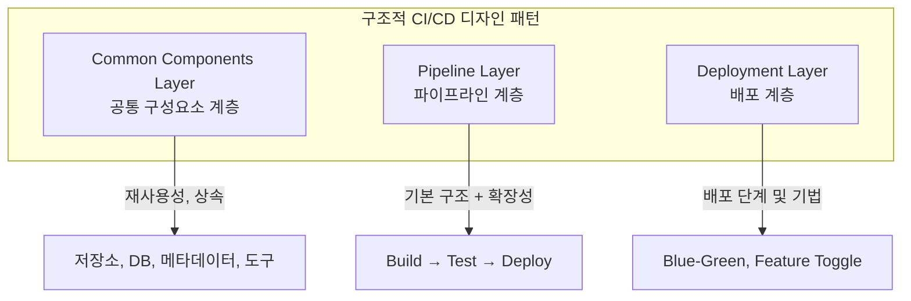

| 계층 | 역할 | 구성 요소 |
|------|------|----------|
| **Common Components** | 재사용성, 상속의 기반 구축 | 저장소 수, DB, 메타데이터, 도구 |
| **Pipeline** | 프로젝트 기본 구조 + 확장 기능 | Build, Test, Deploy 단계 |
| **Deployment** | 배포 단계 및 기법 표현 | Blue-Green, Feature Toggle 등 |

---

### 2. Monorepo vs Polyrepo 확장성

코드 저장 및 관리의 두 가지 접근 방식을 비교한다.

#### 2.1 기본 개념

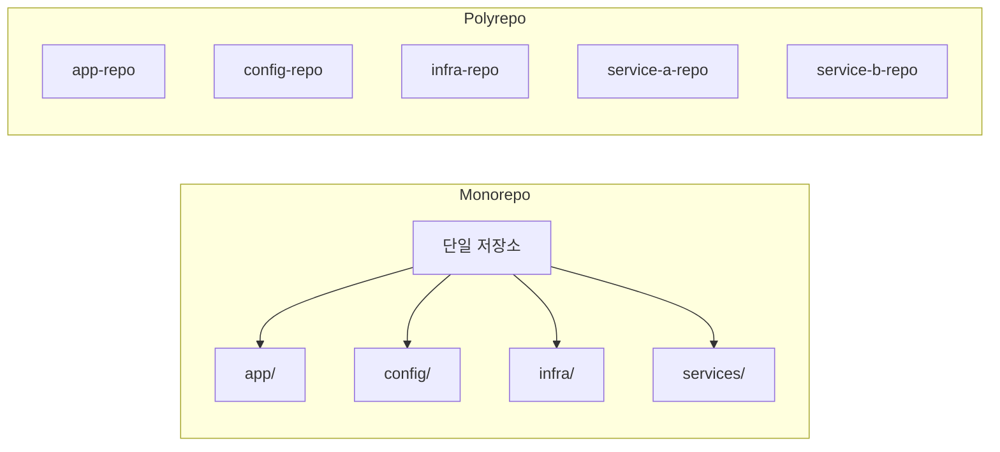

| 구분 | Monorepo | Polyrepo |
|------|----------|----------|
| **정의** | 모든 코드를 하나의 저장소에 저장 | 프로젝트별로 별도 저장소 |
| **범위** | 앱 코드 + 설정 + 인프라 | 각 애플리케이션 별도 관리 |
| **관리** | 중앙화된 관리 | 분산된 관리 |
| **복잡도** | 저장소 내부 복잡 | 저장소 수 관리 복잡 |

#### 2.2 마이크로서비스 아키텍처에서의 접근

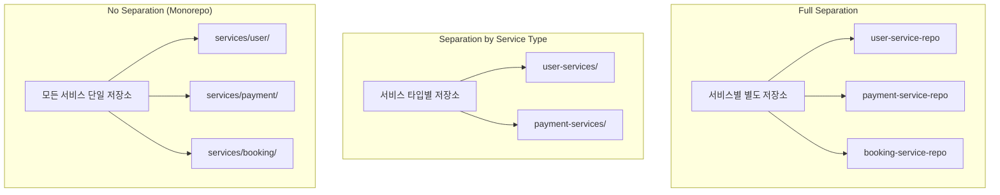

| 접근 방식 | 장점 | 단점 |
|----------|------|------|
| **Full Separation** | 진정한 마이크로서비스 접근 | 많은 저장소 관리 필요 |
| **Service Type 분리** | 설정 단순화, DB 설계 용이 | 서비스 간 경계 모호 가능 |
| **No Separation** | VCS 관리 단순, 개발 편의성 | 대규모 코드베이스 복잡 |

---

### 3. 모놀리식 파이프라인 vs 멀티 파이프라인

#### 3.1 모놀리식 파이프라인

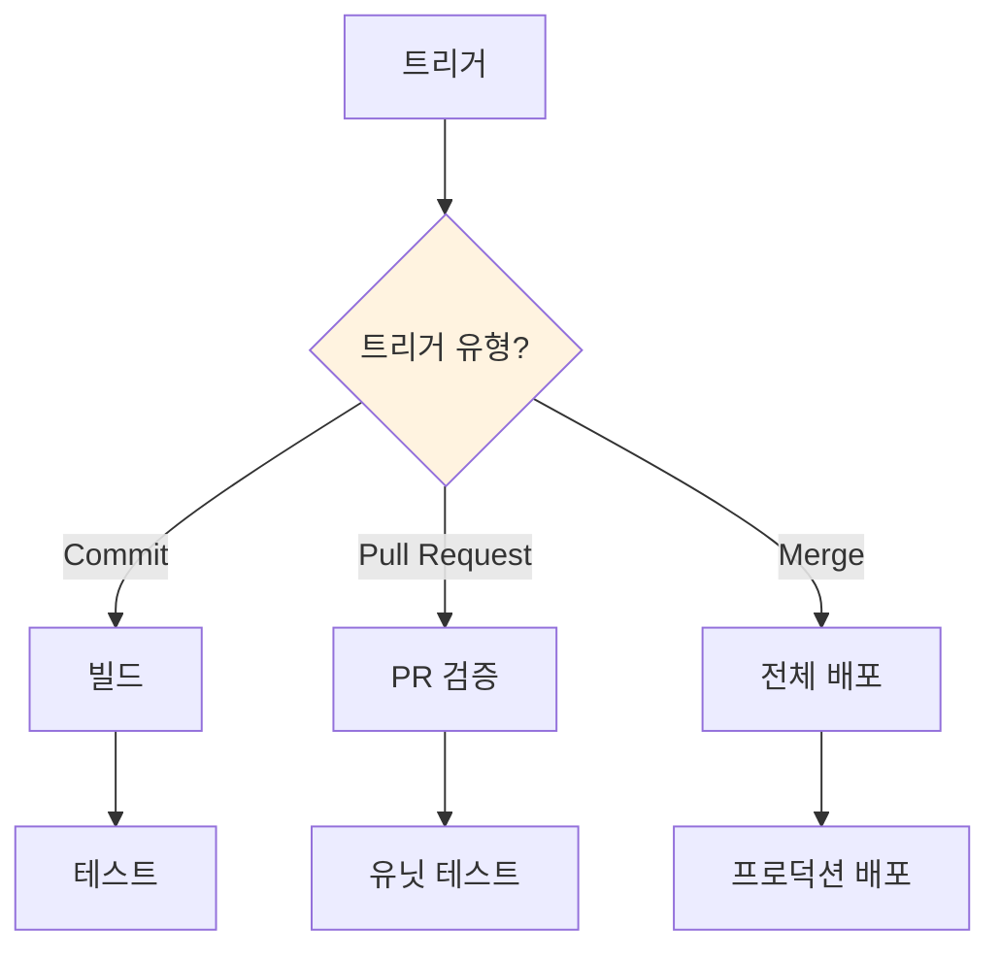

**특징**:
- 하나의 파이프라인에 모든 로직 포함
- 조건문으로 실행 경로 분기
- 제어는 쉬우나 파이프라인 자체가 복잡

#### 3.2 멀티 파이프라인

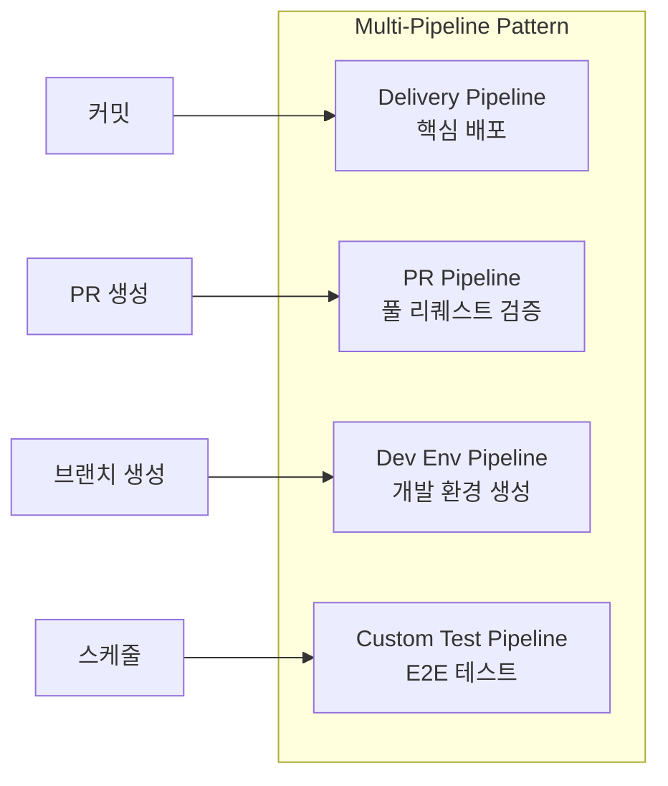

| 파이프라인 유형 | 목적 | 트리거 |
|---------------|------|--------|
| **Delivery Pipeline** | 코드 → 프로덕션 전달 | 커밋, 머지 |
| **PR Pipeline** | 풀 리퀘스트 검증 (커버리지, 유닛 테스트) | PR 생성 |
| **Dev Environment** | 브랜치별 전용 환경 생성 | 브랜치 생성/삭제 |
| **Custom Test** | E2E, 성능 테스트 (장시간) | 스케줄, 수동 |

#### 3.3 접근 방식 선택 시 고려사항

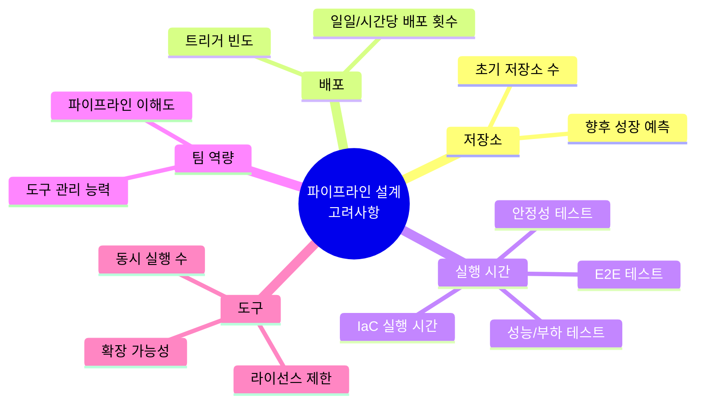

> 💬 **핵심**: 1-2개 저장소에서 접근 방식 변경은 쉽지만, 수백 개로 성장하면 **비용과 노력** 면에서 거의 불가능하다. 초기 설계가 중요하다.

---

### 4. 파이프라인 간 의존성

#### 4.1 확장 유형

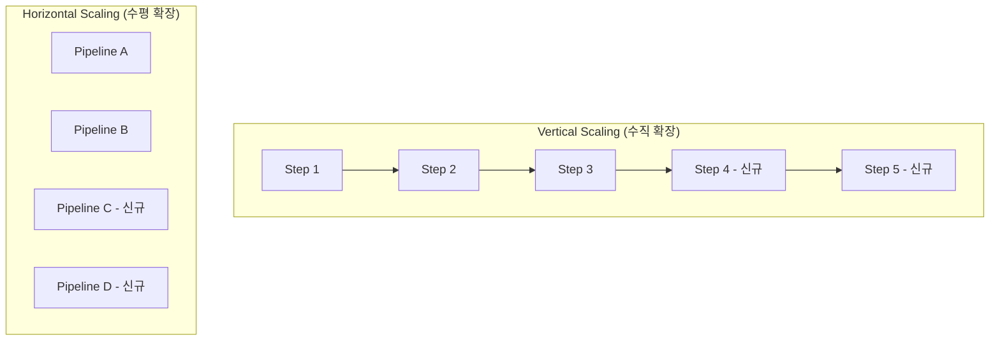

| 확장 유형 | 정의 | 예시 |
|----------|------|------|
| **Vertical** | 기존 파이프라인에 단계 추가 | 새 테스트 구조, 새 환경 추가 |
| **Horizontal** | 새 파이프라인 추가 | 새 프로젝트, 새 프로세스 |

#### 4.2 파이프라인 의존성 모범 사례

| 원칙 | 설명 | 비유 |
|------|------|------|
| **파이프라인 자율성** | 각 파이프라인이 독립적으로 작업 완료 | 마이크로서비스처럼 자율적 |
| **프로세스 자율성** | 논리적 작업 체인 전체 실행 | 시작부터 끝까지 완결 |

#### 4.3 CI와 CD의 경계


**다중 도구 사용 시 고려사항**:
- 새 워크플로우 추가 시 여러 파이프라인 생성 → 혼란
- 수백/수천 개 파이프라인 관리 어려움
- 메트릭 수집 및 모니터링 복잡도 증가

---

### 5. 핵심 구성요소 - 도구 (Tools)

#### 5.1 플랫폼 유형 비교

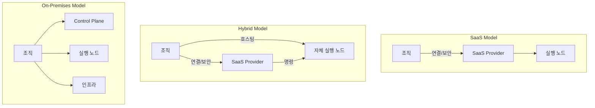

| 모델 | 조직 책임 | 장점 | 단점 |
|------|----------|------|------|
| **SaaS** | 연결 및 보안 | 유연성, 관리 부담 감소 | 제어권 제한 |
| **Hybrid** | 실행 노드 + 연결 | 보안 + 유연성 균형 | 양쪽 단점 병존 가능 |
| **On-Premises** | 전체 인프라 | 최대 유연성, 완전 제어 | 초기 비용, 스킬 요구 높음 |

#### 5.2 도구 선택 시 질문

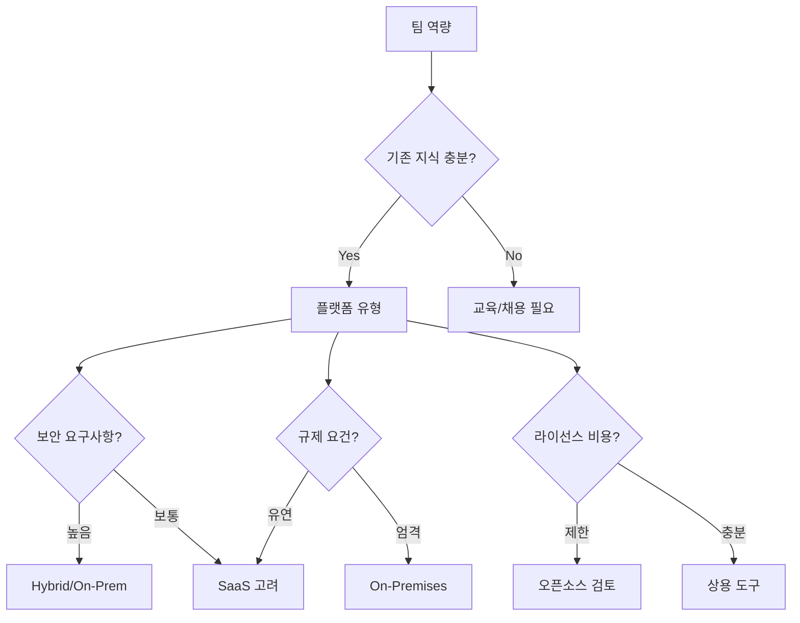

#### 5.3 확장 시 고려사항

| 모델 | 확장 방법 | 주의점 |
|------|----------|--------|
| **SaaS** | 벤더 가격 모델 이해 | 실행 수, 시간, 리소스 기준 확인 |
| **Hybrid** | 자체 노드 + SaaS 관리 조합 | 기술/비즈니스 결정 모두 필요 |
| **On-Premises** | 인프라 아키텍처 설계 | 네트워킹, 측정, 스킬셋 필요 |

---

### 6. 핵심 구성요소 - 코드와 브랜칭 전략

#### 6.1 주요 브랜칭 전략

```mermaid
gitgraph
    commit id: "Initial"
    branch develop
    checkout develop
    commit id: "Feature work"
    branch feature/login
    checkout feature/login
    commit id: "Login impl"
    checkout develop
    merge feature/login
    branch release/1.0
    checkout release/1.0
    commit id: "Release prep"
    checkout main
    merge release/1.0 tag: "v1.0"
```

| 전략 | 특징 | 적합한 상황 |
|------|------|------------|
| **Trunk-based** | 메인 브랜치에 직접 작업, 짧은 브랜치 | 빠른 배포, 소규모 팀 |
| **Gitflow** | develop + main 분리, 복잡한 브랜치 | 대규모 팀, 다중 버전 유지 |
| **GitLab Flow** | Main + Production/Preproduction 참조 | 중간 복잡도, 환경 기반 |

#### 6.2 비즈니스 관점 브랜칭 전략

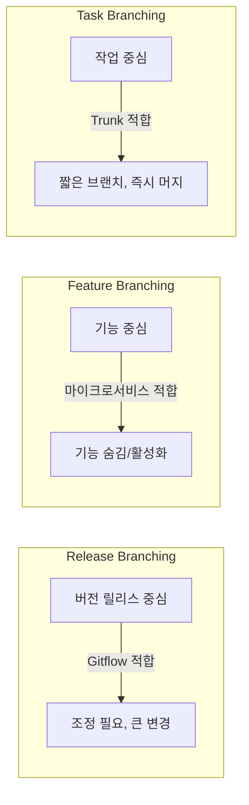

| 전략 | 초점 | 적합한 아키텍처 |
|------|------|----------------|
| **Release Branching** | 특정 버전 릴리스 | 모놀리스, 긴 릴리스 주기 |
| **Feature Branching** | 기능 개발/숨김 | 마이크로서비스 |
| **Task Branching** | 작업 단위 | 애자일 팀, Trunk-based |

---

### 7. 핵심 구성요소 - 모듈화 (Modularity)

모듈화는 **확장성의 핵심 enabler**다. 모듈화 없이는 효과적인 확장이 불가능하다.

#### 7.1 Self-Service 도입

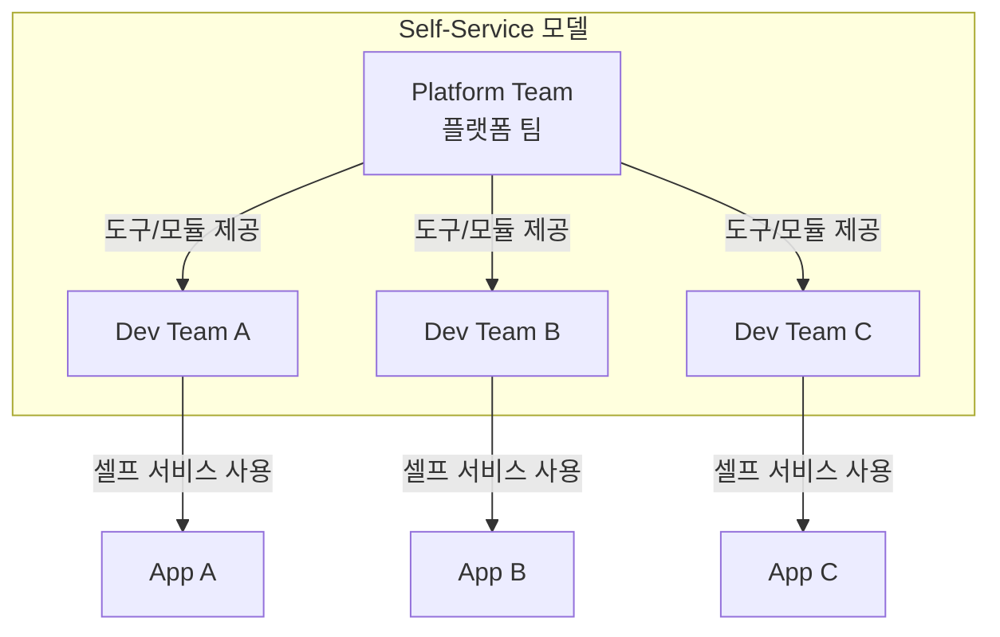

> 💬 **비유**: Self-Service는 "셀프 레스토랑"과 같다. 개발자(고객)가 원하는 음식(도구)을 가져가고, 요리 방법을 알 필요 없이 사용한다.

#### 7.2 아키텍처 모듈화

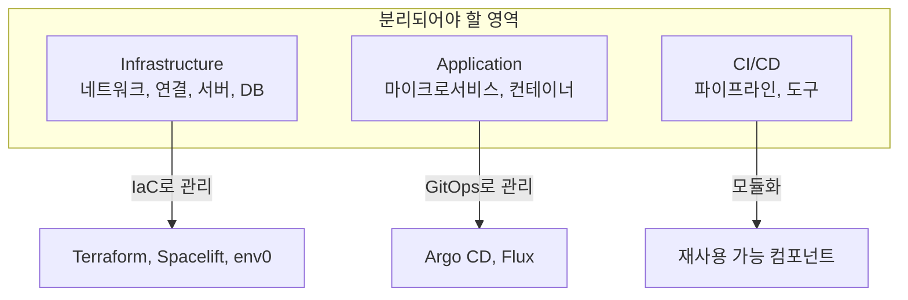

#### 7.3 파이프라인 모듈화 비교

**모듈화 없는 파이프라인 (문제점)**:

```yaml
# 매번 직접 코드 작성
- name: Install AWS CLI
  run: |
    curl "https://awscli.amazonaws.com/awscli-exe-linux-x86_64.zip" -o /tmp/awscliv2.zip
    unzip -q /tmp/awscliv2.zip -d /tmp
    sudo /tmp/aws/install --update
- name: Store artifact
  run: |
    aws s3 sync ./artifacts s3://artifactsbucket
  env:
    AWS_ACCESS_KEY_ID: ${{ secrets.AWS_ACCESS_KEY_ID }}
    AWS_SECRET_ACCESS_KEY: ${{ secrets.AWS_SECRET_ACCESS_KEY }}
```

**모듈화된 파이프라인 (해결책)**:

```yaml
# 재사용 가능한 워크플로우 호출 (1줄)
call-workflow-passing-data:
  uses: organization/repo/.github/workflows/reusable_workflow.yml@main
```

#### 7.4 모듈화의 이점

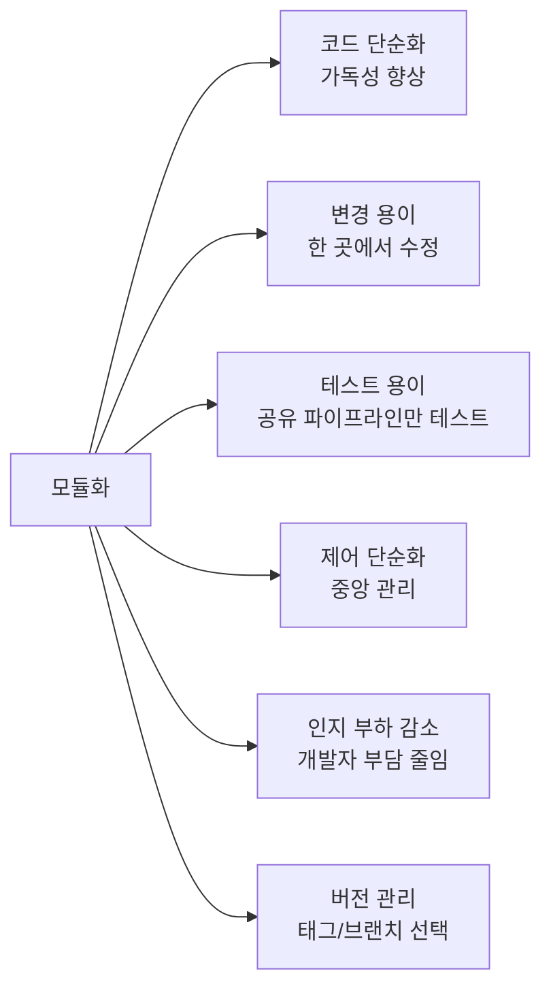

| 직접 코딩 | 모듈화 |
|----------|--------|
| 코드 중복 | 재사용 |
| 오류 위험 높음 | 검증된 모듈 사용 |
| 변경 추적 어려움 | 중앙화된 변경 |
| 모든 파이프라인 수정 | 한 곳만 수정 |

#### 7.5 모듈화 유형

| 유형 | 설명 | 장점 | 단점 |
|------|------|------|------|
| **Reusable Workflows** | 조직 내 재사용 가능 워크플로우 | 완전 제어, 커스텀 가능 | 유지보수 필요 |
| **Third-party Actions** | GitHub Marketplace 등 외부 모듈 | 유지보수 불필요, 버전 관리 | 코드 제어 불가, 보안 검토 필요 |
| **Reusable Components** | 조직 내 작성/관리 컴포넌트 | 제어 + 재사용 | 스킬과 시간 필요 |

**Third-party Action 사용 예시**:

```yaml
# GitHub Marketplace의 Action 사용
- name: Login to AWS
  uses: aws-actions/configure-aws-credentials@v1
  with:
    role-to-assume: ${{ secrets.AWS_CA_ASSUME_ROLE }}
    aws-region: eu-west-1

- uses: jakejarvis/s3-sync-action@master
  env:
    AWS_S3_BUCKET: ${{ secrets.AWS_S3_BUCKET }}
    SOURCE_DIR: 'artifacts'
```

---

### 8. 핵심 구성요소 - 접근 제어 (RBAC)

#### 8.1 RBAC (Role-Based Access Control)

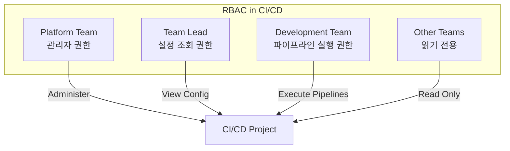

#### 8.2 RBAC 적용 원칙

| 역할 | 권한 | 설명 |
|------|------|------|
| **Platform Team** | 관리 (Administer) | 프로젝트 설정, 파이프라인 구성 |
| **Team Lead** | 설정 조회 | 파이프라인 구성 확인 |
| **Dev Team** | 실행 | 파이프라인 실행, 결과 확인 |
| **Other Teams** | 읽기 전용 | 다른 프로젝트 결과 조회 |

> 💬 **핵심**: RBAC는 복잡한 접근 구조를 만들지만, **모듈화와 마찬가지로 초기 설계 복잡성이 장기적 이점을 가져온다**.

---

## 🔍 심화 학습

### 추가 조사 내용

- **Platform Engineering**: 개발자 셀프 서비스를 위한 내부 개발자 플랫폼(IDP) 구축
- **GitOps 도구 비교**: Argo CD vs Flux vs Jenkins X
- **IaC 전용 배포 도구**: Spacelift, env0, Terraform Cloud 비교

### 출처
- [CI/CD Framework for Scale](https://cicd.run)
- [Atlassian - Branching Strategies](https://www.atlassian.com/agile/software-development/branching)
- [GitHub Actions - Reusable Workflows](https://docs.github.com/en/actions/using-workflows/reusing-workflows)

---

## 💡 실무 적용 포인트

### 이런 상황에서 사용하세요

- **초기 CI/CD 설계 시**: Monorepo vs Polyrepo 결정이 향후 확장성 좌우
- **파이프라인 복잡도 증가 시**: 모듈화로 재사용 가능한 컴포넌트 생성
- **팀 규모 성장 시**: RBAC로 접근 제어 구조화
- **다중 도구 사용 시**: 의존성 관리 전략 수립

### 주의할 점 / 흔한 실수

- ⚠️ 저장소 1-2개일 때 접근 방식 변경은 쉽지만, 수백 개로 성장하면 **경제적으로 불가능**
- ⚠️ 모든 파이프라인을 직접 코딩하면 **변경 추적이 불가능**해짐
- ⚠️ Third-party Action 사용 시 **보안 검토 필수** (특히 규제 환경)
- ⚠️ 확장은 **일관성**을 요구함 - 개발, 관리, 측정 모두에서

### 면접에서 나올 수 있는 질문

- Q: Monorepo와 Polyrepo의 차이점과 각각의 적합한 상황은?
- Q: 모놀리식 파이프라인과 멀티 파이프라인의 장단점은?
- Q: CI/CD 도구 선택 시 SaaS vs Hybrid vs On-Premises를 어떻게 결정하나요?
- Q: 파이프라인 모듈화의 이점과 구현 방법은?
- Q: RBAC란 무엇이고 CI/CD에서 어떻게 적용하나요?

---

## ✅ 핵심 개념 체크리스트

- [ ] 구조적 디자인 패턴의 3가지 계층(Common Components, Pipeline, Deployment)을 설명할 수 있는가?
- [ ] Monorepo와 Polyrepo의 장단점을 비교할 수 있는가?
- [ ] 마이크로서비스에서 Full Separation, Service Type 분리, No Separation 접근을 이해하는가?
- [ ] 모놀리식 파이프라인 vs 멀티 파이프라인 선택 기준을 아는가?
- [ ] SaaS, Hybrid, On-Premises CI/CD 모델의 차이를 설명할 수 있는가?
- [ ] Trunk-based, Gitflow, GitLab Flow 브랜칭 전략을 구분할 수 있는가?
- [ ] 파이프라인 모듈화(Reusable Workflows, Third-party Actions)의 이점을 설명할 수 있는가?
- [ ] RBAC를 활용한 CI/CD 접근 제어를 설계할 수 있는가?

---

## 🔗 참고 자료

- 📄 CI/CD Framework: [cicd.run](https://cicd.run)
- 📄 GitHub Actions: [Reusable Workflows](https://docs.github.com/en/actions/using-workflows/reusing-workflows)
- 📄 Atlassian: [Git Branching Strategies](https://www.atlassian.com/agile/software-development/branching)
- 📄 IaC 도구: [Spacelift](https://spacelift.io), [env0](https://env0.com), [Terraform Cloud](https://cloud.hashicorp.com/products/terraform)
- 🎬 추천 영상: Platform Engineering 관련 CNCF 발표 영상들

---
