---

## 📌 핵심 요약
> 이 장에서는 CI/CD 구조적 설계 패턴에서 **배포 전략**과 **데이터 통합**을 다룬다. 핵심은 **5가지 배포 전략(Blue-Green, Canary, Feature Toggle, A/B Testing, Dark Launch)**의 특성을 이해하고, CI/CD 각 단계에서 생성되는 **데이터 신호**를 활용하여 파이프라인을 최적화하며, **CDEvents**와 **SLSA** 프레임워크로 상호운용성과 보안을 강화하는 것이다.

## 🎯 학습 목표
이 내용을 읽고 나면:
- [ ] 5가지 배포 전략(Blue-Green, Canary, Feature Toggle, A/B, Dark Launch)의 차이점과 적용 상황을 설명할 수 있다
- [ ] CI/CD 각 단계(Code, Build, Test, Deploy, Post-deploy)에서 생성되는 데이터 신호를 식별할 수 있다
- [ ] CDEvents와 SLSA 프레임워크의 역할과 중요성을 이해할 수 있다
- [ ] Segregation of Duties(SoD)와 RBAC를 통한 보안 강화 방법을 구현할 수 있다
- [ ] Open Policy Agent(OPA)를 활용한 정책 기반 접근 제어를 설계할 수 있다

## 📖 본문 정리

### 1. 배포 전략 (Deployment Strategies)

5가지 주요 배포 전략의 특성과 적용 상황을 이해하자.

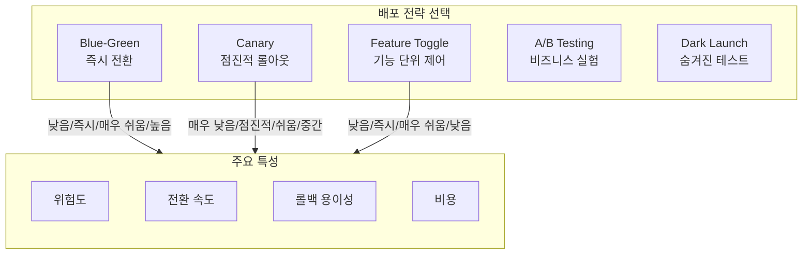

#### 1.1 Blue-Green 배포

두 개의 동일한 환경을 운영하며 트래픽을 즉시 전환하는 전략.

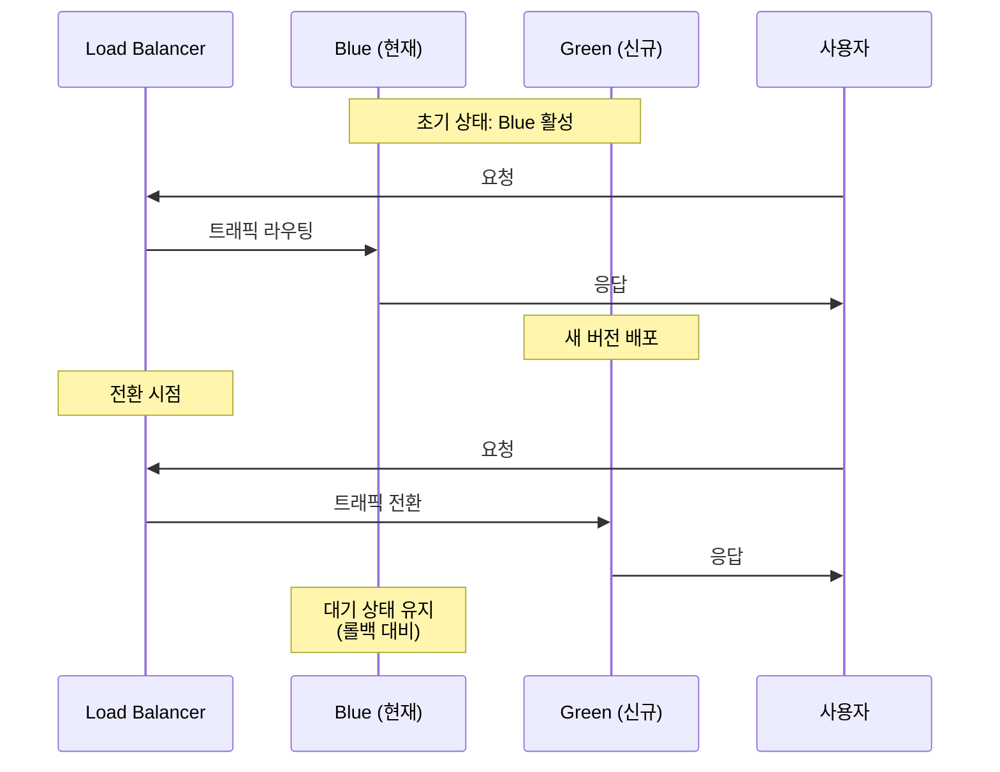

| 장점 | 단점 |
|------|------|
| 즉각적인 롤백 가능 | 인프라 비용 2배 |
| 다운타임 없음 | 데이터베이스 마이그레이션 복잡 |
| 전체 환경 테스트 가능 | 상태 동기화 필요 |

#### 1.2 Canary 배포

새 버전을 소수의 사용자에게 먼저 노출하고 점진적으로 확대하는 전략.

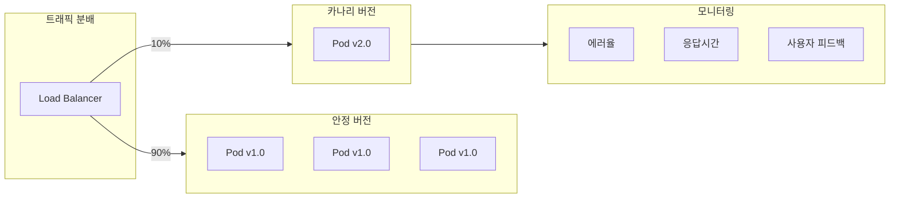

**Kubernetes 카나리 배포 예시:**

```yaml
# 카나리 배포 가중치 설정
apiVersion: networking.k8s.io/v1
kind: Ingress
metadata:
  name: canary-ingress
  annotations:
    # 카나리 활성화
    nginx.ingress.kubernetes.io/canary: "true"
    # 10% 트래픽을 카나리로 라우팅
    nginx.ingress.kubernetes.io/canary-weight: "10"
spec:
  rules:
  - host: app.example.com
    http:
      paths:
      - path: /
        pathType: Prefix
        backend:
          service:
            name: app-canary
            port:
              number: 80
```

**카나리 배포 단계:**

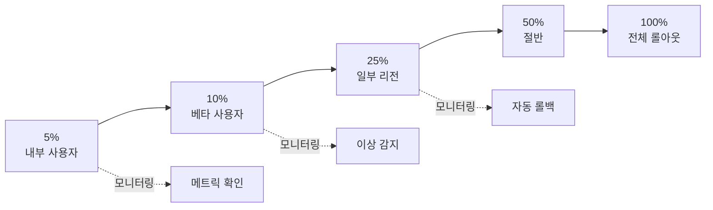

#### 1.3 Feature Toggle (기능 플래그)

코드는 배포하되 기능 활성화를 런타임에 제어하는 전략.

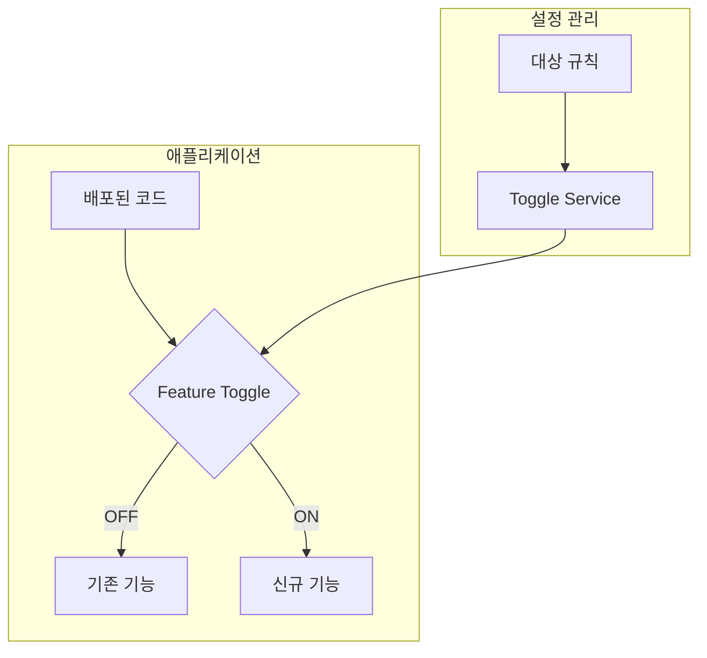

**Feature Toggle 유형:**

| 유형 | 수명 | 용도 | 예시 |
|------|------|------|------|
| **Release Toggle** | 단기 | 불완전한 기능 숨기기 | 신규 결제 시스템 |
| **Experiment Toggle** | 단기 | A/B 테스트 | UI 변경 실험 |
| **Ops Toggle** | 중기 | 운영 제어 | 부하 시 기능 비활성화 |
| **Permission Toggle** | 장기 | 권한 기반 기능 | 프리미엄 기능 |

#### 1.4 A/B Testing

사용자를 그룹으로 나누어 다른 버전을 보여주고 비즈니스 지표를 비교하는 전략.

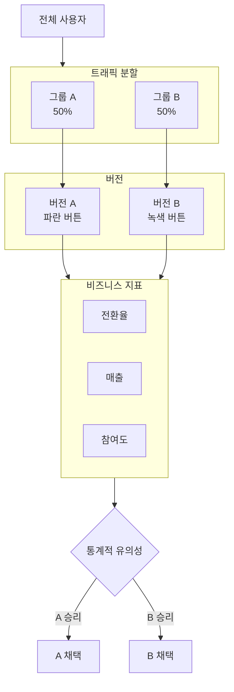

> 💬 **Canary vs A/B Testing**: Canary는 **기술적 안정성** 검증(에러율, 응답시간)이 목적이고, A/B Testing은 **비즈니스 효과** 검증(전환율, 매출)이 목적이다.

#### 1.5 Dark Launch (숨겨진 배포)

사용자에게 보이지 않게 새 기능을 배포하고 실제 트래픽으로 테스트하는 전략.

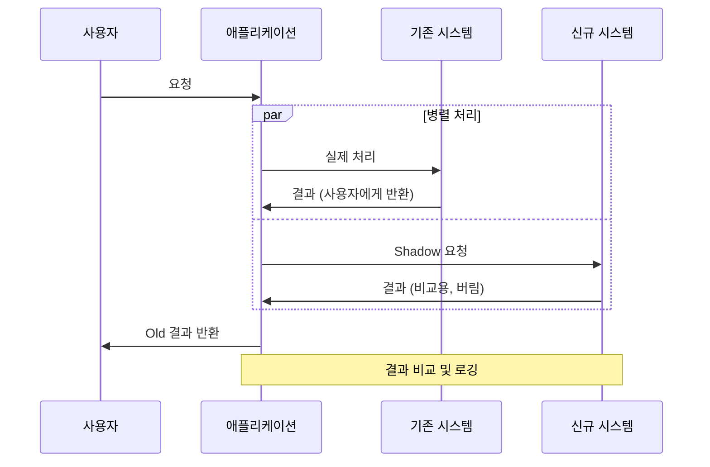

---

### 2. 배포 전략 비교

| 전략 | 위험도 | 롤백 | 비용 | 사용자 영향 | 적합한 상황 |
|------|--------|------|------|-------------|-------------|
| **Blue-Green** | 중간 | 즉시 | 높음 | 전체 | 중요 릴리스 |
| **Canary** | 낮음 | 점진적 | 중간 | 일부 | 대규모 서비스 |
| **Feature Toggle** | 낮음 | 즉시 | 낮음 | 선택적 | 빠른 피드백 필요 |
| **A/B Testing** | 낮음 | 즉시 | 중간 | 분할 | 비즈니스 실험 |
| **Dark Launch** | 매우 낮음 | 불필요 | 중간 | 없음 | 고위험 변경 |

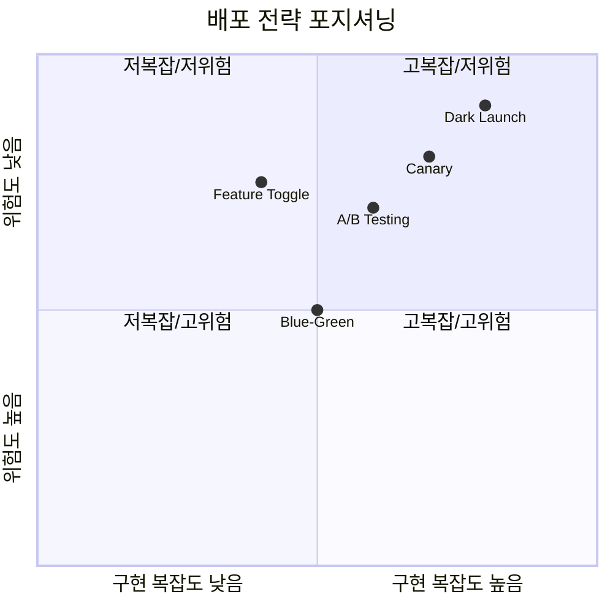

---

### 3. CI/CD 단계별 데이터 신호

각 CI/CD 단계에서 생성되는 데이터를 활용하여 파이프라인을 최적화할 수 있다.

```mermaid
flowchart LR
    subgraph Code["1. Code 단계"]
        C1[커밋 메타데이터]
        C2[PR/MR 정보]
        C3[코드 리뷰 결과]
        C4[정적 분석 결과]
    end

    subgraph Build["2. Build 단계"]
        B1[빌드 로그]
        B2[의존성 정보]
        B3[아티팩트 메타데이터]
        B4[SBOM]
    end

    subgraph Test["3. Test 단계"]
        T1[테스트 결과]
        T2[커버리지 리포트]
        T3[성능 벤치마크]
        T4[보안 스캔 결과]
    end

    subgraph Deploy["4. Deploy 단계"]
        D1[배포 매니페스트]
        D2[환경 구성]
        D3[승인 기록]
        D4[롤아웃 상태]
    end

    subgraph PostDeploy["5. Post-Deploy"]
        P1[APM 메트릭]
        P2[로그 분석]
        P3[사용자 피드백]
        P4[에러 트래킹]
    end

    Code --> Build --> Test --> Deploy --> PostDeploy
```

#### 단계별 주요 데이터 신호

| 단계 | 데이터 신호 | 활용 방안 |
|------|-------------|-----------|
| **Code** | 커밋 빈도, 코드 복잡도, 리뷰 시간 | 개발자 생산성 측정, 병목 식별 |
| **Build** | 빌드 시간, 성공률, 의존성 변경 | 빌드 최적화, 캐싱 전략 |
| **Test** | 테스트 통과율, 커버리지, Flaky 테스트 | 테스트 품질 개선, 우선순위화 |
| **Deploy** | 배포 빈도, 롤백률, 승인 지연 | 프로세스 개선, 자동화 확대 |
| **Post-Deploy** | MTTR, 에러율, 사용자 만족도 | 서비스 품질 모니터링 |

---

### 4. CDEvents 표준

CDEvents는 CI/CD 도구 간 **상호운용성**을 위한 이벤트 표준이다.

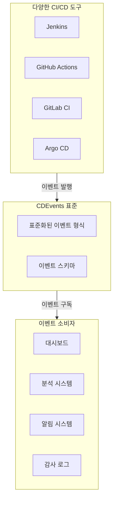

**CDEvents 이벤트 카테고리:**

| 카테고리 | 이벤트 예시 | 설명 |
|----------|-------------|------|
| **Core** | `dev.cdevents.pipelinerun.started` | 파이프라인 실행 시작 |
| **Source Code** | `dev.cdevents.change.merged` | 코드 변경 병합 |
| **Build** | `dev.cdevents.artifact.packaged` | 아티팩트 패키징 완료 |
| **Test** | `dev.cdevents.testcaserun.finished` | 테스트 케이스 실행 완료 |
| **Deployment** | `dev.cdevents.service.deployed` | 서비스 배포 완료 |

---

### 5. SLSA (Supply-chain Levels for Software Artifacts)

SLSA는 소프트웨어 공급망 보안을 위한 프레임워크이다.

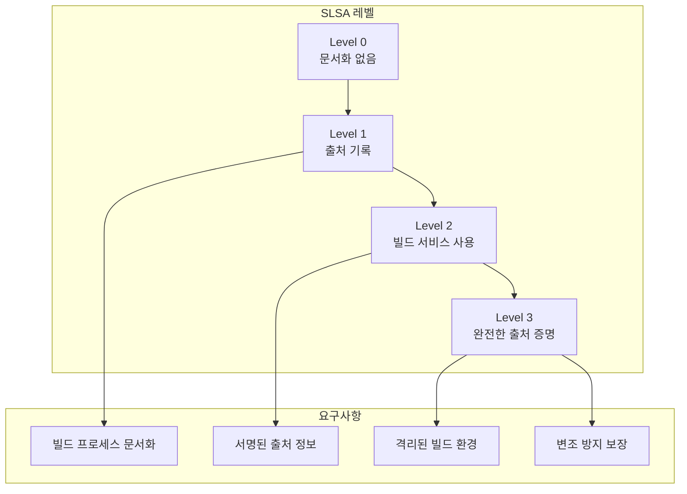

**SLSA 레벨별 요구사항:**

| 레벨 | 요구사항 | 보호 대상 |
|------|----------|-----------|
| **Level 1** | 빌드 프로세스 문서화, 출처 생성 | 실수로 인한 변조 |
| **Level 2** | 호스팅된 빌드 서비스, 서명된 출처 | 변조 시도 감지 |
| **Level 3** | 격리된 빌드, 소스-빌드 무결성 | 정교한 공격 방어 |

---

### 6. Segregation of Duties (SoD)

업무 분리는 한 사람이 중요한 프로세스의 모든 단계를 통제하지 못하도록 하는 보안 원칙이다.

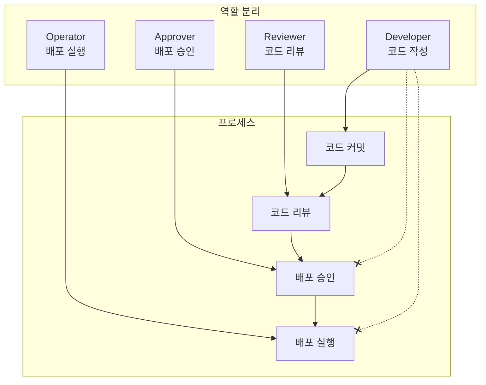

**SoD 구현 패턴:**

| 역할 | 권한 | 제한 |
|------|------|------|
| **Developer** | 코드 작성, 테스트 | 자신의 코드 리뷰/승인 불가 |
| **Reviewer** | 코드 리뷰, 머지 | 리뷰한 코드 배포 승인 불가 |
| **Approver** | 배포 승인 | 직접 배포 실행 불가 |
| **Operator** | 배포 실행 | 승인 권한 없음 |

---

### 7. RBAC (Role-Based Access Control)

역할 기반 접근 제어는 사용자에게 역할을 할당하고, 역할에 권한을 부여하는 방식이다.

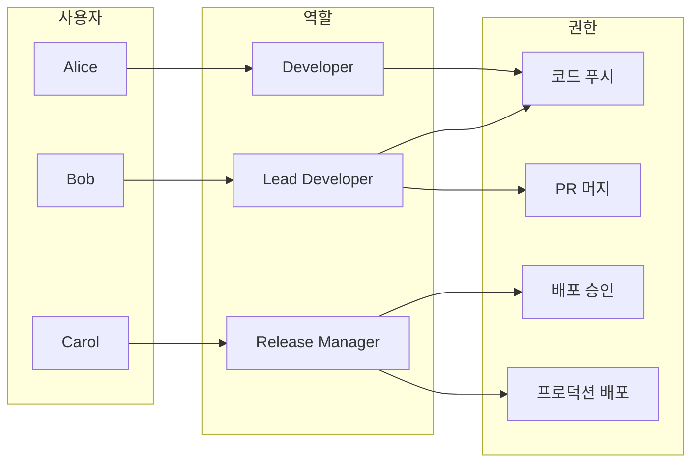

**GitHub Actions RBAC 예시:**

```yaml
# 환경별 승인 규칙 설정
name: Production Deployment

on:
  push:
    branches: [main]

jobs:
  deploy:
    runs-on: ubuntu-latest
    # 프로덕션 환경에 배포 (승인 필요)
    environment:
      name: production
      # 승인자: release-managers 팀
      # 최소 2명 승인 필요

    steps:
      - uses: actions/checkout@v4

      - name: Deploy to Production
        run: |
          echo "Deploying to production..."
          # 배포 스크립트 실행
```

---

### 8. Open Policy Agent (OPA)

OPA는 정책을 코드로 정의하고 일관되게 적용하는 범용 정책 엔진이다.

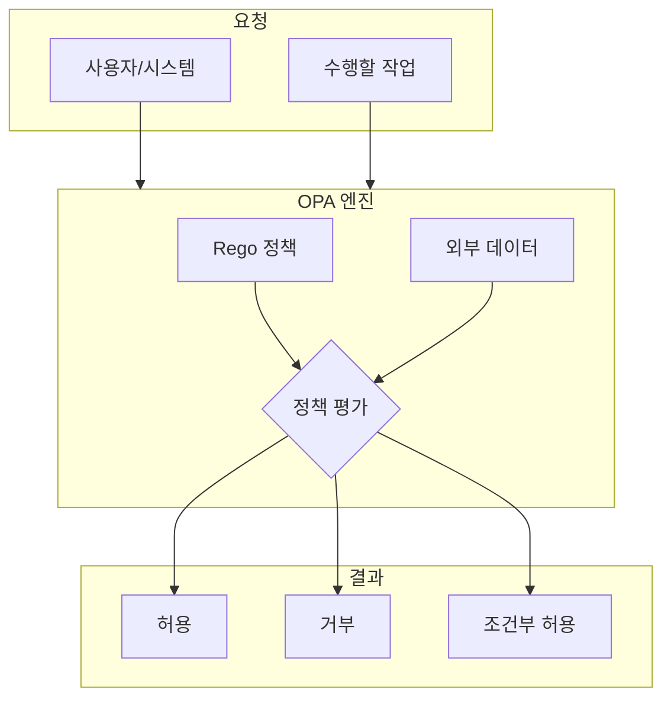

**OPA Rego 정책 예시:**

```rego
# CI/CD 파이프라인 정책
package cicd.policy

# 기본적으로 배포 거부
default allow_deploy = false

# 배포 허용 조건
allow_deploy {
    # 조건 1: 모든 테스트 통과
    input.tests_passed == true

    # 조건 2: 보안 스캔 통과
    input.security_scan_passed == true

    # 조건 3: 최소 1명 이상의 리뷰어 승인
    count(input.approvers) >= 1

    # 조건 4: 승인자가 코드 작성자가 아님
    not author_is_approver
}

# 작성자가 승인자인지 확인
author_is_approver {
    input.author == input.approvers[_]
}

# 프로덕션 배포 추가 조건
allow_production_deploy {
    allow_deploy

    # 추가 조건: 최소 2명 이상의 승인
    count(input.approvers) >= 2

    # 추가 조건: 릴리스 매니저 역할 필요
    input.approvers[_].role == "release_manager"
}
```

**OPA 적용 영역:**

| 영역 | 적용 사례 |
|------|-----------|
| **Kubernetes** | 네임스페이스 정책, 리소스 제한, 이미지 정책 |
| **CI/CD** | 배포 승인, 브랜치 보호, 머지 규칙 |
| **API Gateway** | 인증/인가, Rate Limiting, 라우팅 |
| **Terraform** | 리소스 생성 제한, 태깅 정책, 비용 제어 |

---

### 9. 승인 흐름 (Approval Flow)

배포 승인을 자동화하고 감사 추적을 유지하는 패턴.

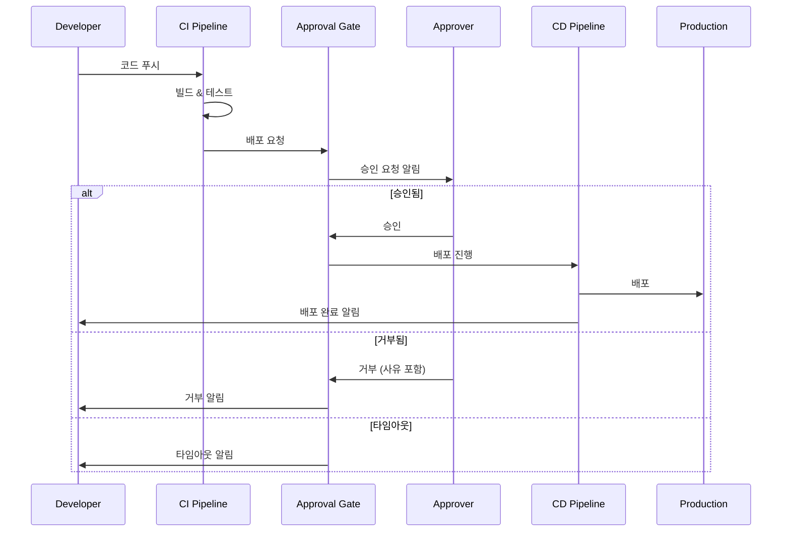

**GitHub Actions 승인 게이트 설정:**

```yaml
# .github/workflows/production-deploy.yml
name: Production Deployment

on:
  push:
    branches: [main]

jobs:
  build-and-test:
    runs-on: ubuntu-latest
    steps:
      - uses: actions/checkout@v4
      - name: Build and Test
        run: |
          npm ci
          npm test

  deploy-staging:
    needs: build-and-test
    runs-on: ubuntu-latest
    environment: staging
    steps:
      - name: Deploy to Staging
        run: echo "Deploying to staging..."

  # 프로덕션 배포 (수동 승인 필요)
  deploy-production:
    needs: deploy-staging
    runs-on: ubuntu-latest
    environment:
      name: production
      # 승인 설정은 GitHub 저장소 Settings에서 구성
    steps:
      - name: Deploy to Production
        run: echo "Deploying to production..."
```

---

## 🔍 심화 학습

### 추가 조사 내용

- **Progressive Delivery**: Canary, Blue-Green을 넘어 Flagger, Argo Rollouts 같은 도구로 자동화된 점진적 배포 구현
- **GitOps와 배포 전략**: ArgoCD, Flux와 함께 선언적 배포 전략 적용
- **Observability 통합**: OpenTelemetry를 활용한 배포 단계별 추적 및 모니터링

### 출처
- [CDEvents 공식 문서](https://cdevents.dev/)
- [SLSA 프레임워크](https://slsa.dev/)
- [Open Policy Agent 문서](https://www.openpolicyagent.org/docs/latest/)
- [CNCF Continuous Delivery Foundation](https://cd.foundation/)

---

## 💡 실무 적용 포인트

### 이런 상황에서 사용하세요

- **Blue-Green**: 다운타임 없는 중요 릴리스, 빠른 롤백이 필수인 경우
- **Canary**: 대규모 사용자 기반, 점진적 검증이 필요한 경우
- **Feature Toggle**: 빠른 실험, 기능별 롤백이 필요한 경우
- **A/B Testing**: 비즈니스 지표 기반 의사결정이 필요한 경우
- **Dark Launch**: 고위험 백엔드 변경, 성능 테스트가 필요한 경우

### 주의할 점 / 흔한 실수

- ⚠️ **Feature Toggle 부채**: 토글을 제거하지 않으면 코드 복잡도가 증가하므로 정기적인 정리 필요
- ⚠️ **카나리 메트릭 부족**: 에러율만 보지 말고 비즈니스 메트릭도 함께 모니터링
- ⚠️ **SoD 우회**: 긴급 상황에서도 승인 프로세스를 우회하지 말고 사후 감사로 대응
- ⚠️ **OPA 정책 복잡도**: 정책이 복잡해지면 테스트가 어려워지므로 모듈화 필요

### 면접에서 나올 수 있는 질문

- Q: Blue-Green과 Canary 배포의 차이점과 각각 언제 사용해야 하나요?
- Q: Feature Toggle을 사용할 때 주의해야 할 점은 무엇인가요?
- Q: SLSA 프레임워크의 각 레벨이 보호하는 위협은 무엇인가요?
- Q: Segregation of Duties가 CI/CD에서 왜 중요한가요?
- Q: OPA를 CI/CD 파이프라인에 어떻게 통합할 수 있나요?

---

## ✅ 핵심 개념 체크리스트

- [ ] 5가지 배포 전략의 장단점과 적용 상황을 설명할 수 있는가?
- [ ] Canary 배포에서 트래픽 가중치를 설정하는 방법을 알고 있는가?
- [ ] CDEvents가 해결하려는 문제를 이해하고 있는가?
- [ ] SLSA 레벨별 요구사항을 구분할 수 있는가?
- [ ] SoD 원칙을 CI/CD 파이프라인에 어떻게 적용하는지 알고 있는가?
- [ ] OPA Rego 정책의 기본 구조를 이해하고 있는가?
- [ ] GitHub Actions에서 환경별 승인 게이트를 설정할 수 있는가?

---

## 🔗 참고 자료

- 📄 공식 문서: [CDEvents Specification](https://cdevents.dev/docs/)
- 📄 공식 문서: [SLSA Framework](https://slsa.dev/spec/v1.0/)
- 📄 공식 문서: [Open Policy Agent](https://www.openpolicyagent.org/)
- 🎬 추천 영상: [CNCF Webinars on CD](https://www.youtube.com/@caboracicd)
- 📚 연관 서적: "Continuous Delivery" by Jez Humble

---
