---

## 📌 핵심 요약
> 이 장에서는 CI/CD의 **행동 설계 패턴(Behavioral Design Patterns)**과 **AI 기반 관찰성(Observability)**을 다룬다. 핵심은 **10가지 행동 패턴**(Chain of Responsibility, Command, Observer, Strategy 등)을 이해하고, **BDD(Behavior-Driven Development)** 실천법을 CI/CD에 통합하며, **AI 기반 모니터링**으로 장애를 사전에 예측하고 대응하는 것이다.

## 🎯 학습 목표
이 내용을 읽고 나면:
- [ ] 10가지 행동 설계 패턴의 CI/CD 적용 방법을 설명할 수 있다
- [ ] Observer, Strategy, Command 패턴의 파이프라인 적용 사례를 구현할 수 있다
- [ ] BDD(Behavior-Driven Development)와 CI/CD 통합 방법을 이해할 수 있다
- [ ] AI 기반 관찰성의 역할과 주요 도구를 설명할 수 있다
- [ ] 행동 설계 패턴 구현의 도전과제와 해결 방안을 식별할 수 있다

## 📖 본문 정리

### 1. 행동 설계 패턴 개요

행동 패턴(Behavioral Patterns)은 객체 간의 **알고리즘과 책임 할당**을 다루며, 런타임에 복잡한 제어 흐름을 관리한다.

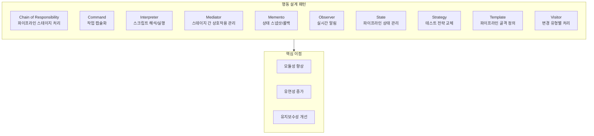

> 💬 **비유**: 행동 패턴은 오케스트라의 악보와 같다. 각 악기(객체)가 언제, 어떻게 연주(행동)할지 정의하여 조화로운 음악(시스템)을 만든다.

---

### 2. 10가지 행동 설계 패턴

#### 2.1 Chain of Responsibility (책임 연쇄)

파이프라인 스테이지(Build → Test → Deploy)를 체인으로 연결하여 요청을 순차 처리한다.

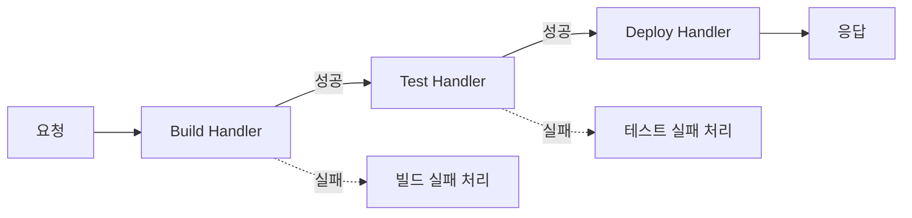

| 특징 | 설명 |
|------|------|
| **디커플링** | 발신자와 수신자 분리 |
| **동적 구성** | 런타임에 스테이지 추가/제거 가능 |
| **독립적 실패 처리** | 각 스테이지별 실패 처리 로직 |

#### 2.2 Command (명령)

각 작업을 객체로 캡슐화하여 큐잉, 로깅, 되돌리기를 지원한다.

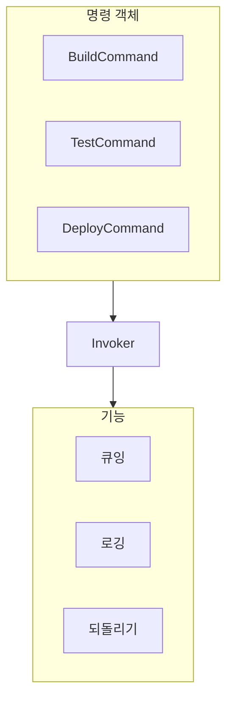

#### 2.3 Interpreter (인터프리터)

파이프라인 스크립트를 해석하고 실행한다.

```yaml
# 파이프라인 DSL 예시
pipeline:
  stages:
    - name: build
      script: "mvn clean package"
    - name: test
      script: "mvn test"
    - name: deploy
      script: "./deploy.sh"
```

#### 2.4 Mediator (중재자)

스테이지 간 직접 통신 대신 중재자를 통해 상호작용을 관리한다.

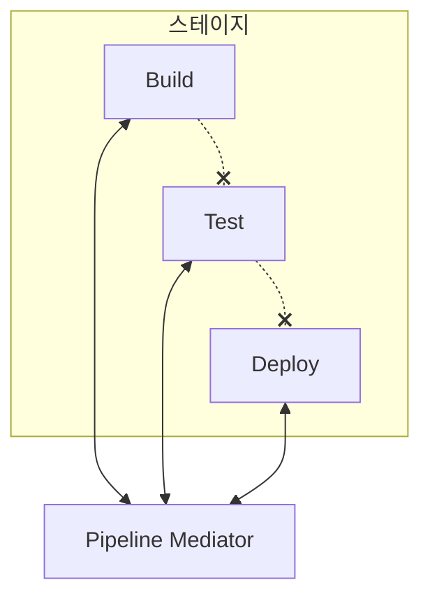

| 장점 | 설명 |
|------|------|
| **느슨한 결합** | 스테이지 간 직접 의존성 제거 |
| **변경 용이성** | 개별 스테이지 독립적 수정 가능 |

#### 2.5 Memento (메멘토)

시스템 상태를 스냅샷으로 저장하여 롤백을 지원한다.

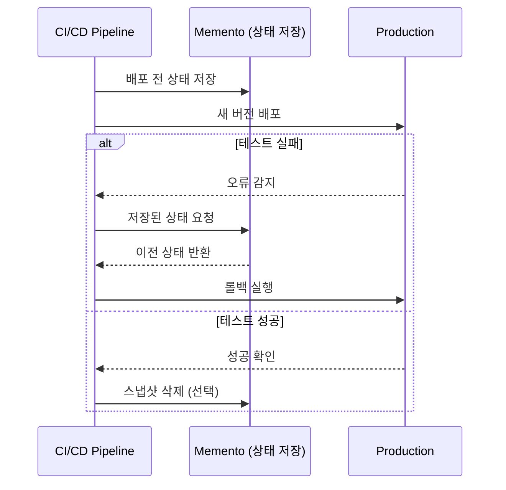

**적용 사례:**
- Blue-Green 배포 시 라이브 환경 상태 캡처
- 테스트 전 시스템 스냅샷 생성
- 배포 실패 시 롤백

#### 2.6 Observer (관찰자)

상태 변경 시 관련 객체들에게 자동으로 알린다.

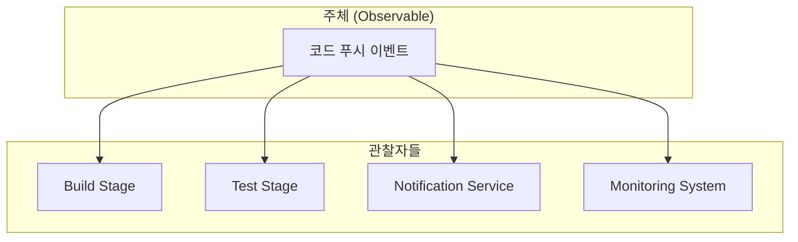

| 적용 | 설명 |
|------|------|
| **빌드 트리거** | 코드 푸시 시 빌드 자동 시작 |
| **실패 알림** | 빌드 실패 시 후속 스테이지에 중단 알림 |
| **모듈성** | 각 스테이지 독립적 동작 |

#### 2.7 State (상태)

파이프라인 상태(Idle, Building, Testing, Deploying, Success, Failure)를 관리한다.

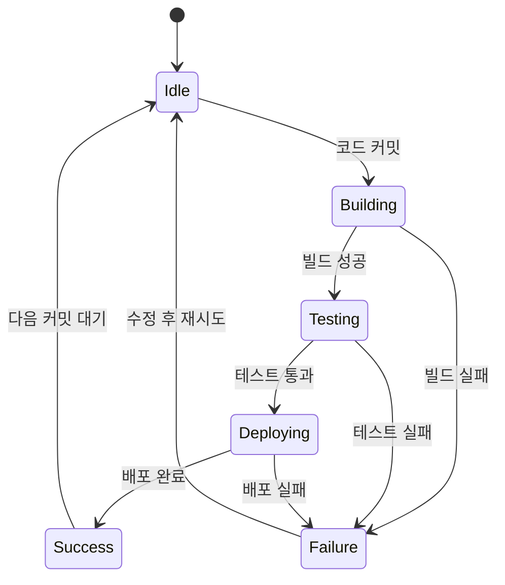

#### 2.8 Strategy (전략)

런타임에 알고리즘(테스트 전략 등)을 교체할 수 있다.

**GitLab CI 전략 패턴 예시:**

```yaml
stages:
  - test

variables:
  UNIT_TEST_PROJECT: my_project_unit_tests
  INTEGRATION_TEST_PROJECT: my_project_integration_tests
  PERFORMANCE_TEST_PROJECT: my_project_performance_tests

# 전략 1: 단위 테스트
unit_tests:
  stage: test
  script:
    - echo "Running unit tests..."
    - gitlab-runner exec docker test --env CI_PROJECT_DIR=$UNIT_TEST_PROJECT

# 전략 2: 통합 테스트
integration_tests:
  stage: test
  script:
    - echo "Running integration tests..."
    - gitlab-runner exec docker test --env CI_PROJECT_DIR=$INTEGRATION_TEST_PROJECT

# 전략 3: 성능 테스트
performance_tests:
  stage: test
  script:
    - echo "Running performance tests..."
    - gitlab-runner exec docker test --env CI_PROJECT_DIR=$PERFORMANCE_TEST_PROJECT
```

#### 2.9 Template Method (템플릿 메서드)

파이프라인의 기본 구조를 정의하고, 세부 단계는 하위 클래스에서 구현한다.

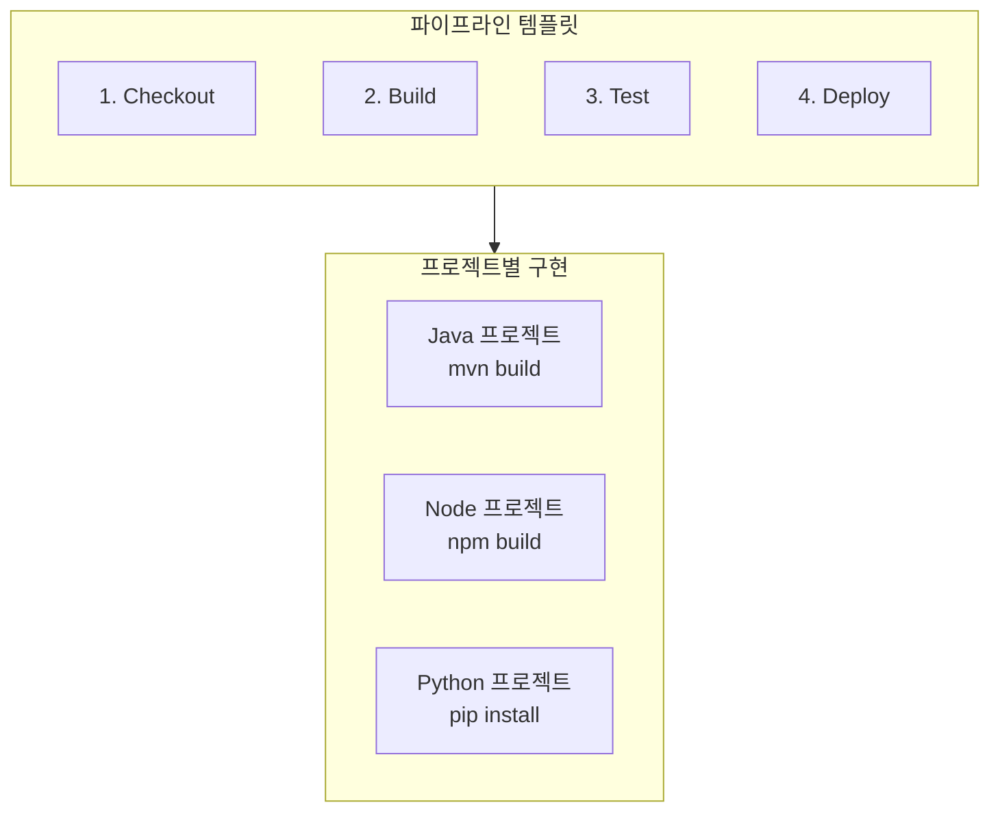

#### 2.10 Visitor (방문자)

코드 변경 유형(기능 추가, 버그 수정, 리팩토링)에 따라 다른 처리를 적용한다.

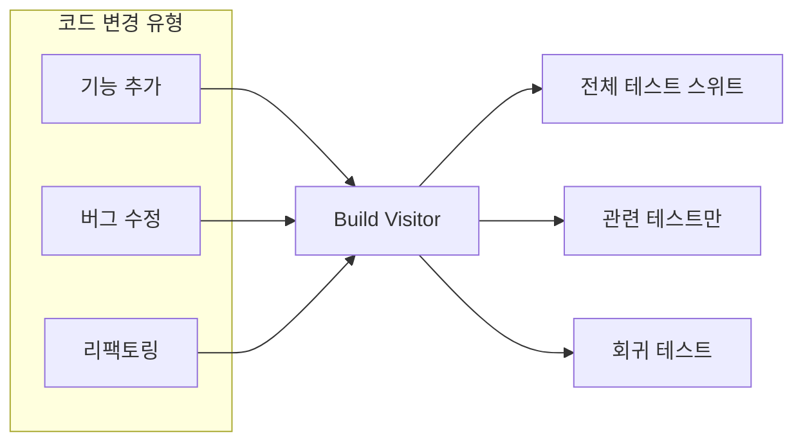

---

### 3. 행동 CI/CD 설계 원칙

#### 3.1 관찰성(Observability) 통합

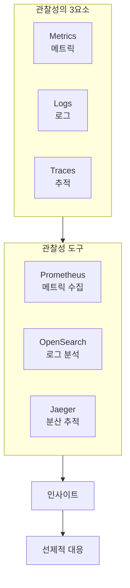

#### 3.2 주요 표준 및 도구

| 표준/도구 | 역할 |
|-----------|------|
| **CDEvents** | CI/CD 도구 간 이벤트 상호운용성 표준 |
| **OCI** | 컨테이너 형식 및 런타임 표준 |
| **Pipeline as Code** | 파이프라인 설정의 버전 관리 |
| **Tekton** | 오픈소스 CI/CD 컴포넌트 |
| **Spinnaker** | 멀티클라우드 CD 플랫폼 |
| **GitOps** | Git을 단일 진실 소스로 사용 |
| **Prometheus/Grafana** | 메트릭 수집 및 시각화 |
| **OWASP** | 보안 가이드라인 |

---

### 4. AI 기반 관찰성

#### 4.1 CI/CD 도구 및 단계

```mermaid
flowchart LR
    subgraph Source["소스 제어"]
        Git[Git/GitHub/GitLab]
    end

    subgraph Build["빌드"]
        Maven[Maven/Gradle]
        Jenkins[Jenkins]
    end

    subgraph Test["테스트"]
        JUnit[JUnit]
        Selenium[Selenium]
        Postman[Postman]
    end

    subgraph Deploy["배포"]
        Docker[Docker]
        K8s[Kubernetes]
        Ansible[Ansible]
    end

    subgraph Notify["알림"]
        Slack[Slack]
        Email[Email]
        PagerDuty[PagerDuty]
    end

    subgraph AIObserve["AI 관찰성"]
        Datadog[Datadog]
        Prometheus2[Prometheus]
        NewRelic[New Relic]
    end

    Source --> Build --> Test --> Deploy --> Notify
    Deploy --> AIObserve
    AIObserve --> Notify
```

#### 4.2 AI 관찰성의 역할

| 영역 | AI 관찰성 기능 |
|------|---------------|
| **이상 감지** | 비정상 패턴 자동 식별 |
| **장애 예측** | 잠재적 병목 현상 사전 경고 |
| **근본 원인 분석** | 자동화된 RCA (Root Cause Analysis) |
| **보안 위협 탐지** | 비정상 코드 변경, 접근 패턴 감지 |
| **자동 대응** | 위협 감지 시 자동 격리 |
| **규정 준수** | 보안 표준 자동 검증 |

---

### 5. BDD (Behavior-Driven Development) 통합

#### 5.1 BDD 워크플로우

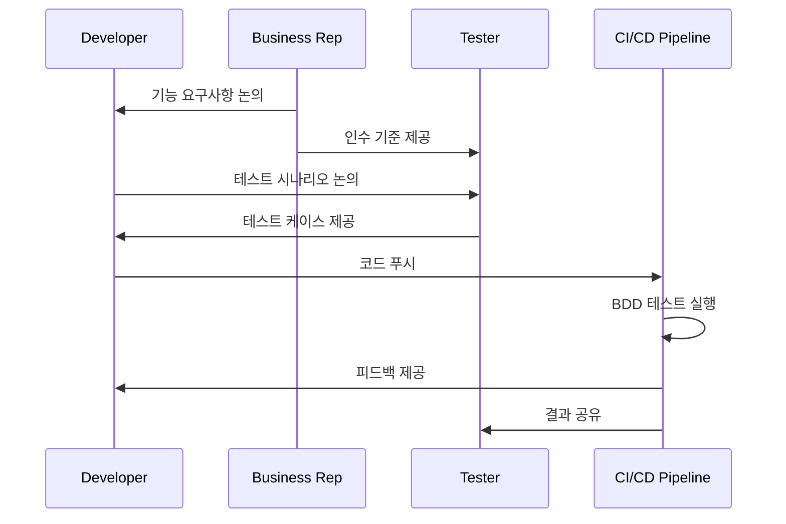

#### 5.2 BDD 핵심 실천법

| 실천법 | 설명 |
|--------|------|
| **Three Amigos 세션** | 비즈니스, 개발, 테스트 담당자 협업 회의 |
| **Gherkin 문법** | Given-When-Then 형식의 시나리오 작성 |
| **시나리오 자동화** | Cucumber, SpecFlow, Behave 도구 사용 |
| **Living Documentation** | 항상 최신 상태의 문서 역할 |

**Gherkin 예시:**

```gherkin
Feature: 사용자 로그인

  Scenario: 유효한 자격 증명으로 로그인
    Given 사용자가 로그인 페이지에 있다
    When 유효한 이메일과 비밀번호를 입력한다
    And 로그인 버튼을 클릭한다
    Then 대시보드 페이지로 이동해야 한다
    And 환영 메시지가 표시되어야 한다

  Scenario: 잘못된 비밀번호로 로그인 시도
    Given 사용자가 로그인 페이지에 있다
    When 유효한 이메일과 잘못된 비밀번호를 입력한다
    And 로그인 버튼을 클릭한다
    Then 에러 메시지가 표시되어야 한다
```

#### 5.3 BDD의 이점과 도전

| 이점 | 도전 |
|------|------|
| 커뮤니케이션 개선 | 초기 학습 곡선 |
| 품질 향상 | 시나리오 유지보수 부담 |
| 협업 강화 | 추가 시간/노력 필요 |
| 살아있는 문서화 | 팀 문화 변화 필요 |

---

### 6. 구현 도전과제 및 해결 방안

#### 6.1 주요 도전과제

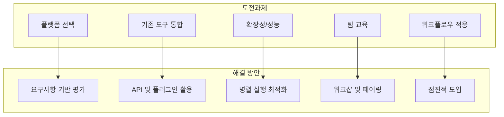

#### 6.2 구현 단계

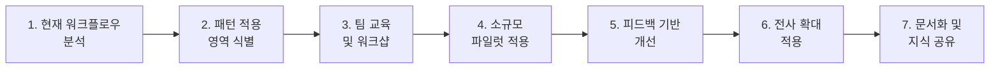

#### 6.3 행동 패턴 적용 흐름 예시

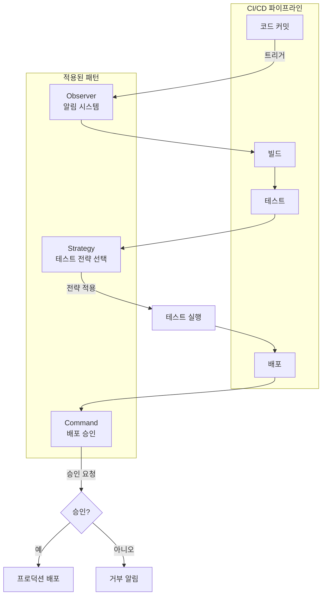

---

## 🔍 심화 학습

### 추가 조사 내용

- **AIOps (AI for IT Operations)**: AI 기반 IT 운영 자동화, 이상 감지, 예측적 분석
- **Chaos Engineering과 행동 패턴**: 시스템 회복력 테스트와 Observer, State 패턴 연계
- **MLOps와 CI/CD**: 머신러닝 모델 파이프라인에서의 행동 패턴 적용

### 출처
- [CDEvents 공식 문서](https://cdevents.dev/)
- [Cucumber BDD 프레임워크](https://cucumber.io/)
- [OpenTelemetry 관찰성](https://opentelemetry.io/)
- [Tekton Pipelines](https://tekton.dev/)

---

## 💡 실무 적용 포인트

### 이런 상황에서 사용하세요

- **Chain of Responsibility**: 파이프라인 스테이지 간 느슨한 결합이 필요할 때
- **Observer**: 빌드/테스트 결과에 따른 자동 알림 시스템 구축
- **Strategy**: 환경, 브랜치, 코드 복잡도에 따른 테스트 전략 동적 변경
- **Memento**: 롤백이 필수적인 프로덕션 배포
- **State**: 복잡한 파이프라인 상태 관리 및 에러 처리

### 주의할 점 / 흔한 실수

- ⚠️ **과도한 패턴 적용**: 단순한 파이프라인에 모든 패턴을 적용하려 하지 말 것
- ⚠️ **BDD 시나리오 폭발**: 너무 많은 시나리오는 유지보수 부담 증가
- ⚠️ **관찰성 오버헤드**: 과도한 메트릭/로그 수집은 성능 저하 유발
- ⚠️ **AI 의존성**: AI 도구를 맹신하지 말고 휴먼 검증 병행

### 면접에서 나올 수 있는 질문

- Q: CI/CD에서 Observer 패턴은 어떻게 활용되나요?
- Q: Strategy 패턴과 Template Method 패턴의 차이점은 무엇인가요?
- Q: BDD의 Three Amigos 세션이란 무엇이며 왜 중요한가요?
- Q: AI 기반 관찰성이 전통적인 모니터링과 다른 점은 무엇인가요?
- Q: Memento 패턴이 Blue-Green 배포에서 어떻게 활용되나요?

---

## ✅ 핵심 개념 체크리스트

- [ ] 10가지 행동 설계 패턴의 CI/CD 적용 사례를 각각 설명할 수 있는가?
- [ ] Observer와 Mediator 패턴의 차이를 이해하고 있는가?
- [ ] Strategy 패턴을 GitLab CI/GitHub Actions에서 구현할 수 있는가?
- [ ] BDD의 Gherkin 문법으로 시나리오를 작성할 수 있는가?
- [ ] AI 기반 관찰성의 주요 도구(Datadog, Prometheus, New Relic)를 알고 있는가?
- [ ] 행동 패턴 구현의 도전과제와 해결 방안을 설명할 수 있는가?

---

## 🔗 참고 자료

- 📄 공식 문서: [CDEvents Specification](https://cdevents.dev/)
- 📄 공식 문서: [Cucumber BDD](https://cucumber.io/docs/)
- 📄 공식 문서: [OpenTelemetry](https://opentelemetry.io/docs/)
- 🎬 추천 영상: [Design Patterns in CI/CD](https://www.youtube.com/@ContinuousDeliveryFoundation)
- 📚 연관 서적: "Design Patterns: Elements of Reusable Object-Oriented Software" (GoF)

---
