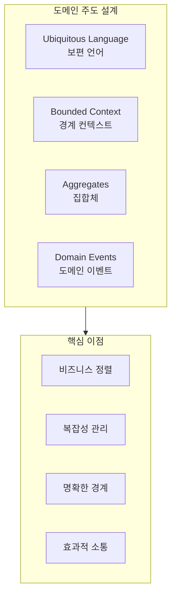
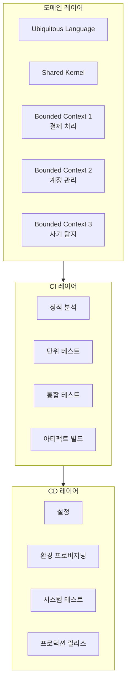
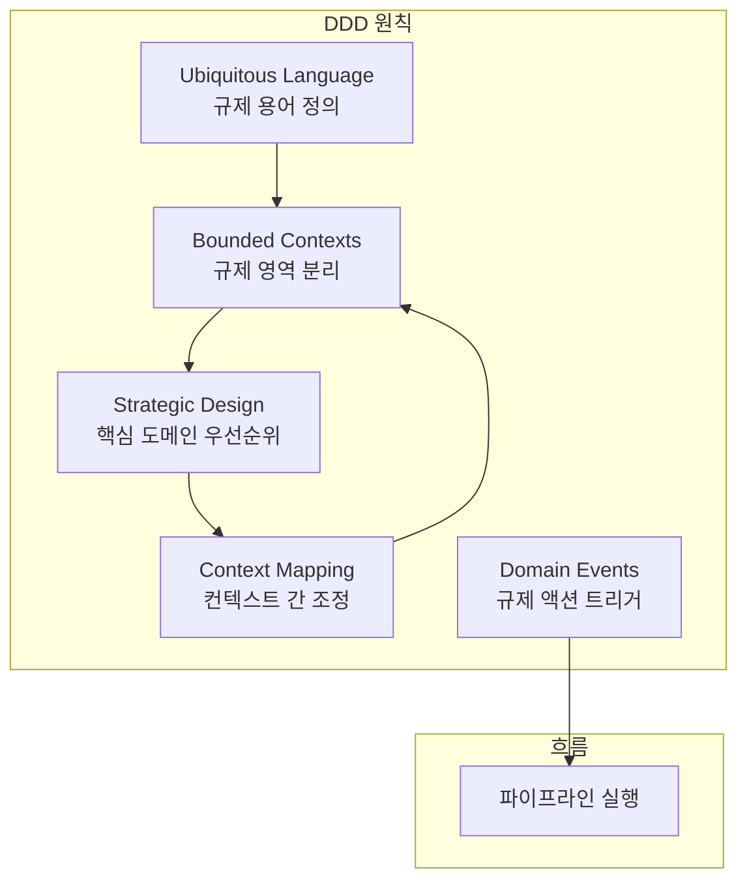
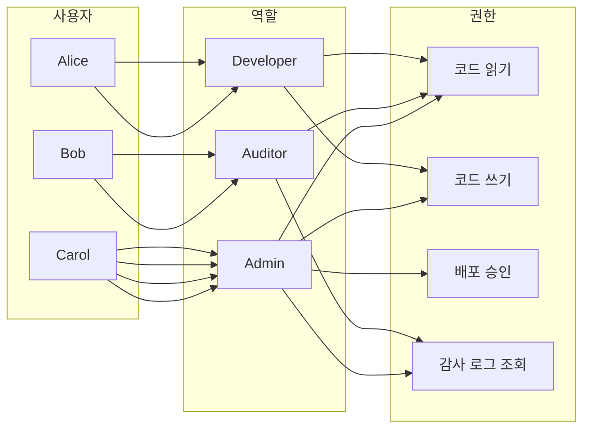
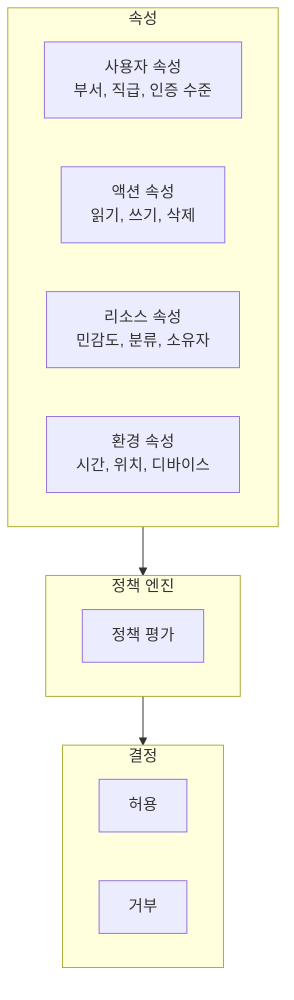
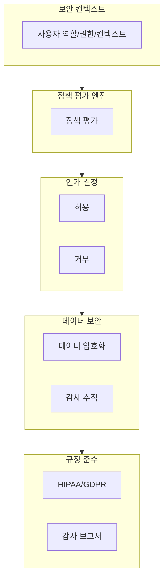
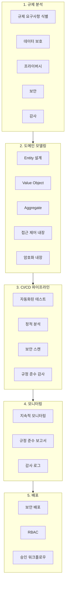
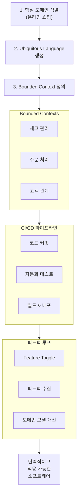
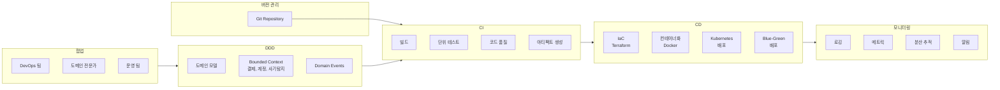
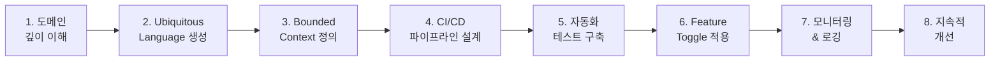

---

## 📌 핵심 요약
> 이 장에서는 **규제 산업(금융, 의료, 정부)**에서 **도메인 주도 설계(DDD)**를 CI/CD에 적용하는 패턴을 다룬다. 핵심은 **Bounded Context**로 도메인을 분리하고, **Ubiquitous Language**로 소통하며, **RBAC/ABAC**로 접근을 제어하고, **GDPR/HIPAA/PCI DSS** 등 규제 준수를 파이프라인에 통합하는 것이다.

## 🎯 학습 목표
이 내용을 읽고 나면:
- [ ] DDD의 핵심 개념(Bounded Context, Ubiquitous Language, Aggregate, Domain Events)을 설명할 수 있다
- [ ] 규제 산업에서 CI/CD 파이프라인에 DDD 원칙을 적용하는 방법을 이해할 수 있다
- [ ] RBAC와 ABAC의 차이점과 적용 시나리오를 구분할 수 있다
- [ ] 주요 규제(GDPR, HIPAA, PCI DSS)의 CI/CD 적용 방법을 설명할 수 있다
- [ ] 규제 액션을 CI/CD 파이프라인에 통합하는 전략을 수립할 수 있다

## 📖 본문 정리

### 1. 도메인 주도 설계(DDD) 개요

DDD는 **비즈니스 도메인의 복잡성**을 정확하게 반영하는 소프트웨어 설계 접근법이다.

> 💬 **비유**: DDD는 건축 청사진과 같다. 건물의 각 구역(Bounded Context)에 적합한 설계를 적용하고, 모든 이해관계자가 같은 용어(Ubiquitous Language)로 소통한다.

---

### 2. 도메인 주도 CI/CD 설계 패턴

#### 2.1 Bounded Context와 CI/CD

각 Bounded Context는 독립적인 마이크로서비스로 매핑되며, 개별적으로 개발, 테스트, 배포된다.

#### 2.2 도메인 주도 CI/CD의 이점

| 이점 | 설명 |
|------|------|
| **커뮤니케이션 향상** | 공통 언어로 개발자, 도메인 전문가, 이해관계자 간 소통 개선 |
| **복잡성 감소** | 핵심 도메인에 집중하여 기술 부채 최소화 |
| **품질 향상** | DDD 패턴(Entity, Aggregate, Domain Event) 적용으로 신뢰성 증가 |
| **빠른 배포** | Feature Toggle, Canary, Blue-Green 배포 자동화 |
| **확장성** | 도메인 경계에 맞춘 독립적 확장 가능 |
| **문제 해결 용이** | 명확한 경계로 문제 식별 및 해결 간소화 |

---

### 3. DDD 원칙과 규제 액션 구현

규제 액션(Regulation Actions)은 코드 리뷰, 보안 스캔, 감사, 승인, 문서화 등 규정 준수를 보장하는 단계이다.

#### 3.1 DDD 원칙별 규제 적용

| 원칙 | 규제 적용 방법 |
|------|---------------|
| **Ubiquitous Language** | 규제 액션의 기준, 규칙, 기대치를 공통 언어로 정의 |
| **Bounded Contexts** | 서브도메인별 규제 액션 격리, 의존성 충돌 방지 |
| **Strategic Design** | 핵심 도메인에 규제 액션 우선순위 부여 |
| **Context Mapping** | 컨텍스트 간 규제 액션 조정, 일관성 보장 |
| **Domain Events** | 이벤트를 트리거로 규제 액션 자동 실행 |

---

### 4. 접근 제어 (Access Control)

규제 산업에서 접근 제어는 DDD의 핵심 구성요소이다.

#### 4.1 RBAC (Role-Based Access Control)

역할에 권한을 연결하여 관리를 단순화한다.

#### 4.2 ABAC (Attribute-Based Access Control)

사용자, 액션, 리소스의 다양한 속성을 고려하여 세밀한 제어를 제공한다.

#### 4.3 RBAC vs ABAC 비교

| 특성 | RBAC | ABAC |
|------|------|------|
| **복잡도** | 낮음 | 높음 |
| **유연성** | 제한적 | 매우 유연 |
| **세분화** | 역할 단위 | 속성 단위 |
| **관리** | 역할 관리 | 정책 관리 |
| **적합 환경** | 정적 조직 | 동적, 복잡한 환경 |

---

### 5. 의료 애플리케이션의 접근 제어 예시

**핵심 구성요소:**
- **세분화된 인가**: 사용자 컨텍스트 기반 동적 접근 결정
- **정책 평가 엔진**: 접근 제어 정책 평가
- **데이터 암호화**: 민감 데이터(환자 기록) 암호화
- **보안 감사 추적**: 모든 접근 이벤트 기록
- **규정 준수**: HIPAA, GDPR 준수 보장

---

### 6. 규제에 따른 아티팩트 빌드

#### 6.1 주요 규제 표준

| 규제 | 적용 영역 | 핵심 요구사항 |
|------|-----------|---------------|
| **GDPR** | EU 개인정보 보호 | 데이터 수집/처리 지침, 삭제권 |
| **HIPAA** | 미국 의료정보 보호 | 환자 건강 정보 보호 표준 |
| **PCI DSS** | 결제 카드 보안 | 카드 정보 저장/전송 보안 표준 |

#### 6.2 규제 준수 CI/CD 파이프라인

#### 6.3 규제 준수 통합 도구

| 도구 | 용도 |
|------|------|
| **SonarQube** | 코드 품질 및 보안 분석 |
| **OWASP ZAP** | 보안 취약점 스캔 |
| **ComplianceAsCode** | 규정 준수 자동화 |
| **Trivy** | 컨테이너 취약점 스캔 |

---

### 7. DDD와 CI/CD 통합 예시

#### 7.1 전자상거래 회사 사례

#### 7.2 금융 서비스 결제 시스템 예시

---

### 8. DDD 구현 시 성능 고려사항

#### 8.1 주요 도전과제

| 도전과제 | 해결 방안 |
|----------|----------|
| **복잡한 도메인 모델** | 모듈식 아키텍처로 분리 테스트/배포 |
| **학습 곡선** | 팀 교육 투자, 점진적 도입 |
| **DDD-CI/CD 불일치** | DDD 모델과 CI/CD 목표 정렬 |
| **과도한 세분화** | 핵심 도메인에 집중 |
| **커뮤니케이션 부족** | 정기적인 도메인 워크숍 |

#### 8.2 성공적인 DDD 구현 단계

---

### 9. 규제 산업별 DDD 적용 예시

| 산업 | 적용 사례 |
|------|-----------|
| **금융** | 결제 처리 Bounded Context 분리, 계정 관리/사기 탐지와 격리 |
| **의료** | 환자 기록 관리와 치료 프로토콜 분리, HIPAA 준수 |
| **정부** | 사업자 등록과 규정 준수 검사 분리, 복잡한 워크플로우 반영 |

---

## 🔍 심화 학습

### 추가 조사 내용

- **Event Sourcing과 CQRS**: DDD와 함께 사용되는 이벤트 기반 아키텍처 패턴
- **Saga Pattern**: 분산 트랜잭션 관리를 위한 마이크로서비스 패턴
- **Anti-Corruption Layer**: 레거시 시스템과 새 도메인 모델 간 번역 계층

### 출처
- "Domain-Driven Design" by Eric Evans
- "Implementing Domain-Driven Design" by Vaughn Vernon
- [ComplianceAsCode 문서](https://complianceascode.readthedocs.io/)
- [OWASP 보안 가이드](https://owasp.org/)

---

## 💡 실무 적용 포인트

### 이런 상황에서 사용하세요

- **복잡한 비즈니스 로직**: 단순 CRUD가 아닌 복잡한 도메인 규칙이 있을 때
- **규제 산업**: 금융, 의료, 정부 등 엄격한 규정 준수가 필요할 때
- **마이크로서비스 전환**: 모놀리식에서 마이크로서비스로 전환 시 경계 정의
- **대규모 팀**: 여러 팀이 동일 도메인에서 작업할 때

### 주의할 점 / 흔한 실수

- ⚠️ **단순 도메인에 DDD 적용**: 복잡한 비즈니스 규칙이 없으면 과도한 오버헤드
- ⚠️ **Ubiquitous Language 무시**: 기술팀과 비즈니스팀 간 용어 불일치
- ⚠️ **Bounded Context 과다 분할**: 너무 세분화하면 관리 복잡성 증가
- ⚠️ **규제 액션 자동화 부족**: 수동 규제 검증은 병목 현상 유발

### 면접에서 나올 수 있는 질문

- Q: Bounded Context란 무엇이며 마이크로서비스와 어떤 관계가 있나요?
- Q: RBAC와 ABAC의 차이점은 무엇이며 언제 각각을 사용하나요?
- Q: DDD에서 Ubiquitous Language가 왜 중요한가요?
- Q: 규제 산업에서 CI/CD 파이프라인에 규정 준수를 어떻게 통합하나요?
- Q: Domain Events를 활용한 규제 액션 자동화 방법을 설명해주세요.

---

## ✅ 핵심 개념 체크리스트

- [ ] DDD의 핵심 개념(Bounded Context, Aggregate, Entity, Value Object)을 설명할 수 있는가?
- [ ] Ubiquitous Language의 중요성과 적용 방법을 이해하고 있는가?
- [ ] 규제 산업에서 DDD 원칙을 CI/CD에 적용하는 방법을 알고 있는가?
- [ ] RBAC와 ABAC의 차이를 구분하고 적절한 상황에 적용할 수 있는가?
- [ ] GDPR, HIPAA, PCI DSS의 기본 요구사항을 알고 있는가?
- [ ] Domain Events를 활용한 규제 액션 트리거 방법을 설명할 수 있는가?

---

## 🔗 참고 자료

- 📚 필수 도서: "Domain-Driven Design" by Eric Evans
- 📚 실무 도서: "Implementing Domain-Driven Design" by Vaughn Vernon
- 📄 공식 문서: [ComplianceAsCode](https://complianceascode.readthedocs.io/)
- 📄 공식 문서: [OWASP Security Guidelines](https://owasp.org/)
- 🎬 추천 영상: [Domain-Driven Design Europe](https://www.youtube.com/@daboraddevconf)

---
